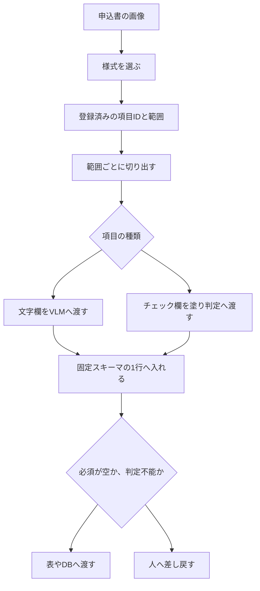

同じ申込書が繰り返し届くとき、用紙のどこを読むかと、下流が受け取る1行の形は、別々に決めます。人が様式上の範囲を登録し、実行時はその範囲だけを切り出して項目ごとに読み、項目IDが固定された1行へ組み立てます。

この記事では、その登録が持つ情報と実行時の流れを説明したうえで、列の欠落を自動確定の前に止める条件を仕様へ書く手順まで扱います。試行回数と所要時間は、しろくま研究室の公開記事に書かれた自己申告であり、製品の上限は各社の公開ドキュメントに書かれた範囲だけを使います。

*この記事の全体像。以下、順に解説します。*

## 範囲を登録する帳票OCRとは

定型の申込書を繰り返し読む設計では、用紙画像の渡し方と、下流が受け取るレコードの形を分けます。人が様式上の範囲を登録し、実行時はその範囲だけを切り出して項目ごとに読みます。結果は項目IDが固定された1行に組み立てます。読めなかった項目も列を残し、空の値として返します。使うのは、同じ様式が何度も来る入力担当と、その結果を表やデータベースへ流す後工程です。

### 登録が持つ情報

しろくま研究室の設計記事では、登録のまとまりをテンプレートと呼んでいます。登録の操作は、画像の上で読む範囲を塗って、項目名を付けることです。

登録が持つのは、次の5つです。

- 項目ID。様式の中で固定します。同記事の例では、F01が申込日、F02が氏名です。
- 範囲。実行時に切り出す領域です。
- 種類。文字欄とチェック欄を分けます。
- 必須かどうか。
- 空のときの値。

文字欄は、切り出した画像を、画像を入力できるモデル（VLM）へ渡します。チェック欄は別手段にできます。同記事では、塗りの有無を機械的に測り、迷うものを人へ回す3値にしています。

出力は毎回同じ列順のレコードです。CSVやデータベースの列が、行ごとにずれません。登録は上書きせず、名前を変えて残します。同記事は、精度が落ちたときに前の版と比較するためだと書いています。

構造化出力は、JSON Schemaでキーと型を指定し、返答の形を縛る機能です。読む範囲は、登録した切り出しが決めます。モデルが返すのは1項目分の中身です。列の集合は登録側が作り、モデルの返答が列を増減させません。

### 実行時の流れ

実行時は、様式を選び、登録済みの範囲を切り出し、種類に応じて文字欄とチェック欄を分け、固定スキーマの1行へ入れます。必須が空であるか、チェック欄が判定不能なら、その行は人へ差し戻します。どちらでもなければ、表やデータベースへ渡します。

## 注意点

ここまでの説明に使った数値は、公開記事の自己申告と、用語集の定義です。範囲を広げて読む前に、どこまでを事実として扱えるかを分けます。

### 完全一致が指す範囲

実験の記事は、キャンプ場の利用申込書1様式で、13項目が4回とも完全一致したと報告しています。内訳はテキスト系11項目とチェックボックス群2つで、箱の数は6個です。4回の内訳は、同じ画像の2回、画質を落とした版、少し縮小した版です。確認した記入は、印字と手書き風フォントの両方です。項目の例は、氏名、ふりがな、生年月日、電話番号、メール、住所、参加人数、宿泊プラン、利用日程、レンタル品、自由記述です。

同じ記事は、実物の手書き、スキャンの傾き、影、かすれ、写真の歪み、この様式以外は試していないと書いています。試行が4回なので、記事自身が「精度が高い」ではなく「この様式では安定して全項目が読めた」と限定しています。様式も記入内容も、実験のために作った架空のものです。

### 4分半は1台の自己申告

実験の記事は、1枚あたり4分半くらいと書いています。実行環境は mac mini M4 です。設計の記事は、この時間の主な理由を、項目ごとに1回ずつ処理することだと書いています。この時間は、その実装とその機械での自己申告であり、範囲を切る方式一般の速度ではありません。用紙全体を1回渡す方が速い、という比較も同記事の記述であり、その秒数は書かれていません。

### 1様式を14回作り直している

設計の記事は、キャンプ申込書1枚のためにテンプレートを14回作り直したと書いています。内訳は次のとおりです。

| 段階 | 内容 | 回数 |
|---|---|---|
| 作る | 全項目で作って直す | 3 |
| 分けて調べる | チェック欄だけを切り出す | 1 |
| 分けて調べる | 文字の項目だけを切り出す | 3 |
| 分けて調べる | 隣り合うチェック欄を切り分ける | 3 |
| 戻して直す | 全項目に戻して直す | 4 |

現行の v8 でも、申込日の値に印字の「日」が混ざると、同じ記事が画面を見て書いています。表示例は「日 令和8年7月20日」です。列の形が固定されても、値はまだラベルを含みます。14回の各回に何時間かかったかは記事にありません。担当者の工数見積もりには使えません。

### ゾーンOCRという語の範囲

「帳票OCRでは何十年も前からある」は、設計の記事の表現です。一次として確認できる定義は、PFUのfiシリーズ用語集です。そこではゾーンOCRを、PaperStream Captureの機能として、定型フォーマットの指定した位置の文字を認識するものと説明しています。起源の年はこのページにありません。

二次の解説が載せる「精度95%から99%」のような帯は、分母と試験セットがページ内で閉じていないため、ここでは採用しません。

### まだ閉じていない問い

次の4点は、公開記事と公式ガイドの範囲では決まっていません。

- 実手書き、傾き、影、かすれで、範囲登録と全体画像のどちらが先に壊れるかは未測定です。
- 設計の記事が試した「構造化出力」が、OpenAIのstrictと同等の制約だったかは記事から分かりません。ローカル実行の文法制約は、製品ごとに失敗の仕方が違います。
- 空文字を「用紙が空」と「読めなかった」のどちらに使うかは、列を残すだけでは決まりません。
- チェック欄の機械判定が、印刷やスキャンの汚れで未選択を選択にする率は、この様式では測られていません。

## 用紙全体を1回渡すと欠ける列

設計の記事の最初の設計は、申込書を1枚のままVLMへ渡し、読む項目名をプロンプトに並べるものでした。テキスト11項目のはずが10項目で返り、メールの列がありません。空文字ではなく、キーがありません。エラーにもなりません。「ふりがな」が「フリガナ」になります。中身が合っていても、後工程からは別の列です。チェック欄6個は当たらなかった、と書いています。消える列と揺れる名前は、回ごとに変わります。

その後、構造化出力でキーを縛ることも試した、と設計の記事は書いています。縛れたのは答えの形で、モデルが見ている範囲は用紙全体のままだった、という整理です。どの製品の構造化出力かは記事に書かれていません。

OpenAIのStructured Outputsは、指定したJSON Schemaに出力を合わせ、requiredのキーが欠けることを心配しなくてよい、と公式ガイドが説明しています。全フィールドをrequiredにし、空であり得る値は`null`とのunionにします。objectのプロパティは合計5,000まで、入れ子は10段までです。安全上の拒否はスキーマ通りではなく、`refusal`として返ります。出力トークンの上限に達すると、応答は不完全になり得ます。公式が書いている保証は、キーと型とenumの形です。切り出した欄の文字が用紙と一致することまでは、このガイドの保証に含まれません。

切り出しに移したあと、設計の記事は範囲の広さで値が変わったと報告しています。狭いと文字が欠け、広いと印字が値に入ります。日付欄を広めに囲ったとき、返ってきた値は「申込日　令和8年7月20日」でした。氏名欄を広げ、朱印が写り込まない位置へずらすと、モデルも指示も変えずに結果が動いた、と書いています。これは著者の観察であり、独立した再現は公開されていません。

## 四つの読み方を比べる

繰り返す帳票の読み方は、少なくとも4つあります。入力の単位と、空欄の残り方が違います。

| 観点 | 用紙全体を1回、項目名だけ指定 | 範囲を登録し、固定IDの1行に組み立てる | 定型向けの学習モデル | 学習なしの汎用フォーム解析 |
|---|---|---|---|---|
| 入力の単位 | 用紙全体 | 登録した範囲 | 用紙と、人が付けたフィールドラベル | 用紙全体 |
| 出力の形 | プロンプト任せ。キーが欠けることがある（設計の記事の例） | 登録側が列を作る。欠測は空として残る（同記事の設計） | 学習時の`fields.json`やprocessor schema | 検出したキーと値。利用者がスキーマを渡す前提ではない |
| 空欄 | キー欠落だと、空欄と未検出が区別できない（同記事の例） | 列は残る。空の意味は別の状態が要る | Googleのtemplate modeは、空欄でも期待領域を囲んでラベルできる | Form Parserは、未記入値のキーと値を安定して解析できないと公式が書く |
| 配置が変わるとき | 登録が不要な代わりに、探す範囲が広い | 範囲を直す。同記事は版を上書きしない | Azureのtemplateは変種ごとにモデルを分ける。公式は、対応できるなら精度のためにneuralを勧める | 配置の揺れを学習で吸収する経路ではない |
| 速度の一次情報 | 設計の記事は、1回の方が速いと書く。秒数は無い | 実験の記事は約4分半（mac mini M4、自己申告） | Azureのtemplate学習は1から5分。推論の秒数はこのページに無い | 公式ページに推論の秒数は書かれていない |
| 向く条件 | 形が割れても人が全部見るとき | 同じ様式が繰り返され、列の欠落を機械的に落とすとき | 見た目が揃った帳票を、ラベル付きサンプルで学習できるとき | よくある項目を、固定IDに後段で寄せられるとき |

### Azureのcustom template

Azure Document Intelligenceのcustom template（v4.0 GAのLearn、2026-10-04閲覧）は、視覚的なテンプレートが一貫した帳票から、ラベルしたキー、選択マーク、表、署名、領域を取ります。配置の揺れは精度に影響します。変種があるときは、変種ごとに少なくとも5件でモデルを分け、composeできる、とcustom templateのページが書いています。

学習の開始には、templateとneuralのどちらも、ラベル済み文書が少なくとも5件必要です。データセット全体でフィールド定義の`fields.json`は1つです。templateは重なりフィールドに対応しません。学習データは最大500ページ、合計50MBです。分析の入力は、有料tierで最大2,000ページ、500MBです。無償枠は先頭2ページ、4MBです。画像の辺は50ピクセルから10,000ピクセルです。抜き出す文字の高さの下限は、1024×768の画像で12ピクセルで、約8ポイントを150dpiで読んだ大きさに相当する、と公式が書いています。

言語と抽出シナリオがcustom neuralを使えるなら、精度のためにtemplateよりneuralを使うよう、公式は勧めています。視覚構造が変わる帳票では、テンプレートを増やす負担が理由になります。

### Googleのtemplate modeとForm Parser

Google Document AIのtemplate-based extraction（ページの最終更新は2026-09-30 UTC）は、固定レイアウトなら学習3件、テスト3件から始められる、と書いています。空欄のフィールドもラベルしてよい。囲むのは、値が入り得る領域の全体です。件数が最小を超えても品質は上がりにくいので、少数を正確にラベルするよう案内しています。評価は、完全一致と、大文字小文字の差などを許すfuzzyを切り替えられます。

GoogleのForm Parserは、よくある帳票のキーと値、表、チェック欄を、追加学習なしで取ります。単純な表については学習できない、と公式が書いています。チェック欄は、近くの文字をキーにし、塗りつぶしか否かをvalueTypeにします。ラジオボタンは対象外です。検出されたチェック欄にキーが無いことがあります。未記入のキーと値は安定して解析できません。固定IDへの対応は、後段の仕事です。

## 全体画像から構造を学習する経路

Donut（Geewook Kimほか、arXiv:2111.15664、ECCV 2022）は、別のOCRエンジンを挟まず、文書画像からJSONを生成します。論文HTMLのTable 2では、field-level F1と、TEDに基づくaccuracyと、所要時間が次のとおりです。

| データ | 規模 | F1 | accuracy | 所要時間 |
|---|---|---|---|---|
| CORD（領収書） | ユニークフィールド30、訓練0.8K、検証0.1K、テスト0.1K | 84.1 | 90.9 | 1.2秒/画像 |
| 中国語の鉄道切符 | 8フィールド、訓練1.5K、テスト0.4K | 94.1 | 98.7 | 0.6秒/画像 |

field-level F1は、1文字でも欠けるとそのフィールドを失敗とします。切符データについて論文は、各キーは1回だけ現れ、各フィールドの位置は固定だと書いています。速度の測定はP40 GPUです。Table 1の95.30%と752msは文書分類（RVL-CDIP）であり、項目抽出ではありません。

同じ論文は、出力トークンの構造が壊れていれば、そのフィールドを喪失として扱うと書いています。開始トークンだけで終了トークンが無い場合がその例です。正しいJSONで誤った文字列を返した場合は、この規則では落ちません。

この結果は、人が範囲を塗らなくても、文書種別を学習したモデルが全体画像から構造を出せることを示します。ゼロショットで任意のVLMに用紙を1枚渡す話とは別です。日本語の申込書、実手書き、印影、空欄での比較は、この表にはありません。所要時間はGPU上の別タスクであり、実験の記事の4分半と並べて優劣にしません。

## 列が毎回あることを合格条件にする

同じ様式が繰り返されるなら、合格条件の第1項は文字の正解率ではなく、必須列が毎回存在し、欠けるか判定不能なら自動確定しないことです。範囲登録はそのための入力単位です。配置が変わる様式まで、同じ手作業を既定にはしません。

この整理を支える事実は、次の5つです。

- 設計の記事の全体渡しでは、指定した列がキーごと消え、名前も揺れました。固定IDと空欄残しは、その欠落を数えないと気づけない状態への対処です。
- OpenAIのstrictなStructured Outputsは、requiredの欠落を形式として防ぎます。値の正しさは別問題として残ります。
- Donutも、構造が壊れたフィールドを喪失として数えます。形の検査は、全体画像方式でも契約になり得ます。
- AzureのtemplateとGoogleのtemplate modeは、見た目が揃った帳票に対し、人がフィールドと領域を教える前提で公式が手順を書いています。
- PFUの用語集は、定型の指定位置を読む機能としてゾーンOCRを定義しています。

同時に、範囲登録だけが答えではありません。

- 完全一致は、印字と手書き風フォント、1様式、4試行です。傾きや実手書きでの方式比較は未試験だと、実験の記事が書いています。
- Azureは、言語と抽出シナリオがcustom neuralを使えるなら、精度のためにtemplateよりneuralを使うよう勧めています。
- Form Parserは、ゾーンを手で塗らずにキーと値とチェック欄を取ります。ただし未記入値は安定しない、と公式が書いています。
- Donutの切符実験は、位置が固定された帳票でも、全体画像とfine-tuneで高いF1を出しています。範囲登録だけが固定位置の読み方ではありません。
- チェック欄を画素数や単純な閾値だけで決めると、印刷やスキャンの汚れで未選択を選択にし得ます。Lokeほか（PLOS ONE、2018）の要約は、印刷artefactがある用紙の直接比較で、pixel countingの感度98.4%、特異度95.6%、単純thresholdingの感度100.0%、特異度38.3%と報告しています。同じ要約の別試験では、訓練された記入者の5,695件でソフトウェア誤分類がなく、未訓練の6,000件で誤分類が2件でした。対象はbubbleとboxであり、設計の記事のレ点欄の率ではありません。位置が画素単位で合わないと、テンプレート差分の残り画素が判定に混ざる、と本文が書いています。

### 仕様の先頭に書く3行

繰り返す1様式について、仕様の先頭に次の3行を書きます。

1. 固定スキーマ。項目ID、型、必須、空のときの値、判定不能のときの値を1表にします。モデルの返答で列を増減させません。
2. 差し戻し。必須が空、またはチェック欄が判定不能なら、その行を自動確定しません。文字の一致率は、この関門の後に置きます。
3. 更新できる人。範囲とスキーマを改版できる担当を1名書きます。前の版は残し、読取結果に様式の版IDを入れます。

この3行が要る条件は、同じ紙が繰り返され、後工程が列位置に依存することです。紙の種類が毎回変わるなら、先に分類するか、配置の揺れを扱うモデルかを比較し、下流のスキーマだけをこの3行に合わせます。

コードをモデルへ渡す前処理との対応は、次のとおりです。渡す単位は、リポジトリ全体ではなく、今の問いに必要な範囲です。下流が依存する形は、その範囲とは別に固定します。帳票では前者が切り出し、後者が項目IDと差し戻しです。構造化出力は後者の一部であり、前者の代わりではありません。

直近の作業は3つに限ります。

1. 対象の1様式で、必須列と「空」と「判定不能」を表にします。F01を申込日、F02を氏名にするなら、列はそのIDで固定し、空と判定不能は別の値にします。値の字面は、チームが1つに決めます。
2. その表にないキー、または必須の空を、確定処理が拒否するテストを先に書きます。
3. 範囲を直した人と日付が、結果の版IDから辿れるようにします。

## まとめ

繰り返す帳票では、用紙のどこを読むかと、下流が受け取る列の形を分けます。範囲の登録は入力の単位であり、項目IDの固定と差し戻しは出力の契約です。構造化出力は列の形を縛れても、用紙のどこを読むかまでは縛りません。

完全一致の4回と、1枚4分半は、1様式・1台の自己申告です。配置が変わる帳票では、テンプレートを増やす前に、学習モデルや汎用のフォーム解析と比較します。同じ紙が繰り返され、後工程が列位置に依存するときだけ、固定スキーマ、差し戻し、版を残す担当の3行を仕様の先頭に置きます。

この記事が少しでも参考になった、あるいは改善点などがあれば、ぜひリアクションやコメント、SNSでのシェアをいただけると励みになります！

## 参考リンク

- [しろくま研究室「AI-OCRで全部いっぺんに読ませるのをやめたら、あとで使えて漏れチェックもしやすくなった」](https://zenn.dev/polargiver/articles/kamiscan-ocr-template-design)（2026-10-03公開、2026-10-04取得）
- [しろくま研究室「ローカルLLMだけではんこ・レ点・和暦入りの申込書を読むAI-OCRを作った」](https://zenn.dev/polargiver/articles/kamiscan-local-llm-ocr)（2026-08-16公開、2026-10-04取得）
- [PFU「ゾーンOCR」](https://www.pfu.ricoh.com/fi/digitarakuru/glossary-0011.html)（2026-10-04取得）
- [Microsoft Learn「Document Intelligence custom models」](https://learn.microsoft.com/en-us/azure/ai-services/document-intelligence/train/custom-model?view=doc-intel-4.0.0)（2026-10-04取得、v4.0 GA）
- [Microsoft Learn「custom template」](https://learn.microsoft.com/en-us/azure/ai-services/document-intelligence/train/custom-template?view=doc-intel-4.0.0)
- [Microsoft Learn「generating labeled datasets」](https://learn.microsoft.com/en-us/azure/ai-services/document-intelligence/train/custom-labels?view=doc-intel-4.0.0)
- [Google Cloud「Template-based extraction」](https://cloud.google.com/document-ai/docs/ce-template-based)（ページ表記の最終更新 2026-09-30 UTC）
- [Google Cloud「Form Parser」](https://cloud.google.com/document-ai/docs/form-parser)
- [OpenAI「Structured model outputs」](https://developers.openai.com/api/docs/guides/structured-outputs)（2026-10-04取得）
- [Kim, G. ほか「OCR-free Document Understanding Transformer」（ECCV 2022、論文HTML）](https://arxiv.org/html/2111.15664)
- [同論文のDOI](https://doi.org/10.1007/978-3-031-19815-1_29)
- [Loke, S.C., Kasmiran, K.A., Haron, S.A.「A new method of mark detection for software-based optical mark recognition」（PLOS ONE、2018）](https://doi.org/10.1371/journal.pone.0206420)
