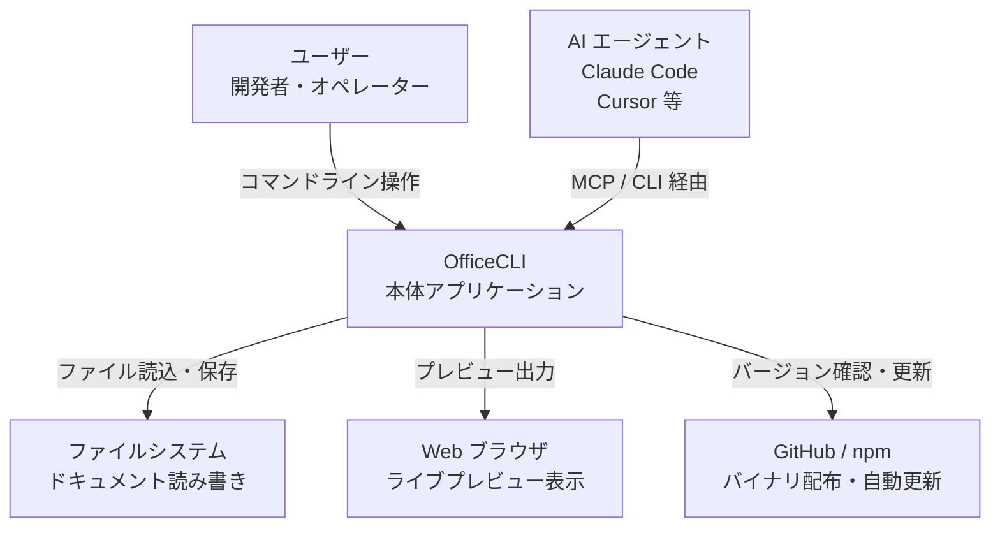
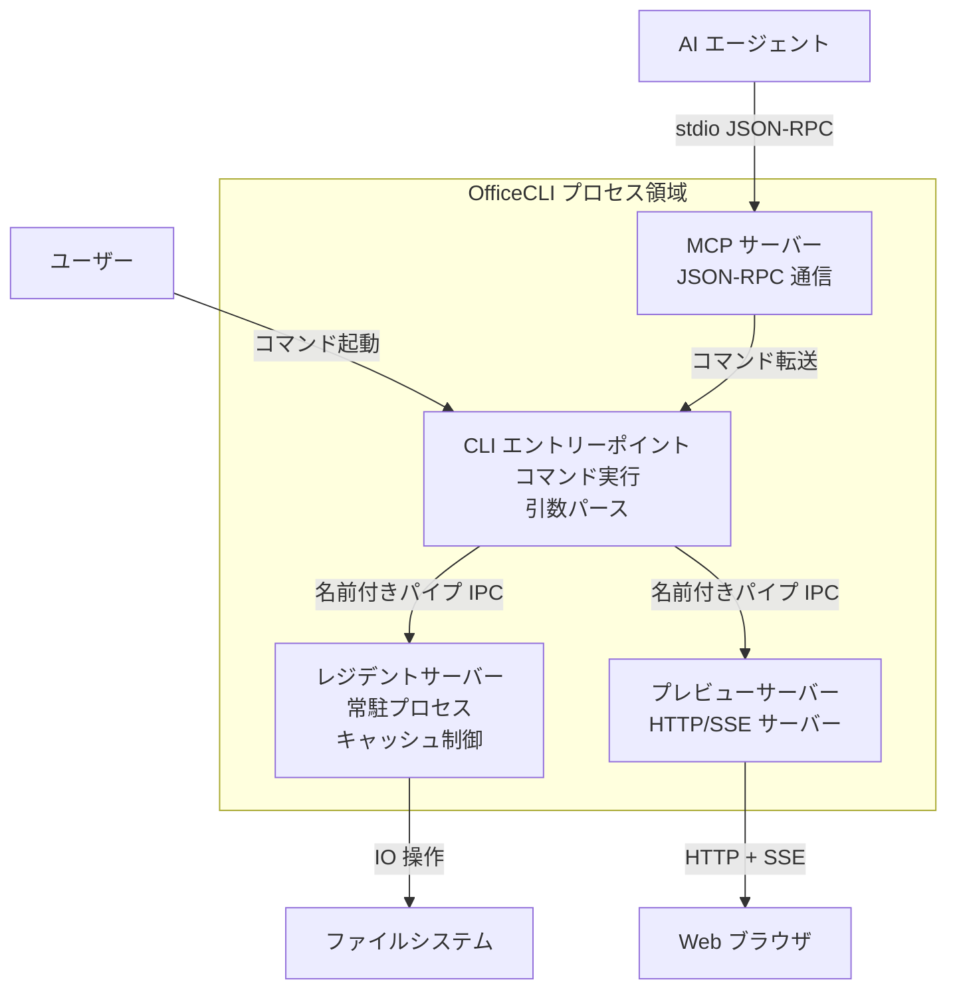
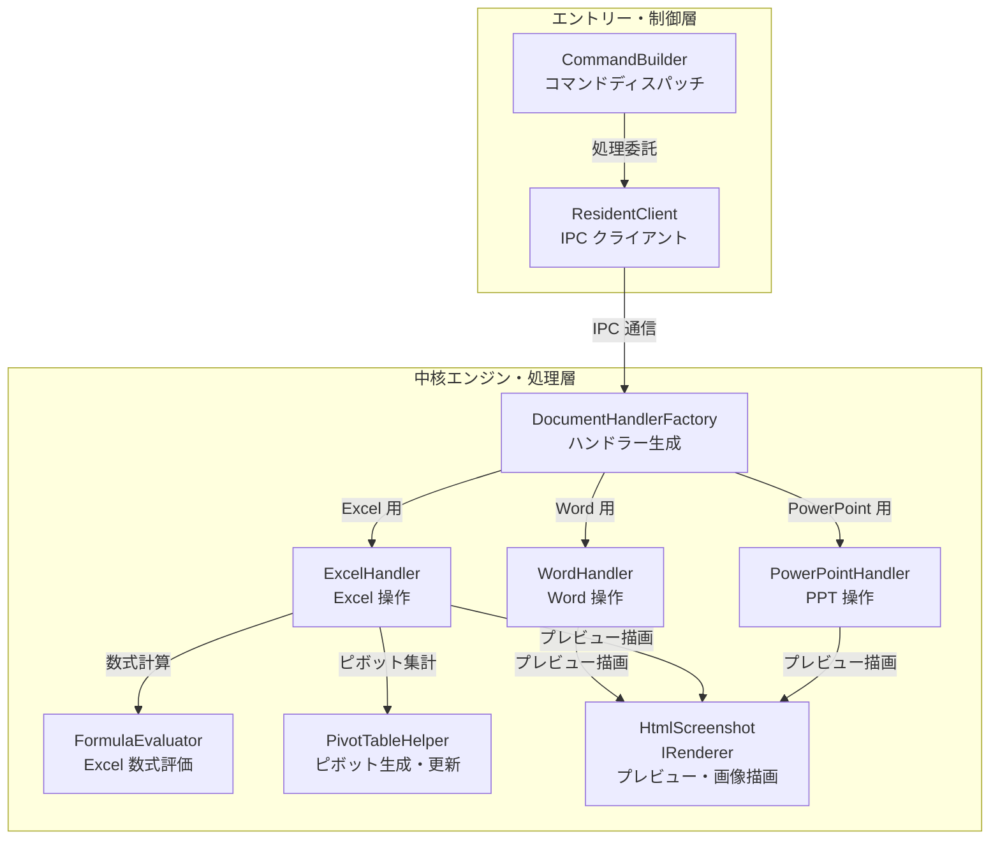
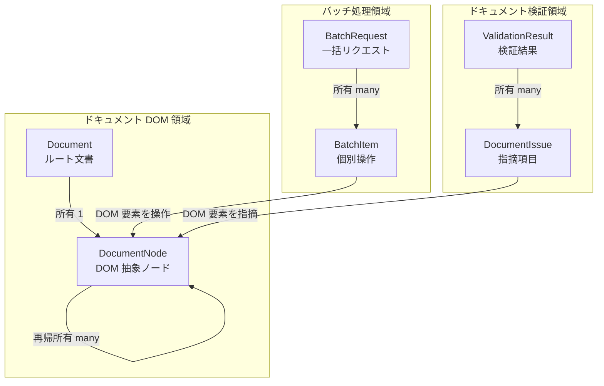
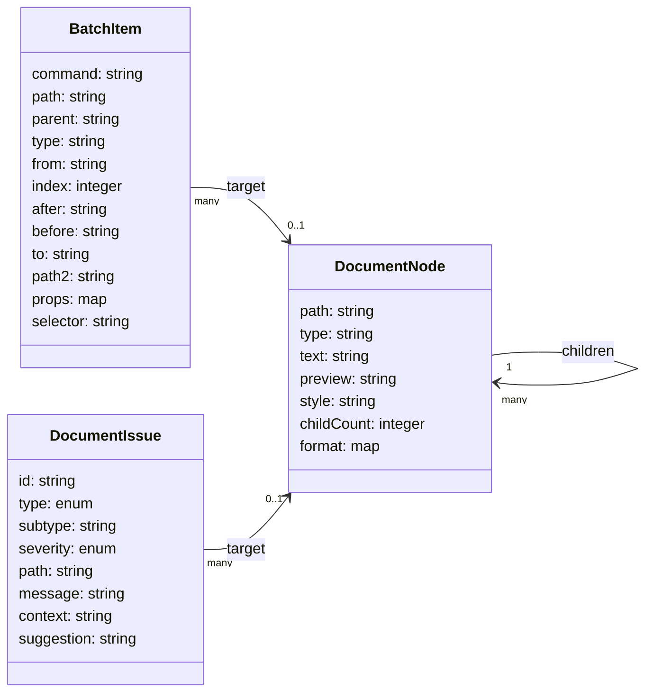

> 本記事は OfficeCLI のコードベース（commit SHA [`4ba79f0`](https://github.com/iOfficeAI/OfficeCLI/commit/4ba79f0b984e141f57f58d4398ba2df29e8187e8)、確認日 2026年7月16日）の実装と実ファイル構造を照合して整理しました。

## 概要

OfficeCLI は、AI エージェントや開発者が Microsoft Office をインストールせずに Word（.docx）、Excel（.xlsx）、PowerPoint（.pptx）をコマンドラインから生成・解析・編集するオープンソースのシングルバイナリツールです。

最大の強みは、独立した高精度な HTML/PNG レンダリングエンジンを内蔵する点です。AI エージェントは、生成したドキュメントの視覚レイアウト（テキストの折り返し、要素の重なり、フォントの再現性）を「目」で確認できます。これにより、検証から修正までの自己修復ループをプログラム内で完結できます。

## 特徴

### 1. AI エージェントに最適化されたインターフェース

- **構造化 JSON 出力**: すべてのコマンドが `--json` オプションに対応し、安定したスキーマで結果を返します。
- **パスベースの指定**: `/slide[1]/shape[@id=123]` や `/body/p[3]` のような一貫した 1-based インデックスのパスで要素を特定します。
  - **XPath フィルタ構文**: 属性フィルタ（`[@id=123]`, `[@name=Title]`）、条件指定（`[value>5000]`, `[style=Normal]`）、論理演算（`and`, `or`）、関数型フィルタ（`:contains("text")`, `:empty`, `:has(formula)`, `:no-alt`）に対応します。
- **自己修復支援**: エラー発生時に、不正値の範囲や正しいプロパティ名の提案（自動スペル修正）を含む構造化エラーを返します。

#### JSON 出力ペイロード例

- **正常取得時（`officecli get slides.pptx '/slide[1]/shape[1]' --json`）**
  - 要素のプロパティは `attributes` オブジェクトにまとめて返ります。

  ```json
  {
    "path": "/slide[1]/shape[1]",
    "attributes": {
      "name": "TextBox 1",
      "text": "Revenue grew 25%",
      "x": "720000",
      "y": "1800000"
    }
  }
  ```

- **エラー発生時（自動スペル修正提案を含む）**
  - `success: false` とともに、`code` と `suggestion` を含む `error` オブジェクトを返します。

  ```json
  {
    "success": false,
    "error": {
      "error": "Slide 50 not found (total: 8)",
      "code": "not_found",
      "suggestion": "Valid Slide index range: 1-8"
    }
  }
  ```

### 2. 独立した高度な処理エンジン

- **数式評価エンジン**: Excel 互換の 350 以上の関数を内蔵し、ファイル保存時に自動で再計算します。動的配列（`UNIQUE`、`SORT` など）や財務計算にも対応します。
- **ピボットテーブルエンジン**: コマンド 1 つでデータ範囲からピボットテーブル定義とキャッシュを自動生成します。Excel 開封時に即座に集計を表示します。
- **レンダリングエンジン**: Office のライセンスやデスクトップ GUI がないヘッドレス環境（Docker、CI/CD など）でも、HTML や PNG 形式で高精度なプレビューを生成します。

### 3. 生産性を高める編集・自動化機能

- **テンプレートマージ（`merge`）**: `{{key}}` 形式のプレースホルダーを持つテンプレートに JSON データを高速に差し込みます。レイアウトの崩れを防ぎ、低トークンコストで大量のドキュメントを生成します。
- **ラウンドトリップダンプ（`dump` / `batch`）**: 既存ドキュメントの全体または指定サブツリー（テーブルやスタイルなど）を JSON 形式で抽出し、別のファイルにバッチ適用します。
- **レジデントモード（`open` / `close`）**: プロセスをメモリ上に常駐させ、名前付きパイプで通信します。連続する編集コマンドのファイル I/O オーバーヘッドを排除し、ミリ秒単位の高速処理を実現します。

### 4. サポート制限と制約事項

- **ファイル制限（ZIP 防御制限）**: 巨大な悪意あるファイルによるリソース枯渇を防ぐため、展開後合計 2GiB、最大 100,000 ZIP エントリ、最大圧縮率 1000 までの制限をコードベース（`DocumentLimits.cs`）に実装します。
- **オブジェクト対応範囲**:
  - Word: マクロ（.docm）を内部的にバイパスし、パースと保存のみを実行。
  - Excel: 埋め込み画像以外の外部 OLE オブジェクトの一部。
  - PowerPoint: 埋め込みビデオ・オーディオの追加・削除、および位置・サイズ・音量・自動再生・トリム開始/終了などの制御。3D モデル（.glb）の位置・サイズ・名称・XYZ 回転・削除にも対応。
- **レンダリングエンジンの限界**: 高度なワードアート変形効果、一部の 3D 特殊マテリアルエフェクト、複雑なスライド内 SmartArt アニメーションの描画では、レイアウト計算の微小なズレや簡易的なフォールバック表示となる場合があります。

## 構造

### システムコンテキスト図

OfficeCLI のシステム境界と、ユーザー・AI エージェント・外部システムとの関係を示す図です。



#### システムコンテキスト構成要素

| 要素名 | 説明 |
|---|---|
| ユーザー | コマンドラインから OfficeCLI を実行してドキュメントを操作する人間。 |
| AI エージェント | Claude Code や Cursor などのコーディング助手。MCP または CLI 経由で自動でドキュメントを生成・編集。 |
| OfficeCLI | ドキュメントを操作する本体アプリケーション（本調査対象）。 |
| ファイルシステム | .docx、.xlsx、.pptx 形式のファイルを保存するローカルディスク。 |
| Web ブラウザ | `watch` コマンドのライブプレビューや `view html` 出力を表示するクライアント。 |
| GitHub / npm | 実行バイナリの配布元。起動時の自動アップデートが通信する対象。 |

### コンテナ図

OfficeCLI 内部を構成する実行単位（プロセス、サーバー、ストレージ）と、その間の通信を示す図です。



#### コンテナ構成要素

| 要素名 | 説明 |
|---|---|
| CLI エントリーポイント | コマンドライン引数をパースし、処理を振り分けるフロントエンド。レジデントクライアントとしての通信も担当。 |
| MCP サーバー | Model Context Protocol 準拠の JSON-RPC 通信を標準入出力で行い、AI エージェント向けにツールを公開する組み込みサーバー。 |
| レジデントサーバー | ドキュメントをインメモリにロードしたままキャッシュし、名前付きパイプで CLI と通信する常駐型バックグラウンドプロセス。 |
| プレビューサーバー | `watch` コマンド実行時に動作。名前付きパイプ経由で受信した編集内容を HTTP + SSE でブラウザへリアルタイム配信するプレビュー用サーバー。 |

### コンポーネント図

主要コンテナである CLI・レジデントサーバー内部の主要コードモジュールとその関係を示す図です。



#### コンポーネント構成要素

| 要素名 | 説明 |
|---|---|
| CommandBuilder | CLI 入力をパースし、各コマンド（add, set, get 等）の実行に必要な引数とプロパティを構築するモジュール。 |
| ResidentClient | レジデントサーバーが存在すれば名前付きパイプで接続し、存在しなければ自身でハンドラーを生成して処理するブリッジ。 |
| DocumentHandlerFactory | 対象ファイルの拡張子（.docx, .xlsx, .pptx）に基づき、最適なドキュメントハンドラーを構築するファクトリ。 |
| WordHandler | OpenXML フォーマットに従い、Word ドキュメントの要素（段落、表、テキストボックス等）を操作するコンポーネント。 |
| ExcelHandler | Excel シート、セル、書式設定、チャートの操作を担当するコンポーネント。 |
| PowerPointHandler | PowerPoint スライド、図形、アニメーション、3D モデルの操作を担当するコンポーネント。 |
| FormulaEvaluator / FormulaParser | Excel 内の 350 以上の数式をインメモリで解析・計算し、キャッシュ値を更新する計算評価・パース用モジュール。 |
| PivotTableHelper | Excel ピボットテーブルのキャッシュ生成、テーブル定義、再集計ロジックを担当するヘルパー。 |
| HtmlScreenshot / IRenderer | レイアウトを解析し、Office なしで HTML、PNG、SVG へレンダリングする描画インターフェースおよびスクリーンショット出力用コンポーネント。 |

### 開発者向け拡張ガイド（新規要素・コマンドの追加手順）

1. **新規要素タイプの追加**:
   - 各フォーマットのハンドラー（例: `WordHandler.cs`、`PowerPointHandler.cs`）の DOM 解析・生成ロジックに、対象要素（例: `table`、`chart`）のパース・操作コードを追加します。
   - `DocumentNode.cs` のスキーマ定義に従い、新しいノード `type` や `Format` に含むプロパティキーを整理します。
2. **新規コマンドの追加**:
   - `CommandBuilder.cs`（または `CommandBuilder.Add.cs` 等の拡張ファイル）に新規コマンドの引数パースとバリデーションロジックを追加します。
   - `IDocumentHandler.cs` に操作メソッドを定義し、レジデント処理側の `ResidentServer.cs` と通信する `ResidentClient.cs` に RPC のシリアライズ・送信処理を実装します。
3. **テストコードの追加**:
   - 追加機能の単体テスト・結合テストを、`tests/` または `OfficeCLI.Tests` プロジェクト配下のテストクラス（例: `WordHandlerTests.cs`）に追加します。
   - 開発環境で `dotnet test` を実行し、既存テストが破損しないか確認します。

## データ

### 概念モデル

OfficeCLI 内部で扱う主要データエンティティの関係と所有関係を示す概念図です。



#### 概念モデル構成要素

| 要素名 | 説明 |
|---|---|
| Document | 読み込まれた Word, Excel, PowerPoint ファイル全体を表すルートエンティティ。 |
| DocumentNode | ドキュメント内の全要素（段落、図形、セル、スライドなど）を抽象化した汎用 DOM ノード。再帰的なツリー構造を構成。 |
| BatchRequest | 1 回の I/O サイクルで処理するために CLI または API から送信される一括処理要求。 |
| BatchItem | バッチ処理に含まれる、要素の追加・削除・変更などの個々の操作。 |
| ValidationResult | `validate` または `view issues` コマンドで検出された問題の全体リスト。 |
| DocumentIssue | ドキュメントの品質基準から逸脱した箇所（数式エラー、テキスト溢れなど）を表す個々の指摘レコード。 |

### 情報モデル

主要データエンティティの具体的な属性定義と、関連の多重度を示すクラス図です。



#### DocumentNode（DOM 抽象ノード）

| 属性名 | 説明 |
|---|---|
| path | ドキュメント内の位置を示す一意のセレクタパス（例: `/slide[1]/shape[3]`）。 |
| type | 要素の種類（例: `paragraph`、`cell`、`shape`、`table`）。 |
| text | 要素が含むプレーンテキスト内容（存在する場合のみ）。 |
| preview | 要素のプレビュー表示用データ。 |
| style | 要素に適用された名前付きスタイル。 |
| childCount | 直接の子ノードの数。 |
| format | 書式設定（色、フォント、太字など）を格納するキーと値のマップ。 |

#### BatchItem（個別操作）

| 属性名 | 説明 |
|---|---|
| command | 実行する DOM 操作の種類（`add`、`set`、`remove`、`move`、`swap`）。 |
| path | 操作対象のパス。 |
| parent | 要素追加時の親ノードのパス。 |
| type | 追加する要素のタイプ（`shape`、`slide`、`run` 等）。 |
| from | コピー元要素のパス（クローン用）。 |
| index | 挿入先を指定する 0 または 1 始まりのインデックス。 |
| after / before | 挿入基準とする要素のパス（テキストアンカー形式を含む）。 |
| to | 要素の移動先の親ノードパス。 |
| path2 | `swap` コマンドで交換するもう一つの要素のパス。 |
| props | 要素に設定する書式プロパティのマップ。 |
| selector | クエリフィルタ用のセレクタ文字列。 |

#### DocumentIssue（指摘項目）

| 属性名 | 説明 |
|---|---|
| id | 指摘の一意な識別子。 |
| type | 指摘のカテゴリ分類（`Format`、`Content`、`Structure`）を表す列挙型。 |
| subtype | 機械可読な安定したエラー詳細種別（`formula_not_evaluated` など）。 |
| severity | 問題の深刻度（`Error`、`Warning`、`Info`）を表す列挙型。 |
| path | 問題が検出された要素のパス。 |
| message | 人間が読める問題の具体的な説明メッセージ。 |
| context | 問題が発生した際のコンテキストテキスト。 |
| suggestion | AI やユーザーがエラーを修復するための修正アドバイス。 |

## 構築方法

OfficeCLI は依存関係を内蔵したシングルバイナリとして配布されるため、外部ランタイムなしで動作します。

### インストール方法

- **ワンライナー（macOS / Linux）**

  ```bash
  curl -fsSL https://raw.githubusercontent.com/iOfficeAI/OfficeCLI/main/install.sh | bash
  ```

- **ワンライナー（Windows - PowerShell）**

  ```powershell
  irm https://raw.githubusercontent.com/iOfficeAI/OfficeCLI/main/install.ps1 | iex
  ```

- **パッケージマネージャー経由（マルチプラットフォーム）**

  ```bash
  # Homebrew (macOS / Linux)
  brew install officecli

  # Scoop (Windows)
  scoop install officecli

  # npm (OS に適したバイナリを自動解決)
  npm install -g @officecli/officecli
  ```

### インストール検証

- 次のコマンドを実行し、正しくインストールされてパスが通っているか確認します。

  ```bash
  officecli --version
  ```

## 利用方法

### 主要コマンドの必須引数・オプション一覧

各操作を行う主要コマンドの必須パラメータは次の通りです。

| コマンド | 必須の引数 / オプション | 目的・用途 |
|---|---|---|
| `create` | `<file>` | 空の新規ドキュメントを指定パスに作成（拡張子で型を自動判別）。 |
| `get` | `<file>` `<path>` | 指定パスの要素情報を取得。 |
| `set` | `<file>` `<path>` `--prop key=val` | 指定要素のプロパティ（書式やテキスト）を変更。 |
| `add` | `<file>` `<parent>` `--type <type>` | 指定した親ノードの末尾に新しい要素を追加。 |
| `remove` | `<file>` `<path>` | 指定パスの要素を削除。 |
| `view` | `<file>` `<mode>` | 指定ドキュメントの内容・統計・課題を各種ビューで出力。 |
| `watch` | `<file>` | ライブプレビュー用の Web サーバーを起動。 |

### Word（.docx）の基本操作（CRUD）

- **新規作成**

  ```bash
  officecli create doc.docx
  ```

- **要素（段落・表）の追加**

  ```bash
  # 見出し段落を追加
  officecli add doc.docx /body --type paragraph --prop text="プロジェクト概要" --prop style=Heading1
  # 本文段落を追加
  officecli add doc.docx /body --type paragraph --prop text="このドキュメントは OfficeCLI で作成されました。"
  # 表オブジェクト（3行4列）を追加
  officecli add doc.docx /body --type table --prop rows=3 --prop cols=4
  ```

- **要素の取得と検索**

  ```bash
  # 最初の段落の情報を JSON 形式で取得
  officecli get doc.docx '/body/p[1]' --json
  # TODO が含まれる段落をクエリ検索
  officecli query doc.docx 'paragraph:contains("TODO")'
  ```

- **要素の変更（書式変更）**

  ```bash
  # 特定の段落の文字フォントを Arial、太字に変更（正規キーを使用）
  officecli set doc.docx '/body/p[1]/r[1]' --prop font=Arial --prop bold=true
  ```

- **要素の削除・表の操作**

  ```bash
  # 2番目の段落を削除
  officecli remove doc.docx '/body/p[2]'
  # 表オブジェクトを削除
  officecli remove doc.docx '/body/table[1]'
  ```

### Excel（.xlsx）の基本操作（CRUD）

- **新規作成**

  ```bash
  officecli create data.xlsx
  ```

- **セルの値・数式の設定**

  ```bash
  # ヘッダーと値の設定（太字）
  officecli set data.xlsx /Sheet1/A1 --prop value="売上" --prop bold=true
  officecli set data.xlsx /Sheet1/A2 --prop value=5000
  officecli set data.xlsx /Sheet1/A3 --prop value=3000
  # 計算式の設定
  officecli set data.xlsx /Sheet1/A4 --prop value="=SUM(A2:A3)"
  ```

- **行・列・シートの追加と削除**

  ```bash
  # 新しいシートの追加
  officecli add data.xlsx / --type sheet --prop name="詳細データ"
  # 特定セルの値をクリア（削除）
  officecli remove data.xlsx '/Sheet1/A2'
  ```

- **セルの取得**

  ```bash
  # セルの現在値と計算された値を JSON 形式で取得
  officecli get data.xlsx '/Sheet1/A4' --json
  ```

### PowerPoint（.pptx）の基本操作（CRUD）

- **新規作成**

  ```bash
  officecli create slides.pptx
  ```

- **スライドおよび図形（テキストボックス）の追加**

  ```bash
  # 1枚目のスライドを追加（背景色を紺色に設定）
  officecli add slides.pptx / --type slide --prop title="Q4 報告" --prop background=1A1A2E
  # スライド上にテキストボックスを追加（位置、フォント、色を指定）
  officecli add slides.pptx '/slide[1]' --type shape \
    --prop text="売上は前期比 25% 増加" --prop x=2cm --prop y=5cm \
    --prop font=Arial --prop size=24 --prop color=FFFFFF
  ```

- **スライド・図形の変更と削除**

  ```bash
  # 図形の塗りつぶし色を赤色に変更
  officecli set slides.pptx '/slide[1]/shape[1]' --prop fill=FF0000
  # 特定のスライドを削除
  officecli remove slides.pptx '/slide[2]'
  ```

### 描画・視覚的確認操作

- **静的 HTML スナップショットの作成**
  - Microsoft Office を起動せずに、高精度なプレビュー HTML を作成します。

  ```bash
  officecli view slides.pptx html -o /tmp/preview.html
  ```

- **PNG 画像へのレンダリング**
  - 指定したページ（スライドなど）を PNG 画像として出力します。

  ```bash
  officecli view slides.pptx screenshot -o /tmp/slide1.png --page 1
  ```

- **PDF へのエクスポート**
  - ドキュメント全体を PDF ファイルにエクスポートします。

  ```bash
  officecli view doc.docx pdf -o /tmp/document.pdf
  ```

- **watch コマンドによるライブプレビューの起動**
  - ローカル Web サーバーを起動し、ブラウザでリアルタイムに編集結果を確認します。

  ```bash
  officecli watch slides.pptx
  ```

### 設定ファイル

- OfficeCLI のグローバル設定ファイルは通常 `~/.officecli/config.json` に保存されます。
  - **コンテナ・書込不可環境での動作**: ホームディレクトリが書き込み禁止（Read-Only）のコンテナ環境などでは、一時ディレクトリ（`/tmp` 等）の `officecli-config.json` へ自動的に代替退避（fallback）します。
- 自動アップデートの無効化などは、次のコマンドで実行します。

  ```bash
  officecli config autoUpdate false
  ```

## 運用

### レジデントプロセスのライフサイクル管理

- **プロセスの手動起動（明示的オープン）**
  - ファイル操作を連続して行う前に実行し、インメモリにドキュメントを常駐させます。毎回のファイル I/O のオーバーヘッドがなくなります。

  ```bash
  officecli open report.docx
  ```

- **ディスクへの強制保存（フラッシュ）**
  - レジデントプロセスを終了させずに、現在の編集差分のみをディスクへ書き出します。非 OfficeCLI ツールに処理を引き渡す前に実行します。

  ```bash
  officecli save report.docx
  ```

- **プロセスの終了と保存（クローズ）**
  - 編集内容をディスクへフラッシュし、常駐メモリ領域とファイルロックを解放します。

  ```bash
  officecli close report.docx
  ```

### 自動更新の制御

- **自動更新チェックの非同期化**: OfficeCLI の自動更新確認は最大 1 日 1 回、バックグラウンドの非同期処理（fire-and-forget）で実行します。通常のコマンド起動を遅延・ブロックさせません。
- **一時的な更新チェックスキップ**
  - 通信自体を完全に遮断したい CI/CD 環境や厳格なオフライン環境では、環境変数でバイパスします。

  ```bash
  export OFFICECLI_SKIP_UPDATE=1
  officecli view report.docx outline
  ```

### フォント解決・マッピング設定

- Linux などのヘッドレス環境で特定のシステムフォントが未インストールの場合、OS のフォント管理ディレクトリ（例: `/usr/share/fonts/` や `/usr/local/share/fonts/`）に TrueType フォントを配置して解決します。
- レンダリングエンジン（`HtmlScreenshot`）は、ヘッドレスブラウザが OS 登録のフォントを解決する挙動に依存します。実行環境の OS 自体にフォントを適切にインストールする必要があります。

### 異常ファイル入力時の挙動

- OfficeCLI は、破損した Zip アーカイブや壊れた OpenXML ドキュメントを読み込んだ場合、クラッシュせず例外安全に終了コード `1`（通常のパース例外）で終了します。
  - **レジデントメインパイプ配信不能時**: レジデントメインパイプへの通信・配信が不可能なケースでは、予約された終了コード `3` を返します。
  - **エラー出力**: 固定の出力メッセージではなく、発生した例外のスタックトレースや詳細情報を動的に出力します。

## ベストプラクティス

### 非 Office 環境（CI/CD、Docker）での利用

- **ヘッドレスプレビューの活用**
  - Docker コンテナ内など GUI がない環境でも、`view html` や `view screenshot` でドキュメントの最終レイアウトを静的に生成し、アーティファクトとして保存します。
- **依存関係のないデプロイ**
  - ビルドパイプライン上では、`npm` のグローバルインストールまたはバイナリの直接ダウンロードのみで動作します。Python 仮想環境や Java ランタイムの構成の手間を省略できます。

> [!IMPORTANT]
> Docker などの極小 Linux コンテナ内で HTML/PNG レンダリングを実行する場合、事前に OS パッケージマネージャーからフォントパッケージ（例: `ttf-mscorefonts-installer` 等）をインストールしてください。フォントがない場合、レイアウト計算での文字幅取得に失敗して折り返し位置がずれたり、表示テキストが文字化け（豆腐文字）する原因になります。

- **Dockerfile の記述例**

  ```dockerfile
  FROM debian:stable-slim
  RUN apt-get update && apt-get install -y curl ttf-mscorefonts-installer && rm -rf /var/lib/apt/lists/*
  RUN curl -fsSL https://raw.githubusercontent.com/iOfficeAI/OfficeCLI/main/install.sh | bash
  ENV OFFICECLI_SKIP_UPDATE=1
  ```

### 安全なバッチ・自動化の実行

- **エラー発生時の即時中断オプションの指定**
  - 複数の編集コマンドを `batch` で一括実行する際、予期しないエラーで即座に処理を中断するには `--stop-on-error` オプションを付与します。

  ```bash
  officecli batch data.xlsx --input updates.json --stop-on-error --json
  ```

- **フラッシュポリシーの調整**
  - コマンド実行直後に毎回ディスクへ保存させたい場合は、環境変数 `OFFICECLI_RESIDENT_FLUSH=each` を設定します。

### エラーコードリファレンス

操作失敗時に JSON ペイロードで返却する代表的なエラーコードと分類です。

| エラーコード | 分類 | 発生条件 | 対処 |
|---|---|---|---|
| `not_found` | リソース指定 | パスで指定したスライド、段落、セル等の要素が実在しない | インデックスの範囲（例: 1-N）や stable ID が正しいか確認。 |
| `invalid_value` | パラメータ | 指定したプロパティの値がサポート外（無効な色コード、単位など） | `officecli help` で指定可能なプロパティの有効値を確認。 |
| `unsupported_property` | パラメータ | 要素に存在しない、または書き込み不可能なプロパティ名を指定 | プロパティのスペルミス（例: `font-bold`）がないか確認。 |
| `file_locked` | ファイル I/O | 対象ドキュメントが別プロセスでロックされている | Microsoft Office や別のレジデントセッションがロックしていないか確認。 |
| `invalid_path` | 構文エラー | パス記述のシンタックスに誤りがある（角括弧の閉じ忘れなど） | パス構文に余計なスペースやシェルの文字化けがないか検証。 |
| `invalid_selector` | 構文エラー | `query` や `set` で無効なセレクタ演算子を使用 | セレクタ構文の括弧や演算子（`contains` や比較）の構成を見直し。 |

## トラブルシューティング

| 症状 | 原因 | 対処 |
|---|---|---|
| コマンドは成功するが、ディスク上のファイルに変更が反映されない。 | 常駐プロセス（レジデントモード）がインメモリにキャッシュし、ディスクへの遅延書き込み（フラッシュ）が未完了。 | 他アプリ（Python や Word 等）で読み込む前に `officecli save <file>` または `officecli close <file>` を実行し、強制的にディスクへ書き出す。 |
| Zsh や Bash でパスを指定した際に `no matches found` などのシェルエラーが発生する。 | `/slide[1]` などの角括弧 `[]` を、シェルがファイル名のグロブ展開パターンとして解釈している。 | パス引数全体をシングルクォートで確実に囲む。例: `'/slide[1]/shape[2]'` |
| コマンドが `invalid_property` エラーで失敗する。 | `--name "title"` や `--bold true` のように、属性値を CLI の直接のオプションフラグとして指定している。 | すべてのプロパティ値は `--prop` オプションを介して渡す。例: `--prop name="title" --prop bold=true` |
| ネットワークから完全に隔離された（エアギャップされた）環境や CI パイプラインで余計な通信を発生させたくない。 | 自動アップデートは非同期で起動を遅延させないが、外部への非同期通信が発生する。 | 環境変数 `OFFICECLI_SKIP_UPDATE=1` を設定するか、`officecli config autoUpdate false` を実行して更新通信自体を無効化する。 |

## まとめ

OfficeCLI は、Microsoft Office をインストールせずに Word・Excel・PowerPoint を CLI から操作できるシングルバイナリツールです。構造化 JSON 出力とパスベースの要素指定、内蔵レンダリングエンジンによる自己修復ループにより、AI エージェントが「生成して目で確認して直す」まで完結できる点が最大の特長です。

この記事が少しでも参考になった、あるいは改善点などがあれば、ぜひリアクションやコメント、SNS でのシェアをいただけると励みになります！

## 参考リンク

- 公式ドキュメント
  - [OfficeCLI Official Website](https://officecli.ai)
- GitHub
  - [OfficeCLI GitHub Repository](https://github.com/iOfficeAI/OfficeCLI)
  - [OfficeCLI Wiki Home](https://github.com/iOfficeAI/OfficeCLI/wiki)
  - [OfficeCLI Resident Mode Explanation (Wiki)](https://github.com/iOfficeAI/OfficeCLI/wiki/command-open)
  - [OfficeCLI MCP Integration Guide (Wiki)](https://github.com/iOfficeAI/OfficeCLI/wiki/command-mcp)
  - [OfficeCLI DOM Query and Path Selectors (Wiki)](https://github.com/iOfficeAI/OfficeCLI/wiki/command-query)
  - [OfficeCLI Batch Schema (Wiki)](https://github.com/iOfficeAI/OfficeCLI/wiki/command-batch)
  - [OfficeCLI Troubleshooting and Property Correction (Wiki)](https://github.com/iOfficeAI/OfficeCLI/wiki/troubleshooting)
  - [OfficeCLI Diagram Generation (Wiki)](https://github.com/iOfficeAI/OfficeCLI/wiki/diagram)
