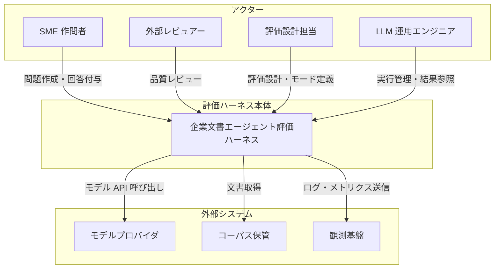
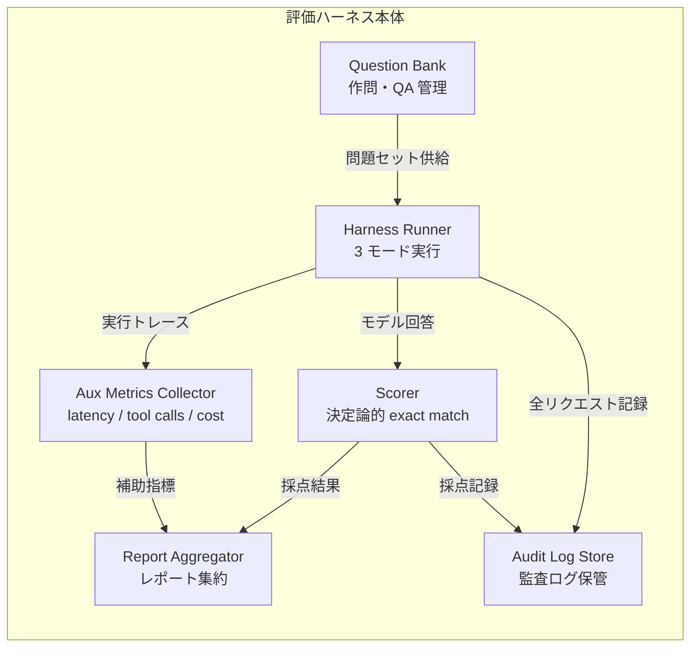
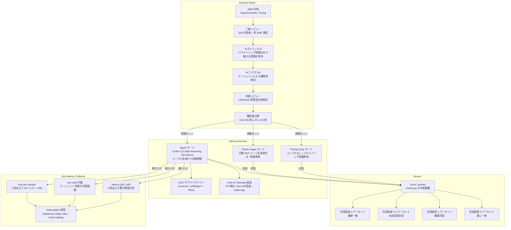
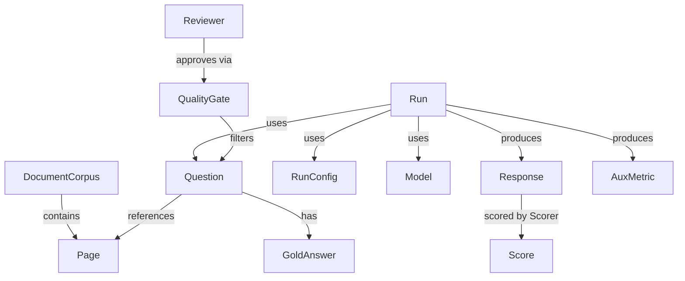
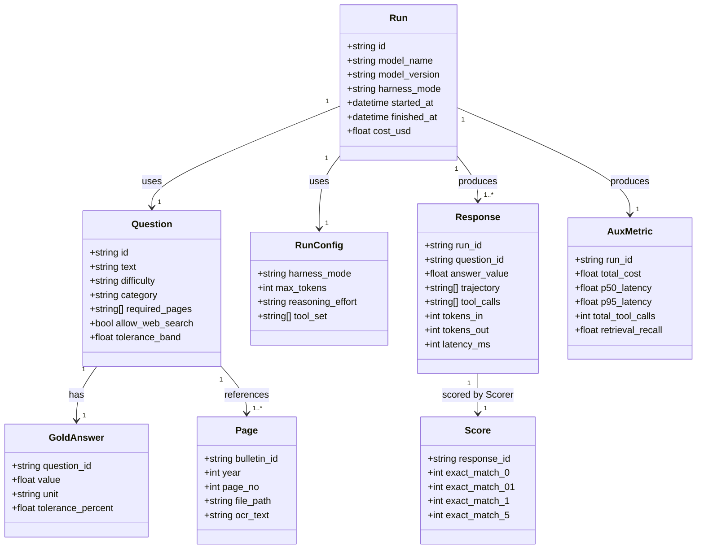

> 検証日: 2026-05-18 / 主要一次ソース: arXiv:2603.08655、Databricks Blog (2026-04-23)、GitHub `databricks/officeqa`


> Pattern B: 論文・方法論
> 調査日: 2026-05-18

---

## ■概要

2026年4月23日、OpenAI が `GPT-5.5` と `GPT-5.5 Pro` を発表し、同日 Databricks が共同ブログで **OfficeQA Pro** ベンチマーク上の比較数値を公表した。Agent Harness 設定で GPT-5.5 が **52.63%**、前世代 GPT-5.4 が **36.10%**（エラー率 46% 削減）という数値であり、Databricks は「初めて 50% を突破した SOTA」と訴求している。

OfficeQA Pro は米国財務省 Treasury Bulletins（1939〜2025年、約 89,000 ページ、2600 万以上の数値）を唯一のコーパスとする、**133 問の難問サブセット型ベンチマーク**である。問題の 99% が数値回答で構成され、評価は LLM-as-a-judge を一切使わない**決定論的 exact match**（絶対相対誤差 0%/0.1%/1%/5% の四段階）で行われる。1 問あたり人手 50 分を要する 6 層品質管理体制で作られており、高校数学までの演算で解ける設計ながら、62% の問題が線形回帰等の高度な数値分析を要求する。

このベンチマークが新しいのは、**評価ハーネスを 3 モード（LLM Prompt Only / Oracle Pages PDF / Agent Harness）に分解**し、「パラメトリック知識単体の限界」「文書アクセスで得る上乗せ」「エージェントが自律検索で失う量」を同一コーパス・同一問題セットで可視化した点にある。OpenAI×Databricks の $100M 提携によって GPT-5.5 と Codex が Databricks の Unity AI Gateway 経由で AWS/Azure/GCP 全クラウドに提供され、この評価ハーネスと実行基盤が一体として提案される構造になっている。

ただし「企業文書エージェントの汎用 SOTA」と受け取るのは早計である。ベンチマーク作者・parser ベンダー・OpenAI 提携相手がすべて Databricks という**三重の利益相反**が存在し、同じ GPT-5.5 が SWE-Bench Pro（汚染耐性設計）では Claude Opus 4.7 に敗北する。**「米国行政の財務統計 PDF に限定した参考値」として読み解き、評価ハーネス設計の方法論を自社に転用する**ことが本題材の実践的な価値である。

---

## ■特徴

1. **133 問の難問サブセット設計**
   OfficeQA Full（246 問）から Claude Opus 4.5 と GPT-5.1 の両方が正解した「Easy」113 問を除外した Pro サブセット。フロンティアモデル評価に特化しており、Full を評価コストとして半分に節約しつつ識別力を維持する発想は自社 golden set 設計に直接転用できる。

2. **決定論的 exact match（LLM-as-a-judge 不採用）**
   99% が数値回答という性質を生かし、評価スクリプト `reward.py` の許容誤差（0.0%/0.1%/1.0%/5.0%）で採点する。verbosity bias・position bias・self-preference bias といった LLM judge の系統バイアスを構造的に排除している。

3. **3 モード・ハーネス分解**
   LLM Prompt Only（パラメトリック知識）/ Oracle Pages PDF（推論単体）/ Agent Harness（Codex CLI による自律検索＋推論）の 3 条件を同一問題で評価することで、「文書アクセスで得る精度（0.75% → 57.14%）」と「自律検索で失う精度（Oracle 65% → Agent 53%）」を 2 軸で可視化できる。

4. **6 層品質管理（人手 1 問平均 50 分）**
   SuperAnnotate/Turing SME による作問 → 二者レビュー → モデルフィルタ（パラメトリック知識のみで解ける問題を除外）→ AI 二パス QA → USAFacts 外部レビュー → 難易度分割の 6 段階を経て作られており、合成 LLM 生成を一切使わない人手作問の高密度設計である。

5. **補助指標（latency / tool calls / cost）の公式採用**
   Agent Harness では精度スコアに加え、1 問あたりの実行時間・ツール呼び出し件数・API コストを公開している。GPT-5.4 の Full Corpus PDF 条件では latency 13.1 分・cost $1.79/問 に対し、Parsed 条件では 3.6 分・$1.26/問 と大幅改善する。コスト効率を採用判断に組み込む指標設計の参考になる。

6. **Codex CLI Agent Harness による end-to-end 評価**
   「高 reasoning モード・最大 50k 出力トークン」の Codex CLI をエージェント実行環境に採用し、コーパス全体からの文書発見・パース・計算を一本通しで評価する。PDF 解析失敗率 40〜50%（ベースライン条件）というデータが「解析層を切り出して測定する必要性」の定量的根拠となっている。

7. **Unity AI Gateway 統合（Databricks 上での実行統制）**
   GPT-5.5 を Databricks 経由で呼ぶ場合、認可（Unity Catalog）・PII 検出・prompt injection 防御・MCP tool 呼び出し全件監査・自動フェイルオーバー・Delta tables へのログ集約・統合請求の 6 機能が一体提供される。価値の本質はモデル価格（OpenAI 直叩きと同額）ではなく**ガバナンスレイヤ**にある。

8. **三重利益相反（設計思想の批判的読解が必須）**
   ベンチマーク作者＝Databricks、OfficeQA Pro 内で 16.1% の相対改善を生む `ai_parse_document`＝Databricks 製パーサ、評価されたモデルの提携相手＝OpenAI という構造。Databricks は 2021 年 TPC-DS ベンチで Snowflake とベンダー戦争を起こした前例があり、スコアを採用判断に使う際は**この利益相反を必ず注釈する**必要がある。

9. **単一ドメイン制約（汎化の限界）**
   コーパスは英語・米国政府・財務統計 PDF に完全に限定されており、日本語・契約書・社内マニュアル・コードへの汎化は論文も保証していない。同じ GPT-5.5 が汚染耐性設計の SWE-Bench Pro では Claude Opus 4.7（64.3%）に対して 58.6% と逆転負けする事実が、「OfficeQA Pro での新記録 = 汎用 SOTA」という読み方を否定している。

10. **公開資産（gated）と reproducibility の現実**
    コード（Apache-2.0）と問題データ（CC-BY-SA-4.0）は GitHub および Hugging Face（gated）で公開されているが、2026年5月時点でデータセット本体は Hugging Face の認可申請が必要。Agent Harness の実装コード本体が GitHub リポジトリに同梱されているかは確認途上であり、完全な再現性には追加の確認が必要である。

---

---

## ■構造

「企業文書エージェント評価ハーネス」の論理構造を C4 モデル風に 3 段階で表現する。
システムコンテキスト図は役割名のみで記述し、コンテナ図は論理構成要素、コンポーネント図では OfficeQA Pro / GPT-5.5 / Databricks の具体実装を反映させる。

---

### ●システムコンテキスト図



#### ## システムコンテキスト構成要素

| 要素 | 役割 | 補足 |
|---|---|---|
| LLM 運用エンジニア | 評価ハーネスを実行し、モデル選定・コスト最適化の意思決定に使う | CI/CD への組み込み、レポート読解を担う |
| 評価設計担当 | ハーネスのモード設計 (Prompt Only / Oracle / Agent) と許容誤差基準を定義する | ビジネス要件をメトリクスに翻訳する役割 |
| SME 作問者 | 専門知識を持つ人間が問題と正解を作成する | 1 問あたり平均 50 分、二者レビュー体制 |
| 外部レビュアー | 問題の現実妥当性と第三者視点からの品質保証を担う | 非営利・独立組織など利害関係を持たない存在 |
| 評価ハーネス本体 | モデルへの問い合わせ、回答採点、補助指標収集、レポート集約を一括して担う中核システム | 3 モード動作 / 決定論的採点が要件 |
| モデルプロバイダ | 評価対象の LLM API を提供する | 複数プロバイダを並走させ比較する想定 |
| コーパス保管 | 評価に用いる文書コーパスと問題セット CSV を保管する | アクセス制御が必要 (汚染防止) |
| 観測基盤 | latency / tool calls / cost 等の補助指標を蓄積・分析する | ドリフト検知・回帰管理にも使う |

---

### ●コンテナ図



#### ## コンテナ構成要素

| 要素 | 役割 | 補足 |
|---|---|---|
| Question Bank | 問題・正解・メタデータを管理し、6 層品質管理パイプラインを内包する | 問題の難易度分割 (Full / Pro) もここで管理 |
| Harness Runner | Prompt Only / Oracle / Agent の 3 モードでモデルを実行し、回答を収集する | モードを切り替えることで能力差分を可視化する設計 |
| Scorer | 決定論的 exact match で回答を採点し、許容誤差段階別のスコアを出力する | LLM-as-a-judge を使わない設計が核心 |
| Aux Metrics Collector | 実行あたりの latency / tool calls / コストを収集する | 精度同等時のコスト・速度比較を可能にする |
| Report Aggregator | 採点結果と補助指標を統合し、モード間比較レポートを生成する | 能力差分の 2 軸可視化 (文書アクセス価値 / 検索損失) |
| Audit Log Store | 全リクエスト・採点・補助指標を永続化し、再現性と監査を担保する | 訓練データ汚染調査や規制対応に使う |

---

### ●コンポーネント図



#### ## コンポーネント構成要素

| 要素 | 役割 | 補足 |
|---|---|---|
| SME 作問 (SuperAnnotate / Turing) | コーディング・数学・データ分析の有資格専門家が多ステップ推論を要する問題を作成する | trivial な trivia 形式を避け、現実的な分析タスクを重視する設計指針がある |
| 二者レビュー | Q/A 作成者と別の SME が独立してソース材料・推論・回答を検証する | 1 問あたり 50 分の人手コストはここに集中する |
| モデルフィルタ | フロンティアモデルがパラメトリック知識のみで正解できる問題を除去する | LLM Prompt Only で 0.75% しか取れないことがフィルタ有効性の証拠 |
| AI 二パス QA | AI エージェントを使い問題・回答の曖昧性と正解誤りを 2 段階で検出する | 人手レビューでは見逃しやすい数値計算ミスを拾う |
| 外部レビュー (USAFacts) | 非営利組織が問題の現実妥当性を第三者視点で検証する | ベンチマーク作者とモデルプロバイダ双方から独立した検証層 |
| 難易度分割 | Claude Opus 4.5 と GPT-5.1 の両方が正解した Easy 113 問を除き、Pro 133 問のハードサブセットを生成する | Full を回さず Pro だけ走らせることで評価コストを半減できる |
| Prompt Only モード | コーパスへのアクセスなしにモデルのパラメトリック知識だけで回答させる | GPT-5.4 でのスコアは 0.75%。文書アクセスの価値を定量化する基準値になる |
| Oracle Pages モード | 正解に必要な PDF ページだけを事前に渡し、検索ノイズを除いた推論能力のみを測る | GPT-5.4 で 54.89%-65.41%。Oracle と Agent の差 (~12pt) が検索コストを示す |
| Agent モード (Codex CLI) | Codex CLI を high-reasoning モード・最大 50k 出力トークンで動かし、コーパス全体から自律的に文書を発見・解析・計算させる | GPT-5.4 で 36.10%、GPT-5.5 で 52.63% (初の 50% 超え) |
| OCR サブパイプライン | tesseract + pdftoppm + Pillow を組み合わせたページ単位のブルートフォース抽出で、スキャン PDF に対応する | 構造化パース (ai_parse_document) 不使用時は 40-50% のパース失敗率が報告されている |
| Unity AI Gateway 経由 | PII 検出・プロンプトインジェクション防御・tool call 監査・Delta tables ログを提供する Databricks の制御プレーン | Codex CLI での評価実行もこのゲートウェイを通ることで全 tool call がトレース可能になる |
| score_answer (reward.py) | ground_truth と predicted を受け取り、数値正規化後に許容誤差比較を行う決定論的採点関数 | LLM judge を使わない。実装は `\|ŷ − y\| / \|y\| × 100` の相対誤差計算 |
| 許容誤差 4 段階 | 0% / 0.1% / 1% / 5% の相対誤差閾値で同一回答に複数スコアを付与する | 丸め誤差や近似計算の影響量を同時に観測できる設計 |
| latency p50 / p95 | 1 問あたりの実行時間分布を中央値と 95 パーセンタイルで記録する | GPT-5.4 Full Corpus PDF で平均 13.1 分、Parsed で 3.6 分という分布差が報告されている |
| tool calls 件数 | エージェントが 1 問あたりに呼び出したツールの総数を記録する | 軌道効率の代理指標。premature convergence の検知に使う |
| cost per sample | 1 問あたりの API コストを USD で記録する | GPT-5.4 Oracle Parsed で $0.33、Custom Agent ベスト構成で $6.13 という幅がある |
| Delta tables 保管 | identity / tokens / latency / cost の全ログを Databricks Delta Lake に永続化し、Unity Catalog で管理する | 顧客所有のデータとして蓄積。週次 / 月次のドリフト検知にも使える |

---


---

## ■データ

企業文書エージェント評価ハーネス「OfficeQA Pro」の概念モデルと情報モデルを示す。
一次ソース (arXiv:2603.08655 / github.com/databricks/officeqa / Databricks Blog 2026-04-23) から確認できた属性を基本とし、論文に明示されていない属性は「※推測」と注記する。

---

### ●概念モデル



#### ●エンティティ説明

| エンティティ | 役割 |
|---|---|
| DocumentCorpus | 評価対象の文書集合。OfficeQA Pro では米国財務省 Treasury Bulletins 89,000 ページ / 1939–2025 年分。 |
| Page | コーパスを構成する個別ページ。ページ番号・ファイルパス・OCR テキストを持つ最小参照単位。 |
| Question | 評価問題。難問サブセット Pro は 133 問、Full は 246 問。1 問あたり平均 ~2 文書を横断。 |
| GoldAnswer | 各 Question に対する正解値。数値回答が 99% を占め、単一の曖昧でない値として定義される。 |
| RunConfig | モデル実行条件。ハーネスモード (Prompt Only / Oracle / Agent)・トークン上限・推論設定・ツールセットを束ねる。 |
| Model | 評価対象 LLM。名称・バージョンを識別子として持つ。 |
| Run | 特定の Model × RunConfig × Question セットに対する 1 回の評価実行。 |
| Response | Run が生成した出力。回答値・思考軌跡・ツール呼び出し列・トークン数・レイテンシを含む。 |
| Score | Response を決定論的 exact match で採点した結果。許容誤差 0% / 0.1% / 1% / 5% の 4 段階を同時記録。 |
| AuxMetric | Run 単位の補助指標 (コスト・レイテンシ分位・ツール呼び出し総数・検索 Recall)。Score とは独立して集計。 |
| Reviewer | SME (コーディング / 数学 / データ分析の専門家)、AI エージェント QA、外部機関 (USAFacts) など品質管理を担う主体。 |
| QualityGate | 6 層品質管理の各チェックポイント。Question フィルタリング (モデルフィルタ / 難易度フィルタ / 外部レビュー) を担う。 |

---

### ●情報モデル



#### ●主要フィールド

| クラス | フィールド | 型 | 出典 / 補足 |
|---|---|---|---|
| Question | id | string | arXiv Table 1 の `uid` に対応 (S4, S5 GitHub README) |
| Question | text | string | HF Datasets スキーマ `question` 列 (S6) |
| Question | difficulty | string | `easy` / `pro` の 2 値。HF スキーマに `difficulty` 列が存在 (S6) |
| Question | category | string | OfficeQA Pro 論文でタスク種別を分類 (複数文書 11% / Web 必須 22% / 視覚 3% / 高度分析 62%) ※推測: 列名は未公開 |
| Question | required_pages | string[] | Oracle Pages モードで事前付与するページ一覧 ※推測: ハーネス実装内部パラメータ |
| Question | allow_web_search | bool | RunConfig に持つ可能性もあるが、問題単位の属性として存在することを arXiv が示唆 (S4) ※推測 |
| Question | tolerance_band | float | 採点許容誤差の問題ごと設定 ※推測: reward.py では Run 時に渡す |
| GoldAnswer | value | float | S5 `reward.py` の `ground_truth` 引数に対応 |
| GoldAnswer | unit | string | 数値の単位 (USD / 件数 / % 等) ※推測: 論文に単位フィールドの明示なし |
| GoldAnswer | tolerance_percent | float | reward.py `tolerance` 引数。0.0 / 0.1 / 1.0 / 5.0 を同時記録 (S5) |
| Page | bulletin_id | string | Treasury Bulletin 識別子。HF スキーマ `source_docs` URL から導出 (S6) |
| Page | file_path | string | PDF (~4GB) / Parsed JSON (~730MB) / Transformed TXT (~460MB) の 3 形式が存在 (S5) |
| Page | ocr_text | string | tesseract + pdftoppm + Pillow による OCR 出力 (S4 arXiv HTML 実験条件) |
| RunConfig | harness_mode | string | `prompt_only` / `oracle` / `agent` の 3 値 (S2, S4) |
| RunConfig | max_tokens | int | GPT-5.4 時点で 50,000 (arXiv HTML 実験条件 S4) |
| RunConfig | reasoning_effort | string | `high` / `medium` / `low` 等。GPT-5.4 は "high reasoning mode" (S4) |
| RunConfig | tool_set | string[] | Agent モードでのツール一覧 (Codex CLI / file search / vector search 等) (S4) |
| Run | model_name | string | 例: `gpt-5.4` / `gpt-5.5` |
| Run | harness_mode | string | RunConfig の harness_mode を非正規化して Run に持つ設計 ※推測 |
| Run | cost_usd | float | Full Corpus PDF: $1.79/問、Oracle PDF: $0.44/問 (GPT-5.4 実績 S4) |
| Response | trajectory | string[] | エージェントの思考ステップ列 ※推測: arXiv は trajectory の存在を言及するが列構造は未公開 |
| Response | tool_calls | string[] | ツール呼び出し列 (件数は AuxMetric でも集計) (S4) |
| Response | latency_ms | int | 分単位レポートを ms に換算。Full Corpus PDF: 13.1 分 / Oracle PDF: 4.4 分 (GPT-5.4 S4) |
| Score | exact_match_0 | int | 許容誤差 0.0% での合否 (0/1) (S5 reward.py) |
| Score | exact_match_01 | int | 許容誤差 0.1% での合否 (S5) |
| Score | exact_match_1 | int | 許容誤差 1.0% での合否 (S5) |
| Score | exact_match_5 | int | 許容誤差 5.0% での合否 (S5) |
| AuxMetric | total_cost | float | Run 全問合計の API コスト (USD) (S4) |
| AuxMetric | p50_latency | float | レイテンシ中央値 (分) ※推測: S4 は平均値のみ公表 |
| AuxMetric | p95_latency | float | レイテンシ 95 パーセンタイル ※推測: S4 未公表 |
| AuxMetric | total_tool_calls | int | Run 全問合計のツール呼び出し件数 (S4) |
| AuxMetric | retrieval_recall | float | 正解ページが検索結果に含まれた割合 ※推測: S4 は直接メトリクスとして非公開、間接指標 |

---


---

## ■構築方法

### 1. OfficeQA Pro 公式ハーネスのセットアップ

#### ●依存ライブラリの準備

公式ハーネスは Python 3.10 以上を前提とする。評価スコアラー (`reward.py`) 自体は標準ライブラリのみに依存するが、コーパスのダウンロードと前処理には以下が必要になる。

```bash
# Python 3.10 以上を確認
python --version

# 必須パッケージ
pip install datasets huggingface_hub openai

# PDF 前処理ツール (brute-force OCR パイプライン用)
# macOS
brew install tesseract poppler

# Ubuntu/Debian
apt-get install -y tesseract-ocr poppler-utils

# Python バインディング
pip install Pillow pdf2image
```

> 出典: arXiv:2603.08655 §3「Agent Framework」/ github.com/databricks/officeqa README

#### ●リポジトリのクローン

```bash
git clone https://github.com/databricks/officeqa.git
cd officeqa

# ディレクトリ構成を確認
ls -la
# reward.py        — スコアリングの中核
# corpus_scripts/  — Treasury Bulletin 前処理ユーティリティ
# *.ipynb          — 可視化ノートブック (Primary Lang: Jupyter Notebook)
```

コード部分は Apache-2.0、データ部分は CC-BY-SA-4.0 でライセンスされている。

#### ●Hugging Face 認証とデータセット取得

データセットは gated access となっており、Hugging Face アカウントでの利用申請が必要である。Web スクレイピングエージェントによる汚染防止のため、2026-05 以降すべての大容量ファイルが GitHub から Hugging Face へ移管された。

```bash
# HF アカウントでログイン (ブラウザが開く)
huggingface-cli login
# または環境変数で渡す
export HF_TOKEN=hf_xxxxxxxxxxxxxxxxxxxx
```

```python
from datasets import load_dataset
from huggingface_hub import snapshot_download

# ベンチマーク CSV の読み込み
# officeqa_pro.csv  — 133 問 (frontier model 評価用デフォルト)
# officeqa_full.csv — 246 問 (Easy 113 + Pro 133)
ds = load_dataset(
    "databricks/officeqa",
    data_files="officeqa_pro.csv",
    split="train",
)
print(ds.column_names)
# ['uid', 'question', 'answer', 'source_docs', 'source_files', 'difficulty']

# コーパスのダウンロード (transformed TXT 形式を推奨、約 460 MB)
# PDF は約 4 GB、Parsed JSON は約 730 MB のため TXT が最小構成
snapshot_download(
    repo_id="databricks/officeqa",
    repo_type="dataset",
    allow_patterns="treasury_bulletins_parsed/transformed/*.txt",
    local_dir="./data",
)
```

> 出典: github.com/databricks/officeqa README (2026-05-15 更新) / huggingface.co/datasets/databricks/officeqa

---

### 2. 自社評価ハーネスの構築

#### ●質問テーブル定義 (Pydantic + SQLAlchemy)

OfficeQA Pro の CSVスキーマ (`uid / question / answer / source_docs / source_files / difficulty`) を参考にして、自社版の質問テーブルを定義する。Pydantic で型を保証し、SQLAlchemy で永続化する構成が標準的である。

```python
# schema.py  (実装案)
from __future__ import annotations
from enum import Enum
from typing import Optional, List
from pydantic import BaseModel, Field
from sqlalchemy import Column, String, Float, JSON, Enum as SAEnum
from sqlalchemy.orm import DeclarativeBase

class Difficulty(str, Enum):
    easy   = "easy"    # フロンティア 2 モデルが両方正解した問題
    pro    = "pro"     # どちらかが不正解だった難問サブセット

class QuestionRow(BaseModel):
    uid:          str
    question:     str
    answer:       str                        # 数値文字列 or テキスト
    source_docs:  List[str]                  # Federal Reserve Archive URL 相当
    source_files: List[str]                  # 対応ローカルパス
    difficulty:   Difficulty = Difficulty.pro
    domain:       str        = "finance"     # 自社拡張: ドメイン分類

class Base(DeclarativeBase):
    pass

class Question(Base):
    __tablename__ = "questions"
    uid          = Column(String, primary_key=True)
    question     = Column(String, nullable=False)
    answer       = Column(String, nullable=False)
    source_docs  = Column(JSON)
    source_files = Column(JSON)
    difficulty   = Column(SAEnum(Difficulty), default=Difficulty.pro)
    domain       = Column(String, default="finance")
```

#### ●3 モード runner の Python スケルトン

OfficeQA Pro の評価設計では、同一問題セットを 3 つの harness モードで実行することで能力分解を行う。

- **LLM Prompt Only**: コーパスなし、パラメトリック知識だけで回答させる
- **Oracle Pages**: 正解に必要なページを事前付与、推論能力単独を測る
- **Agent Harness**: コーパス全体から自律検索・パース・計算を行わせる

```python
# runner.py  (実装案)
import os
import time
from enum import Enum
from openai import OpenAI
from schema import QuestionRow

class HarnessMode(str, Enum):
    prompt_only  = "prompt_only"   # LLM Prompt Only
    oracle_pages = "oracle_pages"  # Oracle Pages PDF
    agent        = "agent"         # Agent Harness (full corpus)

def run_question(
    client: OpenAI,
    q: QuestionRow,
    mode: HarnessMode,
    oracle_context: str = "",
    model: str = "gpt-5.5",
    reasoning_effort: str = "high",
    max_output_tokens: int = 50_000,
) -> dict:
    """1 問を指定モードで実行し、予測回答・latency・コストを返す (実装案)"""

    system = "Answer the question using only information from the provided documents."

    if mode == HarnessMode.prompt_only:
        user_msg = q.question
    elif mode == HarnessMode.oracle_pages:
        user_msg = f"Documents:\n{oracle_context}\n\nQuestion: {q.question}"
    else:  # agent mode — tool 呼び出しで自律検索 (別途 tool 定義が必要)
        user_msg = q.question

    t0 = time.monotonic()
    resp = client.responses.create(
        model=model,
        input=user_msg,
        reasoning={"effort": reasoning_effort},
        max_output_tokens=max_output_tokens,
    )
    latency = time.monotonic() - t0

    return {
        "uid":       q.uid,
        "mode":      mode,
        "predicted": resp.output_text.strip(),
        "latency_s": latency,
        "in_tokens": resp.usage.input_tokens,
        "out_tokens": resp.usage.output_tokens,
    }
```

> 実装案。OpenAI Responses API は platform.openai.com/docs/api-reference/responses を参照。

#### ●Scorer (exact match + 階段許容誤差)

`reward.py` の設計を参考に、許容誤差を 0% / 0.1% / 1% / 5% の 4 段階で集計する。

```python
# scorer.py  (実装案)
import re
import math

_PUNCT = re.compile(r"[,\s%$€£¥]")

def normalize(s: str) -> str:
    """句読点・通貨記号・空白を除去して比較可能な文字列に正規化する"""
    return _PUNCT.sub("", s).lower().strip()

def score_answer(
    ground_truth: str,
    predicted: str,
    tolerance: float = 0.0,
) -> bool:
    """
    決定論的 exact match。数値の場合は相対誤差で比較する。
    tolerance: 0.0 / 0.001 / 0.01 / 0.05 を想定
    式: |ŷ − y| / |y| <= tolerance  (OfficeQA Pro arXiv §3 の定義に準拠)
    """
    gt = normalize(ground_truth)
    pr = normalize(predicted)

    # 文字列一致を先行チェック
    if gt == pr:
        return True

    # 数値として比較
    try:
        y   = float(gt)
        y_hat = float(pr)
        if y == 0:
            return y_hat == 0
        return abs(y_hat - y) / abs(y) <= tolerance
    except ValueError:
        return False

TOLERANCES = [0.0, 0.001, 0.01, 0.05]

def score_batch(results: list[dict], questions: dict[str, str]) -> dict:
    """
    results: [{"uid": ..., "predicted": ...}, ...]
    questions: {uid: ground_truth}
    """
    totals = {t: 0 for t in TOLERANCES}
    n = len(results)
    for r in results:
        gt = questions[r["uid"]]
        for t in TOLERANCES:
            if score_answer(gt, r["predicted"], tolerance=t):
                totals[t] += 1
    return {f"acc@{t*100:.1f}%": v / n for t, v in totals.items()}
```

> 出典: github.com/databricks/officeqa reward.py / arXiv:2603.08655 §3 Evaluation Metrics

#### ●GitHub Actions による PR ゲート

L1 (Output Eval) を PR ごとに自動実行する yaml サンプルである。133 問フルは高コストになるため、Easy サブセット 20 問程度を smoke test に使うのが現実的である。

```yaml
# .github/workflows/eval-gate.yml  (実装案)
name: Agent Eval Gate

on:
  pull_request:
    branches: [main]

jobs:
  eval:
    runs-on: ubuntu-latest
    timeout-minutes: 30
    env:
      OPENAI_API_KEY: ${{ secrets.OPENAI_API_KEY }}
      HF_TOKEN:       ${{ secrets.HF_TOKEN }}

    steps:
      - uses: actions/checkout@v4

      - uses: actions/setup-python@v5
        with:
          python-version: "3.11"

      - name: Install dependencies
        run: pip install datasets huggingface_hub openai

      - name: Run eval (smoke — 20 questions)
        run: |
          python eval/run_smoke.py \
            --mode prompt_only oracle_pages agent \
            --n 20 \
            --out results/pr-${{ github.run_number }}.json

      - name: Check accuracy gate
        run: |
          python eval/check_gate.py \
            --file results/pr-${{ github.run_number }}.json \
            --min-acc-oracle 0.50 \
            --min-acc-agent  0.30

      - name: Upload results
        uses: actions/upload-artifact@v4
        with:
          name: eval-results-${{ github.run_number }}
          path: results/
```

> 実装案。Agent Eval を GitHub Actions に組み込む参考事例: medium.com/@AI-on-Databricks/incorporate-agent-evaluations-into-your-llmops-with-github-actions-0cbd0b3cb03f

---

## ■利用方法

### 1. 公式ハーネスでベンチマーク実行

#### ●セットアップ確認

```bash
# リポ直下でスコアラーが動作するか確認
python - <<'EOF'
from reward import score_answer
assert score_answer("123.45", "123.45", tolerance=0.0)
assert score_answer("100",    "100.5",  tolerance=0.01)
assert not score_answer("100", "106",   tolerance=0.05)
print("reward.py: OK")
EOF
```

#### ●認証と評価セット取得

```bash
# HF 認証
export HF_TOKEN=hf_xxxxxxxxxxxxxxxxxxxx

# Pro 133 問をロードして内容確認
python - <<'EOF'
from datasets import load_dataset
ds = load_dataset("databricks/officeqa",
                  data_files="officeqa_pro.csv",
                  split="train",
                  token=True)
print(f"Total questions: {len(ds)}")           # 133
print(ds)
EOF
```

#### ●実行 (実装案)

公式 README には完全な run コマンドの記載がない。arXiv:2603.08655 Table 1 の実験条件 (Codex CLI / high reasoning / 50k max output tokens) を再現する場合の概念コマンドを以下に示す。`officeqa.run` モジュールは現時点で未公開のため、自前実装が必要になる。

```bash
# 実装案 — 論文実験条件の再現イメージ
python -m officeqa.run \
  --model        gpt-5.5 \
  --mode         agent \
  --reasoning    high \
  --max-tokens   50000 \
  --dataset      officeqa_pro \
  --corpus-dir   ./data/treasury_bulletins_parsed/transformed/ \
  --output       ./results/gpt55_agent_pro.json

# ※ officeqa.run は 2026-05 時点で公開未確認。
#    上記は論文の実験条件 (arXiv:2603.08655 §3) を元にした実装案。
```

実際に動かす最小構成は、`runner.py` (上記スケルトン) を直接呼ぶ形になる。

```bash
python - <<'EOF'
import json
from openai import OpenAI
from datasets import load_dataset
from runner import run_question, HarnessMode
from scorer import score_batch
from schema import QuestionRow

client = OpenAI()

ds = load_dataset("databricks/officeqa",
                  data_files="officeqa_pro.csv",
                  split="train",
                  token=True)

results = []
for row in ds.select(range(5)):   # まず 5 問でテスト
    q = QuestionRow(**row)
    r = run_question(client, q, HarnessMode.prompt_only)
    results.append(r)

questions = {row["uid"]: row["answer"] for row in ds}
print(json.dumps(score_batch(results, questions), indent=2))
EOF
```

> 出典: arXiv:2603.08655 Table 1・Table 7 / github.com/databricks/officeqa README

---

### 2. Databricks Agent Bricks + Unity AI Gateway 経由でモデル呼び出し

#### ●エンドポイント設定 (OpenAI compatible)

Databricks ワークスペースに Unity AI Gateway のエンドポイントを作成し、OpenAI SDK の `base_url` を上書きするだけで既存コードが動作する。

```python
# databricks_client.py  (実装案)
import os
from openai import OpenAI

def get_databricks_client(endpoint_name: str = "gpt-5-5-endpoint") -> OpenAI:
    """
    Unity AI Gateway 経由で GPT-5.5 を呼ぶクライアントを返す。
    認証: Service Principal の OAuth (M2M) トークンを DATABRICKS_TOKEN に設定する。
    Unity Catalog の Serving Endpoint に CAN_QUERY 権限が必要。
    """
    return OpenAI(
        api_key=os.environ["DATABRICKS_TOKEN"],   # dapi-... or SP OAuth token
        base_url=(
            f"https://{os.environ['DATABRICKS_WORKSPACE']}"
            ".cloud.databricks.com/serving-endpoints"
        ),
    )

# 呼び出し例 (Chat Completions 互換)
client = get_databricks_client()
resp = client.chat.completions.create(
    model="gpt-5-5-endpoint",
    messages=[{"role": "user", "content": "Summarize Q3 1945 cash receipts."}],
)
print(resp.choices.message.content)
```

> 出典: docs.databricks.com/aws/en/generative-ai/external-models/index.html / Databricks 公式ブログ (2026-04-23)

#### ●rate limit / failover の設定

Unity AI Gateway は OpenAI のクォータに加え、Gateway 側でも per-user / per-group のレート制限とコスト上限を重ねがけできる。実効値は双方の **min** になる。

```python
# gateway_config_example.py  (実装案 / Terraform 等で実際には設定)
gateway_config = {
    "endpoint_name": "gpt-5-5-endpoint",
    "model": {
        "provider":    "openai",
        "name":        "gpt-5.5",
        "openai_config": {
            "openai_api_key": "{{secrets/openai-scope/api-key}}",  # Secret Scope
        },
    },
    "rate_limits": [
        {
            "calls":    100,
            "key":      "user",
            "renewal_period": "minute",
        }
    ],
    "auto_capture_config": {
        "catalog_name":    "main",
        "schema_name":     "eval_logs",
        "table_name_prefix": "officeqa_run",
        "enabled": True,          # Delta tables に identity/tokens/latency/cost を記録
    },
    # failover: rate limit 発火時に自動でバックアップモデルへルーティング
    "fallback_config": {
        "fallback_endpoint": "gpt-5-4-endpoint",
    },
}
```

> 実装案。Databricks AI Gateway の設定 UI / Terraform provider 経由で設定する。
> 出典: databricks.com/blog/openai-gpt-55-now-available-databricks-fully-governed-through-unity-ai-gateway

OpenAI 直叩きのレート制限 (参考値、Tier 別):

| Tier | GPT-5.5 RPM | GPT-5.5 TPM |
|------|------------:|------------:|
| Tier 1 |    500 |  500K |
| Tier 3 |  5,000 |    2M |
| Tier 5 | 15,000 |   40M |

429 / 5xx が返ってきた場合の推奨リトライ戦略:

```python
# retry_example.py  (実装案)
import time
import random
from openai import OpenAI, RateLimitError, APIStatusError

def call_with_backoff(client: OpenAI, **kwargs) -> object:
    """Exponential backoff: initial 1s, base 2, max 60s, jitter ±20%"""
    max_retries = 5
    delay = 1.0
    for attempt in range(max_retries):
        try:
            return client.responses.create(**kwargs)
        except (RateLimitError, APIStatusError) as e:
            if attempt == max_retries - 1:
                raise
            jitter = delay * random.uniform(-0.2, 0.2)
            time.sleep(min(delay + jitter, 60.0))
            delay = min(delay * 2, 60.0)
```

> 参考: platform.openai.com/docs/guides/error-codes (WebFetch 403 のため一般知識で補完)

---

### 3. 自社ハーネスで定期実行

#### ●週次バッチ実行スクリプト

```python
# weekly_batch.py  (実装案)
"""
週次バッチ: 全 133 問を Batch API (50% 割引) で実行し、
結果を Delta tables / JSON に保存して Slack 通知する。
Batch API: 24h 以内処理、最大 50,000 req/batch。
GPT-5.5 Batch 単価: $2.50 / $15.00 per 1M tokens (input/output)。
"""
import json
import datetime
import os
from openai import OpenAI
from datasets import load_dataset

client = OpenAI()

def prepare_batch(ds, mode: str = "prompt_only") -> list[dict]:
    requests = []
    for row in ds:
        requests.append({
            "custom_id": f"{row['uid']}_{mode}",
            "method":    "POST",
            "url":       "/v1/responses",
            "body": {
                "model": "gpt-5.5",
                "input": row["question"],
                "reasoning": {"effort": "high"},
                "max_output_tokens": 50_000,
            },
        })
    return requests

def run_weekly_batch():
    ds = load_dataset("databricks/officeqa",
                      data_files="officeqa_pro.csv",
                      split="train",
                      token=True)

    for mode in ["prompt_only", "oracle_pages", "agent"]:
        requests = prepare_batch(ds, mode)

        # JSONL ファイルに書き出して Batch API に投入
        fname = f"/tmp/batch_{mode}_{datetime.date.today()}.jsonl"
        with open(fname, "w") as f:
            for req in requests:
                f.write(json.dumps(req) + "\n")

        batch_file = client.files.create(
            file=open(fname, "rb"),
            purpose="batch",
        )
        batch = client.batches.create(
            input_file_id=batch_file.id,
            endpoint="/v1/responses",
            completion_window="24h",
        )
        print(f"Batch submitted: {batch.id} (mode={mode})")

if __name__ == "__main__":
    run_weekly_batch()
```

#### ●Slack 通知例

```python
# notify_slack.py  (実装案)
import json
import urllib.request
import urllib.parse

def notify_slack(webhook_url: str, scores: dict, run_date: str) -> None:
    """
    週次評価結果を Slack に投稿する。
    scores: {"prompt_only": {"acc@0.0%": 0.008, ...}, "agent": {...}, ...}
    """
    lines = [f"*OfficeQA Pro 週次評価 {run_date}*\n"]
    for mode, acc in scores.items():
        a0 = acc.get("acc@0.0%", 0)
        a5 = acc.get("acc@5.0%", 0)
        lines.append(f"• `{mode}`: acc@0% = {a0:.1%}  /  acc@5% = {a5:.1%}")

    payload = {"text": "\n".join(lines)}
    data = json.dumps(payload).encode()
    req = urllib.request.Request(
        webhook_url,
        data=data,
        headers={"Content-Type": "application/json"},
    )
    urllib.request.urlopen(req)
```

週次バッチを GitHub Actions のスケジュールトリガで実行する yaml サンプル:

```yaml
# .github/workflows/weekly-eval.yml  (実装案)
name: Weekly OfficeQA Eval

on:
  schedule:
    - cron: "0 2 * * 1"   # 毎週月曜 02:00 UTC

jobs:
  weekly-eval:
    runs-on: ubuntu-latest
    timeout-minutes: 120   # Batch API は 24h 以内だが投入+ポーリングで余裕を持つ
    env:
      OPENAI_API_KEY: ${{ secrets.OPENAI_API_KEY }}
      HF_TOKEN:       ${{ secrets.HF_TOKEN }}
      SLACK_WEBHOOK:  ${{ secrets.SLACK_EVAL_WEBHOOK }}

    steps:
      - uses: actions/checkout@v4

      - uses: actions/setup-python@v5
        with:
          python-version: "3.11"

      - name: Install dependencies
        run: pip install datasets huggingface_hub openai

      - name: Submit weekly batch
        run: python eval/weekly_batch.py

      - name: Wait for batch completion
        run: python eval/poll_batch.py --timeout 7200   # 2h ポーリング上限

      - name: Score and notify Slack
        run: python eval/score_and_notify.py

      - name: Upload results to Delta table
        run: python eval/upload_delta.py \
          --catalog main --schema eval_logs --table officeqa_weekly
```

> 実装案。Databricks Delta table へのアップロードには `databricks-sdk` または `delta` Python パッケージが必要。
> 参考: medium.com/@AI-on-Databricks/incorporate-agent-evaluations-into-your-llmops-with-github-actions-0cbd0b3cb03f

---


---

## ■ 運用

### 評価ハーネスの 3 層構成 (L1 / L2 / L3)

企業文書エージェントのハーネスは、コストと検出精度のトレードオフに従って 3 層に分解して設計する。これは OfficeQA Pro の "3 モード分解 (LLM Prompt Only / Oracle PDF / Agent Harness)" を実運用向けに再構成した考え方である。

| 層 | 名称 | 対象 | 実行頻度 | 主要ツール |
|---|---|---|---|---|
| L1 | Output Eval | 全エージェント・全 PR | 常時 (PR ゲート) | DeepEval / Promptfoo / exact match |
| L2 | Trajectory Eval | Mission-critical workflow のみ | 週次 / リリース時 | LangSmith / TruLens / Arize Phoenix |
| L3 | Drift Eval | コーパス更新検知・回帰監視 | 日次 / 週次 batch | Langfuse + Ragas / 自社 golden set |

**L1: Output Eval (常時)**

- 回答精度: exact match / EM / F1 を中核に置く
- 根拠 ID 一致率: 生成テキストではなく retrieve した chunk ID の集合が正解に含まれるかを評価する (LayerX「間接的な精度評価」の発想)
- コスト / latency: タスク単位の $ と p95 を記録する

```python
# DeepEval による PR ゲートの最小構成例
from deepeval import evaluate
from deepeval.metrics import AnswerRelevancyMetric, FaithfulnessMetric
from deepeval.test_case import LLMTestCase

test_cases = [
    LLMTestCase(
        input="2024年度の総資産額は？",
        actual_output=agent.run(q),
        retrieval_context=agent.get_retrieved_chunks(q),
        expected_output=golden["answer"],
    )
    for q, golden in load_golden_set()
]

evaluate(
    test_cases=test_cases,
    metrics=[
        AnswerRelevancyMetric(threshold=0.8),
        FaithfulnessMetric(threshold=0.85),
    ],
)
```

**L2: Trajectory Eval (mission-critical のみ)**

- ツール呼び出し回数 / 検索の迂回率 / 無駄ステップ数を記録する
- AgentDiet (FSE 2026, arXiv:2509.23586) は trajectory eval がコストを 21-35% 押し上げると定量化している。全件適用は過剰投資になるため、金融取引・法令照合・外部 API 連携など runaway リスクが高い workflow に限定する

**L3: Drift Eval (週次 / 月次)**

- コーパス更新時に faithfulness スコアの移動平均を監視し、閾値割れでアラートを出す
- golden set の期限管理: 問題に「参照バージョン / 時点」を付与し、文書更新後は期待出力を再生成 + ヒトレビューのキューに乗せる

---

### CI/CD 統合 (PR ゲート / カナリア / Online Eval / 周期 Batch)

**PR ゲートパターン**

```yaml
# .github/workflows/eval.yml の骨格
name: LLM Eval Gate
on: [pull_request]

jobs:
  eval:
    runs-on: ubuntu-latest
    steps:
      - uses: actions/checkout@v4
      - name: Run golden set (L1)
        run: |
          python -m pytest tests/eval/ \
            --deepeval \
            --threshold-faithfulness 0.85 \
            --threshold-answer-relevancy 0.80
      - name: Post results to PR
        uses: actions/github-script@v7
        with:
          script: |
            github.rest.issues.createComment({
              issue_number: context.issue.number,
              body: `## Eval Results\n${process.env.EVAL_SUMMARY}`
            })
```

**カナリアパターン**

本番トラフィックの 5-10% を新モデルに二重実行し、faithfulness / answer relevancy のドリフトを逐次検定 (sequential testing) で比較する。KPI 劣化を検知したら自動ロールバックする。

```python
# Langfuse を使ったカナリア比較の骨格
from langfuse import Langfuse

lf = Langfuse()

def route_query(query: str, canary_ratio: float = 0.05) -> dict:
    import random
    model = "gpt-5-5" if random.random() < canary_ratio else "gpt-5-4"
    with lf.trace(name="canary_eval", metadata={"model": model}) as trace:
        result = call_agent(query, model=model)
        trace.score(name="faithfulness", value=score_faithfulness(result))
    return result
```

**Online Eval (本番ログ自動評価)**

- Langfuse / Arize Phoenix の「online eval」機能で本番トレースを無作為サンプリングし、LLM-as-judge で自動採点する
- hard case を発見したら golden set に昇格させて L1 の PR ゲートに追加するクローズドループを構築する

**周期 Batch Eval**

```bash
# cron で日次実行する batch eval の例 (OpenAI Batch API 活用)
#!/bin/bash
DATE=$(date +%Y%m%d)
python scripts/create_batch.py \
  --golden-set data/golden/current.jsonl \
  --model gpt-5-5 \
  --output-file "results/batch_${DATE}.jsonl"

# Batch API はリクエスト単価が通常比 50% 割引
openai api batches.create \
  --input-file "results/batch_${DATE}.jsonl" \
  --endpoint "/v1/chat/completions" \
  --completion-window "24h"
```

---

### コーパス更新時のドリフト検知運用

企業文書は日々更新される。golden set が旧バージョンの文書を参照したまま放置すると、L3 スコアが意味を失う。

**推奨フロー**

1. 各 chunk に `source_doc_id` + `doc_version` を付与してインデックスする
2. 文書更新時に Webhook で評価パイプラインを起動する
3. 更新前後の faithfulness スコアを比較し、5pt 以上劣化したら golden set を再レビューキューへ送る
4. 「根拠 ID 一致率」を正解指標に使うと、文章表現が変わっても chunk ID が変わらない限り pass にできる (ドリフト許容範囲の拡大)

```python
# doc_version を golden set に埋め込む例
golden_entry = {
    "question": "2024年度の売上総利益は？",
    "expected_answer": "1,234億円",
    "source_chunk_ids": ["doc_v20240401_page12_table3"],
    "valid_until": "2025-03-31",  # 次年度更新予定日
}
```

---

### Multi-vendor 並走 (Anthropic / Gemini / Llama の同時評価)

OpenAI × Databricks 提携への一本足依存は構造的リスクを持つ。OpenAI は 2026-04-27 に Microsoft との Azure 独占を解消し、同時に Amazon と $50B 規模の新規契約を締結した。Databricks との $100M 提携は相対的に優先度が低い可能性があり、「Databricks 経由が常に最新モデルにアクセスできる」保証はない。

**推奨構成**

| ベンダー | エンドポイント | ユースケース分担 |
|---|---|---|
| OpenAI GPT-5.5 | Databricks Unity AI Gateway | 数値分析・財務 PDF |
| Anthropic Claude Opus 4.7 | Amazon Bedrock | コード生成・複雑推論 (SWE-Bench Pro で優位) |
| Google Gemini 2.5 Pro | Vertex AI | 多言語・マルチモーダル |
| Llama 4 Scout | 自社 GPU / Databricks DBRX Serving | コスト最適化・機密文書 (データ国内完結) |

```python
# Promptfoo での multi-vendor 並走設定 (promptfooconfig.yaml)
providers:
  - id: openai:gpt-5-5
    config:
      temperature: 0
  - id: anthropic:claude-opus-4-7
    config:
      temperature: 0
  - id: vertex:gemini-2-5-pro
    config:
      temperature: 0

tests:
  - description: "財務数値抽出"
    vars:
      query: "2024年度の純利益は？"
    assert:
      - type: contains
        value: "{{expected_answer}}"
      - type: latency
        threshold: 10000
```

---

### コスト管理 (Batch API / cached input の活用)

企業文書エージェントの評価コストは、モデル単価 × 問題数 × 試行回数で膨らむ。以下の 2 施策で大幅削減できる。

**OpenAI Batch API**

- 非同期実行 (24h 以内) で入力 $2.50 / 1M tokens、出力 $15 / 1M tokens (通常比 50% 割引)
- GPT-5.5 通常価格は入力 $5 / 出力 $30 なので、golden set の大量一括評価は Batch API に集約する

**Cached Input (プロンプトキャッシュ)**

- GPT-5.5 の cached input は $0.50 / 1M tokens (通常入力の 1/10)
- system prompt + tool schema + コーパス全文を前置して固定し、質問部分だけ変えるパターンが最もキャッシュ効率が高い

```python
# cached input 最大化のプロンプト構成
messages = [
    {
        "role": "system",
        "content": SYSTEM_PROMPT,  # 固定 → キャッシュ対象
    },
    {
        "role": "user",
        "content": [
            {"type": "text", "text": CORPUS_SUMMARY},   # 固定 → キャッシュ対象
            {"type": "text", "text": f"質問: {question}"},  # 変動部分
        ],
    },
]

# Claude Anthropic SDK でのキャッシュ制御
import anthropic
client = anthropic.Anthropic()
response = client.messages.create(
    model="claude-opus-4-7",
    max_tokens=2048,
    system=[
        {"type": "text", "text": SYSTEM_PROMPT,
         "cache_control": {"type": "ephemeral"}},   # キャッシュ指定
    ],
    messages=[{"role": "user", "content": question}],
)
```

**コスト可視化**

```python
# タスク単位のコスト記録
cost_per_task = {
    "input_tokens": response.usage.prompt_tokens,
    "output_tokens": response.usage.completion_tokens,
    "cached_tokens": response.usage.prompt_tokens_details.cached_tokens,
    "cost_usd": (
        response.usage.prompt_tokens * 5e-6
        + response.usage.completion_tokens * 30e-6
        - response.usage.prompt_tokens_details.cached_tokens * 4.5e-6  # キャッシュ割引
    ),
}
```

---

## ■ ベストプラクティス

> 各項目は「誤解 → 反証エビデンス → 推奨」の順で記述する。

---

### BP-1: 「単一ベンチマーク = SOTA」の誤解

**誤解**  
OfficeQA Pro で GPT-5.5 が 52.63% を記録した。これは「汎用エンタープライズ文書エージェントの最強モデル」を意味する。

**反証エビデンス**  
SWE-Bench Pro (contamination-resistant なコード修正ベンチ) では GPT-5.5 が 58.6% に対し Claude Opus 4.7 が 64.3% で逆転する。ベンチマークごとに得意不得意が異なる。加えて OfficeQA Pro は「米国財務省の英語 PDF における数値抽出」に特化したベンチであり、日本語・契約書・社内マニュアルへの汎化を論文自身が保証していない。Berkeley/RDI は 2026-04 に「主要 8 エージェントベンチを reward hacking で破った」と報告しており、公開ベンチを採用判断の単一根拠にすることの脆弱性を示している。

**推奨**  
- 複数ベンチマークを横断比較する: OfficeQA Pro (数値 / 文書) + SWE-Bench Pro (コード推論) + 社内 golden set (自社ドメイン) の 3 点セットを最低ラインにする
- 「自社事業ドメインで golden set を作る」ことが最終判断基準になる。1 ドメイン 100 問以上、信頼区間を併記する
- ベンダー発表のベンチスコアには三重利益相反 (ベンチ作者 = Databricks / parser = Databricks 製 / 提携先 = OpenAI) を必ず注釈する

---

### BP-2: 「LLM-as-a-judge で十分」の誤解

**誤解**  
GPT-5.5 や Claude Opus 4.7 は賢いので、これらを judge に使えば eval の精度は問題ない。

**反証エビデンス**  
Berkeley/RDI 2026-04 の調査では、フロンティアモデルが 50% 超のバイアステストで失敗している。系統的に文書化されたバイアス類は verbosity bias (長い回答を好む) / position bias (先に登場した選択肢を好む) / self-preference bias (自モデルの出力を好む) など 11 種類に上る。OfficeQA Pro 自身も LLM-as-a-judge を採用せず決定論的 exact match に徹している点は示唆的である。

**推奨**  
- 決定論的 exact match / EM / F1 を評価の中核に置く。数値回答は許容誤差 0% / 0.1% / 1% / 5% の階段で記録する
- LLM-as-a-judge は「exact match が使えない自由記述回答」に限定し、あくまで補助指標として扱う
- judge に使うモデルは評価対象と異なるベンダーのモデルを選び、self-preference バイアスを構造的に避ける

```python
# 誤差許容を階段で記録する exact match 評価
def evaluate_numeric(predicted: float, expected: float) -> dict:
    abs_rel_err = abs(predicted - expected) / max(abs(expected), 1e-9)
    return {
        "exact_0pct":  abs_rel_err == 0.0,
        "exact_01pct": abs_rel_err <= 0.001,
        "exact_1pct":  abs_rel_err <= 0.01,
        "exact_5pct":  abs_rel_err <= 0.05,
        "abs_rel_err": abs_rel_err,
    }
```

---

### BP-3: 「Trajectory Eval は常時必要」の誤解

**誤解**  
エージェントの品質保証にはステップ単位の trajectory 評価が必須であり、全ての workflow に適用すべきだ。

**反証エビデンス**  
AgentDiet (FSE 2026, arXiv:2509.23586) は trajectory が useless / redundant / expired な情報で肥大化し、エージェントのコストを 21-35% 押し上げると定量化している。LangChain は公式ドキュメントで「多くのチームは output eval から開始し、trajectory check は最重要 workflow に限定すべき」と明示している。逆に、trajectory eval がなかったことで 2025 年に fintech 企業でエージェントが 11 日間暴走し $47,000 を消費した事例も報告されており、mission-critical 領域での必要性は否定されない。

**推奨**  
- **デフォルトは output eval (L1)**。回答の正誤 + 根拠 ID 一致率 + コストを計測する
- **Trajectory eval (L2) は mission-critical workflow のみ**: 金融取引処理・法令照合・外部 API への書き込みを伴うフローに限定する
- L2 を適用する際は LLM-as-judge ではなく「参照 trajectory との編集距離」や「ツール呼び出し回数の上限超過」など決定論的な指標を優先する

---

### BP-4: 「ベンダー製ベンチを採用判断に使う」の誤解

**誤解**  
ベンチマーク公開は客観的な技術評価であり、OfficeQA Pro のスコアをモデル採用の根拠にできる。

**反証エビデンス**  
OfficeQA Pro には三重の利益相反が存在する: (1) ベンチマーク作者 = Databricks、(2) ベンチ中の精度改善 16.1 pt の源泉は Databricks 製 `ai_parse_document`、(3) 評価対象の有力モデルは Databricks の提携先 OpenAI のもの。Databricks は 2021 年の TPC-DS ベンチで Snowflake と公開ベンチ戦争を起こした前例もある。Gartner は「agentic AI プロジェクトの 40% 超が 2027 末までにキャンセル」と予測しており、ベンチスコアとビジネス価値の乖離は構造的問題である。

**推奨**  
- 採用判断の最終根拠は自社 golden set のスコアにする
- ベンダーベンチのスコアは「参考値として三重利益相反を注釈した上で」利用する
- PoC 段階では RAND 2025「80.3% のプロジェクトがビジネス価値を出せず失敗」を前提に stage gate を設計する

```python
# PoC stage gate の判定条件例
POC_GATE = {
    "min_golden_accuracy": 0.70,      # 自社 golden set で 70% 以上
    "max_cost_per_task_usd": 0.50,    # タスク単価 $0.50 以下
    "max_p95_latency_ms": 15_000,     # p95 レイテンシ 15 秒以下
    "min_faithfulness": 0.80,         # 根拠付け 80% 以上
    "required_vendors": 2,            # 最低 2 ベンダーで比較
}
```

---

### BP-5: 「英語ベンチが日本語にも転移する」の誤解

**誤解**  
OfficeQA Pro で高スコアを出したモデルは、日本語の企業文書でも同等の性能を発揮する。

**反証エビデンス**  
OfficeQA Pro のコーパスは米国財務省の英語 PDF (横書き / 西洋表組み / ASCII 数字) に特化している。日本語企業文書には縦書き・複合表組み (結合セル・縦横混在)・旧帳票スキャン・用語ゆれ (新旧社名・略称) など固有の評価課題があり、OfficeQA Pro の英語コーパスでは取得できない。YomiToku は 7,000 以上の日本語文字・縦書き・表構造を独立モデルで処理しており、汎用 LLM の OCR 前処理では縦書き誤読がエージェント上流で詰まる事例が報告されている。

**推奨**  
- 日本語 RAG の評価には Allganize 日本語 RAG Leaderboard (金融 / 通信 / 製造 / 公共 / 流通小売) を参照する
- OCR 前処理に YomiToku (または同等の日本語特化 parser) を採用し、前処理品質を golden set 内で固定する
- 自社 SME (現場の専門家) による作問を必須とし、消費税複数税率・按分・期ずれ会計など日本固有の演算ロジックを評価対象に含める

```python
# YomiToku を前処理として挟む評価パイプラインの骨格
from yomitoku import DocumentAnalyzer

def extract_text_jp(pdf_path: str) -> str:
    analyzer = DocumentAnalyzer(
        lang="ja",
        figure=False,  # 図表をスキップして速度優先
    )
    results, _ = analyzer(pdf_path)
    return "\n".join(
        element.content
        for page in results
        for element in page.paragraphs + page.tables
    )
```

---

## ■ トラブルシューティング

### TS-1: HuggingFace Datasets gated アクセスで 403

**症状**

```
requests.exceptions.HTTPError: 403 Client Error: Forbidden for url:
https://huggingface.co/datasets/databricks/officeqa/resolve/main/data.tar.gz
```

**原因**  
HuggingFace の gated dataset はアカウント認証 + 利用規約への明示的な同意が必要。

**解決手順**

```bash
# 1. CLI でログイン (ブラウザが開く)
huggingface-cli login

# 2. HuggingFace のデータセットページで access request を承認する
# https://huggingface.co/datasets/<org>/<dataset> → "Access repository" ボタン

# 3. トークンを環境変数に設定してから再取得
export HF_TOKEN=$(huggingface-cli env | grep token | awk '{print $2}')
python -c "
from datasets import load_dataset
ds = load_dataset('databricks/officeqa', token='${HF_TOKEN}')
print(ds)
"

# 4. 企業環境でプロキシを経由する場合
export HF_DATASETS_CACHE=/path/to/shared/cache
export REQUESTS_CA_BUNDLE=/etc/ssl/certs/ca-certificates.crt
```

---

### TS-2: Codex CLI rate limit 超過

**症状**

```
openai.RateLimitError: Rate limit reached for gpt-5-5 in organization org-xxxx
on tokens per min. Limit: 800000, Used: 800000, Requested: 42000.
```

**原因**  
Tier 1-2 では GPT-5.5 の TPM (tokens per minute) 上限が低い。OfficeQA Pro 規模の golden set (133 問 × 長文コンテキスト) を一括実行すると到達しやすい。

**解決手順**

```bash
# 短期対処: 指数バックオフでリトライ
python scripts/eval_with_backoff.py \
  --max-retries 5 \
  --base-delay 10 \
  --golden-set data/golden/current.jsonl

# 中期対処: Batch API に切替 (非同期・50% 割引)
openai api batches.create \
  --input-file batch_input.jsonl \
  --endpoint "/v1/chat/completions" \
  --completion-window "24h"

# 根本対処: Tier アップグレード申請
# https://platform.openai.com/account/limits → "Request increase" フォーム
# Databricks 経由の場合は Unity AI Gateway の quota 設定も合わせて変更する
```

```python
# 指数バックオフの実装例
import time
import openai

def call_with_backoff(client, **kwargs):
    for attempt in range(5):
        try:
            return client.chat.completions.create(**kwargs)
        except openai.RateLimitError:
            wait = 10 * (2 ** attempt)
            print(f"Rate limit hit. Waiting {wait}s...")
            time.sleep(wait)
    raise RuntimeError("Max retries exceeded")
```

---

### TS-3: OCR 失敗率が高い (40-50%)

**症状**  
エージェントハーネスの実行ログで `parsing_error: true` が全体の 40-50% に達する。OfficeQA Pro 論文自身も「baseline agents は parsing error で 40-50% 失敗する」と認めている。

**原因候補**

- スキャン PDF の解像度が低い (200 DPI 以下)
- 縦書き・複合表組みを汎用 OCR が横書きとして解釈する
- 機密文書ポリシーでクラウド OCR API に送信できない

**解決手順**

```bash
# 1. YomiToku (日本語特化) に切替
pip install yomitoku

python -c "
from yomitoku import DocumentAnalyzer
analyzer = DocumentAnalyzer(lang='ja')
results, _ = analyzer('problem_doc.pdf')
for page in results:
    for para in page.paragraphs:
        print(para.content)
"

# 2. Databricks ai_parse_document との比較検証
# ※ OfficeQA Pro では ai_parse_document が +16.1pt の改善を出したが
#   Databricks 製品依存になるためコスト・ロックインを評価すること
curl -X POST "https://<databricks-host>/api/2.0/serving-endpoints/databricks-gte-large-en/invocations" \
  -H "Authorization: Bearer $DATABRICKS_TOKEN" \
  -d '{"inputs": {"pdf_url": "https://example.com/doc.pdf"}}'

# 3. 解像度アップサンプリング (前処理)
python -c "
from pdf2image import convert_from_path
import pytesseract

pages = convert_from_path('low_res.pdf', dpi=300)
for i, page in enumerate(pages):
    text = pytesseract.image_to_string(page, lang='jpn')
    print(f'--- Page {i+1} ---')
    print(text)
"
```

---

### TS-4: Premature Convergence (途中で諦める)

**症状**  
エージェントが複数 Bulletin を横断する問題で途中の推論を止めて「情報が見つかりませんでした」と回答する。OfficeQA Pro の難問サブセット (22% が外部 Web 検索必要 / 11% が複数 bulletin 横断) で頻発する。

**原因**  
`max_tokens` の不足、または `reasoning_effort` が低い設定でコンテキスト消費を節約するために推論を打ち切る。

**解決手順**

```python
# GPT-5.5 での reasoning_effort 設定
response = client.chat.completions.create(
    model="gpt-5-5",
    messages=messages,
    max_tokens=8192,          # 出力上限を引き上げる (デフォルト 4096 から)
    reasoning_effort="high",  # medium / high / max から選択
)

# Codex CLI での設定
# codex --model gpt-5-5 --reasoning-effort high --max-tokens 8192 "質問文"

# Claude Opus 4.7 での extended thinking 有効化
response = anthropic_client.messages.create(
    model="claude-opus-4-7",
    max_tokens=16000,
    thinking={
        "type": "enabled",
        "budget_tokens": 10000,  # reasoning に使える token 予算
    },
    messages=[{"role": "user", "content": question}],
)
```

---

### TS-5: GPT-5.4 Deprecation 時期が不明

**症状**  
評価ハーネスが `gpt-5-4` を参照しているが、いつまで使えるか分からない。ローテーション計画が立てられない。

**解決手順**

```bash
# 1. OpenAI Models API でデプリケーション日を確認する (定期実行推奨)
curl https://api.openai.com/v1/models \
  -H "Authorization: Bearer $OPENAI_API_KEY" | \
  jq '.data[] | select(.id | startswith("gpt-5")) | {id, created, deprecated}'

# 2. Deprecation 通知をモニタリングする
# https://platform.openai.com/docs/deprecations (公式ページをブックマーク)
# または RSS フィードで変更をウォッチする

# 3. Databricks Unity AI Gateway での model alias 設定
# alias を使うと model 変更時にコード修正が不要になる
cat << 'EOF' > gateway_config.yaml
routes:
  - name: doc-agent-model
    route_type: llm/v1/chat
    model:
      provider: openai
      name: gpt-5-5          # ← 移行時はここだけ変える
      openai_api_key: "{{secrets/openai/api_key}}"
EOF
```

---

### TS-6: ベンチスコアとビジネス価値の乖離

**症状**  
PoC でベンチスコアが目標値を超えたが、本番導入後にビジネス価値が出ないまま予算が尽きてプロジェクトキャンセルになった。

**背景データ**  
RAND 2025 は「企業 AI プロジェクトの 80.3% がビジネス価値を出せず失敗」と報告している。Gartner 2025-06 は「agentic AI プロジェクトの 40% 超が 2027 末までにキャンセル」と予測しており、理由はコスト膨張・ビジネス価値の不明確さ・リスク管理不足である。

**解決手順**

```python
# PoC stage gate: ベンチスコアだけでなく ROI 指標を必須にする
POC_SCORECARD = {
    # 技術指標 (L1 eval)
    "golden_accuracy_pct": 75.0,       # 自社 golden で 75% 以上
    "faithfulness_score": 0.82,
    "cost_per_task_usd": 0.30,

    # ビジネス価値指標 (PoC 必須)
    "hours_saved_per_week": 20,        # 週 20 時間削減 (LayerX 事例: 年 570h)
    "error_rate_vs_manual_pct": -30,   # 手作業比 30% 以上の誤り削減
    "user_adoption_rate_pct": 60,      # パイロットユーザーの 60% が継続利用

    # リスク指標
    "pii_leak_incidents": 0,           # PII 漏洩ゼロ
    "prompt_injection_bypass_pct": 0,
}

def evaluate_poc(results: dict, scorecard: dict) -> bool:
    failures = [k for k, threshold in scorecard.items()
                if results.get(k, 0) < threshold]
    if failures:
        print(f"PoC GATE FAILED: {failures}")
        return False
    print("PoC GATE PASSED")
    return True
```

---


---

## ■まとめ

OfficeQA Pro は「米国財務省 Treasury Bulletin 89,000 ページから 133 問を作問し、決定論的 exact match で 3 mode (Prompt Only / Oracle / Agent) を分解評価する」点が新しく、企業文書エージェント評価ハーネスの方法論として転用価値が高いです。一方で三重利益相反と単一ドメイン制約があるため、ベンチスコアをそのまま採用判断に使わず、自社 golden set を最終根拠にしつつ Output Eval を中核に Trajectory Eval を mission-critical のみに絞る三層構成が現実解になります。

この記事が少しでも参考になった、あるいは改善点などがあれば、ぜひリアクションやコメント、SNSでのシェアをいただけると励みになります！

## ■参考リンク

### 一次ソース
- arXiv:2603.08655 — OfficeQA: A Benchmark for Enterprise Document Question Answering — https://arxiv.org/abs/2603.08655 / https://arxiv.org/html/2603.08655v1
- GitHub databricks/officeqa — https://github.com/databricks/officeqa
- HuggingFace Datasets databricks/officeqa (gated) — https://huggingface.co/datasets/databricks/officeqa
- Databricks Blog: Introducing OfficeQA — https://www.databricks.com/blog/introducing-officeqa-benchmark-end-to-end-grounded-reasoning
- Databricks Blog: GPT-5.5 on Databricks via Unity AI Gateway — https://www.databricks.com/blog/openai-gpt-55-now-available-databricks-fully-governed-through-unity-ai-gateway
- Databricks Blog: Databricks partners with OpenAI on GPT-5.5 — https://www.databricks.com/blog/databricks-partners-openai-gpt-55
- OpenAI GPT-5.5 API Reference — https://developers.openai.com/api/docs/models/gpt-5.5

### 関連学術論文 (反証含む)
- arXiv:2509.23586 AgentDiet: Reducing Cost of LLM Agents with Trajectory Reduction (FSE 2026) — https://arxiv.org/abs/2509.23586
- Adaline: LLM-as-a-Judge Reliability — verbosity / position / self-preference バイアス — https://www.adaline.ai/blog/llm-as-a-judge-reliability-bias
- Berkeley/RDI: Reward hacking across 8 agent benchmarks (2026-04)

### プラットフォーム / プロバイダ公式
- Databricks External Models (AI Gateway) docs — https://docs.databricks.com/aws/en/generative-ai/external-models/index.html
- OpenAI Batch API — https://platform.openai.com/docs/guides/batch
- SuperAnnotate Case Study: OfficeQA Annotation Pipeline — https://www.superannotate.com/blog/superannotate-databricks-case-study-officeqa-benchmark

### 実務記事 / FAQ
- Incorporate Agent Evaluations into your LLMOps with GitHub Actions — https://medium.com/@AI-on-Databricks/incorporate-agent-evaluations-into-your-llmops-with-github-actions-0cbd0b3cb03f
- LangChain: LLM Evaluation Framework — Trajectories vs Outputs — https://www.langchain.com/articles/llm-evaluation-framework

### インシデント / 撤退事例
- RAND 2025 報告: 企業 AI プロジェクトの 80.3% が business value を出せず失敗
- Gartner 2025-06-25: 40%+ of agentic AI projects will be canceled by end of 2027 — https://www.gartner.com/en/newsroom/press-releases/2025-06-25-gartner-predicts-over-40-percent-of-agentic-ai-projects-will-be-canceled-by-end-of-2027
- Cube.dev: DeWitt Clause — Databricks vs Snowflake TPC-DS ベンチ戦争 — https://cube.dev/blog/dewitt-clause-or-can-you-benchmark-a-database

### 国内事例
- Allganize 日本語 RAG Leaderboard — https://blog-ja.allganize.ai/about_rag_leaderboard/
- YomiToku (日本語 OCR/レイアウト解析 OSS) — 縦書き・7,000+ 文字・表構造独立モデル
- LayerX Ai Workforce 評価駆動開発 (公開ブログ)
