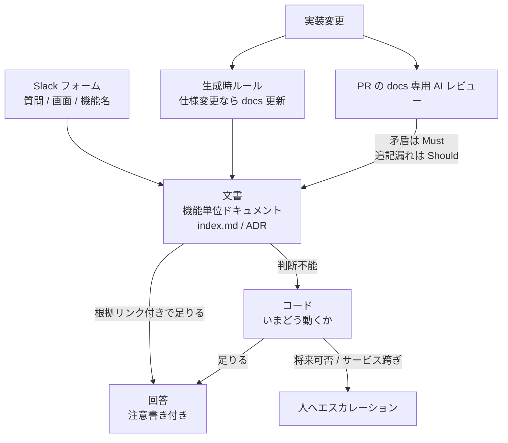

社内の仕様問い合わせをAIに答えさせる仕組みは、いまや珍しくありません。それでも「ドキュメントを整えてRAGに載せた」だけでは、現場は数か月で元の運用に戻ります。

エムスリーのUnit7が公開した運用事例は、この落とし穴の手前に線を引いています。核はエージェントの賢さではなく、**回答経路の優先順位**と、**正本を腐らせない強制装置**です。

この記事では、公開された一次情報をもとに、次の3点を整理します。

- 問い合わせAIの回答経路を「文書 → コード → 人」で切る意味
- 正本の分類にDiátaxisの4象限ではなく機能単位を選ぶ判断
- ドキュメント形式（OKF）が解く問題と、解かない問題の境界

読み終えると、自分の組織で同じ仕組みを検討するときに、「どこを真似て、どこを真似てはいけないか」を判断できます。


*この記事の全体像。以下、順に解説します。*

## 何が新しいのか: 賢さではなく責任境界

エムスリーの記事が示す最終型は、次の3段です。

1. **整えたドキュメントを基点に答える**。回答には参照リンクを必ず添える
2. ドキュメントで判断しきれないところ**だけ**コードへ落ちる
3. コードでも決めきれない領域は無理に答えず、**人へ渡す**

この順序が効くのは、実際の問い合わせがそもそも「いまどう動くか」だけではないからです。ビジネスサイドから来る質問は、次のような形をしています。

- この機能はできるのか
- できないなら代替手段は何か
- あとから変えられるのか
- この設定を変えると連携先のサービスで何が起きるのか

コードが素直に持っているのは1つ目、しかも「現時点の挙動」だけです。「将来変えられるか」「なぜそうしたか」はコードに書かれていません。だからコードだけを根拠にしたAIは、そこで推論を始めて幻覚を生みます。

言い換えると、この3段は精度向上のテクニックではなく、**AIに答えさせてよい範囲の宣言**です。発注側が導入判断で買うべきなのも、「Devinを入れる」ことではなく「何を正本にし、どこから先を人が引き取るか」の線引きになります。

### 全体像

実行時のフォールバックと、開発時の鮮度ゲートは別のレイヤーです。同じ「正本が腐る」問題を、違うタイミングで抑えにいきます。



図の読み方は次のとおりです。

- 上段が実行時のフォールバック、下段が正本を最新に保つ強制
- 文書が一次根拠なので、**下段が壊れると上段は腐った権威を引用する**
- コードへのフォールバックは「いま」専用。将来可否はADRか人が引き取る

## なぜDiátaxisの4分類を採らないのか

ドキュメント設計の定番であるDiátaxisは、チュートリアル・ハウツー・リファレンス・解説の4形態を、行動と認知、学習と仕事の2軸で地図にしたフレームワークです。

Unit7はこれを参照しつつ、分類軸としては採用せず、**機能（feature）単位**でファイルを割っています。

判断としては筋が通っています。問い合わせは機能に紐づいて発生するので、検索キー（画面名・機能名）とファイルの粒度を一致させたほうが引き当てやすいためです。フォームで「対象の画面」「関連する機能名」を先に集めるという設計とも噛み合います。

Diátaxis公式自身も、地図をそのまま計画表に流用することを戒めています。

> The map is not a plan.

さらに、空の4セクションを先に用意する運用については、公式が明確に否定的です（[How to use Diátaxis](https://diataxis.fr/how-to-use-diataxis/)）。プロダクト学習サイト向けに設計された4分割を、問い合わせ応答のSLAへそのまま当てはめない、という意味でも妥当な見送りです。

一方で注意点もあります。Diátaxisが4分類を立てた本来の理由は、目的の異なる文章を混ぜると読み手が迷う、という観察でした。機能単位の1ファイルの中に「可否」「手順」「仕様値」「なぜ」を全部詰めると、公式が問題視した境界の曖昧さが、ファイル間からファイル内へ移動するだけになります。

実務的な重ね方は次の形です。

- **ナビゲーション**は機能単位（検索キーに合わせる）
- **ファイル内のスロット**はハウツー・リファレンス・解説を圧縮して配置する
- 「なぜ」「あとから変えられるか」「他サービスとの関係」は**ADR**へ切り出す

ADRは、Michael Nygardが提案した「アーキテクチャ上の決定とその文脈・帰結を短く記録する」形式です。コードに書かれない意思決定を置く先として、この用途に合っています。

## 正本はどうやって腐らせないか

ここが本丸です。ドキュメントをリポジトリに置いてPRで見るだけでは、内容の真偽は自動では担保されません。

Unit7の鮮度ゲートは二重になっています。

| レイヤー | タイミング | 内容 |
|---|---|---|
| 生成時ルール | AIコーディング中 | 「仕様を変えたらドキュメントも更新する」をルールファイルに書き、生成時に追随させる |
| PRレビュー | PR作成時 | 差分からバックエンド / フロントエンド / docs を判定し、docs専用エージェントを並列起動。実装と矛盾すればMust、追記漏れはShould |

docsだけのPRでも、ドキュメント規約への適合をチェックします。

この設計の要点は、リンク切れ検査のような機械的チェックではなく、**実装との意味的な一致**をレビュー対象にしている点です。問い合わせAIの根拠として使う以上、死んだリンクを弾くだけでは足りません。

### それでも残る弱点

一方で、この仕組みが保証しているのは「変更時に触ったか」であり、「いま書いてある内容がまだ真か」ではありません。よく知られた失敗パターンが残ります。

- 上流サービス側の変更は、自チームのPRを伴わずに文書を腐らせる
- 「PRにdocs更新チェックはあるが機能していない」という報告は、docs-as-codeの実務記事に繰り返し現れる
- リンクチェッカーは死リンクしか見ない

Write the Docsのドキュメント原則が挙げる **Current**（誤ったドキュメントは無いより悪い）は、この文脈でこそ重い制約になります。人間が読む静的サイトなら「古そうだ」と判断して読み飛ばせますが、AIは腐った文書を優先的に信じ、リンク付きで自信満々に引用します。

さらに、Unit7の記事にはMust / Shouldエージェントの偽陽性率や、問い合わせ完結率といった定量値は公開されていません。効果の大きさは各自の環境で測る前提になります。

**docs-firstを選ぶなら、鮮度の失敗を検知する手段をセットで用意してください。** 具体的には、人によるサンプリング検証、コードと文書が矛盾したときはまず文書を疑う運用ルール、後述する鮮度メタデータの活用です。

## OKFは何を解いて、何を解かないのか

Unit7がドキュメント形式に選んだのが **OKF（Open Knowledge Format）** です。

OKFは2026年6月にGoogle Cloudが発表した、markdown本文にYAML frontmatterを付けるだけの形式です。v0.1で必須のキーは `type` のみ。ディレクトリにファイルを並べ、gitで管理します。

```markdown
---
type: reference
title: 請求書発行機能
---

## 対応している出力形式

...
```

採用理由は明快です。**AI用と人間用でドキュメントを2つ持つと運用負担が倍になる**ので、1本のファイルを両者が読める形にする。翻訳レイヤーを挟まない、という契約です。

v0.2では、信頼性まわりの語彙が任意で追加されました。

| 追加カテゴリ | 主なキー | 用途 |
|---|---|---|
| provenance | `generated.at` | 生成時刻。v0.1の `timestamp` から改称 |
| sources | `sources` | 出典。本文の `# Citations` セクションから frontmatter へ移動 |
| freshness | `stale_after` | 絶対時刻で陳腐化期限を宣言 |
| trust | `verified` 由来の tier | 検証済みかどうかの信号。アクセス制御ではない |

`stale_after` と `verified` は、前節で挙げた「まだ真か」の穴と相補的です。ただしどちらも**任意フィールド**なので、書かなければ何も起きません。

### 採用前に踏まないほうがいい地雷

- **参照先リポジトリが移動しています。** canonical な仕様リポジトリは [`GoogleCloudPlatform/open-knowledge-format`](https://github.com/GoogleCloudPlatform/open-knowledge-format) です。以前の `knowledge-catalog/okf` は、README自身が凍結スナップショットである旨を警告しています。古い記事やブログのフッターは、いまも凍結パスを指していることがあります
- **ガバナンスがまだありません。** ライセンスはApache 2.0ですが、Linux Foundation型の中立な運営母体は置かれていません。「open license, not yet open governance」という指摘があります（[Gianluca Fiorelli](https://www.iloveseo.net/the-open-knowledge-format-what-google-really-shipped/)）
- **適合チェックが緩いです。** 未知の `type` や壊れたリンクを拒否しません。形式に沿っていることと、内容が正しいことは別です
- **削除と不在が区別できません。** 「削除された概念」と「最初から存在しない概念」が列挙上区別できない点は、[仕様リポジトリのissue #11](https://github.com/GoogleCloudPlatform/open-knowledge-format/issues/11) でopenのままです

つまりOKFは、**正本の格納形式に関する契約**です。フォールバック順や鮮度の運用は解きません。導入検討では、この2つを混同しないでください。

## Devinの `!ask` を使うときの前提

Unit7の呼び出し口はSlackの `!ask` です。Devin公式ドキュメントの記述を確認しておきます。

- `!ask` は「フルエージェントを起動せずにコードベースへ手早く答える」入口です。`/ask-devin` も「フルセッションを起動しない」と説明されています（[Slack integration](https://docs.devin.ai/integrations/slack)）
- Ask Devinはリポジトリを索引したうえで「well-cited answers grounded in your codebase」を返すと説明されています（[Ask Devin](https://docs.devin.ai/work-with-devin/ask-devin)）
- 同ドキュメントには「Devin may make mistakes. Please double-check responses.」と明記されています
- 課金は「セッション内でDevinが実際に行った作業」に対して発生します（[Usage](https://docs.devin.ai/admin/billing/usage)）

ここで注意が必要なのは**コスト前提**です。「セッションを立ち上げない入口がある」ことは公式に確認できますが、`!ask` が0 ACUであると明記した公式記述は確認できませんでした。無料であることを設計の前提に固定するのは避け、自社の請求実績で確認してください。

また、Devin Knowledgeは短いtipsをトリガー想起する別ストアです。「回答の各文がどのKnowledgeの何行に対応するか」という引用契約は製品仕様にありません。1ファイル正本を宣言しても、Knowledgeという第二の書き込み面が増える点は運用設計に織り込む必要があります。

回答に付ける「鵜呑みにしないでください」という注意書きは、製品側の制約と整合した正しい対応です。ただしNielsen Norman Groupは、チャットUIの免責文が実際の検証行動を促さないと報告しています（[2025-05-16](https://www.nngroup.com/articles/ai-chatbots-discourage-error-checking/)）。免責文だけに頼らず、参照リンクを踏んで確かめる導線まで設計してください。

## 自分の組織はどの型を選ぶべきか

問い合わせAIの構成は、読み手とドメインで最適解が変わります。公開事例を並べると輪郭がはっきりします。

| 基準 | 一般的な社内RAG | コードを一次根拠にする型 | 文書 → コード → 人の型 |
|---|---|---|---|
| 一次根拠 | Wiki / PDF の検索 | コード + 人が投稿前に確認 | リポジトリ内文書 + 参照必須 |
| いまどう動くか | 文書が新しければ可 | 強い | 文書が腐ると弱く、コードへ落ちる |
| 変えられるか / なぜ | FAQになければ幻覚 | コードから推論し幻覚しやすい | ADRへ切り出し。無ければ人 |
| 実装詳細の漏れ | コーパス次第 | コード引用が残りやすい | 人の目 + 注意書きで抑制 |
| 鮮度 | インデックス更新 | コードは常に最新 | PRレビュー + 生成時ルール |
| 向く問い | 規程・FAQ | エンジニア内の仕様確認 | 運用担当が客先へ再送しうる可否・代替 |

対照事例としては、コード根拠に人の投稿前確認を組み合わせた[LINEヤフーの事例](https://techblog.lycorp.co.jp/ja/20260421a)、調査AIと人間による保証を実装まで繋げた[Ubieの事例](https://zenn.dev/ubie_dev/articles/6e4a18b54002ea)、経理ドメインでドキュメントRAGに絞った[メルカリの事例](https://careers.mercari.com/mercan/articles/46588/)があります。国内公開事例のなかで、文書・コード・人の3段を明示的に切って公開したものは、確認できた範囲ではエムスリーの記事が目立ちます（網羅調査ではありません）。

### 文書 → コード → 人が向く条件

- 読み手がコードを開かない（ビジネスサイド・運用担当）
- 問いが機能に紐づく
- 「将来できるか」「サービスを跨ぐと何が起きるか」が混ざる
- 実装詳細を運用チャネルへ出したくない
- 同じリポジトリでAIコーディングしており、ルールとPRレビューを挟める

### 他の型が向く条件

- 対象がコードから独立した規程（経理・総務）なら、狭いコーパスのRAGで足ります。メルカリの経理チームは工数45.7%削減を報告しています
- 読み手がエンジニアだけで、最後はコードで裏を取れるなら、コードを一次根拠にしたほうが速いです
- **文書を更新する人がいないなら、ボットを出さないでください。** 国内の失敗談では、FAQ未整備・更新担当不在・エスカレーション先が曖昧という条件が揃うと、現場が短期間で元の運用へ戻ると報告されています

## 導入するときの実務チェックリスト

公開情報からの示唆を、実行順に並べます。

1. **経路を先に決める。** 文書 → コード → 人の順、根拠リンク必須、答えない領域の明示。ツール選定より先です
2. **スロットは実データで決める。** 実際の問い合わせを分類し、「可否 / 代替 / 将来 / 連携先への影響」を機能ファイルの定型枠にします。細かい実装説明より優先度が高い項目です
3. **フォームで検索キーを先に取る。** 「対象の画面」「関連する機能名」を質問と一緒に集めると、機能単位の分類が活きます
4. **形式は後回しでよい。** markdown + frontmatter + `index.md` で足ります。OKFラベルは、相互運用やカタログ配信が必要になってから検討してください。採用するなら canonical リポジトリを参照します
5. **鮮度は二重にする。** 生成時ルールとPRのセマンティックレビュー。リンク切れ検査だけでは問い合わせAIには足りません
6. **「なぜ / 変えられるか」はADRへ。** Acceptedを現行仕様と盲信せず、supersedeの連鎖を問い合わせ経路からも辿れるようにします
7. **人の関与を形骸化させない。** 指標は「回答した件数」ではなく「人がやり直さなかった率」に置きます。回答したように見えて実際には何も起きていなかった、という公開事例は社内外にあります
8. **漏洩境界を引く。** 実装寄りの正本を低権限ユーザー向けボットに読ませると、正本そのものが漏洩ペイロードになります（OWASP LLM02 が扱う領域です）。運用向け回答からコード引用を落とす方針を先に決めてください

## まとめ

- 問い合わせAIの設計で先に決めるべきは、モデルやツールではなく**回答経路の優先順位**です。文書 → コード → 人の3段は、AIに答えさせてよい範囲の宣言として機能します
- 分類は読み手の検索キーに合わせます。機能単位のナビゲーションに、ハウツー・リファレンス・解説を圧縮したスロットを載せ、「なぜ」はADRへ逃がす形が実務的です
- 鮮度ゲートは「触ったか」までしか保証しません。docs-firstは腐った正本を権威に変えるリスクを抱えるので、検知手段をセットで用意してください
- OKFは正本の格納形式に関する契約であり、運用の鮮度問題は解きません。ガバナンス未整備・canonicalリポジトリの移動・緩い適合という前提を踏まえて採用可否を判断してください
- `!ask` の課金前提と引用保証は、公式記述で確認できる範囲を超えて固定しないでください

この記事が少しでも参考になった、あるいは改善点などがあれば、ぜひリアクションやコメント、SNSでのシェアをいただけると励みになります！

## 参考リンク

- 長谷川（エムスリー Unit7）「OKFやDiátaxisを活用してDevinによるお問い合わせ対応をしている話」 https://www.m3tech.blog/entry/2026/08/27/100000
- Google Cloud「Introducing the Open Knowledge Format」 https://cloud.google.com/blog/products/data-analytics/how-the-open-knowledge-format-can-improve-data-sharing/
- Google Cloud「OKF v0.2 adds trust signals」 https://cloud.google.com/blog/products/data-analytics/okf-v0-2-adds-trust-signals/
- OKF SPEC v0.2 https://github.com/GoogleCloudPlatform/open-knowledge-format/blob/main/SPEC.md
- OKF 仕様リポジトリ issue #11 https://github.com/GoogleCloudPlatform/open-knowledge-format/issues/11
- knowledge-catalog `okf/README.md`（凍結スナップショット警告） https://github.com/GoogleCloudPlatform/knowledge-catalog/blob/main/okf/README.md
- Devin Docs: Slack integration https://docs.devin.ai/integrations/slack
- Devin Docs: Ask Devin https://docs.devin.ai/work-with-devin/ask-devin
- Devin Docs: Knowledge https://docs.devin.ai/product-guides/knowledge
- Devin Docs: Billing Usage https://docs.devin.ai/admin/billing/usage
- Diátaxis https://diataxis.fr/
- How to use Diátaxis https://diataxis.fr/how-to-use-diataxis/
- Diátaxis: How-to guides https://diataxis.fr/how-to-guides/
- Michael Nygard「Documenting Architecture Decisions」 https://www.cognitect.com/blog/2011/11/15/documenting-architecture-decisions
- LINEヤフー Tech Blog https://techblog.lycorp.co.jp/ja/20260421a
- Ubie（Zenn） https://zenn.dev/ubie_dev/articles/6e4a18b54002ea
- メルカリ mercan https://careers.mercari.com/mercan/articles/46588/
- Gianluca Fiorelli「The Open Knowledge Format: what Google really shipped」 https://www.iloveseo.net/the-open-knowledge-format-what-google-really-shipped/
- Hillel Wayne「Problems with the 4Doc model」 https://www.hillelwayne.com/post/problems-with-the-4doc-model/
- Nielsen Norman Group「AI Chatbots Discourage Error Checking」 https://www.nngroup.com/articles/ai-chatbots-discourage-error-checking/
- SmartHR Tech Blog https://tech.smarthr.jp/entry/2026/08/21/155452
