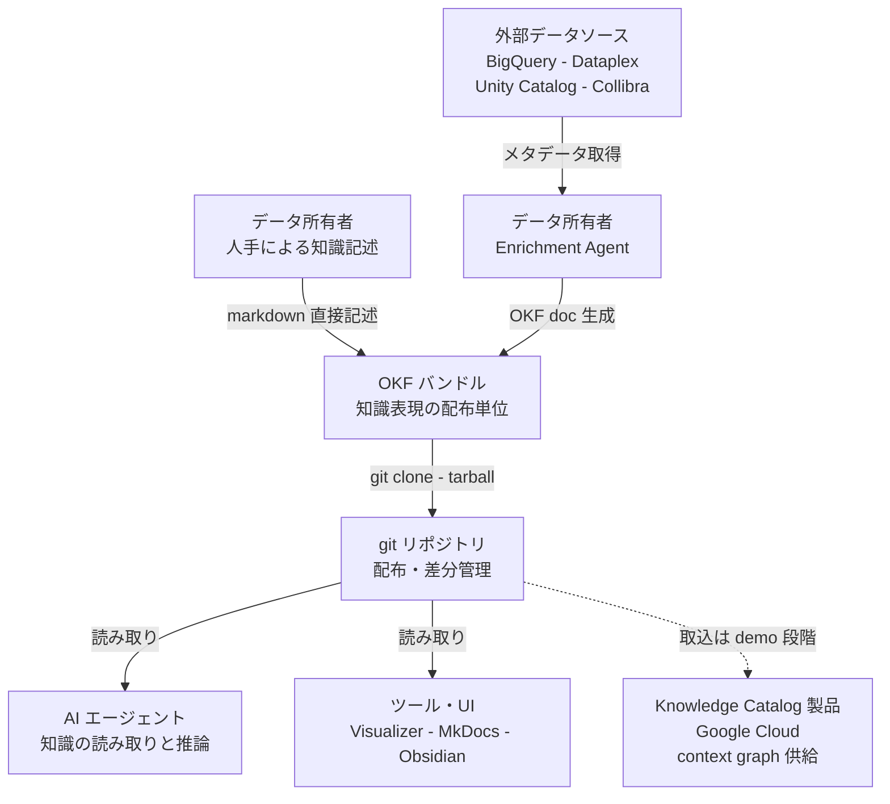
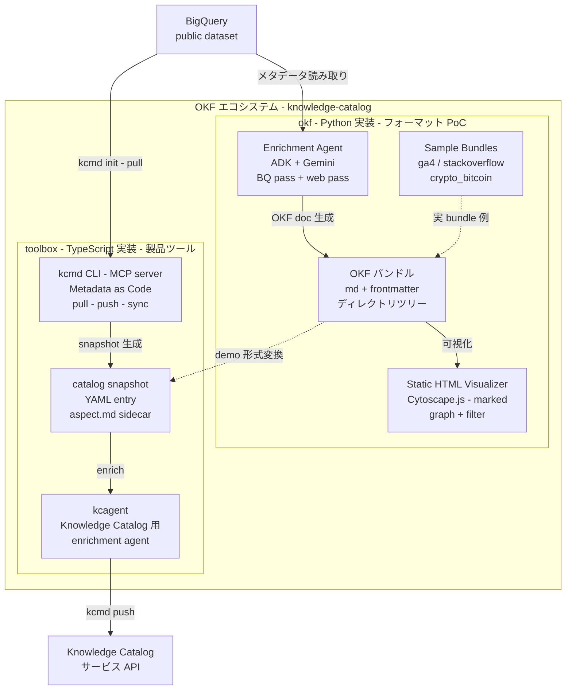
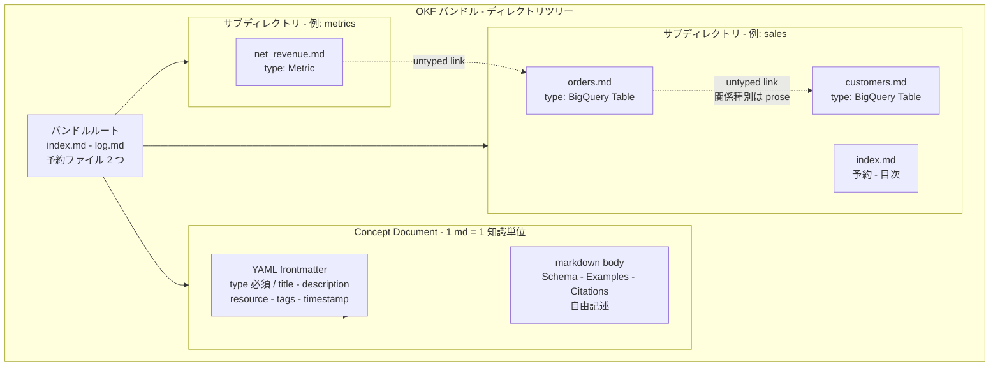
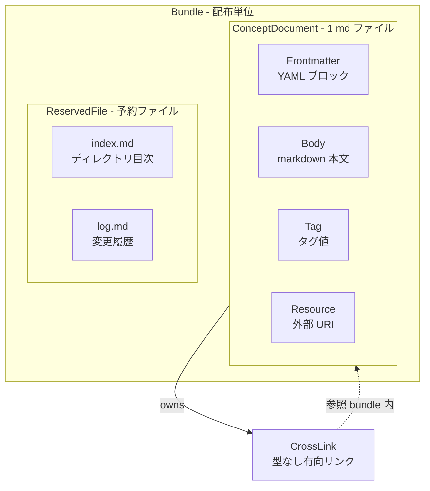
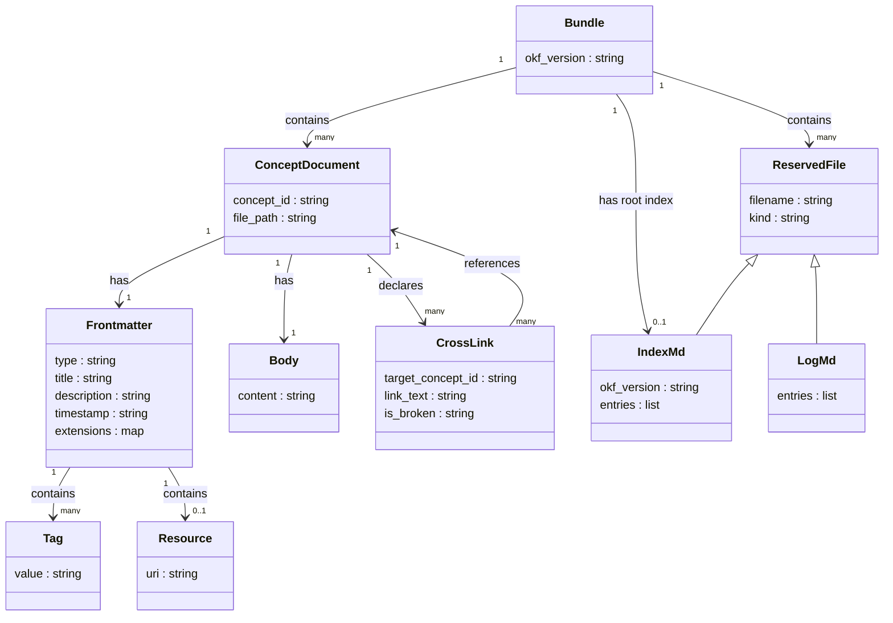

OKF (Open Knowledge Format) は、Google Cloud が 2026 年 6 月に公開した「AIエージェントが読む知識を、どのファイル形式で持つか」を定める軽量フォーマットです。サービスでもプラットフォームでもなく、YAML frontmatter 付き markdown ファイルのディレクトリツリーという取り決めに過ぎません。本記事は spec 原文とリポジトリ実体を一次ソースとして、OKF の構造・データモデル・導入手順・運用までを整理します。

---

## 概要

### OKF とは何か

OKF は、AIに読ませる知識(テーブル定義・メトリクス・Runbook・ジョイン経路など)を、人間も機械も読めて git で差分管理できる形で置くためのフォーマットです。spec 原文は次のように定義します。

> OKF is an open, human- and agent-friendly format for representing *knowledge* — the metadata, context, and curated insight that surrounds data and systems.
> The format is intentionally minimal: a directory of markdown files with YAML frontmatter. There is no schema registry, no central authority, and no required tooling. If you can `cat` a file, you can read OKF; if you can `git clone` a repo, you can ship it.
> （出典: okf/SPEC.md 冒頭）

README は「**universal, vendor-neutral format**」、ブログは「**Format, not platform.**」と表現し、特定のクラウド・DB・モデルプロバイダ・エージェントフレームワークに縛られないことを宣言しています。

### 位置づけ — 「知識をファイルとして整える」層

spec §10 は近縁パターンとして次の 3 つを自認し、OKF の差別化点を「これらに対して *specified* である(相互運用に必要な最小規則を固定しつつツールを強制しない)」点に置きます。

- **LLM "wiki" repositories** — markdown + frontmatter をエージェント可読知識ベースとして使う手法。
- **Personal knowledge tools** — Obsidian・Notion のような階層 markdown + クロスリンク。
- **"Metadata as code"** — カタログメタデータをレジストリでなくソースコードと並べて管理する手法。

なお、**公式は OKF を RAG の代替として名指しで差別化してはいません**。spec 本文に "RAG" / "embedding" / "vector" の語はありません。ブログの「同じ文書を何度も検索させる代わりに、育っていく共有ライブラリをエージェントに与える」というフレーミングは RAG 的な都度検索との対比として読めますが、「vs RAG」と明示した一次記述は確認できませんでした。本ドキュメントでは「RAG/KG を作る前段で知識をファイルとして整える層」という positioning として扱います。

### リポジトリ・公開情報

| 項目 | 値 |
|---|---|
| GitHub | `GoogleCloudPlatform/knowledge-catalog`（Apache-2.0） |
| 仕様ファイル | `okf/SPEC.md`（Version 0.1 — Draft） |
| 公開主体 | Google Cloud Data Cloud team（"not an official Google product" と宣言） |
| タイムライン | repo 作成 2026-05-04 / SPEC.md import 2026-06-12（PR #28） / 公式ブログ 2026-06-13 |
| star 数 | 約 14（2026-06-13 時点） |

---

## 特徴

### 設計軸: Readable / Parseable / Diffable / Portable

spec §1 Motivation が掲げる 4 軸です(原文見出し)。

| spec の軸 | 意味 |
|---|---|
| **Readable** | 人間がツールなしでそのまま読める markdown |
| **Parseable** | 専用 SDK なしにエージェントが構造を抽出できる（frontmatter が機械的に取り出せる） |
| **Diffable** | テキストなので git diff / PR レビューが効く |
| **Portable** | 中央サーバや専用ツールに依存せず、ファイルをコピーすれば移送できる |

ニュース記事等で見られる「vendor-neutral / human-readable / agent-parseable / version-control-first」の 4 語は、spec 原文のこの軸を言い換えたものです。spec 本文にこの 4 語そのままの列挙はありません("vendor-neutral" は README の定義文中の修飾語として登場します)。spec §1 は設計姿勢を "minimally opinionated" と明示し、「知識コーパスを *self-describing* にするのに必要な最小の構造的規約だけを標準化し、それ以外は producer に委ねる」としています。

### conformance の「極小契約」

OKF v0.1 が producer(書き手)に要求するのは、驚くほど少ない 2 点です。

- すべての非予約 `.md` ファイルが、parse 可能な YAML frontmatter を持つこと。
- その frontmatter が、**空でない `type` フィールドを 1 つ**持つこと。

ブログは「OKF requires exactly one thing of every concept: a type field.」と表現します。frontmatter の任意フィールドは `title` / `description` / `resource` / `tags` / `timestamp` で、独自の拡張キーも自由に追加できます。予約ファイル名は `index.md`(ディレクトリの入口)と `log.md`(変更履歴)の 2 つのみです。

### permissive consumption model（寛容な消費モデル）

consumer(読み手)に対しては、spec §9 が強い **MUST NOT** を課します。「壊れていても止まるな、読める範囲を読め」という思想です。

- 未知の `type` で document を拒否してはならない。
- 未知の frontmatter キーで拒否してはならない。
- 任意フィールドが欠けていることで拒否してはならない。
- リンク切れ(broken link)で拒否してはならない。
- `index.md` が無いことで拒否してはならない。

### 型タクソノミーを定めない

`type: BigQuery Table` のような値はサンプル中に登場しますが、これらは example value に過ぎません。spec の Non-goals に「**Defining a fixed taxonomy of concept types**」が明記され、定義済み `type` のレジストリは存在しません。ファイル間のリンクも **型なし(untyped)の有向辺**で、関係種別は frontmatter ではなく本文の散文(prose)で表現します(spec §5.3)。

### git native と reference 実装

バンドル(配布単位)は git repo / tarball / 大きい repo のサブディレクトリのいずれでも配布でき、テキストである以上 git の差分管理・PR レビューがそのまま効きます。リポジトリには動かせる参照実装が同梱されています。

- **Enrichment Agent** — Google ADK + Gemini による producer PoC。BigQuery を最初の source として、BQ pass(メタから 1 concept = 1 doc)と web pass(LLM が seed URL をクロールして enrich)の 2 段構成。
- **Static HTML Visualizer** — OKF バンドルを自己完結 interactive HTML に変換する consumer PoC。Cytoscape.js の force-directed graph と type フィルタを持つ。
- **Sample bundles** — `ga4` / `stackoverflow` / `crypto_bitcoin` の 3 つ(いずれも BigQuery public dataset 由来)。

### 他形式との比較

「AIが読む知識をどのファイル形式で持つか」という空間には、既に複数の層が存在します。層を A(指示書)/ B(セマンティクス記述、OKF の主戦場)/ C(プロトコル・手法)で定義します。

| 形式 | 層 | 何を記述するか | 推進主体 | OKF との関係 |
|---|---|---|---|---|
| **AGENTS.md** | A | コーディングエージェント向けの振る舞い指示・規約 | Agentic AI Foundation（Linux Foundation 傘下）。約 22.2k stars（2026-06-13 時点） | 別層・補完。指示書であり知識の意味記述ではない |
| CLAUDE.md / GEMINI.md / .cursorrules | A | ツール固有のエージェント指示（AGENTS.md に収斂中） | 各ベンダー | 別層・補完 |
| llms.txt | A 寄り | Web サイトを LLM に読ませる要約+リンク集 | Answer.AI（2024-09 提案、主要 AI 企業は未採用） | 別層 |
| **Croissant** | B | ML データセットのメタ+リソース+データ構造+ML セマンティクスを 1 ファイルに統合（JSON-LD） | MLCommons（v1.0 = 2024-03-01）。Google も共同推進者 | **最近接・競合**。vendor-neutral・機械可読で先行 |
| schema.org/Dataset | B | データセットの構造化メタ、Web 公開向け | schema.org（Google/MS/Yahoo/Yandex）、W3C DCAT と相互運用 | 近接（Croissant の基盤） |
| **Data Contract Spec** | B | データ契約（models/terms/SLA）。`datacontract test` で CI 検証可 | OSS（PayPal 等が推進） | 補完（契約+CI 検証。OKF と組み合わせ可能） |
| dbt contract config | B | SQL モデルのスキーマ契約を code として宣言・enforce | dbt Labs | 近接・補完（OKF の table concept のスキーマ source of truth を担える） |
| OpenAPI / AsyncAPI | B | API エンドポイント/メッセージの機械可読仕様 | OpenAPI Initiative / 各 OSS | 近接（`type: api` concept の正本として参照可能） |
| **MCP** | C | 知識をどう「運ぶ」か（JSON-RPC 2.0 上のクライアント・サーバ型プロトコル） | Anthropic（2024-11 発表）、現在オープン標準 | 直交・補完。OKF は「どう表現」、MCP は「どう運ぶ」 |

最近接の **Croissant** は MLCommons が steward で、vendor-neutral・機械可読(JSON-LD)・Web discoverable・MCP 連携実証済み(2025-10)という条件を既に満たします。ただし Croissant は ML データセットに特化し、テーブル定義・メトリクス・Runbook・API 知識などの汎用業務知識は OKF のカバー範囲です。

---

## 構造

OKF は「形式 + reference 実装」なので、C4 model を「OKF エコシステムの論理構造」に読み替えて図示します。

### システムコンテキスト図



#### システムコンテキスト要素

| 要素名 | 説明 |
|---|---|
| データ所有者 - 人手による知識記述 | テーブル定義・メトリクス・Runbook 等を手作業で markdown に記述する Producer |
| データ所有者 - Enrichment Agent | ADK+Gemini を使い、外部データソースのメタデータから OKF ドキュメントを自動生成する Producer |
| 外部データソース | BigQuery・Dataplex・Unity Catalog・Collibra など、メタデータの元となる既存カタログや DB |
| OKF バンドル | YAML frontmatter 付き markdown ファイルのディレクトリツリー。知識の配布単位 |
| git リポジトリ | バンドルを配布・バージョン管理する主要な輸送層。tarball / zip での配布も可 |
| AI エージェント | git リポジトリからバンドルを取得し、知識を推論・回答に活用する Consumer |
| ツール・UI | Visualizer・MkDocs・Obsidian など、バンドルを人間向けに可視化・閲覧する Consumer |
| Knowledge Catalog 製品 | Google Cloud の AI 対応データカタログ。OKF の取り込みは現状 repo 内 demo にとどまり、製品の正式な交換形式としての連携は未確認(コンテナ図の後の注記を参照) |

### コンテナ図

同一リポジトリ内に、純粋な OKF を担う Python 実装(`okf/`)と、Knowledge Catalog 製品寄りツールチェーンの TypeScript 実装(`toolbox/`)が同居します。



#### okf サブグラフ要素

| 要素名 | 説明 |
|---|---|
| Enrichment Agent | ADK+Gemini ベースの Producer PoC。BQ pass でメタデータから 1 concept = 1 doc を生成し、web pass で LLM が seed URL をクロールして enrich・skip を判断 |
| Static HTML Visualizer | OKF バンドルを自己完結 interactive HTML に変換する Consumer PoC。Cytoscape.js の force-directed graph と type フィルタを持つ |
| Sample Bundles | enrichment agent が実際に生成した 3 つのサンプルバンドル。すべて BigQuery public dataset 由来 |
| OKF バンドル | 配布単位となるディレクトリツリー本体。git repo / tarball / サブディレクトリのいずれでも配布可 |

#### toolbox サブグラフ要素

| 要素名 | 説明 |
|---|---|
| kcmd CLI - MCP server | Knowledge Catalog 製品との双方向 sync を担う TypeScript 実装。pull/push/楽観排他制御。MCP server モードで agent にも公開 |
| kcagent | Knowledge Catalog 用の enrichment agent。mdcode に依存し ADK ベースで aspect を LLM enrich して Knowledge Catalog に書き戻す |
| catalog snapshot | kcmd が生成する製品固有の中間表現。YAML entry + `.aspect.md` sidecar の 2 ファイル構成で Dataplex EntryGroup/Entry/Aspect モデルに対応 |

> OKF(`okf/`)と製品の Metadata as Code(`toolbox/`)は別表現です。OKF は Knowledge Catalog 製品の交換フォーマットではなく、`toolbox/mdcode/demo/okf/` が catalog→OKF の橋渡し demo を示すにとどまります。

### コンポーネント図

OKF バンドル内部の構成要素を示します。



#### バンドルルート要素

| 要素名 | 説明 |
|---|---|
| index.md - 予約 | ディレクトリの入口・目次。frontmatter を持たない(spec §6)。ただしバンドルルートの index.md のみ `okf_version`(例: `"0.1"`)宣言のため frontmatter が許可される(spec §11) |
| log.md - 予約 | バンドルの変更履歴。ISO 8601 日付見出しで新しい順に並ぶ |

#### Concept Document 内部要素

| 要素名 | 説明 |
|---|---|
| YAML frontmatter | `type` フィールドのみが必須。`title` / `description` / `resource` / `tags` / `timestamp` は任意。Producer 定義の任意キー追加可 |
| markdown body | 自由記述。慣習見出しとして `# Schema` / `# Examples` / `# Citations` が定義されるが、いずれも必須ではない |
| untyped cross-link | 標準 markdown リンク。関係の種別はリンク自体でなく周囲の散文で表現する。Consumer はリンク切れを拒否してはならない |

#### Concept ID 規約

| 規約 | 説明 |
|---|---|
| Concept ID | bundle 内のファイルパスから `.md` を除いたもの。例: `tables/users.md` の ID は `tables/users` |
| 予約ファイル名 | `index.md` と `log.md` の 2 つのみ。それ以外の `.md` はすべて concept document |
| conformance 最小条件 | 全非予約 `.md` が parseable な YAML frontmatter を持ち、空でない `type` を 1 つ持つこと |

---

## データ

### 概念モデル

Bundle がすべてを包み、その中に ConceptDocument と ReservedFile が共存します。ConceptDocument は Frontmatter・Body・Tag・Resource を持ち、Bundle 内の他 ConceptDocument へ CrossLink で参照します。



Tag と Resource は Frontmatter の任意フィールドとして保持されますが、概念的に独立したエンティティとして扱えるため分離して示しています。`index.md` はバンドルルートに限り frontmatter(`okf_version` 宣言)を持てます(spec §11)。

### 情報モデル

各エンティティの主要属性と多重度を示します。概念モデルとエンティティを一致させています。



#### 主要エンティティの属性

| エンティティ | 属性 | 型 | 必須 | 説明 |
|---|---|---|---|---|
| Bundle | `okf_version` | string | 任意 | バンドルが準拠する OKF バージョン。ルート `index.md` frontmatter にのみ記載可（spec §11） |
| ConceptDocument | `concept_id` | string | 推測 | bundle ルート相対パスで `.md` を除いたもの（spec §2） |
| ConceptDocument | `file_path` | string | 推測 | bundle 内のファイルパス |
| Frontmatter | `type` | string | **必須** | 概念の種別を表す空でない短い文字列。レジストリなし・自由文字列（spec §4.1） |
| Frontmatter | `title` / `description` | string | 任意 | 表示名 / 1 行概要（spec §4.1 Recommended） |
| Frontmatter | `timestamp` | string | 任意 | ISO 8601 形式の最終更新日時 |
| Frontmatter | `extensions` | map | 任意 | producer が自由に追加するキー/値。consumer は未知キーで拒否してはならない（MUST NOT） |
| Tag | `value` | string | — | `tags` キーにリストで記載。集約は consumer が frontmatter スキャンで合成 |
| Resource | `uri` | string | — | 対応する実資産の正規 URI（例: BigQuery コンソール URL） |
| CrossLink | `target_concept_id` | string | — | リンク先 concept_id。ルート相対の絶対パス（例: `/tables/customers.md`）推奨（spec §5.1） |
| CrossLink | `is_broken` | string | 推測 | リンク先が無くても ConceptDocument は不正にならない。未記述知識を表す（spec §5.2） |
| Body | `content` | string | — | frontmatter に続く自由形式の markdown。必須セクションなし（spec §4.2） |
| LogMd | `entries` | list | — | `YYYY-MM-DD` 見出し（新しい順）の変更記録（spec §7） |

`concept_id` / `file_path` / `is_broken` は spec の記述から導出した推測属性です。conformance の実質は spec §9 の 3 点(全非予約 `.md` が parseable な frontmatter + 空でない `type` / 予約ファイルは §6・§7 構造に従う)のみです。

---

## 構築方法

OKF は「ディレクトリ + Markdown + YAML frontmatter」だけで完結します。専用サーバも SDK も不要で、`git clone` と任意のテキストエディタがあれば始められます。

### reference 実装を動かす前提条件

`okf/` に Enrichment Agent(producer PoC)と Static HTML Visualizer(consumer PoC)が含まれます。

- Python 3.11 以上(`pyproject.toml` の `requires-python = ">=3.11"`)
- Google Cloud プロジェクト(BigQuery を使う場合は API 有効化・課金設定が必要)
- Gemini API キー(AI Studio 発行の `GEMINI_API_KEY`)または Vertex AI 認証

```bash
# 1. リポジトリを clone
git clone https://github.com/GoogleCloudPlatform/knowledge-catalog.git
cd knowledge-catalog/okf

# 2. Python 仮想環境を作成してパッケージをインストール
python3 -m venv .venv
.venv/bin/pip install -e .[dev]

# 3. BigQuery 認証（公開データセットの読み取りにも呼び出し側プロジェクトへの課金が発生する）
gcloud auth application-default login
gcloud config set project <your-billing-project>

# 4. Gemini 認証（AI Studio の場合）
export GEMINI_API_KEY=<your-key>
```

Vertex AI を使う場合は `GEMINI_API_KEY` の代わりに次を設定します。

```bash
export GOOGLE_GENAI_USE_VERTEXAI=true
export GOOGLE_CLOUD_PROJECT=<project-id>
export GOOGLE_CLOUD_LOCATION=<region>
```

### Enrichment Agent を実行する（サンプルレシピ）

`samples/ga4_merch_store/` に BigQuery 公開データセット向けのレシピが用意されています。

`pip install -e .` で生成される console script は `enrichment-agent`(`pyproject.toml` の `[project.scripts] enrichment-agent = "enrichment_agent.cli:main"`)です。

```bash
.venv/bin/enrichment-agent enrich \
    --source bq \
    --dataset bigquery-public-data.ga4_obfuscated_sample_ecommerce \
    --web-seed-file samples/ga4_merch_store/seeds.txt \
    --out ./bundles/ga4_merch_store
```

- `--out`(出力先バンドルディレクトリ)は **必須**フラグです。
- `--no-web` で Web pass を省略し BQ pass のみ実行できます。
- `--concept tables/events_` で対象 concept を絞れます(複数指定可、繰り返し使用)。
- `--web-max-pages N`(デフォルト 100)で Web クロール上限を変更できます。

実行後、`./bundles/ga4_merch_store/` に各テーブル・データセットが 1 ファイル = 1 concept の OKF バンドルとして生成されます。

### Visualizer を実行する

```bash
.venv/bin/enrichment-agent visualize --bundle ./bundles/ga4_merch_store
```

バンドルルート直下に `viz.html` が生成されます。バックエンド不要の自己完結 HTML で、ブラウザで開くだけで concept グラフを閲覧できます。

| フラグ | デフォルト | 説明 |
|---|---|---|
| `--bundle` | （必須） | バンドルルートディレクトリ |
| `--out` | `<bundle>/viz.html` | 出力 HTML のパス |
| `--name` | バンドルディレクトリ名 | ビューワーヘッダに表示する名前 |

### OKF バンドルをゼロから作る最小手順

reference 実装を使わず手書きで作る手順です。

```bash
mkdir -p my-bundle/tables
mkdir -p my-bundle/metrics
```

各知識の単位を 1 つの `.md` ファイルとして作成します。`my-bundle/tables/orders.md` の例(spec §4.3 より):

````markdown
---
type: BigQuery Table
title: Customer Orders
description: One row per completed customer order across all channels.
resource: https://console.cloud.google.com/bigquery?p=acme&d=sales&t=orders
tags: [sales, orders, revenue]
timestamp: 2026-05-28T14:30:00Z
---

# Schema

| Column        | Type      | Description                              |
|---------------|-----------|------------------------------------------|
| `order_id`    | STRING    | Globally unique order identifier.        |
| `customer_id` | STRING    | FK を [customers](/tables/customers.md) に持つ。 |
| `total_usd`   | NUMERIC   | 注文合計（米ドル）。                      |

# Joins

`customer_id` で [customers](/tables/customers.md) と結合する。
````

完成したバンドルのディレクトリ構成:

```
my-bundle/
├── index.md          # オプション: ルートのディレクトリ一覧
├── log.md            # オプション: 更新履歴
├── tables/
│   ├── index.md      # オプション
│   ├── orders.md     # concept document
│   └── customers.md  # concept document
└── metrics/
    ├── index.md
    └── weekly_active_users.md
```

`index.md` はプログレッシブ開示用のディレクトリ一覧(frontmatter を持たない)、`log.md` は ISO 8601 日付見出しで新しい順に並ぶ更新履歴です。`log.md` の例(各見出しの先頭に `**Update**` / `**Creation**` / `**Deprecation**` を付けるのが慣習):

```markdown
## 2026-06-13

**Creation** — `tables/orders.md` を初稿追加。

## 2026-06-10

**Update** — `tables/customers.md` の Schema に `email` 列を追記。
```

---

## 利用方法

### frontmatter フィールド一覧

| フィールド | 必須/任意 | 型 | 説明 |
|---|---|---|---|
| `type` | **必須** | 文字列 | concept の種別。例: `BigQuery Table`、`Metric`、`Playbook`。中央レジストリなし、producer が自由に決める |
| `title` | 任意 | 文字列 | 表示用の名称 |
| `description` | 任意 | 文字列 | 一行の要約 |
| `resource` | 任意 | URI | 対象アセットの正規 URI（BigQuery コンソール URL 等） |
| `tags` | 任意 | 文字列の配列 | 検索・フィルタ用のタグ |
| `timestamp` | 任意 | ISO 8601 | 最終更新日時 |
| （任意拡張キー） | 任意 | 任意 | producer が任意のキーを追加できる |

`type` のみが唯一の必須フィールドです(spec §4.1 原文: 「A short string identifying the kind of concept.」)。型の語彙はレジストリで管理されず、consumer は未知の `type` を拒否してはならず(MUST NOT)、典型的には generic concept として扱います。

### concept document の書き方

最小構成(`type` のみ):

```markdown
---
type: Metric
---

週次アクティブユーザー数。
```

任意フィールドと本文セクションを加えた実用的な構成(本文の SQL ブロックは body の一部):

````markdown
---
type: Metric
title: Weekly Active Users
description: 過去 7 日間に 1 回以上イベントを発火したユニークユーザー数。
tags: [engagement, kpi]
timestamp: 2026-06-13T00:00:00Z
---

# 定義

`event_date` が直近 7 日以内かつ `event_name != 'session_start'` のユーザー数を
`user_pseudo_id` で distinct count したもの。

# 計算方法

```sql
SELECT COUNT(DISTINCT user_pseudo_id) AS wau
FROM `project.dataset.events_*`
WHERE _TABLE_SUFFIX BETWEEN
  FORMAT_DATE('%Y%m%d', DATE_SUB(CURRENT_DATE(), INTERVAL 7 DAY))
  AND FORMAT_DATE('%Y%m%d', DATE_SUB(CURRENT_DATE(), INTERVAL 1 DAY))
```
````

本文のセクション見出し(`# Schema`、`# Examples`、`# Citations` など)は仕様上の慣習で、必須ではありません(spec §4.2: 「There are no required body sections.」)。

### cross-link の張り方

concept 間のリンクは通常の Markdown リンクで表現します。リンク自体は「関係の存在」を示すだけで、関係の種別(JOIN・依存・参照など)は周囲の散文で記述します(spec §5.3)。

```markdown
# Joins

`customer_id` で [customers](/tables/customers.md) に結合する（LEFT JOIN）。

# Dependencies

このメトリクスは [orders](/tables/orders.md) の `total_usd` 列に依存する。
`orders` が更新されるたびに再計算が必要。
```

`/` で始めるとバンドルルートからの絶対パスとして解釈され、ファイルをサブディレクトリ内で移動しても壊れません(spec §5.1 推奨)。同じディレクトリ内は `../tables/events_.md` のような相対リンクも使えます。

### consumer 側 permissive parsing の作法

OKF v0.1 の conformance は consumer に明示的な「拒否禁止」ルールを課します(spec §9)。ここで区別したいのは、permissive consumption が対象とするのは「conformant な document に未知の `type` / 未知キー / 任意フィールド欠落 / broken link / index.md 欠落があるケース」だという点です。`type` の欠落や parse 不能な frontmatter は **conformance 違反(producer 側の不備)**であり、permissive の許容対象ではありません。次のコード例はそうした非 conformant ファイルにも防御的に振る舞いますが、本来は producer 側の CI(後述)で弾くべきものです。

```python
import os
import yaml

RESERVED = {"index.md", "log.md"}

def parse_okf_document(content: str) -> dict:
    """未知フィールド・未知 type・broken link があっても reject しない。"""
    if not content.startswith("---"):
        return {"type": "Unknown", "body": content}
    parts = content.split("---", 2)
    if len(parts) < 3:
        return {"type": "Unknown", "body": content}
    try:
        frontmatter = yaml.safe_load(parts[1]) or {}
    except yaml.YAMLError:
        # パース失敗はスキップ/ログにとどめ例外を伝播させない
        return {"type": "Unknown", "body": parts[2].strip()}
    # 未知キーは保持、未知 type も通常 concept として扱う
    return {**frontmatter, "body": parts[2].strip()}

def load_bundle(bundle_root: str) -> list:
    concepts = []
    for dirpath, _, filenames in os.walk(bundle_root):
        for filename in filenames:
            if not filename.endswith(".md") or filename in RESERVED:
                continue
            filepath = os.path.join(dirpath, filename)
            with open(filepath, encoding="utf-8") as f:
                concept = parse_okf_document(f.read())
            rel = os.path.relpath(filepath, bundle_root)
            concept["_id"] = rel.replace("\\", "/").removesuffix(".md")
            concepts.append(concept)
    return concepts
```

拒否してはいけない(MUST NOT)ケースの一覧:

| 状況 | 正しい扱い |
|---|---|
| `type` が未知の文字列 | 通常の concept として扱う |
| 知らない frontmatter キーがある | 拒否しない（MUST NOT）。round-trip する consumer は保持する（SHOULD） |
| optional フィールドが欠けている | 欠落として扱い処理を続行する |
| cross-link のターゲットが存在しない | 未記述の知識として許容する |
| `index.md` が存在しない | 欠落してもバンドルは conformant |

---

## 運用

### git による知識台帳の差分管理

OKF バンドルはテキストの集合体なので、git の差分管理がそのまま「セマンティクスの変更履歴」になります。

- `okf/` ディレクトリを通常のソースコードと同一リポジトリに置き、feature branch で更新する。
- `git diff` が「concept のどのフィールドが変わったか」「どのリンクが追加・削除されたか」を行単位で示す。
- PR レビューで、意味的な変更(定義の書き換え・table schema の変更・metric の再定義)を人間がゲートとして確認する。

### catalog API からの CI 再生成（living contract 運用）

人手で書いた concept document は数週間でドリフトします[二次情報: Atlan "How to Write an AGENTS.md"]。鮮度維持には CI による自動再生成が現実的です。ファイルヘッダに provenance を明記し、自動生成セクションと人手メンテセクションを分離します。次の例の `scripts/generate_okf.py` は自前で用意する想定のスクリプトです(OKF repo に同梱されるものではありません。reference 実装を使うなら `enrichment-agent enrich --source bq --out okf/` に置き換えられます)。

```yaml
# .github/workflows/okf-refresh.yml
on:
  schedule:
    - cron: '0 2 * * 1'   # 毎週月曜 02:00 UTC
  push:
    paths:
      - 'schema/**'
jobs:
  regenerate-okf:
    runs-on: ubuntu-latest
    steps:
      - uses: actions/checkout@v4
      - name: Regenerate OKF from catalog
        run: python scripts/generate_okf.py --source bq --output okf/
      - name: Commit diff
        run: |
          git config user.name "okf-bot"
          git add okf/
          git diff --cached --quiet || git commit -m "chore(okf): auto-regenerate from catalog"
      - name: Open PR
        uses: peter-evans/create-pull-request@v6
```

CI 再生成のスコープは table/dataset concept に絞り、metric/runbook の意味定義は人手で維持する使い分けが現実的です。

### CI での OKF バンドル検証（PR ゲート）

OKF spec は consumer 側に permissive を求めますが、producer 側の品質は CI でゲートにできます。次の `okf_lint.py` も自前で用意する lint スクリプトの例です(OKF repo には同梱されません)。

```bash
python scripts/okf_lint.py okf/ \
  --require-type \
  --check-links \
  --check-timestamps
```

- `type` フィールドの必須チェック(空/欠損の検出)
- 内部リンクの死活チェック(`[customers](/tables/customers.md)` 等の lint)
- `timestamp` の ISO 8601 形式検証
- 同一スコープ内の重複 title 検出

### 知識の鮮度維持と stale 対策

spec は `timestamp` を任意フィールドとし、鮮度の強制力は仕様レベルにありません。`timestamp` を producer 規約として必須化(無い PR は merge しない CI ゲート)し、stale 閾値(例: 30 日)を超えた concept を検出して通知する運用補強を推奨します。

> **Caveat**: stale な知識レイヤーはレイヤー無しより悪い(ground truth を装うため)という指摘があります[二次情報: trysteakhouse "Self-Healing Knowledge Base"]。AI agent は知識の古さを内在的に疑えません。鮮度維持はフォーマット標準化では解けず、運用で別途設計すべき課題です。

---

## ベストプラクティス

### Data Contract Specification との補完的な組み合わせ

OKF と Data Contract Specification は競合せず補完関係にあります。

| 観点 | OKF | Data Contract Specification |
|---|---|---|
| 主目的 | AI エージェントへのコンテキスト供給 | provider↔consumer の取り決め enforcement |
| 形式 | Markdown 本文 + YAML frontmatter | YAML 構造化中心 |
| 強み | human-readable / グラフ navigation / agent が自由に読む | 機械検証・SLA 定義・実行可能な test |
| CI との接続 | frontmatter lint / リンクチェック | `datacontract test <url>` で実データ検証 |

OKF の table concept は「人間向け説明・join path・業務定義」に限定し、スキーマの source of truth は Data Contract に一本化、OKF から Data Contract へリンクを張ることで二重定義を避けます。

```yaml
dataContractSpecification: 1.2.1
id: orders-latest
info:
  title: Orders
  version: "2.0.0"
  owner: data-platform-team
models:
  orders:
    fields:
      order_id: { type: string, required: true }
      customer_id: { type: string }
servicelevels:
  freshness:
    description: Data is updated every hour
    threshold: 1h
```

### 管理対象をテーブル定義以外に広げる

OKF は型タクソノミーを固定しないため、`type` の値を組織で自由に決められます。

| 管理対象 | `type` 値（例） | 本文に書くべき内容 |
|---|---|---|
| テーブル定義 | `table` / `BigQuery Table` | Schema 表 / FK リンク / Joins セクション |
| メトリクス定義 | `metric` | 計算式（certified 定義）/ 分子・分母 / 除外条件 |
| Runbook | `runbook` | 手順 / 判断基準 / エスカレーション先 |
| API エンドポイント | `api` | endpoint URL / パラメータ / deprecation notice |
| データリネージ | `lineage` | upstream→downstream のリンクグラフ / 変換ロジック |
| 社内ルール / 業務定義 | `business-rule` | certified 定義・例外ルール・PII 明示 |

社内ルールの certified 定義の例:

```markdown
---
type: metric
title: Net Revenue
tags: [finance, certified]
timestamp: 2026-06-13T00:00:00Z
---

# 定義
net_revenue = gross_revenue - returns - discounts
（returns after 30 days は除外する）

# PII・制約
集計に個人情報カラムは使用しない。
`orders_raw` / `orders_staging` は参照禁止。必ず `certified_orders_v2` を使用する。
```

### Croissant との使い分け

- **Croissant を選ぶ場面**: ML データセットのメタを機械的・推論可能な形で外部公開・共有したい(Hugging Face / Kaggle 連携、構造化ファクトの共有)。
- **OKF を選ぶ場面**: チーム内の知識(テーブル/メトリクス/Runbook/API)を人間も AI も読める台帳として git 運用したい。型の厳密性より記述の柔軟性・可読性を優先する。

> **Caveat（類推・二次情報）**: JSON-LD ベースの Croissant は hallucination 低減に有利という指摘があります[二次情報: stonegatewebsecurity "JSON-LD vs Markdown for AI Visibility"]。OKF の散文本文は LLM に読みやすい一方で意味の明示では劣るため、エージェントの解釈ブレが許容できない用途では Croissant を先に評価してください。

### セキュリティ: markdown への prompt injection 混入リスク

AI が読む markdown 台帳は prompt injection の運搬体になり得ます。エージェント向けファイルへの prompt injection は約 26.1%(42,447 件スキャン)の対象に出現し、自然言語 3 行で agent 挙動を乗っ取れると報告されています[二次情報: Agent Skills スキャン研究。OKF 固有の実証ではなく類推]。OKF は本文が完全自由形式で、permissive 消費(未知 type・壊れたリンクでも止まらない)を求められ、組織横断の交換を前提とするため攻撃面を広げ得ますが、spec に緩和策の記述はありません。

```bash
# CI での簡易 injection パターン検出例（完全ではない）
grep -riE "(ignore (previous|all) instructions|disregard|override your|you are now)" okf/ \
  && echo "WARN: potential prompt injection patterns detected"
```

形式的検出には限界があるため、社外取得 bundle はそのまま agent に読ませず、CI 検出 + 人手レビューを経て、信頼できる出所の台帳のみを agent に読ませる運用ポリシーが根本対策です。

---

## トラブルシューティング

| 症状 | 原因 | 対処 |
|---|---|---|
| **本番標準化の意思決定が止まる** | v0.1 Draft / star 約14 / 採用実績ゼロ / Google 単独ガバナンスで、相互運用と中立性の外部検証が皆無（2026-06-13 時点） | 採用は時期尚早。「type 付き markdown + git 台帳」の設計思想は OKF を待たず今日から実践し、普及段階で frontmatter 規約を寄せる段階的アプローチを推奨 |
| **agent が概念を誤解 / agent 間で解釈が食い違う** | permissive 仕様が「未知フィールドを tolerate せよ」とだけ規定し、tolerate の具体動作（無視/警告/スキップ）を規定していない。関係種別も型なしリンク + 散文で agent 依存［類推: RPKI の permissive 分裂前例］ | 自組織の tolerate 動作を consuming agent 側で明示定義。関係種別が重要なら frontmatter に独自フィールド（`relation_type: FK` 等）を追加し散文依存を減らす |
| **type の命名がゆれる**（`table` / `BigQuery Table` 混在） | 型タクソノミーが未定義で example value が事実上の慣例になるのみ | 自組織内で `type` レジストリ（`okf/TYPE_REGISTRY.md`）を作り使用可能値を管理。CI で未登録 type を警告検出する |
| **concept がすぐ古くなる** | `timestamp` が任意で強制力なし。人手メンテは数週間でドリフト［二次情報: Atlan］ | `timestamp` を組織規約で必須化し CI ゲートに。catalog API から再生成できる concept は週次再生成。stale 閾値超過を通知 |
| **手書き台帳が大規模で維持できない** | 軽量さと鮮度維持の自動化はトレードオフ。大規模化で「Just markdown で十分」の前提が崩れる | 小規模（数十 concept 以下）は人手、規模拡大時は enrichment agent または独自 catalog-to-OKF スクリプトへ移行する計画を最初から持つ |
| **外部 bundle 取込で agent 挙動がおかしい** | 社外 bundle の prompt injection。本文自由形式で構造的防御がなく permissive がリスクを増幅［類推: Agent Skills 研究］ | 社外 bundle は即時読ませず CI 検出 + 人手レビュー後に取込。信頼できる出所のみ読ませる |
| **「vendor-neutral」だが Google 以外と連携しにくい** | reference 実装が ADK + Gemini + BigQuery に偏り、ガバナンスは Google 単独（財団化なし・CLA 必須）［類推: fieldnotesondata］ | OKF は spec（Markdown + YAML + `type`）として読み Google 固有ツール依存を持ち込まない。enrichment/visualizer は自前/OSS 代替可。許容できなければ Croissant を先に評価 |

---

## まとめ

OKF (Open Knowledge Format) は、AIが読む知識を中央権威もスキーマレジストリも要求しない `type` 付き markdown + git 台帳として整える最小フォーマットで、その設計思想は OKF の普及を待たず 今日から手元のリポジトリで実践できます。一方で v0.1 Draft・採用実績ゼロ・Google 単独ガバナンスという段階であり、本番標準として採るのは時期尚早です。鮮度維持・prompt injection・標準乱立といった、フォーマット標準化だけでは解けない課題は運用側で別途設計してください。

この記事が少しでも参考になった、あるいは改善点などがあれば、ぜひリアクションやコメント、SNSでのシェアをいただけると励みになります！

## 参考リンク

### OKF 一次ソース

- [Google Cloud Blog — How the Open Knowledge Format can improve data sharing](https://cloud.google.com/blog/products/data-analytics/how-the-open-knowledge-format-can-improve-data-sharing/)
- [GitHub: GoogleCloudPlatform/knowledge-catalog](https://github.com/GoogleCloudPlatform/knowledge-catalog)
- [OKF SPEC.md (v0.1 Draft)](https://github.com/GoogleCloudPlatform/knowledge-catalog/blob/main/okf/SPEC.md)
- [OKF README](https://github.com/GoogleCloudPlatform/knowledge-catalog/blob/main/okf/README.md)
- [サンプルバンドル GA4](https://github.com/GoogleCloudPlatform/knowledge-catalog/tree/main/okf/bundles/ga4)
- [サンプルレシピ GA4](https://github.com/GoogleCloudPlatform/knowledge-catalog/tree/main/okf/samples/ga4_merch_store)
- [Knowledge Catalog 製品ページ](https://cloud.google.com/products/knowledge-catalog)

### 周辺・競合フォーマット

- [AGENTS.md（Agentic AI Foundation）](https://agents.md/)
- [Croissant（MLCommons）](https://mlcommons.org/croissant/)
- [Croissant × MCP](https://mlcommons.org/2025/10/croissant-mcp/)
- [schema.org/Dataset](https://developers.google.com/search/docs/appearance/structured-data/dataset)
- [Data Contract Specification](https://github.com/datacontract/datacontract-specification)
- [dbt — contract config](https://docs.getdbt.com/reference/resource-configs/contract)

### 運用・反証・関連

- [Atlan — How to Write an AGENTS.md File](https://atlan.com/know/how-to-write-agents-md/)
- [Soda — Guide to Data Contracts](https://soda.io/blog/guide-to-data-contracts)
- [trysteakhouse — The Self-Healing Knowledge Base](https://blog.trysteakhouse.com/blog/the-self-healing-knowledge-base-automating-content-updates-to-combat-model-drift)
- [fieldnotesondata — How Not to Run an Open Standards Initiative](https://fieldnotesondata.substack.com/p/how-not-to-run-an-open-standards)
- [arxiv — Agent Skills Enable a New Class of Realistic and Trivially Simple Prompt Injections](https://arxiv.org/html/2510.26328v1)
- [OWASP — LLM Prompt Injection Prevention Cheat Sheet](https://cheatsheetseries.owasp.org/cheatsheets/LLM_Prompt_Injection_Prevention_Cheat_Sheet.html)
- [stonegatewebsecurity — JSON-LD vs Markdown for AI Visibility](https://stonegatewebsecurity.com/articles/json-ld-schema-ai-visibility/)
