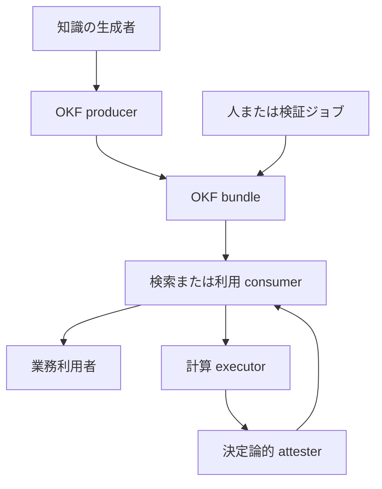
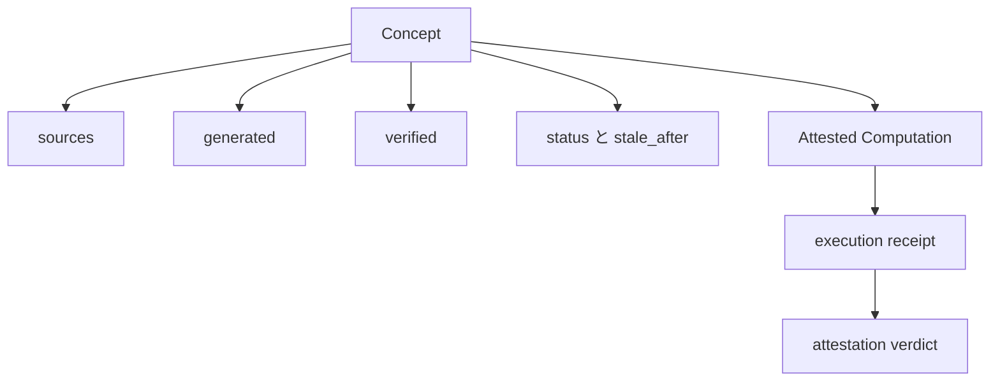

AI エージェントが知識を継続的に生成・更新するなら、Markdown を保存するだけでは採用判断に必要な情報が足りません。誰が作ったのか、何を根拠に検証したのか、いつ再確認すべきかを、本文を読む前に扱える必要があります。

Open Knowledge Format（OKF）v0.2 は、この課題に対して YAML front matter に来歴、検証、鮮度、ライフサイクル、計算証明の信号を加える仕様です。中央の信頼スコアを配るのではなく、producer が観測可能な事実を記録し、consumer が利用場面のリスクに応じて判断します。

> 本記事は 2026 年 7 月 25 日時点の OKF v0.2 仕様と Google Cloud の発表を基にしています。OKF はアクセス制御を置き換えません。知識を採用する前の判断材料を標準化する形式です。

OKF の基本構造と導入全般は、先行する [OKF の技術調査](https://zenn.dev/suwash/articles/okf-open-knowledge-format_20260613) で扱いました。本稿は v0.2 の移行点、trust tier、Attested Computation に焦点を絞ります。

## 概要

OKF は、人とエージェントが読める Markdown と YAML front matter で知識を表す、軽量なディレクトリ形式です。Git リポジトリ、tarball、より大きいリポジトリのサブディレクトリとして配布できます。

v0.2 は、エージェントが扱う知識に必要な判断材料を一級のフィールドとして加えます。同時に `timestamp` を `generated.at` へ、本文の `# Citations` を front matter の `sources` へ移す明示的な変更も含みます。v0.2 consumer はフォールバックにより v0.1 bundle を読めますが、全てが純粋な追加ではありません。

| 問い | v0.2 の信号 | consumer の判断 |
| --- | --- | --- |
| どこから来た知識か | `sources` | 参照元、作成者、更新日を確認 |
| 誰が作り、誰が確かめたか | `generated`、`verified` | 利用場面に必要な検証水準を確認 |
| 今も使えるか | `stale_after`、`status` | 期限切れや非推奨を候補から除外 |
| 正規の手順で値を計算したか | executor、receipt、attester | 実行結果と定義を決定論的に照合 |

ここで記録するのは信頼の判定そのものではなく、判定に使う事実です。たとえば経営報告画面では human-reviewed を必須にし、低リスクな検索候補では未検証でも警告付きで表示する、といった方針は consumer 側で決めます。

## 構造

OKF の責務は、知識を生成する側、検証する側、利用する側を同じメタデータ契約でつなぐことです。



| 要素名 | 説明 |
| --- | --- |
| OKF producer | Markdown と front matter を生成、更新する処理 |
| OKF bundle | Git などで配布する知識ファイル群 |
| consumer | 信頼、鮮度、状態をもとに候補を選別する処理 |
| executor | 宣言済みの計算を実行して receipt を返す処理 |
| attester | receipt と正規定義を照合する非 LLM の処理 |

consumer は最初に小さな front matter を読み、関連性と信頼性を評価してから本文を読む設計にできます。これにより、未検証または期限切れの知識を、長い本文を読む前に扱えます。

## データモデル

v0.2 の核は、概念ファイルに記録する 5 つの信号群です。



| 信号 | 意味 | 設計上の注意 |
| --- | --- | --- |
| `sources` | 外部文書、バンドル内パス、作成者などの来歴 | 単なるリンク集にせず、主張と対応付ける |
| `generated` | 現行の内容を生成または意味的に更新した actor と時刻 | 生成責任を追跡する |
| `verified` | 情報源または基礎リソースと照合した actor と時刻 | 生成と検証を同じ信号にしない |
| `status` | `draft`、`stable`、`deprecated` の状態 | deprecated を削除せず履歴として残せる |
| `stale_after` | 再検証が必要になる絶対日付 | 読んだ日時ではなく方針上の期限に結び付ける |

OKF は `verified` から trust tier を導出する規則を定義します。検証がなければ unverified、機械 actor の検証だけなら machine-confirmed、`human:` で始まる actor の検証を含めば human-reviewed です。consumer が独自に決めるのは、tier をどの画面で表示し、どの候補を採用するかです。この tier は認可判定に使いません。

## 最小の導入例

新フィールドは任意です。既存の v0.1 概念を壊さず、重要な意思決定に使う概念から足せます。

```yaml
---
type: Metric
title: Revenue
generated:
  by: reference_agent/gemini-2.5-pro
  at: 2026-06-30T14:00:00Z
verified:
  - by: human:finance-owner@example.com
    at: 2026-07-01T09:00:00Z
status: stable
stale_after: 2026-12-31
sources:
  - id: revenue-policy
    resource: policies/revenue-recognition.md
    title: Revenue Recognition Policy
    author: human:finance-owner@example.com
    last_modified: 2026-06-15
---
```

移行では、まず consumer の方針を決めます。任意の信号群が欠けた知識を全て拒否すると、既存バンドルとの後方互換性を壊します。一方で、Attested Computation の `runtime`、`sources` の `resource`、`generated` の `by` のように、各機能を使うときに必須となる項目は検証します。

1. 重要度の高い概念を選ぶ
2. `timestamp` を使っている概念を `generated.at` の候補として整理する
3. 本文末尾の引用一覧を、主張ごとに追える `sources` と脚注へ段階移行する
4. 検証責任者と `stale_after` を統制イベントに結び付ける
5. consumer ごとに採用、警告、除外の扱いを定義する

## consumer ポリシーを実装する

v0.2 は、信頼を一律に採点しません。リスク別の consumer ポリシーをコードとして持つことで、同じ bundle を複数の用途で使えます。

```python
from datetime import date


def can_show_to_executive(concept, today: date):
    if concept.get("status") == "deprecated":
        return False
    stale_after = concept.get("stale_after")
    if isinstance(stale_after, str):
        stale_after = date.fromisoformat(stale_after)
    if stale_after and today >= stale_after:
        return False
    verified = concept.get("verified", [])
    if isinstance(verified, dict):
        verified = [verified]
    return any(
        item["by"].startswith("human:")
        for item in verified
    )
```

この例は、経営向け画面では deprecated と期限切れを除外し、人手検証済みの概念だけを表示します。一方で、探索用のエージェントは未検証の概念も候補に残し、回答の前に追加の確認を要求できます。副作用操作の実行可否は、主体、資源、操作を対象にした別の認可機構で判定します。

## 計算結果には別の証明を置く

文書の検証と、計算が正規の手順で実行された確認は別の問題です。OKF の Attested Computation は、agent が SQL や API 呼び出しを即興で書き換える余地を減らします。

```yaml
---
type: Attested Computation
title: Revenue for a fiscal year
runtime: bigquery
parameters:
  - name: year
    type: integer
    required: true
executor:
  resource: skills/run-on-bq.md
  receipt: [job_id, executed_sql, result]
attester:
  resource: attesters/sql_equality.py
---

# Computation

```sql
SELECT SUM(amount) AS revenue
FROM finance.recognized_revenue
WHERE fiscal_year = @year
```
```

agent は宣言済みの parameter だけを入力し、executor は job ID、実行 SQL、結果などの receipt を返します。attester は実行内容と正規定義を決定論的に照合します。`verified` は文書の根拠を確認し、attestation は個別の実行を確認するため、どちらか一方で代替しません。

## 運用で避けるべき混同

| 症状 | 混同 | 対処 |
| --- | --- | --- |
| 環境ごとに信頼スコアが食い違う | 判定結果を共有データとして保存 | 生の信号を保存し、consumer ごとに導出 |
| 検証済みなのに古い定義が使われる | `verified` と `stale_after` を混同 | 根拠確認と期限判定を独立して評価 |
| 実行結果が正規 SQL と異なる | agent が計算本文を変更可能 | parameter のみ可変にし、receipt を attester で照合 |
| 有効な v0.1 bundle を拒否する | 任意の v0.2 フィールドを必須扱い | `type` 以外の欠損を許容し、consumer 側で制限 |

`stale_after` は相対 TTL ではなく絶対日付です。年次承認、四半期レビュー、runbook 更新など、すでにある統制イベントに期限を結び付けると、再検証の責任が曖昧になりません。

## まとめ

OKF v0.2 は、エージェント知識を「読めるファイル」から「採用根拠を持つファイル」へ進める追加仕様です。導入の焦点は、全ファイルへ一斉にメタデータを加えることではありません。

重要な意思決定に使う概念から、来歴、独立検証、鮮度、計算証明を consumer の統制方針と結び付けます。この分離により、形式は軽量なまま、利用場面ごとに必要な信頼水準を設計できます。

この記事が参考になった、または改善点があれば、リアクションやコメントで教えてください。

## 参考リンク

- 公式ドキュメント
  - [Open Knowledge Format v0.2 specification](https://github.com/GoogleCloudPlatform/knowledge-catalog/blob/main/okf/SPEC.md)
- GitHub
  - [GoogleCloudPlatform/knowledge-catalog OKF directory](https://github.com/GoogleCloudPlatform/knowledge-catalog/tree/main/okf)
- 記事
  - [Open Knowledge format v0.2 tackles agentic trust](https://cloud.google.com/blog/products/data-analytics/okf-v0-2-adds-trust-signals/)
