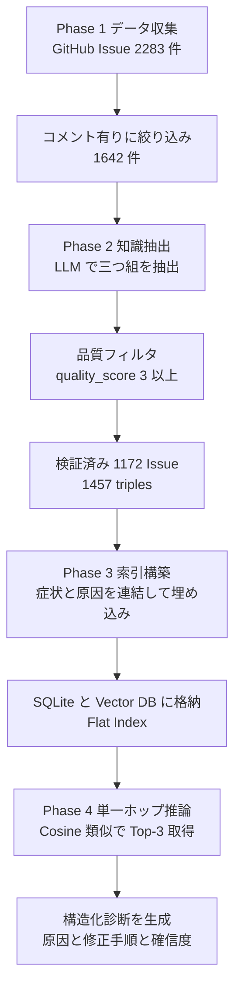
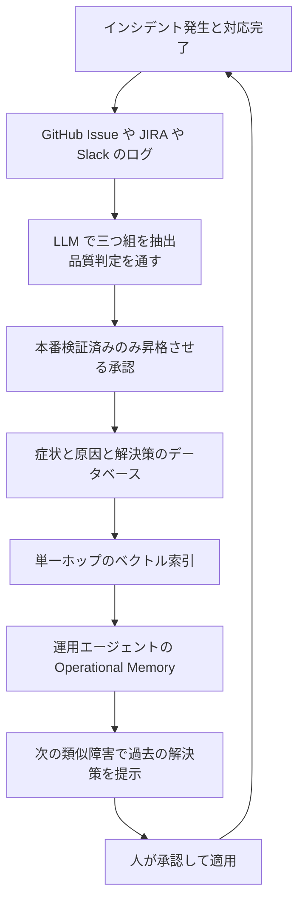

障害対応の知識を LLM に持たせようとして、Post-mortem や Issue をそのまま Vector DB に入れた結果、期待したほど当たらなかった経験はないでしょうか。

arXiv に公開された論文 *Leveraging Resolved Incident History for LLM-Assisted Software Bug Diagnosis* ([arXiv:2607.21911](https://arxiv.org/abs/2607.21911)) は、この失敗の原因を「検索精度」ではなく **知識源と検索単位の設計ミス** に帰着させています。提案手法は OM-RAG (Operational Memory RAG) と呼ばれ、解決済み障害を「症状・根本原因・解決策」の三つ組に構造化してから単一ホップのベクトル検索にかけるという、非常に素朴な構成です。

この記事では次の 3 点を整理します。

- 障害診断で従来型 RAG が失敗する構造的な理由
- OM-RAG のパイプラインとデータモデル
- 自分の環境へ持ち込むときの判断基準とガードレール

対象読者は、社内のインシデント履歴を AI 運用支援に使いたい SRE / プラットフォームエンジニア、およびその投資判断をする立場の方です。

## 障害診断で従来型 RAG が失敗する 2 つのミスマッチ

論文の主張は「RAG の検索器を強化しても足りない」という点にあります。失敗要因は次の 2 層に分かれます。

| ミスマッチ | 何を間違えているか | 起きること |
|---|---|---|
| 知識源 (Source) | 仕様書・公式ドキュメントを引いている | 「本来どう動くべきか」しか出ず、実際の故障モードが出ない |
| 検索単位 (Structure) | 非構造テキストのチャンクで分割している | 症状と原因が別チャンクに分かれ、因果の鎖が切れる |

仕様書は **理論知識 (Theoretical Knowledge)** です。一方で障害診断に必要なのは「過去に何がどう壊れ、どう直ったか」という **運用知識 (Operational Knowledge)** です。論文はこれを医師の比喩で説明しています。優れた臨床医は教科書の丸暗記ではなく、類似症例の治療経験を想起して診断する、という対応づけです。

もう一方の検索単位も見落としやすい論点です。障害記録を素朴に Chunking すると、あるチャンクにはエラーログ (症状) だけ、別のチャンクには設定変更 (対処) だけが入ります。LLM は断片から因果を再構成しなければならず、ここで情報が落ちます。

## OM-RAG のパイプライン

OM-RAG は 4 フェーズで構成されます。特別な検索アルゴリズムは使いません。



論文の記述では、抽出に `gpt-4o-mini`、埋め込みに `text-embedding-3-small`、最終推論に `gpt-5.2` を使用しています。索引は階層構造もグラフも持たない Flat Index です。

### 三つ組のデータモデル

インデックスの単位は 1 件の障害エピソードです。論文中の例を引きます。

```json
{
  "issue_id": "IQSS/dataverse#8102",
  "symptom": "Dataset publication fails with EZIDServiceBean NullPointerException after upgrading Java runtime.",
  "root_cause": "The EZID authentication token cache is uninitialized when the service bean initializes asynchronously in Payara 6.",
  "resolution": "Add @PostConstruct annotation to initialize TokenCache explicitly before async handling.",
  "quality_score": 5,
  "domain": "doi-pid"
}
```

設計上の要点は、埋め込み対象が `symptom + root_cause` の連結であることです。検索クエリ側は新規インシデントの Title + Body なので、「症状の記述どうし」を突き合わせる形になります。`resolution` は検索キーに含めず、ヒットしたあとに LLM へ渡す答えの側に置かれます。

プロンプトも凝ったものではなく、「類似の過去事例では原因は X であった。本件に当てはまるか」という precedent 提示型の問いかけです。

## 評価結果の読み方

IQSS/dataverse リポジトリから作成した 1,172 件のベンチマークで、推論 LLM を `gpt-5.2` に固定し、LLM Judge (`claude-sonnet-4-6`) による 4 軸ルーブリック評価 (計 4,688 回の Judge 呼び出し) を実施しています。

数値を読む前に前提を 2 つ押さえます。1 つは、この手法が机上実験だけではないことです。フロリダ国際大学 (FIU) の本番 Dataverse インスタンス (Java/Payara、PostgreSQL、Apache Solr、Shibboleth SSO の複合構成) で、2025 年 10 月から 6 ヶ月以上、AI 運用支援エージェントの知識コンポーネントとして稼働しています。もう 1 つは、その裏返しの制約です。ベンチマークも本番検証も **単一リポジトリ・単一プロダクト** に閉じており、以下のスコアは「履歴が十分に貯まった 1 システム」での値だという点は割り引いて読む必要があります。

| 構成 | 知識源 | 検索構造 | 診断精度 DA | 修正正確性 FC | 根拠性 G | 具体性 S | 総合 (Max 4.0) |
|---|---|---|---|---|---|---|---|
| C-zero | なし | なし | 0.238 | 0.170 | 0.429 | 0.453 | 1.290 |
| C-chunk | 解決済み Issue | 非構造チャンク | 0.325 | 0.187 | 0.865 | 0.584 | 1.961 |
| C-doc-kg | 公式ドキュメント | 概念グラフ | 0.526 | 0.402 | 0.684 | 0.627 | 2.239 |
| OM-RAG | 解決済み Issue | 構造化 Triple | 0.931 | 0.809 | 0.812 | 0.741 | 3.293 |

論文は全ペア間比較で p < 0.001 (10,000 回ブートストラップの信頼区間非重複) と報告しています。非構造チャンク比で +186%、ドキュメント概念グラフ比で +77% の診断精度向上という位置づけです。

この表で最も示唆的なのは C-chunk の行です。根拠性 0.865 は OM-RAG の 0.812 より高いのに、診断精度は 0.325 にとどまります。**検索された断片には忠実に従っているが、正解の原因を組み立てられていない** という状態です。「引用元に忠実か」を計る指標だけを見ていると、この失敗は検知できません。RAG の評価設計そのものへの警告として読めます。

C-doc-kg の行は知識源のミスマッチを示します。設計上の概念空間を経由するため、具体的な故障モードに届きません。

### GraphRAG が効かないという反直感的な結果

論文はさらに、マルチホップ探索構造が単一ホップ検索に対して診断精度を 43% 低下させたと報告しています。理由づけはシンプルです。バグ診断は「最も似た 1 件の過去事例を見つける」問題であり、本質的に単一ホップだからです。グラフ探索は経路探索ノイズと概念的な迂回を持ち込みます。

つまり、ここで効いているのは検索の高度化ではなく **データの前処理** です。投資先を選ぶ判断としては重要な差です。

## 自分の環境へ持ち込むときの判断基準

論文の性能をそのまま期待する前に、以下の 4 つのリスクを設計へ織り込む必要があります。論文自身も制約として挙げている点です。

### 誤った前例の再利用

一時しのぎのワークアラウンドや、誤った対処のままクローズされた Issue が三つ組になると、LLM がそれを自信を持って提示します。`quality_score` によるフィルタは「記述の明確さ」を見るもので、「対処の正しさ」を保証しません。

対策は、本番で検証済みの修復レコードだけをナレッジベースへ昇格させる承認プロセス (Promotion Pipeline) を挟むことです。

### 運用記憶の陳腐化

メジャーバージョンアップやアーキテクチャ刷新後、「設定ファイル A のパラメータ X を変更する」という過去の三つ組は無効、あるいは逆効果になります。

対策として、各三つ組に対象バージョンやコンポーネント依存のメタデータを持たせ、コードベース変更時に古い記憶を無効化するライフサイクル管理が要ります。索引に入れる設計だけを考えて、捨てる設計を忘れやすい部分です。

### 初出障害でのアンカリング

類似事例が存在しない障害では、コサイン類似度が最も高い (しかし本質的には無関係な) 事例に引きずられます。

ガードレールは閾値です。論文は類似度スコアに閾値 (例: 0.75) を設け、下回る場合は「過去事例なし」と判定してドキュメント検索やゼロショット診断へフォールバックする安全弁を挙げています。RAG に必ず何かを引かせる設計をやめる、という判断です。

### 診断精度と修正正確性の乖離

診断精度 0.931 に対し、修正正確性は 0.809 です。原因の特定は当たっても、具体的な修正コードや設定の生成は 2 割ほど外れます。したがって自動修復を無検証で回すのは危険であり、人間による確認・承認 (Human-in-the-loop) が前提になります。

適用範囲を「原因候補の提示まで」に切り、適用は人が承認する。ここが現実的な導入線です。

## Runbook の自己更新ループへの応用

この知見が効くのは、論文と同じバグ診断だけではありません。Runbook (運用手順書) の更新ループに直接接続できます。

従来の Runbook は人が Markdown を手で書くため、更新が止まり、障害時に検索しても役に立たない状態になりがちです。障害対応の出力を三つ組として自動蓄積すれば、次の形になります。



Runbook が「静的なドキュメント」から「障害解決の構造化データベース」に変わります。書き手の規律に依存しない仕組みになる点が本質です。

このループを自分の環境で始めるときの最小構成は次のとおりです。

1. 過去 1 年分のクローズ済み Issue から三つ組を抽出する。既存の LLM API で足りる
2. 症状と原因を連結して埋め込み、Flat Index に入れる。専用のグラフ DB もベクトル DB 製品も必須ではない
3. 類似度閾値を設け、下回ったら「該当なし」を返す
4. 提示は候補まで、適用は人が承認する

新規に構築するものは検索基盤ではなく、抽出と昇格の 2 つのフィルタです。

## 残る問い

論文が未解決としている論点も、そのまま自分の環境の制約になります。

- マイクロサービス環境で、サービス A の障害原因がサービス B の設定変更にある場合、分散トレースを跨ぐ三つ組をどう構造化・検索するか
- コミットの Diff と三つ組を連動させ、コード変更でどの運用記憶が無効になったかを自動追跡できるか

いずれも「単一リポジトリ・単一システム」という前提が外れたときに顕在化します。適用先が複数システムに跨る場合は、この前提差を先に確認したほうがよいでしょう。

## まとめ

- 障害診断の RAG が外れる原因は検索精度ではなく、知識源 (仕様書 vs 障害履歴) と検索単位 (チャンク vs 三つ組) の二重のミスマッチにある
- OM-RAG は解決済み障害を「症状・根本原因・解決策」に構造化し、症状と原因を連結した埋め込みで単一ホップ検索する。論文報告値は診断精度 0.931 / 修正正確性 0.809
- 根拠性が高いのに診断精度が低い C-chunk の結果は、RAG 評価を根拠性だけで見る危うさを示す
- マルチホップのグラフ探索は精度を下げた。投資先は検索の高度化ではなくデータの前処理
- 実運用では、誤った前例・記憶の陳腐化・初出障害でのアンカリングに対し、昇格承認・バージョンメタデータ・類似度閾値でのフォールバックが必要
- 修正正確性 0.809 のため、自動修復ではなく人の承認を挟む前提で適用範囲を切る

## 参考リンク

- [arXiv:2607.21911 — Leveraging Resolved Incident History for LLM-Assisted Software Bug Diagnosis](https://arxiv.org/abs/2607.21911)
- S. Barnett et al. (2024). Seven failure points when engineering a retrieval augmented generation system. IEEE/ACM CAIN 2024
- [S. Es et al. (2023). RAGAS: automated evaluation of retrieval augmented generation. arXiv:2309.15217](https://arxiv.org/abs/2309.15217)
- [J. Li et al. (2025). Generative AI for self-adaptive systems: state of the art and research roadmap. arXiv:2512.04680](https://arxiv.org/abs/2512.04680)
- A. Aamodt and E. Plaza (1994). Case-based reasoning: foundational issues, methodological variations, and system approaches. AI Communications
- J. O. Kephart and D. M. Chess (2003). The vision of autonomic computing. Computer 36(1)
- P. Maia et al. (2026). MAPER: extending MAPE-K with LLM-based reasoning to manage unanticipated situations in self-adaptive systems. SEAMS 2026
