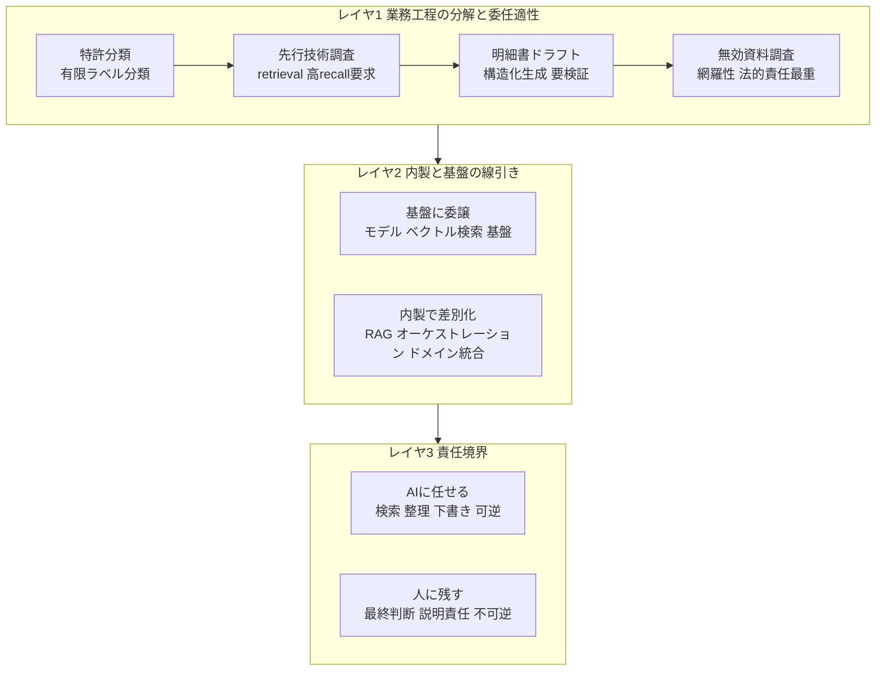

オムロンが特許・知財業務向けの「知財AIエージェント」を内製し、Amazon Bedrock を中核に運用している事例が報じられました。本記事は、この事例を成功談としてではなく、**高文脈・高責任な専門業務にAIをどこまで委ねるか**という設計判断の材料として読み解きます。AIを使う側（発注・経営）の視点で、再利用できる判断軸を抽出することがねらいです。

## 概要

一般報道の見出しは「特許関連工数を50%減」です。ただし、この削減率の一次根拠は本調査では確認できませんでした。元記事の Nikkei xTech は有料で本文を取得できず、AWS 公式の準一次記事では「分析時間を大幅に削減」という定性表現に留まります。判断支援の観点では、この事例の価値は「50%」という数字ではなく、その背後にある設計にあります。

事実として確認できる骨格は、オムロンの実装者が AWS マガジン（AWS builders.flash, 2025年11月）に寄稿した準一次記事から読み取れます。

| 項目 | 内容 |
|---|---|
| 基盤 | 研究開発特化の自社生成AI基盤「RD Buddy」の上に知財AIエージェントを内製実装 |
| 生成モデル | Amazon Bedrock の Claude 3.5 Sonnet |
| 埋め込みモデル | Amazon Titan Text Embeddings V2 |
| データ基盤 | 特許庁の公開情報を S3 に集約、Lambda で XML を構造化、DynamoDB でメタ管理 |
| 検索 | OpenSearch Serverless によるベクトル検索の RAG 構成 |
| セキュリティ | Direct Connect の閉域ネットワーク、IAM 最小権限、暗号化、CloudTrail / CloudWatch / X-Ray / Athena 監査 |
| 人の位置づけ | 専門家のフィードバック精度を損なわず制御。AIは専門家を拡張するパートナー |

この事例が示唆に富むのは、削減率の大小ではありません。**「何を内製し、何を基盤に任せ、どこに人を残したか」という線引きの型**です。本記事はその型を、業務工程の分解・内製と基盤の線引き・責任境界の3層で整理し、最後に「この型がどの条件で成立し、どこで崩れるか」を反証で限定します。

## 特徴

### 内製の正体は基盤の上のドメイン特化層

「内製」と聞くと基盤モデルから作る印象を持ちますが、オムロンが内製したのは**ドメイン特化のオーケストレーション層**です。基盤モデル・ベクトル検索・ストレージとサーバーレス実行は AWS のマネージドサービスに委ね、その上で「特許XMLの解析・前処理」「知財業務に最適化したエージェント本体」「専門家フィードバックの制御」を自前で作っています。これは生成AIの内製判断の定石（差別化しない重労働は managed、差別化レイヤを内製）と一致します。

### 効果の数字は割り引いて読む

見出しの「50%減」は本文未確認の二次情報であり、AWS 公式は定性表現に留まります。後述の反証が示すとおり、AI導入の工数削減は自己申告値が実測と逆向きにずれることが報告されています。この事例の再利用価値は、閉域・監査・人の検証ループという設計にあります。

### 知財業務は工程ごとに委任適性が違う

特許業務を工程に分けると、エージェント化のしやすさは**入力の構造化度・検証可能性・誤りの許容度**で決まります。オムロンが先行技術調査と分析レポート生成を主対象にしているのは、この適性序列に沿った選択です。

### 人はライン単位のレビューから検証ループの設計へ

オムロン事例の人の介在は、「AI出力を専門家フィードバックで制御する仕組み」「壁打ちで人が主導」と表現されます。これは、人がAIの出力を一行ずつ確認するのではなく、例外検知・最終判断・説明責任を人に残す監督モデルへの移行を示します。ただし、具体的な承認フローと責任境界の明文化は公開ソースでは確認できませんでした。

## 概念構造

この事例を再利用できる判断軸に落とすと、3つの設計レイヤに分解できます。

図の各要素は次のとおりです。

| 要素名 | 説明 |
|---|---|
| レイヤ1 | 業務を工程に分け、各工程の委任適性を判定する段 |
| レイヤ2 | 内製と基盤の線引きを決める段 |
| レイヤ3 | AIと人の責任境界を設計する段 |

### レイヤ1: 業務工程の分解と委任適性

| 工程 | 委任適性 | 理由 | 人に残る部分 |
|---|---|---|---|
| 特許分類 | 最も高い | 有限ラベルの多クラス分類。付与済みコードという正解ラベルが大量 | 細分類の最終確定 |
| 先行技術調査 | 高い（recall が課題） | クエリから候補へのretrieval問題。審査官引用という正解ラベルあり | 該当なしの最終判断 |
| 明細書ドラフト | 中（生成AIで伸長） | 課題・構成・効果への構造化再編はLLMの得意領域 | クレーム範囲・進歩性の法的検証 |
| 無効資料調査 | 技術は共通だが要求最重 | retrieval基盤は同じ | 1件も見落とせない高recall要求 |

一貫する軸は、**検索・分類・下書きは自動化、最終判断・網羅保証・説明責任は人**です。これは知財に限らず、後述する汎用のエージェント化適地判定とも一致します。

### レイヤ2: 内製と基盤の線引き

生成AIの内製判断の中核命題は、**自社固有の競争優位を生む部分は投資（build）し、コモディティに近い部分は既存サービスを使う（buy）**ことです。各フレームワークが同じ境界を別の言葉で描いています。

| レイヤ | 推奨スタンス | フレームワーク上の位置 |
|---|---|---|
| インフラ（モデルホスティング・ベクトルストア・スケーリング） | buy / managed | AWS「差別化しない重労働」／ Moore「Context」／ Wardley「Product・Commodity」 |
| 基盤モデル | 原則 buy（Taker / Shaper）。Maker は稀 | McKinsey の Taker-Shaper-Maker |
| オーケストレーション・RAG・ドメインデータ統合 | build（差別化の主戦場） | Moore「Core」／ Wardley「Genesis・Custom」 |

オムロンの構成はこの定石にそのまま乗っています。重要な但し書きは「差別化できる境界は時間とともに動く。判断は定期的に再訪せよ」という点です。今日 build した層が来年は買える層になりますし、その逆もあります。

### レイヤ3: 責任境界

AIに委ねてよいか、人に残すかは、複数の一次資料が共通の次元で語ります。

| 観点 | エージェント化しやすい | 人に残す |
|---|---|---|
| タスク構造 | 検索から整理・下書きの連続、固定パス化が困難 | 一回限りで非定型、最終工程 |
| 検証可能性 | 成功基準が客観的で検証が安価 | 検証が主観的・高コスト |
| 誤りのコスト | 失敗してもダメージ小・やり直し可 | 法務・医療サインオフなど高ステークス |
| 可逆性 | 取り消せる（下書き・提案・内部メモ） | 不可逆（支払い・送信・削除・契約） |
| 判断の性質 | 文脈から推論可能、例外処理あり | 倫理・価値判断、説明責任を伴う最終判断 |

OpenAI はエージェント化を検討すべき業務の3基準として、複雑な判断・維持困難なルール・非構造化データへの依存を挙げ、満たさなければ決定論的な解で十分としています。人間介入のトリガーは、失敗閾値の超過と高リスク行動の2つです。DeepMind は委譲の11次元のうち、検証可能性と可逆性が特に効くと整理しています。

知財の含意は明確です。**先行技術調査の候補抽出や分析レポートの下書き（可逆・検証可能）はAIに、先行技術なしの確定や明細書の権利範囲（不可逆・高ステークス・説明責任）は人に**残します。オムロンの専門家フィードバック制御ループは、この境界を運用に落とす仕組みと読めます。

## 比較: 類似する高責任業務の内製事例

知財ど真ん中で実名・数値・一次URLが揃う公開事例は乏しいものの、近接領域には一次の定量値があります。数値はすべて各社の発表値です。

| 企業 | ユースケース | 効果（発表値） | 出典区分 |
|---|---|---|---|
| 旭化成 | 知財: 特許起点の材料用途探索 | 候補選別時間を従来の約40%に短縮 | 一次 |
| コニカミノルタコネクト | 知財: 特許スクリーニング | 工数 最大40%削減 | 一次 |
| 塩野義製薬 | 薬事: CSR・プロトコール作成支援 | PoCでCSR約50%・プロトコール約20%削減 | 一次 |
| 三井物産 | 入札書類解析（Bedrock） | 約70%短縮・年間約2,000時間削減 | 一次 |
| パナソニック コネクト | 法務（下請法チェック）を業務AIが代行 | 全社で年間44.8万時間削減（横断値） | 一次 |
| 野村グループ | 広告審査コンプラ（Bedrock + Claude） | 精度向上・時間短縮（具体数値非開示） | 一次 |

数値の扱いには注意が必要です。MUFGの「月22万時間」は試算かつ全社事務対象で法務特化ではありません（二次: 日経）。中外の57%・87%、アステラスの97%、NECの知財94%は講演やメディア由来で企業の一次情報が未確認です（二次）。

## 反証: この型はどの条件で崩れるか

判断支援の観点では、成功側の整合性だけでなく**反証の強度**を示すことが重要です。暫定結論「高責任業務にAIを内製適用すれば工数を大幅削減でき、線引きすれば再現性高く展開できる」を弱める材料は、いずれも強い部類です。

| 反証の対象 | 強度 | 根拠 |
|---|---|---|
| 工数を大幅削減できる | 非常に強い | METRのRCTで経験者はAI利用時に実測19%遅くなった一方、自己評価は20%短縮と感じた。知覚と実測が約40ポイント逆ずれ |
| 高責任業務こそ適地 | 強い | 失敗コストが非対称。法務では架空判例引用の制裁が多発。専門ベンダー製でも防げていない |
| 検索・整理・下書きは適地 | 中〜強 | RAGはrecallとprecisionがトレードオフで、先行技術調査の高recall要求と相性が悪い |
| 内製と基盤の線引きで再現性展開 | 強い | 内製AIの本番化率が低い。Bedrockのモデルは最低12か月でEOLと短命で移行・値上げ・ロックインが継続コスト |
| 出願前発明をクラウドに載せる前提 | 致命的 | 出願前発明をクラウドに入力すると公知化（新規性喪失）とみなされうる。欧州は絶対新規性・猶予なし |

横断データとして、MIT Project NANDA は生成AIを導入した組織の約95%がP&Lに測定可能なインパクトを出せていないと報告しています（数値の二次照合: Fortune）。2025年にはPoCの少なくとも50%が本番前に放棄されました（二次: Gartner報道）。

なお、知財業務でAIを内製運用して大幅削減に成功した事例を**直接覆す個社の撤退事例は、今回の探索では特定できませんでした**。汎用の放棄率・法務の失敗・特許AIの理論リスクからの類推で代替しています。

これらを踏まえると、オムロン事例は「適地である」と一般化するより、次の条件を満たすときに例外的に成立する型として読むのが反証群と整合します。

1. 閉域データ: 出願前発明など秘匿情報を学習に使わせず、閉域で扱う
2. 高recallの検証: 先行技術調査の見落としを人が検証するループを設計する
3. 訓練された人の介入: HITLを置くだけにせず、コンプレイセンシーを前提に手順を設計する
4. 基盤移行の運用: 基盤モデルの短命なライフサイクルに毎年追随する運用コストを織り込む

## 未解決の問い

- 50%削減の一次根拠（測定範囲・母数・期間）
- 責任境界の明文化（誰が最終確認し、誤りが残った場合の責任はどこか）
- 知財ドメインに限定した内製AIの撤退・期待外れ事例の一次情報

## 推奨

判断支援者の立場で、この事例から移植すべきことを4点に整理します。

1. 数字でなく設計を移植する。「50%減」を目標に置くより、閉域・監査・人の検証ループ・内製と基盤の線引きという設計を自社の高文脈業務に当てる
2. 工程ごとに委任適性を判定する。業務を「検索・整理・下書き（可逆）」と「最終判断・説明責任（不可逆）」に再分解し、後者を人に残す。自動化率でなく委任率と人の介入点で設計する
3. 内製と基盤の境界を毎年再訪する。差別化しない重労働は managed、差別化レイヤを内製。ただし境界は動くので固定しない
4. 工数削減の主張を計測で検証する。自己申告の削減値は割り引き、実測で確認する設計を最初から入れる

## まとめ

オムロンの知財AIエージェント内製事例の本質は、工数削減率ではなく「内製と基盤の線引き＋専門家の検証ループ」という設計にあります。高文脈・高責任業務へのAI委任は、閉域データ・高recall検証・訓練された人の介入・基盤移行の運用という条件を満たすときに例外的に成立する型として読むのが、反証群と整合します。

この記事が少しでも参考になった、あるいは改善点などがあれば、ぜひリアクションやコメント、SNSでのシェアをいただけると励みになります！

## 参考リンク

- 公式ドキュメント・一次資料
  - [知財業務を革新するオムロンの知財 AI エージェント実装事例（AWS builders.flash）](https://aws.amazon.com/jp/builders-flash/202511/omron-intellectual-property-ai-agent/)
  - [オムロンにおける知財マネジメントの取組み（INPIT）](https://www.inpit.go.jp/content/100868666.pdf)
  - [Knowledge Bases for Amazon Bedrock（AWS）](https://docs.aws.amazon.com/prescriptive-guidance/latest/retrieval-augmented-generation-options/rag-fully-managed-bedrock.html)
  - [Amazon Bedrock Model lifecycle（AWS）](https://docs.aws.amazon.com/bedrock/latest/userguide/model-lifecycle.html)
  - [AWS Well-Architected コスト最適化の設計原則（AWS）](https://docs.aws.amazon.com/wellarchitected/latest/framework/cost-dp.html)
  - [A Practical Guide to Building Agents（OpenAI）](https://cdn.openai.com/business-guides-and-resources/a-practical-guide-to-building-agents.pdf)
  - [Building Effective Agents（Anthropic）](https://www.anthropic.com/engineering/building-effective-agents)
  - [Intelligent AI Delegation（DeepMind, arXiv）](https://arxiv.org/html/2602.11865)
  - [JPO AIアクション・プラン令和7年度（特許庁）](https://www.jpo.go.jp/system/laws/sesaku/ai_action_plan/ai_action_plan-fy2025.html)
  - [Measuring the Impact of Early-2025 AI on Experienced OSS Developer Productivity（METR）](https://metr.org/blog/2025-07-10-early-2025-ai-experienced-os-dev-study/)
  - [Legal RAG Hallucinations（Stanford）](https://dho.stanford.edu/wp-content/uploads/Legal_RAG_Hallucinations.pdf)
  - [Before you prompt: AI and the risk of public prior disclosure（DLA Piper）](https://www.dlapiper.com/en-us/insights/publications/2026/04/before-you-prompt-ai-and-the-risk-of-public-prior-disclosure-for-patentable-inventions)
- GitHub
  - [google/patents-public-data: BERT for Patents](https://github.com/google/patents-public-data/blob/master/models/BERT%20for%20Patents.md)
- 記事
  - [オムロンがBedrock活用で知財AIエージェント内製、特許関連工数を50％減（Nikkei xTech, 有料）](https://xtech.nikkei.com/atcl/nxt/column/18/03664/062600003/)
  - [Who Owns the Generative AI Platform?（a16z）](https://a16z.com/who-owns-the-generative-ai-platform/)
  - [Should you build or buy generative AI（CIO.com）](https://www.cio.com/article/645425/should-you-build-or-buy-generative-ai.html)
  - [How Atlantic Health cut legal document search time by 42%（AWS Industries）](https://aws.amazon.com/blogs/industries/how-atlantic-health-cut-legal-document-search-time-by-42-with-amazon-bedrock-metadata-filtering/)
  - [MIT report: 95% of generative AI pilots failing（Fortune）](https://fortune.com/2025/08/18/mit-report-95-percent-generative-ai-pilots-at-companies-failing-cfo/)
  - [IPRally Product Overview](https://www.iprally.com/product/overview)
