## 背景

エンタープライズデータ統合において、ビジネス概念の定義層（Semantic Layer）を raw データの上に構築するアプローチが主流になりつつあります。このアプローチには大きく 2 つの流派があります。

1. **オントロジーベース**: OWL/TTL によるビジネス概念の厳密な定義、SPARQL による問い合わせ
2. **dbt Semantic Layer**: YAML + SQL によるビジネスメトリクス定義、MetricFlow 経由の BI 接続

両者は「ビジネス概念の定義層」という本質を共有しています。一方で、形式主義の深さ・推論能力・エコシステムの成熟度では大きく異なります。

2025-2026 年にかけて、Data Mesh（ドメイン分散所有）と Data Fabric（メタデータ自動化）の融合が進んでいます。Knowledge Graph / オントロジーが両者を統合する「意味の糊」として注目されています。

この記事では両者を詳細に比較した上で、Data Mesh 時代のアーキテクチャにおいて**オントロジーを上位レイヤーに維持し、ネイティブインターフェースで下流ツールと接続する戦略**を提案します。OWL → dbt YAML 変換のような「上位概念を下位ツールに押し込む」アプローチがアンチパターンとなる理由も検証します。

**記事の構成:**

| セクション                          | 内容                                                           |
| ----------------------------------- | -------------------------------------------------------------- |
| 1. オントロジーベースのデータ活用   | アーキテクチャ全体像、データフローパターン、プロダクトスタック |
| 2. dbt Semantic Layer の概要        | アーキテクチャ、定義構造、エコシステム                         |
| 3. 両者の詳細比較                   | 概念対応、形式主義・推論・データソースの違い                   |
| 4. Data Mesh との統合アーキテクチャ | 2025-2026 年の最新動向と3つの構成パターン                      |
| 5. 統合戦略の評価                   | アンチパターンの検証と推奨アプローチ                           |
| 6. 今後の展望                       | 段階的導入と将来の技術動向                                     |

**関連記事:**

https://zenn.dev/suwash/articles/shanai_data_ontology_seiri_20260215

https://zenn.dev/suwash/articles/semantic_arts_gist_ontorojii_taikeika_20260216


## 1. オントロジーベースのデータ活用アーキテクチャ

### 1.1 全体像

オントロジーを用いたデータ活用では、業務 DB 群の上に概念モデル（OWL オントロジー）を定義します。その概念モデルを通じてデータにアクセスします。

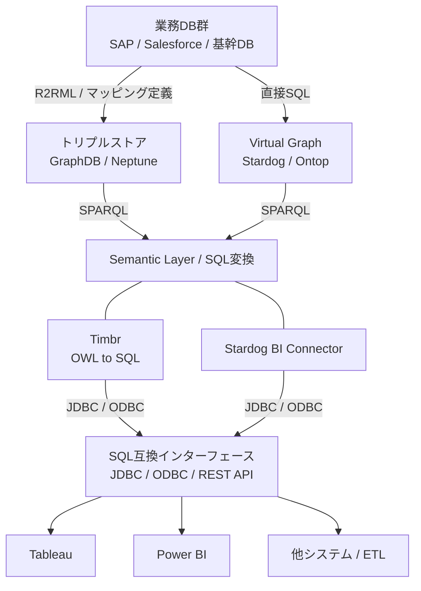

| 要素名                   | 説明                                             |
| ------------------------ | ------------------------------------------------ |
| 業務DB群                 | SAP / Salesforce / 基幹DB 等のデータソース       |
| トリプルストア           | RDF データの格納先（GraphDB / Neptune）          |
| Virtual Graph            | 既存 DB への仮想 RDF レイヤー（Stardog / Ontop） |
| Semantic Layer / SQL変換 | SPARQL から SQL 互換への変換層                   |
| SQL互換インターフェース  | JDBC / ODBC / REST API による標準接続            |

### 1.2 主要なデータフローパターン

#### パターン1: SPARQL 直接クエリ

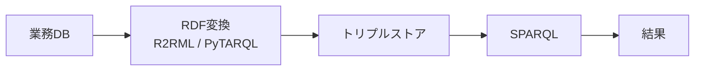

- 最もシンプルな構成
- 開発者・データエンジニア向け
- ツール: Stardog Studio, GraphDB Workbench, YASGUI

#### パターン2: OBDA / Virtual Graph - 仮想グラフ

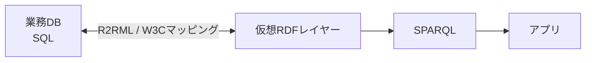

- 既存 RDB を SPARQL で直接問い合わせ可能にする仮想化
- 製品: Stardog Virtual Graphs, Ontop, Timbr
- 利点: ETL 不要、リアルタイム性、既存 DB への影響なし

#### パターン3: Semantic Layer → BI ツール

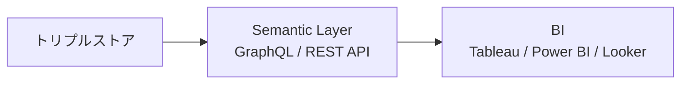

- ビジネスユーザーが慣れた BI ツールでオントロジー統合データを利用
- 製品: Timbr（SQL 互換セマンティックレイヤー）, Graphwise（PoolParty + GraphDB + BI）

#### パターン4: GraphRAG - 知識グラフ + 生成AI

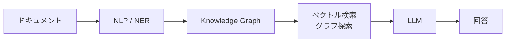

- 非構造化データをオントロジーに基づきグラフ化し、RAG で活用
- 製品: Neo4j GraphRAG, Amazon Neptune + Bedrock, Microsoft GraphRAG

#### パターン5: AI Agent + Ontology

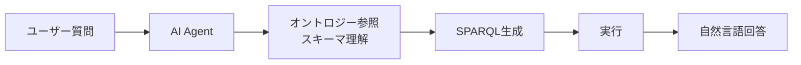

- LLM がオントロジーをスキーマとして理解し、自律的にクエリを組み立て
- 製品: Stardog Voicebox, Microsoft Fabric IQ

### 1.3 アプリケーション種別

| カテゴリ          | 具体例                                          | 主なユーザー       |
| ----------------- | ----------------------------------------------- | ------------------ |
| BI ダッシュボード | Tableau, Power BI, Looker                       | ビジネスユーザー   |
| グラフ可視化      | Neo4j Bloom, GraphDB Visual Graph, Metaphactory | データアナリスト   |
| 検索・探索        | PoolParty, Elasticsearch + KG                   | ナレッジワーカー   |
| 対話型 AI         | Stardog Voicebox, ChatGPT + KG                  | 全ユーザー         |
| データカタログ    | Collibra, Alation, Apache Atlas                 | データスチュワード |

### 1.4 代表的なプロダクトスタック

| プロダクト            | 主な特徴                                            | BI 接続方式               |
| --------------------- | --------------------------------------------------- | ------------------------- |
| Stardog               | Virtual Graph、自然言語クエリ（Voicebox）           | BI Connector（JDBC/ODBC） |
| Graphwise             | テキストからエンティティ抽出（PoolParty + GraphDB） | BI コネクタ               |
| Timbr                 | OWL を SQL ビューとして公開、学習コスト最小         | JDBC/ODBC                 |
| Neo4j + GraphRAG      | LPG ベース、ドキュメント→グラフ→ RAG                | Bloom 可視化              |
| AWS Neptune + Bedrock | フルマネージド RDF/SPARQL、LLM 連携                 | Glue 統合                 |
| Microsoft Fabric IQ   | 自然言語 → SQL/SPARQL、Copilot 連携                 | Fabric 統合               |

以下、各プロダクトの詳細です。

#### Stardog - エンタープライズ Knowledge Graph

- Virtual Graph で既存 DB に直結、ETL 不要
- Voicebox で自然言語クエリ対応
- Stardog Studio で SPARQL 開発・可視化
- BI Connector（JDBC/ODBC）で Tableau/Power BI 接続

#### Graphwise - PoolParty + GraphDB

- PoolParty: テキストからエンティティ抽出・分類
- GraphDB: トリプルストア + ビジュアルグラフ探索
- BI コネクタ経由で Tableau/Power BI 連携

#### Timbr - SQL 互換セマンティックレイヤー

- オントロジーを「SQL ビュー」として公開
- 既存の BI ツール・データ分析ツールから SQL でナレッジグラフにアクセス
- OWL クラスが「テーブル」、プロパティが「カラム」として見える
- データエンジニアの学習コスト最小

#### Neo4j + GraphRAG

- LPG（Labeled Property Graph）ベース、RDF インポート可能
- GraphRAG: ドキュメント → グラフ → ベクトル検索 → LLM 回答
- Bloom: ノーコードでグラフ可視化

#### AWS Neptune + Bedrock

- Neptune: フルマネージド RDF/SPARQL ストア
- Bedrock: LLM 連携でナレッジグラフ対話
- Glue + Lake Formation でデータガバナンス統合

#### Microsoft Fabric IQ

- Fabric: 統合データプラットフォーム
- IQ: 自然言語 → SQL/SPARQL 変換
- Copilot 連携でビジネスユーザーが直接データ問い合わせ

### 1.5 BI / 他システムへの接続方式

ビジネスユーザーが BI で活用する場合、最終的には SQL 互換のインターフェースが必要です。接続方式は 3 つに大別されます。

#### 方式1: Semantic Layer 製品（最も実用的）

Timbr が代表格です。

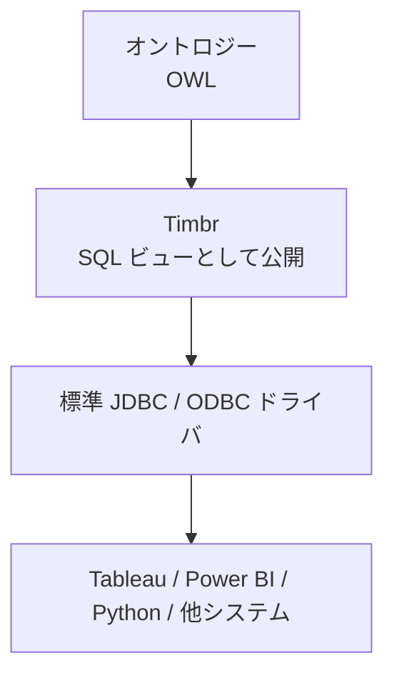

ビジネスユーザーは普通の SQL を書くだけでオントロジー統合データにアクセスできます。例えば `SELECT * FROM Customer WHERE region = 'APAC'` で、裏側では複数 DB を横断クエリします。

#### 方式2: トリプルストアの BI Connector

Stardog や GraphDB が提供する方式です。

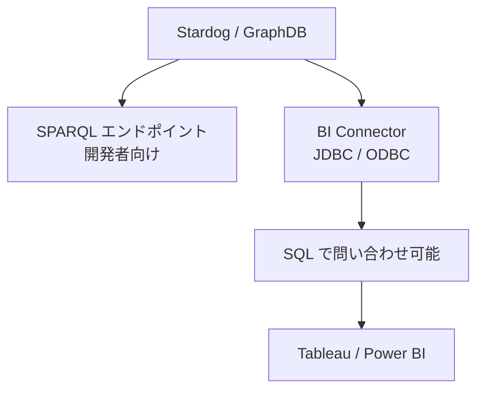

| 要素名               | 説明                                   |
| -------------------- | -------------------------------------- |
| Stardog BI Connector | SPARQL を SQL テーブルに自動マッピング |
| GraphDB JDBC Driver  | SPARQL クエリを JDBC 経由で実行        |

#### 方式3: ETL / 中間DB パターン（レガシー環境向け）

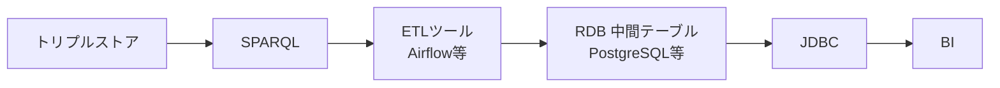

- 最もシンプルな構成（リアルタイム性は低く、バッチ更新）
- 既存のデータパイプラインに乗せやすい

#### 他システムへの連携一覧

| 連携先           | 接続方式              | 具体例                       |
| ---------------- | --------------------- | ---------------------------- |
| BI ツール        | JDBC/ODBC             | Tableau, Power BI, Looker    |
| データ分析       | JDBC or REST          | Python pandas, R, Jupyter    |
| アプリケーション | REST API / GraphQL    | 社内アプリ, マイクロサービス |
| データレイク     | SPARQL → Parquet 変換 | S3, Delta Lake               |
| AI/ML            | JDBC or SPARQL        | Feature Store, RAG           |

## 2. dbt Semantic Layer の概要

セクション 1 ではオントロジーベースのアプローチを整理しました。ここでは、もう一方の流派である dbt Semantic Layer を概観します。

### 2.1 アーキテクチャ

dbt Semantic Layer は、DWH 上のデータに対してビジネスメトリクスの定義層を提供します。

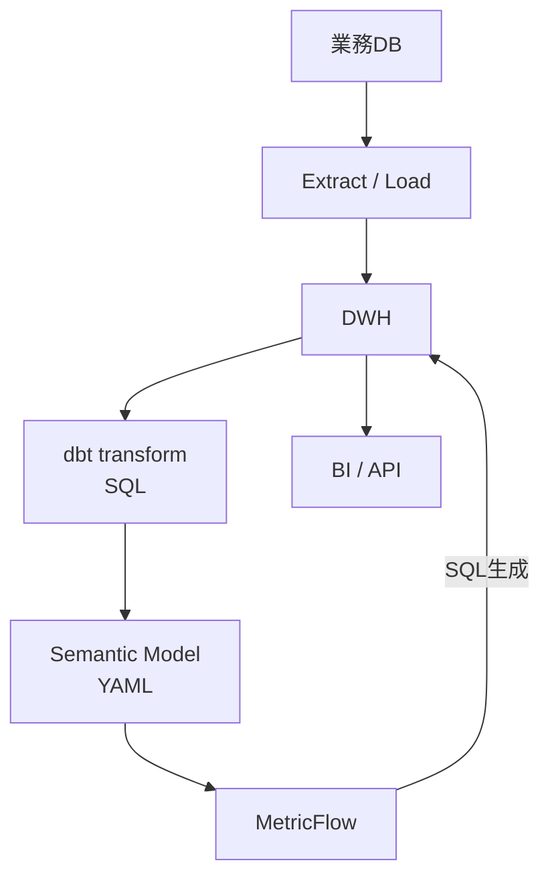

### 2.2 定義構造

```yaml
semantic_models:
  - name: customers
    description: "顧客マスタ"
    model: ref('stg_customers')
    defaults:
      agg_time_dimension: created_at

    entities:
      - name: customer_id
        type: primary
      - name: region_id
        type: foreign

    dimensions:
      - name: customer_name
        type: categorical
      - name: region
        type: categorical
      - name: created_at
        type: time

    measures:
      - name: total_revenue
        agg: sum
        expr: annual_revenue
      - name: customer_count
        agg: count_distinct
        expr: customer_id

metrics:
  - name: revenue_per_customer
    type: derived
    type_params:
      expr: total_revenue / customer_count
```

### 2.3 エコシステム

- dbt Cloud: CI/CD、バージョン管理、メトリクス API
- MetricFlow: メトリクス定義から SQL 自動生成
- BI 連携: Tableau, Power BI, Looker, Hex, Mode 等と標準統合
- dbt Mesh: チーム間でのモデル共有・ガバナンス

## 3. 両者の詳細比較

セクション 1・2 で整理した両者を、概念対応と本質的な違いの観点から比較します。

### 3.1 概念の対応関係

| オントロジー - OWL     | dbt Semantic Layer    | 役割                       |
| ---------------------- | --------------------- | -------------------------- |
| owl:Class              | semantic_model        | ビジネスエンティティの定義 |
| owl:ObjectProperty     | entity - foreign      | エンティティ間の関係       |
| owl:DatatypeProperty   | dimension             | エンティティの属性         |
| 数値系 Property        | measure               | 集計可能な属性             |
| rdfs:subClassOf        | 直接対応なし          | 継承・階層関係             |
| owl:disjointWith       | 直接対応なし          | 排他制約                   |
| owl:TransitiveProperty | 直接対応なし          | 推移的関係                 |
| TTL ファイル           | YAML ファイル         | 定義の記述形式             |
| R2RML マッピング       | dbt model - SQL       | raw data → 概念への変換    |
| SHACL                  | dbt test              | データ品質検証             |
| SPARQL                 | MetricFlow - SQL 生成 | クエリ言語                 |

### 3.2 本質的な違い

#### 定義の形式主義の度合い

**オントロジー - OWL**: 論理的形式体系です。クラス間の関係・制約を厳密に定義できます。

```turtle
:Customer a owl:Class ;
    rdfs:subClassOf gist:Organization ;
    owl:disjointWith :Supplier .

:hasRegion a owl:ObjectProperty ;
    rdfs:domain :Customer ;
    rdfs:range :GeoRegion .
```

この定義は「顧客は組織の一種であり、サプライヤーとは重複しない」「顧客は地理的リージョンを持ち、その値は GeoRegion クラスのインスタンスに限定される」という論理的制約を表現しています。

**dbt Semantic Layer**: 実用寄りです。YAML で属性と集計を宣言します。

```yaml
semantic_models:
  - name: customers
    entities:
      - name: customer_id
        type: primary
    dimensions:
      - name: region
        type: categorical
    measures:
      - name: lifetime_value
        agg: sum
```

シンプルで学習コストが低い反面、エンティティ間の論理的制約を表現する手段は限られます。

#### 推論の有無

これが両者の最大の差です。

**dbt の場合**: 「顧客 A は東京に所在」のみを返します。

**Ontology の場合**: 推論エンジンが暗黙の関係を自動導出します。

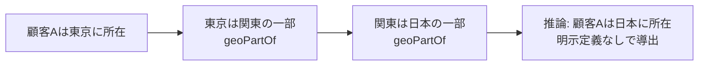

| 要素名   | 説明                                                         |
| -------- | ------------------------------------------------------------ |
| dbt      | 定義した通りにのみ返す（閉世界仮説）                         |
| Ontology | 推論エンジン（Reasoner）が暗黙の関係を自動導出（開世界仮説） |

#### データソースのスコープ

**dbt**: 単一 DWH（Snowflake/BigQuery 等）が前提です。全データを DWH に集約してから Semantic Layer を適用します。

**Ontology**: 複数の異種 DB を仮想統合できます。データを移動せず統合ビューを提供します（Virtual Graph）。

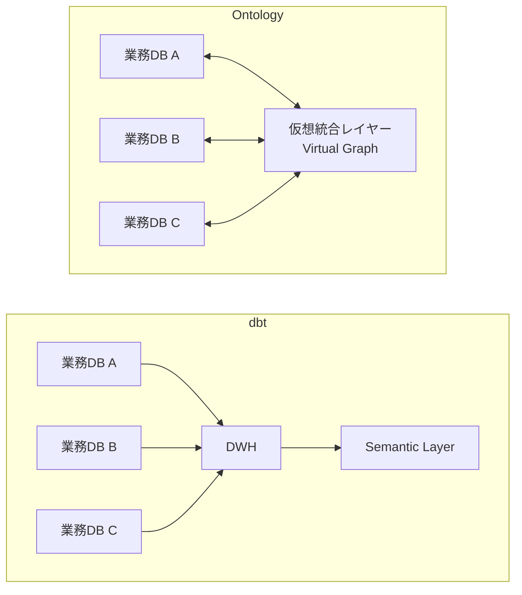

### 3.3 比較サマリ

| 観点         | dbt Semantic Layer         | Ontology Semantic Layer         |
| ------------ | -------------------------- | ------------------------------- |
| 本質         | ビジネス概念の定義層       | ビジネス概念の定義層            |
| 定義方法     | YAML + SQL                 | OWL/TTL                         |
| 推論         | なし                       | あり（自動導出）                |
| データソース | 単一 DWH                   | 複数異種 DB（仮想統合可）       |
| データ移動   | 必要（ELT）                | 不要（Virtual Graph）           |
| 学習コスト   | 低（SQL 知識で可）         | 高（OWL/SPARQL）                |
| エコシステム | 成熟（dbt Cloud, BI 連携） | 限定的（専門製品）              |
| 設計方法論   | 未体系化                   | 成熟（gist, SAMOD, Thin Slice） |
| ユースケース | DWH 中心の分析基盤         | 異種 DB 統合、知識管理          |

## 4. Data Mesh とオントロジーの統合アーキテクチャ

セクション 3 の比較を踏まえ、両者をどう組み合わせるかを検討します。2025-2026 年の最新動向として、Data Mesh / Data Fabric / Knowledge Graph の融合が進んでいます。

### 4.1 大きな流れ: Data Mesh + Data Fabric + Knowledge Graph の三位一体

2026 年時点で、Data Mesh と Data Fabric は補完関係として定着しました。Gartner は一方を採用した企業が 2-3 年以内に他方も導入すると予測しています。さらに Knowledge Graph / オントロジーがその統合の「糊」として注目を集めています。

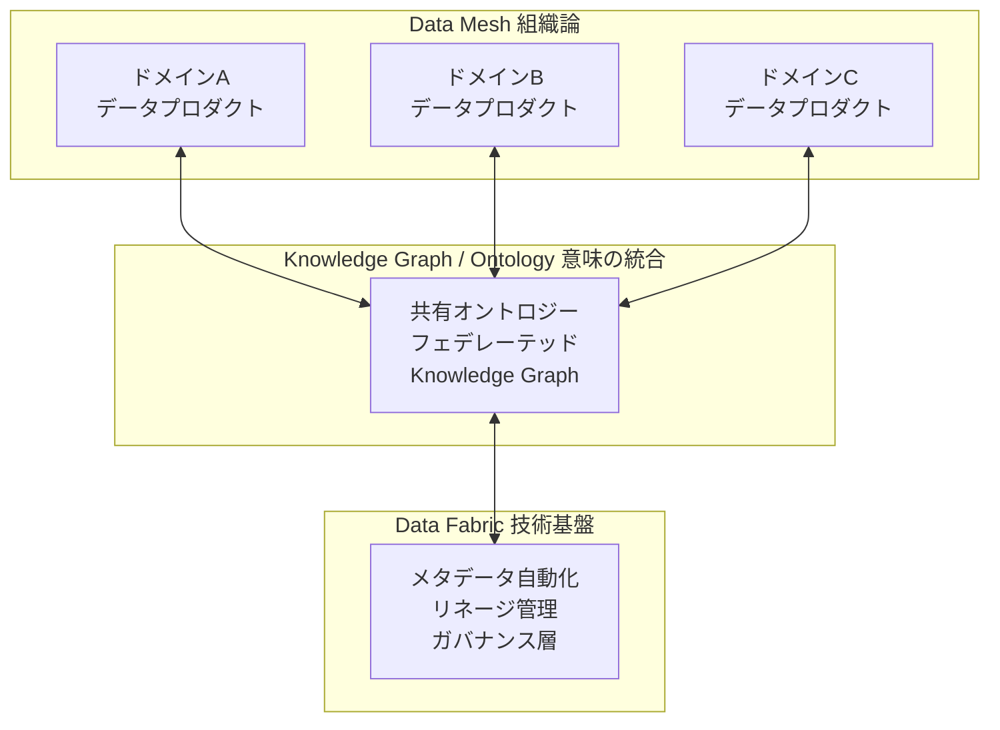

| 要素名          | 説明                                                                 |
| --------------- | -------------------------------------------------------------------- |
| Data Mesh       | ドメイン所有権の分散、データプロダクト思考（組織論）                 |
| Data Fabric     | メタデータ自動化、リネージ、統一ガバナンス層（技術基盤）             |
| Knowledge Graph | ドメイン横断の意味的統合、推論、フェデレーテッドクエリ（意味の統合） |

三者は異なるレイヤーの課題を解決しており、**組み合わせて使う**のが 2026 年の主流です。

### 4.2 3つの構成パターン

#### パターン1: Knowledge Mesh - 分散オントロジー + フェデレーテッドクエリ

各ドメインが自律的にオントロジーを所有し、共有上位オントロジーで相互運用します。データ移動なしにフェデレーテッドクエリで横断検索を実現します。

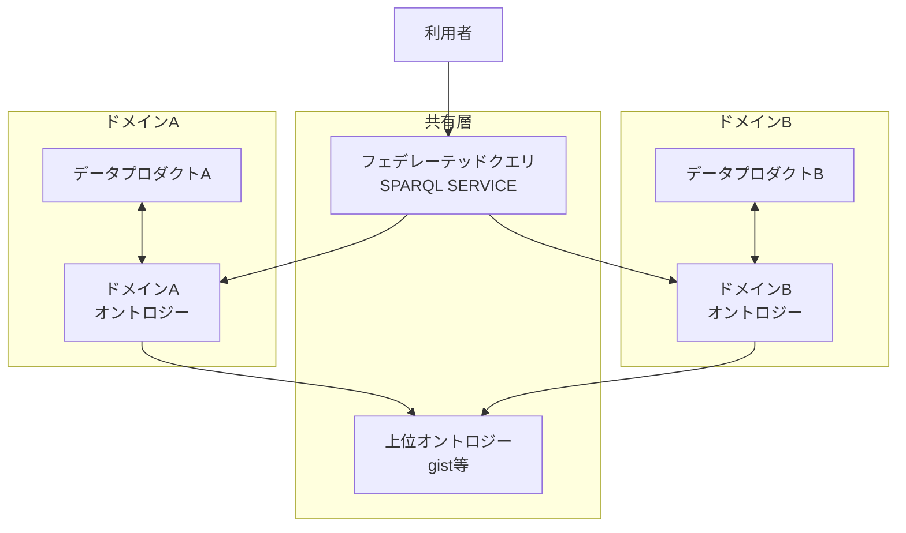

Blindata が提唱する「Knowledge Plane」がこの概念を体系化しています。オントロジーを「プロダクト」として扱い、ドメインが所有・進化させます。段階的成熟モデルとして、用語集 → タクソノミー → オントロジーの順に整備するアプローチを推奨しています。

| 観点 | 内容                                                                       |
| ---- | -------------------------------------------------------------------------- |
| 利点 | データ移動不要、ドメイン自律性維持、リアルタイム、推論の完全活用           |
| 課題 | フェデレーテッドクエリのパフォーマンス、ドメイン間オントロジーの整合性管理 |

#### パターン2: Semantic Data Mesh - セマンティックレイヤー統合型

Data Mesh のデータプロダクトを、セマンティックレイヤー製品で仮想統合します。OWL オントロジーで各ドメインのスキーマをマッピングし、SQL 互換で問い合わせ可能にします。

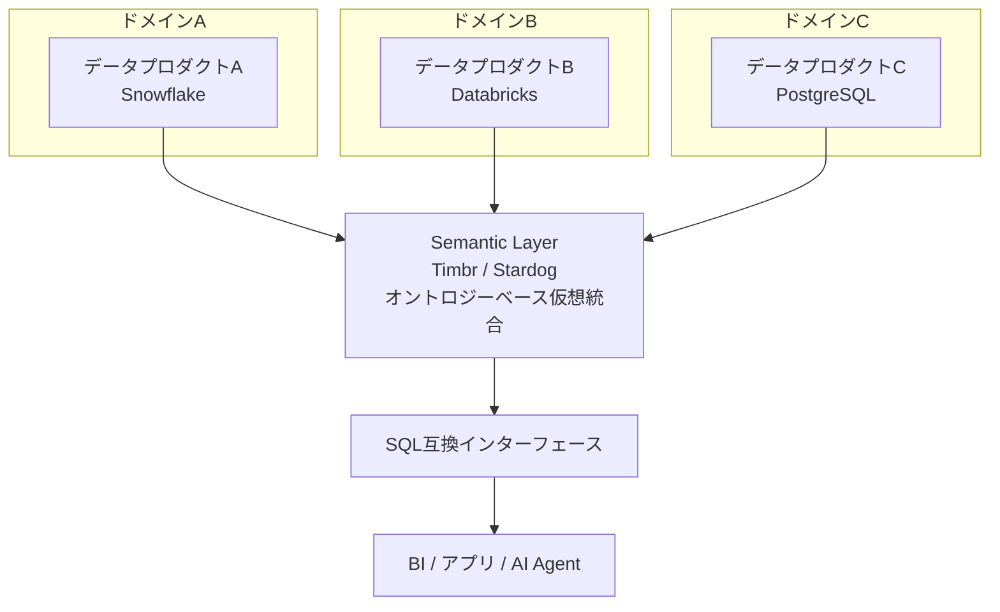

Timbr が「Semantic Data Mesh」として製品化しています。dbt との連携もサポートしています。

| 観点 | 内容                                                                                   |
| ---- | -------------------------------------------------------------------------------------- |
| 利点 | SQL 互換で学習コスト低、既存 BI ツールがそのまま利用可能、オントロジーの推論も活用可能 |
| 課題 | 専用製品への依存、仮想統合のパフォーマンス                                             |

#### パターン3: 集約 + ガバナンス型 - DWH 中心のハイブリッド

Data Mesh のドメイン所有を維持しつつ、分析用に DWH へ集約します。dbt がデータ変換とセマンティックレイヤーを担います。

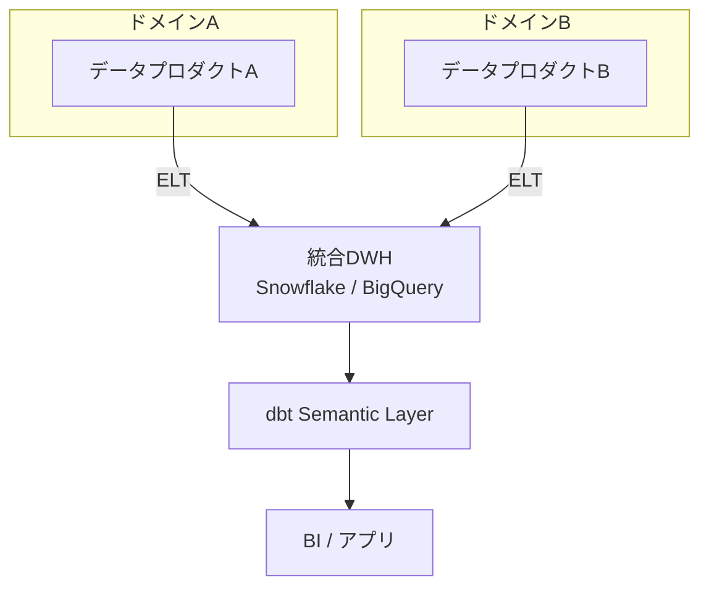

Thoughtworks の 2026 年レポートによると、多くの企業がこのパターンからスタートしています。中央データオフィスが「ゲートキーパー」から「センター・オブ・エクセレンス」に転換するのが成功パターンです。

| 観点 | 内容                                                     |
| ---- | -------------------------------------------------------- |
| 利点 | 成熟したエコシステム（dbt, Tableau 等）、学習コスト低    |
| 課題 | ELT によるデータ移動・遅延、DWH への集約がボトルネック化 |

### 4.3 2026 年の最新トレンド

| トレンド                  | 内容                                                              |
| ------------------------- | ----------------------------------------------------------------- |
| Mesh + Fabric 融合        | 一方を採用した企業は 2-3 年以内に他方も導入（Gartner 予測）       |
| AI-Ready データプロダクト | ML モデルの推論エンドポイント自体がデータプロダクトの出力ポートに |
| Knowledge Plane           | 用語集 → タクソノミー → オントロジーの段階的成熟モデル            |
| Semantic-First AI Agent   | オントロジーを理解する LLM が、ガバナンスされたモデル上で直接推論 |
| グラフ DB 市場成長        | 2025 年 28.5 億ドル → 2032 年 153.2 億ドル（CAGR 27.1%）          |
| ガバナンス成熟度          | Data Mesh 成功に必要なガバナンス成熟度を持つ企業はまだ 18%        |

## 5. 統合戦略の評価

セクション 4 で示した構成パターンを踏まえ、「OWL → dbt YAML 変換」という一見合理的なアプローチを検証し、推奨戦略を提示します。

### 5.1 OWL → dbt Semantic Layer 変換がアンチパターンである理由

両者の概念には対応関係があります（owl:Class ≒ semantic_model、owl:ObjectProperty ≒ entity 等）。技術的には OWL → dbt YAML の自動変換は可能です。しかし、これは**上位レイヤーの概念を下位レイヤーに押し込む**行為であり、戦略として推奨しません。

#### 概念対応表（参考）

| OWL 要素               | dbt 変換先            | 情報損失               |
| ---------------------- | --------------------- | ---------------------- |
| owl:Class              | semantic_model        | なし                   |
| owl:ObjectProperty     | entity / foreign      | なし                   |
| owl:DatatypeProperty   | dimension             | なし                   |
| rdfs:subClassOf        | meta タグでフラット化 | 継承による属性伝播なし |
| owl:disjointWith       | dbt test              | ランタイム検証のみ     |
| owl:TransitiveProperty | recursive CTE         | リアルタイム推論なし   |
| owl:equivalentClass    | meta タグ + view      | 自動等価性なし         |
| SHACL shapes           | dbt test + contract   | ほぼ完全               |

変換は可能ですが、以下の理由から戦略的に避けるべきです。

#### 理由1: 上位概念の切り捨てが不可逆

オントロジーが持つ推論・仮想統合・開世界仮説は、dbt の閉世界・単一 DWH・バッチ処理モデルに変換すると不可逆的に失われます。推移的関係を recursive CTE で事前計算するのは、推論エンジンのリアルタイム導出の劣化コピーに過ぎません。

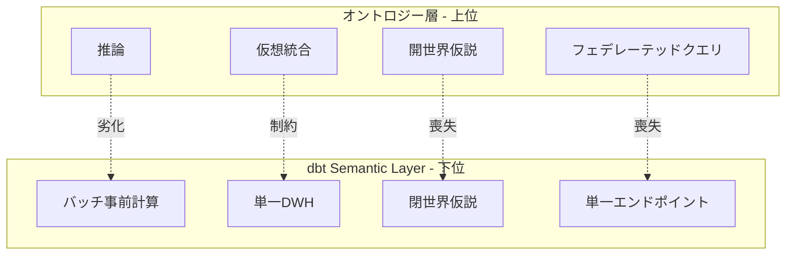

#### 理由2: プロダクトの進化に追従できない

Stardog、Timbr、GraphDB 等のオントロジーネイティブ製品は、BI Connector や SQL 互換インターフェースをすでに備えています。これらは JDBC/ODBC 経由で Tableau や Power BI と直接接続可能であり、dbt を経由せず BI に到達できます。

さらに、Knowledge Mesh や Semantic Data Mesh のアーキテクチャが成熟するにつれ、オントロジー層がネイティブに BI・AI Agent・他システムと接続する方向に進化しています。dbt YAML に変換すると、このネイティブ統合から切り離されます。

#### 理由3: Data Mesh / Data Fabric との不整合

Data Mesh はドメインごとの自律性と分散所有を原則とします。各ドメインがオントロジーを所有し、フェデレーテッドクエリで横断する Knowledge Mesh パターンはこの原則と整合します。一方、全ドメインのオントロジーを dbt YAML に変換して単一 DWH に集約するのは、Data Mesh の思想と矛盾します。

### 5.2 推奨アプローチ: オントロジーを上位レイヤーに維持する

オントロジーは意味論の定義層として上位に位置づけ、下位のツール（dbt, BI, AI）にはネイティブインターフェースで接続するのが正しい戦略です。

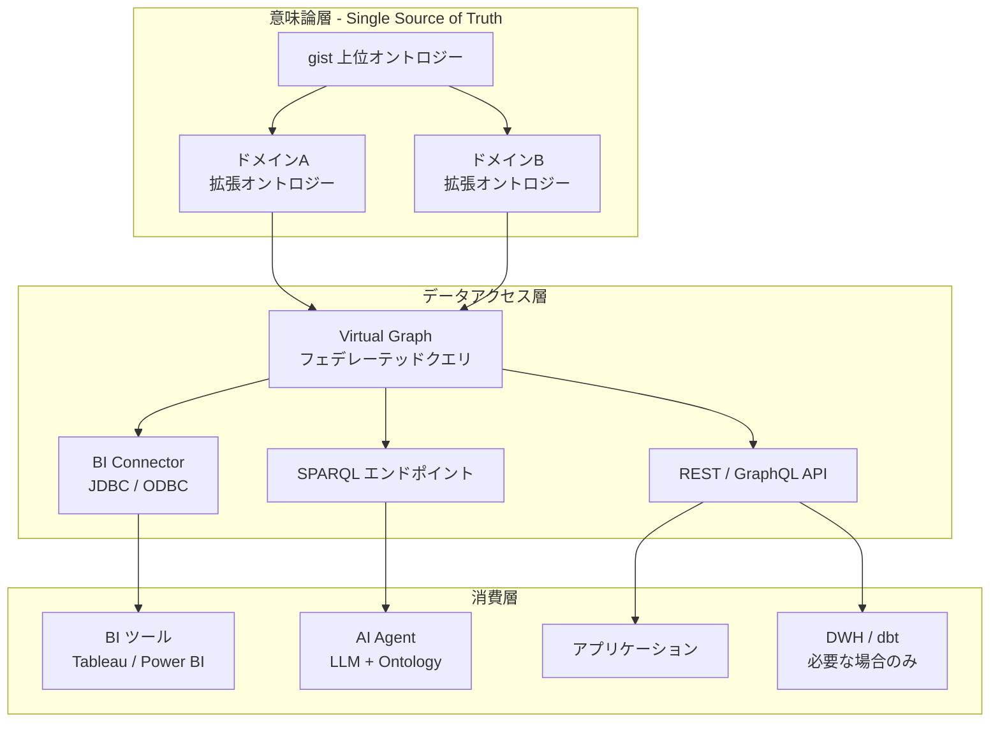

#### 設計原則

1. **オントロジーが Single Source of Truth**: ビジネス概念の定義はすべて OWL/TTL で管理
2. **ネイティブインターフェースで接続**: dbt YAML への変換ではなく、BI Connector / JDBC / REST で直接接続
3. **仮想統合を優先**: データは移動せず、Virtual Graph / フェデレーテッドクエリで統合
4. **DWH/dbt は必要な場合のみ**: 集計・バッチ処理が必要な分析ワークロードに限定して DWH を使用。dbt は「消費層のツール」であり意味論の定義層ではない
5. **段階的な成熟**: 用語集 → タクソノミー → オントロジーの順に段階的に整備

#### dbt の正しい位置づけ

dbt は「オントロジーに代わるもの」ではなく、「オントロジーが統合したデータを消費するツールの一つ」として位置づけます。

| レイヤー   | 役割                                     | ツール                  |
| ---------- | ---------------------------------------- | ----------------------- |
| 意味論定義 | ビジネス概念・関係・制約の定義           | OWL/TTL, Protege, SHACL |
| データ統合 | 異種 DB 仮想統合、フェデレーテッドクエリ | Stardog, Timbr, Ontop   |
| SQL 変換   | オントロジーを SQL 互換で公開            | BI Connector, Timbr     |
| 分析基盤   | 集計・バッチ分析（必要な場合）           | dbt, DWH                |
| 可視化     | ダッシュボード・レポート                 | Tableau, Power BI       |
| AI/自動化  | 自然言語クエリ、自律エージェント         | Stardog Voicebox, LLM   |

### 5.3 構成パターンの選択基準

| 判断基準           | Knowledge Mesh<br/>パターン1 | Semantic Data Mesh<br/>パターン2 | DWH 集約型<br/>パターン3 |
| ------------------ | ---------------------------- | -------------------------------- | ------------------------ |
| データソース       | 複数異種 DB                  | 複数異種 DB                      | 単一 DWH 集約済み        |
| リアルタイム性     | 高い                         | 高い                             | 低い（バッチ）           |
| 推論の必要性       | 必須                         | 活用可                           | 不要                     |
| 学習コスト         | 高（SPARQL）                 | 中（SQL 互換）                   | 低（SQL）                |
| ドメイン自律性     | 最も高い                     | 高い                             | 制限あり                 |
| エコシステム成熟度 | 発展途上                     | 成長中                           | 成熟                     |
| AI Agent 連携      | ネイティブ                   | 可能                             | 間接的                   |
| 推奨シナリオ       | 大規模分散組織               | BI 中心の分析組織                | DWH 既存の組織           |

実際にはこれらを**混在して運用**するのが現実的です。ドメインの性質やユースケースに応じて、パターン 1-3 を使い分けます。共通するのは**オントロジーを上位レイヤーに維持し、Single Source of Truth とする**点です。

## 6. 今後の展望

セクション 5 の推奨戦略を実践するための段階的な導入アプローチと、将来の技術動向を整理します。

### 6.1 段階的な導入アプローチ

1. **Phase 1: 用語集の整備**: ドメインごとにビジネス用語を定義し、共通語彙を合意
2. **Phase 2: タクソノミーの構築**: 用語間の階層関係を整理し、分類体系を確立
3. **Phase 3: オントロジーの定義**: gist 上位オントロジーを基盤に、ドメイン拡張オントロジーを OWL/TTL で厳密に定義
4. **Phase 4: 仮想統合の実現**: Stardog / Timbr 等でデータソースを仮想統合し、BI / AI からネイティブ接続
5. **Phase 5: Knowledge Mesh への展開**: ドメインがオントロジーを「プロダクト」として所有・進化させるガバナンスモデルを確立

### 6.2 将来的な技術動向

| 動向                          | 内容                                                                                                     |
| ----------------------------- | -------------------------------------------------------------------------------------------------------- |
| Semantic-First AI Agent       | オントロジーを理解する LLM がガバナンスされたモデル上で直接推論（Stardog Voicebox, Microsoft Fabric IQ） |
| Knowledge Graph as a Service  | Stardog, Timbr 等のクラウドサービス化。マネージドでの導入障壁低下                                        |
| Ontology-aware Data Catalog   | Collibra, Alation がオントロジーネイティブ対応を推進、Data Fabric との統合深化                           |
| AI によるオントロジー構築支援 | LLM を活用したオントロジー自動生成・リファインメントの実用化                                             |
| 企業間データ共有              | EU Data Act 等の規制を背景に、オントロジーベースのドメイン横断データ共有を推進                           |

## まとめ

この記事では、オントロジー Semantic Layer と dbt Semantic Layer を比較し、Data Mesh 時代における統合戦略を検討しました。

両者は「ビジネス概念の定義層」という本質を共有しつつ、以下の点で本質的に異なります。

| 観点         | オントロジー                       | dbt Semantic Layer      |
| ------------ | ---------------------------------- | ----------------------- |
| 推論         | 推論エンジンが暗黙の関係を自動導出 | 定義した通りにのみ返す  |
| データソース | 複数異種 DB の仮想統合             | 単一 DWH への集約が前提 |
| 形式主義     | OWL による厳密な論理的制約         | YAML による実用的な宣言 |

この違いから、両者の適用スコープは明確に分かれます。

| スコープ                 | 担当               | 理由                                                   |
| ------------------------ | ------------------ | ------------------------------------------------------ |
| 単一データプロダクト内   | dbt Semantic Layer | 単一 DWH 上のメトリクス定義・集計に適している          |
| 複数データプロダクト横断 | オントロジー       | 異種 DB の仮想統合・フェデレーテッドクエリ・推論が必要 |

OWL → dbt YAML 変換は技術的に可能ですが、推論・仮想統合・開世界仮説といった上位概念が不可逆的に失われるため、アンチパターンです。dbt Semantic Layer を複数データプロダクトの統合に使おうとするのは、スコープの越境にあたります。

推奨戦略は以下の通りです。

- **オントロジーを意味論の Single Source of Truth として上位に維持**し、複数データプロダクトを束ねる
- **dbt Semantic Layer は単一データプロダクト内に留め**、DWH 上のメトリクス集計を担う
- BI・AI 等の下流ツールには、オントロジーの **BI Connector（JDBC/ODBC）で直接接続**する
- バッチ集計が必要なワークロードに限り、dbt / DWH を経由する

導入にあたっては、用語集 → タクソノミー → オントロジーの順に段階的に整備します。組織の成熟度に応じて Knowledge Mesh / Semantic Data Mesh / DWH 集約型の 3 パターンを使い分けるのが現実的です。

## 参考リンク

- 公式ドキュメント
  - [W3C OWL 2 Web Ontology Language](https://www.w3.org/TR/owl2-overview/)
  - [W3C R2RML: RDB to RDF Mapping Language](https://www.w3.org/TR/r2rml/)
  - [dbt Semantic Layer Documentation](https://docs.getdbt.com/docs/use-dbt-semantic-layer/dbt-sl)
  - [MetricFlow Documentation](https://docs.getdbt.com/docs/build/about-metricflow)
  - [SAMOD - Simplified Agile Methodology for Ontology Development](https://essepuntato.it/samod/)
  - [Ontology Development 101 - Noy and McGuinness](https://protege.stanford.edu/publications/ontology_development/ontology101.pdf)

- GitHub
  - [gist GitHub Repository](https://github.com/semanticarts/gist)

- 製品・プラットフォーム
  - [Semantic Arts - gist Upper Ontology](https://www.semanticarts.com/gist/)
  - [Stardog - Enterprise Knowledge Graph](https://www.stardog.com/)
  - [Timbr - SQL Knowledge Graph](https://timbr.ai/)
  - [Ontop - Virtual Knowledge Graph](https://ontop-vkg.org/)
  - [GraphDB by Ontotext](https://graphdb.ontotext.com/)
  - [Neo4j GraphRAG](https://neo4j.com/labs/graphrag/)

- 記事
  - [Thoughtworks - The State of Data Mesh in 2026: From Hype to Hard-Won Maturity](https://www.thoughtworks.com/insights/blog/data-strategy/the-state-of-data-mesh-in-2026-from-hype-to-hard-won-maturity)
  - [Blindata - Architecting the Knowledge Plane for Humans and Agents](https://blindata.io/blog/2025/architecting-knowledge-plane/index.html)
  - [Timbr - Semantic Data Mesh for Scalable Data Management](https://timbr.ai/blog/semantic-data-mesh-for-scalable-data-management/)
  - [Enterprise Knowledge - How a Knowledge Graph Can Accelerate Data Mesh Transformation](https://enterprise-knowledge.com/how-a-knowledge-graph-can-accelerate-data-mesh-transformation/)
  - [Alation - Data Fabric vs Data Mesh: 2026 Guide](https://www.alation.com/blog/data-mesh-vs-data-fabric/)
  - [Stardog - What is a Data Mesh: Principles and Architecture](https://www.stardog.com/blog/what-is-a-data-mesh-principles-and-architecture/)
  - [Actian - Why Federated Knowledge Graphs are the Missing Link in Your AI Strategy](https://www.actian.com/blog/data-intelligence/why-federated-knowledge-graphs-are-the-missing-link-in-your-ai-strategy/)
  - [Dataversity - The Convergence of the Data Mesh and Data Fabric](https://www.dataversity.net/articles/the-convergence-of-the-data-mesh-and-data-fabric-data-architectures-new-era/)
  - [AtScale - The State of the Semantic Layer: 2025 in Review](https://www.atscale.com/blog/semantic-layer-2025-in-review/)
