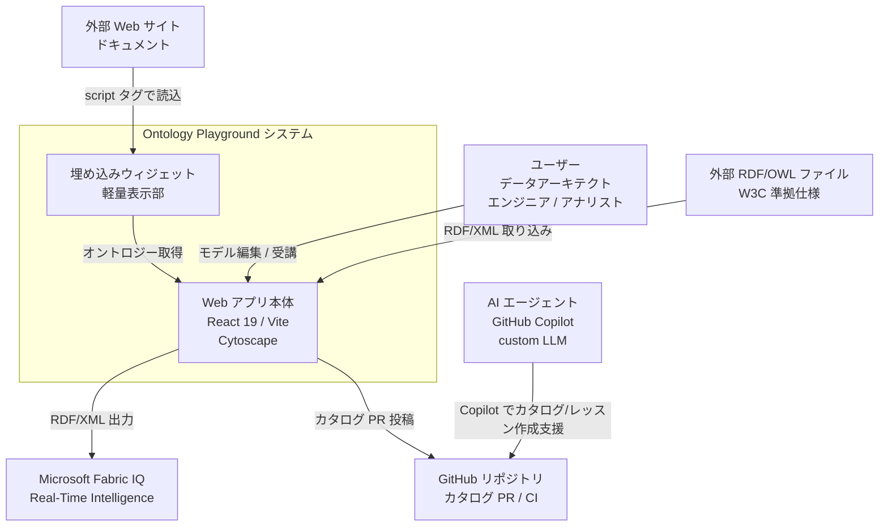
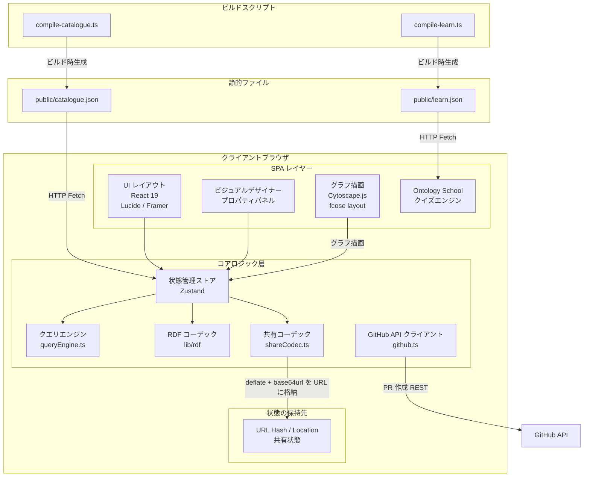
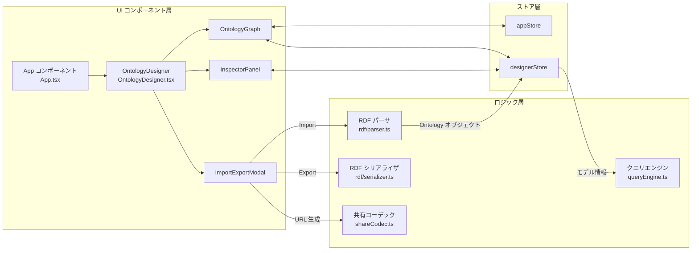
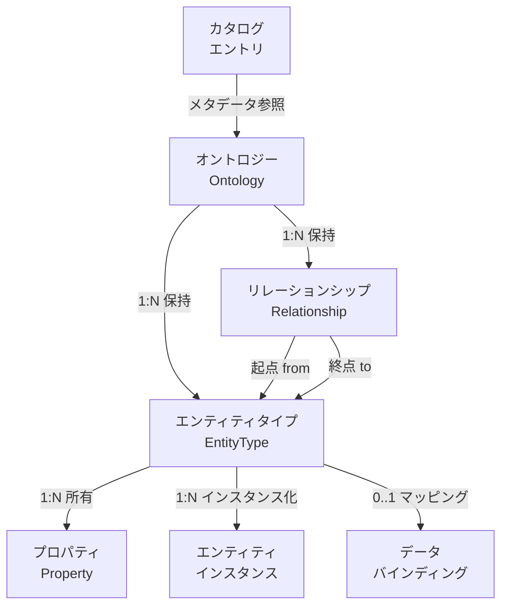
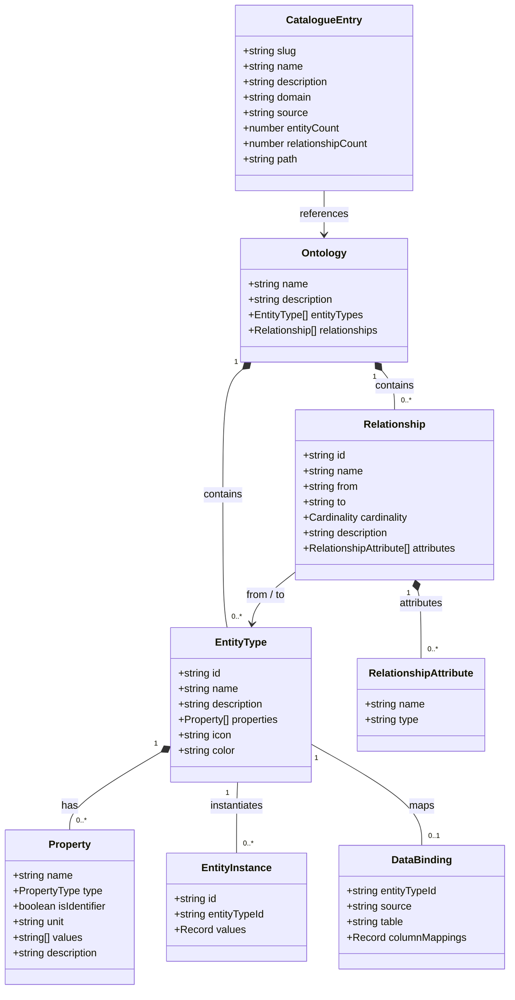
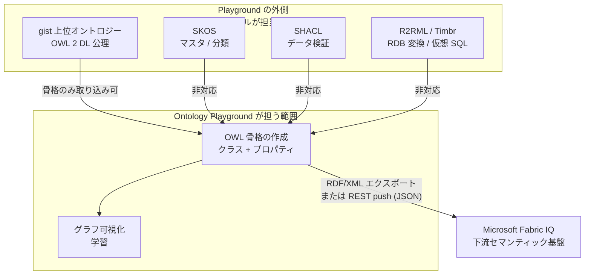

Microsoft **Ontology Playground**（リポジトリ: `microsoft/Ontology-Playground`）の構造・データモデル・構築・利用・運用をまとめます。

> 調査対象: `microsoft/Ontology-Playground`（旧プロジェクト名 `ontology-quest`） / 検証時点のスタック: React 19・Vite 8・TypeScript 5


*出典: [microsoft/Ontology-Playground](https://github.com/microsoft/Ontology-Playground)（`public/og-image.png`, MIT License）*

## 概要

Ontology Playground は、ブラウザだけで動くオントロジーの視覚化・モデリング・学習用オープンソース Web アプリケーションです。Microsoft Fabric IQ やリアルタイムインテリジェンス（Real-Time Intelligence）といったデータ & AI プラットフォームへの接続を想定しています。

データ基盤やセマンティックレイヤー（Semantic Layer）を作るとき、オントロジー（実体・プロパティ・関係からなる意味論的な構造モデル）の定義は欠かせません。従来の Protégé などのデスクトップツールは複雑で、導入の敷居が高い課題がありました。ビジネスユーザーやエンジニアが素早くモデルを試し、共有するには障壁になります。

Ontology Playground はバックエンドサーバーを必要とせず、完全にクライアントサイド（React 19 + TypeScript 5 + Zustand + Cytoscape.js）で動きます。リテール・製造・ヘルスケア・金融などの標準カタログオントロジーを直感的に閲覧できます。ビジュアルエディタでエンティティタイプ（EntityType）・プロパティ（Property）・リレーションシップ（Relationship）をリアルタイムに編集し、RDF/XML 形式（OWL 構文を含む）でエクスポートできます。

本ツールはエディタにとどまりません。**「Ontology School」**という対話型の教育コンテンツ（コース・記事・クイズ・埋め込みデモ）を備えます。オントロジーに対して自然言語クエリを解釈する**クエリエンジン（Query Engine）**と、理解度を高める**クエスト（Quests）機能**も持ちます。組織へのセマンティックモデリング導入と Fabric IQ 連携を後押しする総合プラットフォームです。

## 特徴

Ontology Playground の主要な特徴は次のとおりです。

| 特徴 | 説明 |
|---|---|
| 完全クライアントサイド設計 | React 19・Vite 8・TypeScript 5 を採用。グラフレイアウトや RDF パース/シリアライズをブラウザ上で実行。バックエンド API 不要で GitHub Pages や Azure Static Web Apps へ即デプロイ可能 |
| 直感的なビジュアルデザイナー | ノードとエッジのドラッグ & ドロップ編集、アイコン/カラー設定、カーディナリティ定義、プロパティの型指定と主キー指定 |
| 公式カタログとドメインテンプレート | Retail・E-Commerce・Healthcare・Finance・Manufacturing・Education の定義済みオントロジーを収録。コミュニティ投稿フローも完備 |
| マルチフォーマット入出力 | RDF/XML（OWL 構文）のインポート/エクスポート、Fabric IQ 向けマッピング、URL による状態共有。JSON/YAML/CSV は `VITE_ENABLE_LEGACY_FORMATS` で有効化 |
| 対話型学習「Ontology School」 | Markdown コース記事、習得度クイズ、埋め込みウィジェット、プレゼンテーションモード |
| クエリエンジンとクエスト | 自然言語クエリの解釈（`processQuery`）、最短パス探索（PathFinderPanel）、課題（Quests）自動生成をインメモリで実行 |
| AI 活用 | ランタイムの AI Builder（`VITE_ENABLE_AI_BUILDER` で有効化、Azure OpenAI）で自然言語からオントロジー生成。加えてリポジトリに GitHub Copilot 用の開発支援資産（`.github/skills/` `.github/prompts/`）を同梱 |

## 構造

### システムコンテキスト図

Ontology Playground は、セマンティックモデルの設計者（データアーキテクト・エンジニア・ビジネスアナリスト）や学習者が使うブラウザベースの Web アプリケーションです。外部システムとして Microsoft Fabric IQ・GitHub リポジトリ・オントロジー標準（RDF/OWL）と連携します。



#### システムコンテキスト構成要素の説明

| 要素名 | 説明 |
|---|---|
| ユーザー | オントロジーの参照・視覚化、新規モデル設計、RDF/OWL 出力、学習 |
| AI エージェント | リポジトリ同梱の GitHub Copilot 開発支援資産（`.github/skills/` `.github/prompts/`）を使ったオントロジー変換・レッスン生成支援 |
| Web アプリ本体 | グラフ描画・モデル編集・クエリ実行・学習コンテンツ提供 |
| 埋め込みウィジェット | 外部サイトへ対話型グラフビューを埋め込む独立モジュール |
| Microsoft Fabric IQ | エクスポート済みオントロジーの読み込みと自然言語データ検索 |
| GitHub リポジトリ | アプリのデプロイ元、カタログ・学習コンテンツのバージョン管理 |

### コンテナ図

Ontology Playground の内部は、静的アセット・ビルドパイプライン・クライアント状態管理・各種エンジン・ストレージで構成されます。



#### コンテナ構成要素の説明

| 要素名 | 説明 |
|---|---|
| UI レイアウト | Home・Designer・Catalogue・Learn 各画面のレンダリング |
| グラフ描画 | エンティティとリレーションシップの双方向対話型グラフ表示 |
| 状態管理ストア | オントロジー選択状態、編集中ノード/エッジ状態の管理（Zustand の appStore / designerStore） |
| クエリエンジン | 自然言語クエリの解釈と該当エンティティ/リレーションのハイライト |
| RDF コーデック | RDF/XML（OWL 構文）のパースとシリアライズ |
| ビルドスクリプト | Markdown や RDF 群を圧縮 JSON へ変換する tsx スクリプト |

### コンポーネント図

`src/` 配下の主要 TypeScript コンポーネントとモジュールの相互関係を示します。



#### コンポーネント構成要素の説明

| 要素名 | 説明 |
|---|---|
| App コンポーネント | ルーティング制御、メインレイアウト、グローバルダイアログのライフサイクル（`src/App.tsx`） |
| OntologyDesigner | モデリング用メイン画面。ツールバー・ツリービュー・キャンバスを配置（`src/components/OntologyDesigner.tsx`） |
| OntologyGraph | Cytoscape.js の初期化、fcose レイアウト計算、ノードドラッグと選択イベント処理（`src/components/OntologyGraph.tsx`） |
| InspectorPanel | 選択中エンティティのプロパティ編集とリレーション設定（`src/components/InspectorPanel.tsx`） |
| appStore | 選択中オントロジー、テーマ、通知、モーダル開閉状態（`src/store/appStore.ts`） |
| designerStore | 編集中 Ontology オブジェクト、Undo/Redo 履歴、選択中 Element ID（`src/store/designerStore.ts`） |
| RDF パーサ/シリアライザ | RDF/XML（OWL 構文）と内部 `Ontology` インターフェースの相互変換（`src/lib/rdf/`） |
| クエリエンジン | 自然言語クエリの解釈と該当エンティティ/リレーションのハイライト（`src/data/queryEngine.ts`） |

## データ

### 概念モデル

Ontology Playground の核となる概念は、オントロジー（Ontology）・エンティティタイプ（EntityType）・プロパティ（Property）・リレーションシップ（Relationship）・エンティティインスタンス（EntityInstance）・データバインディング（DataBinding）です。



#### 概念モデルの主要要素説明

| 要素名 | 説明 |
|---|---|
| Ontology | 対象ドメイン全体を包括するモデル定義。複数の EntityType と Relationship で構成 |
| EntityType | ドメイン内に存在する実体カテゴリ（Customer・Order・Product・Store など） |
| Property | EntityType が持つ固有属性（customerId・totalSpend・joinDate など）。型やキー情報を保持 |
| Relationship | 2 つの EntityType を結ぶ意味論的な関係。カーディナリティを定義 |
| EntityInstance | 実データ値を持つ実体インスタンス例。シミュレーションやクエリ検証に使用 |
| DataBinding | 外部データソースと EntityType の物理マッピング定義 |
| CatalogueEntry | プリセットカタログの識別情報・説明・メタデータ |

### 情報モデル

TypeScript の型定義に対応するクラス・インターフェース図です。



## 構築方法

### 前提条件

| 要素名 | 条件 |
|---|---|
| Node.js | `18.0.0` 以上（推奨は Node.js 20 LTS または 22） |
| npm | `9.0.0` 以上 |

### 環境構築とローカル開発サーバー起動

```bash
# リポジトリのクローン
git clone https://github.com/microsoft/Ontology-Playground.git
cd Ontology-Playground

# 依存パッケージのインストール
npm install

# 開発サーバーの起動 (Vite 8)
npm run dev
```

起動後、ブラウザで `http://localhost:5173` にアクセスします。

### プロダクションビルド手順

本プロジェクトは静的 SPA に加え、ビルド時にカタログデータや学習 Markdown を事前コンパイルします。

```bash
# 完全ビルド (カタログ + 学習コンテンツ + 型チェック + Vite + Embed)
npm run build
```

ビルドプロセス内部のスクリプト実行順序は次のとおりです。

| 順序 | コマンド | 処理内容 |
|---|---|---|
| 1 | `npm run catalogue:build` | `catalogue/` の RDF ファイル群（`.rdf` + `metadata.json`）を集約・検証し `public/catalogue.json` を生成 |
| 2 | `npm run learn:build` | `content/learn/` の Markdown 記事とクイズメタを解析し `public/learn.json` を生成 |
| 3 | `tsc -b` | TypeScript 型チェック |
| 4 | `vite build` | メインアプリの SPA バンドルを `build/` へ出力 |
| 5 | `npm run build:embed` | 埋め込み用の軽量 JavaScript バンドルを生成 |

### テスト・検証コマンド一覧

```bash
# 単発ユニットテスト実行 (Vitest)
npm test

# ウォッチモードでテスト実行
npm run test:watch

# アクセシビリティ (a11y) テスト実行
npm run test:a11y

# カタログ内の全 RDF ファイル妥当性検証
npm run validate

# リンター実行 (ESLint 9)
npm run lint
```

## 利用方法

### 1. ビジュアルデザイナーによるモデリング

ビジュアルデザイナーでの操作手順は次のとおりです。

1. ナビゲーションバーから `/#/designer` にアクセスします。
2. **エンティティ追加**: 「Add Entity」をクリックし、名前・説明・アイコン・テーマカラーを選びます。
3. **プロパティ定義**: 右側の詳細パネルで `customerId` (string, identifier) や `totalSpend` (decimal, unit: USD) を追加します。
4. **リレーションシップ作成**: 起点ノードから終点ノードへドラッグ、またはパネルの「Add Relationship」で名前（`placesOrder`）とカーディナリティ（`one-to-many`）を設定します。
5. **エクスポート**: 「Export」ダイアログで `RDF`（RDF/XML）形式を選び、ローカルへダウンロードします。

```typescript
// エクスポート/インポート処理の呼び出し例 (src/lib/rdf/)
import { parseRDF, serializeToRDF } from '../lib/rdf';
import { useDesignerStore } from '../store/designerStore';

// 現状のデザイナー状態を RDF/XML 文字列にシリアライズ
const currentOntology = useDesignerStore.getState().ontology;
const rdfXmlOutput = serializeToRDF(currentOntology); // 第2引数で DataBinding[] を渡せる

// 外部 RDF 文字列をインポートしてストアへ読み込み
const { ontology } = parseRDF(rdfXmlInput); // { ontology, bindings } を返す
useDesignerStore.getState().loadDraft(ontology);
```

### 2. ディープリンクと URL Hash ルーティング

アプリ内の全ページと編集状態は、共有可能な URL として保持されます。

| URL ルーティング | ページ内容 |
|---|---|
| `/#/` | ホーム画面。デフォルトオントロジー展示 |
| `/#/catalogue` | ドメイン別オントロジーギャラリー |
| `/#/catalogue/<source>/<slug>` | 個別カタログ参照（例: `/#/catalogue/official/cosmic-coffee`） |
| `/#/designer` | 空のビジュアルデザイナー |
| `/#/designer/<source>/<slug>` | カタログオントロジーを読み込んだデザイナー |
| `/#/share/<base64-data>` | 共有された編集状態をインラインで復元する URL |
| `/#/embed/<source>/<slug>` | 全画面の埋め込みビュー |
| `/#/learn` | Ontology School コース一覧 |
| `/#/learn/<course>` | コース詳細ページ |
| `/#/learn/<course>/<article>` | カリキュラム記事閲覧。プレゼンテーションモード対応 |

### 3. インメモリクエリエンジンの利用

オントロジーに対する自然言語クエリを解釈する `src/data/queryEngine.ts` の利用例です。エンティティ間の最短パス探索は `PathFinderPanel` コンポーネントが担当します。

```typescript
import { processQuery } from './data/queryEngine';
import { cosmicCoffeeOntology } from './data/ontology';

// サンプルオントロジー (Fourth Coffee) に自然言語クエリを実行
const response = processQuery('What is an entity type?', cosmicCoffeeOntology);

console.log(response.result);            // 回答テキスト (Markdown)
console.log(response.highlightEntities); // ハイライト対象のエンティティ ID 配列
```

### 4. 環境変数仕様

| 環境変数名 | デフォルト値 | 説明 |
|---|---|---|
| `VITE_ENABLE_AI_BUILDER` | `false` | Azure OpenAI による自然言語オントロジー自動生成の有効化 |
| `VITE_ENABLE_LEGACY_FORMATS` | `false` | JSON/YAML/CSV 等のレガシー入出力フォーマットの有効化 |
| `VITE_BASE_PATH` | `/` | アプリケーションのサブパス。GitHub Pages デプロイ時に自動設定 |
| `VITE_GITHUB_CLIENT_ID` | `""` | カタログ 1-click PR 投稿用の GitHub OAuth Client ID |
| `VITE_GITHUB_OAUTH_BASE` | `""` | GitHub OAuth トークン交換プロキシ URL（Cloudflare Worker 等） |

## 運用

### 1. Azure Static Web Apps への本番デプロイ

リポジトリには CI/CD 用の GitHub Actions ワークフロー（`.github/workflows/azure-static-web-apps-*.yml`）が同梱されています。手順は次のとおりです。

1. Azure Portal で「Static Web Apps」リソースを作成します。
2. GitHub リポジトリ（`microsoft/Ontology-Playground`）をソースに指定します。
3. 作成後に提供されるデプロイトークンを GitHub リポジトリの Secret に登録します。
4. `main` ブランチへ push すると自動でビルド・デプロイが完了し、PR 時にはプレビュー環境が自動でプロビジョニングされます。

### 2. GitHub Pages へのデプロイ（フォーク用）

フォーク環境での公開手順は次のとおりです。

1. リポジトリの **Settings → Pages → Source** で `GitHub Actions` を選びます。
2. `.github/workflows/deploy-ghpages.yml` により、`main` への push 時に自動ビルドが走り `https://<username>.github.io/<repo-name>/` へ公開されます。
3. `VITE_BASE_PATH` はワークフロー内で `/<repo-name>/` に自動設定され、アセットパスの崩れを防ぎます。

### 3. Microsoft Fabric IQ 連携運用

Fabric IQ との連携手順は次のとおりです。

1. ビジュアルデザイナーで設計後、「Export」から `RDF/XML` をダウンロードします。README は「Fabric IQ が期待する形式でエクスポートする」と説明しています。
2. Microsoft Fabric 側でオントロジーを取り込みます。取り込み画面名や手順は Fabric 側の仕様に従うため、[Fabric IQ 公式ドキュメント](https://learn.microsoft.com/en-us/fabric/iq/ontology/overview)を参照してください。
3. Lakehouse などの物理データと EntityType のバインディングを設定します。
4. 自然言語で「Fourth Coffee の先月のゴールド会員の売上合計は？」のようなセマンティッククエリを実行します。

> 補足: 本アプリが保証するのは手順 1（Fabric IQ 期待形式での RDF/XML 出力）までです。手順 2 以降は Microsoft Fabric 側の機能であり、画面名・操作は Fabric の公式手順に従ってください。

## ベストプラクティス

### 1. オントロジーモデリング設計規則

| 要素名 | 内容 |
|---|---|
| 命名規則の統一 | EntityType 名は CamelCase（`Customer`・`ClinicalSystem`）、Property 名と Relationship 名は lowerCamelCase（`customerId`・`placesOrder`） |
| 明確な主キーの指定 | 各 EntityType に 1 つ以上の `isIdentifier: true` プロパティ（例: `customerId`）を設定 |
| カーディナリティの厳密な定義 | `one-to-many` や `many-to-one` を明示し、グラフ検索やクエリ生成の誤解を防止 |

### 2. カタログ貢献・ガバナンスルール

| 要素名 | 内容 |
|---|---|
| 単一責任のドメインモデル | 1 ファイルに無関係なドメインを混在させず、独立 RDF として `catalogue/community/` または `catalogue/official/` に配置 |
| ビルド前バリデーションの徹底 | PR 作成前に `npm run validate` をローカル実行し、RDF のメタデータ欠落や構文エラーを防止 |

### 3. ブラウザパフォーマンスの最適化

| 要素名 | 内容 |
|---|---|
| Cytoscape レイアウト調整 | 50 ノード以上の表示では物理シミュレーションのイテレーション数を抑え、`fcose` の計算負荷を低減 |
| 大規模データセットの分割 | 100 ノード超はサブドメインごとにビューを分割し、視認性と操作性を維持 |

## トラブルシューティング

### 1. RDF/XML インポート時に構文エラーが発生する

- **現象**: 外部 Protégé やカスタムスクリプト生成の RDF/XML をインポートすると `Invalid RDF structure` になる、または空ノードが生成されます。
- **原因**: W3C 規格のネームスペース定義（`xmlns:rdf`・`xmlns:owl`・`xmlns:rdfs`）の欠落、または未サポートの高度な OWL 構文（`owl:unionOf`・`owl:intersectionOf` 等）の混入です。
- **対策**:
  1. インポートファイルのルートタグにネームスペースが定義されているか確認します。
  2. `npm run validate -- <file>.rdf` で対象ファイルを検証し、エラー内容を確認します（`validate-rdf.ts` は個別 RDF ファイルの引数を受け付けます）。
  3. サポート対象の `owl:Class`・`owl:DatatypeProperty`・`owl:ObjectProperty` へ構文を単純化します。

### 2. グラフキャンバスがフリーズする・描画が重い

- **現象**: 大規模オントロジーを開くと、ブラウザの UI スレッドがハングアップします。
- **原因**: `cytoscape-fcose` の初期ノード配置計算による CPU 高負荷です。
- **対策**:
  1. ライブ検索バー（`SearchFilter`）でエンティティ/リレーションを絞り込み、表示対象を減らします。
  2. 大規模オントロジーはサブドメイン（Sub-ontology）ごとに分割して開きます（ベストプラクティス参照）。
  3. フォーク開発時は `fcose` レイアウトの物理シミュレーションのイテレーション数を抑えて計算負荷を下げます。

### 3. 1-click カタログ PR 作成時に 401 / 403 エラーが発生する

- **現象**: デザイナーで作成したオントロジーを GitHub PR へ投稿すると認証エラーになります。
- **原因**: この機能は GitHub の device-flow OAuth を使います。ブラウザから GitHub の OAuth エンドポイントを直接呼べない（CORS）ため、`VITE_GITHUB_CLIENT_ID` と中継プロキシ `VITE_GITHUB_OAUTH_BASE`（Cloudflare Worker 等）が必要です。いずれかが未設定、またはトークンの期限切れが原因です。
- **対策**: `.env` で正しいクライアント ID と OAuth プロキシを確認します。手動の場合は RDF ファイルをエクスポートし、標準の GitHub Web UI / CLI から PR を起票します。

## 関連ツール・標準との連携と位置づけ

エンタープライズのオントロジー基盤には、gist のような上位オントロジー、SKOS・SHACL などの W3C 標準、Timbr などの仮想化ツールが登場します。Ontology Playground がこれらとどう連携できるかを、各ツールの一次ソースに基づいて整理します。

### 連携対応

| 相手 | 連携 | 内容 |
|---|---|---|
| Microsoft Fabric IQ | ○ 実連携 | RDF/XML 出力に加え、`src/lib/fabric.ts` から Fabric REST API へオントロジー定義を push。想定される唯一の下流基盤 |
| OWL（骨格） | △ フラットのみ | クラスとデータ型/オブジェクトプロパティ（domain/range）まで対応。クラス階層（`rdfs:subClassOf`）や制約（`owl:Restriction`）は保持しない |
| gist 上位オントロジー | △ 骨格のみ取り込み | gist は RDF/XML 版も配布するものの、公式 RDF/XML は DTD 内部実体参照を多用するため、ブラウザのパーサではそのまま解析に失敗しうる（前処理が必要）。解析できても `owl:Restriction`・`owl:equivalentClass`・`owl:unionOf` などで定義されるクラス本体と階層は落ち、主要クラス/プロパティの一覧を眺める用途に限る |
| SKOS | ✗ 非対応 | 分類（`broader`/`narrower`）・同義語・多言語の器を持たない |
| SHACL | ✗ 非対応 | 独自のバリデーションはあるが、SHACL shapes の入出力はしない |
| R2RML / Direct Mapping / OBDA | ✗ 非対応 | RDB スキーマの取り込みや SPARQL から SQL への変換をしない。DataBinding は手動の簡易マッピング |
| Timbr などの仮想 SQL 層 | ✗ 非対応 | 接続機構を持たない |
| Turtle / JSON-LD / SPARQL | ✗ 非対応 | シリアライズは RDF/XML のみ。クエリはインメモリの自然言語解釈のみ |

### エンタープライズ基盤での位置づけ

「SKOS = マスタ / OWL = 骨格 / SHACL = 検証」という役割分担で見ると、Ontology Playground が担うのは **OWL 骨格（フラットなクラス + プロパティ）の作成・可視化**です。上位の gist、分類の SKOS、検証の SHACL、RDB 変換や仮想化（R2RML・Timbr）は Playground の外側で担います。



Ontology Playground は、重厚な OWL 2 DL エディタ（Protégé など）の入口となる**軽量なオーサリング・可視化フロントエンド**として位置づけると実態に合います。オントロジーの意味論をフルに保持した統合基盤ではありません。

### 関連記事

- [エンタープライズデータ統合の要 - Semantic Arts gist オントロジー](https://zenn.dev/suwash/articles/semantic_arts_gist_ontorojii_taikeika_20260216)
- [社内データ利活用のためのオントロジー整理方法](https://zenn.dev/suwash/articles/shanai_data_ontology_seiri_20260215)

## まとめ

Ontology Playground は、React 19 の完全クライアントサイド設計で、オントロジーの視覚化・モデリング・学習・Fabric IQ 連携までブラウザ 1 つで完結させる OSS です。RDF/XML（OWL 構文）の相互運用と対話型学習「Ontology School」を備え、セマンティックモデリングの導入障壁を大きく下げます。

この記事が少しでも参考になった、あるいは改善点などがあれば、ぜひリアクションやコメント、SNSでのシェアをいただけると励みになります！

## 参考リンク

- 公式リポジトリ・ドキュメント
  - [microsoft/Ontology-Playground GitHub リポジトリ](https://github.com/microsoft/Ontology-Playground)
  - [Ontology Authoring Guide (公式作成ガイド)](https://github.com/microsoft/Ontology-Playground/blob/main/docs/authoring-guide.md)
  - [Contribute an Ontology Guide (カタログ寄稿ガイド)](https://github.com/microsoft/Ontology-Playground/blob/main/docs/contributing-ontology-from-design-to-github.md)
  - [Embedding Guide (埋め込みガイド)](https://github.com/microsoft/Ontology-Playground/blob/main/docs/embed-guide.md)
  - [GitHub OAuth Setup Guide (OAuth 設定ガイド)](https://github.com/microsoft/Ontology-Playground/blob/main/docs/github-oauth-setup.md)
- 関連サービス・仕様
  - [Microsoft Fabric IQ Ontology Documentation](https://learn.microsoft.com/en-us/fabric/iq/ontology/overview)
  - [W3C OWL 2 Web Ontology Language Overview](https://www.w3.org/TR/owl2-overview/)
  - [W3C RDF 1.1 Concepts and Abstract Syntax](https://www.w3.org/TR/rdf11-concepts/)
  - [Cytoscape.js Documentation](https://js.cytoscape.org/)
