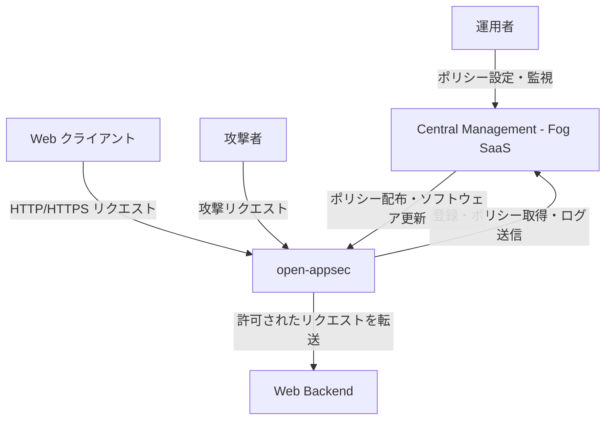
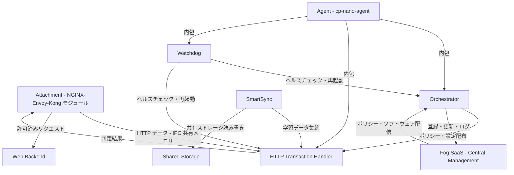
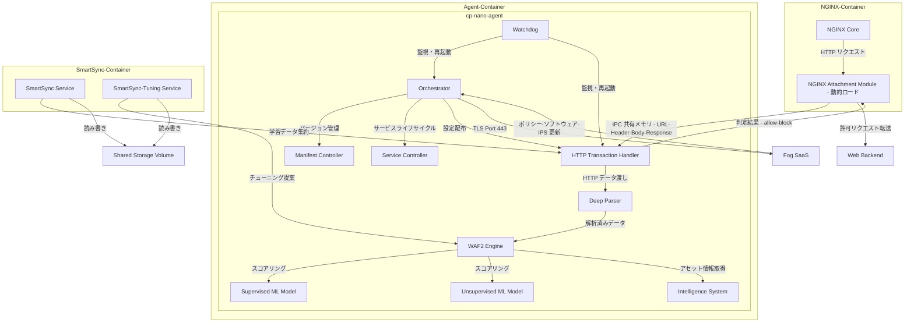
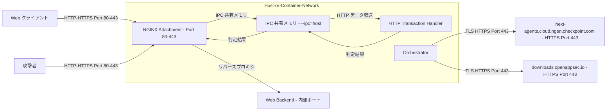
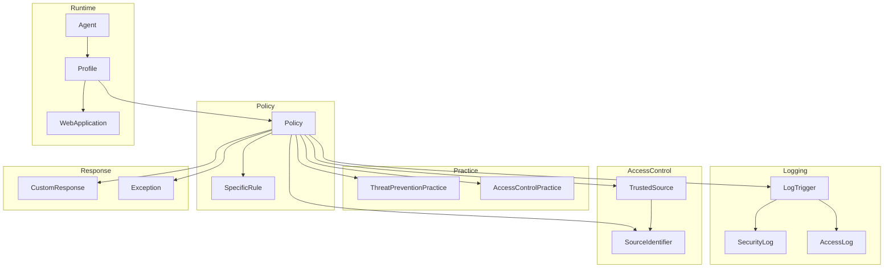
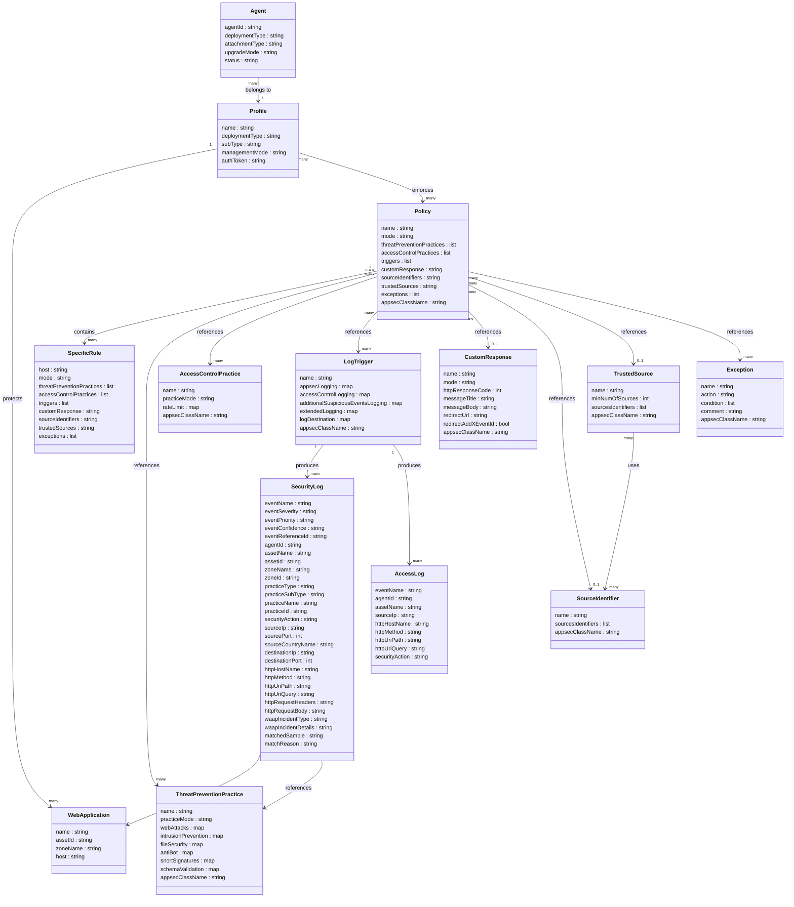

## 概要

open-appsec は、機械学習を用いた OSS の Web アプリケーションファイアウォール兼 API セキュリティエンジンです。Check Point Software Technologies が開発・公開しています。シグネチャや手動ルールに依存せず、OWASP Top 10 とゼロデイ攻撃を先制的に防御します。

NGINX・Kong・APISIX・Envoy といった主要なリバースプロキシや API ゲートウェイへアタッチメントとして統合できます。Linux・Docker・Kubernetes 環境に対応します。コアエンジンと基本 ML モデルは Apache 2.0 ライセンスで公開されており、商用グレードの高精度モデルは別ライセンスで提供されます。

### 提供内容

open-appsec の ML 技術は 3 つの形態で提供されます。エージェント（cp-nano-agent）バイナリは Apache 2.0 の OSS で共通であり、`AGENT_TOKEN` の有無で Local Managed と Centrally Managed が切り替わります。CloudGuard WAF は同じ ML 技術を基盤とする商用上位製品です。

| 項目 | open-appsec（Local Managed） | open-appsec（Centrally Managed） | Check Point CloudGuard WAF |
|---|---|---|---|
| ライセンス | Apache 2.0 | Apache 2.0 のエージェント＋ SaaS 管理プラン | 商用クラウドサービス |
| エージェントの稼働場所 | ユーザー側（セルフホスト） | ユーザー側（セルフホスト） | Check Point 側（フルマネージド） |
| 管理基盤 | なし（YAML / CRD 直編集） | `my.openappsec.io`（Infinity Portal） | Check Point Infinity |
| ターゲット | オフライン・単一インスタンス | セルフホスト＋集中管理 | AWS / Azure / GCP マルチクラウド |
| 費用 | 無料 | 無料利用可。Premium Edition は月額 $79〜（公式 pricing 参照） | 有償（BYOL / 従量課金） |
| ML エンジン | OSS の ML モデル | OSS の ML モデル＋ Premium Edition で追加機能 | 商用フル機能 |

#### 選び方の目安

- Local Managed: オフライン環境、単一インスタンス、コスト最重視、データを外部送信させたくないケース
- Centrally Managed: セルフホスト構成のまま複数クラスターや環境を集中管理し、GUI でチューニング提案を運用したいケース
- CloudGuard WAF: WAF 自体をクラウドで完結させ、DDoS 防御や CDN 統合、エンタープライズ向けマネージド SLA が必要なケース
- 段階移行: Local Managed で開始し、運用が安定した後に `AGENT_TOKEN` を環境変数に追加して Centrally Managed へ切り替え可能

### Check Point CloudGuard WAF との比較

| 項目 | open-appsec | Check Point CloudGuard WAF |
|---|---|---|
| 提供形態 | OSS（Apache 2.0）+ エンタープライズ SaaS | 商用クラウドサービス |
| 対象 | セルフホスト・K8s ネイティブ環境 | AWS / Azure / GCP などマルチクラウド |
| 管理方法 | ローカル設定ファイル / Helm / SaaS WebUI | SaaS 管理コンソール |
| ライセンス費用 | 無料（OSS）+ 有償 SaaS プラン | 有償（BYOL / 従量課金） |
| 技術基盤 | 共通の ML エンジン（supervised + unsupervised） | 共通の ML エンジン |
| SLA | コミュニティサポート / 有償 SaaS プランに依存 | 商用 SLA あり |
| マルチテナント | `appsecClassName` で分離（K8s CRD） | SaaS テナント分離 |
| DDoS 防御 | なし（レートリミットのみ） | あり |
| アップデート方式 | Fog SaaS 経由の自動配信 | SaaS 自動配信 |
| エンタープライズ機能 | 有償 SaaS プランで追加（高度 ML モデル等） | 商用機能込み |

open-appsec と CloudGuard WAF は同一の ML 技術を共有します。2024–2025 年の WAF 比較レポート（openappsec.io 公開）では、両製品の True Positive Rate は 99.368%（Default プロファイル）を記録しています。CloudGuard WAF は open-appsec のアタッチメントレイヤー（HTTP データをセキュリティロジックへ橋渡しする部分）を OSS として公開しています。なお比較レポートは open-appsec 自身が公開した資料のため、第三者ベンチマークと区別して参照する必要があります。

### Local Managed と Centrally Managed の機能差

エージェント本体は同一の OSS バイナリです。`AGENT_TOKEN` の有無により Local Managed と Centrally Managed の動作が切り替わります。

| 機能 | Local Managed | Centrally Managed |
|---|:---:|:---:|
| ML 検出（Supervised + Unsupervised） | ◯ | ◯ |
| OWASP Top 10 / ゼロデイ防御 | ◯ | ◯ |
| ローカル YAML / K8s CRD ポリシー | ◯ | ◯ |
| Web UI ダッシュボード（Assets / Events / Learn） | ✕ | ◯ |
| Tuning Suggestions の GUI 承認フロー | △（CLI で手動適用） | ◯（Accept / Reject ボタン） |
| 複数エージェント横断のログ集約 | ✕（ローカル `/var/log/nano_agent` のみ） | ◯（クラウドログ） |
| マルチテナント / MSSP 機能 | △（K8s `appsecClassName` で分離） | ◯ |
| サポート SLA | コミュニティ | Premium Edition で商用 SLA |
| ライセンス費用 | 無料（Apache 2.0） | 無料利用可。Premium Edition は有償 |

> 注: Anti-Bot や IPS、File Security、Schema Validation などの一部機能は Premium Edition 限定で提供される可能性があります。各機能の利用可否は公式 pricing と Premium Edition のページで最新の対応状況を確認してください。

#### 学習データの扱い

| 項目 | Local Managed | Centrally Managed |
|---|---|---|
| 学習データの集約場所 | ローカルの SmartSync コンテナ | Fog SaaS（`inext-agents.cloud.ngen.checkpoint.com`） |
| SmartSync コンテナの起動方法 | `COMPOSE_PROFILES=standalone docker-compose up -d` | クラウド側に存在するため不要 |
| Tuning 提案の生成元 | ローカル SmartSync-Tuning | Fog SaaS |
| 共有ストレージ | `appsec-shared-storage` ボリューム | Fog SaaS の永続化基盤 |
| インターネット接続 | 不要（オフライン運用可） | Fog SaaS への HTTPS 必須 |

### ML 検出モデルの動作

open-appsec の ML エンジンは 2 段階で動作します。

- Supervised Model: Check Point のクラウド側で、数百万件の悪意・正常リクエストを使ってオフライン学習されたモデルです。Fog SaaS（`downloads.openappsec.io`）から更新版がエージェントへ自動配信されます（Manifest Controller がバージョンを管理）。
- Unsupervised Model（Adaptive Learning）: 保護対象環境内でリアルタイムに構築されるモデルです。URL パス・ヘッダー・パラメーター分布などの特徴量を蓄積し、環境固有の正常パターンを学習します。SmartSync を介して同一プロファイル内の複数エージェント間で学習データを集約し、SmartSync-Tuning が継続的にチューニング提案を生成します。
- 判定フロー: Phase 1（Supervised）でリクエストをスコアリングし、疑わしいものは Phase 2（Unsupervised）で環境固有のパターンと照合します。両モデルの結果を統合し、`eventConfidence`（Low / Medium / High / Very High）として最終的な確信度を出力します。`eventConfidence` が Very High のものはほぼ確実な脅威として扱います。

### 類似ツールとの比較

| 比較項目 | open-appsec | ModSecurity | Coraza | NGINX App Protect |
|---|---|---|---|---|
| 検出方式 | ML（教師あり＋教師なし） | シグネチャ（OWASP CRS） | シグネチャ（OWASP CRS） | シグネチャ＋機械学習 |
| ML 利用 | あり（2 モデル） | なし | なし | 部分的 |
| ライセンス | Apache 2.0（コア）/ ML モデル別ライセンス | Apache 2.0（EOL 2024/7） | Apache 2.0 | 商用 |
| 対応プロキシ | NGINX / Kong / APISIX / Envoy / Istio | NGINX / Apache / IIS | NGINX / Caddy / Traefik | NGINX Plus のみ |
| 運用モデル | インストール後自動学習（チューニング不要） | 手動ルール管理（定期更新必要） | 手動ルール管理 | 手動ルール管理 |
| ゼロデイ対応 | 先制的（シグネチャ更新不要） | 事後的（シグネチャ更新必要） | 事後的（シグネチャ更新必要） | 部分的 |


## 特徴

- シグネチャ不要の ML 検出: 教師ありモデル（グローバルな攻撃パターン数百万件で事前学習）と教師なしモデル（保護環境内のトラフィックをリアルタイム学習）の 2 段階で判定します。
- 先制的なゼロデイ防御: Log4Shell・Spring4Shell・Text4Shell などの新規脆弱性をシグネチャなしで事前ブロックした実績があります。
- 自動適応学習: 環境固有のトラフィックパターンを継続学習し、誤検知を自動的に低減します。手動チューニングは不要です。
- OWASP Top 10 対応: SQLi・XSS・XXE・パストラバーサル・コマンドインジェクションなど主要攻撃クラスを網羅します。
- IPS（脆弱性シグネチャ補完）: 2,800 以上の Web CVE をカバーする IPS 機能を内蔵します。
- API セキュリティ: OpenAPI スキーマバリデーションにより、定義外の API 呼び出しを検出します。
- アンチボット保護: ボットトラフィックを識別・ブロックします。
- ファイルセキュリティ: クラウドベースのレピュテーションチェックによりアップロードファイルを検査します。
- レートリミティング: IP・JWT・Cookie 識別子に基づくレート制限が可能です。
- CrowdSec 連携: クラウドソース型の Crowd Wisdom インテグレーションをサポートします。
- 多様なデプロイ方式: Helm Chart・Kubernetes Annotations・Terraform・GraphQL API・ローカル YAML ポリシーファイルで宣言的に管理できます。
- 複数管理インターフェース: CLI（open-appsec-ctl）と SaaS Web UI（my.openappsec.io）の両方に対応します。
- 独立セキュリティ監査済み: 2022 年に第三者機関によるコード監査を実施し「Excellent」評価を取得しています。
- OpenSSF ベストプラクティス準拠: CII Best Practices バッジを取得しています。

## 構造

### システムコンテキスト図



| 要素名 | 説明 |
|---|---|
| 運用者 | ポリシー設定・エージェント管理・ログ監視を担うシステム管理者 |
| Web クライアント | 保護対象の Web アプリケーション・API にアクセスする正規ユーザー |
| 攻撃者 | SQLi・XSS・ゼロデイ攻撃などを試みる脅威アクター |
| open-appsec | ML ベースの WAF / API セキュリティエンジン本体 |
| Web Backend | open-appsec が保護するオリジンサーバー・アプリケーション |
| Central Management - Fog SaaS | Check Point が運営する SaaS 管理基盤。登録・ポリシー配布・ソフトウェア更新・ログ収集・学習データ同期を担う |

### コンテナ図



| 要素名 | 説明 |
|---|---|
| Attachment - NGINX-Envoy-Kong モジュール | Web サーバープロセス空間に動的ロードされる小型モジュール。HTTP リクエスト・レスポンスデータを抽出して Agent に渡す。状態管理やセキュリティロジックは持たない |
| Agent - cp-nano-agent | セキュリティ処理の主体となるデプロイ単位。Orchestrator・HTTP Transaction Handler・Watchdog を内包し、ローカルで独立動作する |
| Orchestrator | Fog への登録・ポリシー取得・ソフトウェア更新・管理操作を担うナノサービス |
| HTTP Transaction Handler | Attachment から HTTP データを受け取り、セキュリティロジックを実行して判定結果を返すナノサービス。負荷に応じて複数インスタンス起動 |
| Watchdog | Agent 内の全コンポーネントの稼働を監視し、障害時に自動再起動するナノサービス |
| SmartSync | 複数エージェント間の学習データを集約し、統合モデルを各アセットに配信するサービス（Golang 実装） |
| Shared Storage | SmartSync・Agent・SmartSync-Tuning 間で学習データ・設定を共有するストレージ |
| Fog SaaS - Central Management | 運用者向け SaaS 管理基盤。エージェント登録・ポリシー配布・クラウドログ・学習データ同期を提供 |
| Web Backend | open-appsec が保護するオリジンサーバー |

### コンポーネント図

NGINX 環境を例に、Agent 内部のコンポーネント構成を示します。



#### NGINX-Container の要素

| 要素名 | 説明 |
|---|---|
| NGINX Core | 受信 HTTP/HTTPS トラフィックを処理するコア Web サーバープロセス |
| NGINX Attachment Module | NGINX プロセス空間に動的ロードされる標準 NGINX モジュール。リクエスト・レスポンスデータを IPC 経由で HTTP Transaction Handler に転送する |

#### cp-nano-agent の要素

| 要素名 | 説明 |
|---|---|
| Orchestrator | Fog との TLS 接続を管理し、ポリシー・ソフトウェア・IPS シグネチャ更新を取得する中心コンポーネント |
| Manifest Controller | コンポーネントのバージョン定義ファイルを管理し、更新を制御する |
| Service Controller | 各セキュリティサービスの起動・停止・設定適用を担う |
| HTTP Transaction Handler | Attachment から受け取った HTTP データを処理し、WAF2 Engine に渡して判定結果を返す。負荷に応じて複数インスタンス起動する |
| WAF2 Engine | HTTP トランザクションを分析してセキュリティポリシーを適用する主要セキュリティアナライザー |
| Deep Parser | URL・ヘッダー・ボディを解析し、base64 等のエンコードを正規化して WAF2 Engine に渡す |
| Supervised ML Model | クラウドで事前学習済みの監視付きモデル。数百万件の攻撃・正常リクエストから学習した汎用的脅威検出を担う |
| Unsupervised ML Model | 保護環境内でリアルタイムに構築する教師なしモデル。アプリケーション固有のトラフィックパターンに適応する |
| Intelligence System | アセット・ゾーン・設定データをローカルおよびリモートから取得して WAF2 Engine に提供する |
| Watchdog | Agent 内全コンポーネントの稼働を監視し、障害時に自動再起動する |

#### SmartSync-Container の要素

| 要素名 | 説明 |
|---|---|
| SmartSync Service | 同一エージェント内の複数 HTTP Transaction Handler 間、および複数エージェント間で学習データを集約して統合モデルを生成する |
| SmartSync-Tuning Service | 複数エージェントのログデータを分析し、教師あり学習モデルの改善チューニング提案を生成する |
| Shared Storage Volume | Agent・SmartSync・SmartSync-Tuning が共有するデータ永続化ストレージ |

### ネットワーク構成図



| 通信パス | プロトコル | 説明 |
|---|---|---|
| Web クライアント - NGINX Attachment | HTTP / HTTPS Port 80-443 | 外部トラフィックの受信エンドポイント |
| NGINX Attachment - HTTP Transaction Handler | IPC 共有メモリ | Docker では --ipc=host オプションで共有メモリを有効化。同一ホスト内のプロセス間通信 |
| HTTP Transaction Handler - NGINX Attachment | IPC 共有メモリ | セキュリティ判定結果（allow / block）の返却 |
| NGINX Attachment - Web Backend | HTTP リバースプロキシ | 許可済みリクエストのオリジンサーバーへの転送 |
| Orchestrator - Fog SaaS | HTTPS TLS Port 443 | OAuth 2.0 で認証。初回登録に 256bit キー使用。JWT トークンを定期更新 |
| Orchestrator - downloads.openappsec.io | HTTPS TLS Port 443 | ソフトウェアパッケージ・IPS シグネチャのダウンロード |

## データ

### 概念モデル



#### Policy / Practice / Logging の要素

| 要素名 | 説明 |
|---|---|
| Policy | 既定動作と例外規則を束ねる最上位エンティティ |
| SpecificRule | ホスト単位で Policy の既定値を上書きするルール |
| ThreatPreventionPractice | Web 攻撃検知・IPS・FileSecurity・AntiBot・Schema Validation の設定束 |
| AccessControlPractice | レートリミット等のアクセス制御の設定束 |
| LogTrigger | ログ生成条件と出力先の設定 |
| SecurityLog | 検出イベントの詳細ログ |
| AccessLog | リクエスト単位のアクセスログ |

#### AccessControl / Response / Runtime の要素

| 要素名 | 説明 |
|---|---|
| SourceIdentifier | 送信元を識別する方式（sourceip, JWTKey, headerkey, cookie, x-forwarded-for） |
| TrustedSource | ML が学習時に正常とみなす送信元の集合 |
| CustomResponse | ブロック時に返す HTTP レスポンス（コード、メッセージ、リダイレクト） |
| Exception | 検査スキップ・許可・強制ブロック・ログ抑制の例外規則 |
| Agent | エージェントランタイム（HTTP Transaction Handler、Attachment、Orchestrator、Watchdog の集合体） |
| Profile | デプロイ種別と管理モードを保持するエージェントの所属単位 |
| WebApplication | 保護対象アセット。Policy がホスト名で紐づく |

### 情報モデル



#### エンティティ補足

| エンティティ | 補足ポイント |
|---|---|
| Policy | `default` と `specificRules` の 2 層構造。K8s CRD では cluster-scoped（Policy）と namespace-scoped（PolicyNS）がある |
| ThreatPreventionPractice | `webAttacks.minimumConfidence` で ML 感度調整。`intrusionPrevention` に IPS の `maxPerformanceImpact` 等を含む |
| AccessControlPractice | `rateLimit.rules[]` は `uri`、`limit`、`unit`（minute / second）、`action`（detect / prevent）の 4 フィールドを持つ |
| LogTrigger | `logDestination` は cloud, file, stdout, syslog, cef, k8s-service の同時指定が可能 |
| Exception | v1beta2 では `condition` が `key`（countryCode, sourceIp, url, paramName, hostName 等）と `value` のペア配列。v1beta1 では `sourceIp` / `url` 等のフィールドを直接指定する |
| SourceIdentifier | `identifier` 種別: sourceip, headerkey, JWTKey, cookie, x-forwarded-for |
| TrustedSource | `minNumOfSources` デフォルト 3。ML 学習で「正常」とみなすのに必要な送信元最小観測数 |
| Agent / Profile | Profile に紐づく Agent が、関連付けられた WebApplication の Policy を強制適用 |
| SecurityLog | フィールド名は JSON では lowerCamelCase、Syslog/CEF では小文字。`eventReferenceId` がブロック画面の参照 ID |

## 構築方法

open-appsec は Web ゲートウェイ（NGINX / Kong / APISIX / Envoy 等）と open-appsec Agent を組み合わせて動作します。管理形態は Local Managed（ローカル管理）と Centrally Managed（SaaS 中央管理）の 2 種類です。

### Local Managed と Centrally Managed の違い

| 項目 | Local Managed | Centrally Managed |
|---|---|---|
| ポリシー保管場所 | `/etc/cp/conf/local_policy.yaml`（Linux）または `/ext/appsec/local_policy.yaml`（Docker） | SaaS Web UI（my.openappsec.io） |
| `AGENT_TOKEN` | 不要 | 必須 |
| 編集手段 | YAML 直編集 / open-appsec-ctl | SaaS Web UI |
| 適用範囲 | オフライン環境・単一インスタンス | 複数インスタンス集中管理 |
| Helm 設定 | `appsec.mode=standalone` | `appsec.mode=managed`（`appsec.agentToken` 必須） |

### Linux 自動インストール（NGINX / APISIX / Kong traditional）

```bash
# インストーラのダウンロードと実行権限付与
wget https://downloads.openappsec.io/open-appsec-install && chmod +x open-appsec-install

# 自動インストール（NGINX / APISIX / Kong を自動検出）
./open-appsec-install --auto

# SaaS 管理モードで接続する場合
./open-appsec-install --auto --token <AGENT_TOKEN>

# 初期ポリシーを prevent-learn に設定する場合
./open-appsec-install --auto --prevent
```

設定検証と再起動（NGINX）:

```bash
nginx -t
service nginx restart
```

### Docker（NGINX 統合コンテナ）

NGINX と Agent を 1 コンテナにまとめたシンプルな構成です。

```bash
docker run -d \
  --name open-appsec-agent-unified \
  --restart unless-stopped \
  -p 80:80 \
  -p 443:443 \
  -v /path/to/conf:/etc/cp/conf \
  -v /path/to/data:/etc/cp/data \
  -v /path/to/logs:/var/log/nano_agent \
  -v /path/to/localconfig:/ext/appsec \
  -e user_email=<your-email> \
  -e AGENT_TOKEN=<token> \
  ghcr.io/openappsec/agent-unified:latest /cp-nano-agent
```

### Docker Compose（NGINX 構成例）

公式の docker-compose.yaml をダウンロードして利用します。

```bash
wget https://raw.githubusercontent.com/openappsec/openappsec/main/deployment/docker-compose/nginx/docker-compose.yaml
```

```yaml
services:
  appsec-agent:
    image: ghcr.io/openappsec/agent:${APPSEC_VERSION}
    container_name: appsec-agent
    environment:
      - SHARED_STORAGE_HOST=appsec-shared-storage
      - LEARNING_HOST=appsec-smartsync
      - TUNING_HOST=appsec-tuning-svc
      - user_email=${APPSEC_USER_EMAIL}
      - AGENT_TOKEN=${APPSEC_AGENT_TOKEN}
      - registered_server="NGINX"
    ipc: host
    volumes:
      - ${APPSEC_CONFIG}:/etc/cp/conf
      - ${APPSEC_DATA}:/etc/cp/data
      - ${APPSEC_LOGS}:/var/log/nano_agent
      - ${APPSEC_LOCALCONFIG}:/ext/appsec
      - shm-volume:/dev/shm/check-point
    command: /cp-nano-agent

  appsec-nginx:
    image: ghcr.io/openappsec/nginx-attachment:${APPSEC_VERSION}
    container_name: appsec-nginx
    ipc: host
    volumes:
      - ${NGINX_CONFIG}:/etc/nginx/conf.d
      - shm-volume:/dev/shm/check-point
    ports:
      - "80:80"
      - "443:443"

volumes:
  shm-volume:
    driver: local
    driver_opts:
      type: tmpfs
      device: tmpfs
```

起動:

```bash
# Local Managed（standalone プロファイル）
COMPOSE_PROFILES=standalone docker-compose up -d

# Centrally Managed
COMPOSE_PROFILES= docker-compose up -d
```

### Kubernetes（Helm chart — Ingress NGINX）

```bash
helm repo add openappsec https://charts.openappsec.io
helm repo update

# Local Managed（standalone）
helm install open-appsec-nginx openappsec/open-appsec-nginx-ingress \
  --set appsec.mode=standalone \
  --set appsec.userEmail="<your-email>" \
  --set appsec.agentToken= \
  --set controller.ingressClass=appsec-nginx \
  --set controller.ingressClassResource.name=appsec-nginx \
  --set controller.ingressClassResource.controllerValue="k8s.io/appsec-nginx" \
  --set appsec.persistence.enabled=false \
  --set controller.service.externalTrafficPolicy=Local \
  --namespace appsec --create-namespace

# Centrally Managed（SaaS）
helm install open-appsec-nginx openappsec/open-appsec-nginx-ingress \
  --set appsec.mode=managed \
  --set appsec.agentToken="<your-token>" \
  --set appsec.userEmail="<your-email>" \
  --set controller.ingressClass=appsec-nginx \
  --set controller.ingressClassResource.name=appsec-nginx \
  --set controller.ingressClassResource.controllerValue="k8s.io/appsec-nginx" \
  --set appsec.persistence.enabled=false \
  --set controller.service.externalTrafficPolicy=Local \
  --namespace appsec --create-namespace
```

CRD と既定設定の適用:

```bash
wget https://raw.githubusercontent.com/openappsec/openappsec/main/config/crds/open-appsec-crd-v1beta2.yaml
kubectl apply -f ./open-appsec-crd-v1beta2.yaml

wget https://raw.githubusercontent.com/openappsec/openappsec/main/config/k8s/v1beta2/open-appsec-k8s-default-config-v1beta2.yaml
kubectl apply -f ./open-appsec-k8s-default-config-v1beta2.yaml
```

### Kubernetes（Helm chart — Kong / APISIX）

```bash
# Kong
helm install open-appsec-kong openappsec/open-appsec-kong \
  --set ingressController.ingressClass=appsec-kong \
  --set appsec.userEmail="<your-email>" \
  --set appsec.agentToken= \
  --namespace appsec --create-namespace

# APISIX
helm install open-appsec-apisix openappsec/open-appsec-apisix \
  --set rbac.create=true \
  --set service.type=LoadBalancer \
  --set ingress-controller.enabled=true \
  --set ingress-controller.config.ingressClass=appsec-apisix \
  --set appsec.userEmail="<your-email>" \
  --set appsec.agentToken= \
  --namespace appsec-apisix --create-namespace
```

### Kubernetes（Webhook Injector — Istio / Kong）

既存の Istio Ingress Gateway や Kong Gateway へサイドカーを注入する方式です。

```bash
# Istio
helm install open-appsec-webhook openappsec/open-appsec-injector \
  --set webhook.objectSelector.labelValue=istio-ingress \
  --set webhook.objectSelector.labelName=app \
  --set kind=istio \
  --set appsec.userEmail=<your-email> \
  --set appsec.agentToken= \
  -n <istio-namespace>

# Kong
helm install open-appsec-webhook openappsec/open-appsec-injector \
  --set webhook.objectSelector.labelName="app.kubernetes.io/name" \
  --set webhook.objectSelector.labelValue=kong \
  --set kind=kong \
  --set appsec.userEmail=<your-email> \
  --set appsec.agentToken= \
  -n <kong-namespace>
```

### Kubernetes（Envoy Gateway）

StrategicMerge パッチで init container（envoy-attachments）と sidecar（openappsec-agent）を EnvoyProxy Deployment に注入します。

```bash
kubectl patch envoyproxy <name> --namespace <ns> --type=merge --patch-file envoyproxy-deployment-patch.yaml
kubectl apply -f EnvoyPatchPolicy.yaml -n <gateway-namespace>
kubectl apply -f policy-activation.yaml
```

`envoyproxy-deployment-patch.yaml`（抜粋）:

```yaml
initContainers:
  - name: envoy-attachments
    image: ghcr.io/openappsec/openappsec-envoy-filters:latest
    env:
      - name: ENVOY_VERSION
        value: "1.34"
containers:
  - name: openappsec-agent
    image: ghcr.io/openappsec/agent:1.1.29
    env:
      - name: AGENT_TOKEN
        value: "<token>"
      - name: registered_server
        value: "Envoy Gateway"
```

### NGINX Proxy Manager（NPM）統合

```bash
git clone https://github.com/openappsec/open-appsec-npm.git
cd open-appsec-npm

# Local Managed で起動
COMPOSE_PROFILES=standalone docker-compose up -d
```

主要環境変数（`.env`）:

| 変数名 | 説明 |
|---|---|
| `APPSEC_AGENT_TOKEN` | SaaS 管理時のプロファイルトークン |
| `COMPOSE_PROFILES` | `standalone`（Local）または空（Centrally）|
| `USER_EMAIL` | サポート連絡先メールアドレス |
| `APPSEC_HTTPS_PROXY` | プロキシ設定（任意）|
| `APPSEC_AUTO_POLICY_LOAD` | `true` で自動ポリシー更新（最大 30 秒）|

ポリシーは NPM Web UI から編集でき、`/ext/appsec/local_policy.yaml` に保存されます。

## 利用方法

### policy.yaml の配置場所

| 環境 | パス |
|---|---|
| Linux | `/etc/cp/conf/local_policy.yaml` |
| Docker / NPM | `/ext/appsec/local_policy.yaml`（ボリュームマウント先）|
| Kubernetes | CRD（`kubectl apply` で適用）|

### v1beta2 ポリシーの書き方（推奨）

```yaml
policies:
  default:
    mode: detect-learn
    accessControlPractices:
      - access-control-practice-example
    threatPreventionPractices:
      - threat-prevention-practice-example
    triggers:
      - log-trigger-example
    customResponse: web-user-response-example
    sourceIdentifiers: ""
    trustedSources: ""
    exceptions:
      - exception-example
  specificRules:
    - host: "example.com"
      mode: prevent-learn
      threatPreventionPractices:
        - threat-prevention-practice-example
      accessControlPractices:
        - access-control-practice-example
      triggers:
        - log-trigger-example
```

### v1beta1 ポリシーの書き方（レガシー）

```yaml
policies:
  default:
    mode: detect-learn
    practices:
      - webapp-default-practice
    triggers:
      - appsec-special-log-trigger
    source-identifiers: appsec-source-identifiers-sourceip-example
    trusted-sources: appsec-trusted-source-example
    custom-response: appsec-web-user-response-example
    exceptions:
      - appsec-exception-example
  specific-rules:
    - host: web.server.com/example
      mode: prevent-learn
      practices:
        - webapp-best-practice
      triggers:
        - appsec-special-log-trigger
```

### Mode 切替

| 値 | 動作 |
|---|---|
| `detect-learn` | 検知＋学習（推奨初期値）。ブロックは行わない |
| `prevent-learn` | 防御＋学習。攻撃をブロックしながら学習継続 |
| `detect` | 検知のみ（学習なし） |
| `prevent` | 防御のみ（学習なし） |
| `inactive` | 無効 |

### Practice の YAML サンプル（v1beta2）

```yaml
threatPreventionPractices:
  - name: threat-prevention-practice-example
    practiceMode: inherited
    webAttacks:
      overrideMode: inherited        # inherited / detect / prevent / disabled
      minimumConfidence: high        # medium / high / critical（デフォルト: high）
    intrusionPrevention:
      overrideMode: inherited
      maxPerformanceImpact: medium   # low / medium / high
      minSeverityLevel: medium       # low / medium / high / critical
    schemaValidation:
      overrideMode: inherited
      configmap: openapi-schema-cm   # OpenAPI スキーマを格納する ConfigMap

accessControlPractices:
  - name: access-control-practice-example
    practiceMode: inherited
    rateLimit:
      overrideMode: inherited
      rules:
        - uri: "/api/login"
          limit: 100
          unit: minute               # minute / second
          action: prevent            # detect / prevent
```

#### v1beta1 → v1beta2 のフィールド名差分

| v1beta1（ハイフン区切り） | v1beta2（lowerCamelCase） |
|---|---|
| `practices` | `threatPreventionPractices` / `accessControlPractices` |
| `source-identifiers` | `sourceIdentifiers` |
| `trusted-sources` | `trustedSources` |
| `custom-response` | `customResponse` |
| `specific-rules` | `specificRules` |
| `log-destination` | `logDestination` |

### Trigger / Exception / CustomResponse / SourceIdentifier の YAML サンプル

```yaml
logTriggers:
  - name: log-trigger-example
    accessControlLogging:
      allowEvents: false
      dropEvents: true
    appsecLogging:
      detectEvents: true
      preventEvents: true

exceptions:
  - name: exception-example
    action: "accept"
    condition:
      - key: "countryCode"
        value: "US"

customResponses:
  - name: web-user-response-example
    mode: response-code-only
    httpResponseCode: 403

sourcesIdentifiers:
  - name: sources-identifier-example
    sourcesIdentifiers:
      - identifier: sourceip
        value:
          - "0.0.0.0"
```

利用可能な値:

- Exception の `action`: `skip` / `accept` / `drop` / `suppressLog`
- CustomResponse の `mode`: `block-page` / `redirect` / `response-code-only`
- SourceIdentifier の `identifier`: `headerkey` / `JWTKey` / `cookie` / `sourceip` / `x-forwarded-for`

### TrustedSources の YAML サンプル

```yaml
trustedsources:
  - name: appsec-trusted-source-example
    minNumOfSources: 3
    sourcesIdentifiers:
      - "0.0.0.0"
      - "1.1.1.1"
      - "2.2.2.2"
```

`minNumOfSources` は ML 学習時に「正常」として扱う送信元の最小観測数です。

### open-appsec-ctl 主要コマンド

| コマンド | 動作 |
|---|---|
| `--status [-s] [--extended]` | 状態とバージョン確認 |
| `--start-agent [-r]` / `--stop-agent [-q]` | エージェント起動・停止 |
| `-lc <service>` | サービスへのポリシー再読み込み（orchestrator / http-transaction-handler 等） |
| `--view-logs [-vl]` | ローカルログ表示 |
| `--info [--upload]` | サポート用ログ tar 化（クラウドアップロード可） |
| `--set-proxy <user:pass@host:port>` | プロキシ設定 |
| `--uninstall` | アンインストール |

```bash
# 基本操作
open-appsec-ctl --status
open-appsec-ctl --view-logs
open-appsec-ctl -lc http-transaction-handler
open-appsec-ctl -lc orchestrator

# Docker / Kubernetes 経由
docker exec -it open-appsec-agent open-appsec-ctl --status
kubectl exec -it <pod-name> -c openappsec-agent -n appsec -- open-appsec-ctl --status
```

ログのデフォルト出力先は次の通りです。

```
/var/log/nano_agent/CP-nano-http-transaction-handler.log<番号>
```

## 運用

### 起動・停止・状態確認

```bash
open-appsec-ctl --status
open-appsec-ctl --status --extended

open-appsec-ctl --start-agent
open-appsec-ctl --stop-agent

# デバッグ用（個別サービス制御）
open-appsec-ctl --start-service http-transaction-handler
open-appsec-ctl --stop-service  http-transaction-handler
# 対象サービス: orchestration / attachment-registrator / http-transaction-handler
```

### ログ確認

ログには以下の主要フィールドが含まれます（Events/Logs Schema より）。

| フィールド | 説明 |
|---|---|
| eventName | イベント種別 |
| eventSeverity | Info / Low / Medium / High / Critical |
| eventConfidence | Low / Medium / High / Very High（高いほど False Positive 可能性が低い） |
| eventPriority | Low / Medium / High / Urgent |
| sourceIp / destinationIp | 送信元・送信先 IP |
| httpMethod / httpUriPath | リクエスト情報 |
| waapIncidentType | 検出脅威種別（SQL injection / LDAP injection 等） |
| matchedSample | マッチした箇所 |

> JSON や Web UI 上は lowerCamelCase、Syslog や CEF 出力では小文字フィールド名となります。

### ポリシー操作

```bash
# ポリシー一覧
open-appsec-ctl --list-policies

# ポリシー確認
open-appsec-ctl --view-policy [policy-file]

# ポリシー編集
open-appsec-ctl --edit-policy [policy-file]

# ポリシー適用（ローカル管理）
open-appsec-ctl --apply-policy [policy-file]

# 実行中サービスへのポリシー再読み込み
open-appsec-ctl -lc http-transaction-handler
open-appsec-ctl -lc orchestrator
```

### Learning フェーズの管理

ML エンジンは「教育段階」として成熟度を管理します。

| 成熟度レベル | 意味 |
|---|---|
| Kindergarten / Primary School | 学習初期。データ蓄積中 |
| Graduate | 精度良好。FP 低水準。Prevent 移行推奨ライン |
| Master / PhD | 最高精度。Trusted Sources 設定が必要 |

最低学習期間の目安は、Contextual ML を適切に設定し十分なトラフィックがある場合に 2〜3 日で Graduate に到達可能とされています。SaaS Web UI の "Learn" タブで現在の推奨アクションを確認できます。

| Web UI 推奨 | 意味 |
|---|---|
| Keep Learning | リクエスト数が不足 |
| Review Tuning Suggestions | フラグ付きイベントをフィードバック |
| Prevent Critical Events | Critical 脅威のブロック準備完了 |
| Prevent High+ Events | High 以上のブロック準備完了 |

### SaaS Web UI への接続


- URL: `https://my.openappsec.io`（Check Point Infinity Portal）
- エージェント起動時の `AGENT_TOKEN` でクラウドと紐付け
- Web UI で学習状況・イベント・チューニング提案・ポリシー変更が可能
- ダッシュボードタブ: Assets / Events / Learn / Threat Prevention

## ベストプラクティス

### detect-learn → prevent-learn の段階移行

```
[新規デプロイ]
    ↓
detect-learn（最低 2〜3 日、Graduate 到達まで）
    ↓
SaaS "Learn" タブで推奨を確認
    ↓
Events タブで Critical/High イベントを精査
    ↓
False Positive があれば Exception を追加
    ↓
prevent-learn（Critical のみ または High 以上を選択して移行）
    ↓
一定期間監視後、必要に応じて感度を上げる
```

ポリシー例:

```yaml
policies:
  default:
    mode: detect-learn
  specificRules:
    - host: "trusted-app.example.com"
      mode: prevent-learn
```

### Trusted Sources の活用

Trusted Sources は除外設定ではなく、ML が「正常トラフィック」を学習する際の基準を定める設定です。Master / PhD レベル到達のために必要です。

```yaml
trustedsources:
  - name: internal-trusted-sources
    minNumOfSources: 3
    sourcesIdentifiers:
      - "10.0.0.0/8"
      - "192.168.1.10"
      - "192.168.1.20"
```

| 識別方式 | 用途 |
|---|---|
| Source IP | 固定 IP / CIDR |
| X-Forwarded-For | ALB やリバースプロキシ背後の実 IP |
| Header Key | カスタムヘッダー |
| JWT Key | ユーザー識別（推奨） |
| Cookie | oauth2_proxy 等のセッション |

`minNumOfSources` を 3 以上に設定すると、悪意ある単一送信元が「正常トラフィックの基準」になるリスクを防げます。

### Exception の運用ポリシー

| アクション | 動作 |
|---|---|
| `accept` | 検査をスキップして許可 |
| `skip` | 特定パラメーターのみ検査スキップ |
| `drop` | 強制ブロック |
| `suppressLog` | ログ出力を抑制（検査は継続） |

v1beta2 形式（`condition` 配列）の例:

```yaml
exceptions:
  - name: fp-exception-internal-scanner
    action: accept
    condition:
      - key: sourceIp
        value: "10.0.1.50"
      - key: url
        value: "/healthz"

  - name: fp-exception-skip-param
    action: skip
    condition:
      - key: paramName
        value: "custom_payload"
      - key: hostName
        value: "api.example.com"
```

v1beta1 形式（フィールド直書き）の例:

```yaml
exceptions:
  - name: fp-exception-legacy
    action: accept
    sourceIp: ["10.0.1.50"]
    url: ["/healthz", "/metrics"]
```

運用指針:

- Web UI の Events タブでイベントを右クリックすると "Add Exception" から直接作成できます
- Exception はグローバルオブジェクトとして保存すると複数アセットで再利用できます
- 最小スコープ（特定 URL + sourceIp）から始め、確認後に一般化します

### SIEM 連携（syslog / CEF）

| 送信先 | 特徴 |
|---|---|
| Cloud | SaaS Web UI で確認（デフォルト） |
| Gateway/Agent | `/var/log/nano_agent/` にローカル保存 |
| Syslog | RFC 5424 形式、UDP または TCP |
| CEF | パイプ区切り形式、TCP 必須 |

Splunk 連携（Syslog / UDP）の例。Splunk 側で受信ポートを開放します。

```ini
# $SPLUNK_HOME/etc/system/local/inputs.conf
[udp://5140]
sourcetype = syslog
```

open-appsec 側の LogTrigger で対応する送信先を設定します（v1beta1 例）。

```yaml
logtriggers:
  - name: siem-syslog-trigger
    appsec-logging:
      detect-events: true
      prevent-events: true
    log-destination:
      syslog-service:
        - address: "localhost"
          port: 5140
          protocol: UDP
```

Microsoft Sentinel は Azure Data Connectors の CEF コネクターを設定し、Log Analytics エージェントを open-appsec と同居させて TCP で受信します。Sumo Logic は Collector をエージェント同居でインストールし、Manage Data → Collection で指定した syslog ポートへ送ります。

### Tuning Suggestions の承認フロー

SmartSync-Tuning は学習データを基に Exception 候補を生成します。

Centrally Managed の場合:

1. SaaS Web UI の "Learn" タブで "Review Tuning Suggestions" を開く
2. 各提案について Accept または Reject を選択
3. Accept した提案は自動的に Exception として該当ポリシーへ反映される

Local Managed の場合、SmartSync-Tuning が共有ストレージ（`appsec-shared-storage`）に提案を生成します。運用者が提案内容を確認し、必要なものを `local_policy.yaml` の `exceptions` セクションへ取り込みます。

```bash
# 現在のポリシーとチューニング提案を確認
open-appsec-ctl --view-policy

# 提案を取り込んだポリシーを編集
open-appsec-ctl --edit-policy /etc/cp/conf/local_policy.yaml

# 適用とリロード
open-appsec-ctl --apply-policy /etc/cp/conf/local_policy.yaml
open-appsec-ctl -lc http-transaction-handler
```

### Kubernetes での HA / リソース制限

```yaml
replicaCount: 2
persistence:
  enabled: true
  storageClass: "standard"
  accessMode: ReadWriteMany

resources:
  requests:
    cpu: "100m"
    memory: "256Mi"
  limits:
    cpu: "500m"
    memory: "512Mi"
```

- `appsecClassName` プロパティで同一クラスター上の複数デプロイメントを分離管理
- v1beta2 CRD で Namespace スコープのリソース定義をサポート（マルチテナント / MSSP 向け）
- GitOps（ArgoCD / Flux）と親和性が高い宣言的 CRD 管理を推奨

## トラブルシューティング

### 症状→原因→対処 早見表

| 症状 | 原因 | 対処 |
|---|---|---|
| Policy load status が Error | Fog への接続失敗 | `inext-agents.cloud.ngen.checkpoint.com` / `downloads.openappsec.io` への疎通を確認 |
| Policy load status が Error | トークンの誤コピー | AGENT_TOKEN を再確認。ポータルでポリシーを Enforce 後にトークンを取得 |
| HTTP Transaction Handler が "Ready"（Running でない） | バックエンド未到達 | NGINX リバースプロキシ設定と upstream 疎通を検証 |
| HTTP Transaction Handler が "Ready" | 共有メモリ未共有 | `/dev/shm` が両コンテナで共有されているか確認（`--ipc=host`） |
| NGINX が HTTP トランザクションを認識しない | attachment 組み込み失敗 | `attachment-registrator` サービス状態を確認、インストールスクリプトを再実行 |
| シングルコアマシンで接続タイムアウト | CPU リソース不足 | vCPU 数を増やすかリソース制限を緩和 |
| CentOS 7 でインストール失敗 | OS 依存ライブラリの差異 | 専用ガイドの手順に従いライブラリを手動インストール |
| SELinux 干渉 | SELinux が動作をブロック | `sestatus` 確認後、ポリシー追加または `permissive` モードへ変更 |
| エージェント起動失敗 | --info で詳細確認 | `open-appsec-ctl --info --upload` で診断ログを収集しサポートへ提出 |

### False Positive の典型と対処

- 内部スキャナー / ペンテストツール: `action: accept` と `sourceIp` でスキャナー IP を除外
- 特殊文字を含む正規パラメーター: `action: skip` と `parameterName` で当該パラメーター検査をスキップ
- 学習初期の誤検知: Tuning Suggestions でフィードバック。Graduate 到達まで prevent に移行しない
- ヘルスチェック・監視エンドポイント: `/healthz` や `/metrics` を `action: accept` で除外

`eventConfidence` の活用:

- `Very High`: ほぼ確実に脅威（FP 可能性低）
- `Low / Medium`: FP の可能性があるため詳細確認推奨

### エージェントが起動しない / ポリシーがロードされない

```bash
# 1. 状態確認
open-appsec-ctl --status --extended

# 2. ログ確認
open-appsec-ctl --view-logs

# 3. ネットワーク疎通確認
curl -v https://inext-agents.cloud.ngen.checkpoint.com
curl -v https://downloads.openappsec.io

# 4. サービス個別再起動
open-appsec-ctl --stop-service orchestration
open-appsec-ctl --start-service orchestration

# 5. ポリシー再適用
open-appsec-ctl --apply-policy /etc/cp/conf/local_policy.yaml
open-appsec-ctl -lc orchestrator
open-appsec-ctl -lc http-transaction-handler
```

Kubernetes:

```bash
kubectl get pods -n <NAMESPACE>
kubectl logs <POD_NAME> -n <NAMESPACE> -c openappsec-agent
kubectl exec -n <NAMESPACE> <POD_NAME> -c openappsec-agent -- open-appsec-ctl --status
```

### --info でのサポート用ログ収集

```bash
# Linux
open-appsec-ctl --info --upload

# Docker
docker exec -it <CONTAINER_NAME> open-appsec-ctl --info --upload

# Kubernetes
kubectl exec -n <NAMESPACE> <POD_NAME> -c <CONTAINER_NAME> -- open-appsec-ctl --info --upload
```

`--upload` でクラウドに自動アップロードされ、Reference ID が発行されます。サポートフォームに Reference ID を記載して提出します。

## まとめ

open-appsec は機械学習を用いて OWASP Top 10 とゼロデイ攻撃を先制的に防御する OSS WAF です。NGINX・Kong・APISIX・Envoy など主要プロキシへ統合でき、Local Managed と Centrally Managed の選択肢から運用形態を選べます。

この記事が少しでも参考になった、あるいは改善点などがあれば、ぜひリアクションやコメント、SNS でのシェアをいただけると励みになります！

## 参考リンク

- 公式ドキュメント
  - [open-appsec 公式サイト](https://www.openappsec.io/)
  - [open-appsec 公式ドキュメント](https://docs.openappsec.io/)
  - [Agents - 公式ドキュメント](https://docs.openappsec.io/concepts/agents)
  - [Contextual Machine Learning](https://docs.openappsec.io/concepts/contextual-machine-learning)
  - [open-appsec 公式 - ML エンジン技術](https://www.openappsec.io/tech)
  - [Local Policy File v1beta2](https://docs.openappsec.io/getting-started/start-with-linux/local-policy-file-v1beta2-beta)
  - [Local Policy File（Advanced / v1beta1）](https://docs.openappsec.io/getting-started/start-with-linux/local-policy-file-advanced)
  - [Configuration Using CRDs（v1beta1）](https://docs.openappsec.io/getting-started/start-with-kubernetes/configuration-using-crds)
  - [Configuration Using CRDs（v1beta2）](https://docs.openappsec.io/getting-started/start-with-kubernetes/configuration-using-crds-v1beta2)
  - [Events/Logs Schema](https://docs.openappsec.io/references/events-logs-schema)
  - [Setup Log Triggers](https://docs.openappsec.io/setup-instructions/setup-log-triggers)
  - [Create a Profile](https://docs.openappsec.io/getting-started/using-the-web-ui-saas/create-a-profile)
  - [Getting Started](https://docs.openappsec.io/getting-started)
  - [Linux インストール](https://docs.openappsec.io/getting-started/start-with-linux/install-open-appsec-for-linux)
  - [Docker デプロイ](https://docs.openappsec.io/getting-started/start-with-docker)
  - [Kubernetes Helm New Flow](https://docs.openappsec.io/getting-started/start-with-kubernetes/install-using-helm-new-flow-beta)
  - [Kubernetes Webhook Injector](https://docs.openappsec.io/getting-started/start-with-kubernetes/install-with-helm-using-webhook)
  - [Envoy Gateway 統合](https://docs.openappsec.io/getting-started/start-with-kubernetes/integrate-with-envoy-gateway)
  - [NGINX Proxy Manager 統合](https://docs.openappsec.io/integrations/nginx-proxy-manager)
  - [SaaS 管理への接続手順 - Docker](https://docs.openappsec.io/getting-started/using-the-web-ui-saas/connect-deployed-agents-to-saas-management-docker)
  - [Kubernetes Helm インストール](https://docs.openappsec.io/getting-started/start-with-kubernetes/install-using-helm)
  - [Agent CLI リファレンス](https://docs.openappsec.io/references/agent-cli)
  - [open-appsec-ctl ツール使用方法](https://docs.openappsec.io/getting-started/start-with-linux/using-the-open-appsec-ctl-tool)
  - [How-To: Learning フェーズの追跡と Prevent への移行](https://docs.openappsec.io/how-to/configuration-and-learning/track-learning-and-move-from-learn-detect-to-prevent)
  - [How-To: スタンドアロン環境でのローカルチューニング](https://docs.openappsec.io/how-to/configuration-and-learning/track-learning-and-local-tuning-in-standalone-deployments)
  - [How-To: Contextual ML の最適設定](https://docs.openappsec.io/how-to/configuration-and-learning/configure-contextual-machine-learning-for-best-accuracy)
  - [Custom Rules & Exceptions 設定](https://docs.openappsec.io/setup-instructions/setup-custom-rules-and-exceptions)
  - [トラブルシューティング ガイド一覧](https://docs.openappsec.io/troubleshooting/troubleshooting-guides)
  - [Policy Load エラー / Fog 登録失敗](https://docs.openappsec.io/troubleshooting/troubleshooting-guides/policy-load-status-error-failed-to-register-to-fog)
  - [Docker: HTTP Transaction Handler が Ready 状態](https://docs.openappsec.io/troubleshooting/troubleshooting-guides/open-appsec-on-docker-http-transaction-handler-is-set-to-ready)
  - [SIEM 連携ガイド（ブログ）](https://www.openappsec.io/post/how-you-can-integrate-open-appsec-logs-into-various-siem-services)
  - [Best WAF Solutions 2024-2025 比較レポート](https://www.openappsec.io/post/best-waf-solutions-in-2024-2025-real-world-comparison)
  - [open-appsec サポート](https://www.openappsec.io/support)
- GitHub
  - [open-appsec GitHub リポジトリ](https://github.com/openappsec/openappsec)
  - [open-appsec Attachment GitHub](https://github.com/openappsec/attachment)
  - [open-appsec SmartSync-Tuning GitHub](https://github.com/openappsec/smartsync-tuning)
  - [open-appsec-npm GitHub](https://github.com/openappsec/open-appsec-npm)
  - [docker-compose NGINX](https://raw.githubusercontent.com/openappsec/openappsec/main/deployment/docker-compose/nginx/docker-compose.yaml)
  - [OWASP Coraza WAF（GitHub）](https://github.com/corazawaf/coraza)
- 記事
  - [DeepWiki - openappsec アーキテクチャ](https://deepwiki.com/openappsec/openappsec)
  - [DeepWiki - NGINX インテグレーション](https://deepwiki.com/openappsec/openappsec/4.2.1-nginx-integration)
  - [DeepWiki - Docker デプロイメント](https://deepwiki.com/openappsec/openappsec/4.2-docker-deployments)
  - [CloudGuard AppSec vs open-appsec 比較（WAFPlanet）](https://wafplanet.com/compare/cloudguard-waf-vs-open-appsec/)
  - [NGINX WAF 比較記事（DEV Community）](https://dev.to/openappsec/nginx-waf-alternatives-app-protect-vs-modsecurity-vs-open-appsec-325f)
  - [Check Point WAF vs open-appsec（PeerSpot）](https://www.peerspot.com/products/comparisons/check-point-cloudguard-waf_vs_open-appsec)
