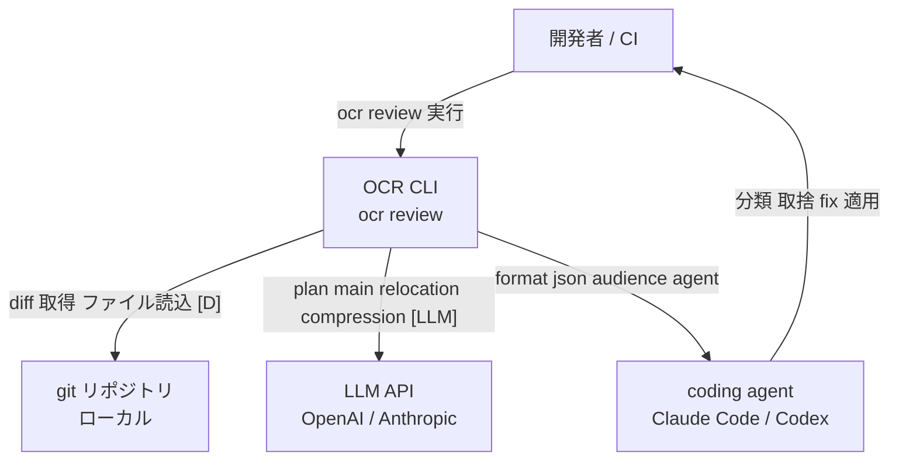
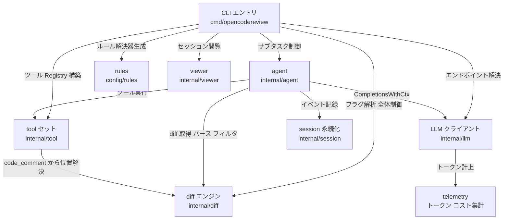
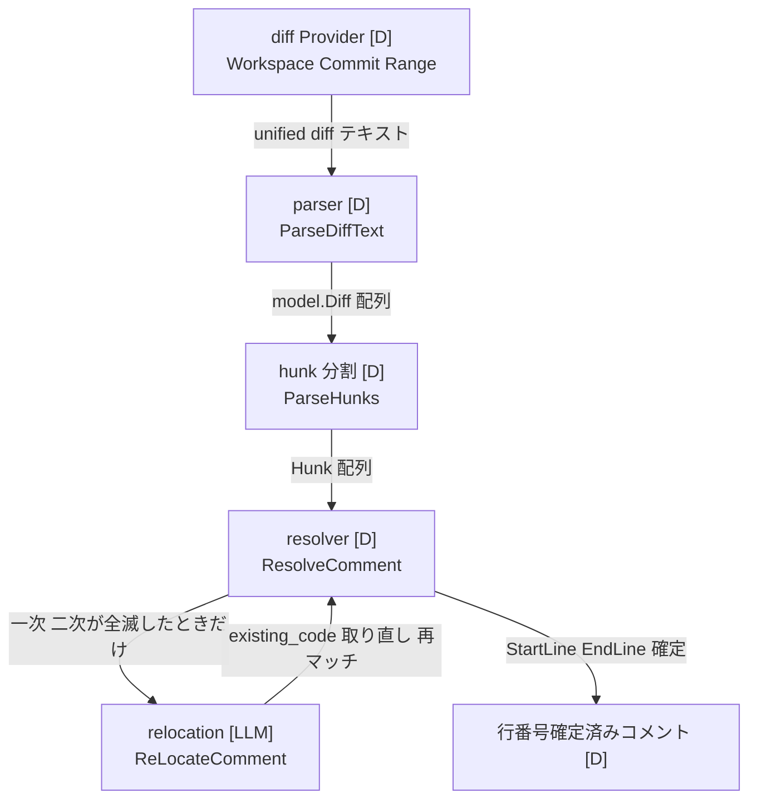
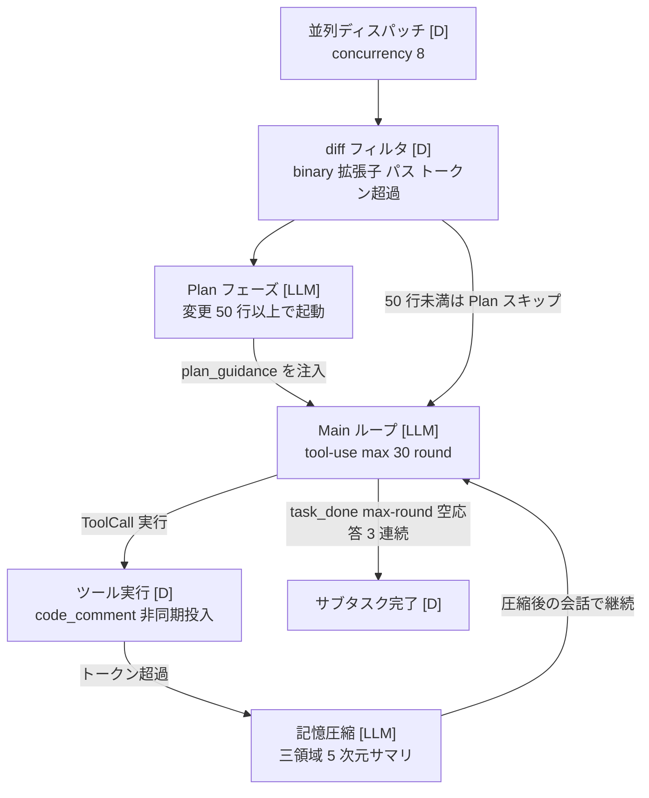
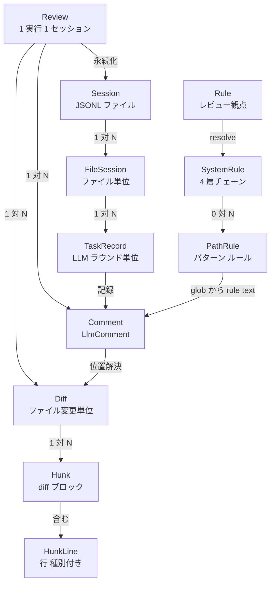
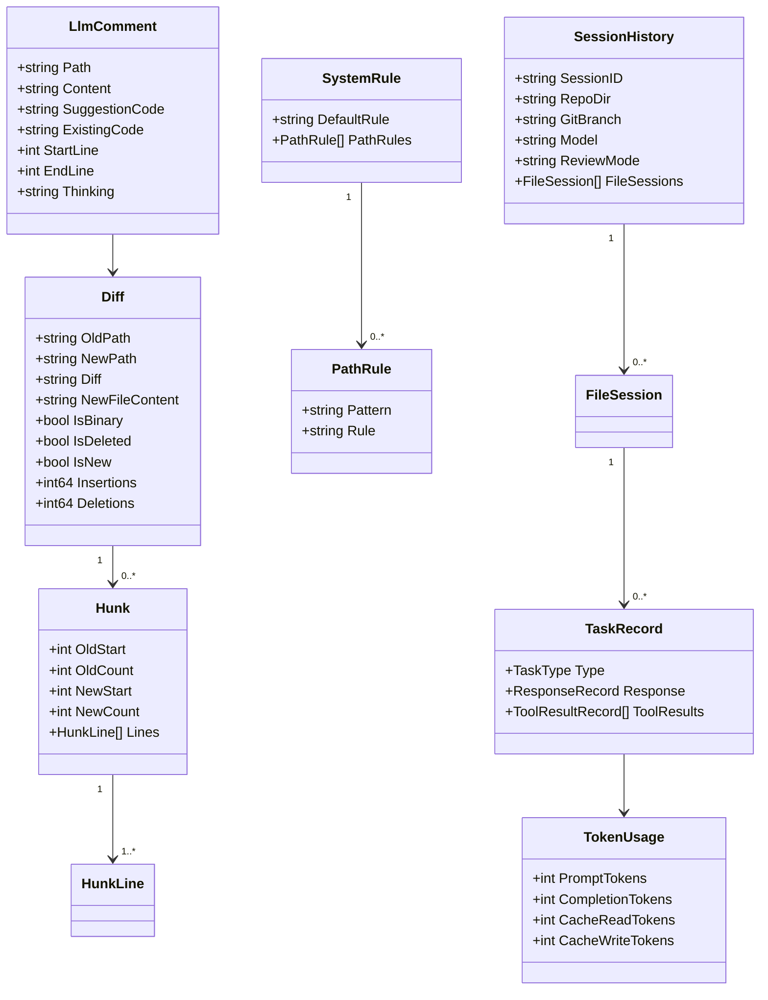

> 調査日: 2026-06-08 / 対象: `alibaba/open-code-review`（Go 製 AI コードレビュー CLI `ocr`、Apache-2.0、created 2026-05-18、`main` ブランチ）
> 表記: `[D]` = 決定的処理、`[LLM]` = LLM 呼び出しを伴う処理。コマンド・フラグは README.md の実物を正とします。

## 概要

Open Code Review（CLI 名 `ocr`）は、Alibaba が「社内公式の AI コードレビューアシスタントを 2 年運用したのち OSS 化した」と説明する Go 製のコードレビュー CLI です（`tens of thousands of developers / millions of defects` は Alibaba の自己申告で、一次裏取りはできません ［二次情報・自己申告］）。GitHub 公開からおよそ 3 週間で ★ 約 4.7k（2026-06-08 時点、概数）に達しました。

設計の核心は、レビュー工程を **「絶対に間違えてはいけない決定的処理」と「動的判断が要る LLM 処理」に明確に分ける** 点にあります。前者をエンジニアリングロジックで、後者を tool-use エージェントで担わせます。README はこれを「純粋な言語駆動アーキテクチャはレビュー工程に対するハードな制約を欠く」と説明します。

このハイブリッド設計は、AI コードレビューの構造的弱点をプロンプト改善ではなく **構造** で解こうとします。弱点は次の 3 つです。

| 弱点 | 内容 |
|---|---|
| position drift | 指摘箇所の行番号がずれる |
| incomplete coverage | レビュー対象を取りこぼす |
| unstable quality | プロンプトの微差で品質が揺らぐ |

ひとことで言えば **「LLM に行番号を出させない」** 設計です。LLM が返すのは指摘本文と該当コード片（`existing_code`）だけで、行番号への変換は決定的アルゴリズムが担います。

ただし宣伝と OSS 実体には乖離もあります。看板機能「Smart file bundling」は OSS 版に未実装（Issue #68 OPEN）、位置補正の核心モデルはコンプライアンス上 OSS 非公開（Issue #6）、第三者の小規模実測では F1 約 20%（n=10, Hacker News）［二次情報・小サンプル］と精度が振るいません。**設計思想は実装エンジニアにとって学ぶ価値がありますが、そのまま production の自動レビュアとして全面的に信頼するのは時期尚早** というのが本稿の総括です。

## 特徴

### 1. LLM が走るのは 4 箇所だけ

`ocr review` の全処理のうち、LLM 呼び出しは次の 4 点に限定されます（ソースコードの一次読解で確認しました）。

1. **per-file の指摘生成（main）**: ファイル 1 つを 1 サブタスクとして tool-use 会話を回します。上限 30 ラウンド、並列数 8（デフォルト）。
2. **任意の事前リスク分析（plan）**: 変更が 50 行以上のときだけ起動します。ツール定義をテキストとして prompt に埋め込み、構造化 JSON プランを 1 ショットで生成します（ツールは実際には呼びません）。
3. **位置解決が全滅したときの relocation**: 決定的な位置合わせが 2 段階とも失敗したときだけのフォールバックです。
4. **会話肥大時の記憶圧縮**: トークンが閾値を超えたら会話を frozen / compress / active の三領域に分割し、5 次元サマリへ圧縮します。

これ以外、つまり diff 取得・hunk 分割・ファイル選別・ルールマッチ・位置確定（一次・二次）・トークン計上・出力・セッション永続化はすべて決定的です。再現可能で、デバッグもできます。

### 2. 位置合わせの三段フォールバック

`code_comment` ツールで LLM が登録した指摘を、実ファイルの行番号へ変換する処理が設計の要です。一次・二次は完全に決定的で、LLM は三次のフォールバックとしてのみ登場します。

| 段階 | 関数 | 種別 | 内容 |
|---|---|---|---|
| 一次 | `resolveFromHunk` | [D] | `existing_code` を正規化して行配列化し、hunk の新側（context+added）と連続一致するか線形スキャン。新側で当たらなければ旧側で再試行 |
| 二次 | `resolveFromFileContent` | [D] | hunk の文脈窓（±3 行）から外れたコードのために、取得済みの新ファイル本文全体で連続一致を再探索 |
| 三次 | `ReLocateComment` | [LLM] | 上記が全滅したときだけ、LLM に「該当コード片を逐語コピーで返せ」と依頼してコード片を取り直し、再び決定的な `ResolveComment` にかける |

位置が確定できなければ `StartLine = EndLine = 0` で出力され、コメント本文から人またはエージェントが該当箇所を探して適用します。なお位置補正の核心モデルは Alibaba 社内訓練品で、コンプライアンス上 OSS 非公開です（Issue #6 で collaborator が明言）。OSS 版の位置精度は社内版より劣る可能性があります。

### 3. ルールがツール使用を誘導する 4 層チェーン

レビュー観点は優先度チェーン（first-match-wins）で解決します。

| 優先度 | ソース | パス |
|---|---|---|
| 1（最高） | `--rule` フラグ | ユーザ指定 |
| 2 | プロジェクト | `<repo>/.opencodereview/rule.json` |
| 3 | グローバル | `~/.opencodereview/rule.json` |
| 4（最低） | システム既定 | 埋め込み `system_rules.json` |

注目すべきは、組み込みルール doc（`java.md` 等）が観点列挙にとどまらず、**誤検知抑制と探索行動を自然文で誘導する** 点です。例として「NPE 誘発パターンは `code_search`/`file_read` で呼び出し連鎖を裏取りしてから報告せよ」「メソッド内ローカル変数の thread-safety は報告するな」などが埋め込まれています。ルール doc 自体がエージェントのツール使用と false-positive 抑制を駆動します。

ただし組み込みルールは Java/JVM スタック中心（java / kotlin / Maven / Gradle / MyBatis mapper / ArkTS）です。Go 専用ルール・Python 専用ルールは存在せず、`default.md` にフォールバックします。

### 4. マルチプロバイダ吸収と Claude Code 互換

LLM 接続は Anthropic / OpenAI の両対応です（`llm.use_anthropic`、デフォルト true）。エンドポイント解決は 4 戦略を優先度順に試します。

| 順位 | 戦略 |
|---|---|
| 1 | OCR config（`~/.opencodereview/config.json`） |
| 2 | OCR 環境変数（`OCR_LLM_*`） |
| 3 | Claude Code 環境変数（`ANTHROPIC_BASE_URL` / `ANTHROPIC_AUTH_TOKEN` / `ANTHROPIC_MODEL`） |
| 4 | `~/.zshrc` を grep して `ANTHROPIC_*` を取得 |

各戦略は URL / Token / Model の 3 点が揃った最初のものを採用します。追加実装として、`claude-opus-4-8[1m]` の `[1m]` サフィックスを正規表現で除去し、tiktoken の BPE データをバイナリ埋め込みでオフライン計上します。Anthropic 経路では system 末尾と tool 末尾に ephemeral cache control を付けてプロンプトキャッシュを有効化します。Claude Code を使っている開発者なら、追加設定ほぼゼロで動きます。

### 5. coding agent 連携は薄いラッパ

Claude Code Skill / Claude Code Plugin / Codex Plugin / コマンドファイル直コピーの 4 形態は、いずれも内部で `ocr review --audience agent` を呼ぶ薄いラッパです（`--audience agent` は進捗 UI を抑止し最終サマリだけ返します）。連携の本質は、OCR 側が決定的に「diff 解析・ファイル選別・位置確定」までやり切って構造化コメントを返すことにあります。外側の coding agent（Claude / Codex）は「指摘の分類・取捨・fix 適用」という上位判断に専念できます。CI 連携は `--format json` で機械可読出力を得て、GitHub Actions / GitLab CI に組み込みます。

## 構造

### システムコンテキスト図



| 要素名 | 説明 |
|---|---|
| 開発者 / CI | `ocr review` を手動または CI パイプラインから起動。レビュー結果を受け取る |
| OCR CLI | diff 解析・ファイル選別・ルールマッチ・LLM 呼び出し・位置確定・出力を一貫して担う |
| LLM API | plan / main / relocation / compression の 4 箇所のみで呼び出し。OpenAI・Anthropic 両対応 |
| git リポジトリ | diff 取得・ファイル本文読み込みの一次ソース |
| coding agent | `--audience agent` で出力を受け取り、分類・取捨・fix を担う上位エージェント |

### コンテナ図



| 要素名 | 説明 |
|---|---|
| CLI エントリ | フラグ解析・git repo 検証・全体オーケストレーション（`cmd/opencodereview/review_cmd.go`） |
| diff エンジン | diff 取得・hunk 分割・位置解決 3 段フォールバック（`internal/diff/`） |
| agent | 並列ディスパッチ・Plan/Main 2 フェーズ実行・記憶圧縮（`internal/agent/`） |
| tool セット | LLM が呼び出す 6 ツールの実装・Registry 管理（`internal/tool/`） |
| LLM クライアント | OpenAI / Anthropic 両対応・エンドポイント解決 4 戦略・tiktoken 計上（`internal/llm/`） |
| rules | 4 層チェーン + ファイル種別別ルール doc（`internal/config/rules/`） |
| session 永続化 | 1 実行 1 JSONL。イベントをチェーンで追記（`internal/session/`） |
| viewer | セッション JSONL を閲覧する HTTP サーバ。DNS リバインディング対策あり（`internal/viewer/`） |
| telemetry | 全 LLM 呼び出し横断のトークン・コスト可視化（`PrintTraceSummary`） |

### コンポーネント図（diff エンジン）



| 要素名 | 説明 |
|---|---|
| diff Provider | `git diff HEAD -U3` / `git show` / `git merge-base` の 3 モード。未追跡ファイルは自前で unified diff を合成 |
| parser | `diffHeaderRe` で per-file に分割。`finalizeDiff` が `NewFileContent` を格納 |
| hunk 分割 | `hunkHeaderRe` で `Hunk` 構造体に変換。各行に Context/Added/Deleted タグを付与 |
| resolver | 一次は hunk 新側/旧側の連続一致、二次は新ファイル全文スキャン |
| relocation | LLM に該当コード片を逐語コピーで返させ、決定的マッチを再試行。失敗時は元に戻す（非破壊） |

### コンポーネント図（agent）



| 要素名 | 説明 |
|---|---|
| 並列ディスパッチ | ファイル 1 つを 1 goroutine で処理。`sem` チャネルで同時数を `--concurrency`（デフォルト 8）に制限 |
| diff フィルタ | binary・ユーザ除外・拡張子・include 救済・デフォルト除外パスの順で判定。diff 本文が `MaxTokens` の 80% 超でスキップ |
| Plan フェーズ | 50 行以上でのみ起動。ツール定義をテキスト注入し、構造化 JSON プランを生成。出力を Main の prompt に注入 |
| Main ループ | `CompletionsWithCtx` を最大 30 回。終了条件は `task_done`・上限到達・連続空応答 3 回・圧縮後も閾値超過 |
| ツール実行 | `code_comment` のみ `CommentWorkerPool`（`--concurrency` と同じ並列数、デフォルト 8）に非同期投入 |
| 記憶圧縮 | frozen / compress / active に三分割し、Identified Code Issues / Tool Call Conclusions / Completed Tasks / Pending Tasks / Current Focus の 5 次元サマリへ圧縮 |

### ツールセット一覧

ツール定義は `tools.json` に集約され、各エントリが `plan_task`/`main_task` の bool を持ち、フェーズごとに供給する定義集合を絞ります。

| ツール名 | plan | main | 役割 |
|---|:---:|:---:|---|
| `task_done` | - | ✓ | タスク終了宣言。`state(DONE/FAILED)` を受け取りループを break |
| `code_comment` | - | ✓ | レビュー指摘の登録。`existing_code` のみ渡し、行番号は resolver が決定的に付与 |
| `file_read` | - | ✓ | 新ファイル本文を行範囲で読む（最大 500 行） |
| `code_search` | ✓ | ✓ | `git grep` によるコード検索（`--max-count 100`、10s timeout） |
| `file_read_diff` | ✓ | ✓ | 他の変更ファイルの diff を読む（フィルタ前の全 diff から作った読み取り専用 `DiffMap`） |
| `file_find` | ✓ | ✓ | `git ls-files`/`ls-tree` によるファイル名キーワード検索（最大 100 件） |

`code_comment`/`task_done`/`file_read` は main 専用、探索系は plan・main の両方で使えます。「成果を出す・終わる」アクションは分析のみの plan フェーズには供給しません。

## データ

### 概念モデル



| 要素名 | 説明 |
|---|---|
| Review | `ocr review` 1 回の実行。diff 取得から出力までを包括する処理単位 |
| Session | Review に対応する JSONL ファイル。`~/.opencodereview/sessions/<repo>/<uuid>.jsonl` に永続化 |
| FileSession | 1 ファイルのサブタスクに対応するセッション内の論理グループ |
| TaskRecord | 1 LLM ラウンドの記録 |
| Diff | git diff から得られる 1 ファイルの変更情報。位置解決の根拠 |
| Hunk | unified diff の `@@` ブロック 1 個 |
| HunkLine | Hunk 内の 1 行。Context / Added / Deleted の 3 種別 |
| Comment | LLM が `code_comment` で登録したレビュー指摘。最終出力単位 |
| Rule | LLM に与えるレビュー観点テキスト |
| SystemRule | ルールの最上位構造体。DefaultRule と PathRules を持つ |
| PathRule | glob パターンとルール doc テキストのペア |

### 情報モデル



`model.LlmComment` の `StartLine` と `EndLine` がともに 0 の場合は位置特定の失敗を表します。コメント本文から人またはエージェントが該当箇所を探して適用します。

### Session JSONL レコード型

1 実行 1 JSONL ファイルで、各行が下記 `type` のいずれかです。`uuid` と `parentUuid` でチェーンを形成し、Claude Code のセッションログ形式に酷似しています。

| type | 意味 |
|---|---|
| `session_start` | セッション開始。チェーン先頭 |
| `llm_request` | LLM へのリクエスト送信 |
| `llm_response` | LLM レスポンス受信（content / tool_calls / usage を含む） |
| `llm_error` | LLM 呼び出し失敗 |
| `tool_call` | ツール実行結果 |
| `session_end` | セッション終了サマリ |

`taskType` の値は `plan_task` / `main_task` / `memory_compression_task` / `re_location_task` の 4 種です。

## 構築方法

### インストール 3 経路

```bash
# 経路 1: npm（推奨）
npm install -g @alibaba-group/open-code-review

# 経路 2: GitHub Release バイナリ（macOS Apple Silicon の例）
curl -Lo ocr https://github.com/alibaba/open-code-review/releases/latest/download/opencodereview-darwin-arm64
chmod +x ocr && sudo mv ocr /usr/local/bin/ocr

# 経路 3: ソースから make build
git clone https://github.com/alibaba/open-code-review.git
cd open-code-review
make build
sudo cp dist/opencodereview /usr/local/bin/ocr
```

### LLM の設定

レビュー実行前に LLM 設定が必須です。

```bash
# 方法 A: ocr config set（Anthropic の例）
ocr config set llm.url https://api.anthropic.com/v1/messages
ocr config set llm.auth_token your-api-key-here
ocr config set llm.model claude-opus-4-6
ocr config set llm.use_anthropic true

# 方法 B: 環境変数 OCR_LLM_*
export OCR_LLM_URL=https://api.anthropic.com/v1/messages
export OCR_LLM_TOKEN=your-api-key-here
export OCR_LLM_MODEL=claude-opus-4-6
export OCR_USE_ANTHROPIC=true
```

設定は `~/.opencodereview/config.json` に保存されます。方法 C として、Claude Code を使っている場合は `ANTHROPIC_BASE_URL` / `ANTHROPIC_AUTH_TOKEN` / `ANTHROPIC_MODEL` を `ocr` が自動検出します（`~/.zshrc` / `~/.bashrc` の export 行も grep します）。

なお README は「環境変数が最優先」と記しますが、ソース実装（`internal/llm/resolver.go` の `ResolveEndpoint`）の戦略順は config ファイルが上位です。設定が効かないときは config ファイルの値を疑ってください。

設定後は `ocr llm test` で疎通確認します。

| キー | 型 | 例 |
|---|---|---|
| `llm.url` | string | `https://api.openai.com/v1/chat/completions` |
| `llm.auth_token` | string | `sk-xxxxxxx` |
| `llm.model` | string | `claude-opus-4-6` |
| `llm.use_anthropic` | boolean | `true` / `false` |
| `language` | string | `English` / `Chinese`（デフォルト Chinese） |
| `telemetry.enabled` | boolean | `true` / `false` |
| `telemetry.otlp_endpoint` | string | OTLP コレクタアドレス |
| `telemetry.content_logging` | boolean | プロンプトをテレメトリに含めるか |
| `llm.extra_body` | string | リクエストにマージする追加ボディ |

## 利用方法

### ocr review の実行

```bash
# ワークスペースモード（staged unstaged untracked すべて）
ocr review

# ブランチ範囲モード（merge-base）
ocr review --from main --to feature-branch

# 単一コミットモード
ocr review --commit abc123
```

主要フラグを示します。

| フラグ | 短縮 | デフォルト | 説明 |
|---|---|---|---|
| `--from` / `--to` | — | — | 起点 / 終点 ref |
| `--commit` | `-c` | — | レビュー対象の単一コミット |
| `--preview` | `-p` | `false` | LLM を呼ばず対象ファイル一覧だけ表示 |
| `--format` | `-f` | `text` | 出力形式 `text` / `json` |
| `--concurrency` | — | `8` | 並列レビューの最大数 |
| `--timeout` | — | `10` | 並列タスクのタイムアウト（分） |
| `--audience` | — | `human` | `human` 進捗表示 / `agent` サマリのみ |
| `--rule` | — | — | カスタム JSON ルールファイルのパス |
| `--max-tools` | — | テンプレ既定 | ツール呼び出し上限（既定超過時のみ有効） |
| `--background` | `-b` | — | レビューに注入する要件・ビジネス文脈 |
| `--max-git-procs` | — | `16` | git サブプロセスの最大並列数 |
| `--tools` | — | — | カスタムツール JSON 設定のパス |

その他、`ocr rules check <file>` でファイルへのルール適用を事前確認し、`ocr viewer`（デフォルト `localhost:5483`）でセッション閲覧 UI を起動します。viewer のポートは `--addr` で変更します。

### カスタムルールと include/exclude

ルールファイル（層 1〜3 共通の JSON 書式）を示します。

```json
{
  "rules": [
    { "path": "force-api/**/*.java", "rule": "All new methods must validate required parameters for null values" },
    { "path": "**/*mapper*.xml", "rule": "Check SQL for injection risks, parameter errors, and missing closing tags" }
  ],
  "include": ["src/main/**/*.java", "lib/**/*.kt"],
  "exclude": ["**/generated/**", "vendor/**"]
}
```

`include` は CLI フラグではなくルールファイルのフィールドである点に注意してください。built-in 除外パターン（テストファイル等）をバイパスして強制レビュー対象にします。`exclude` は `include` より常に優先します。

### coding agent 連携

いずれの形態も内部で `ocr review --audience agent` を呼ぶ薄いラッパです。前提として `ocr` CLI のインストールと LLM 設定が必要です。

```bash
# Option 1: Skill としてインストール
npx skills add alibaba/open-code-review --skill open-code-review

# Option 3: Codex Plugin
codex plugin marketplace add alibaba/open-code-review

# Option 4: コマンドファイル直コピー
mkdir -p .claude/commands
curl -o .claude/commands/open-code-review.md \
  https://raw.githubusercontent.com/alibaba/open-code-review/main/plugins/open-code-review/commands/review.md
```

Claude Code Plugin は `/plugin marketplace add alibaba/open-code-review` と `/plugin install open-code-review@open-code-review` で導入し、`/open-code-review:review` を有効化します。

### CI/CD 連携

CI では `--format json` で機械可読出力を得て、後続スクリプトでパースします。

```bash
ocr review --from "origin/main" --to "origin/feature-branch" --format json
```

GitHub Actions の要点を抜粋します（完全版は `examples/github_actions/ocr-review.yml`）。

```yaml
name: OpenCodeReview PR Review
on:
  pull_request:
    types: [opened, synchronize, reopened]
  issue_comment:
    types: [created]
permissions:
  contents: read
  pull-requests: write
jobs:
  code-review:
    runs-on: ubuntu-latest
    steps:
      - uses: actions/checkout@v4
        with:
          fetch-depth: 0
      - uses: actions/setup-node@v4
        with:
          node-version: '20'
      - name: Install OpenCodeReview
        run: npm install -g @alibaba-group/open-code-review
      - name: Configure OCR
        run: |
          ocr config set llm.url ${{ secrets.OCR_LLM_URL }}
          ocr config set llm.auth_token ${{ secrets.OCR_LLM_AUTH_TOKEN }}
          ocr config set llm.model ${{ secrets.OCR_LLM_MODEL }}
          ocr config set llm.use_anthropic ${{ secrets.OCR_LLM_USE_ANTHROPIC }}
      - name: Run OpenCodeReview
        run: |
          ocr review \
            --from "origin/${{ github.event.pull_request.base.ref }}" \
            --to "origin/${{ github.event.pull_request.head.ref }}" \
            --format json > /tmp/ocr-result.json || true
```

完全版は JSON の `comments[]` を `pulls.createReview` API でインラインコメント投稿し、位置情報が取れないコメントはサマリコメントにフォールバックします。GitLab CI 例は `examples/gitlab_ci/.gitlab-ci.yml` にあり、MR Discussions API へ投稿する Python スクリプトを含みます。

`--format json` の出力は次の形です。

```json
{
  "comments": [
    { "path": "src/main/java/Foo.java", "start_line": 42, "end_line": 45,
      "content": "レビュー指摘の本文", "existing_code": "該当コード片", "suggestion_code": "提案コード" }
  ]
}
```

`start_line` と `end_line` がともに 0 のときは位置特定の失敗で、コメント本文から手動で該当箇所を探します。

## 運用

### Telemetry

OCR は OpenTelemetry ベースのテレメトリ基盤を持ちますが、デフォルトは無効です（実装で確認済み。ハードコードされた Alibaba 送信先エンドポイントはありません）。設定は `ocr config set` で行います。

```bash
ocr config set telemetry.enabled true
ocr config set telemetry.exporter otlp
ocr config set telemetry.otlp_endpoint localhost:4317
```

`telemetry.content_logging` を有効にすると、LLM へのプロンプト全文（レビュー対象コードを含む）がエクスポートされます。デフォルトは false ですが、誤設定時のコード漏えいリスクに注意してください。社内コードをレビューする環境では有効にしないことを推奨します。

### セッション JSONL と viewer

1 review 実行ごとに `~/.opencodereview/sessions/<repo>/<uuid>.jsonl` が生成されます。レビュー対象ソースコードの断片を含むため、機密情報として扱います。viewer は repo 一覧からセッション一覧、会話詳細へドリルダウンする UI で、tool-use 往復・トークン使用量・位置解決過程を確認できます。viewer には認証機構がないため、allowlist の誤設定や意図しない外部バインドでレビュー結果が露出しないよう、ファイアウォールと組み合わせて運用します。

### トークン・コスト可視化とチューニング

`ocr review` 終了後に `telemetry.PrintTraceSummary` が全 LLM 呼び出しの合算トークンと推定コストを出力します。Anthropic 経路では system メッセージ末尾と tool 定義末尾に `CacheControlEphemeral` を自動付与してプロンプトキャッシュを活用するため、cache_read 比率が高いほどコスト効率が良くなります。

```bash
# 大規模 PR や API レート制限を受けやすい環境では下げる
ocr review --concurrency 2 --timeout 30
```

`--max-tools` はデフォルト値（30）を超過する方向のみ有効で、下げることはできません。

## ベストプラクティス

1. **「人間レビューの前処理」として位置づける**: OCR の指摘を自動マージ・自動コミットの根拠に使いません。第三者の小規模実測（HN, Martian benchmark, n=10）では precision 約 12% / F1 約 20% で「競合中ほぼ最下位」とされます ［二次情報・小サンプル］。Alibaba 自己申告「battle-tested / millions of defects」［二次情報・自己申告］との対比として記録します。Low の閾値は低くしすぎないようにします。
2. **カスタムルールで誤検知を抑制する**: プロジェクト固有の文脈（既知の設計パターン・技術的負債・テスト除外）は 4 層チェーンのカスタムルールで対応します。Go / Python / TypeScript は専用ルールがなく `default.md` にフォールバックするため、言語固有観点をカスタムルールで補います。
3. **High / Medium / Low 分類で取捨する**: OCR 本体は severity を出力に含めません。severity 分類は連携する Claude Code Skill / Plugin の側で行う設計です。
4. **CI では `--from`/`--to` + `--format json`**: `--from`/`--to` は merge-base モードで共通祖先から `to` までの差分を取ります。`--commit` は単一コミットの `git show` を使う別モードなので混同しません。多重投稿対策として GitHub Actions に `concurrency: cancel-in-progress` を必ず追加します。
5. **Claude Code ユーザーは環境変数互換でそのまま動く**: `ANTHROPIC_*` を 3 番目の戦略として自動読み込みするため追加設定は不要です。モデル名の `[1m]` 等コンテキスト長サフィックスは自動除去されます。

## トラブルシューティング

| 症状 | 原因と対応 |
|---|---|
| 位置解決失敗（`StartLine=EndLine=0`） | 3 段フォールバックがすべて失敗。`start_line == 0` の指摘を別バケツに分け、レビュアへの manual タスクとして扱う |
| `--commit`/`--to` で 0 件レビュー（#53 CLOSED） | `code_search` が `git grep` の引数順序バグで機能停止していた。修正済みだが range 指定形は最新バージョンで CI 動作を確認する |
| GitHub Action で重複・スパム投稿（#58 OPEN） | 公式サンプルに `concurrency` がない。ワークフロー YAML に手動追加する |
| PR の過去議論を考慮しない（#59 OPEN） | diff のみを入力とし、過去コメント・他レビュアの指摘・自身の前回投稿を考慮しない。識別タグで過去投稿を削除してから再投稿するロジックを自作する |
| Java 以外でレビューが薄い | `rule_docs/` に Go 専用・Python 専用ルールがない。言語固有観点はカスタムルールで補う |
| 巨大ファイルで取りこぼし（#23 CLOSED） | `filterLargeDiffs` が 1 ファイルで `MaxTokens` の 80% を超えるとスキップ。対象を小さく分ける |
| GPT-5 系で max_tokens エラー（#30 CLOSED） | `max_completion_tokens` に変換するよう修正済み。最新バージョンを使う |
| Windows のクラッシュ（#32 OPEN） | Windows サポートは成熟度が低い。本格運用は WSL2 経由を推奨 |

## まとめ

Open Code Review は「LLM が苦手な決定論的作業（行番号・ファイル選別・ルール適用）を決定的処理に寄せ、LLM は局所的な指摘生成だけ担う」という責務分離を、コードレベルで徹底した AI コードレビュー CLI です。一方で OSS 版は社内版の機能を一部欠き、第三者ベンチでは精度が振るわず、組み込みルールは Java 偏重のため、production の自動レビュアとして全面信頼するのは時期尚早です。設計思想は自前のレビュー・校正自動化に転用できる学びが多く、まずは「人間レビューの前処理」として試すのがよいでしょう。

この記事が少しでも参考になった、あるいは改善点などがあれば、ぜひリアクションやコメント、SNSでのシェアをいただけると励みになります！

## 参考リンク

- 公式ドキュメント・GitHub
  - [alibaba/open-code-review（GitHub）](https://github.com/alibaba/open-code-review)
  - [Open Code Review 公式ドキュメント](https://alibaba.github.io/open-code-review/)
  - [npm: @alibaba-group/open-code-review](https://www.npmjs.com/package/@alibaba-group/open-code-review)
  - [GitHub Actions 例（ocr-review.yml）](https://github.com/alibaba/open-code-review/blob/main/examples/github_actions/ocr-review.yml)
  - [GitLab CI 例（.gitlab-ci.yml）](https://github.com/alibaba/open-code-review/blob/main/examples/gitlab_ci/.gitlab-ci.yml)
  - [Claude Code Skill（SKILL.md）](https://github.com/alibaba/open-code-review/blob/main/skills/open-code-review/SKILL.md)
- Issue（採用上の注意点の根拠）
  - [#68 Smart file bundling 未実装（OPEN）](https://github.com/alibaba/open-code-review/issues/68)
  - [#6 行号幻覚 / 位置補正モデル OSS 非公開（CLOSED）](https://github.com/alibaba/open-code-review/issues/6)
  - [#53 code_search git grep バグ（CLOSED）](https://github.com/alibaba/open-code-review/issues/53)
  - [#58 GitHub Action 多重投稿（OPEN）](https://github.com/alibaba/open-code-review/issues/58)
  - [#59 PR 文脈非対応（OPEN）](https://github.com/alibaba/open-code-review/issues/59)
- 記事・評価
  - [Hacker News スレッド（benchmark / F1 約 20% 実測）](https://news.ycombinator.com/item?id=48406358)
