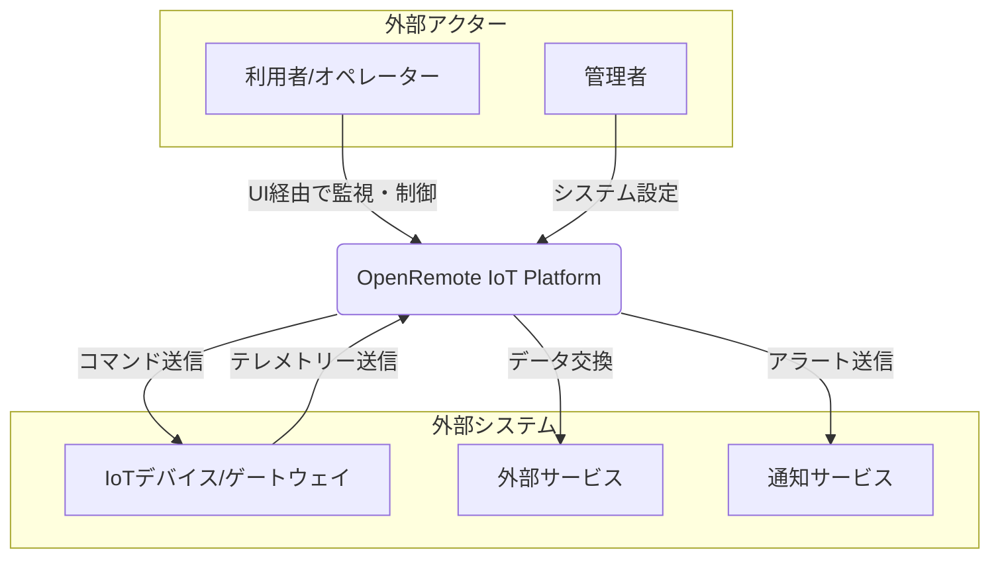
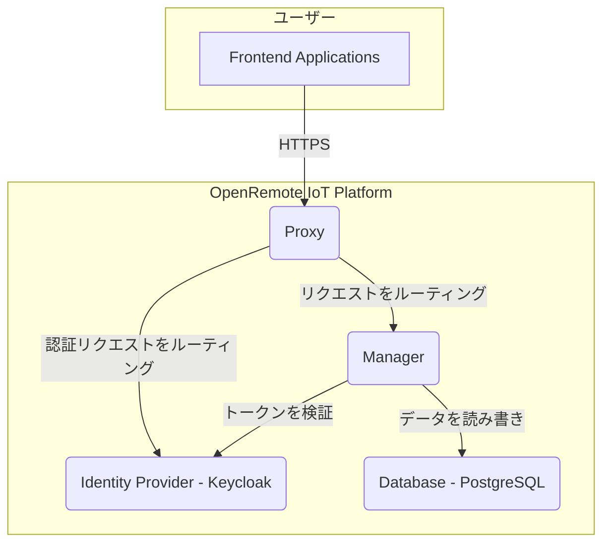
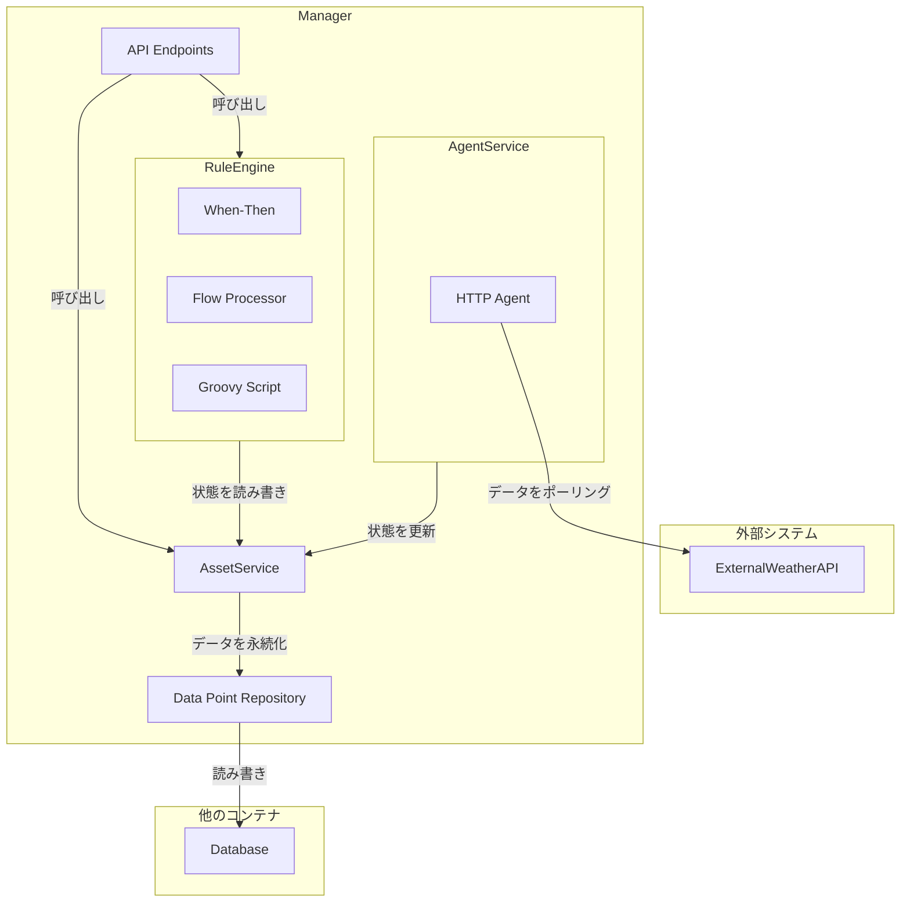
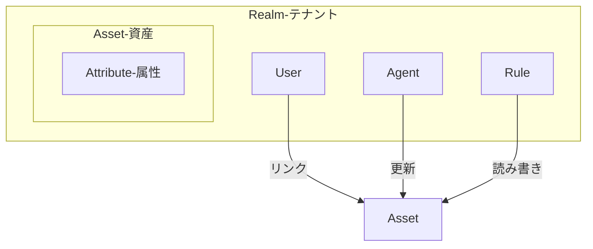
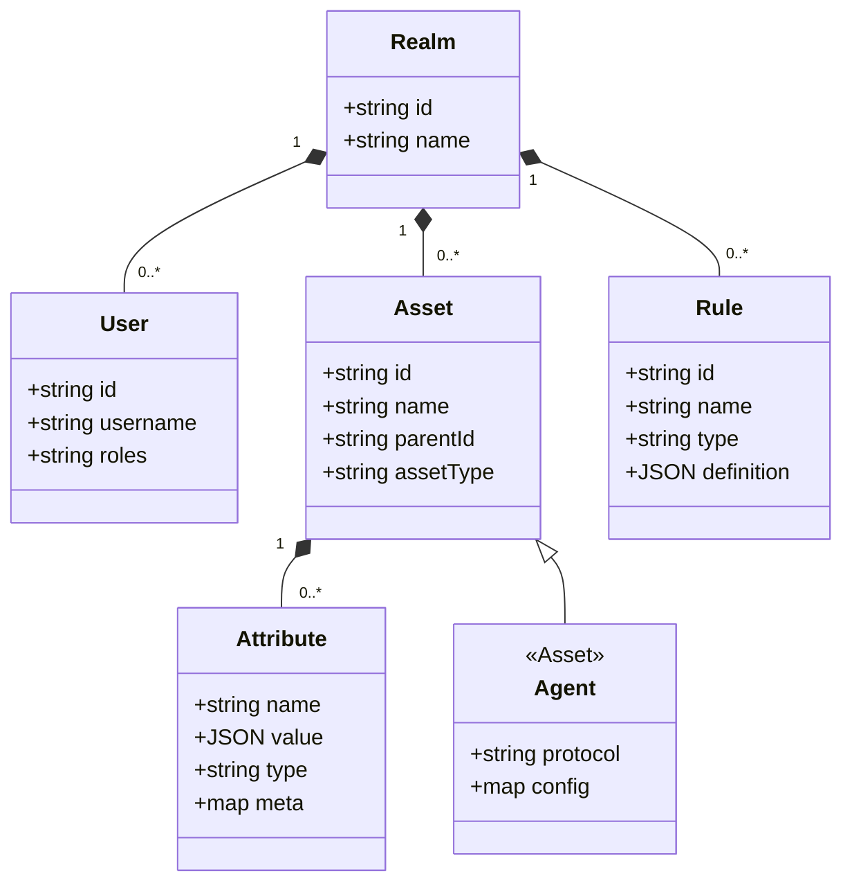

## ■概要

OpenRemoteは、デバイスの統合、ルールの作成、データの分析と可視化を行う、100%オープンソースのIoTプラットフォームです。

システムの中心は、ManagerというJavaアプリケーションです。Managerは、システム内のアセット（資産）の現在状態を捉えるIoTコンテキストブローカーとして機能します。利用者は、スマートシティやエネルギー管理などの特定ドメインに合わせて、アセットや属性の動的なスキーマを柔軟に作成できます。

このプラットフォームは、すぐに使えるアプリケーションではなく、**特定の要件に合わせてIoTソリューションを構築するためのフレームワーク**として設計されています。デバイス接続用のエージェント、自動化のためのルールエンジン、UI構築用のWebコンポーネント群を提供します。これらを組み合わせることで、デバイスの自動プロビジョニングからエンドユーザー向けのカスタムアプリケーション開発まで、IoTソリューションのライフサイクル全体を支援します。

## ■特徴

OpenRemoteは、IoTソリューションの構築と運用を支援する、以下の強力な特徴を備えています。

  * **デバイス管理:** IoTデバイスの集中管理、監視、自動プロビジョニングを実現します。
  * **広範な接続性:** MQTT、HTTP/REST、WebSocketなどの標準プロトコルに加え、KNXなどの業界特化プロトコルにも対応。さらに、「エージェント」モジュールにより新プロトコルへ容易に拡張可能です。
  * **強力なルールエンジン:** GUIベースの「When-Thenルール」やフローベースの「Flowルール」で直感的な自動化を実現しつつ、GroovyやJavaScriptによる高度なスクリプティングにも対応します。
  * **カスタマイズ可能なフロントエンド:** 再利用可能なWebコンポーネントライブラリにより、プロジェクト独自のUIやダッシュボードを迅速に開発できます（ホワイトラベリング対応）。
  * **マルチテナンシーとセキュリティ:** 「レルム」機能により、単一プラットフォーム上で複数の独立したテナント環境を安全に構築可能。Keycloakとの統合により、ユーザーやロールに基づく堅牢な認証・認可を実現します。
  * **データの可視化と分析:** 「インサイト」機能により、リアルタイムデータや履歴データを可視化するインタラクティブなダッシュボードをノーコードで作成できます。

## ■構造

OpenRemoteのアーキテクチャを、全体像から詳細へと掘り下げるC4モデルに基づき、システムコンテキスト図、コンテナ図、コンポーネント図の順に説明します。

### ●システムコンテキスト図

最初に、OpenRemoteプラットフォームを単一のシステムとして捉え、外部のユーザーやシステムとの関係性を示します。



| 要素名 | 説明 |
| :--- | :--- |
| 利用者/オペレーター | Web UIやモバイルアプリを通じて、システムを監視し、デバイスを操作する利用者 |
| 管理者 | システム全体の設定、ユーザーやレルムの管理、アセットモデルの定義などを行う管理者 |
| OpenRemote IoT Platform | デバイスからのデータ受信、ルール実行、UI提供を行うシステム本体 |
| IoTデバイス/ゲートウェイ | センサーデータを送信し、プラットフォームからの制御コマンドを受信する物理デバイス |
| 外部サービス | 天気予報APIや企業の基幹システムなど、データ連携のために相互作用する外部システム |
| 通知サービス | Eメールサーバーやプッシュ通知ゲートウェイなど、アラート通知に利用される外部サービス |

### ●コンテナ図

次に、OpenRemote IoT Platformの内部を構成する、主要な実行可能単位（コンテナ）の関係を示します。



| 要素名 | 説明 |
| :--- | :--- |
| Frontend Applications | ユーザーが直接操作するWebアプリケーション（Manager UIなど）。Vue.jsで構築されている |
| Proxy | HAProxyベースのリバースプロキシ。外部からのリクエストを受け付け、適切なバックエンドサービスにルーティングする責務を持つ |
| Manager | Javaで実装されたコアバックエンドサービス。API提供、ルールエンジン実行、システム状態管理など中心的なロジックを担う |
| Identity Provider (Keycloak) | 認証、認可、ユーザー、ロール、レルム（テナント）を管理するID管理システム。OpenID Connect/OAuth2.0に準拠 |
| Database (PostgreSQL) | アセット、属性、ユーザー情報、時系列データなどを永続的に保存するデータストア |

### ●コンポーネント図

最後に、システムの心臓部であるManagerコンテナの内部を構成する、主要なコンポーネントとその責務を示します。



| 要素名 | 説明 |
| :--- | :--- |
| API Endpoints | HTTP REST、WebSocket、MQTT BrokerなどのAPIを提供し、Managerの機能を外部に公開するインターフェース |
| Rule Engine | When-Then、Flow、Groovyスクリプトなど、定義されたルールに基づき自動化ロジックを実行するコンポーネント |
| Agent Service | プロトコルエージェントのライフサイクルを管理し、外部デバイスやサービスとアセットモデル間の通信を仲介 |
| Asset Service | アセットや属性の生成、読み取り、更新、削除（CRUD）といったライフサイクル管理を行う中心コンポーネント |
| Data Point Repository | アセットの状態や時系列データをPostgreSQLデータベースに永続化、または読み出すコンポーネント |
| HTTP Agent | 外部HTTP API（例：天気予報API）から定期的にデータを取得するエージェントの実装例 |
| External Weather API | HTTP Agentが接続する外部サービスの具体例 |

## ■データ

OpenRemoteが扱うデータモデルは、柔軟で拡張性が高い設計になっています。ここでは概念モデルと情報モデルの2段階で説明します。

### ●概念モデル

システムが扱う主要な情報エンティティと、それらの関係性を抽象的に示します。



| 要素名 | 説明 |
| :--- | :--- |
| Realm | マルチテナント環境における各テナントの独立した区画。ユーザー、アセット、ルールなどを内包する |
| User | システムにログインし操作を行うユーザー。特定のアセットへのアクセス権を持つ |
| Asset | 物理デバイスや論理的な概念（例：部屋、建物）の**デジタルツイン**（仮想的な表現） |
| Attribute | アセットが持つ個々のデータ項目（例：センサー値、設定値、位置情報） |
| Agent | 外部デバイスやサービスと通信し、アセットの属性値を更新する特殊なアセット |
| Rule | アセットの属性値を監視し、条件に応じてアクション（他の属性値の更新や通知など）を実行するロジック |

### ●情報モデル

概念モデルを具体化し、各エンティティが持つ主要な属性をクラス図として表現します。



| 要素名 | 説明 |
| :--- | :--- |
| Realm | テナントを識別する `id` と `name` |
| User | ユーザー名 `username` と、権限を定義する `roles` |
| Asset | 一意な `id`、表示名 `name`、階層構造を定義する `parentId`、アセット種別を示す `assetType` |
| Attribute | アセット内での名前 `name`、データ型 `type`、任意のJSON形式の値 `value`、追加情報を格納する `meta` |
| Agent | `Asset` を継承した特殊クラス。使用するプロトコル `protocol` とその設定 `config` |
| Rule | ルールの種類を示す `type`（WhenThen, Flowなど）と、ロジックをJSON形式で保持する `definition` |

このデータモデルの核心は、`Asset`と`Attribute`の汎用性にあります。特に`Attribute`の`value`をJSON形式にすることで、単純な数値からネストされた複雑なオブジェクトまで、あらゆるデータを柔軟に格納できるようになっています。

## ■構築方法

Dockerを利用して、ローカル環境にOpenRemoteを素早く構築する手順を示します。

### ●前提条件

  * DockerおよびDocker Compose (v18以降)のインストール

### ●手順

1.  **Docker Composeファイルのダウンロード**
    公式リポジトリから`docker-compose.yml`ファイルをダウンロードします。

    ```bash
    curl -L -o docker-compose.yml https://raw.githubusercontent.com/openremote/openremote/master/docker-compose.yml
    ```

2.  **スタックの起動**
    ダウンロードしたファイルがあるディレクトリで、以下のコマンドを実行し、コンテナを起動します。

    ```bash
    # Dockerイメージをプル
    docker compose pull

    # コンテナをバックグラウンドで起動
    docker compose -p openremote up -d
    ```

3.  **コンテナの確認**
    `proxy`, `manager`, `keycloak`など複数のコンテナが実行中であることを確認します。

    ```bash
    docker ps
    ```

4.  **初期アクセス**

      * Webブラウザで `https://localhost` にアクセスします。
      * 自己署名証明書に関する警告が表示されたら、許可して進みます。
      * 以下のデフォルト認証情報でログインします。
          * **Username:** `admin`
          * **Password:** `secret`

### ●ホスト名/ポートの変更

ローカルホスト以外でアクセスする場合は、環境変数 `OR_HOSTNAME` を設定して起動します。

```bash
# 例: IPアドレス 192.168.1.100 でアクセスする場合
OR_HOSTNAME=192.168.1.100 docker-compose -p openremote up -d
```

## ■利用方法

### ●GUIベースのルールエンジン

OpenRemoteは、GUIベースのルールエンジンを提供します。プログラミングの知識がなくても、直感的に自動化の論理を構築できます。

本章では、代表的な「When-Thenルール」と「Flowルール」の利用例を紹介します。

#### ▷When-Thenルール

When-Thenルールは、「特定の条件（When）が満たされた場合に、特定のアクション（Then）を実行する」形式のルールです。これにより、イベントをきっかけとした一連の動作を定義できます。

**利用例：気温が低く、日没前に照明を点灯する**

**事前準備**

  * 監視対象の属性（例：temperature）を持つアセット（例：Weather Asset）の準備
  * 監視対象の属性への「Rule state」の追加

**ルール作成手順**

1.  Manager UIの「Rules」ページへ移動し、「+」アイコンから「When-Then」を選択します。
2.  ルールに名前（例: Cold and sunset: lights on）を付けます。
3.  **条件（When）を設定します。**
      * 「+」をクリックして条件を追加し、「Attribute」を選択します。
      * `Weather Asset`の`temperature`属性が`10`未満（less than）であるという条件を設定します。
      * 「ADD CONDITION」から「Time」を選択し、トリガータイプを「Sunset」、オフセットを「-5分」に設定します。これは「日没の5分前」を意味します。
      * 2つの条件を「AND」で結合します。
4.  **アクション（Then）を設定します。**
      * 画面右側の「+」をクリックしてアクションを追加します。
      * 制御対象のアセット（例：Light Asset）と属性（例：On Off）を選択します。
      * 実行するアクションとして、スイッチをオンに設定します。
5.  **スケジュールを設定します。**
      * 「Always active」をクリックし、ルールを有効にするスケジュール（例：平日のみ）を設定します。
6.  「Save」をクリックしてルールを保存します。

#### ▷Flowルール

Flowルールは、属性値の変換や加工に適しています。複数の属性値を基に、新たな仮想的な属性値を生成することも可能です。論理は、ドラッグ＆ドロップ操作のビジュアルエディタで構築します。

**利用例：摂氏を華氏に変換する**

**事前準備**

  * 変換結果（華氏温度）を格納する新規属性（例：temperatureFahrenheit）の作成
  * 新規属性への「Rule state」の追加（Flowルールからの書き込みを許可）

**フロー作成手順**

1.  「Rules」ページで「+」アイコンから「Flow」を選択し、Flowエディタを開きます。
2.  エディタ画面に、以下の図に示す3種類のノードを配置し、データの流れを定義します。

  | 要素名 | 説明 |
  | :--- | :--- |
  | Inputノード | 変換元のデータとなる、摂氏温度の属性 |
  | Processorノード | 計算処理を実行。摂氏から華氏への変換式 `C * 9/5 + 32` を定義する数学ノード |
  | Outputノード | 計算結果の出力先となる、華氏温度の属性 |

3.  フローを保存します。
      * 保存後、変換元の摂氏温度が更新されるたびにフローが自動実行され、華氏温度の属性値が更新されます。

### ●HTTP Agentによる外部データ連携

ここでは、OpenWeatherMap APIから天気情報を取得する例を示します。

1.  **HTTP Agentの作成**

      * アセットタイプ「HTTP Agent」を選択して作成します。
      * 作成したAgentの属性ページで、以下の設定を行います。
          * **Base URI**: `https://api.openweathermap.org/data/2.5/`
          * **Request query parameters**: APIキーや都市名をJSON形式で設定します。
            ```json
            {
              "appid": "<YOUR_API_KEY>",
              "q": "<CITY_NAME>",
              "units": ["metric"]
            }
            ```

2.  **連携用アセットの作成**

      * 天気情報を格納するためのアセット（例: Weather Asset）を任意のアセットタイプで作成します。

3.  **エージェントリンクの設定**

      * Weather Assetの「Edit asset」モードで、データを格納したい属性（例: `temperature`）を展開します。
      * 「Add configuration item」から「Agent link」を選択します。
      * 作成したHTTP Agentをリンク先に指定し、以下の項目を設定します。
          * **Polling millis**: `60000` （60秒ごとにデータをポーリング）
          * **Path**: `weather` （Base URIに続くパス）
          * **Value filters**: `JsonPathFilter-2` を選択し、APIレスポンスから値を取得するJsonPath（例: `$.main.temp`）を指定します。
      * 設定を保存すると、指定間隔で外部APIからデータが取得され、アセットの属性値が自動的に更新されます。

### ●MQTT APIによるデータ送受信

OpenRemoteはMQTTブローカーとしても機能します。以下は、Pythonのpaho-mqttライブラリを使用したデータ送受信のサンプルコードです。

**準備:** Manager UIの「Users」ページでService userを作成し、その`ClientID`と`Secret`を控えておきます。また、データ送受信の対象となるアセットのID（URLから確認可能）を調べておきます。

```python
import paho.mqtt.client as mqtt
import json
import time

# --- 設定項目 ---
OR_HOSTNAME = "localhost"
CLIENT_ID = "your_service_user_client_id"  # Service userのClientID
CLIENT_SECRET = "your_service_user_secret"  # Service userのSecret
PORT = 8883  # デフォルトのMQTTSポート

ASSET_ID = "your_asset_id"  # Manager UIで確認したアセットID
ATTRIBUTE_NAME = "temperature"
# ----------------

# 接続時のコールバック
def on_connect(client, userdata, flags, rc):
    if rc == 0:
        print("Successfully connected to MQTT broker")
        # 属性の状態変化を購読
        topic = f"master/asset/{ASSET_ID}/attribute/{ATTRIBUTE_NAME}/state"
        client.subscribe(topic)
        print(f"Subscribed to: {topic}")
    else:
        print(f"Failed to connect, return code {rc}")

# メッセージ受信時のコールバック
def on_message(client, userdata, msg):
    try:
        payload = json.loads(msg.payload.decode())
        print(f"Received message on topic {msg.topic}: {payload}")
        value = payload.get("value")
        print(f"Attribute '{ATTRIBUTE_NAME}' new value: {value}")
    except json.JSONDecodeError:
        print(f"Could not decode JSON payload: {msg.payload}")


client = mqtt.Client(client_id=CLIENT_ID)
client.username_pw_set(username=CLIENT_ID, password=CLIENT_SECRET)
client.on_connect = on_connect
client.on_message = on_message

# TLS設定（ローカルの自己署名証明書のため検証を無効化）
client.tls_set(tls_version=mqtt.ssl.PROTOCOL_TLS)
client.tls_insecure_set(True)

client.connect(OR_HOSTNAME, PORT, 60)

# ネットワークループを開始
client.loop_start()

# 5秒ごとに新しい値を送信
try:
    temp_value = 20.0
    while True:
        # 新しい値を送信するトピック
        publish_topic = f"master/asset/{ASSET_ID}/attribute/{ATTRIBUTE_NAME}"
        payload = {
            "value": temp_value
        }
        client.publish(publish_topic, json.dumps(payload))
        print(f"Published to {publish_topic}: {payload}")
        temp_value += 0.5
        time.sleep(5)
except KeyboardInterrupt:
    print("Exiting...")
finally:
    client.loop_stop()
    client.disconnect()
```

## ■運用

本番環境での運用における重要な要素を説明します。

### ●データベースのバックアップとリストア

システムの全状態はPostgreSQLに保存されるため、定期的なバックアップは不可欠です。

  * **バックアップの作成**

    ```bash
    # コンテナ内でpg_dumpを実行し、ホストにバックアップファイルを作成
    docker exec openremote_postgresql_1 pg_dump -U postgres -Fc openremote > openremote_backup.dump
    ```

  * **リストア**

    ```bash
    # 既存のDBを削除し、再作成
    docker exec -it openremote_postgresql_1 dropdb -U postgres openremote
    docker exec -it openremote_postgresql_1 createdb -U postgres openremote

    # バックアップファイルをコンテナにコピーしてリストア
    cat openremote_backup.dump | docker exec -i openremote_postgresql_1 pg_restore -U postgres -d openremote
    ```

### ●ログの確認

各コンテナのログは、動作確認やトラブルシューティングに不可欠です。

```bash
# Managerコンテナのログを表示
docker logs openremote_manager_1

# ログをリアルタイムで追跡 (-fオプション)
docker logs -f openremote_manager_1
```

### ●カスタムデプロイメント

OpenRemote本体のコードを変更せず、独自の機能を追加するには「カスタムプロジェクト」の作成が推奨されます。

  * **カスタムプロジェクトの役割**

      * **外観の変更**: ロゴや配色を変更し、独自のブランドUI（ホワイトラベリング）を実現。
      * **カスタムアセットタイプ**: プロジェクト固有のデバイスや概念を表す新しいアセットタイプを定義。
      * **カスタムプロトコル**: 標準でサポートされていないプロトコルに対応するエージェントを追加。
      * **初期セットアップ**: 新規デプロイ時に、定義済みのレルム、ユーザー、アセットなどを自動構成。

  * **始め方**

      * 公式の `custom-project` テンプレートリポジトリをフォークして開発を開始します。

### ●OpenRemote CLIの利用

`openremote-cli`は、OpenRemoteスタックのデプロイと管理を簡素化する公式のコマンドラインツールです。

  * **インストール**

    ```bash
    pip install --upgrade openremote-cli
    ```

  * **利用例**

    ```bash
    # ローカル環境にデプロイ
    or deploy

    # AWS上に指定したドメイン名でデプロイ
    or deploy --platform aws --dnsname myiot.mydomain.com

    # スタックの状態を確認
    or deploy --action health
    ```

## ■まとめ

**長所**

  * **柔軟性と拡張性:** カスタムアセットやカスタムプロトコルにより、特定のドメイン要件に深く適合させることが可能です。
  * **堅牢なアーキテクチャ:** Keycloakによる認証認可、マルチテナント対応など、エンタープライズ用途にも耐えうる設計になっています。
  * **オープンソース:** ベンダーロックインがなく、自由にカスタマイズできる点は最大の魅力です。

**考慮点**

  * **学習コスト:** フレームワークとしての側面が強いため、すぐに使えるSaaS型IoTプラットフォームと比較すると、データモデルの設計やカスタム実装にある程度の学習が必要です。
  * **コミュニティ:** 他の巨大OSSプロジェクトと比較するとコミュニティは小規模であり、日本語の情報はまだ少ないです。

結論として、OpenRemoteは以下のようなプロジェクトに特に適していると考えられます。

  * **特定の業務ドメインに特化**したIoTソリューションを内製したい場合
  * **マルチテナント機能が必須となるSaaS型**のIoTサービスを構築したい場合
  * 長期的な視点で、**ベンダーに依存しない**独自のIoT基盤を構築・運用したい場合

この記事が少しでも参考になった、あるいは改善点などがあれば、ぜひリアクションやコメント、SNSでのシェアをいただけると励みになります！

## ■参考資料

  * docs.openremote.io
      * [Architecture - OpenRemote Documentation](https://docs.openremote.io/docs/category/architecture/)
      * [Deploying - OpenRemote Documentation](https://docs.openremote.io/docs/next/category/deploying/)
      * [Tutorials - OpenRemote Documentation](https://docs.openremote.io/docs/category/tutorials/)
      * [User Guide - OpenRemote Documentation](https://docs.openremote.io/docs/category/user-guide/)
      * [Installing and using Docker | OpenRemote Documentation](https://docs.openremote.io/docs/developer-guide/installing-and-using-docker/)
      * [Working on UI and apps | OpenRemote Documentation](https://docs.openremote.io/docs/developer-guide/working-on-ui-and-apps/)
      * [OpenRemote Documentation: Introduction](https://docs.openremote.io/docs/introduction/)
      * [Assets, Agents and Attributes - OpenRemote Documentation](https://docs.openremote.io/docs/user-guide/assets-agents-and-attributes/)
      * [Quick Start - OpenRemote Documentation](https://docs.openremote.io/docs/quick-start/)
      * [Custom deployment | OpenRemote Documentation](https://docs.openremote.io/docs/next/user-guide/deploying/custom-deployment/)
      * [Manager UI | OpenRemote Documentation](https://docs.openremote.io/docs/next/user-guide/manager-ui/)
  * en.wikipedia.org
      * [OpenRemote - Wikipedia](https://en.wikipedia.org/wiki/OpenRemote)
  * forum.openremote.io
      * [How to custom app deployment help - OpenRemote forum](https://forum.openremote.io/t/how-to-custom-app-deployment-help/1999)
      * [Receiving information from OpenRemote - Agents, Protocols and APIs](https://forum.openremote.io/t/receiving-information-from-openremote/1811)
  * github.com
      * [openremote/openremote: 100% open-source IoT Platform ...](https://github.com/openremote/openremote)
      * [Command line tool for managing OpenRemote v3 stack.](https://github.com/openremote/openremote-cli)
      * [Architecture: Apps and consoles · openremote/openremote Wiki](https://github.com/openremote/openremote/wiki/Architecture%3A-Apps-and-consoles)
  * hub.docker.com
      * [OpenRemote Inc. - Docker Hub](https://hub.docker.com/u/openremote)
  * openremote.io
      * [OpenRemote](https://openremote.io/)
      * [OpenRemote: Documentation to build your own open source IoT platform](https://www.openremote.io/developers/)
      * [Get started with the free IoT platform - OpenRemote](https://openremote.io/get-started-iot-platform/)
  * www.researchgate.net
      * [OpenRemote architecture [8] | Download Scientific Diagram - ResearchGate](https://www.researchgate.net/figure/OpenRemote-architecture-8_fig6_343137315)