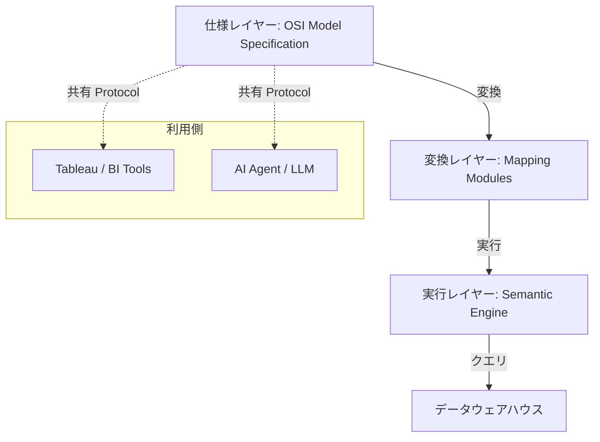
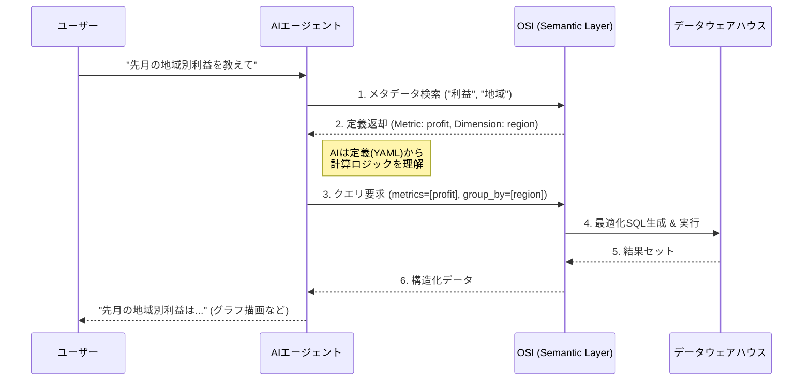

Open Semantic Interchange (OSI) は、データエンジニアリングとビジネスインテリジェンス（BI）の分野における重要なイニシアチブです。Snowflake、Salesforce、dbt Labsなどが共同で推進しており、データの「意味」を統一することを目的としています。本記事では、OSIの構造、データモデル、そして特に**AIエージェントがどのようにデータを理解するか**という観点から、その革新性を解説します。

:::message alert
**現在のステータス (2026年2月時点)**
OSIは2024年に初期構想が発表され、現在は主要ベンダー（Snowflake, Salesforce等）による**仕様策定と実装が同時進行しているフェーズ**です。本番環境での全面採用には、各ツールの対応状況（GA/Preview）を確認する必要があります。
:::

## 背景：なぜOSIが必要なのか

現代の企業データ環境は複雑化しており、複数のツール間でデータの定義が食い違う「セマンティックドリフト」が課題となっています。

### データ分析における「バベルの塔」

企業内にはSalesforce、Snowflake、Tableauなど多様なツールが存在します。それぞれのツールで「売上」や「利益」といった指標を個別に定義しているため、数値の不整合が発生します。

:::message
**セマンティックドリフトの例**
マーケティング部門と経理部門で「売上総利益」の計算ロジック（送料を含めるか否か等）が異なり、経営会議で数字が合わず意思決定が遅れる状況が発生します。
:::

### AIとエージェント時代の要請

生成AIや自律型AIエージェントの台頭により、この問題はさらに深刻化しました。
従来のAI（LLM）データ分析では、AIがカラム名（例: `amt_usd`）から意味を推測してSQLを生成していました。しかし、これではビジネスの文脈（「この売上は返品を除く」など）を反映できず、誤った回答（ハルシネーション）を招きます。

OSIは、AIに対して正確な「意味の地図」を提供します。AIはこの地図を読み込むことで、**「推測」ではなく「確信」を持ってデータを操作できるようになります。**

## 既存のセマンティック技術との比較

OSIはこれまでのセマンティックレイヤーとどう違うのでしょうか？ 3つの主要なアプローチと比較します。

| 技術                | 特徴                                                                             | OSIとの違い (OSIの優位性)                                                                                                     |
| :------------------ | :------------------------------------------------------------------------------- | :---------------------------------------------------------------------------------------------------------------------------- |
| **LookML (Looker)** | 非常に強力だが、Looker/GCPエコシステムに閉鎖的。                                 | **ベンダー中立性**: OSIは特定のBIツールに依存せず、あらゆるツール（Tableau, PowerBI, AI）から参照可能です。                   |
| **Cube.js**         | API主導の素晴らしいOSSだが、別途サーバー等のインフラ管理が必要になる場合が多い。 | **プラットフォーム統合**: OSIはSnowflake等のDWHネイティブ機能として統合される傾向にあり、追加インフラ管理が不要です。         |
| **AtScale**         | 大規模な仮想化レイヤー。エンタープライズ向けだが導入が重厚になりがち。           | **Code-First & Lightweight**: GitHubでYAMLを管理する現代的な開発フロー（dbtライク）を採用しており、アジャイルに運用できます。 |

## OSIの構造的アーキテクチャ

OSIは単なるフォーマットではなく、仕様、変換、実行、転送からなる多層的なアーキテクチャを持ちます。



各レイヤーの役割は以下の通りです。

| レイヤー | コンポーネント          | 役割                                                                                 |
| :------- | :---------------------- | :----------------------------------------------------------------------------------- |
| **仕様** | OSI Model Specification | YAML形式の標準仕様。メトリクスや結合定義の「真実のソース」です。                     |
| **変換** | Mapping Modules         | OSI定義を各ツール固有の言語（Tableau TDSなど）へ変換します。                         |
| **実行** | Semantic Engine         | MetricFlowなどが該当します。定義に基づき最適化されたSQLを動的に生成します。          |
| **転送** | Transport Protocol      | REST API等を通じて、セマンティック定義をシステム間で標準的に交換するための仕様です。 |

### エコシステム連携

OSIを中心としたハブ＆スポーク型の連携が可能です。詳細な仕様書（YAML）がGitHub等で管理され、それを各ツールが参照する形になります。
- **データプラットフォーム**: SnowflakeなどのDWHは、データの供給源およびクエリ実行基盤として機能します。
- **BIツール**: Tableauなどは、OSIから定義をインポートして利用します。
- **AIエージェント**: メタデータを読み込み、ユーザーの意図を正確に解釈します。

## OSIデータモデルの詳細

OSI内部では、YAMLファイルを用いてデータモデルを定義します。これにより、「Metrics-as-Code」（指標のコード管理）が実現します。

### 定義ファイルの例（YAML）

OSIの強力な点は、単一のテーブル定義だけでなく、テーブル間の結合（Join）も含めて管理できる点です。

以下は、`orders`（注文）が `users`（顧客）を参照している関係性を含んだ定義例です。

```yaml
# 注文モデル (Fact Table相当)
semantic_model:
  name: orders
  description: "全社の注文トランザクションデータ。"
  model: ref('raw_orders')
  
  entities:
    - name: order_id
      type: primary
    - name: user_key      # 結合キーの定義
      type: foreign
      expr: user_id
  
  dimensions:
    - name: order_date
      type: time
      type_params:
        time_granularity: day
        
  measures:
    - name: revenue_usd
      description: "米ドル建ての売上金額"
      agg: sum
      expr: case when status = 'completed' then amount_usd else 0 end

---
# 顧客モデル (Dimension Table相当)
semantic_model:
  name: users
  model: ref('raw_users')
  
  entities:
    - name: user_key
      type: primary
      expr: id
  
  dimensions:
    - name: country
      type: categorical

---
# メトリクスの定義例
metric:
  name: active_users_revenue
  label: "アクティブユーザー売上"
  type: simple
  type_params:
      measure: revenue_usd
  filter: |
    {{ Dimension('user__country') }} != 'Unknown' 
```

この定義により、AIが「国別の売上を出して」と指示した際、OSIエンジンは自動的に `orders` と `users` を `user_key` で結合（Join）し、正しい集計SQLを生成します。

### メトリクスの種類

OSIは多様なメトリクスタイプをサポートし、複雑なビジネスロジックを表現します。

| タイプ         | 用途                                                                          |
| :------------- | :---------------------------------------------------------------------------- |
| **Simple**     | 1つのメジャーを参照する基本的な指標です。                                     |
| **Ratio**      | 2つのメトリクスの比率（例：クリック率 = クリック数 / 表示回数）を計算します。 |
| **Derived**    | 四則演算を用いた計算指標（例：利益 = 売上 - コスト）です。                    |
| **Cumulative** | 特定期間の累積値（例：YTD - 年初来累計）を計算します。                        |
| **Conversion** | イベント間の転換率などを定義します。                                          |

## AIエージェントとの連携フロー

ここがOSIの真骨頂です。AIエージェントがOSIを利用する場合、以下のようなフローで処理が行われます。



1.  **メタデータ検索**: エージェントはまず、ユーザーの言葉（「利益」）に対応するメトリクス定義をOSIに問い合わせます。
2.  **定義理解**: OSIは「`profit` メトリクスは `revenue - cost` で計算される」という定義を返します。
3.  **クエリ要求**: エージェントはSQLを自作するのではなく、「`profit` を `region` で集計して」という抽象度の高いリクエストを投げます。
4.  **SQL生成**: OSIエンジン（Semantic Engine）が、正しいJoinやAggregationを含むSQLを自動生成・実行します。

これにより、AIが勝手に間違った計算式を作り出すリスク（ハルシネーション）をシステム的に排除できます。

## 導入のメリットとユースケース

OSIの導入により、データガバナンスと活用の効率が向上します。

- **真実の単一ソース (SSOT) の確立**: 定義ファイルがGit管理されることで、あらゆるツールが同一の定義を参照します。
- **M&A時の統合加速**: 異なるシステムの定義をOSI形式で出力し、自動マッピングすることで、統合コストを大幅に削減します。
- **AIエージェントの即時実力化**: 新しく配置されたAIエージェントでも、OSIのマニフェストを読み込むだけで、即座に社内用語と計算ロジックを理解した「熟練社員」のように振る舞えます。

## 導入の課題と考慮点

メリットの多いOSIですが、導入にあたってはいくつかの課題も存在します。

1.  **エコシステムの成熟度**: 
    主要ベンダー以外のツール（特にレガシーなBIや国産ツール）では、OSI形式のインポート/エクスポートに対応していない場合があります。つなぎ込みにはカスタムETLが必要になる可能性があります。

2.  **学習コスト**:
    「Metrics-as-Code」のアプローチは、GUIベースで操作してきた従来のアナリストにとって、GitやYAMLの学習コストが発生します。エンジニアリング組織との協業体制が不可欠です。

3.  **移行の工数**:
    長年運用されてきたTableauワークブックやLookMLのロジックを、OSIの仕様に書き換える作業は決して小さくありません。自動変換ツールの活用や、段階的な移行計画が必須となります。

## 導入に向けたポイント

導入を検討する際は、以下のステップが推奨されます。

1.  **スモールスタート**: 全社の指標を一気に移行せず、特定のドメイン（例：マーケティングデータ）から試験的に導入します。
2.  **dbtとの統合**: 既にdbtを利用している場合、dbt Semantic Layer (MetricFlow) がOSIの有力な実装の一つであるため、そこから始めるのが最も近道です。
3.  **ガバナンス体制**: 指標を「コード」として管理するため、プルリクエストによるレビュー体制など、ソフトウェアエンジニアリング的な運用ルールの整備が必要です。

## まとめ

Open Semantic Interchange (OSI) は、データの意味をサイロから解放し、AI時代のデータ活用の基盤となる標準仕様です。特に**AIエージェントに「ビジネスの文脈」を教えるための教科書**として、今後不可欠な技術となるでしょう。

従来のBIツールの限界を超え、AIと人間が共通の言葉で会話できる未来を作るための第一歩です。

## 引用文献

- 公式ドキュメント
  - [Open Semantic Interchange (OSI) - The Universal Standard for Data](https://opensemanticinterchange.org/)
  - [Ending Semantic Drift: The First Unified Business Logic Foundation for AI and BI](https://www.salesforce.com/blog/ending-semantic-drift-unified-business-logic-foundation/)
  - [About MetricFlow | dbt Developer Hub](https://docs.getdbt.com/docs/build/about-metricflow)
- GitHub
  - [Open Semantic Interchange Specification - GitHub](https://github.com/open-semantic-interchange/spec)
- 記事
  - [A turning point for enterprise semantics: insights from the OSI initiative - MicroStrategy](https://www.strategysoftware.com/blog/a-turning-point-for-enterprise-semantics-insights-from-the-osi-initiative)
