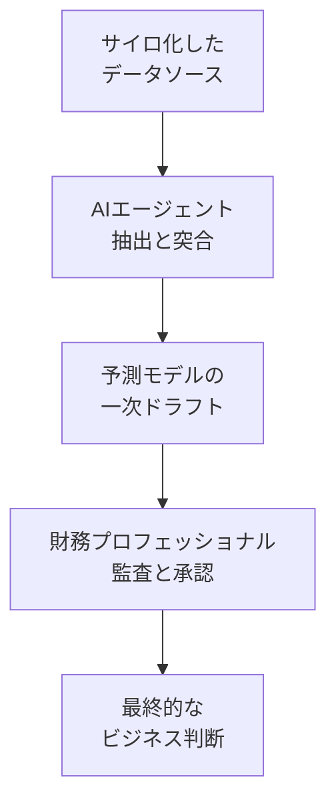

OpenAI の CFO である Sarah Friar らが提唱する「AI ネイティブな財務機能 (AI-native finance function)」は、AI を個人の作業補助ではなく、予測・決算・内部統制を含む部門アーキテクチャの再設計として扱う構想です。

この記事では、その構想が目指す状態を整理したうえで、実務と監査の観点から確認できる限界を並べます。読み終えると、自社で財務領域に AI を入れるとき「どこを自動化してよく、どこを人が持ち続けるべきか」を判断する材料が手に入ります。

対象読者は、財務・経理部門への AI 導入を発注する側、あるいは統制設計に責任を持つ立場の方です。

*この記事の全体像。以下、順に解説します。*

## AI ネイティブ財務が目指す状態

構想の中核は、スプレッドシートと手作業の連鎖から離れ、AI エージェントを業務プロセスの中心に置くことです。具体的には次の 3 つが挙げられています。

| 要素 | 従来 | AI ネイティブ |
|---|---|---|
| 決算 (Zero-Day Close) | 月末に締めてから集計 | トランザクションをリアルタイム監視し、異常検知と自動照合を随時実行 |
| 予測 (Continuously Updated Forecasting) | 静的・カレンダーベースのモデル | CRM や外部市場データと連動し、シナリオを即座に修正 |
| 担当者の役割 | AI ツールの消費者 | 社内ハッカソン等を通じて自らツールを作る構築者 |

注目すべきは 3 つ目です。財務担当者が消費者から構築者へ移るという変化は、ツール導入の話ではなく人材要件と組織設計の話です。ここを外注で埋める前提を置くと、次に述べる統制の設計まで外部へ流出します。

価値の測り方も変わります。「作業が何時間短くなったか」ではなく「意思決定のサイクルタイムをどれだけ縮め、事業にどのインパクトを与えたか」を ROI 指標に読み替える、という主張です。

## 構造: 実行は AI、監督は人

この構想を成立させている前提は、実行と監督を明確に分離することです。

- 実行レイヤー: AI エージェントが情報を抽出・突合し、予測の一次ドラフトを作る
- 統制レイヤー: 人がその結果を監査し、最終判断を下す (Human-in-the-loop)

この二層構造は、後述する限界のほとんどに対する唯一の緩和策でもあります。逆に言えば、統制レイヤーを薄くした瞬間に構想全体が崩れます。

## 理想を止める 4 つの壁

調査の過程で、実務および監査の観点から次の 4 点が確認できました。いずれも「AI の性能が上がれば解ける」種類の問題ではありません。

### 壁 1: 決定論的な会計と確率論的な AI

財務・会計は 1 円の誤差も許されない決定論的な領域です。一方 LLM は本質的に確率論的なモデルであり、情報が不足したときに存在しない数値を生成する幻覚 (hallucination) のリスクをゼロにできません。

Deloitte や PwC といったプロフェッショナルファームでも、生成 AI による実在しない判例や文献の引用事故が報告されています。動的予測モデルが幻覚に基づく見通しを出力すれば、経営判断を致命的に誤らせます。

判断の指針は明確です。数値の一次生成を AI に任せる領域と、確定値を扱う領域を分けることです。

### 壁 2: SOX 法と内部統制 (ICFR) の監査証跡

AI エージェントが自律的に仕訳や突合を行うと、その推論過程がブラックボックス化します。SOX 法や監査法人が求める厳密な監査証跡 (Audit Trail) と再現性を担保できなくなる、いわゆる Shadow Preparation のリスクです。

さらに厄介なのは、人間側の劣化です。レビュアーが AI の出力を過信するオートメーション・バイアスに陥ると、財務報告の重大な欠陥 (Material Weakness) を見逃します。統制レイヤーを人が担う構造は、人が実際に疑う前提でしか機能しません。

導入前に確認すべきことは 2 つです。

1. エージェントの入力・中間出力・確定出力を、後から再現できる形で保全しているか
2. レビュー担当者が AI 出力を否認した実績を記録し、承認率が 100% に張り付いていないかを監視しているか

### 壁 3: Zero-Day Close を阻むデータ基盤

AI の処理が速くても、入力データ側に遅延や不整合があればリアルタイム決算は成立しません。レガシー ERP、部門ごとにサイロ化したデータ、手入力の残る連携という状態では、Garbage In, Garbage Out の原則がそのまま効きます。

実際のコストは AI ツールの導入費ではなく、全社的なデータクレンジングと API パイプライン整備 (Data Readiness) に集中します。ここを見積もらずに AI 導入の稟議を通すと、予算が消えたあとで基盤の話が出てきます。

### 壁 4: エージェントへの権限付与と情報漏洩

AI エージェントに社内データベースへのアクセス権限を与えると、そのエージェントがプロンプトインジェクションの標的になります。

2025 年 6 月に報告された Microsoft 365 Copilot の脆弱性 EchoLeak (CVE-2025-32711) は、ユーザーの操作を一切必要とせず (ゼロクリック)、機密データへアクセスして外部へ流出させ得るものでした。財務データを扱うシステムにとって、これは設計上考慮すべき既知の攻撃面です。

対策の方向は、エージェント自体を賢くすることではなく、権限と出口を絞ることです。

- アクセス権限を最小権限 (Least Privilege) に限定する
- 出力内容の外部送信をブロックし、通信を監視する
- エージェントが参照した外部コンテンツを信頼できない入力として扱う

## まだ答えの出ていない 2 つの問い

構想と現実の間には、まだ設計解が確立していない領域が残ります。

**認知的負荷の逆説。** AI の算出ロジックが複雑になるほど、人間が行うファクトチェックと承認そのものが新しい重労働になります。作業時間を減らすはずの仕組みが、検証コストの形で負荷を戻してしまう構造です。どこまで検証すれば十分とするかの基準づくりが未解決です。

**監査対応 UI の設計。** 監査法人が AI の推論過程をたどり、納得できる水準の説明可能性 (Explainability) を備えたインターフェースは、まだ標準化されていません。ここが揃うまで、監査対応の負荷は導入企業側に残ります。

## 発注側の判断: どこから設計するか

以上を踏まえると、着手順は次のようになります。AI ツールの選定は最後です。

1. **適用領域を切り分け、Human-in-the-loop を徹底する**
   予測モデリングや異常検知の一次スクリーニングには AI を積極的に使い、税務申告や法定開示など高い確実性が求められる領域では、人の専門家が証跡を検証・承認する工程を必須にします。
2. **データ基盤へ先行投資する**
   ツール導入に先立ち、レガシーシステムとサイロ化データの統合・クレンジング、および AI が正確に解釈できる API インフラの整備に投資します。
3. **セキュリティのガードレールを先に組む**
   EchoLeak のような間接的プロンプトインジェクションを前提に、最小権限と外部送信ブロックを含む監視体制を、エージェントへ権限を与える前に構築します。

この順序を守ると、仮に AI 側の性能が期待に届かなくても、投資したデータ基盤と統制設計は資産として残ります。逆順で進めた場合、残るのは監査で説明できない自動化だけです。

## まとめ

- AI ネイティブ財務の構想は、Zero-Day Close と動的予測を軸に、実行を AI、監督を人が担う二層構造を前提とする
- 確率論的な AI と決定論的な会計の衝突、SOX 法が求める監査証跡、データ基盤の未整備、エージェントへの権限付与という 4 つの壁は、モデル性能の向上では解けない
- EchoLeak (CVE-2025-32711) が示すとおり、権限を持つエージェントは新しい攻撃面になる。最小権限と外部送信の遮断を先に設計する
- 着手順はデータ基盤と統制設計が先で、ツール選定は最後。この順序だけが、AI の成否によらず資産を残す

この記事が少しでも参考になった、あるいは改善点などがあれば、ぜひリアクションやコメント、SNS でのシェアをいただけると励みになります！

## 参考リンク

- [Building an AI-native finance function (OpenAI)](https://openai.com/index/building-an-ai-native-finance-function)
- [CVE-2025-32711 (EchoLeak) レコード](https://www.cve.org/CVERecord?id=CVE-2025-32711)
