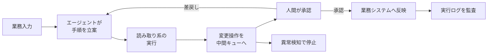

企業のAI導入について、「全社の何％が使っているか」を進捗として報告している組織は多いと思います。

一方でOpenAIは、企業のAI活用が個人向けチャットアシスタントの配布から、業務システムと連携して実際に処理を進める実行型ワークフローへ移っていると報告しています。そして上位層と一般層の差は、モデルの性能差ではなく、**権限をどこまで開けたか、業務手順をどれだけ共有物にしたか、その両方をどう統治しているか**の差として現れます。

この記事では次の3点を扱います。

- 上位企業と一般企業の差が、どの指標に現れているか
- その指標をそのままKPIにすると、なぜ危険なのか
- 発注側・経営側として、どこに権限境界を引き、何を測るべきか

対象読者は、AI導入の投資判断と体制設計に責任を持つ立場の方です。


*この記事の全体像。以下、順に解説します。*

## 何が変わったのか: 配布から実行へ

これまでのAI導入は、社員にチャットアシスタントを配ることが中心でした。使う・使わないは個人の裁量であり、成果も個人の中に閉じます。

実行型ワークフローでは、前提が変わります。

| 観点 | チャットアシスタント配布 | 実行型ワークフロー |
|---|---|---|
| 成果の単位 | 個人の作業 | 業務手順そのもの |
| 資産の所在 | 個人のプロンプト | 共有された手順とツール連携 |
| 失敗の影響 | 個人の手戻り | 業務システムへの副作用 |
| 必要な統制 | 利用ガイドライン | 権限境界と監査 |

つまり、AIが「答える」だけの間は運用コストが小さく、AIが「実行する」瞬間から統治の問題に変わります。上位企業が先に踏み込んでいるのはこの境界の内側です。

## 上位層と一般層の差は、どの指標に出ているか

OpenAIの報告では、上位10%の企業が一般的な企業の8.3倍の出力トークンを消費し、外部ツール連携や再利用可能な手順の利用率でも大きな差があるとされています。

現場で使われる評価軸も、次のように移っています。

- 全社に占めるアクティブユーザー割合
- → 再利用可能な業務フロー（Skill）の作成数
- → 権限設定済みの外部ツール連携数
- → 人間のレビューを経て完結したタスクの実行数

注目すべきは、後半の2つが**権限と承認を前提にした指標**である点です。「AIをどれだけ使ったか」ではなく、「AIにどこまで任せる設計ができているか」を数えています。

## その指標をKPIにすると壊れる理由

ここが判断の分かれ目です。上の指標をそのまま社内KPIに移植すると、高い確率で虚栄の指標になります。

### 出力トークンは活動量であって成果ではない

トークン消費量は、冗長な推論や無限ループでも増えます。エージェントが同じ確認を繰り返しているだけでも数字は伸びます。KPIにした瞬間、増やす動機が生まれ、指標は成果から切り離されます。

### Skill作成数は在庫であって稼働ではない

作られた手順が使われている保証はありません。作成数だけを追うと、誰も呼び出さない手順が積み上がり、後述する棚卸しコストだけが残ります。

### 削減時間は総額であって純額ではない

AIが作業時間を削っても、その出力を確認し修正する時間が新たに発生します。これを**信頼税**と呼びます。

```
純ROI = 削減された業務時間 − レビューと修正に要した時間（信頼税）
```

分子だけを報告して分母を報告しない状態が続くと、投資判断の根拠が失われます。測るべきは差分です。

## 完全自律が構造的に破綻する地点

「人間のレビューを外せば信頼税も消える」という発想は自然ですが、現行アーキテクチャでは成立しにくい構造があります。エラーの連鎖です。

各ステップの成功率が独立だと仮定すると、タスク全体の成功率はステップ数に対して指数的に落ちます。

| ステップ成功率 | 3ステップ | 5ステップ | 10ステップ |
|---|---|---|---|
| 95% | 85.7% | 77.4% | 59.9% |
| 90% | 72.9% | 59.0% | 34.9% |
| 85% | 61.4% | 44.4% | 19.7% |

ステップ成功率85%は、単発の応答としては十分に高く見えます。それでも10ステップ連鎖すると完了率は約19.7%まで落ちます。

ここから導ける設計上の判断は2つです。

1. **タスクを短く切る**。長い自律実行より、短い実行と確認の繰り返しの方が完了率が高い
2. **確認点を等間隔に置かない**。副作用が発生する直前にだけ人間を挟む



エージェントに直接の書き込み権限や決済権限を渡さず、変更操作をいったんキューに置く形です。承認を経たものだけがシステムに反映されます。

## 現場の反証: 事例が示しているもの

ベンダーの発信する成功事例は、データが整備された検証段階のものが多く、本番運用の条件とは異なります。実際に報じられている事象は、慎重な設計を支持します。

- **Klarna**: 過度な自動化の後に品質面の課題が生じ、人間のオペレーターを再配置する揺り戻しが報じられています
- **Air Canada**: チャットボットの誤案内をめぐり、企業側が責任を問われる判断が下されました
- **DPD**: 対話AIがガードレールを逸脱する挙動を起こし、機能停止に至りました
- **Gartnerの予測**: 2027年までに自律型AIプロジェクトの40%以上が、統治とコストの問題で中止または凍結されるとの見通しが示されています

いずれも、モデルの精度が足りなかったという話ではありません。**権限の範囲と、逸脱時に止める仕組みの設計が足りなかった**という話です。自律性を上げるほど、なぜその出力になったのかを後から説明できない監査不能性の問題も重くなります。

## 発注側が引くべき設計判断

以上を踏まえ、投資判断と体制設計の側で決めるべきことを3つに絞ります。

### 1. KPIを純ROIに置き換える

トークン消費量とSkill作成数をKPIから外します。代わりに、削減時間から信頼税を差し引いた純ROIを、業務フロー単位で追跡します。信頼税を測るには、レビューにかかった時間を記録する必要があります。ここを最初に配線しておかないと、後から遡って算出できません。

### 2. 実行権限と責任境界を切り離す

エージェントに直接の実行権限を持たせず、人間の承認を経てからシステムに反映する経路を標準の設計パターンにします。あわせて、想定外の挙動を検知したときにワークフロー全体を止める停止スイッチを用意します。

権限設計の判断基準は「操作が可逆かどうか」です。

| 操作の性質 | 例 | 権限の扱い |
|---|---|---|
| 可逆・影響が閉じる | 検索、要約、下書き生成 | エージェントに直接付与 |
| 可逆だが影響が広い | 社内共有ドキュメントの更新 | 事後監査つきで付与 |
| 不可逆 | 決済、外部送信、本番データ更新 | 承認を必須にする |

### 3. 共有ワークフローを棚卸しする

社内で作られた手順やプロンプトは放置すると陳腐化します。参照している業務ルールが変わっても、手順は変わらないためです。

- 呼び出し実績のない手順を定期的に廃止する
- 承認者が設定されていない連携を洗い出す
- 前提としている業務ルールの更新日と、手順の更新日を突き合わせる

「作った数」ではなく「生きている数」を管理対象にします。

## まだ答えの出ていない論点

正直に書くと、次の2点は現時点で判断材料が足りません。

- 上位10%の企業が消費している8.3倍の出力トークンが、信頼税を上回る純ROIにどこまで変換されているのか。活動量と財務指標を結びつけた公開データが不足しています
- 実行時間の長い複雑なタスクで、エラーの連鎖を断ち切るアーキテクチャ上の突破口がいつ現れるのか。ここが変われば、権限境界の引き方も変わります

したがって現時点の設計は、突破口が来ない前提で組み、来たときに承認点を減らせる構造にしておくのが合理的だと考えます。

## まとめ

- 企業のAI活用の差は、モデルの性能差ではなく、権限境界と共有ワークフローの統治の差として現れる
- 出力トークン量とSkill作成数は活動量であり、そのままKPIにすると虚栄の指標になる
- ステップ成功率85%でも10ステップで完了率は約19.7%まで落ちる。完全自律ではなく、副作用の直前に人間を挟む構造が現実解になる
- 測るべきは、削減時間から信頼税を差し引いた純ROI
- 権限は操作の可逆性で切り分け、不可逆な操作だけ承認を必須にする

この記事が少しでも参考になった、あるいは改善点などがあれば、ぜひリアクションやコメント、SNSでのシェアをいただけると励みになります！

## 参考リンク

- [How enterprises put AI to work（OpenAI）](https://openai.com/index/how-enterprises-put-ai-to-work)
- OWASP Agentic Security Initiative（エージェント特有の脅威分類。プロンプトインジェクション、ツール誤用）
- Gartner: 自律型AIプロジェクトの中止・凍結に関する予測（2027年まで）
