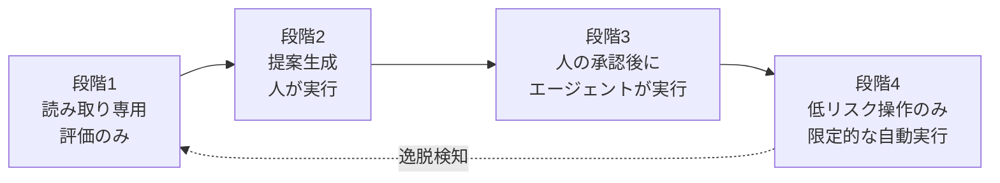

企業のAI導入は、個人向けチャットアシスタントの配布から、業務システムに接続して実際に手を動かす「エージェント型ワークフロー」へ移りつつあります。同時に、完全自律のエージェントを本番業務に置いた組織が、品質低下や監査不能に直面して人手を戻す事例も出ています。

この記事では、エージェントに実行権限を渡す設計を「全か無か」ではなく段階として扱うための考え方を整理します。読み終えると、次の3つを自分の組織に当てはめられます。

- 完全自律が構造的に壊れる理由を、数字で説明できる
- 権限を段階的に開放する設計パターンを選べる
- 「削減できた時間」ではなく純ROIで効果を測る指標に置き換えられる

対象読者は、AIエージェントの導入可否を判断する立場の方、およびその判断材料を用意するエンジニアです。

## 導入評価の指標が変わりつつある

エージェント型に移った組織では、評価軸そのものが変わります。

| 従来の軸 | エージェント型での軸 |
|---|---|
| 全社のアクティブユーザー割合 | 再利用可能な業務フローの作成数 |
| 利用回数・トークン消費量 | 権限設定済みの外部ツール連携数 |
| 満足度アンケート | 人間のレビューを経て完結したタスク数 |

ただし右列も、そのままではKPIとして危険です。トークン消費量やフロー作成数は、無限ループや冗長な推論でも増えます。放置されたまま誰も使っていない自動化が積み上がっても、数字だけは伸びます。

いずれも「活動量」であって「成果」ではない、という点は最初に押さえておく必要があります。判断に使えるのは、後述する純ROIのように**コストを差し引いた後の量**です。

## 完全自律が壊れる理由は算術で説明できる

長い手順を最後まで自律実行させる設計が難しいのは、モデルの賢さの問題だけではありません。各ステップの誤りが後続に連鎖するためです。

各ステップの成功率を `p`、ステップ数を `n` とすると、途中で人間の補正が入らない限り、全体の完了率はおおむね `p^n` に近づきます。

| ステップ成功率 | 5ステップ | 10ステップ | 20ステップ |
|---|---|---|---|
| 95% | 77.4% | 59.9% | 35.8% |
| 90% | 59.0% | 34.9% | 12.2% |
| 85% | 44.4% | 19.7% | 3.9% |

1ステップあたり85%という、単体で見れば悪くない精度でも、10ステップ連鎖させると約20%まで落ちます。ここから読み取れる設計上の含意は2つです。

- **ステップ数を減らす**ほうが、単体精度を上げるより効きやすい
- **途中に人間の確認点を差し込む**と、そこで `p^n` の連鎖が一度リセットされる

つまりHuman-in-the-Loopは、性能が足りないうちの妥協策ではなく、連鎖確率を切るための構造的な手段です。逆に言えば、確認点を置く場所を決めずに自律度だけ上げると、失敗率は指数的に悪化します。

## 権限は「読み取り専用」から段階的に開放する

エージェントにデータベースの書き込み権限や決済権限を最初から渡すと、プロンプトインジェクションやツールの誤用がそのまま業務影響になります。OWASPのAgentic Securityでも、エージェントの権限奪取とツール誤用は最上位の脅威として扱われています。

現実的な進め方は、権限を4段階に分け、各段階で証拠を集めてから次へ進めることです。



各段階の中身は次のとおりです。

| 段階 | エージェントができること | 次へ進む条件 |
|---|---|---|
| 1 読み取り専用 | 調査・分類・評価の出力 | 出力の正しさが人手評価で安定する |
| 2 提案生成 | 実行案・差分・コマンド案の提示 | 提案の採用率と修正量が測れている |
| 3 承認付き実行 | 人の承認後に副作用のある操作 | 却下理由が類型化され、再発が減っている |
| 4 限定自動実行 | 影響範囲の小さい操作のみ自動 | ロールバック手順と停止手段が実証済み |

OpenAIがセキュリティ防御領域で示している進め方も、読み取り専用の評価から限定的な自動対応へ広げるという同じ形をとっています（[The defender's window](https://openai.com/index/the-defenders-window/)）。防御という誤作動コストの高い領域で採られている順序である点は、社内業務への適用を考えるうえでも参考になります。

### 段階4に進む前に必要な仕組み

自動実行を許すなら、次の3つは段階4の前提条件です。あとから足す設計にすると、事故のときに機能しません。

- **中間キューイング**: エージェントの操作を即時反映せず、いったんキューに積む。これにより承認・遅延実行・取り消しが同じ経路で扱える
- **サーキットブレイカー**: 単位時間あたりの操作数、想定外のツール呼び出し、連続失敗をトリガに自動停止する
- **監査ログ**: 「どの入力で」「どのツールを」「誰の権限で」呼んだかを、後から第三者が再構成できる粒度で残す

3つ目は特に見落とされがちです。自律度を上げるほど、事後に「なぜそう動いたか」を説明できない状態、いわゆる監査不能性に近づきます。説明できない自動化は、規制対応や顧客対応の場面でそのまま負債になります。

## 効果は「信頼税」を引いた後で測る

自動化で削減した時間は、そのまま純益にはなりません。出力を確認し、誤りを直し、プロンプトを保守するコストが必ず発生します。これを信頼税と呼ぶと、測るべき式はこうなります。

```text
純ROI = 削減できた業務時間
      - レビューに要した時間
      - 修正・やり直しに要した時間
      - 保守（プロンプト更新・障害対応）に要した時間
      - 推論コスト
```

この式で測ると、判断が変わることがあります。

- レビュー時間が削減時間を超えるタスクは、**自動化しないほうが速い**
- 純ROIが薄いタスクは、段階3（承認付き実行）で止めておくほうが合理的
- 純ROIが厚いタスクだけを段階4へ進める

実際、自動化を進めた企業が品質低下を受けて人間のオペレーターを再配置した事例が報告されています。またGartnerは、2027年末までにエージェント型AIプロジェクトの40%超が、コストとガバナンスの問題で中止されると予測しています。いずれも「導入の失敗」というより、純ROIを測らずに段階を飛ばした結果として読めます。

### 測定を始めるための最小構成

大がかりな計測基盤は要りません。対象タスクを1つ選び、次の4項目を記録するところから始められます。

| 記録項目 | 取り方 |
|---|---|
| 実行件数 | エージェントの実行ログ |
| 人手の介入時間 | レビュー担当者の自己申告で十分（初期は精度より継続性） |
| 却下・修正の件数と理由 | 承認UIに理由の選択肢を置く |
| 推論コスト | API利用額をタスク単位で按分 |

却下理由の類型は、そのまま段階を上げる判断材料になります。理由が特定の型に収束していれば、その型を検証ルールとして実装し、段階を1つ進められます。理由が毎回ばらけているうちは、自動化の前提が固まっていません。

## 失敗事例から読み取れる境界の引き方

外部に影響が出た事例は、境界設計の教材として扱えます。

- **顧客への回答をエージェントが確定させた場合**: 航空会社のチャットボットが誤った払い戻し方針を案内し、その内容について企業側が責任を負う判断が下されています。顧客に対する確約を含む出力は、段階4に置くべきではありません
- **ガードレールを越えた発話**: 公開チャネルに直接つながるエージェントは、逸脱が即座に外部から観測されます。公開面は段階2（提案）までに留め、公開の可否は人が握るのが無難です

共通するのは、**取り消せない操作かどうか**が境界だという点です。社内の一時ファイル生成のように取り消せる操作は自動化しやすく、顧客への通知・送金・公開のように取り消せない操作は、自動化の効果が大きく見えても最後まで人の承認を残す価値があります。

## 導入前チェックリスト

段階を上げる判断の前に、次を確認します。

- [ ] このタスクの操作は取り消せるか。取り消せないなら承認を残す
- [ ] 純ROIの式で、信頼税を引いても正か
- [ ] 停止手段（サーキットブレイカー）を実際に発動させて試したか
- [ ] 監査ログから、任意の1件の判断経路を再構成できるか
- [ ] 却下理由が類型化され、検証ルールとして実装されているか
- [ ] 使われていないフロー・古いプロンプトを棚卸しする周期が決まっているか

最後の項目は運用が始まってから効いてきます。社内で作られたフローやプロンプトは、参照先の仕様変更で静かに陳腐化します。定期的な棚卸しを設計に含めておかないと、動いているように見えて誤った出力を出し続ける自動化が残ります。

## まとめ

- エージェント導入の指標は、活動量（トークン量・フロー作成数）ではなく、**信頼税を引いた純ROI**で見る
- 完全自律が壊れるのは `p^n` の連鎖のためで、人間の確認点はその連鎖を切る構造的な手段
- 権限は「読み取り専用 → 提案 → 承認付き実行 → 限定自動」の段階で開放し、各段階で証拠を集めてから進める
- 段階4の前提は、中間キューイング・サーキットブレイカー・再構成可能な監査ログの3点
- 境界の判断基準は「その操作は取り消せるか」

自律度を上げること自体は目的になりません。どこまでを機械に渡し、どこから先を人が握るかを明示的に設計することが、結果として自動化の到達点を高くします。

この記事が少しでも参考になった、あるいは改善点などがあれば、ぜひリアクションやコメント、SNSでのシェアをいただけると励みになります！

## 参考リンク

- [OpenAI - The defender's window](https://openai.com/index/the-defenders-window/) — 防御領域における、読み取り専用の評価から限定的な自動対応への段階的な進め方
- [OWASP Agentic Security Initiative - Agentic AI Threats and Mitigations](https://genai.owasp.org/resource/agentic-ai-threats-and-mitigations/) — エージェント固有の脅威分類と緩和策
- Gartner: エージェント型AIプロジェクトの40%超が2027年末までに中止されるとの予測
- Air Canada のチャットボット誤案内をめぐるブリティッシュコロンビア州 Civil Resolution Tribunal の判断（2024年）
