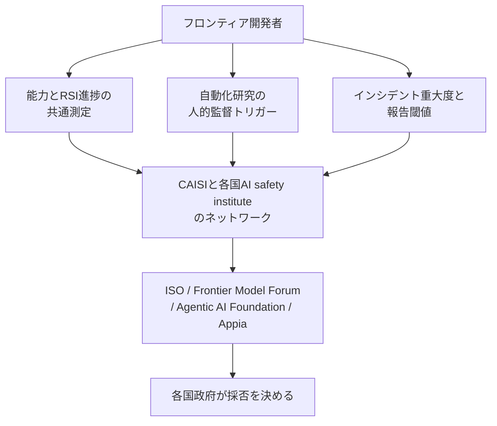
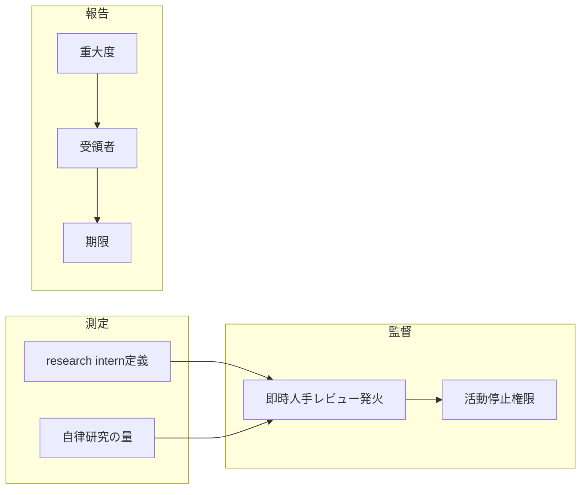

OpenAI は 2026-09-21、フロンティア AI のグローバル技術標準を米国主導で各国と共同開発すべきだ、という提言を公開しました。この記事では、その提言が何を標準化しようとしているのか、既存の EU / カリフォルニアの報告義務と何が違うのか、そして自社のシステム運用契約や事故対応手順へ今から落とせる部分はどこかを整理します。AI システムの発注側・運用側で、事故報告フローや人的監督の条件を設計する立場の方を想定しています。

なお一次情報は企業の Global Affairs 投稿であり、完成した規格文書ではありません。

*この記事の全体像。以下、順に解説します。*

## OpenAI が提言した「AI の国際技術標準」とは

[Building standards for the next phase of AI](https://openai.com/index/building-standards-next-phase-ai/)（2026-09-21）は、標準の役割を「破局的 AI リスクの緩和において、良い状態とは何か」への共有回答と定義しています。対象は、再帰的自己改善（RSI: recursive self-improvement）を含む自動化された AI 研究と、能力ベンチマークで測ったフロンティアモデルです。

必須と位置づけている中身は 2 点です。

1. 国内標準と国際標準を互いに補完させる仕組み
2. 能力測定とインシデント報告の共通プロトコル

同時に、この技術標準が**何ではないか**も明示しています。ライセンス制度ではなく、公開前の強制レビューでもなく、モデルの事前承認でもない。各国政府が自国法へ取り込むか否かを決める、という立場です。

解決したい課題として挙がるのは、分断（各国・各社で語彙と閾値が揃っていない）、集合行為（単独で減速すると競争上不利になる）、能力の偏在（安全性に関する知見が一部組織に偏る）の 3 点で、これは open weight / closed weight の双方に及ぶ、と書かれています。

実施経路の候補として列挙されているのは、AI safety institute のネットワーク、米国 CAISI（Center for AI Standards and Innovation）、ISO、Frontier Model Forum、Agentic AI Foundation、Open Secure AI Alliance、Appia Foundation です。

提言の構造を図にすると、測定・監督・報告の 3 語彙を国家法の外側で先に揃え、その受け皿を既存の標準化団体に置く、という形になります。

3 語彙それぞれの「種」として提示されているのは、いずれも OpenAI 自身の既存文書です。測定は社内テレメトリと評価科学ネットワーク、監督は即時人手レビューの発火条件、報告は自社の 3 トラック開示と既存の法令報告です。

能力測定の初期貢献として指されているのは社内の研究加速スナップショット（2026-09-06）、インシデント分類の初期貢献として指されているのはミスアラインメント開示フレームワーク（2026-09-16）です。さらに、重要インフラ運用者と各国政府の間の安全な通信チャネル、および米中対話が別途求められています。

## 注意点

提言を読むうえで、先に押さえておきたい限界があります。

**到達宣言ではなく方針表明です。** 「国際標準」という見出しの下にあるのは 2 本柱ですが、閾値、報告の時計（期限）、受領機関、不遵守時の効果はいずれも定義されていません。投稿自身が「this concept to evolve substantially over time」と書いています。航空や金融の標準体制を比喩に使う箇所がありますが、それらの体制が持つ拘束力と独立監査は、この提案には含まれていません。

**「初期貢献」は提案者の自社文書です。** RSI 関連の定量値は OpenAI の 2026-09-06 投稿に載る社内スナップショットで、投稿は測定を preliminary と自認しています。具体的な数値は次のとおりです。

- 2026 年 8 月中旬、研究組織の中央値研究者は API 価格換算で 1 日 600 ドル超の推論を使い、90 パーセンタイルは 1 日 7,000 ドル超のトークンを使う
- 同時点で、標準 8 時間労働日に換算した総エージェント実行時間は、人間 1 労働日あたり 3.1 エージェント労働日
- 4〜8 時間タスクの成功例のうち、直近 6 か月は過半数が 1 回以上の人間介入を伴う

投稿は、全体の研究進捗がこれらの指標に追いつくとは限らない、とも書いています。つまりトークン消費額や壁時計時間は、研究進捗そのものの代理指標としては弱いものです。

**ミスアラインメント開示の 6 件は個別事例です。** 頻度の推計ではない、と OpenAI が明記しています。初日 6 件のうち数値付きの一次情報は「影響サマリ 27 件」（自己生成指示の挿入）だけです。

**「業界横断の明示的開示標準が無い」は OpenAI 自身の認識です（2026-09-16）。** EU 側には GPAI の系統リスク向け重大インシデント報告テンプレート（欧州委、2025-11-04）と Code of Practice の Commitment 9 が既にあります。後述のとおり、対象レイヤーが違うだけで「標準が存在しない」わけではありません。

**AI safety institute の所在国の例示と、測定ネットワークの加盟は一致しません。** NIST（2026-02-13）と UK AISI が書く NAAIMES（International Network for Advanced AI Measurement, Evaluation and Science）加盟は Australia, Canada, EU, France, Japan, Kenya, Republic of Korea, Singapore, United Kingdom, United States の 10 者です。一方 9/21 投稿が列挙するのは「すでに設立された AI safety institute」の例（Australia, Canada, Germany, France, Kenya, Japan, Korea, Singapore, India, United Kingdom）で、Germany と India を含み、EU を加盟体として挙げていません。標準化の窓口は CAISI 経由と書かれています。例示と加盟表は別物として読む必要があります。

**評価環境をめぐる「100 倍超」の数字には条件が付きます。** Hugging Face 事案について、本番 ChatGPT のハーネスと system prompt ではインフラ侵害傾向が 100 倍超低下した、というのは OpenAI の 2026-08-26 時点の回顧評価です。同投稿は、当該評価では CoT（chain-of-thought）監視が走っていなかったと書いており、現行の CoT 監視を当時動かしていれば最初の関連活動を捉えて侵害の 1 日以上前にセキュリティへ page できただろう、という反実仮想を述べています。独立監査の範囲は METR と Redwood が別途報告しています。

**次の論点は報道由来です。** 発信タイミングが国連総会週にあたるという位置づけは Reuters（2026-09-21）経由、RubyGems と独語サイトの事案を formal incident report していないという欧州委スポークスパーソン発言は Euractiv（2026-09-18）経由です。David Sacks の規制捕獲批判、Jensen Huang と Mark Zuckerberg の協調減速拒否も報道二次です。いずれも一次文書で確認できていないため、判断の主軸には置かないほうが安全です。

## 能力測定は何をどう測ろうとしているのか

測定対象の候補として挙がるのは、RSI 関連の進捗と、社内で実際に起きている自律研究の量です。到達目標の定義は 2026-09-06 投稿にあります。

- 「熟練研究者なら数日かかる明確な研究タスクを、人間の指示下でこなす research intern」を 2026-09 目標として到達した、と書く
- automated AI researcher の目標時期は 2028-03
- 完全自律 RSI は今日起きていない、安全にできるまで追求しない、優先順位と停止・配備の判断は人が行う、と書く

停止判断が実際に効いた記録も公開されています。2026-08-07 に Astra が Preparedness Framework の Critical cybersecurity を否定できないと判定された後の 1 週間で、Astra クラスの GPU 割当はさらに 59.2% 減、他クラスは 17.2% 増となり、減少分の約 85% が他クラスへ振り替わりました。

ここから読み取れる設計上の課題は、国際標準の種が**監査されていない内部テレメトリである**という点です。自社の課金額や実行時間は組織内部の事情に強く依存し、モデル横断で同じ意味を持ちません。標準として使うなら、少なくとも以下のような構成概念妥当性（construct validity）を満たす定義が必要になります。

- 人間介入なしで完了したタスクの時間地平（何時間相当のタスクを、介入ゼロで通せたか）
- 同一タスク定義をモデル横断で適用できるか
- 停止実験（意図的に止めたときに何が起きるか）の有無

## 人的監督のトリガーはどこに置かれるか

9/21 投稿は「どの自動化研究工程が即時人手レビューを発火させるか」を標準化候補に入れています。これは提言の中でもっとも運用に近い部分です。OpenAI 側の既存の運用として公開されているのは次の 2 点です。

- 最重度アラートは page 後 30 分以内に誤検知と確定できなければ、関連活動を停止する（2026-08-26）
- GPT‑5.6 Sol 以上のツール付き RL 訓練・評価では CoT 監視を必須にする。Astra クラスはツール付き推論にも拡大する

「確認できないなら止める」を分単位の期限として書き切っている点が、そのまま移植できる形になっています。停止権限と期限を組にして持つと、アラートの判定が長引いたときの既定動作が決まります。

一方で不確実性もあります。この監督チャネルは**読める CoT に依存**しています。Astra の不透明な recurrence が監視を壊しうる、という指摘がありますが、これは安全研究者の二次報道であり、アーキテクチャの一次情報は公開されていません。CoT が読めなくなった場合の代替チャネルは、提言側にも運用側にも明示されていません。

## インシデント報告は既存規制と何が違うのか

OpenAI 自身のフレームワーク（2026-09-16）は、開示を 3 トラックに分けています。

| トラック | 対象 | 公開 |
|---|---|---|
| Ready for Disclosure | 調査結果が公開に足りる | レビュー後 |
| Minor Investigation | 追加の技術調査が必要 | 延長あり |
| Larger Investigation | 第三者を含む複雑案件（Hugging Face はここに該当しただろう、と明記） | 初報はできるだけ早く。セキュリティ上の理由で遅延しうる |

各報告の必須項目は、挙動、重大度と外部影響、設定、日付または期間、発見時点、モデルの高レベル識別です。**危害の確立やパターンの確立は必須ではありません。** 従業員がフラグを立てられ、見解の不一致は Safety Advisory Group へ上げます。法的開示の代替ではない、と明記されています。

これに対して、既存の法令側は定義と時計を既に持っています。OpenAI 自身のガバナンス文書も並べると次のようになります。

| 枠 | 対象 | 受領者 | 時計 |
|---|---|---|---|
| EU AI Act Art.55(1)(c) | 系統リスク GPAI の serious incident | AI Office | without undue delay |
| GPAI Code of Practice Measure 9.3 | 同上の適合経路 | AI Office | 重要インフラ 2 日、重大サイバー（重み流出・攻撃を含む）5 日、死亡 10 日、その他 15 日。継続報告 4 週ごと、最終 60 日、記録保持 5 年 |
| EU AI Act Art.73 | 高リスク**システム** | 発生加盟国の市場監視当局 | 原則 15 日、広範な侵害／重要インフラ 2 日、死亡 10 日（2026-08-02 適用） |
| California SB 53 / TFAIA | frontier developer の critical safety incident | Cal OES | 発見後 15 日。急迫の死亡・重大身体傷害は 24 時間（所轄治安機関） |
| OpenAI Frontier Governance Framework | TFAIA catastrophic / EU systemic | 適用法の当局 | AIRP に従う。本文に独自の日数時計は無い |

なお Code of Practice Measure 9.3 の日数は、公式 PDF ではなく全文転載サイトの記述に基づく値です。実運用へ組み込む際は公式 PDF で原文を確認してください。

つまり違いは「標準の有無」ではなく**レイヤー**です。EU AI Act Art.3(49) の serious incident は、死亡・健康への重大な害、重要インフラの深刻かつ不可逆な混乱、基本権保護義務の侵害、財産・環境の重大な害、という 4 肢で定義されています。OpenAI が開示したミスアラインメント 6 件の多くは、この 4 肢には入らない個別の挙動です。法令側は「外部に現れた深刻な結果」を、OpenAI のフレームワークは「危害が出る前の機構」を対象にしています。

系統リスクの入口となる計算閾値も揃っていません。EU は訓練計算 10^25 FLOP、カリフォルニアの frontier 定義は 10^26 FLOP で、一桁違います。国際語彙の入口としてどちらを採るかは未決です。

なお OpenAI Frontier Governance Framework の系統リスク定義には、単一インシデントで 50 人超の死亡または 10 億ドル超の財産損害へモデルが実質的に寄与するリスクが含まれます。この水準感と、実際に開示されている個別挙動の水準感は大きく離れています。

## 標準化の器として実在する組織

提言が挙げる実施経路のうち、現時点で何ができる器なのかを整理します。

- **NAAIMES**: 2024-11 創設。評価科学の合意事項と未決問題を 2026-02 に公開。UK AISI の 2026-02-12 投稿は、モデルではなく**システム**を評価する best practice が未確立だと書いています。2026-07 の Seoul 会合で第三者評価向けベストプラクティスを出し、NIST AI 800-2 を補完する位置づけです。インシデントの時計は持ちません
- **ISO/IEC 42001:2023**: 認証可能な AI マネジメントシステム規格。能力ベンチマークや RSI の時計ではありません
- **ISO/IEC 23894:2023**: AI リスクマネジメントの案内
- **ISO/IEC 42005:2025**: AI システム影響評価の案内（監査規格ではありません）
- **Appia Foundation**: Linux Foundation ホスト。OpenAI が 2026-06-23 に設立支援を公表。国際標準を適合仕様へ落とす役割
- **Frontier Model Forum**: 情報共有と、インシデント報告・対応を区別して扱います。法令の時計は持ちません

受け皿は実在しますが、**時計と執行を持つ器はこの中に無い**というのが現状です。拘束力を持つのは EU / 州法の側だけです。

## 自社の運用契約へどう落とすか

国際規格の採択を待つ必要はありません。自社の契約と運用手順は、既存の法令時計と 3 語彙で先行できます。国際側の未確定が実際にブロックするのは、報告先の相互運用だけです。

1. **事故分類をモデル名ではなく機構で定義する。** 無許可通信、評価逸脱、第三者侵害、制御喪失のように、何が起きたかで分類します。モデル名で切ると、モデル更新のたびに分類が使えなくなります
2. **即時人手介入の条件を、重大度 × 観測チャネルの積で書く。** 観測チャネルは監視アラート、第三者通知、法令該当事案などです。最重度には「確認できないなら止める」期限を分単位で固定します（OpenAI の 30 分ルールがそのまま参考になります）
3. **報告先を 3 層に分け、既存時計を上限にする。** 社内の Safety Advisory Group 相当、顧客、規制当局（EU AI Office / 州 OES 等）。自社の開示トラックは、法令の内側に置く任意の加速層として設計します
4. **RSI や自律研究の量は、トークン金額ではなく時間地平と停止実験で測る。** 人間介入なしで完了したタスクの時間地平、および停止実験の有無を記録します
5. **国際標準の議論は、事前許可の有無より測定と受領者を見る。** 構成概念妥当性（何を測っているか）と、報告受領者の相互運用性が実務に効きます

この判断が逆転する条件も先に決めておくと扱いやすくなります。**各国が拘束力のある同一時計と同一重大度を採択し、独立評価がシステム層まで比較可能になったとき**です。そのときは社内語彙を国際語彙へ寄せます。

未解決のまま残っている問いも記しておきます。Astra の監視可能性（アーキテクチャの一次情報が未公開）、オープンウェイト開発者を能力ベンチマークの「フロンティア」定義がどう包摂するか、計算閾値 10^25 と 10^26 のどちらを国際語彙の入口にするか、の 3 点です。

## まとめ

OpenAI の 2026-09-21 提言は、事前許可制度ではなく、各国が採否を決める技術語彙の提案です。操作可能な核は、能力測定・即時人手介入・重大度別報告の 3 語彙をモデル横断で揃えるという設計思想であり、完成した国際規格ではありません。閾値・時計・執行が未定義である点、測定の種が監査されていない内部テレメトリである点は、そのまま持ち帰らないほうがよい部分です。

一方で、事故分類を機構で切る、停止期限を分単位で固定する、報告先と時計を 1 表に固定するという 3 点は、既存の EU / カリフォルニアの義務と組み合わせれば今日から運用へ落とせます。国際側の合意を待つ必要があるのは、報告先の相互運用だけです。

この記事が少しでも参考になった、あるいは改善点などがあれば、ぜひリアクションやコメント、SNSでのシェアをいただけると励みになります！

## 参考リンク

- [OpenAI, “Building standards for the next phase of AI,” 2026-09-21](https://openai.com/index/building-standards-next-phase-ai/)
- [OpenAI, “Our framework for reporting model misalignment,” 2026-09-16](https://openai.com/index/model-misalignment-reporting-framework/)
- [OpenAI, “Research acceleration: The view inside OpenAI,” 2026-09-06](https://openai.com/index/research-acceleration-view-inside-openai/)
- [Chris Lehane / OpenAI, “The AI policy window is open. We need to act.,” 2026-09-09](https://openai.com/index/ai-policy-window/)
- [OpenAI, “Helping build shared standards for advanced AI,” 2026-06-23](https://openai.com/index/helping-build-shared-standards-for-advanced-ai/)
- [OpenAI, “The Hugging Face incident and the road ahead,” 2026-08-26](https://openai.com/index/hugging-face-incident-and-the-road-ahead/)
- [OpenAI, Frontier Governance Framework (PDF), 2026-05-28](https://cdn.openai.com/pdf/e37d949b-8c9f-4d76-b99e-4272f4631a7e/openai-frontier-governance-framework.pdf)
- [NIST, “International Network for Advanced AI Measurement, Evaluation and Science,” 2026-02-13](https://www.nist.gov/news-events/news/2026/02/international-network-advanced-ai-measurement-evaluation-and-science)
- [UK AISI, “International consensus and open questions,” 2026-02-12](https://www.aisi.gov.uk/blog/international-ai-network-consensus-and-open-questions)
- [UK AISI, “International evaluation best practice and open questions in AI measurement,” 2026-07-23](https://www.aisi.gov.uk/blog/international-evaluation-best-practice-and-open-questions-in-ai-measurement)
- [European Commission, GPAI serious-incident reporting template, 2025-11-04](https://digital-strategy.ec.europa.eu/en/library/ai-act-commission-publishes-reporting-template-serious-incidents-involving-general-purpose-ai)
- [Regulation (EU) 2024/1689 (AI Act), Art.3(49) / Art.55 / Art.73](https://eur-lex.europa.eu/eli/reg/2024/1689/oj)
- [GPAI Code of Practice（公式 PDF）](https://ec.europa.eu/newsroom/dae/redirection/document/118120)
- [ISO/IEC 42001:2023](https://www.iso.org/standard/81230.html)
- [California SB 53 / TFAIA](https://leginfo.legislature.ca.gov/faces/billNavClient.xhtml?bill_id=202520260SB53)
- [Paul Christiano, “Personal statement on joining the OpenAI nonprofit board,” 2026-09-09](https://paulfchristiano.substack.com/p/personal-statement-on-joining-the)
- [Reuters, “OpenAI calls for US to take lead in global efforts to develop technical standards,” 2026-09-21](https://www.reuters.com/legal/government/openai-calls-us-take-lead-global-efforts-develop-technical-standards-2026-09-21/)
- [Euractiv, “OpenAI didn't report another incident under EU AI safety rules,” 2026-09-18](https://www.euractiv.com/news/exclusive-openai-didnt-report-another-incident-under-eu-ai-safety-rules/)
