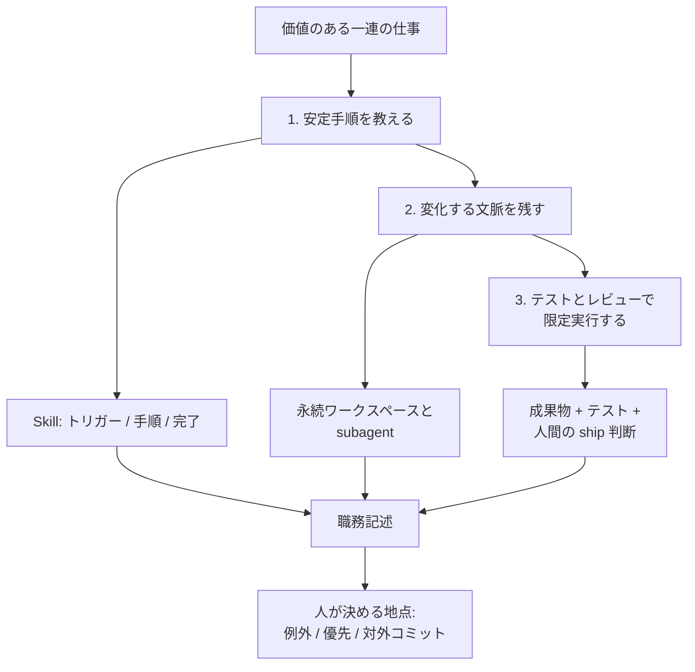
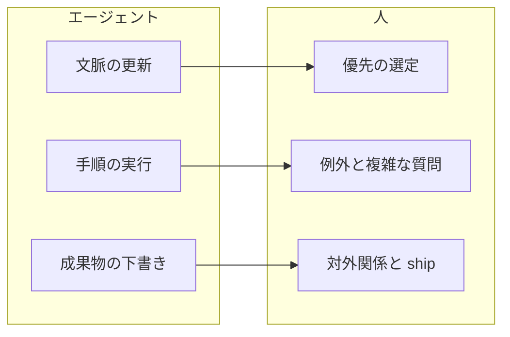

プロンプト集を配れば、業務エージェントは社内に定着する、と思いがちです。
OpenAIが2026年9月1日に公開したのは、その逆です。
[How AI-native companies turn workflows into operating capability](https://openai.com/index/ai-native-company-workflows/) は、Basis、Clay、Exa Labsの社内運用を、企業リーダーが借りられる設計パターンとして書いています。

借りる単位は、エージェントの**職務記述**です。
トリガー、完了条件、必要文脈、ツール、権限、完了までの持続、証拠、人間へ戻す地点を先に書きます。
空欄がある仕事は、まだ委譲しません。

成果も、出力量では測りません。
完了タスク、例外、レビュー負荷、サイクルタイム、品質、コスト、売上、リスクです。
3例はスタートアップの成功譚であり、一般企業の成功確率の証明ではありません。

*この記事の全体像。以下、順に解説します。*

## 何を借り、何を借りないか

3社の業務は会計、GTM、検索インフラとバラバラです。
それでも、エージェントに渡す仕事の単位は同じ形になります。

成熟は3段です。
Basisは安定プロセスをSkillにします。
Clayはアカウント単位の永続文脈を保ちます。
Exaは機会を、テスト付き成果物まで運びます。

OpenAI Helpの語彙も、記事と揃っています。
**Skill**は、特定ワークフロー向けの再利用可能な指示と資源です。
**Plugin**は、Skillと接続アプリを含め得るインストール可能な配布単位です。
SkillのみのPluginもあります。
実行面は、質問と短い協働のChat、多段の知識仕事と完成物のWork、ソフトウェア開発と技術作業のCodexに分かれます。

借りないものもあります。
Frontier企業がtypical企業の8.3倍、という数字を成熟の証拠にしないことです。
定義は、月次のoutput tokens per active userの上位10%対45〜55パーセンタイルです。
公式自身が、短い応答が高価値なことも、長い応答の付加価値が小さいこともある、と書いています。

## 3社が実際に委譲している仕事

| 軸 | Basis | Clay | Exa Labs |
|---|---|---|---|
| 会社 | 会計事務所向けAIエージェント。[getbasis.ai](https://www.getbasis.ai/) | GTMのデータ基盤とAccount Agents。[clay.com/about](https://www.clay.com/about) | エージェント向けweb検索インフラ。[exa.ai](https://exa.ai/) |
| 対象業務 | 社員Day-1オンボーディング | 散在する案件文脈の維持と優先アクション | 開発者エコシステムへの統合 |
| 成熟段 | Skill化 | 永続文脈 | テスト付き限定実行 |
| エージェントがやること | Codexが歓迎、概念説明、統合セットアップをバックグラウンド実行 | アカウント毎subagentが一次ソースを夜間更新。調整エージェントが朝の優先リストを作る | 統合機会の監視、文脈収集、PR作成、テスト実行、週次更新と告知下書き |
| 人が残すこと | 例外と複雑な質問。HRがSkillを次コホート前に更新 | 行動時点の判断。推奨の横に一次ソースを置く | どの機会が重要か、どのコミットをするか、対外関係 |
| 公開KPI | 初日30分（従来2時間）。自己報告 | 夜間の受信仕分けが約1時間減。自己報告 | 定量KPIなし |
| 独立確認 | 会社定義は一次と一致。30分は未確認 | アカウント別persistent subagentの型は[GTM Strategist 2026-07-24](https://knowledge.gtmstrategist.com/p/10-ways-clays-gtm-engineers-use-ai)で先行公開。1時間は未確認 | Codex/ChatGPT pluginは[2026-08-20公式](https://exa.ai/docs/integrations/chatgpt-codex)。社内の監視から自動PRは未確認 |

記事のまとめ文は、次の3文です。

> Basis turns a proven process into a reusable skill. Clay gives an agent the context and persistence to keep an evolving body of work current. Exa adds tools, tests, and review so an agent can carry a signal into bounded execution.

改善は、ワークフローの一部として設計されています。
オンボーディング例外はSkillの修正点になります。
案件の新情報と売り手の検証が文脈を更新します。
テスト結果と人間レビューが、次ランの境界を鋭くします。

人とエージェントの境界も、3社で共通です。

エージェントは手順を実行し、文脈を更新し、成果物を下書きします。
人は優先を選び、例外と複雑な質問を扱い、対外関係とshipを残します。
この線を職務記述に書かないと、レビューは後付けの感想になります。

## 職務記述に先に埋める項目

記事のsix stepsから、現場で埋める項目だけを抜きます。

| 項目 | 記事の語 | 3社での例 |
|---|---|---|
| トリガー | what triggers the work | Day-1。夜間バッチ。高優先の統合シグナル |
| 完了条件 | the outcome / definition of “done” | 統合セットアップ完了。朝の優先リスト。テスト済みPRと週次更新 |
| 必要文脈 | required context | 会社固有Skill。CRM、メール、Slack、通話、社内会話。リポジトリとSlack、Notion |
| ツール | tools | Codexとコンピュータ操作。アカウント別subagent。Codexとテスト |
| 権限 | permissions | 既存アカウント権限に従う（Clay）。仕事が重くなるほど権限設計の比重が増す（Exa） |
| 持続 | how persistently the agent should work toward completion | 一度のオンボーディング。夜間更新と朝の集約。監視から成果物まで |
| 証拠 | what evidence it must produce | 推奨の横に一次ソース。テスト結果。下書き告知 |
| 人間へ戻す地点 | where it must stop for human review | 例外。行動前。ship前と対外コミット |

人間側の役割も、記事は分けています。
成果の責任者、ドメイン論理、アクセスと統制、採用、日常利用です。
スタートアップは少数に圧縮します。
大企業は意思決定権を明示する必要がある、と記事自身が書いています。

実験の再利用先は、プロンプトではありません。
Skill、Plugin、共有ワークスペースです。

空欄がある仕事は、まだ委譲しません。
完了条件が検証できないなら、Chatに留め、WorkやCodexへ上げません。

## 測るものと、主指標にしないもの

記事は、出力量とワークフロー成果を分けています。

| 層 | 測るもの | 記事の語 |
|---|---|---|
| 深さ | 完了タスク、接続した文脈とツール、例外、レビュー負荷 | completed tasks, connected context and tools, exceptions, review load |
| 価値 | サイクルタイム、品質、コスト、売上、リスク | cycle time, quality, cost, revenue, or risk |
| 代理（主指標にしない） | 出力トークン、メッセージ数 | Output volume can show that people are asking AI to do more; workflow outcomes show whether it matters |

「完了タスク単価」という語は記事にありません。
costとcompleted tasksを組み合わせた解釈です。
例外件数とレビュー負荷は深さの公式語彙に入ります。
サイクルタイムは価値の公式語彙に入ります。

関連する一次数値は、[Enterprise Signals](https://openai.com/signals/enterprise-data/)（Updated 2026-08-12）にあります。

- 2026年6月時点: CodexはCodexとChatGPTのoutput tokensの64%。frontierはtypicalの8.3倍（1月は2.6倍）
- 同ページの週次スナップショット: 週次アクティブのうちPlugin利用はfrontier 21%、typical 9%。Skillは19%対3%
- OpenAI内部: 本文は週次アクティブのPlugin利用95%。key takeawayはemployeesの95%。分母がページ内で揺れます
- 2月起点のCodex週次アクティブ倍率: legal 108倍、sales 41倍、recruiting 41倍、marketing 26倍、engineering 5倍。公式は倍率のみで、出発点の絶対数は非公開です

エージェントの長いタスクは計算を増やします。
トークン増は委譲の深さの代理にはなります。
例外削減や単価の代理にはなりません。

メッセージ量も同じです。
[How enterprises put AI to work](https://openai.com/index/how-enterprises-put-ai-to-work/) のブログは、採用6ヶ月後に早期キャリアが経営層より週13通多い、と書きます。
[ワーキングペーパー](https://cdn.openai.com/pdf/how-organizations-use-chatgpt.pdf)（Last Updated 2026-08-11）本文は、同一社内の平均アクティブユーザーより早期キャリアとtraineesが週に約8〜9通多い、managers / directors / executivesは少ない、と書きます。
これはexecutivesとの差分13ではありません。
論文自身も、メッセージ量は利用強度であり経済的重要性の完全な尺度ではない、と書いています。

## 存在証明であって、全社展開の保証ではない

3例は、業務エージェントを「安定手順のSkill」「永続文脈」「テストとレビュー付きの限定実行」として設計できることの存在証明です。
企業が借りるべきは職務記述と、出力量以外の指標セットです。
一般企業で同じ成熟に進める保証ではありません。

支持できる点は、一次資料と揃っていることです。
3社の会社定義は各社サイトと一致します。
Skill、Plugin、Chat、Work、Codexの語彙はHelp Centerと記事が一致します。
職務記述の項目と深さ、価値の指標はsix stepsに一次で列挙されています。
Clayのpersistent subagent型は、OpenAI記事より約5週前に関係者寄稿で公開されています。
完全な第三者監査ではありませんが、別媒体です。
ExaのCodex pluginは2026年8月20日に一次で存在します。

反証もあります。
記事は成功譚のみで、対照群も失敗例もありません。
[MIT NANDA, The GenAI Divide, July 2025](https://storage.ghost.io/c/44/95/449506ca-034e-480f-9725-fcde08ef1cc1/content/files/2025/09/The-GenAI-Divide-STATE-OF-AI-IN-BUSINESS-2025.pdf) は、300件超の公開案件レビューと52組織インタビュー等に基づきます。
Executive Summaryは、(a) 組織の95%がゼロリターン、(b) 統合パイロットのうち数百万ドル価値を取り出しているのは5%、大多数は測定可能なP&L影響なし、と分けて書きます。
著者見解であり、所属機関の公式見解ではありません。
NANDAの95%と5%は別文であり、OpenAI事例の定義とは揃っていません。

テスト付き実行は、コード領域に強いです。
Enterprise Signalsは、知識仕事は文脈が薄く指定が難しく検証基準が弱い、と書きます。
[MSR '26](https://dl.acm.org/doi/10.1145/3793302.3793579) はagent作成PR全33,596件を調べ、不採用600件（うち562分類）でreviewer abandonment 38%、duplicate 23%、CI/test failure 17%を報告します。
レビュー地点を書いても、レビュー資源がボトルネックになります。

夜間にCRM、メール、Slack、通話を読むpersistent agentは、読取り自体が個人データ処理になります。
EUでは、法的効果または同様に重大な影響を伴う完全自動決定（[GDPR第22条](https://eur-lex.europa.eu/legal-content/EN/TXT/?uri=CELEX:32016R0679)。契約、法令、明示同意の例外あり）と目的制限（第5条1項(b)）が制約になり得ます。
Clay例は行動前に人が判断する設計なので、第22条該当は別途評価が必要です。
規制下の顧客データ夜間処理は、法務確認がブロック条件になり得ます。

オンボーディングSkillの誤案内は、初日30分という自己報告KPI1件で相殺され得ます。
顧客向けチャットボットでは事業者が責任を負った例があります（Moffatt v. Air Canada, 2024 BCCRT 149。[二次の法律解説](https://www.americanbar.org/groups/business_law/resources/business-law-today/2024-february/bc-tribunal-confirms-companies-remain-liable-information-provided-ai-chatbot/)）。
Basis製品の誤案内事例は未確認です。

未解決の問いも残ります。
3社の例外件数、レビュー負荷、完了あたりコストの実測はありません。
Exa社内の自動PR成功率も公開されていません。
ClayのAccount Agents製品と、記事のCodex個人オペレーションが同一実装かどうかも、型が近い以上の確認はありません。

適用範囲は、存在証明と設計チェックリストに限ります。
第3段階（テスト付き実行）は、検証可能な成果物がある仕事に限ります。

## 発注側が先に書くものと、委譲を戻す条件

発注側として取るのは、プロンプト集ではなく運用資産です。

1. 価値のある一連の仕事を1つ選ぶ。繰り返しがあり、システム、ハンドオフ、統制、測定可能な賭け金が揃っているもの
2. 責任者、KPI、ベースライン、ガードレールを先に書く
3. エージェント職務記述を埋める。トリガー、完了、文脈、ツール、権限、持続、証拠、人間へ戻す地点
4. 指標は例外件数、レビュー負荷、サイクルタイム、完了あたりコスト（解釈）を主にする。トークンとメッセージ数は深さの補助にする
5. 成功したらSkill、Plugin、共有ワークスペースにパッケージする。権限、評価、レビュー地点、責任者、測定、展開手順をセットで残す
6. コード以外へ第3段階をコピーしない。検証基準が無い仕事は、人間レビューを後段ではなく回答、行動の前に置く

逆転条件は、次の3つです。

- 例外とレビュー負荷が増え、サイクルタイムが延びたとき。委譲を戻す
- 検証できない完了条件しか書けないとき。Chatに留め、WorkやCodexへ上げない
- 顧客、従業員PIIの継続読取りが既存の目的、契約、越境ルールに乗らないとき。永続subagentを採用しない

Frontierギャップや週13通を成功の証拠にしないことが、この3例から取る判断です。

## まとめ

OpenAIの3社事例が示しているのは、業務エージェントの再利用単位です。
安定手順のSkill、変化する仕事の永続文脈、テストと人間レビュー付きの限定実行です。
現場で埋めるのは職務記述であり、測るのは完了、例外、レビュー負荷、サイクルタイム、品質、コスト、売上、リスクです。

3例は存在証明です。
全社展開の確信度は下げ、検証できない完了条件と規制下の継続読取りでは委譲しません。

この記事が少しでも参考になった、あるいは改善点などがあれば、ぜひリアクションやコメント、SNSでのシェアをいただけると励みになります！

## 参考リンク

- OpenAI, “How AI-native companies turn workflows into operating capability”, 2026-09-01. https://openai.com/index/ai-native-company-workflows/
- OpenAI, “Enterprise signals: What frontier firms are doing differently”, Updated 2026-08-12. https://openai.com/signals/enterprise-data/
- OpenAI, “From assistance to execution: How enterprises put AI to work”, 2026-08-12. https://openai.com/index/how-enterprises-put-ai-to-work/
- Chatterji, Holtz, Rakholia, Tambe, Weeratunga, “How Organizations Use AI: Evidence from ChatGPT”, working paper, Last Updated 2026-08-11. https://cdn.openai.com/pdf/how-organizations-use-chatgpt.pdf
- OpenAI Help, “ChatGPT Work and Codex”. https://help.openai.com/en/articles/20001275-chatgpt-work-and-codex
- OpenAI Help, “Skills in ChatGPT”. https://help.openai.com/articles/20001066-skills-in-chatgpt
- OpenAI Help, “Plugins in ChatGPT and Codex”. https://help.openai.com/en/articles/20001256-plugins-in-chatgpt-and-codex
- Basis. https://www.getbasis.ai/
- Clay About. https://www.clay.com/about
- Clay Account Agents. https://www.clay.com/account-agents
- Exa. https://exa.ai/
- Exa Codex & ChatGPT integration, 2026-08-20. https://exa.ai/docs/integrations/chatgpt-codex
- Challapally, Pease, Raskar, Chari, “The GenAI Divide: State of AI in Business 2025”, MIT NANDA, July 2025. https://storage.ghost.io/c/44/95/449506ca-034e-480f-9725-fcde08ef1cc1/content/files/2025/09/The-GenAI-Divide-STATE-OF-AI-IN-BUSINESS-2025.pdf
- Ehsani et al., “Where Do AI Coding Agents Fail?”, MSR 2026. https://dl.acm.org/doi/10.1145/3793302.3793579
- GDPR Article 22. https://eur-lex.europa.eu/legal-content/EN/TXT/?uri=CELEX:32016R0679
- Alex Lindahl, “10 ways Clay’s GTM engineers use AI”, 2026-07-24. https://knowledge.gtmstrategist.com/p/10-ways-clays-gtm-engineers-use-ai
