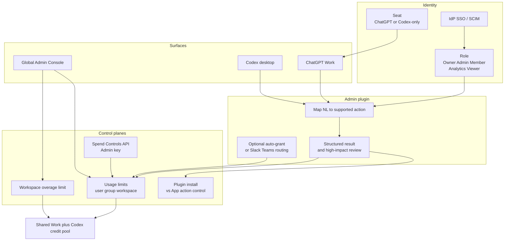

OpenAI は 2026-08-25 に、ChatGPT Work と Codex 向けの **Admin plugin** を発表しました。ワークスペース管理者が、会話の中で利用状況を読み、メンバーと権限を直し、利用上限や支出申請を処理できます。

一方で、全社にコーディングエージェントを展開する場面では、コスト帰属・最小権限・監査証跡が同時に問われます。会話で管理できることと、会話を管理の正本にしてよいことは別です。

この記事では、公式資料で確認できる範囲から次を整理します。

- Admin plugin が実際に持つ能力と、その権限モデル
- 「会話に載せてよい操作」と「コンソール / API に残す操作」の切り分け
- 導入時に最初に決めるべき設定と、判断を変えてよい条件

対象読者は、ChatGPT Enterprise / Edu のワークスペース管理者、および社内で AI 利用のガバナンスを設計する立場の方です。

*この記事の全体像。以下、順に解説します。*

## Admin plugin で何ができるようになったのか

インストールは、workspace settings で plugin を有効化し、Plugins directory から ChatGPT Work の web もしくは desktop に入れる流れです。

公式が挙げる能力は次の4つで、記載は「including but not limited to」です。つまり網羅リストではありません。

| 能力 | 具体例 |
|---|---|
| 利用状況の把握 | 採用状況、credit の利用内訳 |
| メンバー管理 | メンバー / グループの追加・削除 |
| 権限の診断と制御 | effective permissions の確認、feature / model のロール・グループ単位の制御 |
| 支出の処理 | usage limits と spending requests の承認・却下 |

自然言語の指示は **supported な read / write 操作へマップ**され、「何を依頼したか」「完了したか」「何が変わったか」を含む構造化結果が返ります。影響の大きいアクションは適用前にレビューできる、と発表文は書いています。

自動化の例として、pending の usage requests を Slack や Microsoft Teams へ回す運用、feature-access requests を事前条件一致で **自動 grant** し例外だけレビューする運用が挙げられています。

重要なのは、プラグインが新しい特権を作らないという主張です。実行者の既存ロールを permission-aware tools にマップする、という設計になっています。

:::message
ChatGPT Work と Codex は **同一の pricing / credits / usage limits** を共有します。通常の Chat は別メーターです。コスト分析のとき、この2つを分けて考えると数字が合いません。
:::

## 権限は1枚の画面では決まらない

会話面を評価するには、その手前にある層を見る必要があります。Admin plugin は、既存のロールとコンソール能力の **一部** を ChatGPT Work / Codex に出す層です。

図から読み取れる実務上の要点は2つです。

- **席種はロールより先に効く。** Codex-only 席のユーザーは、RBAC を足しても ChatGPT Work を開けません。Admin plugin の案内インストール経路は Work 側なので、Codex-only の管理者に会話管理を期待できません。
- **書き込み先は複数ある。** 会話・コンソール・Spend Controls API がいずれも usage limits を触ります。どれを正本にするかを決めないと、設定が上書きし合います。

製品境界も混同しやすい部分です。

- Chat は短い会話、Work は長い成果物、Codex は開発、という役割分担
- Codex は web / mobile では selectable ではない
- Work Cloud / Work Local / Codex Local はそれぞれ別 permission
- Enterprise / Edu で EKM が有効な eligible workspace では、default role の Work は管理者が切らない限り有効
- UAE の inference residency では **ChatGPT Work is not supported**

## 操作を3層に分けて設計する

採用の判断は「使う / 使わない」ではなく「どの操作を会話に載せるか」です。公式の権限積層に沿って、次の3層に分けるのが実務的です。

| 層 | 例 | 承認 | 記録として残すもの |
|---|---|---|---|
| 読み取り | 30日の採用状況、credit 内訳、effective permissions の診断 | 不要。Analytics Viewer でも閲覧面はある | Analytics。鮮度は面により 1〜6時間、最大 48時間。Usage limits の Used this period はほぼリアルタイム |
| 可逆変更 | グループ所属の付け外し、当期限りの user override、申請の却下 | 実行者の Admin 権限と適用前確認 | 依頼内容・完了・差分。Compliance へ残るかは公開 schema 未確認 |
| 高影響 | メンバー削除、ロール変更（Owner 専用）、永続上限、workspace overage、feature の自動 grant ポリシー、一括 offboarding | 人の承認を必須にする。自動 grant は使わないか、条件をコード化して変更管理する | 変更前値 / 変更後値 / 実行者 / 時刻。30日を超えるなら Compliance を連続 export |

読み取り層と可逆変更層は、会話に載せる価値が明確です。分析からそのまま次のアクションへ進めることが、この発表の主目的だからです。

高影響層は会話に載せません。理由は権限ではなく **証跡** です。後述するとおり、構造化結果がどの監査イベントに落ちるかが公開されていないためです。

## 「上限なし」は3つの意味を持つ

会話で管理するときに最も事故りやすいのが、この語彙のずれです。「上限を外して」という一言は、面によって別の設定に当たります。

| 表示 | 面 | 実際の意味 |
|---|---|---|
| No limit | グループ override | **workspace 既定の継承**。無制限ではない |
| No limit | overage 設定 | **キャップなし**。無料ではない |
| Unlimited usage | Global Admin Console の group / user | 文字どおりの無制限。継承用の Remove とは別ラベル |

自然言語のあいまいさが、そのまま支出のあいまいさになります。上限に関する指示は、面と設定名まで含めて明示するか、コンソールで直接操作する運用にします。

## 利用上限がどう決まるか

Enterprise / Edu の利用上限は、次の規則で決まります。

**優先順位:** user override → 所属グループの最高 default → workspace default

- **期間:** Monthly（UTC 月初）または Aligned to billing cycle。切替はコンソールから行います。Spend Controls API では period を変えられません
- **申請フロー:** Default（ChatGPT と Codex から Pending requests へ入り、admin へメール）/ Custom HTTPS / Disabled の3態。Default は既定で有効です
- **承認の種類:** temporary（当期限り）と permanent
- **上限到達時:** 実行中タスクは完了時に上限をわずかに超え得ます。到達後は追加の eligible usage を止めます
- **共有プール:** 先に尽きると overage 設定が効きます。ユーザー上限は overage 中も残ります

移行に伴う注意点として、週次の role 上限は **2026-08-15 に月次へ自動移行**しました。未上書き分は「週次 × 4」です。この変換は不可逆で、highest group default により実効上限が上がることも、以前 unlimited だったユーザーが有限上限になることもあります。移行後の実効値は一度棚卸しする価値があります。

なお Business プランは別の credit / spend モデルで、カスタム member RBAC と SCIM グループ同期がありません。この記事の前提は Enterprise / Edu です。

## 認証情報の3種を混ぜない

Admin plugin まわりでは、性質の違う資格情報が3つ登場します。役割を混ぜると、最小権限が崩れます。

| 資格情報 | 用途 | 使えないこと |
|---|---|---|
| 会話中のユーザーロール + Admin plugin | Console 相当の supported 操作 | ロールに無い操作の実行 |
| ChatGPT Admin key | Spend Controls、directory、analytics、service accounts、compliance | モデル推論。Admin ロールが作るキーは Restricted のみで、会話本文の export は不可。Owner は All / Read only / Restricted を選べる |
| Service-account token | Codex CI などの非人間実行 | Admin API の認証 |

ChatGPT workspace の Admin key（`chatgpt.enterprise.*`）は管理 API 用であり、モデル推論には使えません。API Platform の Admin APIs や org の spend_limit とは別系統です。

## 監査でどこまで期待してよいか

会話型管理を正本にできない最大の理由がここです。公開されている範囲は次のとおりです。

- Compliance Logs Platform の保持は **30日**。長期に残すなら SIEM 等へ連続 export します
- ChatGPT Work の user prompts と agent responses は対象です。connected app calls は別ログです
- 公式 FAQ は、すべての hosted file / shell / browser / tool / approval の **complete audit trail ではない**と明記しています
- Global Admin Console の credit analytics 履歴は最大 **120日**、更新は 1〜6時間。ChatGPT usage analytics は過去 12ヶ月、更新は最大 48時間

分析データの鮮度差にも注意が必要です。会話が analytics の数字を根拠に申請を承認すると、実際の消費と食い違うことがあります。支出判断は **Usage limits の Used this period** を正とし、analytics は仮説生成に使うのが安全です。

:::message alert
Compliance の保持 30日はベンダー側の値です。監査要件が 30日を超えるなら、初日から連続 export を組んでおかないと、後から遡れません。
:::

## 会話面・コンソール・API の使い分け

3つの面を同じ基準で並べると、役割が見えます。

| 基準 | Admin plugin の会話 | Global Admin Console | Spend Controls API |
|---|---|---|---|
| 分析から次アクション | 強い（発表の主目的） | 画面往復が必要 | 自前 UI が必要 |
| 書き込みの網羅 | supported のみ。カタログ非公開 | Usage limits / Members 等の正本 UI | workspace / group / user の月次上限。period 変更は不可 |
| 最小権限 | ロール継承を主張。自動 grant と共有接続で実効権限は広がり得る | ロールどおり | キーの Restricted scope |
| 監査 | 構造化結果は会話に出る。Compliance イベント型は公開未確認 | 画面操作 | API 認証ログ。保持は Compliance の 30日 |
| 向く条件 | 読み取り、個別申請のレビュー、可逆な override | 一括変更、period、overage、請求（Owner） | IdP / ITSM 連携の自動化 |

### 「権限を広げない」をどこまで信じるか

公式の主張には一次文面の裏付けがあります。

- 「既存ロールを超えない」「supported にマップ」「高影響は適用前レビュー」と発表文が明記
- 2026-06-18 の spend controls 発表時点で、workspace / group / user 上限と申請フローはコンソールに存在。plugin はその操作を会話に出したという読みと整合する
- 2026-07-23 の公式デモは、scoped Admin key を Work に渡し、cap 推奨 → 人の確認 → 適用 → admin UI で検証、という順序だった
- Custom request URL により、社内 ITSM を申請の正本にできる

一方で、同じ資料の中に留保もあります。

- 同じ発表が、条件一致による **自動 grant** を書いている。個別確認を省略する経路が公式に用意されている
- ChatGPT Work の FAQ は、agent-owned / shared connection が、実行者本人のソース権限を超えるデータやアクションを与え得ると述べている
- write 操作のカタログと、Admin plugin 専用の Help ページは、2026-08-26 時点で確認できなかった
- Disable plugin は uninstall ではない。アプリ無効化は他の plugin にも波及する
- 2026-04-29 には、一部 connector の write がベンダー側で自動 disable された（2026-05-05 復旧）
- FedRAMP の ChatGPT 対応機能一覧に ChatGPT Work が無い。plugin の CSV export と event-triggered Work は対象外で、Admin plugin の名前付き記載も確認できなかった

「権限を広げない」は、**ChatGPT ロールの昇格をしない**という主張としては一次文面と一致します。ただしソースシステム側の権限、自動ポリシー、共有資格情報までは保証しません。

なお、関連して引用されがちな「約45%のチケット解決」という数字は、Slack 上の IT Work agent に対する公式の自己申告であり、Admin plugin の書き込み成功率ではありません。導入根拠に使うと期待値がずれます。

## 導入時に決める7つの設定

以上を踏まえた初期設定です。操作種別を表に固定し、Admin plugin は読み取りと可逆変更に使います。plugin のために既存ロールを拡張するカスタムロールは作りません。

1. **Installation policy** を Admin / Owner の **Available** に限定する。Installed による全社配布はしない。Enterprise / Edu では必須アプリを明示 Enable する
2. **申請フロー**を、Default のまま plugin でレビューするか、Custom URL で ITSM を正本にするかを決める。自動 grant は初期オフ
3. **Usage 判断**は Usage limits の Used this period を正とし、analytics 会話は仮説生成に使う
4. **Compliance を初日から連続 export** する。30日のベンダー保持を監査の正本にしない
5. **Admin key は Restricted** とし、`usage_limit.read` から始める。write は自動化ジョブ専用にし、service-account token と混ぜない
6. **Codex-only 管理者**には、Work 席を別途割り当てない限り会話管理を期待しない
7. **共有 Slack / Teams 接続を Admin 操作に使わない。** 実行者個人のソース権限で閉じる

### 未解決の問い

次の点は、公開資料では確認できませんでした。いずれも「正本をコンソール / API に置く」設計であれば、採用を止める理由にはなりません。

- Admin plugin の write 一覧、冪等キー、部分失敗時の再実行境界
- 構造化結果が Compliance API のどの event type に落ちるか
- 自動 grant の criteria を誰がどうバージョン管理するか
- Analytics Viewer が plugin を入れたとき、write が確実に拒否されるかの実機確認
- Business プランでの Admin plugin の提供範囲（Admin keys の表は Enterprise / Edu 前提）

### 判断を変えてよい条件

次のいずれかが満たされたら、会話面をより広い範囲の正本へ引き上げる再評価に値します。

- 公式が write カタログと before / after の監査イベントを公開し、保持が契約で 90日以上になる
- 自動 grant を無効化できる、または変更が別の承認キューに必ず載る
- FedRAMP や対象リージョンで、ChatGPT Work と plugin が機能一覧に載る

## まとめ

- Admin plugin は、既存ロールを **supported な操作へマップする会話層**であり、新しい特権を作らない
- 採用してよいのは **分析と個別申請のレビュー、可逆な override** まで
- メンバーシップ・権限・支出の **正本はコンソールと Spend Controls API に残す**
- 事故の芽は権限より語彙と証跡にある。「No limit」の3義と、Compliance 30日保持を先に押さえる
- 数字の根拠は Usage limits の Used this period を正とし、鮮度の違う analytics を承認判断に使わない

この記事が少しでも参考になった、あるいは改善点などがあれば、ぜひリアクションやコメント、SNSでのシェアをいただけると励みになります！

## 参考リンク

- [Introducing the Admin plugin for ChatGPT Work and Codex（OpenAI, 2026-08-25）](https://openai.com/index/introducing-admin-plugin/)
- [Plugins in ChatGPT and Codex（OpenAI Help）](https://help.openai.com/articles/20001256-plugins-in-chatgpt-and-codex)
- [ChatGPT Work and Codex（OpenAI Help）](https://help.openai.com/en/articles/20001275-chatgpt-work-and-codex)
- [Manage usage limits and overages in ChatGPT Enterprise and Edu（OpenAI Help）](https://help.openai.com/en/articles/20001001-manage-usage-limits-and-overages-in-chatgpt-enterprise-and-edu)
- [Managing Admin keys in the Credentials tab（OpenAI Help）](https://help.openai.com/articles/20001407)
- [Global Admin Console（OpenAI Help）](https://help.openai.com/articles/12289294-global-admin-console)
- [ChatGPT Work admin FAQ（ChatGPT Learn）](https://learn.chatgpt.com/docs/enterprise/work-admin-faq)
- [ChatGPT usage limits and spend controls（ChatGPT Learn）](https://learn.chatgpt.com/docs/enterprise/usage-limits)
- [New usage analytics and updated spend controls for enterprises（OpenAI, 2026-06-18）](https://openai.com/index/chatgpt-enterprise-spend-controls/)
- [Admin controls, security, and compliance for plugins and apps（OpenAI Help）](https://help.openai.com/articles/11509118)
- [Compliance API for ChatGPT Enterprise（OpenAI Help）](https://help.openai.com/articles/9261474)
- [ChatGPT Enterprise and API Platform for FedRAMP（OpenAI Help）](https://help.openai.com/articles/20001070)
- [Data residency and inference residency for ChatGPT（OpenAI Help）](https://help.openai.com/en/articles/9903489-data-residency-and-inference-residency-for-chatgpt)
- [Partial Disruption of ChatGPT Workspace Connector Write Actions（OpenAI Status, 2026-04-29）](https://status.openai.com/incidents/01KQDM1K1826RP1FFN86ZNA3WG)
- [How IT Admins can manage ChatGPT Work at scale（YouTube, 2026-07-23）](https://www.youtube.com/watch?v=t8Ej9aeW388)
