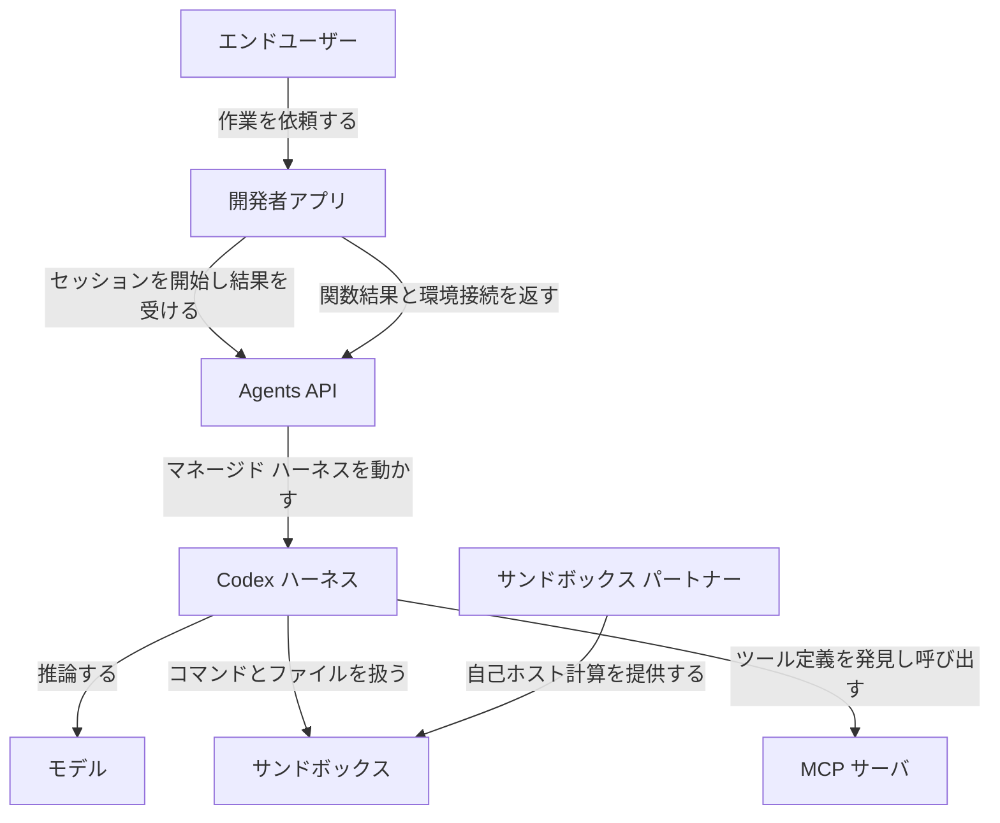
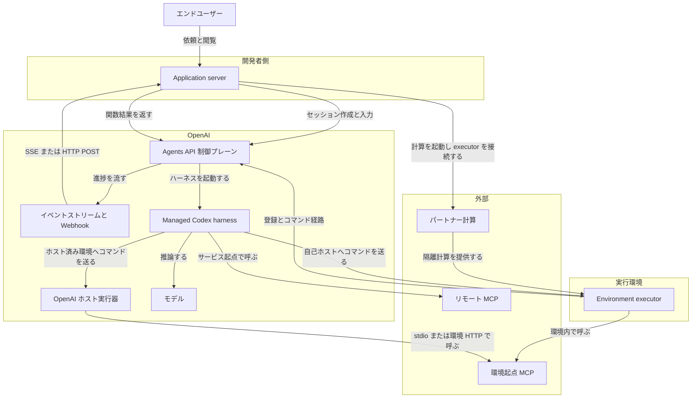
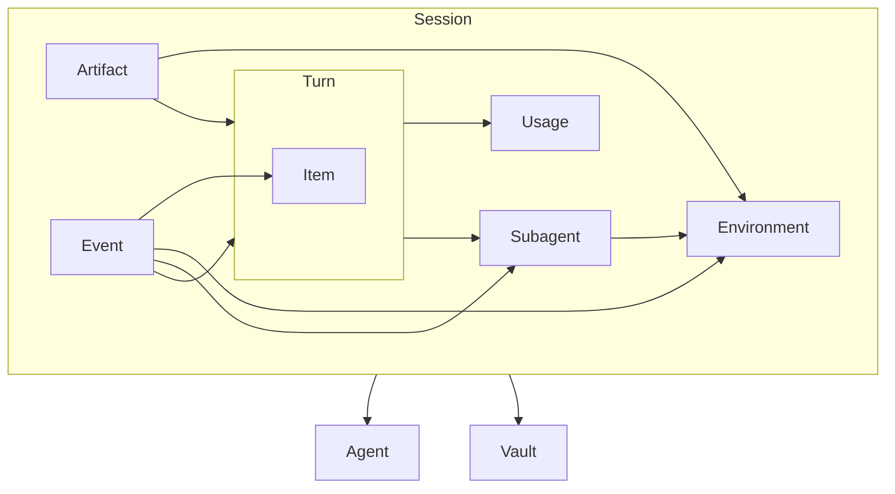
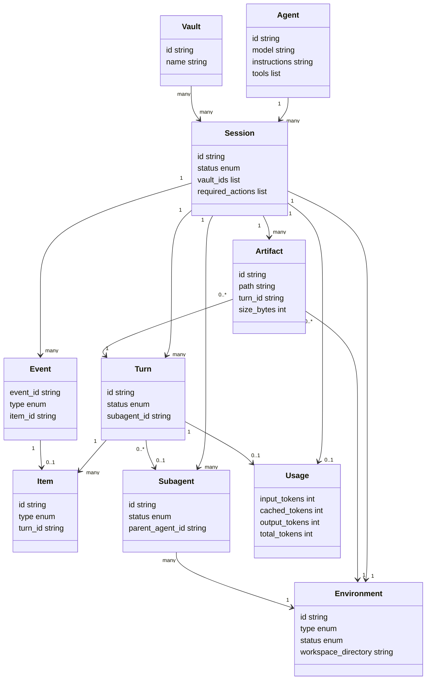

Agents API は、アプリケーションから Codex ハーネスへ仕事を渡し、結果を受け取るマネージド API です。OpenAI がセッション、オーケストレーション、コンテキスト compaction、復旧を運用し、アプリケーションはツールと実行環境を選びます。

この記事では、公開ベータのコア概念、アーキテクチャ、データモデル、導入と利用、運用上の制約を一次資料に沿って整理します。読み終えると、Agents SDK や Responses API との役割分担と、セッションを実装するときにアプリケーション側へ残る責務がわかります。

本稿の対象は `POST /v1/agents/sessions` と SDK の `client.beta.agents` です。OpenAI Agents SDK（`openai-agents` / `@openai/agents`）、Responses API、Google Managed Agents は別ランタイムです。

本文の API 名・ヘッダ・コード例は、2026-09-11 時点の [Agents API ガイド](https://developers.openai.com/api/docs/guides/agents-api/overview) と [発表ブログ](https://openai.com/index/introducing-the-agents-api/) に照合しています。公開ベータのため、フィールド名と列挙値は今後変わり得ます。


*この記事の全体像。以下、順に解説します。*

## OpenAI Agents APIとは

公開日は 2026-09-10 です。全開発者向けの公開ベータとして提供されています。ハーネスは Codex と ChatGPT で使っているものと同一系統で、OpenAI がホストし保守します。中核ロジックは公開コードベース [`openai/codex`](https://github.com/openai/codex) で確認できます。

エージェントはサンドボックス上でコード実行、ファイル編集、MCP 接続、成果物生成ができます。セッションは設定・ターン・アイテムを保持し、続きの作業を同じセッションで進めます。

公式のコア概念は次の 4 つです。

| 概念 | 役割 |
|---|---|
| Agent | モデル、指示、ツール、MCP サーバの設定。セッション作成時に渡すか、保存して `agent_id` で再利用する |
| Environment | ファイル・スキル・コマンドの実行場所。`none` / `openai_hosted` / `self_hosted` |
| Session | 設定・会話・作業を保持する耐久インスタンス |
| Events / Items | 入力と、ターン中に出る出力。イベントはライブ、アイテムは保存済み |

セッション開始から完了までの流れは次です。

1. セッションを作成し、エージェントと環境を構成する。
2. ユーザー入力でターンを開始する。
3. ストリームまたは Webhook で進捗を追う。
4. 同じセッションへ追加入力するか、作業中ターンを steer する。


### ランタイム比較

公式「Compare agent runtime options」の列です。

| 項目 | Agents API | Agents SDK | Responses API |
|---|---|---|---|
| 用途 | OpenAI がエージェントを運用し進捗を保存する長時間タスク | アプリ内でカスタムツールとワークフローを組む | モデルを直接呼ぶ、またはエージェントを一から組む |
| 実行場所 | OpenAI がマネージド Codex ハーネスを実行 | SDK がアプリケーション内で実行 | アプリケーション側。ホスト側オーケストレーションは任意 |
| 統合の手間 | Low | Medium | High |
| タスク間の状態 | セッション設定、ターン、アイテム | 自前ストレージと SDK セッション、または Responses の conversation | 手動履歴、response chaining、Conversations |
| ツール実行 | サービス接続ツール、アプリの function ハンドラ、任意のサンドボックス | アプリで設定したツール | ホストツールとアプリ側ツール |
| 実行環境 | OpenAI ホスト、セルフホスト、サンドボックスなし | 自前ランタイムとサンドボックスプロバイダ | 自前の実行環境 |

公式「Choose your starting point」は、上記 3 つに ChatKit（埋め込みチャット）を並べます。Agents API の session、Agents SDK の session、Responses の conversation、サンドボックスは別資源です。クリーンアップは選んだランタイムの手順に従います。

Google Gemini Managed Agents は Vertex / Gemini 側のマネージド実行です。本 API の Codex ハーネスおよび `/v1/agents/sessions` とは非互換です。

### ユースケース別の向き先

| やりたいこと | 向き先 |
|---|---|
| OpenAI 管理の Codex ハーネスでエージェントを動かす | Agents API |
| アプリ内ループで再利用可能なエージェント、ツール、handoff を制御する | Agents SDK |
| モデル応答を直接扱い、統合を自前で制御する | Responses API |
| 埋め込みチャット体験を足す | ChatKit |

Agents API の公式ショーケースは次です。

| ショーケース | 内容 |
|---|---|
| Incident response agent | アラート調査と復旧アクションの承認依頼 |
| Slack bot | 職場ツールを接続した依頼調査 |
| Data analyst | 読み取り専用 SQL でのウェアハウス質問応答 |
| GitHub issue investigator | 報告バグの再現と GitHub 上での共有 |
| Document reviewer | ポリシー skills と専門エージェントによる文書レビュー |

公式発表（2026-09-10）の顧客コメントに載る数値は次です。独立検証値ではなく、発表時点の引用です。

| 組織 | 話者 | 公式発表の数値 |
|---|---|---|
| Ciridae | Jack Weissenberger, CTO | 評価スコア 0.71 から 0.85。subagent フローで 4x のレイテンシ削減 |
| SafetyKit | Bhavyansh Sabharwal | ケースあたりコスト 60% 削減 |
| Hypha | Serhii Shchoholiev | 失敗したエージェント応答を 86% 削減 |

## 主な特徴

- **長時間セッション**: 発表は、数時間から数日規模の稼働を支えるインフラと、ファイル・コード・中間結果を置く環境が実用エージェントに必要だと述べます。セッションは途中から再開できます。SLA や上限時間の公式数値は、公開ベータ資料では確認できていません。
- **自動 compaction**: セッションがコンテキスト上限に近づくと、ハーネスが先行コンテキストを自動 compaction し、継続に必要な情報を残します。Responses API の `POST /responses/compact` をアプリが呼ぶ機能ではありません。
- **Tool search**: 必要なツール定義を都度ロードします。トークンとコストを抑え、モデルのキャッシュを保ちます。Agents API の function は eager が既定です。`tool_search` と `defer_loading` で遅延ロードになります。
- **Programmatic tool calling**: モデルが JavaScript を書き、ホストした V8 上でツールを並列・連鎖・フィルタします。Agents API ではハーネス既定で有効です。
- **Subagent**: `multi_agent` で独立作業を並列 subagent に委任します。同時実行数の既定は 6（コーディネータ除く）です。
- **環境選択**: `openai_hosted`、`self_hosted`、`none` を選べます。パートナー例は Blaxel、Cloudflare、Daytona、DigitalOcean、E2B、Modal、Oracle、Runloop、Vercel です。
- **課金**: 公開ブログは Agents API 自体の追加手数料なしと述べます。課金は選択モデルの API 料金、OpenAI ツールの標準料金、OpenAI ホストサンドボックスのコンテナ標準料金です。
- **OSS Codex ハーネス**: モデル呼び出し・ツール・コンテキスト調整の中核は `openai/codex` です。API 側では OpenAI がそのハーネスを運用し、モデル投入に合わせて更新します。
- **Skills / Vault / MCP**: capability directories でスキルを発見し、Vault で OpenAI 起点 MCP の資格情報を分離します。

## アーキテクチャ

公式 Architecture は 3 片です。Harness は OpenAI がホストする Codex インスタンスです。Environment はコマンドとファイルの実行場所です。Application server は製品とエージェントをつなぐ開発者側コードです。

### システムコンテキスト図



| 要素名 | 説明 |
|---|---|
| エンドユーザー | 開発者アプリ上で依頼を出し、途中経過と成果物を見る人です |
| 開発者アプリ | セッション作成、入力送信、関数ツール実行、自己ホスト環境の起動を担う製品側システムです |
| Agents API | `/v1/agents/sessions` を入口に、ハーネスへ作業を渡しイベントと成果を返します |
| Codex ハーネス | OpenAI がホストする Codex 実行体です。モデルとツールのループを回し、セッションを維持します |
| モデル | ハーネスが呼び出す推論モデルです。セッション作成時の agent 設定で選びます |
| サンドボックス | エージェントがコマンド実行とファイル操作をする計算場所です |
| MCP サーバ | ツール定義を公開し、呼び出しを実行する外部または環境内サーバです |
| サンドボックス パートナー | 自己ホスト時に隔離計算を提供する外部基盤です |

環境が `none` のときは、組み込み Bash、apply-patch、ワークスペースファイル、executor MCP は使えません。ハーネスはリモート MCP を直接呼べます。関数ツールは開発者アプリが実行し、結果をハーネスへ返します。

### コンテナ図

公式 3 片に、制御プレーンと通知経路を足した読み替えです。



#### 開発者側

| 要素名 | 説明 |
|---|---|
| Application server | タスク投入、イベント受信、関数ツール実行、自己ホストの起動と停止を担う開発者コードです |

#### OpenAI

| 要素名 | 説明 |
|---|---|
| Agents API 制御プレーン | セッションと環境の作成、Vault、成果物、入力イベント受付を行う API 面です。ヘッダ `OpenAI-Beta: agents=v1` が必要です |
| イベントストリームと Webhook | ストリームはターン内の詳細イベントです。Webhook はセッション状態変化です |
| Managed Codex harness | モデルとツールのループ、スキル適用、ステア、コンテキスト要約、サブエージェント委任、再開を担います |
| OpenAI ホスト実行器 | `environment.type` が `openai_hosted` のとき OpenAI が用意する Linux ワークスペースです。作業ディレクトリは `/workspace` です |
| モデル | ハーネスが呼ぶ推論モデルです。モデル利用料は API 料金です |

#### 実行環境

| 要素名 | 説明 |
|---|---|
| Environment executor | 自己ホスト時に環境内で動く実行器です。実体は `codex exec-server` です |

#### 外部

| 要素名 | 説明 |
|---|---|
| リモート MCP | `connection_origin` が service の HTTP MCP です。OpenAI から到達可能である必要があります |
| 環境起点 MCP | 環境から届く HTTP MCP、または executor が起動する stdio MCP です |
| パートナー計算 | 自己ホストの隔離計算です |

ストリームを閉じてもタスクはキャンセルされません。関数ハンドラが止まると、エージェントは結果待ちのままになります。自己ホストでは、executor がつながるまで作業は始まりません。接続待ちの上限は 5 分です。


### コンポーネント図

```mermaid
flowchart TB
    App["Application server"]
    subgraph Control["Agents API 制御プレーン"]
        Create["session create"]
        Vaults["vaults"]
        Arts["artifacts"]
        EventIn["入力イベント受付"]
        Stream["セッションイベントストリーム"]
        Hooks["Webhook 配送"]
        EnvRest["環境登録 REST"]
        EnvWss["コマンド交換 WSS"]
    end
    subgraph Harness["Managed Codex harness"]
        Loop["モデルとツールのループ"]
        Compact["compaction"]
        Search["tool search"]
        PTC["programmatic tool calling"]
        Coord["subagent coordinator"]
        V8["ホスト済み V8 実行"]
    end
    subgraph Hosted["OpenAI ホスト実行環境"]
        HostSB["ホスト済み Linux"]
        Out["workspace outputs"]
    end
    subgraph Self["自己ホスト実行環境"]
        Exec["codex exec-server"]
        WS["ワークスペース"]
        Partner["パートナー サンドボックス"]
    end
    Model["モデル"]
    SvcMCP["サービス起点 MCP"]
    EnvMCP["環境起点 MCP"]
    App -->|"POST /v1/agents/sessions"| Create
    App -->|"関数結果と追加入力"| EventIn
    Create -->|"セッションを組み立てる"| Loop
    Create -->|"vault_ids を結びつける"| Vaults
    Vaults -->|"資格情報を添える"| SvcMCP
    Loop -->|"推論する"| Model
    Loop -->|"閾値超過時に要約する"| Compact
    Loop -->|"遅延定義を載せる"| Search
    Loop -->|"exec で JS を走らせる"| PTC
    PTC -->|"中間結果を保持する"| V8
    PTC -->|"既存ツールを JS から呼ぶ"| Loop
    Loop -->|"委任する"| Coord
    Coord -->|"並列サブエージェント"| Loop
    Loop -->|"サービス起点 MCP を呼ぶ"| SvcMCP
    Loop -->|"ホスト済みへコマンドを送る"| HostSB
    HostSB -->|"ターン完了時に公開する"| Out
    Out -->|"成果物を返す"| Arts
    App -->|"成果物を取得する"| Arts
    Loop -->|"自己ホストへコマンドを送る"| Exec
    Exec -->|"api.openai.com へ登録する"| EnvRest
    Exec -->|"コマンド経路"| EnvWss
    EnvWss -->|"接続状態イベント"| Stream
    Exec -->|"ファイルとシェル"| WS
    Partner -->|"隔離計算"| Exec
    App -->|"計算を起動する"| Partner
    Exec -->|"stdio または環境 HTTP"| EnvMCP
    HostSB -->|"stdio または環境 HTTP"| EnvMCP
    Loop -->|"進捗イベント"| Stream
    Control -->|"状態変化"| Hooks
    Stream -->|"SSE"| App
    Hooks -->|"action_required など"| App
```



#### Agents API 制御プレーン

| 要素名 | 説明 |
|---|---|
| session create | `POST /v1/agents/sessions`。agent、environment、初期 input、`vault_ids` を受け、セッションと環境 ID を返します |
| vaults | OpenAI 起点 MCP 用の資格情報置き場です。秘密値はセッション資源に出ません |
| artifacts | `openai_hosted` で `/workspace/outputs` 配下をターン完了時に不変コピーとして公開します |
| 入力イベント受付 | 追加メッセージ、キャンセル、`agent.session.input.tool_result` を受けます |
| セッションイベントストリーム | ターン出力、環境接続、サブエージェント活動を SSE で流します。再接続しても欠落イベントは再生しません |
| Webhook 配送 | `created` / `action_required` / `in_progress` / `idle` / `failed` を署名付き POST します |
| 環境登録 REST | 自己ホスト executor の登録先です。`https://api.openai.com` です |
| コマンド交換 WSS | コマンドと結果の経路です。`wss://codex-cloud-environments.chatgpt.com` です。接続は外向きのみです |

#### Managed Codex harness

| 要素名 | 説明 |
|---|---|
| モデルとツールのループ | 入力からツール呼び出しと応答までを回す中核です |
| compaction | 長時間作業向けに先行文脈を要約し、後続ターンへ必要状態を引き継ぎます |
| tool search | 関数は既定で先行ロードです。`tool_search` と関数の `defer_loading` で必要時ロードします |
| programmatic tool calling | 既定で有効です。ハーネスが `exec` を渡し、生成 JS から既存ツールを調整します |
| ホスト済み V8 実行 | 生成 JS を隔離 V8 で走らせます。Node.js、一般ファイル、直接ネット、子プロセスはありません |
| subagent coordinator | `agent.multi_agent.enabled` が true のとき、作成・送信・待機・中断ツールを供給します |

サブエージェントは MCP、資格情報、Web 検索、環境のファイルとコマンドを継承します。関数ツールはサブエージェントにありません。サブエージェント追加は環境を増やしません。コーディネータとサブエージェントは同一ファイルシステムを共有します。

#### 環境選択と責務

| 種別 | 計算の所有者 | ハーネスとの接続 | ファイルの取り出し |
|---|---|---|---|
| none | 計算なし | 接続なし | セッション item のみ |
| openai_hosted | OpenAI | ハーネスが直接コマンド実行 | Artifacts API |
| self_hosted | 開発者またはパートナー | executor が外向き接続 | プロバイダまたはマウント FS |

自己ホストの公式制約です。

- 1 セッションにつき environment ID と executor は 1 組です。イメージと `workspace_directory` は再利用できます。
- `environment_template_id` は `openai_hosted` 専用です。
- executor キーはセッションと同一 organization / project / user または service account です。他権限は None です。
- パートナー手順は Modal、Cloudflare、Vercel、Daytona、Blaxel、E2B、Runloop、DigitalOcean、OCI の [Sandbox providers](https://developers.openai.com/api/docs/guides/agents-api/environments/self-hosted#sandbox-providers) に分かれます。

## データ

### 概念モデル

所有は入れ子、利用は矢印です。



| 要素名 | 説明 |
|---|---|
| Agent | プロジェクトに保存できる再利用設定。Session の外にあります |
| Vault | プロジェクトに独立。Session が `vault_ids` で参照します |
| Session | Environment / Turn / Event / Artifact / Subagent / Usage を所有します |
| Environment | Session に 1 つ。`none` でもオブジェクトはあります。Subagent と root が同一ファイルシステムを共有します |
| Turn | Item を所有し Usage を記録します。`subagent_id` が null なら root です |
| Item | Turn に属する保存済みメッセージとツール呼び出しです |
| Event | Session のストリームです。再生しません |
| Artifact | 完了ターンが `/workspace/outputs` から発行します。`self_hosted` と `none` では発行しません |
| Subagent | 独自の Turn / Item 履歴を持ちます。関数ツールは使えません |
| Usage | Session 集計と Turn 記録です。best-effort で、null はゼロではありません |

### 情報モデル



| 対象 | 値 |
|---|---|
| Session.object | `agent.session` |
| Session.status | `idle` / `in_progress` / `requires_action` / `failed` |
| Environment.type | `none` / `openai_hosted` / `self_hosted` |
| Environment のスキーマ | Session の environment は union。`none` は `type` のみ。hosted は `id` / `files` / `network` / `packages` 等。self_hosted は `id` / `remote_url` / `workspace_directory`。status は Session 資源に無い |
| GET `/v1/agents/environments/{id}` の status | `pending` / `connected` / `disconnected` / `expired` / `failed`。hosted ガイドの setup 中語 `provisioning` はスキーマに無い |
| ストリーム EnvironmentState.status | `pending` / `ready` / `connected` / `disconnected` / `failed`。`expired` は無い。`ready` は接続可能 |
| Environment.network_access | 公式パスは `network.access`。値は `enabled` / `disabled` / `restricted` |
| Turn.object | `agent.session.turn` |
| Turn.status | `queued` / `in_progress` / `waiting` / `completed` / `failed` / `cancelled` |
| Artifact.object | `agent.session.artifact` |
| Subagent.object | `agent.session.subagent` |
| Subagent.status | `active` / `closed` |
| Agent.reasoning | 入れ子 `reasoning.effort` / `reasoning.summary`。effort はモデル依存で `none` / `minimal` / `low` / `medium` / `high` / `xhigh` / `max` を含むことがある。summary は `concise` / `detailed` / `auto` |
| Agent.multi_agent | 公式は入れ子 `multi_agent.enabled` / `multi_agent.max_concurrent_subagents`。上図は型制約で平坦化しています |
| Session と Agent | 保存済みは `agent_id`。作成時 inline は `agent` オブジェクト。両方を渡すとオブジェクト・配列フィールドは置換 |
| Turn と Subagent | ルートの Turn は `subagent_id` が null で Subagent を参照しません。Subagent は複数 Turn を持ちます |
| Subagent items | ルート `GET .../sessions/{id}/items` は root 履歴。subagent は別の item history と per-turn items |

Item.type の確認済み値は次です。

`message` / `reasoning` / `function_call` / `function_call_output` / `agent_message` / `mcp_call` / `web_search_call` / `command_execution` / `create_subagent_call` / `send_subagent_input_call` / `wait_for_subagents_call` / `interrupt_subagent_call` / `resume_subagent_call` / `close_subagent_call`

ストリームの Event.type は [streaming events](https://developers.openai.com/api/reference/resources/beta/subresources/agents/streaming-events) が正本です。下表はガイドとリファレンスで確認した抜粋であり、全イベントではありません。

| 種別 | type |
|---|---|
| セッション | `agent.session.created` / `agent.session.in_progress` / `agent.session.idle` / `agent.session.failed` / `agent.session.requires_action` |
| 環境 | `agent.session.environment.pending` / `agent.session.environment.ready` / `agent.session.environment.connected` / `agent.session.environment.disconnected` / `agent.session.environment.failed` |
| ターン | `agent.session.turn.created` / `agent.session.turn.in_progress` / `agent.session.turn.completed` / `agent.session.turn.failed` / `agent.session.turn.cancelled` |
| アイテム | `agent.session.turn.item.added` / `agent.session.turn.item.done` |
| テキスト | `agent.session.turn.output_text.delta` / `agent.session.turn.output_text.done` / `agent.session.turn.content_part.added` / `agent.session.turn.content_part.done` |
| 推論要約 | `agent.session.turn.reasoning_summary_part.added` / `agent.session.turn.reasoning_summary_part.done` / `agent.session.turn.reasoning_summary_text.delta` / `agent.session.turn.reasoning_summary_text.done` |
| コマンド出力 | `agent.output.command_execution_output.delta` |
| サブエージェント | `agent.session.subagent.created` / `agent.session.subagent.active` / `agent.session.subagent.closed` |
| その他 | `error` |

Webhook の待ちは `agent.session.action_required` です。ストリームの待ちは `agent.session.requires_action` です。

`Session.required_actions` の型は `function_call`（`turn_id` / `call_id` / `name` / `arguments`）と `environment_connection`（`environment_id`）です。

Usage のネスト対応は次です。

| 属性 | 公式パス |
|---|---|
| input_tokens | `usage.input_tokens` |
| cached_tokens | `usage.input_tokens_details.cached_tokens` |
| output_tokens | `usage.output_tokens` |
| reasoning_tokens | `usage.output_tokens_details.reasoning_tokens` |
| total_tokens | `usage.total_tokens` |

確認済みの制約です。

| 項目 | 値 |
|---|---|
| ヘッダ | `OpenAI-Beta: agents=v1` |
| 権限 | `api.agents.read` / `api.agents.write` / `api.responses.write`。Vault は `api.vaults.read` / `api.vaults.write` |
| capability_directories | 最大 32。絶対パス。一意。`.` `..` 不可。既存ディレクトリ |
| network.restricted | `allowed_domains` 1-100。完全一致ホスト |
| 作成時ファイル | 50 件 |
| inline | 1 ファイル 5MiB、合計 10MiB（base64 前） |
| Files API コピー | 50MiB/ファイル |
| artifact | 200MiB/ファイル、同一発行合計 500MiB |
| max_concurrent_subagents | 既定 6。コーディネータは含まない |
| ホスト済み sandbox idle | 1 時間。変更不可 |
| 接続待ち | input 時最大 5 分 |
| データ | ZDR 非対応。residency は US のみ。self_hosted でも ZDR 対象外 |
| 関数ツール | Subagent 非対応 |
| ストリーム | 切断後の再送なし |

## 導入手順

### 前提（キー権限とヘッダ）

- Platform プロジェクトでアプリケーション API キーを作成します。
- セッション操作用に `api.agents.read` と `api.agents.write` を付与します。
- モデル推論用に `api.responses.write` を付与します。
- このキーはエージェントのサンドボックス外に置きます。

```bash
export OPENAI_API_KEY="your-api-key"
```

- リクエストは `OpenAI-Beta: agents=v1` が必須です。
- OpenAI SDK はヘッダを自動付与します。
- cURL では明示します。

### SDK インストール

パッケージは `openai`（`beta.agents` 名前空間）です。`openai-agents` は別ランタイムです。

```bash
pip install --upgrade openai
```

```bash
npm install openai
```

### セッション作成（ホスト済みサンドボックス）

公式 quickstart のモデル名は `gpt-6-astra` です。利用可能なモデルはプロジェクトと時点で変わります。

```python
from openai import OpenAI

with OpenAI() as client:
    with client.beta.agents.sessions.create(
        agent={
            "model": "gpt-6-astra",
            "instructions": "Write clean code, run it, and report the actual output.",
        },
        environment={"type": "openai_hosted"},
        input="Create tree.py, a Python script that prints a readable tree of the files in the current directory. Run it and show me the output.",
        stream=True,
    ) as events:
        for event in events:
            print(event.to_json(indent=None), flush=True)
```

```bash
curl --no-buffer --fail-with-body https://api.openai.com/v1/agents/sessions \
  -H "OpenAI-Beta: agents=v1" \
  -H "Authorization: Bearer $OPENAI_API_KEY" \
  -H "Content-Type: application/json" \
  -d '{
    "agent": {
      "model": "gpt-6-astra",
      "instructions": "Write clean code, run it, and report the actual output."
    },
    "environment": { "type": "openai_hosted" },
    "input": "Create tree.py, a Python script that prints a readable tree of the files in the current directory. Run it and show me the output.",
    "stream": true
  }'
```

- イベントの `session_id`（`agent.session.created` の `session.id`）を会話状態として保存します。
- `environment.type: "none"` のセッションは作成時に初期 `input` が必須です。
- 保存済みエージェントは `client.beta.agents.create` のあと `agent_id` でセッションに渡します。

```python
agent = client.beta.agents.create(
    model="gpt-6-astra",
    instructions="Answer technical questions accurately.",
    reasoning={"summary": "auto"},
)
session = client.beta.agents.sessions.create(
    agent_id=agent.id,
    environment={"type": "none"},
    input="Explain how an agent connects to an MCP server.",
)
```

### 環境 3 種の初期セットアップ

| `environment.type` | 役割 | ファイルの取り出し |
|---|---|---|
| `none` | 環境ファイルシステムなし | セッション items |
| `openai_hosted` | OpenAI が Linux ワークスペースを用意（作業ディレクトリ `/workspace`） | `/workspace/outputs` を Artifacts API |
| `self_hosted` | 自前計算で `codex exec-server` を実行 | プロバイダのファイル API またはマウント FS |

`openai_hosted` で作成時に足せる設定です。

- `packages`: `python` / `system` / `npm` のリスト。必要ならバージョン固定（例: `pandas==2.2.3`）。
- `setup_commands`: エージェント開始前のシェル。各コマンドに任意の `cwd`（既定 `/workspace`）。
- `files`: Files API の `file_id` または inline base64。どちらも `path` 必須。
- `env`: 文字列の環境変数。`PATH` / `CODEX_*` / `OPENAI_API_KEY` は拒否。
- `skills` / `plugins` / `capability_directories`
- `environment_template_id`: 保存済み設定の再利用。ネットワーク上書きはテンプレートより広くできません。
- `network.access`: `enabled`（既定） / `disabled` / `restricted`

パッケージと入力ファイルは setup より先に準備されます。setup の非ゼロ終了はエージェント開始を止めます。作成応答は setup 開始を意味します。状態は `GET /v1/agents/environments/{environment_id}` で確認します。スキーマ上の setup 中は `pending` です。hosted ガイドの `provisioning` は同じ段階の説明語です。

### 自己ホスト executor の接続

環境内の準備です。

```bash
mkdir -p /workspace
npm install -g @openai/codex@alpha
```

outbound 先は次です。

- `https://api.openai.com`（環境登録）
- `wss://codex-cloud-environments.chatgpt.com`（コマンドと結果）

セッション作成はアプリケーション側（環境の外）です。

```python
session = client.beta.agents.sessions.create(
    agent={
        "model": "gpt-6-astra",
        "instructions": "You are a helpful coding assistant. Write clean code and verify that it works.",
    },
    environment={"type": "self_hosted", "workspace_directory": "/workspace"},
)
```

- `session.environment.id` と `session.environment.remote_url` を executor に渡します。
- `remote_url` は再接続時も含め変更しません。
- 環境へは restricted executor キーを `CODEX_API_KEY` として渡します。他権限は None です。

```bash
codex exec-server \
  --remote "<session.environment.remote_url>" \
  --environment-id "<session.environment.id>"
```

接続イベントは `agent.session.environment.pending` / `connected` / `failed` です。エージェントは接続済み環境とユーザー入力の両方が揃って作業を始めます。

## 利用方法

### 必須パラメータ

| 項目 | 値 | 備考 |
|---|---|---|
| ヘッダ | `OpenAI-Beta: agents=v1` | SDK は自動。cURL は明示 |
| 認証 | `Authorization: Bearer $OPENAI_API_KEY` | アプリケーションキー |
| 権限 | `api.agents.read` / `api.agents.write` / `api.responses.write` | セッション操作 + 推論 |
| `agent.model` | 例: `gpt-6-astra` | 公式 quickstart のモデル名 |
| `environment.type` | `none` / `openai_hosted` / `self_hosted` | セッション作成時に必須 |

### セッションの取得と削除

```python
session = client.beta.agents.sessions.retrieve(session_id)
result = client.beta.agents.sessions.delete(session_id)
```

```bash
curl "https://api.openai.com/v1/agents/sessions/$session_id" \
  -H "OpenAI-Beta: agents=v1" \
  -H "Authorization: Bearer $OPENAI_API_KEY"

curl -X DELETE "https://api.openai.com/v1/agents/sessions/$session_id" \
  -H "OpenAI-Beta: agents=v1" \
  -H "Authorization: Bearer $OPENAI_API_KEY"
```

`status` が `requires_action` のとき、`required_actions` を処理します。

- `function_call`: 関数を実行し、同じセッションへ `turn_id` / `call_id` 付きで結果を返します。
- `environment_connection`: `environment_id` の環境を接続します。

### 追加入力とキャンセル

エンドポイントは `POST /v1/agents/sessions/{session_id}/events` です。アイドルなら新ターンです。作業中なら現ターンへの steer です。フォローアップ前にイベントストリームを購読します。

```python
def send_message(client: OpenAI, session_id: str, text: str) -> None:
    client.beta.agents.sessions.events.create(
        session_id,
        events=[
            {
                "type": "agent.session.input.message",
                "input": [
                    {
                        "role": "user",
                        "content": [{"type": "input_text", "text": text}],
                    }
                ],
            }
        ],
    )


def cancel_turn(client: OpenAI, session_id: str) -> None:
    client.beta.agents.sessions.events.create(
        session_id, events=[{"type": "agent.session.input.cancel"}]
    )
```

```bash
curl -N \
  "https://api.openai.com/v1/agents/sessions/$session_id/events?stream=true" \
  -H "OpenAI-Beta: agents=v1" \
  -H "Authorization: Bearer $OPENAI_API_KEY" \
  -H "Accept: text/event-stream"
```

完了判定はルートターンの終端イベントです。`agent.session.turn.completed` / `failed` / `cancelled` に加え、`event.turn.subagent_id is None` を確認します。サブエージェントの完了だけでは依頼全体の完了ではありません。`agent.session.idle` だけでは成功ではありません。

### 保存済み items / turns / artifacts

```python
items = client.beta.agents.sessions.items.list(session_id, order="asc", limit=100)
turns = client.beta.agents.sessions.turns.list(session_id, limit=20, order="desc")
latest = next(iter(turns.data))
turn = client.beta.agents.sessions.turns.retrieve(latest.id, session_id=session_id)
print(turn.subagent_id)


def download_artifact(client, session_id, turn_id, path, destination):
    for artifact in client.beta.agents.sessions.artifacts.list(session_id):
        if artifact.turn_id != turn_id or artifact.path != path:
            continue
        with client.beta.agents.sessions.artifacts.with_streaming_response.content(
            artifact.id, session_id=session_id
        ) as response:
            response.stream_to_file(destination)
        return
    raise FileNotFoundError(path)
```

ルートエージェントの `subagent_id` は `null` です。`openai_hosted` だけ Artifacts API が `/workspace/outputs` を公開します。

### MCP と function ツール

```json
{
  "type": "mcp",
  "server_label": "openai_docs",
  "transport": {
    "type": "http",
    "server_url": "https://developers.openai.com/mcp"
  }
}
```

```json
{
  "type": "function",
  "name": "get_customer",
  "description": "Look up a customer by ID.",
  "parameters": {
    "type": "object",
    "properties": { "customer_id": { "type": "string" } },
    "required": ["customer_id"],
    "additionalProperties": false
  }
}
```

関数結果は `agent.session.input.tool_result` で、同じ `turn_id` / `call_id` を返します。`required_actions` の要素は SDK ではオブジェクトなので、添字参照する前に `to_dict()` します。成功時の `output` は文字列、または `input_text` / `input_image` のコンテンツ配列です。通常の JSON データ（辞書など）は文字列化します。コンテンツ配列はそのまま渡します。

```python
import json


def return_tool_result(client, session_id, action, output, success=True):
    action = action.to_dict() if hasattr(action, "to_dict") else action
    event = {
        "type": "agent.session.input.tool_result",
        "turn_id": action["turn_id"],
        "call_id": action["call_id"],
    }
    if success:
        if isinstance(output, list):
            event["output"] = output
        elif isinstance(output, str):
            event["output"] = output
        else:
            event["output"] = json.dumps(output)
        event["success"] = True
    else:
        event["success"] = False
        event["error"] = output
    client.beta.agents.sessions.events.create(session_id, events=[event])
```

履歴の `function_call` item だけでは未処理とは限りません。`session.required_actions` のエントリだけ処理します。

### マルチエージェント

```python
events = client.beta.agents.sessions.create(
    agent={
        "model": "gpt-6-astra",
        "instructions": "Delegate each release to a separate subagent.",
        "multi_agent": {"enabled": True, "max_concurrent_subagents": 2},
    },
    environment={"type": "none"},
    input="Release A: ... Release B: ...",
    stream=True,
)
```

委譲ツールはハーネスが供給します。自分で宣言しません。

### Skills（capability directories）

以下は capability directories でスキルを発見する方式です。Responses の hosted shell 向け `skill_reference` 添付形式は、この経路では使いません。`openai_hosted` では、セッション作成時の `environment.skills` で Skills API 参照（`type: skill_reference`）や inline ZIP も選べます。サンドボックス内の親ディレクトリを `environment.capability_directories` に登録します。最大 32、絶対パス、既存ディレクトリです。

```json
{
  "environment": {
    "type": "self_hosted",
    "workspace_directory": "/workspace",
    "capability_directories": [
      "/workspace/capabilities/legal",
      "/workspace/capabilities/engineering"
    ]
  }
}
```

## 運用

### 状態確認

ターンは非同期です。成功判定は idle やストリーム切断では行いません。

| 見るもの | 用途 |
|---|---|
| `GET /v1/agents/sessions/{session_id}` | `status`、`required_actions`、`environment` |
| `GET /v1/agents/environments/{environment_id}` | hosted の setup 状態 |
| turn 終端イベント | `completed` / `failed` / `cancelled` |
| `GET .../items` | 保存済みメッセージと tool call |
| `GET .../turns` | status、timestamps、`usage`、error |

### ログとトレース

ライブ作業はイベントストリームです。詳細トレースは [platform.openai.com/logs?api=agents](https://platform.openai.com/logs?api=agents) の Agents タブです。公開ベータ API に tracing 設定、trace retrieval、外部 exporter はありません。プロジェクト API キーでは詳細トレースを取れません。

失敗系イベントは次です。

- `agent.session.turn.failed`
- `agent.session.turn.cancelled`
- `agent.session.failed`
- `agent.session.environment.failed`
- `error`

### ストリーム切断復旧

ストリームは missed event を replay しません。

1. 新しいストリームを開き、到着イベントをバッファします。
2. ストリームを繋いだままセッションと items を retrieve します。
3. ローカル状態を `item_id` キーで items から復元します。
4. バッファした item 更新を `item_id` で適用します。履歴で最終状態に達した item への更新は破棄します。`restore_from_items` は、その確定済み `item.id` の集合を返します。
5. ライブイベント処理に戻ります。

```python
def recover_disconnected_stream(client, session_id, handle_event):
    with client.beta.agents.sessions.events.stream(session_id) as events:
        session = client.beta.agents.sessions.retrieve(session_id)
        items = client.beta.agents.sessions.items.list(
            session_id, order="asc", limit=100
        )
        finalized = restore_from_items(items)
        if session.required_actions:
            handle_required_actions(session.required_actions)
        for event in events:
            item_id = getattr(event, "item_id", None)
            nested = getattr(event, "item", None)
            nested_id = getattr(nested, "id", None) if nested is not None else None
            if item_id in finalized or nested_id in finalized:
                continue
            handle_event(event)
```

イベントストリームを閉じてもタスクはキャンセルされません。止めるときは `agent.session.input.cancel` です。

### セッション削除と 409

hosted で setup 中または実行中に delete すると `409` が返ることがあります。待ってから、試行回数の上限付きで再試行します。

```python
import time


def delete_session_with_retry(client: OpenAI, session_id: str, attempts=5):
    delay = 1.0
    for _ in range(attempts):
        try:
            return client.beta.agents.sessions.delete(session_id)
        except Exception as exc:
            status = getattr(exc, "status_code", None)
            if status != 409:
                raise
            time.sleep(delay)
            delay = min(delay * 2, 16)
    raise TimeoutError(session_id)
```

self_hosted ではセッション削除とプロバイダ compute 停止は別操作です。削除 Webhook はありません。

### サンドボックス keepalive

connected な hosted サンドボックスはターン間も含めて keepalive を受けます。アクティビティと keepalive が 1 時間止まると削除され得ます。このタイムアウトは設定できません。`/workspace/outputs` の公開コピーはサンドボックス期限切れ後もダウンロードできます。

### Webhook で self_hosted の compute 起動

API は接続待ちの前に `agent.session.action_required` を出します。`function_call` の required action では compute を起動しません。`agent.session.in_progress` は実行開始の確認であり、接続待ちの合図ではありません。API の入力時接続待ちは最大 5 分です。クラッシュ後の pending input は replay されません。待機中に同じ input を再送しません。同一 environment ID の再接続は、差し替え compute のファイル復元を意味しません。プロバイダの snapshot が必要です。`agent.session.idle` は self_hosted compute 停止の合図ではありません。接続要求と実行中を再確認してから止めます。

購読イベントは `created` / `action_required` / `in_progress` / `idle` / `failed` です。

### usage の扱い

セッションとターンの `usage` は best-effort です。未知のときは `null` です。記録値は後から変わります。欠落はゼロ消費ではありません。最終請求ではありません。

```json
{
  "input_tokens": 5000,
  "input_tokens_details": { "cached_tokens": 1500 },
  "output_tokens": 900,
  "output_tokens_details": { "reasoning_tokens": 200 },
  "total_tokens": 5900
}
```

cache-write 回数は Agents API の usage フィールドにありません。ルートと subagent の両方を見ます。

## ベストプラクティス

### キー分離

| キー | 置き場所 | 権限 |
|---|---|---|
| アプリケーションキー | サンドボックスの外 | `api.agents.read` / `api.agents.write` / `api.responses.write` |
| environment key | 環境内の `CODEX_API_KEY` のみ | 環境接続だけ |

- アプリキーをサンドボックス、イメージ、ソース、ログに入れません。
- hosted の `environment.env` に `PATH`、`CODEX_*`、`OPENAI_API_KEY` を含めません。
- 第三者資格情報は環境に置かず、ブローカー経由を優先します。
- ユーザー / ワークロードごとに環境と OpenAI プロジェクトを分けます。
- webhook 署名シークレットと executor key を混ぜません。

### ネットワーク allowlist

- hosted は必要最小の `restricted` または `disabled` から始めます。
- `restricted` は完全一致ホスト名 1-100 件です。ワイルドカード、プロトコル、パス、ポートは使えません。
- hosted stdio MCP は現状 `enabled` が必要です。
- self_hosted の executor は `api.openai.com` と `wss://codex-cloud-environments.chatgpt.com` への outbound を許可します。
- テンプレートの `network` 上書きは、テンプレートより広いポリシーにできません。

### ツール定義と prompt cache

- 初期 instructions とツール定義をむやみに変えません。
- 新しいタスク詳細はフォローアップメッセージに置きます。
- 大きいカタログだけ `{ "type": "tool_search" }` と関数の `defer_loading: true` を使います。
- Programmatic Tool Calling の無効化だけ明示します。

```json
{ "type": "programmatic_tool_calling", "enabled": false }
```

### 独立タスクだけ subagent

- 独立タスク（別文書のレビュー、別原因の調査）に使います。
- 短い作業と依存ステップはメインエージェントに残します。
- 同一ファイルを編集するエージェントは変更を協調します。
- create / wait の完了は、subagent のタスク完了を意味しません。

### 成果物を削除前に保存

- `openai_hosted` はターン完了後に Artifacts API で保存します。
- `self_hosted` はプロバイダの file API またはマウント FS で保存します。
- セッション削除は残したい公開コピーより先にしません。

### データ保持の前提を契約に書く

- Agents API の data residency は現時点で米国のみです。
- Zero Data Retention (ZDR) 非対応です。
- self_hosted を選んでも ZDR 適格になりません。
- `/v1/agents` は学習利用なし、abuse monitoring は 30 日、application state は削除までです。
- 顧客 compute にファイルを置いても、セッション状態は API 側に残ります。

### 関数ハンドラを必ず用意する

環境を付けても function tools はそこで自動実行されません。履歴の `function_call` item だけでは未処理とは限りません。`required_actions` を見ます。副作用のある関数は session / turn / call ID で結果を耐久保存します。

## 注意点

### ドキュメントと実装の乖離

| 対象 | 資料の記載 | 実態 | 読者への影響 |
|---|---|---|---|
| Environment setup 中の語 | hosted ガイドは `provisioning` | GET EnvironmentInfo は `pending`。ストリーム EnvironmentState は `pending` または `ready`。Session.environment に status は無い | ガイド語でポーリングすると一致しません。`ready` は hosted の接続可能イベントです |
| Environment.status の合成 | GET とストリームを 1 enum にまとめると誤る | GET は `expired` あり。ストリームは `ready` あり `expired` なし | 1 つの status 列で判定すると期限切れと接続可能を取り違えます |
| Create session REST `.md` | 一部リンクが `.../sessions/methods/create.md` | 当該パスは 404。Python リファレンスとガイド例が正 | 直リンクを記事に貼ると切れます |
| compaction ガイド | `context_management` / `POST /responses/compact` | Agents API はハーネス内部の自動要約。アプリが compact エンドポイントを呼ぶ機能ではありません | Responses 手順をセッションに付けると無効です |
| Programmatic tool calling | Responses は `allowed_callers` と continuation ループ | Agents API は既定有効。無効化は `enabled: false` | 設定面を取り違えるとツール実行場所の理解がずれます |
| Tool search の MCP | Responses は MCP に `defer_loading` | Agents API の MCP は対応モデルで自動 discovery | 不要な `tool_search` 追加や誤った defer 設定になります |
| GitHub `openai/codex` README | CLI / IDE / Codex Web の案内が主 | マネージド API としての説明は発表ブログと developers ガイド | リポジトリだけ読むと API 面が見えません |

### 資料間の食い違い

発表のコード例とガイドの省略時既定、ストリームと Webhook のイベント名は矛盾ではなく、取り違えやすい差です。

| 対象 | 資料の記載 | 実態 | 読者への影響 |
|---|---|---|---|
| 同時 subagent 数 | 発表ブログの設定例は `max_concurrent_subagents: 3` | multi-agent ガイドの省略時既定は 6（コーディネータ除く） | 設定例を既定と誤認します |
| ストリームと Webhook の待ちイベント | ストリームは `requires_action` | Webhook は `action_required` | 同じ待ちでも type 文字列が違うため、ハンドラの分岐が外れます |
| 削除 409 | manage ガイドに薄い | hosted の Sandbox expiry 節に 409 と再試行 | 実行中 delete の扱いが漏れます |
| Data controls の行 | `/v1/agents` | 実装パスは `/v1/agents/sessions` | 保持方針の照合キーは `/v1/agents` です |
| Context7 | OpenAI API ドキュメントとしてヒット | Agents SDK / ChatKit / Realtime が混在し、Agents API 本体スニペットが欠ける | 補助インデックスとして使えません |

### 公開ベータ時点の未確認事項

| 対象 | 資料の記載 | 実態 | 読者への影響 |
|---|---|---|---|
| 長時間稼働の上限 | 発表は数時間から数日規模 | SLA や上限時間の公式数値は未確認 | 可用性契約に「数日保証」を書けません |
| ハーネスの版指定 | 発表はモデル投入に合わせてハーネスを更新 | セッション作成でハーネス版を pin する公式フィールドは未確認 | 委託先変更時の再現性は版固定契約が別途必要です |
| 監査ログの範囲 | 組織 Audit Logs API はユーザー操作と設定変更 | Agents セッションのツール実行を監査ログがどこまで含むかは、公開ベータ資料では未確認 | 障害調査とコンプライアンスの保証範囲を契約で切り出します |
| トレースの外部持ち出し | Tracing ガイドは dashboard 閲覧 | 公開ベータ API に trace retrieval / exporter なし | SIEM 連携は未提供です |
| Go SDK の `subagent_id` | Go 例は空文字比較 | JS/Python は `null` | 言語間で同一視してよいか未検証です |
| Event ユニオンの全数 | TypeScript は追加フィールドあり | 本文の type 表はガイドで確認できたものだけ | 未掲載 type を「存在しない」と断定できません |

## トラブルシューティング

症状から原因、対処の順で見ます。完了イベントと idle だけを成功判定に使いません。

- 環境失敗は `environment.error` を読んで別セッションでやり直します。
- ターン完了は全ツール成功を保証しません。items を照合します。
- ストリーム切断は items から復元します。missed event は再生されません。
- 関数待ちは `required_actions` を処理します。
- 自己ホストは executor 接続と compute 停止をアプリが担います。

### 環境とセットアップ

| 症状 | 原因 | 対処 |
|---|---|---|
| セッションは作れたがエージェントが動かない。環境が `failed` | hosted setup が非ゼロ終了 | `agent.session.environment.failed` の `environment.error` を読む。原因を直して別セッションを作る |
| 作成直後にファイル操作したら失敗する | 作成レスポンスは setup 開始 | `connected` を待ってから live file する |
| サンドボックスからの外部リクエストが失敗する | `network.access` が `disabled` / `restricted`。リダイレクト先が allowlist に無い | `network` とリダイレクト先ホストを確認する |
| live file の追加・一覧が失敗する | 環境がまだ setup 中、または 1h idle で削除済み | `connected` まで待つ。期限切れなら入力を載せた新規セッションを作る |
| 状態取得やファイル一覧が `5xx` | 一時障害 | 遅延を伸ばして deadline 付き再試行。続くなら request ID を残す |

### ターン結果とストリーム

| 症状 | 原因 | 対処 |
|---|---|---|
| `turn.completed` なのに成果が壊れている | 完了は全 tool 成功を保証しない | items と tool 結果、最終応答を見る |
| セッションが idle。成果が無い | idle は追加 input 可能の意味 | そのターンの status を見る |
| ストリーム再接続後、途中のテキストが欠ける | ストリームは missed event を replay しない | 新ストリームを開いてから items で復元する |
| セッション delete が `409` | setup または実行の完了待ち | 待って上限付き再試行。先に cancel するか完了を待つ |

### 関数と自己ホスト

| 症状 | 原因 | 対処 |
|---|---|---|
| エージェントが止まったまま | `required_actions` に `function_call`。ハンドラが無い | セッションを retrieve し `tool_result` を返す |
| self_hosted で入力後に進まない | executor 未接続。5 分待ち切れ | `environment_connection` を確認し `codex exec-server` を起動する |
| 関数結果を返しても進まない | 履歴 item に対して返した、または ID 不一致 | `required_actions` のエントリだけ処理する |
| self_hosted セッションを消したのに VM が残る | 削除はプロバイダ compute を止めない | セッション削除と compute 停止を別途実装する |

### 観測とデータ制約

| 症状 | 原因 | 対処 |
|---|---|---|
| hosted で翌日ファイルが消えた | 1h keepalive 切れ | artifact を先に保存する |
| dashboard にトレースがまだ無い | トレースはターン終了後に構築 | ライブはイベント。トレースは後で Logs を見る |
| usage が `null` | best-effort | ゼロとみなさない。請求は請求 |
| EU レジデンシー / ZDR プロジェクトで使えない | US residency のみ。ZDR 非対応 | データコントロール表の `/v1/agents` を正とする |
| 同一ファイルを複数 subagent が壊す | 依存・共有編集を並列委譲した | 独立タスクだけ委譲する |

## まとめ

Agents API は、アプリケーションから Codex ハーネスへ仕事を渡し、セッションとイベントで進捗を回収するマネージド実行面です。環境は `none` / `openai_hosted` / `self_hosted` の 3 種で、計算の所有者と成果物の取り出し方が変わります。

実装で先に決めるのは 4 点です。関数ツールの `required_actions` ハンドラ、ストリーム切断後の items 復元、hosted の 1 時間 idle、ZDR 非対応と米国レジデンシーです。成功判定は `idle` や切断ではなく、ターン終端イベントと保存済み items で行います。

この記事が少しでも参考になった、あるいは改善点などがあれば、ぜひリアクションやコメント、SNSでのシェアをいただけると励みになります！

## 参考リンク

### 概要 / 構造

- [Introducing the Agents API](https://openai.com/index/introducing-the-agents-api/)
- [Agents API overview](https://developers.openai.com/api/docs/guides/agents-api/overview)
- [Architecture](https://developers.openai.com/api/docs/guides/agents-api/architecture)
- [Compare agent runtimes](https://developers.openai.com/api/docs/guides/agents)
- [openai/codex](https://github.com/openai/codex)

### データ / 構築 / 利用

- [Quickstart](https://developers.openai.com/api/docs/guides/agents-api/quickstart)
- [Configuring Agents](https://developers.openai.com/api/docs/guides/agents-api/configuration)
- [Run and continue sessions](https://developers.openai.com/api/docs/guides/agents-api/sessions)
- [Events and items](https://developers.openai.com/api/docs/guides/agents-api/sessions/events)
- [Agents streaming events](https://developers.openai.com/api/reference/resources/beta/subresources/agents/streaming-events)
- [Create session リファレンス](https://developers.openai.com/api/reference/resources/beta/subresources/agents/subresources/sessions/methods/create)
- [OpenAI-hosted sandboxes](https://developers.openai.com/api/docs/guides/agents-api/environments/openai-hosted)
- [Self-hosted sandboxes](https://developers.openai.com/api/docs/guides/agents-api/environments/self-hosted)
- [Files and artifacts](https://developers.openai.com/api/docs/guides/agents-api/environments/files)
- [Functions](https://developers.openai.com/api/docs/guides/agents-api/tools/functions)
- [MCP connections](https://developers.openai.com/api/docs/guides/agents-api/tools/mcp)
- [Vaults](https://developers.openai.com/api/docs/guides/agents-api/tools/vaults)
- [Skills（Agents API）](https://developers.openai.com/api/docs/guides/tools-skills)
- [Multi-agent](https://developers.openai.com/api/docs/guides/agents-api/multi-agent)

### 運用 / 注意点 / トラブルシューティング

- [Sandbox lifecycle](https://developers.openai.com/api/docs/guides/agents-api/environments/lifecycle)
- [Sandbox security](https://developers.openai.com/api/docs/guides/agents-api/environments/security)
- [Session webhooks](https://developers.openai.com/api/docs/guides/agents-api/sessions/webhooks)
- [Manage sessions](https://developers.openai.com/api/docs/guides/agents-api/sessions/manage)
- [Observability and usage](https://developers.openai.com/api/docs/guides/agents-api/observability)
- [Tracing](https://developers.openai.com/api/docs/guides/agents-api/tracing)
- [Data controls](https://developers.openai.com/api/docs/guides/your-data)
- [Tool search](https://developers.openai.com/api/docs/guides/tools-tool-search)
- [Programmatic tool calling](https://developers.openai.com/api/docs/guides/tools-programmatic-tool-calling)
- [Compaction（Responses 専用）](https://developers.openai.com/api/docs/guides/compaction)
- [Pricing](https://developers.openai.com/api/docs/pricing)
- [Logs → Agents](https://platform.openai.com/logs?api=agents)
