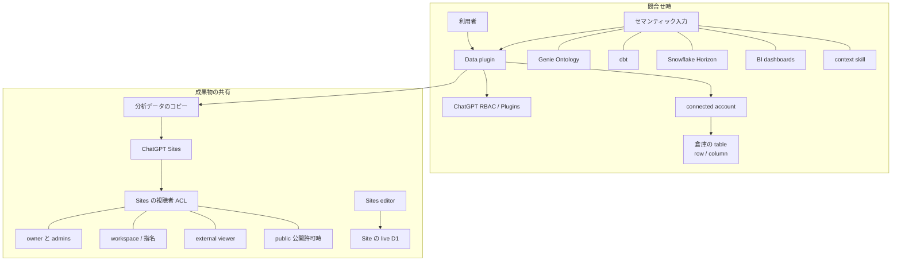

OpenAI は 2026-09-10 に、ChatGPT Work 向けの Data agent を発表しました。Plugins directory 上の名前は Data で、ChatGPT Work と Codex の会話から使います。承認済みの倉庫やファイルに接続し、業務用語と指標定義を参照して変化を調べ、対話で interactive dashboard を作る、というのが公式の説明です。

この記事では、公式発表と Help を正本に、起動と接続、問合せ時の権限、公開後の視聴者制御、セマンティック層の扱い、倉庫ネイティブおよび BI ネイティブとの向き先を整理します。読み終えると、問合せ時の権限と公開後の視聴者制御がどのストアに載るか、指標定義の正本をどこに残すかがわかります。

顧客引用の効果数字は自己申告であり、分母と期間は公式本文にありません。

*この記事の全体像。以下、順に解説します。*

## OpenAI Data agentとは

発表日は 2026-09-10 です。対象は ChatGPT Work の plugin です。会話から `@Data` で明示するか、暗黙に呼び出します。会話中に必要な第三者プラグインの導入を提案します。クエリを書かず、新しい分析ツールを学ばずに指示できる、と製品投稿は書きます。

経路は ChatGPT Work と Codex の plugin です。公開 REST SDK と公式 Colab は、2026-09-11 時点の Help と Cookbook では確認できていません。

### 接続先とセマンティック入力

承認済みデータ源の例は次です。

- Amazon Redshift
- Datadog
- Google BigQuery
- ClickHouse
- Databricks
- MongoDB
- Snowflake

ファイルは Google Drive と SharePoint です。セマンティック入力の例は、Databricks Genie Ontology、dbt、GitHub、Snowflake Horizon、既存 BI ダッシュボード、文書です。

管理者は Workspace settings > Plugins で、Data の installation policy を role または group に設定します。値は available と pre-installed です。プラグインのインストールと、underlying app のアクセスは別制御です。

### 分析成果と共有

分析は interactive dashboard にできます。edit、share、refresh ができます。Help は ChatGPT Sites への公開を推奨します。接続済み BI（Omni、Oracle BI、Power BI、Sigma、Tableau、ThoughtSpot）上でも、対応アクションの範囲でダッシュボード操作ができます。共有は Slack または email でもできます。承認した接続ツール上のアクションも使えます。

Context skill で、チーム向けの指示と lightweight Data Semantic Layer を作れます。共有は zip または plugin です。Templates の共有について、Help は native sharing features が coming soon と書きます。

Snowflake と Databricks は app template が必要なことがあります。公式手順は、組織コネクタと各ユーザーの OAuth です。

### 権限面の重なり

Data agent の権限は次の面が重なります。ワークスペースのプラグイン可用性、接続アカウントのソース権限、セマンティック定義の参照、成果物の Sites ACL です。

問合せ時の矢印はソースシステムへのクエリです。共有時の矢印は Sites 上のコピーと、Sites 自身の D1 です。両者は同じ「権限」という言葉で呼ばれますが、ストアが違います。

## 注意点

製品投稿は「既存の権限と業務定義を使う」を前面に出します。Help は同じ権限文を Queries に限定します。公開については、「the data used in the analysis is copied into the published site, so be mindful of data permissions when choosing who to share it with」と書きます。

社内利用の「product team のほぼ全員」と「GTM の 3 分の 2 超」は OpenAI 自己申告です。分母、期間、内部エージェントとの区別は本文にありません。ServiceTitan の「roughly three times」と micro1 の「half an hour」は顧客引用であり、計測定義は一次にありません。

2026-01-29 の社内データエージェントは、「custom internal-only tool (not an external offering)」です。規模の more than 3.5k users、600 petabytes、70k datasets は社内プラットフォームの数字であり、顧客向け Data plugin の導入規模ではありません。製品投稿の「Built from the tools we use」は系譜の説明です。6 層コンテキストと golden SQL eval が顧客仕様に載るとは書いていません。

Databricks 引用の「Thousands of organizations rely on Databricks Genie」は Genie の導入規模です。ソリューションページの「thousands of businesses」は ChatGPT Work 一般の主張です。

Sites まわりでは、調査日時点で次の GitHub issue が OPEN です。

- [openai/codex#31794](https://github.com/openai/codex/issues/31794): Sites plugin 再認証 404 と Unknown tool
- [openai/codex#34954](https://github.com/openai/codex/issues/34954): public Site が Cloudflare 403
- [openai/codex#38812](https://github.com/openai/codex/issues/38812): Windows で local preview がブロック

VentureBeat は、公開の正しさベンチが製品投稿に無く、内部比較のみだと報じています。

## 問合せ時の権限はconnected accountに残る

発表と Help と Enterprise リリースノート（2026-09-10）は、connected-account permissions と workspace access controls が適用されると書きます。Lockdown Mode の Help は、「App access in ChatGPT does not override permissions in the connected source system」と書きます。接続の成功はソース権限を増やしません。Help のトラブルシュートがそう書きます。

クエリは connected account の既存権限を使います。table、row、column の制限を含む、と発表と Help が書きます。ChatGPT 側のロール制御はプラグインと app の可用性です。ソースの上限は接続 identity です。

公式 Help に、組織共有の warehouse service user を全社員が経由する第一級オプションは見当たらません。公式が書く共有は、workspace 用 template を 1 本 publish し、各ユーザーが自分のアカウントで認可する形です。

### SnowflakeとDatabricksのtemplate

Snowflake app template では、`session:role:all` のとき Snowflake は各ユーザーの default role を使います。別の承認済みロールがあっても自動選択されません。管理者の接続成功は、default role が違うメンバーの接続成功を保証しません。公式がテスト手順に書きます。

Databricks template は、組織の OAuth client と各ユーザーのサインインです。scopes は ALL APIs または SQL を管理者が選びます。

### DriveとSharePoint

Drive と SharePoint は administrator-managed sync の対象になりえます。同期と live action の制御は交差しない、と app permissions Help が書きます。個人認可の sync は廃止されています。権限変更の反映は遅延しえます。

## 公開後の権限はSitesのコピーとACLになる

Sites への公開は分析データのコピーです。閲覧者の table / row / column 権限を再適用する、という公式文は Help と発表に見当たりません。Sites の視聴者は次です。

- owner と admins
- 指名ユーザー
- workspace
- 外部 viewer
- 公開許可時の internet

外部招待と public publishing は別チェックです。editor は Site の live D1 を読めます。これはソースウェアハウスの RLS ストアではありません。初回 publish のあと、editor は同じ URL に後続版を出せます。owner の再承認ステップは公式にありません。

Databricks AI/BI Dashboards は、Share data permissions（既定、publisher の資格でクエリ）と Individual data permissions（閲覧者自身の資格）の二択を製品機能として出します。既定は publisher 権限であり、直接アクセスの無いユーザーにデータが見える可能性を公式が警告します。OpenAI Data から Sites への経路に、同等の Share data permissions / Individual data permissions スイッチは Help に見当たりません。

cloud automation による refresh が、発行者の接続で再コピーするのか閲覧者の資格で再クエリするのかは、公式に書いていません。

Sites は beta で、データレジデンシーの対象外になりえます。PHI とカードデータを処理してはならない、と公式が書きます。会話とファイル等はレジデンシー対象になりえますが、Sites と beta 機能は非対象です。Apps と MCP はプロバイダ条項です。

地域の制約もあります。Work は supported regions です。UAE inference では Work 非対応です。Sites は EEA / UK / CH を launch 時除外しています。Help FAQ が正本です。

## セマンティック層は精度向上の入力である

Help は business definitions を「sometimes called a Semantic Layer」と呼び、精度向上に使うと書きます。入力はセマンティック層、文書、trusted dashboards です。チームに preferred があるときは、「Tell Data which definition or source to use」が公式の手順です。結果を信じる前に source、time period、filters、metric definition を確認せよ、と利用者へ指示します。既存レポートと食い違うときは、その詳細を比較するよう Data に頼め、とあります。

ダッシュボードや Site に、dbt unique_id、semantic view 名、Genie Ontology の snapshot、定義 version を刻む仕様は、発表と Help と Sites ドキュメントでは確認できていません。Context skill は key definitions 用の lightweight Data Semantic Layer を増やせます。audience は self / team / company です。Help の Templates 節は native sharing features が coming soon と書きます。Context Skills 節には同じ一文はありません。

指標定義が複数 BI で競合している組織では、Data agent が正本を一つに畳む、と読む根拠は公式にありません。正本の指定はプロンプト運用と skill に残ります。

## 倉庫ネイティブとBIネイティブとの向き先

同カテゴリは、Databricks Genie、Snowflake Cortex CoWork、ThoughtSpot Spotter、Power BI Copilot が既売です。基準ごとの位置は次です。

| 基準 | ChatGPT Work Data agent | 倉庫ネイティブ（Genie / Cortex） | BI ネイティブ（Power BI / ThoughtSpot 等） |
|---|---|---|---|
| 会話で分析 | Work / Codex の plugin | 倉庫 UI / エージェント | Copilot / Spotter |
| 既存セマンティック層 | 複数源を参照。競合時は Tell Data | 倉庫内の ontology / semantic view が正本になりやすい | セマンティックモデル / Liveboard |
| 問合せ時のソース権限 | connected account | 倉庫 IAM | モデル RLS / OLS |
| 共有時の権限 | Sites はコピー。Share / Individual data permissions 相当は Help に無い | Databricks は Share data permissions と Individual data permissions の二択 | レポート共有はモデル権限と結びつくことが多い |
| 定義の版 | 成果物 stamp は未確認 | オブジェクト ACL と YAML / view 名 | モデル変更とレポートの結びつき |
| レジデンシー | 接続先と Sites は対象外になりうる | データが倉庫に残る、という売りがある | BI テナントの境界 |
| 向く条件 | 既に ChatGPT Work に業務が集まり、複数源を一つの会話に載せたい | 正本が倉庫にあり、境界を越えたくない | 正本が BI にあり、既存ボード運用を崩したくない |

公式に見当たらない契約項目もあります。採用契約を止めるほどではありませんが、共有面とレジデンシーと規制データは PoC 前に方針を決める必要があります。

| 項目 | 2026-09-11 の公式 |
|---|---|
| Data 専用 RPM / TPM | 確認できず。Apps は通常の ChatGPT rate limits。プロバイダ cap あり |
| Work の usage | Codex と共有。flexible Enterprise は固定 rate limit 無し。非 flexible は plan limits が残る |
| Sites quota | plan-specific、UI 表示。固定のサイト数は Help に無い |
| REST / SDK | 確認できず。Help は plugin 経路のみ |
| error.code | 症状ベースのトラブルシュート。Snowflake 例 `query_timeout: 600` は MCP 設定例 |
| 公開 SLA % | 確認できず。一般 SLA 記事は publishing SLAs 段階 |
| Sites 容量 | D1 10 GB。R2 は固定上限なし。Enterprise 所有 Site の Analytics は currently unavailable |
| モデル寿命 | Data 固定 ID は無い。Work の workspace モデル設定に従う |

## 発注側の導入判断

発注側の現時点の推奨は、倉庫や BI の正本を置き換える基盤として導入しない、です。ChatGPT Work に既に業務が集まっているチーム向けの、問合せ用インタフェースとして PoC する、が条件付きの使い方です。

「既存権限を使う」は live クエリについて一次で支持されます。「既存権限のまま共有できる」は Help 自身が弱めます。「既存の業務定義を使う」は入力として支持され、裁定と provenance としては支持されません。

逆転条件は次です。

- 公開 Site が閲覧者のソース資格で再クエリする公式モードが出る
- 成果物に定義 ID と版が機械可読で残る
- 対象地域で Sites が residency 対象になる。または Sites を使わず倉庫内ボードだけに閉じる運用が公式に揃う

直近の検証は次です。

1. 同一問合せを、狭い個人接続と広い仕事接続で走らせ、見えるテーブルと行を比較する。
2. 発行者が作った Site を、ソース権限の無い同僚と外部 viewer で開き、コピー済み数値が見えるかを記録する。
3. 発行者の接続を切ったあと refresh / automation が残るか、残るなら誰の資格かを見る。
4. 意図的に競合する 2 定義（dbt と BI）を渡し、Tell Data 無しと有りで採用定義が変わるかを見る。生成物に定義名と版が残るかを目視する。
5. 対象が PHI やカードデータ、EEA レジデンシー、UAE inference なら、Sites 経路は最初から外す。

Data agent は複数の定義源を読む入口です。裁定者ではありません。裁定を ChatGPT に預けるのではなく、preferred 定義を skill またはプロンプトで固定し、成果物に出典が残るかを検収条件にする、が調査時点の実務です。

未解決の問いは次です。採用契約を止めるほどではありません。

- refresh / cloud automation の実行 identity は誰か
- Sites 化する前の会話共有で、クエリ結果が閲覧者のソース権限を超えるか。内部 OpenMetadata ケーススタディは共有チャットでも gated と主張しますが、顧客 Help にはありません
- Data plugin 単体の GA / beta ラベル

## まとめ

Data agent は、ChatGPT Work と Codex の会話から承認済み倉庫とファイルを問い、interactive dashboard を作る plugin です。問合せ時は connected account の既存権限を使います。公開 Site は分析データのコピーであり、閲覧者のソース RLS を再適用する公式文はありません。セマンティック層は精度向上の入力であり、競合する定義を一つに畳む裁定エンジンではありません。

ChatGPT Work に業務が集まっているチームなら、問合せインタフェースとして PoC する価値はあります。倉庫や BI の正本、共有時の権限増幅、定義の版管理は、別ストアとして検収条件に残してください。

この記事が少しでも参考になった、あるいは改善点などがあれば、ぜひリアクションやコメント、SNSでのシェアをいただけると励みになります！

## 参考リンク

一次:

- [Now everyone can put data to work](https://openai.com/index/put-data-to-work/)（2026-09-10）
- [Using the Data plugin in ChatGPT Work and Codex](https://help.openai.com/articles/20001518)
- [ChatGPT Work for Data Teams](https://openai.com/business/solutions/data/)
- [Data plugin ページ](https://openai.com/business/plugins/data/)
- [Enterprise & Edu release notes](https://help.openai.com/articles/10128477-chatgpt-enterprise-edu-release-notes)（2026-09-10 Data plugin 節）
- [Creating and managing ChatGPT Sites](https://help.openai.com/articles/20001339)
- [Managing ChatGPT Sites for your workspace](https://help.openai.com/articles/20001338)
- [Sites ドキュメント](https://learn.chatgpt.com/docs/sites)
- [RBAC](https://help.openai.com/en/articles/11750701-role-based-access-controls-for-chatgpt-enterprise)
- [Managing app permissions](https://help.openai.com/articles/20001495)
- [Connecting app accounts](https://help.openai.com/articles/20001494)
- [Snowflake app template](https://help.openai.com/articles/20001249)
- [Databricks app template](https://help.openai.com/articles/20001250)
- [Admin-managed app sync](https://help.openai.com/articles/10847137)
- [Data residency and inference residency](https://help.openai.com/articles/9903489)
- [Inside OpenAI’s in-house data agent](https://openai.com/index/inside-our-in-house-data-agent/)（2026-01-29、別製品）

GitHub（Sites、OPEN を 2026-09-11 に確認）:

- [openai/codex#31794](https://github.com/openai/codex/issues/31794)
- [openai/codex#34954](https://github.com/openai/codex/issues/34954)
- [openai/codex#38812](https://github.com/openai/codex/issues/38812)

二次:

- [OpenMetadata case study](https://open-metadata.org/case-study/openai)
- [Databricks dashboard sharing](https://docs.databricks.com/aws/en/dashboards/share/share)
- [VentureBeat 2026-09-10](https://venturebeat.com/data/openais-new-data-agent-skips-the-one-thing-rivals-like-databricks-are-racing-to-publish-a-benchmark)
