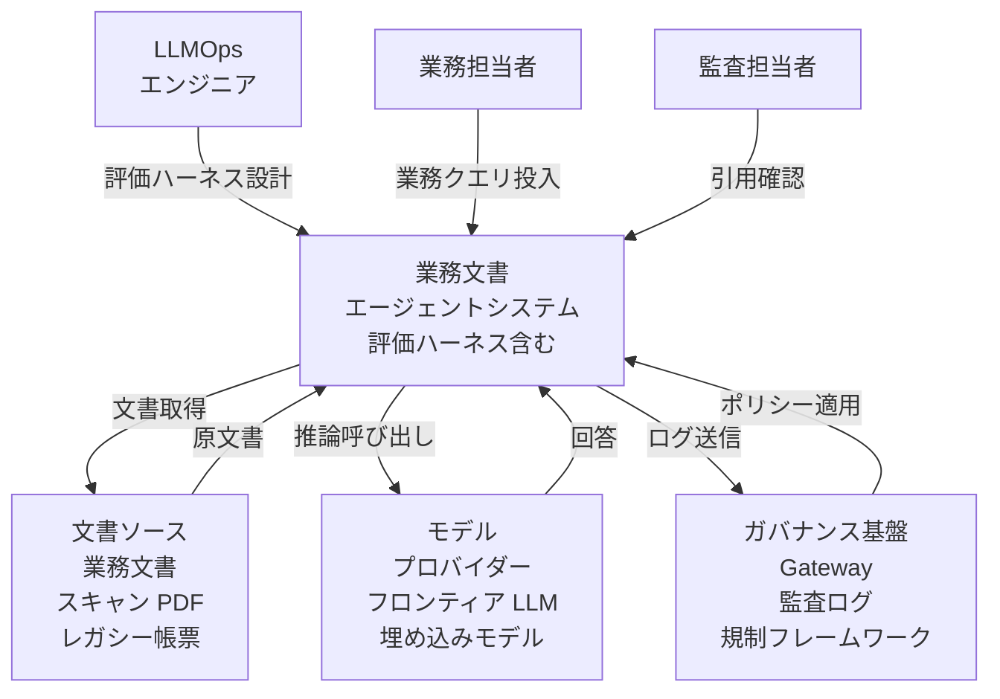
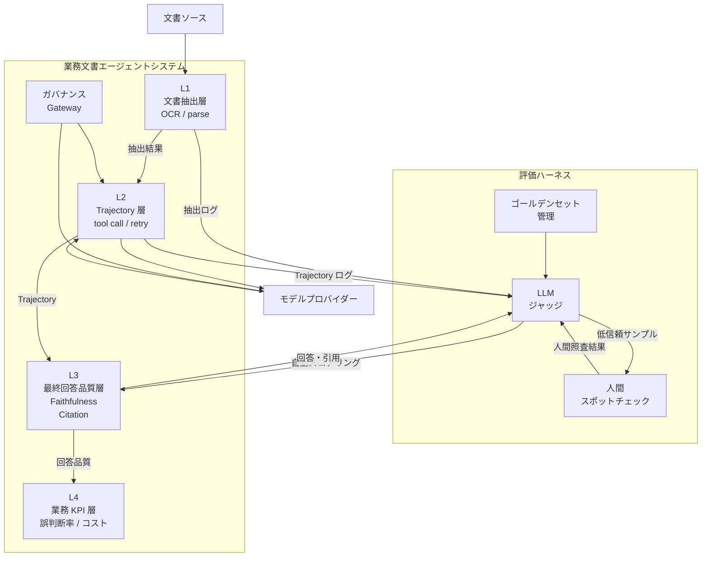
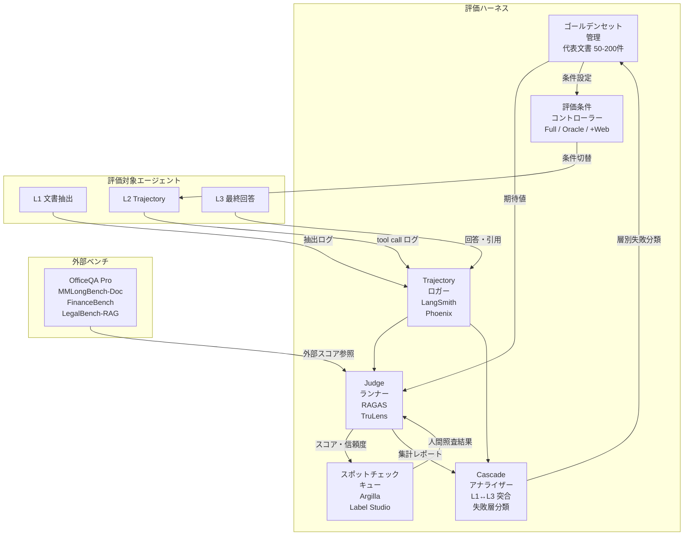
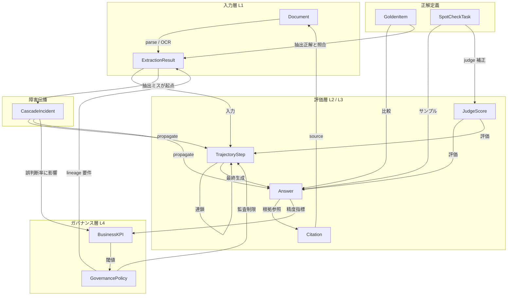
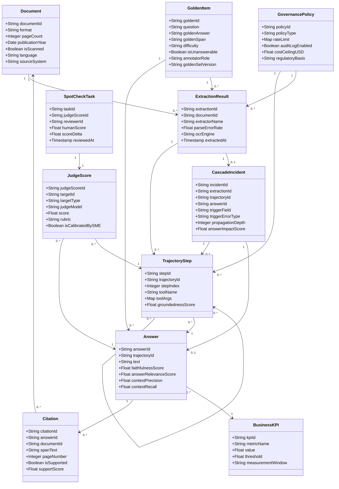

> 検証日: 2026-05-17 / 対象発表: OpenAI×Databricks パートナーシップ (2025-09-25 締結 / 2026-04-23 GPT-5.5 発表)

## 概要

### パートナーシップの骨格

OpenAI と Databricks は 2025-09-25 に 1 億ドル規模 (multi-year) の戦略パートナーシップを締結しました。Databricks が Data Intelligence Platform / Agent Bricks / Unity Catalog / Unity AI Gateway を提供し、OpenAI が frontier model (GPT-5 系) と Codex coding agent を供給する役割分担です。

2026-04-23 に OpenAI が GPT-5.5 を発表し、同日 Databricks が "partners with OpenAI on GPT-5.5" ブログを公開しました。API での利用は 2026-04-24 以降、Databricks の Mosaic AI / Agent Bricks / Unity AI Gateway 経由での提供 (AWS・Azure・GCP) は後続記事で "available now" と告知されました。対象顧客は 20,000 社以上に及びます。具体的なリージョン提供範囲は公式 region availability を別途確認してください。

GPT-5.5 は "OpenAI's strongest frontier model for agentic work in enterprise, complex document reasoning, and long-horizon coding agents" と位置づけられています。OpenAI 公式モデルページによると context window は約 105 万トークン、価格は入力 5 ドル / 出力 30 ドル (per 1M tokens)、272K トークン超では long-context レート (入力 2 倍 / 出力 1.5 倍、すなわち 10 / 45 ドル) がセッション全体に適用されます。

press release で顧客事例として明示された企業は次のとおりです。

| 企業 | 業界 |
|---|---|
| Block | 金融 |
| Comcast | 通信 |
| Condé Nast | メディア |
| Mastercard | 決済 |
| Rivian | 自動車 |
| Shell | エネルギー |

### OfficeQA Pro と本記事の問い

Databricks が公開したベンチマーク **OfficeQA Pro** (arXiv 2603.08655, 2026-03-09) は、U.S. Treasury Bulletins 約 89,000 ページ / 2,600 万件以上の数値を題材に業務文書エージェントの実力を測ります。GPT-5.5 評価でも Databricks 側がこのベンチを採用しました。

| 条件 | GPT-5.5 | GPT-5.4 |
|---|---|---|
| LLM + Oracle PDF + Web Search | 64.66% | 57.14% |
| Full Agent Workflow (Codex harness) | 52.63% | 36.10% |

注目すべきは、1996 年以前のスキャン PDF では parsing 起因のエラーが 40〜50% (二次情報) に達することです。「最終回答の精度」より「文書抽出ミスがエージェント全体の判断経路を壊す」現象が、ベンダー公式ベンチで明示的に問題化された点が業界的に意義を持ちます。

本記事はこの発表を起点に、「業務文書エージェントの評価ハーネスをどう設計するか」を整理します。想定読者は LLMOps 担当・業務エージェント PdM・エンタープライズデータ基盤責任者です。

## 特徴

| # | 特徴 | 要点 |
|---|---|---|
| 1 | 4 層評価モデル | L1 (文書抽出) → L2 (trajectory) → L3 (最終回答品質) → L4 (業務 KPI) で抽出ミスの連鎖を可視化 |
| 2 | OfficeQA Pro が「失敗の構造」を 3 軸で分解 | コーパス規模 / 時代横断 / 条件別スコアで「どのステップが落ちたか」を区別 |
| 3 | Unity AI Gateway が企業ガバナンスの要 | アクセス制御・PII 検出・監査ログ・コスト集計・モデル横断の単一請求を一括管理 |
| 4 | 日本語縦書き OCR で GPT-5.5 ルートが有利 | 国内検証で Gemini 2.5 Pro / GPT-5 系が強く Claude 系が劣後 (二次情報) |
| 5 | レガシー前処理が必須レイヤとして浮上 | .xdw / .jtd / DocuWorks / 一太郎は標準的な LLM 入力だけでは扱いにくく YomiToku / ColPali 等の前処理が必要になりやすい |
| 6 | hallucination cascade を直接測るベンチが整っていない | OWASP ASI08 (2026) が問題提起する一方で広く合意された step-by-step 定量化標準はまだ見つけにくい |
| 7 | 自社版 golden set + 3 条件評価が最小実装単位 | 代表文書 50〜200 件で full agent / oracle / +web を比較し Layer 寄与を分離 |
| 8 | 垂直統合 SaaS が代替しにくい領域が残る | Sansan Bill One・バクラク・freee は自社 OCR + 自社学習 + 自社 UI で固められている |

## 構造

### システムコンテキスト図



| 要素 | 役割 |
|---|---|
| LLMOps エンジニア | 評価ハーネスの設計・実行・精度チューニング担当 |
| 業務担当者 | 業務クエリ投入と回答の適合性確認 |
| 監査担当者 | 判断根拠と引用の正確性をスポットチェック |
| 業務文書エージェントシステム | エージェント推論・文書解析・評価ハーネスを一体提供 |
| 文書ソース | スキャン PDF・生成 PDF・レガシー帳票・Office 文書 |
| モデルプロバイダー | フロンティア LLM と埋め込みモデルの供給元 |
| ガバナンス基盤 | アクセス制御・PII マスキング・監査ログ・コスト集計 |

### コンテナ図



| 要素 | 役割 |
|---|---|
| L1 文書抽出層 | OCR・パース・テーブル抽出・数値抽出。1996 年以前スキャン PDF でエラー率 40〜50% |
| L2 Trajectory 層 | ツール呼び出し順序・リトライ・自己訂正。L1 ミスが計画を歪める |
| L3 最終回答品質層 | Faithfulness / Citation Precision / Answer Accuracy。Judge 単独はドメインや言語によって人間評価との乖離が大きくなりやすい |
| L4 業務 KPI 層 | 誤判断率・人手介入率・コスト |
| ガバナンス Gateway | アクセス制御 / PII / 監査ログ / コスト / フォールバック |
| ゴールデンセット管理 | 代表文書 50〜200 件と QA ペア管理 |
| LLM ジャッジ | 自動スコアリングと閾値アラート |
| 人間スポットチェック | 低信頼サンプルを人間が照査 (20〜30%) |

### コンポーネント図



| コンポーネント | 代表ツール |
|---|---|
| Golden Set Manager | 内製ストア (CSV / Delta Table) |
| Trajectory Logger | LangSmith, Phoenix, OpenAI Evals |
| Judge Runner | RAGAS, TruLens, Phoenix, OpenAI Evals |
| Spot-check Queue | Argilla, Label Studio, 内製 UI |
| Cascade Analyzer | OpenAI Evals + 内製スクリプト |
| Condition Controller | pytest / 内製ハーネス |
| External Bench | OfficeQA Pro / MMLongBench-Doc / FinanceBench / LegalBench-RAG |

## データ

### 概念モデル



| 概念 | 定義 |
|---|---|
| Document | 評価対象の業務文書 (PDF / Office / .xdw / .jtd) |
| ExtractionResult | OCR・parsing・table 抽出で得た構造化データ |
| TrajectoryStep | エージェント 1 ステップ (tool call / 引数 / 中間推論) |
| Answer | エージェント最終回答テキスト |
| Citation | claim ごとの参照スパン (ページ・段落・セル) |
| GoldenItem | SME がアノテートした正解 QA ペア |
| JudgeScore | LLM-as-Judge が付与したスコアとルブリック |
| SpotCheckTask | 人間レビュアーの照査記録 (judge calibration 入力) |
| CascadeIncident | L1 ミスが L2 / L3 へ伝播した連鎖障害インスタンス |
| BusinessKPI | 誤判断率・人手介入率・コスト・レイテンシ |
| GovernancePolicy | Gateway が実施するレート制限・PII・監査・コスト上限 |

### 情報モデル



主要クラスの代表属性と出典を示します。

| クラス | 主要属性 | 出典 |
|---|---|---|
| Document | format, isScanned, publicationYear, language | OfficeQA Pro 設計 (二次情報) |
| ExtractionResult | parseErrorRate, ocrEngine, extractorName | OfficeQA Pro エラーモード記述 |
| TrajectoryStep | toolName, toolArgs, groundednessScore | LangSmith trajectory eval |
| Answer | faithfulnessScore, contextPrecision, contextRecall | RAGAS 公式指標 |
| Citation | spanText, isSupported, supportScore | LegalBench-RAG (arXiv 2408.10343) |
| GoldenItem | difficulty, isUnanswerable, annotatorRole | MMLongBench-Doc 22.8% unanswerable |
| JudgeScore | judgeModel, rubric, isCalibratedBySME | LLM judge bias 研究 (arXiv 2511.04205) |
| SpotCheckTask | humanScore, scoreDelta | ハイブリッド運用テンプレ |
| CascadeIncident | triggerErrorType, propagationDepth | hallucination cascade パターン |
| BusinessKPI | metricName, threshold | Gartner: 「agentic AI に significant investment」回答組織が 19% (2025-06-25 press) |
| GovernancePolicy | rateLimit, costCeilingUSD, regulatoryBasis | Unity AI Gateway / DS-920 / EU AI Act |

## 構築方法

### Golden Set の構築ステップ

OfficeQA Pro が示した 89,000 ページ / 26M 数値の規模は参照点に過ぎません。自社版は 50〜200 件から始めて運用しながら拡張するのが現実的です。実装パターンとしては次の 5 ステップが筆者提案として有効です。

| ステップ | 内容 |
|---|---|
| 1. 代表文書のサンプリング | ドキュメント種 × 難易度 × 時代 (レガシー / 現代 PDF) の 3 軸で層別 |
| 2. Silver QA 生成 | 既存ログ・合成データ・既存ベンチから候補抽出 |
| 3. SME 二重レビューで Gold 昇格 | 会計士・法務・規制担当が独立レビュー |
| 4. unanswerable と改版違いを 10〜20% 混入 | MMLongBench-Doc 22.8% unanswerable を踏襲 |
| 5. 継続注入と Git バージョン管理 | 本番 trace の失敗を Golden に追加 |

```python
import json
import pathlib
from openai import OpenAI

client = OpenAI()

SYSTEM_PROMPT = """企業文書から評価用 QA ペアを生成する専門家。
制約:
- 文書に明示的な根拠がある質問のみ
- unanswerable を 15% 混入
- 数値・日付を含む質問を 40% 以上
- 回答には引用 (page_ref, span) を付ける
出力は JSON: {"qa_pairs": [{"question": ..., "answer": ..., "page_ref": N, "span": ..., "answerable": true/false}]}
"""

def generate_silver_qa(doc_text: str, doc_id: str, n: int = 10) -> list[dict]:
    response = client.chat.completions.create(
        model="gpt-4o",
        messages=[
            {"role": "system", "content": SYSTEM_PROMPT},
            {"role": "user", "content": f"文書ID: {doc_id}\n\n{doc_text[:8000]}"},
        ],
        response_format={"type": "json_object"},
    )
    items = json.loads(response.choices[0].message.content).get("qa_pairs", [])[:n]
    for item in items:
        item["doc_id"] = doc_id
        item["status"] = "silver"
    return items
```

### Databricks Mosaic AI Agent Eval 連携

`mlflow.evaluate()` から Mosaic AI Judge を起動し、Unity Catalog の MLflow Experiment に記録します。モデル切替時の regression 検知が容易になります。以下のコード例は擬似コードです (`client` の初期化と Unity AI Gateway endpoint への認証設定は実環境ごとに別途必要です)。

```python
import mlflow
import pandas as pd

golden_df = pd.read_json("./golden_set/gold.jsonl", lines=True)
eval_df = golden_df[["question", "answer", "doc_id"]].rename(
    columns={"question": "inputs", "answer": "ground_truth"}
)

def run_agent(question: str) -> dict:
    response = client.chat.completions.create(
        model="gpt-5.5",  # Unity AI Gateway endpoint 名
        messages=[{"role": "user", "content": question}],
    )
    return {"answer": response.choices[0].message.content, "retrieved_context": ""}

with mlflow.start_run(run_name="golden_set_eval_v1"):
    results = mlflow.evaluate(
        model=run_agent,
        data=eval_df,
        targets="ground_truth",
        model_type="question-answering",
        evaluators="databricks",
        extra_metrics=[
            mlflow.metrics.genai.faithfulness(),
            mlflow.metrics.genai.relevance_to_query(),
            mlflow.metrics.genai.answer_similarity(),
        ],
    )
```

### OSS スタックでのトリプル評価

RAGAS / TruLens / Phoenix の 3 ツールで Layer 1 (抽出) と Layer 3 (生成) の groundedness を三角測量します。最終回答だけを見る BLEU / ROUGE では「抽出ミスの連鎖」を検知できません。

```python
# RAGAS
from ragas import evaluate
from ragas.metrics import faithfulness, answer_relevancy, context_precision, context_recall
from datasets import Dataset

ragas_data = Dataset.from_list([
    {
        "question": q["question"],
        "answer": q["agent_answer"],
        "contexts": q["retrieved_chunks"],
        "ground_truth": q["gold_answer"],
    }
    for q in eval_records
])
ragas_result = evaluate(
    dataset=ragas_data,
    metrics=[faithfulness, answer_relevancy, context_precision, context_recall],
)

# TruLens RAG Triad
from trulens.apps.langchain import TruChain
from trulens.providers.openai import OpenAI as TruOpenAI
provider = TruOpenAI(model_engine="gpt-4o")
tru_rag = TruChain(
    my_rag_chain,
    app_name="DocumentAgent",
    feedbacks=[
        provider.groundedness_measure_with_cot_reasons,
        provider.context_relevance,
        provider.relevance,
    ],
)

# Phoenix OTel
import phoenix as px
from openinference.instrumentation.openai import OpenAIInstrumentor
px.launch_app()
OpenAIInstrumentor().instrument()
```

## 利用方法

### pytest + DeepEval による Golden Set regression テスト

CI に組み込み、閾値を下回ったら PR マージをブロックします。

```python
import pytest
import json
from deepeval import assert_test
from deepeval.metrics import (
    FaithfulnessMetric,
    AnswerRelevancyMetric,
    HallucinationMetric,
)
from deepeval.test_case import LLMTestCase

def load_golden_set():
    with open("golden_set/gold.jsonl") as f:
        return [json.loads(line) for line in f if line.strip()]

@pytest.mark.parametrize("gold", load_golden_set())
def test_document_agent_golden(gold, document_agent):
    actual_output, retrieved_context = document_agent(gold["question"])
    test_case = LLMTestCase(
        input=gold["question"],
        actual_output=actual_output,
        expected_output=gold["answer"],
        retrieval_context=retrieved_context,
    )
    assert_test(test_case, [
        FaithfulnessMetric(threshold=0.75, model="gpt-4o", include_reason=True),
        AnswerRelevancyMetric(threshold=0.70, model="gpt-4o"),
        HallucinationMetric(threshold=0.3),
    ])
```

### GitHub Actions への CI 組込

```yaml
name: Document Agent — Golden Set Evaluation
on:
  pull_request:
    paths: ["src/agent/**", "prompts/**", "golden_set/**"]
  workflow_dispatch:

jobs:
  golden-eval:
    runs-on: ubuntu-latest
    timeout-minutes: 30
    env:
      OPENAI_API_KEY: ${{ secrets.OPENAI_API_KEY }}
      DATABRICKS_HOST: ${{ secrets.DATABRICKS_HOST }}
      DATABRICKS_TOKEN: ${{ secrets.DATABRICKS_TOKEN }}
    steps:
      - uses: actions/checkout@v4
      - uses: actions/setup-python@v5
        with: { python-version: "3.12" }
      - run: pip install -r requirements-eval.txt
      - run: python scripts/run_ragas_eval.py --golden golden_set/gold.jsonl --output reports/ragas_result.json
      - run: pytest tests/test_golden.py -v --json-report --json-report-file=reports/pytest_result.json
      - uses: actions/github-script@v7
        with:
          script: |
            const fs = require('fs');
            const r = JSON.parse(fs.readFileSync('reports/ragas_result.json', 'utf8'));
            const passed = (r.faithfulness ?? 0) >= 0.75;
            const body = passed
              ? `✅ Golden eval passed — Faithfulness: ${r.faithfulness.toFixed(3)}`
              : `❌ Golden eval FAILED — Faithfulness: ${r.faithfulness.toFixed(3)} (threshold: 0.75)`;
            await github.rest.issues.createComment({
              owner: context.repo.owner, repo: context.repo.repo,
              issue_number: context.issue.number, body,
            });
            if (!passed) core.setFailed(body);
      - uses: actions/upload-artifact@v4
        if: always()
        with: { name: eval-reports, path: reports/, retention-days: 30 }
```

### Databricks SQL Dashboard で時系列可視化

```sql
SELECT
  eval_date,
  model_version,
  golden_version,
  ROUND(faithfulness, 3)      AS faithfulness,
  ROUND(answer_relevancy, 3)  AS answer_relevancy,
  ROUND(context_precision, 3) AS context_precision,
  ROUND(context_recall, 3)    AS context_recall,
  ROUND(pass_rate, 3)         AS pass_rate
FROM main.llmops.agent_eval_results
WHERE eval_date >= DATEADD(DAY, -30, CURRENT_DATE())
ORDER BY eval_date DESC, model_version;
```

## 運用

### Unity AI Gateway のログ・監査・PII・egress 制御

監査ログは「行政の進化と革新のための生成 AI の調達・利活用に係るガイドライン」(デジタル庁、2025-05-27 / 通称 DS-920、章節番号は要確認) や AI 事業者ガイドライン 1.2 版の「安全管理措置の記録保存」要件と対応づけられます。以下の YAML は概念例です。実設定は Databricks 公式の endpoint 作成手順を参照してください。

```yaml
# unity_ai_gateway_config.yaml (概念例 / 実構文は Databricks docs を参照)
routes:
  - name: document-agent-gpt55
    model:
      provider: openai
      name: gpt-5.5
    rate_limits:
      - { calls: 100,  renewal_period: minute, key: user }
      - { calls: 2000, renewal_period: day,    key: workspace }
    guardrails:
      input:
        pii:
          behavior: BLOCK
          pii_entities: [CREDIT_CARD, SSN, EMAIL_ADDRESS, PHONE_NUMBER]
        toxic_content: { behavior: BLOCK }
      output:
        pii: { behavior: MASK }
    logging:
      enabled: true
      log_input: true
      log_output: true
      log_metadata:
        - user_id
        - session_id
        - document_source_path
        - token_count_input
        - token_count_output
        - long_context_surcharge
    context_window_limit:
      max_input_tokens: 270000     # 272K long-context 課金回避
      on_exceed: TRUNCATE_AND_ALERT
```

### long-context コスト遡及への上限制御

GPT-5.5 は 272K input tokens を超えるとセッション全体に long-context レートが遡及適用されます。文書エージェントが複数文書を並列取得した瞬間に課金が跳ねる構造です。

```sql
SELECT
  DATE(request_timestamp) AS log_date,
  user_id,
  COUNT(*) AS call_count,
  SUM(token_count_input)  AS total_input_tokens,
  SUM(token_count_output) AS total_output_tokens,
  COUNT(CASE WHEN long_context_surcharge = TRUE THEN 1 END) AS long_ctx_calls,
  ROUND(
    SUM(token_count_input)  * 10.0 / 1e6
    + SUM(token_count_output) * 45.0 / 1e6,
    2
  ) AS estimated_cost_usd
FROM unity_ai_gateway_logs
WHERE model_name = 'gpt-5.5'
  AND request_timestamp >= CURRENT_DATE - INTERVAL 7 DAYS
GROUP BY log_date, user_id
HAVING long_ctx_calls > 0
ORDER BY estimated_cost_usd DESC;
```

### EU AI Act 2026-08-02 高リスク該当時の文書化義務

雇用 / HR / 与信 / 法執行などの領域で EU AI Act Annex III の用途に該当する場合、高リスク分類となり得ます。域外適用 (EU 居住者対象なら日本企業も対象) があり、GDPR DPIA と二重コストが生じる可能性があります。

| 文書種 | 目的 | Gateway での対応 |
|---|---|---|
| 技術文書 | 設計・リスク管理・精度テスト記録 | Gateway ログから自動生成 |
| 適合性宣言 | 法令適合の宣言 | ベンダーに conformity statement を要求 |
| ログ保持 | 人間 oversight の証跡 | `log_input: true` / `log_output: true` が直接対応 |
| 人間レビュー記録 | 自動判断への人間介在 | spot-check 承認ログを Delta に別保存 |

### AI 事業者ガイドライン 1.2 版 / DS-920 の評価軸接続

| DS-920 項目 | 内容 | Gateway / Databricks 対応 |
|---|---|---|
| ②-1 入力データ管理 | データ管理台帳 | Unity Catalog lineage 自動記録 |
| ②-2 個人情報の域外移転 | SCC / TIA 整備 | EU リージョン endpoint の確認必須 |
| ③-1 アクセス制御 | 最小権限 | `rate_limits.key: user` + ACL |
| ③-2 環境分離 | PoC / staging / 本番 | workspace 分離 + ルート分割 |
| ③-3 事後検証可能性 | ログ再現可能 | `log_input: true` + retention 90 日以上 |
| ④-1 インシデント対応 | 対応手順 | Gateway アラート → PagerDuty / Slack |

## ベストプラクティス

各項目を「誤解 → 反証 → 推奨」の構造で記述します。

### EchoLeak リスクへの egress 制御

- **誤解**: 内部文書を読ませるだけで外部に出さなければ prompt injection のリスクは低い
- **反証**: EchoLeak (CVE-2025-32711, CVSS 9.3) は M365 Copilot でゼロクリックの exfiltration を実害化しました。AgentDojo (arXiv 2406.13352) も外部ツール返り値がエージェントをハイジャックすることを体系的に実証しています
- **推奨**:
  - Gateway で PII マスクと外部 URL 自動 fetch 無効化 (egress 第 1 層)
  - 出力 Markdown リンク / 画像タグの sanitize (第 2 層)
  - ネットワーク層で agent の送信先を承認済みエンドポイントのみに制限 (第 3 層)
  - AgentDojo 形式の injection テストを CI に組み込む

### Gartner 40% キャンセル予測を踏まえた PoC 設計

- **誤解**: まず動くものを作って精度を見てから本番化判断する
- **反証**: Gartner は 2027 年末までに agentic AI プロジェクトの 40% がキャンセルされると予測しています (2025-06-25 press)。同調査では agentic AI への significant investment を回答した組織は 19% に留まりました。原因は技術ではなく PoC 設計です
- **推奨**:
  - Layer 4 KPI 閾値 (誤判断率 / 人手介入率) を PoC 開始前に設定
  - Gateway の day 単位レート制限を PoC 予算から逆算
  - PoC スケジュールにガバナンス・セキュリティレビュー・EU AI Act 適合確認のリードタイムを含める
  - 撤退基準 (3 ヶ月で KPI 未改善ならピボット) を事前文書化

### OfficeQA Pro 単一コーパス制約と自社代表性確保

- **誤解**: OfficeQA Pro で 64.66% なら自社文書でも同等の精度が期待できる
- **反証**: US Treasury Bulletins という単一英語ソースです。Databricks がベンチ提供者で利害関係があり、arXiv / Google Scholar / Databricks 外の主要公開論文では第三者の独立追試が 2026-05 時点で未確認です
- **推奨**:
  - 自社版 golden set 50〜200 件を必ず構築する
  - 時代・形式の混在 (スキャン / 生成 / .xdw / .jtd / 縦書き) を意図的に作る
  - 3 条件評価で Layer 1 と Layer 2 / 3 を分離する
  - 日本語固有の評価軸 (縦書き / 表組 / 帳票 / .xdw) を別計測する

### LLM judge bias 50% 想定の人間 spot-check 配分

- **誤解**: LLM judge があれば人間レビューは不要
- **反証**: LLM-as-a-Judge は controlled 環境では人間評価と高い一致を示しても、ドメイン (法務 / 金融) や言語 (日本語 / 数値表現) によっては人間評価との乖離が無視できない水準まで広がります (arXiv 2511.04205 等)
- **推奨**:
  - judge 全件 → 上位 / 下位 10% とランダム 10〜20% を人間照査 (合計 20〜30%)
  - 月次でランダム 100 件を人間評価し Spearman 相関 < 0.6 で judge プロンプト改訂
  - 数値・日付・固有名詞は judge ではなく exact match で独立評価
  - judge ensemble の disagreement を人間エスカレーションのトリガーに

## トラブルシューティング

### スキャン PDF / 縦書き / .xdw / .jtd の parsing 失敗

- **症状**: L1 parsing 失敗率が 40〜50% に達し、エージェントが「文書が見つからない」「数値を抽出できない」と返す
- **原因**: スキャン PDF はテキストレイヤがない / 縦書きは読み順が非整合 / .xdw は混在 / .jtd は独自バイナリ
- **対処**: YomiToku (日本語特化) を前段に配置 / ColPali でページ画像ベクトル化し OCR を回避 / DocuWorks SDK で画像化 / WinReader PRO で .jtd → テキスト変換

### Trajectory cascade で L1 ミスが L2-4 を連鎖崩壊

- **症状**: 最終回答精度が低いのにモデルは「正確に回答した」と rationale を返す
- **原因**: L1 誤りがメモリに書き込まれ L2 計画を歪める。LLM は自己訂正より「前出力に整合する回答」を優先する傾向がある
- **対処**: tool call ごとに Delta 記録 / parsing を agent loop から切り離し正規表現で事前検証 / full agent と oracle の精度差が 10% 以上で trajectory log を自動人間レビュー

### LLM judge bias で評価が本番で劣化

- **症状**: PoC 段階で良好だった自動評価スコアが本番で人間評価と乖離する
- **原因**: 本番文書の多様性・ドメイン特化・日本語固有表現で judge bias が積み重なる
- **対処**: 月次 calibration / 数値・日付は exact match で独立評価 / 2〜3 モデル ensemble の多数決

### long-context コスト遡及の予期せぬ課金

- **症状**: PoC で想定の 5〜10 倍の API コストが発生する
- **原因**: 272K input tokens を超えるとセッション全体が long-context レートに遡及課金される
- **対処**: Gateway の `max_input_tokens: 270000` を必須設定 / tiktoken でプレチェック / instruction file の lazy load / SQL アラートを 1 時間ごとに Job 実行

### Gateway egress 違反による情報漏洩

- **症状**: Gateway の出力フィルタが異常 URL を検知。出力に不自然な Markdown リンクが含まれる
- **原因**: XPIA (cross-prompt injection attack)。外部文書に埋め込まれた隠しプロンプトが外部送信を指示する
- **対処**: 出力後の URL / 画像タグ sanitize / Teams / Slack / メールの自動プレビュー無効化 / injection payload 入り PDF を golden に混入し回帰テスト

### EU リージョン提供ラグと GDPR クロスボーダー違反

- **症状**: 法務から「データが EU 外に出ている」と指摘される
- **原因**: 新モデルは EU リージョン提供にラグがあり、EU 居住者の個人情報を US 推論に流すと SCC / TIA が必要
- **対処**: PoC 設計で region 明示 / SCC / TIA の整備 / Unity Catalog でデータ分類タグ付け + Gateway ルートを EU / 非 EU で分岐

### GPT-5.5 streaming エラーと subagent トリガー失敗

- **症状**: n8n で `"stream": true` のエージェントが失敗。multi-agent でサブエージェントがトリガーされない
- **原因**: 一部オーケストレーションフレームワークで streaming 非整合。openai-agents-python の tool calling 一貫性 issue が報告されている
- **対処**: `"stream": false` をデフォルト / SDK バージョン固定 / Gateway 層に exponential backoff と 3 回リトライ / model catalog バージョン定期確認

### OfficeQA Pro 過信によるゴールデンセット不足

- **症状**: 本番移行後に精度が大幅低下する。PoC では自社の帳票・縦書き・レガシー形式を評価に含めていなかった
- **原因**: OfficeQA Pro を汎用代理指標として誤用した
- **対処**: 自社 golden set 50〜200 件を必須化 / time-split でデータ漏洩防止 / 形式別・時代別に精度を別集計

## まとめ

本記事は OpenAI×Databricks の GPT-5.5 / OfficeQA Pro 発表を起点に、業務文書エージェントの 4 層評価モデル (L1 抽出 → L2 trajectory → L3 最終回答 → L4 業務 KPI) と自社版 golden set + 3 条件評価による Layer 寄与分離、Unity AI Gateway を起点とした EU AI Act / DS-920 対応運用、EchoLeak や judge bias などの反証を踏まえたベストプラクティスを整理しました。「最終回答の精度」ではなく「抽出ミスの伝播を測る型」を持つことが、業務文書エージェントの評価ハーネス設計の核です。

この記事が少しでも参考になった、あるいは改善点などがあれば、ぜひリアクションやコメント、SNS でのシェアをいただけると励みになります！

## 参考リンク

### 一次ソース (Databricks / OpenAI)
- [Databricks Blog (2026-04-23) GPT-5.5 partnership](https://www.databricks.com/blog/databricks-partners-openai-gpt-55)
- [Databricks Blog: OpenAI GPT-5.5 on Databricks (Unity AI Gateway)](https://www.databricks.com/blog/openai-gpt-55-now-available-databricks-fully-governed-through-unity-ai-gateway)
- [Databricks Press (2025-09-25) $100M partnership](https://www.databricks.com/company/newsroom/press-releases/databricks-and-openai-launch-groundbreaking-partnership-bring)
- [Databricks Blog (2025-12-09): OfficeQA Benchmark](https://www.databricks.com/blog/introducing-officeqa-benchmark-end-to-end-grounded-reasoning)
- [arXiv 2603.08655: OfficeQA Pro 論文](https://arxiv.org/abs/2603.08655)
- [GitHub: databricks/officeqa](https://github.com/databricks/officeqa)

### 評価フレームワーク / ベンチ
- [RAGAS metrics](https://docs.ragas.io/en/stable/concepts/metrics/available_metrics/)
- [TruLens RAG Triad](https://www.trulens.org/getting_started/core_concepts/rag_triad/)
- [Arize Phoenix](https://docs.arize.com/phoenix)
- [LangSmith trajectory eval](https://docs.langchain.com/langsmith/trajectory-evals)
- [OpenAI Evals](https://github.com/openai/evals)
- [DeepEval](https://docs.confident-ai.com/)
- [arXiv 2407.01523: MMLongBench-Doc](https://arxiv.org/abs/2407.01523)
- [arXiv 2408.10343: LegalBench-RAG](https://arxiv.org/abs/2408.10343)
- [arXiv 2311.11944: FinanceBench](https://arxiv.org/abs/2311.11944)

### Databricks プラットフォーム
- [MLflow LLM Evaluate API](https://docs.databricks.com/en/mlflow/llm-evaluate.html)
- [Mosaic AI Agent Evaluation](https://docs.databricks.com/en/generative-ai/agent-evaluation/index.html)
- [Unity Catalog](https://docs.databricks.com/en/data-governance/unity-catalog/index.html)
- [Databricks SQL Dashboard](https://docs.databricks.com/en/sql/user/dashboards/index.html)

### 規制・ガバナンス
- [AI 事業者ガイドライン 1.2 版 (経産省, 2026-03-31)](https://www.meti.go.jp/shingikai/mono_info_service/ai_shakai_jisso/pdf/20260331_1.pdf)
- [デジタル庁 DS-920 (2026-04-01)](https://www.digital.go.jp/assets/contents/node/basic_page/field_ref_resources/e2a06143-ed29-4f1d-9c31-0f06fca67afc/80419aea/20250527_resources_standard_guidelines_guideline_01.pdf)
- [EU AI Act](https://digital-strategy.ec.europa.eu/en/policies/regulatory-framework-ai)

### 反証・セキュリティ
- [arXiv 2509.10540: EchoLeak / CVE-2025-32711](https://arxiv.org/abs/2509.10540)
- [arXiv 2406.13352: AgentDojo](https://arxiv.org/abs/2406.13352)
- [OWASP ASI08 Cascading Failures](https://adversa.ai/blog/cascading-failures-in-agentic-ai-complete-owasp-asi08-security-guide-2026/)
- [arXiv 2511.04205: LLM-as-a-Judge is Bad](https://arxiv.org/html/2511.04205v1)
- [Adaline: LLM judge bias](https://www.adaline.ai/blog/llm-as-a-judge-reliability-bias)
- [IAPP: AI Act × GDPR Interplays](https://iapp.org/resources/article/mapping-the-interplays-with-the-gdpr/)

### 国内事例 / 日本語 OCR
- [YomiToku 解説 (Zenn)](https://zenn.dev/lluminai_tech/articles/3bf200a5362daf)
- [ColPali RAG: 脱 OCR (Zenn)](https://zenn.dev/lluminai_tech/articles/7690dd09ebf452)
- [LLM 縦書き OCR 比較 (Zenn / nakamura196)](https://zenn.dev/nakamura196/articles/be3f3132e28677)
- [DocuWorks OCR 公式](https://www.fujifilm.com/fb/support/software/dw_world/handbook/ocr/304.html)
