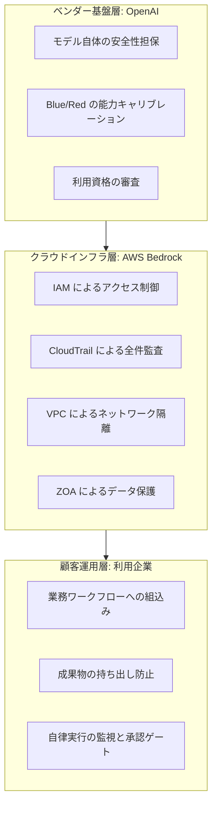

OpenAI のサイバーセキュリティ向けモデル群「Daybreak」が、Amazon Bedrock 上で提供されるようになりました。

この発表がおもしろいのは、モデルの性能そのものではありません。**「危険な使い方をさせない」という課題を、プロンプトの中ではなく、モデルの階層分けとクラウドの権限統制で解いている**点です。これは、自分たちで AI エージェントを組む側にとって、そのまま持ち帰れる設計パターンになっています。

この記事では、次の 3 点を整理します。

- Daybreak が採用した「能力の分離 + インフラ統制」という構え
- 誰が何に責任を持つのかという 3 層の責任分界
- 自社・個人環境のエージェント設計へ移植するときの具体的な判断基準

対象読者は、AI エージェントを業務に組み込む立場の方、およびその導入可否を判断する立場の方です。

*この記事の全体像。以下、順に解説します。*

## Daybreak は何を分離したのか

Daybreak は単一のモデルではなく、**用途の危険度で階層を分けた 2 つのモデル**として提供されます。

| 階層 | 想定用途 | 利用のハードル |
|---|---|---|
| Daybreak Blue (GPT-5.6 Sol) | インシデント対応、マルウェア解析、セキュアコードレビュー | 防御的ワークフロー向けに調整 |
| Daybreak Red (GPT-5.6 Cyber) | 脆弱性の発見、エクスプロイトの検証 | 厳格な身元審査。2026年9月1日以降はハードウェアキーを要求 |

ここで効いているのは、**「危ないことをしないでください」とモデルに頼むのをやめた**という判断です。

デュアルユース（防御にも攻撃にも使える）な能力は、プロンプトの言い回しで完全に封じ込めることができません。封じ込めようとすれば、正当な防御業務まで断られる使えないモデルになります。Daybreak はこのトレードオフを、モデル内部の説得ではなく**「どのモデルに誰がアクセスできるか」という外側の問題に置き換えて**解いています。

## Bedrock 側が担っているもの

AWS 上で動くことの意味は、単に「使いやすい場所にある」ことではありません。企業がすでに監査で説明できる統制基盤を、そのまま AI の利用に流用できる点にあります。

- **IAM** — 誰がどのモデルを呼べるかをロールベースで制御する
- **CloudTrail** — 誰がいつ何を呼んだかを全件記録する
- **KMS** — 保存・伝送データを組織の鍵で暗号化する
- **VPC エンドポイント** — 推論経路を閉域に閉じ、外部への持ち出し経路を減らす
- **Zero-Operator Access (ZOA)** — AWS のオペレーターであっても推論データに触れられないハードウェアレベルの保護

つまり、**「誰が」「どの環境で」「どの能力を」使うかという 3 つのゲートが重ねられている**構造です。1 つが破られても、残りが効きます。

## 3 層の責任分界

この構成は、責任が 3 つの層に分かれています。導入を検討するときは、**自分がどの層の責任を負うのかを最初に確定させる**べきです。

注意すべきは、**下に行くほど責任が具体的になり、かつ自動化されていない**ことです。上 2 層はベンダーが仕組みとして提供しますが、最下層の「どこまで自律実行を許すか」「生成物を外へ出さないか」は、利用側が設計しないと誰も設計しません。

## 自分のエージェント設計へどう移植するか

ここからが本題です。Daybreak は特殊なセキュリティ用途の話に見えますが、設計原則は一般の業務エージェントにそのまま効きます。

### 1. 能力ベース認可 - タスクの危険度でモデルと権限を分ける

万能な 1 体のエージェントに全ツールを渡す構成は、Daybreak の逆を行っています。

分けるべき軸は「調査 / 実行」と「安全 / 危険」の 2 つです。

| タスクの性質 | 与えるもの | 例 |
|---|---|---|
| 調査・要約 | 読み取り専用の認証情報のみ | ログ検索、ドキュメント参照 |
| 変更を伴う実行 | 対象を限定した書き込み権限 | チケット更新、PR 作成 |
| 不可逆な操作 | 別ロール + 承認ゲート | 本番デプロイ、データ削除 |

エージェントが 1 つでも、**呼び出すタスクごとに引き受ける IAM ロールを変える**だけで、事故の爆発半径は大きく下がります。

### 2. 実行環境の最小権限 - プロンプトを制御点にしない

「危険な操作はしないでください」というシステムプロンプトは、統制ではなくお願いです。プロンプトインジェクションで上書きされうるものを、最後の防壁にしてはいけません。

判断基準はシンプルです。

> **その制約は、モデルが完全に指示を無視しても成立するか。**

成立しないなら、それは実行環境側（IAM ポリシー、ネットワーク、ツールの実装）へ降ろすべき制約です。あわせて、全操作を CloudTrail のような改ざんしにくい監査ログに残しておくと、事後に「何が起きたか」を人間の記憶に頼らず再構成できます。

### 3. 承認ゲート - 強い能力の前に人を挟む

Daybreak Red がハードウェアキーを要求するのは、**自動化のフローの中に、意図的に人間の物理的動作を差し込んでいる**からです。

自分たちのエージェントでも同じことができます。

- 不可逆な操作の直前で停止し、実行内容の要約を提示して承認を求める
- 承認は、エージェントが自分で通せない経路（チャットの人手応答、外部の承認 UI）に置く
- 承認待ちの状態がタイムアウトしたら、続行ではなく中止に倒す

ポイントは、**承認ゲートをエージェントの内部状態にしない**ことです。エージェント自身が「承認された」と判断できる設計なら、それは承認ゲートではありません。

## 導入前に決めておく運用論点

仕組みが用意されていても、運用の取り決めがなければ機能しません。特に次の 3 点は、導入前に責任主体まで決めておく価値があります。

**資格の失効と更新**
組織の体制が変わったとき、インシデントが起きたときに、利用資格をどう失効させるか。定期審査の更新タイミングをベンダー側とどう同期するか。

**成果物の持ち出しとデータ境界**
エージェントが生成した高リスクな成果物（エクスプロイトコードなど）を境界の外へ出さない責任は、利用側にあります。AWS のデータ境界ポリシーを設計し、エージェントの外部通信経路を明示的に絞り込む必要があります。

**緊急停止の主体**
暴走時の停止手段は、AWS 側の IAM ポリシー即時無効化と、モデル提供側のセッション切断の二段構えが考えられます。ただし**「誰が判断して引くか」を事前に決めていないと、二段あっても引かれません**。ここは仕組みではなく取り決めの問題です。

## まだ確定していない点

公開情報からは、次の 2 点は読み取れませんでした。導入判断の材料としては、ベンダーへの確認事項になります。

- 利用資格が失効したとき、実行中のセッションや API 呼び出しがどの程度の遅延で強制的に切断されるのか
- Bedrock 側の IAM 条件キーで、モデル機能単位（たとえばコード実行環境の可否）のような細粒度な認可がどこまで表現できるのか

いずれも「止められること」と「絞り込めること」の限界を決める論点なので、Red 相当の強い能力を扱うなら先に潰しておくべきものです。

## まとめ

- Daybreak は、危険な能力の制御をプロンプトから**モデル階層 + アクセス権限**へ移した
- Bedrock 側の IAM / CloudTrail / VPC / ZOA が、AI 利用に既存の統制基盤をそのまま適用する
- 責任は 3 層に分かれ、**最下層（顧客運用層）は自分で設計しないと誰も設計しない**
- 自分のエージェントへ移植するなら、①タスクの危険度で権限を分ける ②プロンプトを最後の防壁にしない ③強い操作の前に人を挟む
- 資格失効・データ境界・緊急停止は、仕組みだけでなく**責任主体まで**決めておく

AI エージェントの安全性は、モデルの賢さではなく、**モデルが指示を完全に無視しても壊れない設計**で決まります。Daybreak on AWS は、その考え方を製品の形で示した事例と言えます。

この記事が少しでも参考になった、あるいは改善点などがあれば、ぜひリアクションやコメント、SNSでのシェアをいただけると励みになります！

## 参考リンク

- [Daybreak models are now available on AWS - OpenAI](https://openai.com/index/daybreak-models-are-now-available-on-aws)
- [What is Amazon Bedrock - AWS ドキュメント](https://docs.aws.amazon.com/bedrock/latest/userguide/what-is-bedrock.html)
- [AWS Identity and Access Management ユーザーガイド](https://docs.aws.amazon.com/IAM/latest/UserGuide/introduction.html)
