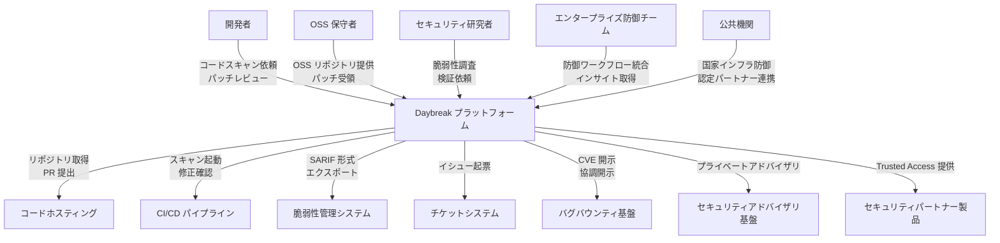
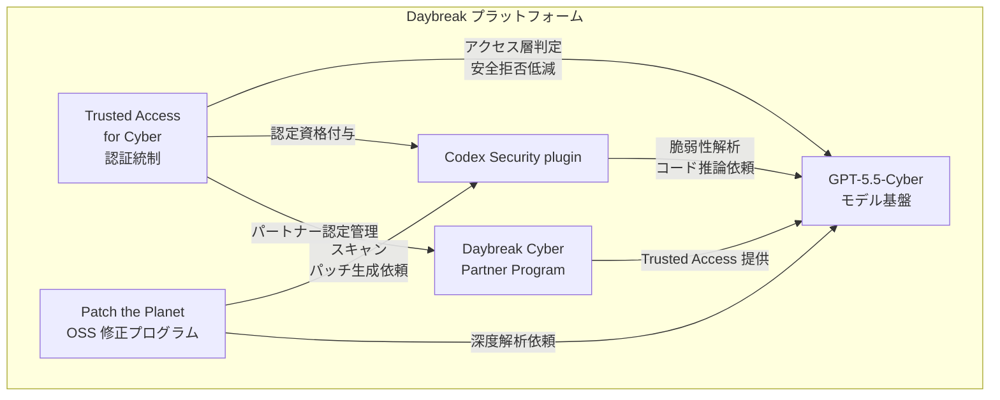
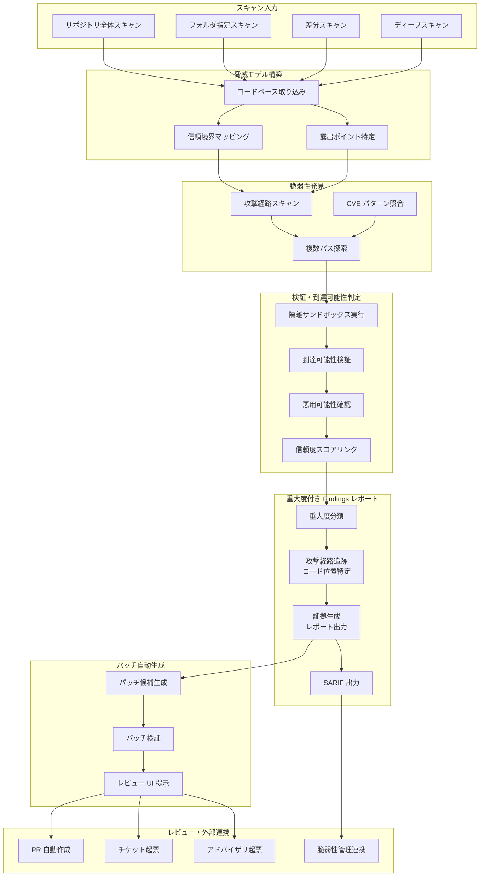
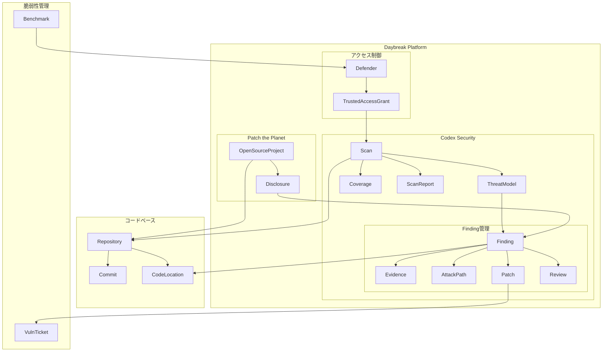
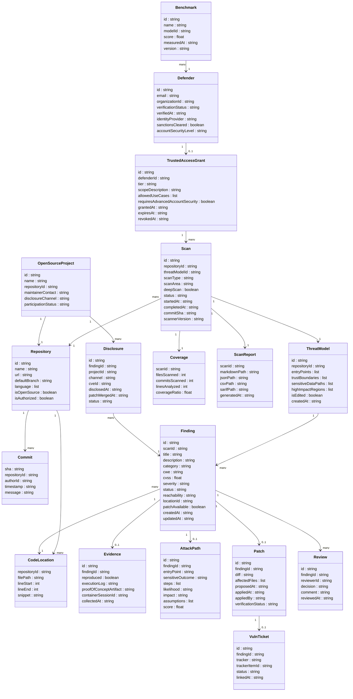
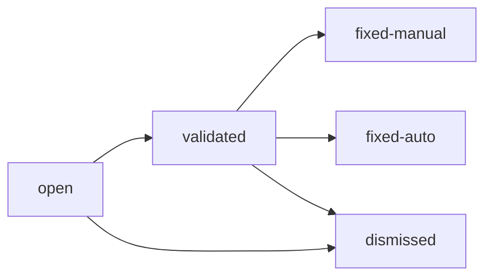

この記事は、OpenAI が 2026 年 6 月 22 日に拡張発表したサイバーセキュリティ防御基盤「Daybreak」を、構造・データ・構築・利用・運用の観点で整理した技術調査です。中核は Codex Security プラグイン、GPT-5.5-Cyber モデル、Trusted Access for Cyber プログラム、Patch the Planet イニシアチブ、Daybreak Cyber Partner Program の 5 要素です。「脆弱性を見つける」から「直す（修正自動化）」へ重心を移すという設計思想を軸に読み解きます。発表要約にとどめず、C4 と情報モデルに落として DevSecOps 運用へ接続する点が本記事の狙いです。

> 用語: 本記事では「検知」と「findings（検出された脆弱性候補）」を同義で使います。長音表記は「サーバー」式で統一します。

## ■概要

OpenAI Daybreak は、フロンティアモデル、Codex Security プラグイン、Trusted Access for Cyber（信頼済みアクセス）プログラム、パートナーエコシステムを統合したサイバーセキュリティ防御基盤です。防御側が脅威の加速に追いつけるよう設計されています。

### 何を狙うか

Daybreak の核心は「find（発見）から fix（修正）への重心移行」です。従来のセキュリティツールは脆弱性を「見つけること」に終始し、修正は人手に委ねられていました。Daybreak はスキャン → 検証 → パッチ生成 → レビューという一連のパイプラインを AI エージェントが駆動し、発見だけでなく修正まで完結させることを目指しています。

### 発表の背景

AI による脆弱性発見が加速する一方で、修正側の対応は追いついていませんでした。発見能力の増加がオープンソース保守者の修正キャパシティを超過し、「発見の洪水が保守負債を増やす」非対称性が顕在化しました。Daybreak はこの非対称性を解消する取り組みとして位置づけられています。

> Codex Security（cloud）は 2026 年 3 月にリサーチプレビューとして先行公開され、6 月 22 日に GPT-5.5-Cyber と Patch the Planet を加えて Daybreak として拡張されました。

### OpenAI の主張

目標は「サイバー防御者を加速させ、ソフトウェアを継続的に安全にする」ことです。AI 導入の価値評価軸が、検出件数ではなく修正完了速度へ移るという主張が中心にあります。

## ■特徴

### Codex Security プラグイン

Codex 上のアジェンティック（自律エージェント型）なハーネスとして動作し、次を実行します。

- **脅威モデリング**: リポジトリ固有の攻撃パスを中心に、編集可能な脅威モデルを構築します
- **脆弱性発見**: 現実的な攻撃パスと高影響コードに焦点を絞ってリポジトリを解析します
- **悪用可能性検証**: 隔離環境で脆弱性を実際にテストし、理論上の問題と実際に悪用可能な問題を分別します（偽陽性削減）
- **パッチ生成・テスト**: 修正候補を生成し、適用前に検証します
- **依存関係リスク分析**: サードパーティコンポーネントの到達可能な脆弱性を評価します

リサーチプレビュー以降の実績統計は次の通りです。

| 指標 | 数値 |
|---|---|
| スキャン済みコミット数 | 3,000 万超 |
| スキャン済みコードベース数 | 30,000 超 |
| 人手で修正済みとマークされた検知数 | 70,000 超 |
| 自動的に修正済みと判定された検知数 | 500,000 超 |

### GPT-5.5-Cyber（限定リリース）

Trusted Access for Cyber プログラムで承認済みの防御担当者向けに提供される特化モデルです。承認済みタスク（セキュアコードレビュー、脆弱性トリアージ、マルウェア解析、レッドチーミング、侵入テスト）における自動安全拒否を低減し、防御ワークフローの摩擦を減らします。

| ベンチマーク | 評価内容 | GPT-5.5 | GPT-5.5-Cyber |
|---|---|---|---|
| CyberGym | 既知脆弱性の再現能力 | 81.8% | **85.6%** |
| ExploitGym | 動作するエクスプロイト生成能力 | 25.95% | **39.5%** |
| SEC-bench Pro | 複雑ターゲットへの長期脆弱性発見 | 63.1% | **69.8%** |

### 三層アクセスモデル（Trusted Access for Cyber）

能力と安全制御のバランスを取るため、モデルアクセスを三層に分けています。

| 層 | 対象 | 主なユースケース |
|---|---|---|
| GPT-5.5（汎用） | 一般開発者・企業 | 汎用開発・知識作業 |
| GPT-5.5 + Trusted Access for Cyber | 審査済み防御担当者 | コードレビュー・マルウェア解析・検知エンジニアリング・パッチ検証 |
| GPT-5.5-Cyber | 高度検証済み担当者 | 承認済みレッドチーミング・侵入テスト |

### Patch the Planet（オープンソース修正イニシアチブ）

Trail of Bits と共同で立ち上げ、HackerOne・Calif、研究者・保守者と協力するイニシアチブです。広く使われるオープンソースプロジェクトが「発見から修正へ」移行できるよう支援します。

- **OpenAI 公式の initial participants**: cURL、NATS Server、pyca/cryptography、Sigstore、aiohttp、Go、freenginx、Python、python.org（30 超のプロジェクトが参加表明）
- Trail of Bits が公表した初週の対象には上記に加え urllib3・PyPI・Valkey・RustCrypto・SimpleX 等も含まれます（出典: Trail of Bits ブログ）
- Trail of Bits のエンジニアが検証・パッチ作成・協調開示を直接支援します
- 修正の届け方として、個別プロジェクトは HackerOne・GitHub Security Advisory・メーリングリスト等の既存のプライベート報告チャネルを使う場合があります

### Daybreak Cyber Partner Program（パートナーエコシステム）

参加パートナーは GPT-5.5 with Trusted Access for Cyber を自社のセキュリティ製品・サービスに統合し、より多くの組織に防御機能を提供します。

### 従来のセキュリティツールとの比較

| 比較項目 | SAST（静的解析） | DAST（動的解析） | SCA（ソフトウェア構成分析） | OpenAI Daybreak / Codex Security |
|---|---|---|---|---|
| アプローチ | ソースコードのパターンマッチング | 実行中アプリへのブラックボックステスト | 依存ライブラリの既知脆弱性照合 | AI によるコードベース全体の論理的攻撃パス推論 |
| 得意領域 | コーディングミスの既知パターン検出 | 認証・セッション等の実行時脆弱性 | サードパーティ依存の CVE 照合 | 文脈依存・多段階の新規脆弱性、論理的欠陥 |
| 修正までの関与 | 検知のみ（修正は人手） | 検知のみ（修正は人手） | 検知のみ（修正は人手） | 検知 → 悪用可能性検証 → パッチ生成 → テストまで一貫 |
| AI エージェント性 | なし | なし | なし | あり（自律エージェントとして動作） |
| 利用境界 | CI/CD の特定ステージ | テスト環境・本番前確認 | 依存関係管理フェーズ | 開発全フェーズに継続統合 |

SAST/DAST/SCA は既知パターンの網羅的スキャンに強みを持ちます。Daybreak は論理的・文脈依存の脆弱性と修正自動化に強みを持ちますが、リアルタイムの本番攻撃への対応（IAST/ADR 系の領域）はカバー範囲外です。

## ■構造

### ●システムコンテキスト図



#### アクター

| 要素名 | 説明 |
|---|---|
| 開発者 | Codex Security プラグインを使い、日常的なコーディングと PR 差分スキャンを行う主要ユーザー |
| OSS 保守者 | Patch the Planet を通じて AI 生成パッチを受領し、自プロジェクトの脆弱性を修正する |
| セキュリティ研究者 | 脆弱性調査・検証・レッドチーム演習を Daybreak の高権限モデルで実施する |
| エンタープライズ防御チーム | Cyber Partner Program 経由で自社セキュリティ製品に GPT-5.5 機能を統合する |
| 公共機関 | 政府・地域機関として Trusted Access for Cyber の認定を受け、国家インフラ防御に活用する |

#### 外部システム

| 要素名 | 説明 |
|---|---|
| コードホスティング | Git リポジトリを提供しスキャン対象コードを供給する。PR 提出先にもなる |
| CI/CD パイプライン | GitHub Actions 等の統合を受け、スキャン自動起動と修正確認を担う |
| 脆弱性管理システム | SARIF 形式で findings を受け取り、既存ワークフローに組み込む |
| チケットシステム | Linear / GitHub Issues / Jira として承認ゲート付きのイシューを受け取る |
| バグバウンティ基盤 | HackerOne 等として協調開示プロセスを担い、Patch the Planet と連携する |
| セキュリティアドバイザリ基盤 | GitHub Security Advisory 等としてプライベートな脆弱性開示先となる |
| セキュリティパートナー製品 | Cyber Partner Program 参加企業の製品として GPT-5.5 with Trusted Access を組み込む |

### ●コンテナ図



#### subgraph: Daybreak プラットフォーム

| 要素名 | 説明 |
|---|---|
| Codex Security plugin | コードベースを取り込み、脅威モデル構築からパッチ生成までの一貫したセキュリティワークフローを提供するアジェンティック実行基盤 |
| GPT-5.5-Cyber モデル基盤 | 深いコード分析・脆弱性検証・パッチ開発を担う特化型モデル。3 段階のアクセス層で権限を分離する |
| Trusted Access for Cyber 認証統制 | フィッシング耐性認証とアクセス層判定を行い、承認済み防御者に対して安全拒否を低減するガバナンスコンポーネント |
| Patch the Planet OSS 修正プログラム | Trail of Bits と共同で立ち上げ、HackerOne・Calif と協力し、OSS プロジェクトの脆弱性検出からパッチ提供・協調開示を支援する運用プログラム |
| Daybreak Cyber Partner Program | セキュリティパートナー企業に GPT-5.5 with Trusted Access を提供し、既存製品へ統合させるエコシステム管理コンポーネント |

### ●コンポーネント図

Codex Security の内部処理をドリルダウンします。



#### subgraph: スキャン入力

| 要素名 | 説明 |
|---|---|
| リポジトリ全体スキャン | 接続したコードベース全体を対象にした包括的スキャン |
| フォルダ指定スキャン | 特定ディレクトリに絞った範囲限定スキャン |
| 差分スキャン | プルリクエスト・コミット範囲・作業ツリーの差分を対象にしたスキャン |
| ディープスキャン | 複数パスを繰り返す長時間・高精度のスキャンモード |

#### subgraph: 脅威モデル構築

| 要素名 | 説明 |
|---|---|
| コードベース取り込み | リポジトリとコミット履歴を読み込み、システム動作を把握する |
| 信頼境界マッピング | システムが信頼するコンポーネントと外部入力の境界を可視化する |
| 露出ポイント特定 | 攻撃者が操作できる入力点と影響を受ける出力点を特定する |

#### subgraph: 脆弱性発見

| 要素名 | 説明 |
|---|---|
| 攻撃経路スキャン | 露出ポイントから機密処理までの現実的な攻撃パスを探索する |
| CVE パターン照合 | 過去の CVE 履歴から抽出したパターンを対象コードに照合する |
| 複数パス探索 | ディープスキャン時に発見パスを繰り返し実行して網羅性を高める |

#### subgraph: 検証・到達可能性判定

| 要素名 | 説明 |
|---|---|
| 隔離サンドボックス実行 | 本番環境に影響しないコンテナベースの隔離環境で脆弱性を再現する |
| 到達可能性検証 | 攻撃者制御の入力が機密処理まで実際に到達できるか確認する |
| 悪用可能性確認 | 実行詳細を収集し悪用可能性をスコアリングする |
| 信頼度スコアリング | 再現できない findings は低信頼度として分類し偽陽性を抑制する |

#### subgraph: 重大度付き Findings レポート

| 要素名 | 説明 |
|---|---|
| 重大度分類 | 到達可能性・影響・信頼度を総合して findings を重大度順に並べる |
| 攻撃経路追跡・コード位置特定 | 入力点から出力点への経路と影響コード位置を記録する |
| 証拠生成 | 監査対応のレポートファイルとして証拠を生成する |
| SARIF 出力 | 外部セキュリティツールと連携するための標準フォーマットで出力する |

#### subgraph: パッチ自動生成

| 要素名 | 説明 |
|---|---|
| パッチ候補生成 | 確認済み脆弱性に対してテスト付きのパッチ案を生成する |
| パッチ検証 | 生成パッチを自動検証し、修正の有効性を確認する |
| レビュー UI 提示 | 人間レビュアーが findings・証拠・パッチを一覧確認できる UI を提供する |

#### subgraph: レビュー・外部連携

| 要素名 | 説明 |
|---|---|
| PR 自動作成 | 人間の承認後にコードホスティングへプルリクエストを提出する |
| チケット起票 | Linear / GitHub Issues / Jira に承認ゲート付きでイシューを起票する |
| アドバイザリ起票 | プライベートなセキュリティアドバイザリを協調開示フローに乗せる |
| 脆弱性管理連携 | SARIF 等の形式で既存の脆弱性管理システムに findings を送出する |

## ■データ

### ●概念モデル

主要エンティティと所有・利用関係を示します。



### ●情報モデル

各エンティティの主要属性を示します。



### ●Finding の状態遷移



| 状態 | 説明 |
|---|---|
| open | スキャンで検出、未検証 |
| validated | 隔離環境での再現に成功、証拠あり |
| fixed-manual | 人手で修正済み（レビュー経由） |
| fixed-auto | 自動修正の適用で解消を確認 |
| dismissed | 偽陽性または対応不要と判断 |

### ●値域定義（概念モデル上の例示値）

以下の属性名・列挙値は本記事が再構成した概念モデル上の例示であり、OpenAI 内部や API の正式キーではありません。

Finding.severity の値域です。

| 値 | 説明 |
|---|---|
| critical | CVE レベル、即時対応必須 |
| high | 高危険度 |
| medium | 中程度 |
| low | 低危険度 |
| informational | 参考情報 |

TrustedAccessGrant.tier の値域です。

| 値 | 説明 |
|---|---|
| standard | GPT-5.5 標準アクセス |
| trusted-cyber | 検証済み防御者向け拡張アクセス |
| gpt55-cyber | 承認済みレッドチーム・侵入テスト向け最上位アクセス |

Benchmark エンティティの実測値です。

| name | modelId | score |
|---|---|---|
| CyberGym | gpt-5.5-cyber | 85.6% |
| CyberGym | gpt-5.5 | 81.8% |
| ExploitGym | gpt-5.5-cyber | 39.5% |
| ExploitGym | gpt-5.5 | 25.95% |
| SEC-bench Pro | gpt-5.5-cyber | 69.8% |
| SEC-bench Pro | gpt-5.5 | 63.1% |

補足として、エンティティ間で紛らわしい属性の使い分けを示します。

| 属性 | 意味 |
|---|---|
| Patch.appliedAt | スキャン対象リポジトリ内部へパッチを適用した日時 |
| Disclosure.patchMergedAt | Patch the Planet 経由で OSS リポジトリ（外部）へパッチがマージされた日時 |
| TrustedAccessGrant.scopeDescription | 付与スコープの自由記述。allowedUseCases は機械可読なユースケース列挙 |

Benchmark エンティティは概念上プラットフォームレベルの参照情報です。本モデルでは Defender が利用可能なモデル層と関連づけるために `Benchmark → Defender` の経路を置いていますが、ベンチマーク自体は特定 Defender の保有物ではありません。

> 上記の属性・状態値・値域は、公式ドキュメントの記述と挙動から構成した概念モデルです。内部実装の正式なスキーマ名とは異なる場合があります。

## ■構築方法

> 以下のセットアップ手順は公式ドキュメント（developers.openai.com/codex/security 系）と二次情報から構成しています。限定リリースのため、UI 文言やパスは変更される場合があります。

### Codex Security プラグインの前提条件

| 要件 | 内容 |
|---|---|
| ChatGPT プラン | Codex を利用できるプラン（Business / Enterprise / Edu / Pro 系） |
| Codex Cloud 接続 | GitHub リポジトリを Codex Web に接続済みであること |
| Codex 環境 | スキャン対象リポジトリの Codex 環境が作成済みであること |
| GitHub App スコープ | Codex Cloud の連携設定から OpenAI アプリの権限を確認 |

### Codex Security プラグインのインストール

**Web 経由:**

1. Codex Web でスキャン対象のリポジトリを開きます
2. 「Codex Security プラグインをインストール」を選択します
3. マーケットプレイスからプラグインがインストールされます
4. インストール完了後、新しいスレッドを開始します（既存スレッドへの遡及適用は不可）

**CLI 経由:**

```bash
# Codex CLI を起動し、対象リポジトリのディレクトリで実行
codex

# CLI 内でプラグインブラウザを開く
/plugins
```

プラグイン一覧から「Codex Security」を検索してインストールし、新規スレッドを開始します。

### GitHub リポジトリの接続と環境設定

Codex Cloud 側で GitHub 連携済みのリポジトリを利用します（具体の UI パスは変更される場合があります）。

1. GitHub 組織・リポジトリを選択して OpenAI アプリを承認します
2. Codex の「Environments」でリポジトリ環境を確認します
3. 環境が無い場合は「Create environment」で作成します

### セキュリティスキャンの初期設定

スキャン作成画面で次を設定します。

| 設定項目 | 内容 |
|---|---|
| GitHub 組織 | スキャン対象の組織を選択 |
| リポジトリ | スキャン対象のリポジトリを選択 |
| ブランチ | スキャン対象のブランチを選択 |
| 環境 | 事前作成した Codex 環境を選択 |
| 履歴ウィンドウ | スキャン対象とするコミット履歴の範囲 |

履歴ウィンドウの選択目安は次の通りです（公式 setup docs は履歴ウィンドウの存在と「長いほどバックフィルに時間がかかる」点のみ記載。以下の数値は運用ノウハウとしての推奨値で、公式の指針ではありません）。

| コードベースの状態 | 推奨ウィンドウ |
|---|---|
| 活発に開発中のアプリ | 30〜60 日 |
| 本番稼働サービス | 6〜12 ヶ月 |
| レガシーコードベース | 全履歴 |

スキャンを作成するとコミット単位のバックフィルが開始されます。中規模リポジトリでは数時間を要します。

### Trusted Access for Cyber への申請

Trusted Access for Cyber は、検証済みのセキュリティ防御担当者に対して、防御ワークフローへの緩和された拒否判定を付与するプログラムです。

公式で確認できるのは「審査・承認された防御者向け」「フィッシング耐性のアカウントセキュリティ」「2026 年 6 月 1 日以降 Advanced Account Security 必須」までです。以下の対象組織類型・申請手順の細部は二次情報に基づく運用推定で、公式の正式手順とは異なる場合があります。

対象は重要インフラ事業者、セキュリティベンダー・MSSP、国家レベルの CERT、バグバウンティプラットフォーム、レッドチーム・侵入テスト業務を持つ組織です。

**個人の申請手順:**

1. 申請ページにアクセスします
2. 本人確認（Identity Verification）を実施します
3. 承認後、利用権限が付与されます

**エンタープライズの申請手順:**

1. OpenAI アカウント担当者に連絡します
2. 組織の防御担当者としての審査を受けます
3. 組織全体にアクセスがプロビジョニングされます

**フィッシング耐性認証の要件:**（具体手順は限定リリース段階で公式ドキュメントが十分に公開されておらず、以下は二次情報に基づく暫定情報です）

個人メンバーは Advanced Account Security を有効化します。

- パスキーまたは物理セキュリティキーを登録します
- 組織の場合は SSO ワークフローにフィッシング耐性認証を実装し、OpenAI に対して証明します

公式一次情報で強く確認できるのは「フィッシング耐性のアカウントセキュリティ」「2026 年 6 月 1 日以降の Advanced Account Security 必須」「`chatgpt.com/cyber` への導線」までです。個別の登録ステップは運用上の想定を含みます。

### GPT-5.5-Cyber へのアクセス取得

GPT-5.5-Cyber は限定リリース段階です。Trusted Access for Cyber の中でもさらに厳格に選定された組織のみが対象です。

- アクセス経路: OpenAI エンタープライズセールス、または Trusted Access パートナーチャネル
- 追加要件: アカウントレベルの監視への同意、利用スコープ制限の受諾、最高位の本人確認

## ■利用方法

### 必須前提

| 前提条件 | 内容 |
|---|---|
| ChatGPT プラン | Codex を利用できるプラン |
| Codex Security プラグイン | インストール済み・新規スレッドで起動済み |
| GitHub 接続 | Codex Cloud に対象リポジトリ接続済み |
| 推奨モデル | 推論努力 high または xhigh |
| 認証（Trusted Access 機能使用時） | フィッシング耐性認証を有効化済み |

### スキャンの実行

新規スレッドで次のプロンプトを送信します。

```
Run a Codex Security scan on this repository.
```

スキャン設定ワークスペースが開きます。初回はデフォルト設定での実行を推奨します。

| 設定項目 | 初回推奨値 |
|---|---|
| スキャンタイプ | Codebase |
| ディープスキャン | オフ |
| スキャン範囲 | Entire codebase |
| 脅威モデルガイダンス | 空欄（特定の攻撃ベクトルがある場合のみ入力） |

スキャン対象の選択パターンは次の通りです。

| 用途 | 設定 |
|---|---|
| コードベース全体 | Scan area: Entire codebase |
| 特定フォルダ | Scan area でディレクトリを指定 |
| 最近のコミット | 履歴ウィンドウを短く設定（例: 7 日） |
| 特定の変更（PR レビュー前） | プロンプトでブランチ差分を指定 |

### 脅威モデルの確認・編集

初回スキャン完了後、自動生成された脅威モデルを Markdown で確認・編集します。精度向上のため次のセクション構成（一例）を定義します。

```markdown
## Entry Points
- ...

## Trust Boundaries
- ...

## Sensitive Data Paths
- ...

## Review Priorities
- ...
```

### findings のレビュー

findings ワークスペースで次のフィルタが利用できます。

| フィルタ項目 | 説明 |
|---|---|
| severity | Critical / High / Medium / Low |
| category | 脆弱性カテゴリ |
| directory | 対象ディレクトリ |
| patch status | パッチ生成済み / 未生成 |
| review status | レビュー済み / 未レビュー |

各 finding の詳細では、攻撃経路のトレース、脆弱なコード位置、サンドボックス再現結果、悪用可能性評価が表示されます。サンドボックス検証済み（Validated）の findings を優先して対応します。

### パッチの生成・適用

1. finding の詳細で「Generate Patch」を選択します
2. Codex がサンドボックス検証済みパッチを生成します
3. パッチの差分をレビューします
4. 「Create Pull Request」でリポジトリに PR を作成します
5. 通常のコードレビュープロセスを経てマージします

パッチは自動適用されません。必ず人手によるレビュー後にマージします。

### レポートの確認

スキャン完了後、次のファイルが自動生成されます。

| ファイル | 用途 |
|---|---|
| `report.md` | 可搬型の完全レポート（共有・保存用） |
| `scan-manifest.json` | スキャン設定・メタデータ |
| `findings.json` | 構造化された findings データ |
| `coverage.json` | スキャンカバレッジ情報 |

外部エクスポートは SARIF、Linear / GitHub / Jira issue（承認ゲート付き）、GitHub Security Advisory（プライベートドラフト）に対応します。

### CI/CD への統合（Codex Security 公式統合ではなく、汎用 Codex による代替自動化案）

ここで示すのは Codex Security プラグインの公式 CI 統合機能ではなく、汎用 Codex による近似運用案です。プラグイン自体の GitHub Actions 統合手順は限定リリースのため公式には未公開です。CI 上でセキュリティスキャンを回す場合は、汎用の `openai/codex-action` を使い、`prompt`（または `prompt-file`）でスキャンを指示する形が基本形となります。`openai/codex-action` の入力は `prompt` / `prompt-file` / `output-file` / `sandbox` / `codex-args` などで、承認の粒度は `sandbox`（`read-only` / `workspace-write`）と CLI フラグで制御します。`approval_mode` という専用キーは存在しません。

下記はドキュメント化された入力に基づく **非公式の概念例** です（`security-diff-scan` のような専用コマンド文字列は公式 action では確認できていません）。

```yaml
# .github/workflows/codex-security.yml （概念例）
- uses: openai/codex-action@v1
  with:
    prompt: "Run a Codex Security scan on the diff against origin/main and write findings to security-report.md"
    sandbox: read-only
    output-file: security-report.md
  env:
    OPENAI_API_KEY: ${{ secrets.OPENAI_API_KEY }}
```

findings の追跡・連携は、プラグインの export-findings 機能から承認ゲート付きで Linear / GitHub / Jira issue に出す経路が公式に用意されています。

## ■運用

### findings のトリアージ運用

Codex Security は隔離環境での再現可否で findings を validated / unvalidated に分けます。トリアージの基本フローは次の通りです。

1. findings ワークスペースを severity・category・directory・patch status・review status の各軸でフィルタリングします
2. validated な findings を優先キューに積みます
3. unvalidated findings は信頼度が低い扱いとし、バックログに回します
4. severity が HIGH 以上かつ validated の findings を「対処必須」として担当者にアサインします
5. 必要に応じて SARIF 等でエクスポートし、Jira / Linear / GitHub Issues に承認ゲート付きで連携します

Patch the Planet の運用モデルでは、Trail of Bits のエンジニアが AI の生出力を受け取り、重複排除・重大度再評価・パッチ作成・開示調整を行ってから OSS 保守者に届けます。自組織でも「AI 出力 → 専任レビュー担当 → 開発者」という 2 段構えのトリアージを推奨します。

### 修正完了率（fix completion）中心の指標設計

AI 防御基盤の価値評価軸は検出件数から修正完了率へ移行しています。

| 指標 | 定義 | 推奨 SLA 目安 |
|---|---|---|
| fix completion rate | findings のうち patch がマージ済みになった割合 | Critical: 7 日以内 90% 以上 |
| MTTR | 検出から fix が本番到達までの時間 | Critical: 7 日、High: 30 日 |
| validation rate | サーフェスされた findings のうち再現確認済みの割合 | 50% 以上が望ましい |
| false positive ratio | unvalidated findings の全体比 | 継続的に低下傾向を確認 |
| patch acceptance rate | AI 生成パッチが人手レビューを通過してマージされた割合 | — |
| recurrence rate | 同一 CWE 分類の再発率 | 低下傾向を月次確認 |

検出件数の絶対値ではなく、上記指標が週次・月次で改善しているかを KPI とします。

### 到達可能性判定による優先度付け

CVSS スコアだけでは優先度を正しく付けられません。次の 4 軸で補正します。

- **exploit signal**: KEV 登録有無・EPSS スコア・公開 PoC 有無
- **exposure**: インターネット公開エンドポイント経由で到達可能か
- **criticality**: 対象コンポーネントが本番 / PII / 決済パスを含むか
- **effort**: 設定変更で直るか、大規模リファクタリングが必要か

脅威モデルを編集してスコープ外コンポーネントを除外すると、到達不可能な findings のノイズを事前に削減できます。

### CI/CD への組み込み運用

次は `openai/codex-action` のドキュメント化された入力に基づく概念例です（`prompt` でスキャンを指示し、Critical 検出でジョブを失敗させます）。

```yaml
name: Codex Security Diff Scan
on: [pull_request]
jobs:
  security-review:
    runs-on: ubuntu-latest
    steps:
      - uses: actions/checkout@v4
        with:
          fetch-depth: 0
      - uses: openai/codex-action@v1
        with:
          prompt: "Run a Codex Security scan on the diff against origin/main and write findings to security-report.md"
          sandbox: read-only
          output-file: security-report.md
        env:
          OPENAI_API_KEY: ${{ secrets.OPENAI_API_KEY }}
      - name: Block on critical findings
        run: |
          if grep -qi "critical" security-report.md; then
            echo "::error::Critical security findings detected"
            exit 1
          fi
```

スキャン種別と用途は次の通りです。

| スキャン種別 | 発動タイミング | 用途 |
|---|---|---|
| 差分スキャン | PR / MR 作成時 | 差分コードの回帰チェック。ブロックゲートとして使う |
| 全体スキャン | スケジュール（夜間・週次） | コードベース全体の定期チェック |
| ディープスキャン | リリース前・四半期レビュー | 高 recall スキャン。初回は数時間〜数日かかる |
| 個別 fix | findings レビュー後 | 個別 finding のパッチ生成。書き込み権限が必要 |

> パッチ生成は書き込み権限を要するため、読み取り専用の差分スキャンとは分けて実行します。

### 誤検知（false positive）の扱い

1. **`AGENTS.md` にプロジェクト固有のセキュリティ文脈を記述する**: 利用している認証機構・信頼境界・意図的に許容するリスクを明文化します
2. **脅威モデルのスコープを絞る**: テスト専用ディレクトリやサードパーティコードを対象外にします
3. **補助フィルタを掛ける**: プロジェクト固有の安全パターンをホワイトリスト化します
4. **誤検知をフィードバックする**: システムのキャリブレーションに使われます

### 修正パッチのレビュー運用

Codex Security プラグインはパッチをリポジトリに自動適用しません。finding 詳細から「Generate Patch」でサンドボックス検証済みパッチを生成し、差分をレビューしてから「Create Pull Request」で PR を作成する流れが基本です。最終的なマージは通常のコードレビュープロセスを経ます。

CLI から自動化する場合の承認・実行粒度は、専用の承認モードキーではなく Codex CLI の `--ask-for-approval`（`untrusted` / `on-request` / `never`）と `--sandbox` で制御します（執筆時点の `codex --help` 準拠）。読み取り専用の差分スキャンと、書き込みを伴うパッチ生成は分けて実行します。

パッチレビューでは、脆弱な挙動が再現されないか、既存テストが通過するか、副作用・機能退行が無いか、パッチ範囲が finding のスコープに収まるかを確認します。

### 脆弱性管理 / チケットシステムへの接続運用

```bash
# SARIF 出力を GitHub Code Scanning にアップロードする例
gh api repos/{owner}/{repo}/code-scanning/sarifs \
  --method POST \
  --field commit_sha="$(git rev-parse HEAD)" \
  --field ref="refs/heads/main" \
  --field sarif="$(gzip -c findings.sarif | base64)"
```

- **Jira / Linear / GitHub Issues 連携**: findings ワークスペースから個別 finding を承認ゲート付きでチケット化します（バルクエクスポートはしない）
- **GitHub Security Advisory**: 外部公開前に private draft として登録し、協調開示を経てから公開します
- **チケット SLA ルール例**: `severity=CRITICAL AND validated=true` → P1 自動アサイン、7 日以内クローズ必須

### 保守負債（findings 洪水）の吸収方法

**原則 1: レート制御** — 一度に大量の findings を流し込みません。週あたりの上限を設けて消化速度を管理します。

**原則 2: 修正セットに付加価値を付ける** — bug fix 単体ではなく、ファジングハーネス・CI スキャン設定・サプライチェーンツールをセットにして PR を作成すると、保守者の負担感が下がりマージ率が上がります。

**原則 3: 自動修正可能なものと人手必須なものを分離する**

| カテゴリ | 自動修正の可否 | 対処 |
|---|---|---|
| 既知パターンの依存パッケージ更新 | 可 | 自動 PR 作成 + 依存更新ツール連携 |
| ロジック変更を伴う脆弱性修正 | 要人手レビュー | 人手レビュー前提で PR 提出 |
| アーキテクチャ変更が必要な問題 | 不可 | 別途設計タスクとして切り出す |

**原則 4: バックログに年齢バケットを設ける** — `< 30 days` / `30–90 days` / `> 90 days` の 3 バケットで aging を管理し、`> 90 days` かつ validated の findings を月次でレビューします。

## ■ベストプラクティス

### 検出件数 KPI から修正完了率中心への再設計

旧 KPI（検出 findings 総数・スキャン実行回数・行数ベースのカバレッジ率）から、新 KPI（重大度帯別の fix completion rate・MTTR・patch acceptance rate・recurrence rate・誤検知率の月次推移）へ移します。ダッシュボードは fix completion rate を主軸に配置し、検出件数は補助指標として扱います。

### 到達可能性ベースの優先度付け

- コードベース内の到達可能性だけでなく、デプロイ環境での到達可能性も確認します
- DAST を組み合わせ、本番環境での到達可能性を検証します
- 到達可能性確認前は findings を「コード上のリスク」として扱い、CVSS スコア単独での escalation を避けます

### AI 生成パッチの人手レビュー必須化

- AI 生成パッチは必ず人手レビューを経由させます（完全自動での本番適用は避ける）
- レビューチェックリスト: 脆弱な動作が再現されないか / 既存テストが通過するか / パッチ範囲が finding のスコープに収まるか / 新たな攻撃面を生んでいないか
- LLM はもっともらしいが誤ったセキュリティ説明を生成することがあります

### Trusted Access による利用境界統制

公式のアクセス体系は、製品プラン（個人 / エンタープライズ）ではなく次の 3 アクセスレベルです。

- **GPT-5.5（default）**: 一般利用。標準の安全制御が適用されます
- **GPT-5.5 with Trusted Access for Cyber**: 審査・承認された防御者向け。承認済み防御タスクの自動安全拒否を低減します
- **GPT-5.5-Cyber**: さらに高度に検証された防御者向け。承認済みレッドチーミング・侵入テストに限定使用します

申請経路（個人は本人確認、エンタープライズは OpenAI 担当者経由）や組織運用は、このアクセスレベルとは別軸で設計します。一般的な DevSecOps 運用は Trusted Access for Cyber までで十分であり、GPT-5.5-Cyber は高度な専門チームに限定します。

```toml
# ~/.codex/config.toml — セキュリティプロファイルの設定例
[profiles.security]
model = "gpt-5.5"
model_reasoning_effort = "high"
```

### OSS 保守者の負荷を増やさない運用

- findings を直接保守者に届けません。重複排除・重大度再評価・パッチ作成・テスト追加を済ませてから PR を提出します
- PR には「修正 + テスト + ファジングハーネス + CI スキャン設定」をセットにします
- 協調開示を経由し、公開前に保守者と合意します
- `AGENTS.md` にプロジェクト固有のセキュリティガイダンスを記述し、将来の誤検知を減らします

### 自律性より制御可能性

- CLI の `--ask-for-approval never` のような低摩擦実行はバックログ処理に有効ですが、本番コードには承認ゲートを必ず設けます
- スキャンの非決定性を考慮し、繰り返しスキャンの結果を人手でレビューしてから確定します
- deep scan はオフピーク帯にスケジュールし、API クォータ圧迫を避けます
- audit trail を外部保存し、インシデント時の追跡可能性を確保します

## ■トラブルシューティング

| 症状 | 原因 | 対処 |
|---|---|---|
| findings 件数が多すぎてトリアージが追いつかない | 脅威モデルのスコープが広すぎる / unvalidated まで処理対象にしている | 脅威モデルを編集して攻撃面を絞る。validated かつ severity>=HIGH のみ優先キューに積む。週次処理上限を設ける |
| AI 生成パッチが機能退行を引き起こした | パッチ範囲が finding スコープを超えている / 副作用の検証不足 | 人手承認を挟む実行に戻す。適用前に再現テストを必ず実行する。レビューチェックリストを義務化する |
| 誤検知が多く開発者がアラートを無視する | 脅威モデルにプロジェクト固有の文脈がない / `AGENTS.md` 未整備 | `AGENTS.md` にセキュリティ文脈を記述する。誤検知をフィードバックしてキャリブレートする |
| 正常系メトリクスだけ見て本番の脆弱な動作を見逃す | コード静的解析のみで動的検証が未実施 | DAST を CI/CD の後段に組み込む。認可制御・CORS・TLS 設定はランタイムテストで検証する |
| 正規の防御タスクが安全拒否でブロックされる | Trusted Access 未登録 / セッション文脈で classifier が発火 | Trusted Access に登録する。プロンプトに防御文脈を明示する。誤った rerouting をフィードバックする |
| Trusted Access 登録後も安全拒否が続く | セッション内の語彙クラスターが classifier を発火させている | 新規セッションで文脈をリセットする。エンタープライズ Tier に昇格申請する |
| deep scan がタイムアウトまたは途中で止まる | 大規模リポジトリで初回スキャンに数時間〜数日かかる（想定内） | 最後まで継続するよう明示的に指示する。オフピーク帯にスケジュールして API クォータ競合を避ける |
| CI で同じ findings が毎回検出される | ベースブランチ設定が古い / git 履歴が浅い | `fetch-depth: 0` を指定する。ベースブランチを `origin/main` に明示する |
| OSS 保守者が PR を無視・拒否する | 大量の無関係 findings・重複・未検証パッチが届いている | 人手レビュー済みの高信頼 findings のみ届ける。PR に修正理由・影響範囲・テスト証拠をセットで記載する |

## ■まとめ

OpenAI Daybreak は、Codex Security による脆弱性の発見から検証・パッチ生成・連携までを 1 本の運用線でつなぎ、GPT-5.5-Cyber と Trusted Access for Cyber で能力と利用境界を分離した防御基盤です。価値評価軸が「検出件数」から「修正完了速度」へ移る流れを、AI エージェント運用で重要なのは自律性より制御可能性、という視点で捉えると現場の設計指針が見えてきます。

この記事が少しでも参考になった、あるいは改善点などがあれば、ぜひリアクションやコメント、SNSでのシェアをいただけると励みになります！

## ■参考リンク

- 公式ドキュメント
  - [Codex Security | OpenAI Developers](https://developers.openai.com/codex/security)
  - [Codex Security plugin | OpenAI Developers](https://developers.openai.com/codex/security/plugin)
  - [Codex Security setup | OpenAI Developers](https://developers.openai.com/codex/security/setup)
  - [Codex Security FAQ | OpenAI Developers](https://developers.openai.com/codex/security/faq)
  - [Deep security scan | OpenAI Developers](https://developers.openai.com/codex/use-cases/deep-security-scan)
  - [Cyber safety | OpenAI Developers](https://developers.openai.com/codex/concepts/cyber-safety)
- 公式発表 / ブログ
  - [Daybreak: Tools for securing every organization in the world | OpenAI](https://openai.com/index/daybreak-securing-the-world/)
  - [Daybreak | OpenAI for cybersecurity](https://openai.com/daybreak/)
  - [Scaling Trusted Access for Cyber with GPT-5.5 and GPT-5.5-Cyber | OpenAI](https://openai.com/index/gpt-5-5-with-trusted-access-for-cyber/)
  - [Patch the Planet: a Daybreak initiative to support open source maintainers | OpenAI](https://openai.com/index/patch-the-planet/)
  - [Introducing Patch the Planet | Trail of Bits Blog](https://blog.trailofbits.com/2026/06/22/introducing-patch-the-planet/)
- GitHub
  - [Codex Security false positive classifier issue | GitHub](https://github.com/openai/codex/issues/19738)
- 記事 / 二次情報
  - [DevSecOps vulnerability management | Cloudaware](https://cloudaware.com/blog/devsecops-vulnerability-management/)
  - [Vulnerability prioritization: why CVSS isn't enough | Picus Security](https://www.picussecurity.com/resource/blog/vulnerability-prioritization-why-cvss-isnt-enough)
  - [Codex Security plugin: local vulnerability scanning | Daniel Vaughan](https://codex.danielvaughan.com/2026/06/03/codex-security-plugin-local-vulnerability-scanning-diff-review-remediation-cli/)
  - [OpenAI launches new security tools and updates GPT-5.5-Cyber | Testing Catalog](https://www.testingcatalog.com/openai-launches-new-security-tools-and-updates-gpt-5-5-cyber/)
  - [OpenAI expands Daybreak with GPT-5.5-Cyber and Codex Security | Investing.com](https://www.investing.com/news/stock-market-news/openai-expands-daybreak-with-gpt55cyber-and-codex-security-93CH-4753430)
  - [OpenAI Launches GPT-5.5-Cyber and Patch the Planet | MLQ News](https://mlq.ai/news/openai-launches-gpt-55-cyber-and-patch-the-planet-to-fix-open-source-vulnerabilities-at-scale/)
  - [OpenAI Daybreak Explained | Kingy AI](https://kingy.ai/ai/openai-daybreak-explained-inside-gpt-5-5-cyber-codex-security-and-the-new-frontier-of-ai-cyber-defense/)
