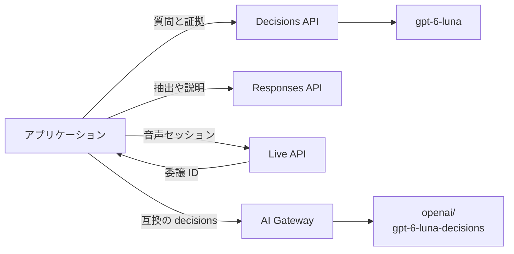
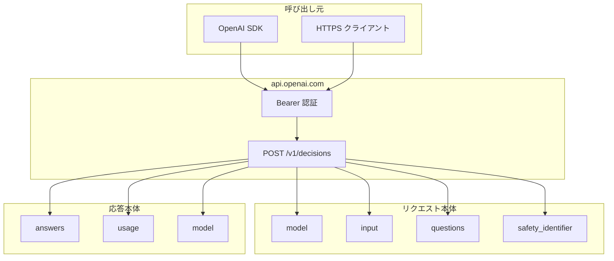
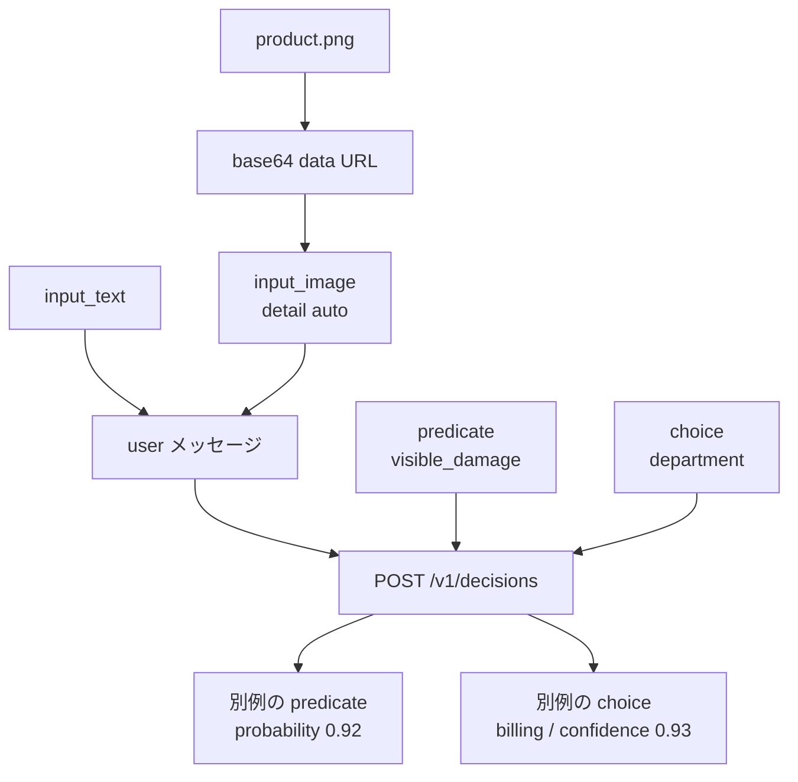
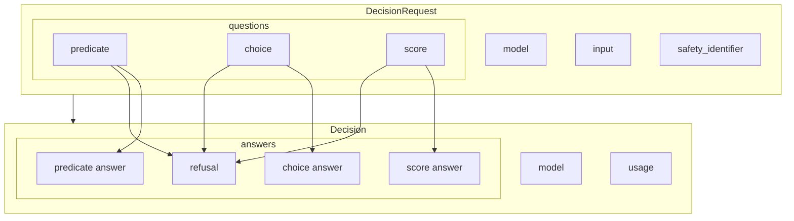
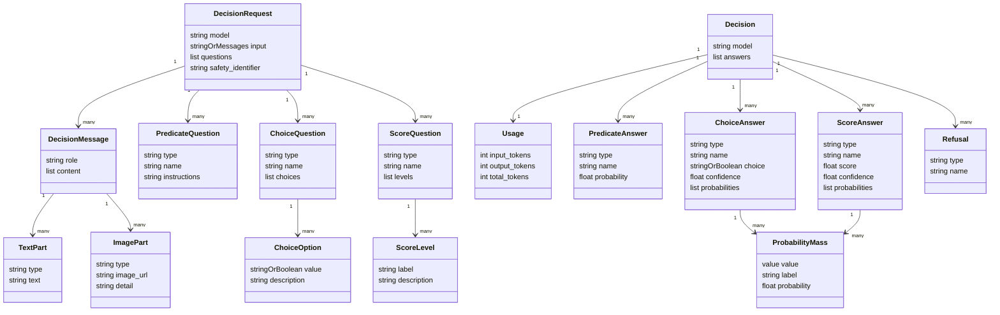
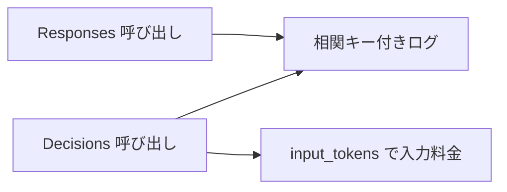

OpenAI Decisions API は、共有の入力に対して型つきの質問へ答えを返す専用エンドポイントです。文章を生成する Responses API とは別の `POST /v1/decisions` を使います。2026-10-06 の [Changelog](https://developers.openai.com/api/docs/changelog) は、モデル `gpt-6-luna` 付きの Decisions API をベータとして公開したと記録しています。2026-10-08 時点の [Decisions ガイド](https://developers.openai.com/api/docs/guides/decisions) では、指定できるモデルは `gpt-6-luna` だけです。ガイドは、数週間以内の GA を見込んでいます。

1 リクエストは `model`、`input`、`questions` の 3 要素です。応答の `answers` は質問を送った順に並び、質問へ付けた `name` をエコーします。質問型は `predicate`、`choice`、`score` の 3 つです。返すものは、条件の確率、固定集合からの選択、ルーブリック上のスコアです。

この記事では、リクエストと応答の形、直 OpenAI と Vercel AI Gateway の呼び分け、入力トークン料金の読み方、音声の client delegation との接続を、2026-10-08 時点の公開ドキュメントに沿ってまとめます。想定読者は、分類、振り分け、優先度づけを API で実装する人です。


*この記事の全体像。以下、順に解説します。*

## Decisions APIとは

Decisions API は、テキスト、画像、またはその両方を評価し、型つきの答えを返します。ガイドは、Responses API より約 10 倍速い、と位置づけます。Changelog も 10 倍と書きます。用途としてガイドが挙げるのは、コンテンツ分類、リクエストの振り分け、作業の優先順位づけです。

応答が担う範囲は、条件の確率、固定集合からの選択、ルーブリック上のスコアです。自分の JSON スキーマに沿った抽出や説明文は、[Structured Outputs](https://developers.openai.com/api/docs/guides/structured-outputs) です。ツール名と引数が要るときは [function calling](https://developers.openai.com/api/docs/guides/function-calling) です。

音声では [Live API の client delegation](https://developers.openai.com/api/docs/guides/live-delegation) と組み合わせます。GPT-Live が会話を続け、アプリが Decisions で行動を選び、結果を同じ delegation ID で返します。手順は [音声と Decisions](https://developers.openai.com/api/docs/guides/decisions-voice) にあります。

公式 Playground は <https://platform.openai.com/decisions> です。

## 特徴

質問型は 1 リクエストの中で混ぜられます。同じ `input` に対して、predicate と choice を並べて聞けます。モデルが質問を拒むと、その要素だけ `type` が `refusal` になります。同じリクエストの他の質問は答えを受け取れます。

| 型 | 主結果 | 一緒に返るもの |
|---|---|---|
| `predicate` | 条件が真である推定確率 `probability`（0 から 1） | 質問名。`confidence` はスキーマ断片に無い |
| `choice` | 渡した値のどれか 1 つである `choice` | 分布 `probabilities` と別フィールド `confidence` |
| `score` | 段階インデックスの確率加重平均 `score`。段階の間の値を取れる | 段階の分布と `confidence` |

画像はインラインの base64 data URL です。[Create a decision](https://developers.openai.com/api/reference/resources/decisions/methods/create) は、1 リクエストあたり最大 128 枚と書きます。`detail` は `low`、`high`、`auto`、`original` で、既定は `auto` です。外部 URL と file ID は、Create が非対応と書きます。

直 OpenAI の料金について、ガイドは次のように書きます。`gpt-6-luna` の入力は 100 万トークンあたり 0.10 ドルです。キャッシュ読み、キャッシュ書き、出力トークンの課金は無い、とガイドが書きます。地域処理の割増と長文入力の料金倍率は `/v1/decisions` に適用される、とも書きます。数値の正本は、モデルと処理ティアの [料金](https://developers.openai.com/api/docs/pricing) です。

ガイドは、対象顧客に Zero Data Retention と HIPAA 利用をサポートする、と書きます。データ居住と地域処理は米国と欧州（EEA とスイス）です。適格条件は [Your data](https://developers.openai.com/api/docs/guides/your-data) へ委任しています。

ガイド例が実行に求める OpenAI SDK の下限は、Python 3.26.0、JavaScript 7.30.0、Go 3.73.0、Ruby 0.101.0、Java 4.78.0 です。入口は [Libraries](https://developers.openai.com/api/docs/libraries) です。

| 手段 | 返すもの | ガイドが示す使い分け |
|---|---|---|
| Decisions `POST /v1/decisions` | 確率、選択、スコア、拒否 | 分類、振り分け、優先度 |
| Structured Outputs | 指定 JSON スキーマのオブジェクト | 抽出フィールド、説明文 |
| function calling | ツール名と引数 | モデルからツールを要求する |
| Live API client delegation | 会話の継続と結果の返却 | 音声で行動を選ぶときの外側 |

呼び出し経路でモデル ID の文字列が分かれます。

| 呼び出し経路 | モデル ID | 画像 | 認証 |
|---|---|---|---|
| OpenAI 直 | `gpt-6-luna` | data URL。最大 128 枚 | OpenAI API キー |
| Vercel AI Gateway の OpenAI 互換 `/v1/decisions` | `openai/gpt-6-luna-decisions` | 2026-10-07 の Gateway 文書は `input_image` を 400 と書く | AI Gateway キーまたは Vercel OIDC |
| `llm-openai-decisions` 0.1 | `openai-decisions/gpt-6-luna` | プラグインが URL またはローカルファイルを data URL にする | `OPENAI_API_KEY` または `llm keys set openai` |
| 言語モデルとしての Luna | `gpt-6-luna`（Gateway では `openai/gpt-6-luna`） | テキスト生成側の画像入力 | 生成 API のキー |

[Simon Willison の 2026-10-06 の記事](https://simonwillison.net/2026/Oct/6/llm-openai-decisions/) は、Decisions の入力単価を 100 万トークンあたり 10 セント、Jev を 4.2 セントと対比しています。同じ記事は、Jev と概念上は yes/no、choices、scores の 3 型で、Luna の判断モデルは画像入力を足した、と書いています。Jev の単価は、その記事の記述です。

質問型の置き場所は次のとおりです。

| 場面 | 質問型 | アプリが読むフィールド |
|---|---|---|
| 写真の破損、文書の該当 | predicate | `probability` としきい値 |
| 部署、カテゴリ、次の行動 | choice | `choice`、分布、`confidence` |
| 深刻度など順序のある段階 | score | `score`、段階分布、`confidence` |
| 前の答えに依存する二段目 | 別リクエストの任意の型 | 前段の結果を次の `input` に含める |
| 音声のブラウザ操作 | choice | `choice` を状態と照合してから実行 |

## 構造

Decisions は生成 API の横に置きます。アプリは証拠と質問を Decisions へ送り、抽出や説明は Responses へ、音声セッションは Live へ分けます。Gateway を挟むときは、互換の `/v1/decisions` と別のモデル ID を組で使います。

### システムコンテキスト図



| 要素名 | 説明 |
|---|---|
| アプリケーション | 質問、証拠、しきい値、行動の実行を持つ |
| Decisions API | `POST /v1/decisions` で型つき答えを返す |
| gpt-6-luna | 直 OpenAI の Decisions が使うモデル ID |
| openai/gpt-6-luna-decisions | Gateway の判断用モデル ID。直 OpenAI の `gpt-6-luna` とは別文字列 |
| Responses API | Structured Outputs と function calling の側 |
| Live API | 音声会話と client delegation |
| AI Gateway | OpenAI 互換の `/v1/decisions` と別モデル ID |

### コンテナ図

呼び出し元は OpenAI SDK か、Bearer を付けた HTTPS です。ベース URL は `https://api.openai.com/v1` です。Create の本体は `model`、`input`、`questions` と、任意の `safety_identifier` です。応答の本体例にあるフィールドは `model`、`answers`、`usage` です。



| 要素名 | 説明 |
|---|---|
| OpenAI SDK | Python、JavaScript、Go、Ruby、Java の `decisions` クライアント |
| HTTPS クライアント | `Authorization: Bearer` と `Content-Type: application/json` |
| POST /v1/decisions | Create a decision。ベース URL は `https://api.openai.com/v1` |
| model | 直 OpenAI では `gpt-6-luna` |
| input | 文字列、または user メッセージ列 |
| questions | predicate、choice、score の配列 |
| safety_identifier | 任意。組織スコープの呼び出し元識別子。最大長 128 |
| answers | 質問順の答えまたは refusal |
| usage | 入力トークンと、例では 0 の出力系フィールド |
| model | 応答にエコーされるモデル名 |

### コンポーネント図

1 リクエストに predicate と choice を並べる形です。図の 0.92 と 0.93 は、別々のガイド例示です。同じ応答 JSON ではありません。



| 要素名 | 説明 |
|---|---|
| product.png | ガイドの画像例が読むローカルファイル |
| base64 data URL | `data:image/png;base64,` に続く文字列。外部 URL と file ID は Create が非対応と書く |
| user メッセージ | `role` は `user`。他ロールは非対応 |
| input_text | 写真と一緒に渡す指示文。テキスト部品の maxLength は 10485760 |
| input_image | `detail` 既定 `auto`。data URL 文字列の maxLength は 1073741824 |
| predicate visible_damage | ガイド例の名前。応答例の probability は 0.92 |
| choice department | 請求、技術、配送、その他。応答例の choice は billing、confidence は 0.93 |
| probability 0.92 | 画像 predicate のガイド抜粋。choice の 0.93 とは別の例示 JSON |
| choice billing | choice 例の抜粋。同じ JSON 内の選択確率は 0.95、confidence は 0.93 |

## データ

Create の本体は、2026-10-08 のリファレンスでは `input`、`model`、`questions`、`safety_identifier` です。質問は型のユニオンです。答えは質問と同じ型か、その質問だけの `refusal` です。

### 概念モデル

`safety_identifier` は、認証ユーザーそのものではない、とリファレンスが書く不透明 ID です。`input` は、そのリクエストの全質問が共有する証拠です。



| 要素名 | 説明 |
|---|---|
| DecisionRequest | Create の本体。input、model、questions、safety_identifier |
| model | リクエストと応答の両方に現れるモデル名。maxLength は 1048576 |
| input | 全質問が共有する証拠 |
| safety_identifier | 認証ユーザーそのものではない不透明 ID。直 OpenAI の maxLength は 128 |
| questions | 質問の配列。型ごとに必須フィールドが分かれる |
| predicate | instructions と任意の name |
| choice | instructions、2 個以上 255 個以下の一意な choices、任意の name |
| score | instructions、順序つき levels、任意の name |
| Decision | 応答オブジェクト。answers、model、usage |
| predicate answer | name と probability |
| choice answer | name、choice、confidence、probabilities |
| score answer | name、score、confidence、probabilities |
| refusal | name と type。他の質問の答えは残る |
| usage | input_tokens と詳細。例示 JSON では output 系が 0 |

### 情報モデル

ガイドの choice 例は、billing 0.95、technical 0.02、shipping 0.01、other 0.02、confidence 0.93 です。score 例は段階 0、1、2 の確率 0.1、0.7、0.2 で、`0.1×0 + 0.7×1 + 0.2×2 = 1.1`、confidence 0.55 です。choice の値は string または boolean です。Create は、同じテキストでも string と boolean は別の値であり、各 choice は一意である、と書きます。

関係の背骨は次のクラス図です。フィールド名は API のキーに合わせています。`stringOrMessages` は、`input` が文字列または user メッセージ配列のどちらか一方である、という意味です。`stringOrBoolean` は、choice の `value` と回答の `choice` が string または boolean のどちらか一方である、という意味です。両方のプロパティを同時には持ちません。score の確率質量では `value` が段階番号です。cached_tokens、cache_write_tokens、reasoning_tokens は表に置きます。



| 要素名 | 説明 |
|---|---|
| DecisionRequest | model の maxLength は 1048576。questions は型のユニオン |
| DecisionMessage | role は `user`。type は任意で `message` |
| TextPart | type は `input_text` |
| ImagePart | type は `input_image`。image_url は data URL |
| PredicateQuestion | type は常に `predicate` |
| ChoiceQuestion | choices は 2 以上 255 以下。各 choice は一意 |
| ChoiceOption | value は string または boolean。description は任意 |
| ScoreQuestion | levels は低い方から高い方へ並べる、とガイドが書く |
| ScoreLevel | label と任意の description。インデックスは 0 始まり |
| Usage | 例示では input_tokens 42、cached 0、cache_write 0、output 0、reasoning 0、total 42 |
| PredicateAnswer | probability のみが主結果。confidence フィールドはスキーマ断片に無い |
| ChoiceAnswer | 主結果は `choice`。例の confidence 0.93 は、選ばれた値の probability 0.95 と一致しない |
| ScoreAnswer | score は段階インデックスの期待値。段階そのものの番号とは限らない |
| ProbabilityMass | choice では value。score では value が int64 の段階番号で label が付く |
| Refusal | 質問名。名前を省略した質問は null |

## 導入

呼び出し前に揃えるものは、下限以上の SDK、サーバー側の API キー、画像を使うときの data URL、Gateway を使うときのベース URL とモデル ID の組です。

### SDK の下限

| 言語 | 下限 | 公式サンプルの入口 |
|---|---|---|
| Python | 3.26.0 | `client.decisions.create` |
| JavaScript | 7.30.0 | `client.decisions.create` |
| Go | 3.73.0 | `client.Decisions.New`。import は `github.com/openai/openai-go/v3` |
| Ruby | 0.101.0 | `client.decisions.create` |
| Java | 4.78.0 | `client.decisions().create`。パッケージは `com.openai.models.decisions` |

[Vercel の changelog](https://vercel.com/changelog/openai-decisions-api-now-available-on-ai-gateway) は、Gateway 経由の `decisions.create` に JavaScript 7.30.0 以降または Python 3.26.0 以降を書きます。AI SDK の `experimental_decide` は `ai` 7.0.128 以降、と同じ changelog が書きます。

インストール確認の例です。

```bash
python3 -c "import openai; print(openai.__version__)"
npm ls openai
```

### 認証

直 OpenAI は環境変数 `OPENAI_API_KEY` を Bearer に載せます。音声ガイドは、このキーをサーバーに置く、と書きます。ブラウザへ埋め込む例はガイドにありません。

```bash
curl https://api.openai.com/v1/decisions \
  -H "Authorization: Bearer $OPENAI_API_KEY" \
  -H "Content-Type: application/json" \
  -d '{"model":"gpt-6-luna","input":"ping","questions":[{"type":"predicate","name":"nonempty","instructions":"Is the input non-empty?"}]}'
```

Gateway はベース URL `https://ai-gateway.vercel.sh/v1` と、AI Gateway キーまたは OIDC です。キーを指定すると OIDC より優先され、キーが無効でもキーが優先される、と [Gateway 文書](https://vercel.com/docs/ai-gateway/sdks-and-apis/openai-decisions) が書きます。

### クライアントの初期化

直 OpenAI の Python は、引数なしの `OpenAI()` が環境変数を読みます。Gateway は `base_url` と別キーです。モデル文字列も一緒に変えます。

```python
import os
from openai import OpenAI

direct = OpenAI()
gateway = OpenAI(
    api_key=os.environ["AI_GATEWAY_API_KEY"],
    base_url="https://ai-gateway.vercel.sh/v1",
)
```

```javascript
import OpenAI from "openai";

const direct = new OpenAI();
const gateway = new OpenAI({
  apiKey: process.env.AI_GATEWAY_API_KEY,
  baseURL: "https://ai-gateway.vercel.sh/v1",
});
```

### 画像の前処理

直 OpenAI へ渡す画像は data URL です。Create 本文は MIME を列挙しません。一般の画像ガイドは PNG、JPEG、WEBP、非動画 GIF を挙げ、リクエストあたり 1,500 枚という別上限も書きます。Decisions の枚数は Create の 128 枚を使います。`llm-openai-decisions` 0.1 の README は PNG、JPEG、WebP、GIF を書き、`-a` の URL またはパスをプラグイン側で添付にします。ガイドのシェル例は、改行を除いた base64 を `data:image/png;base64,` の後ろへ連結します。

```python
import base64
from pathlib import Path

image_base64 = base64.b64encode(Path("product.png").read_bytes()).decode("ascii")
image_url = f"data:image/png;base64,{image_base64}"
```

### LLM プラグイン

PyPI の [`llm-openai-decisions`](https://pypi.org/project/llm-openai-decisions/) 最新版は 0.1 です。アップロード時刻は 2026-10-06T23:05:10Z です。要件は Python 3.10 以上、`llm` 0.36 以上、`httpx2` 2.13.0 以上、`pydantic` 2 以上、ライセンスは Apache-2.0 です。導入は `llm install llm-openai-decisions` です。モデル ID は `openai-decisions/gpt-6-luna` です。ソースは [simonw/llm-openai-decisions](https://github.com/simonw/llm-openai-decisions) です。

## 利用方法

`answers` は質問を送った順です。分岐は `type` から始めます。画像付きの `input` は、user メッセージの部品配列です。前の答えに依存する二段目は、別リクエストにします。

### 必須パラメータ

| フィールド | 直 OpenAI | 役割 |
|---|---|---|
| model | 必須。`gpt-6-luna` | 評価モデル |
| input | 必須。文字列または user メッセージ配列 | 共有の証拠 |
| questions | 必須の配列 | 型、instructions、choices または levels |
| questions[].name | 任意。ガイドは固有名を勧める | 応答へのエコー |
| questions[].instructions | 型ごとに存在 | 判定基準 |
| safety_identifier | 任意。maxLength 128 | 呼び出し元の不透明 ID |
| image detail | 任意。既定 auto | モデルの画像プロファイル |

choice の個数は、Create が 2 以上 255 以下と書きます。levels の個数の数値上限は、同じページの本文には文として出ていません。Vercel 互換文書は levels を 2 以上 10 以下と書きます。プラグイン README は 2 段階以上と書きます。

### predicate

ガイドの破損判定では、`probability` 0.92 は `input_text` と `input_image` を持つ user メッセージの例示です。次の curl は文字列 `input` だけの形で、0.92 の応答例そのものではありません。Create の別例は、`name` が `damaged`、`probability` が 0.95、`usage.input_tokens` が 42 です。

```bash
curl https://api.openai.com/v1/decisions \
  -H "Authorization: Bearer $OPENAI_API_KEY" \
  -H "Content-Type: application/json" \
  -d '{
    "model": "gpt-6-luna",
    "input": "Inspect the product in this photo.",
    "questions": [{
      "type": "predicate",
      "name": "visible_damage",
      "instructions": "Does the product have visible damage, such as a crack, tear, or dent? Ignore shadows and damage to the packaging."
    }]
  }'
```

画像を足すときは `input` を user メッセージにし、`input_text` と `input_image` を並べます。応答の抜粋は次の形です。

```json
{"answers":[{"type":"predicate","name":"visible_damage","probability":0.92}]}
```

### choice

部署振り分けの例です。フォールバックとして `other` を含め、アプリはそれを人手キューへ送る、とガイドが書きます。

```python
from openai import OpenAI

client = OpenAI()
decision = client.decisions.create(
    model="gpt-6-luna",
    input="I was charged twice for my order.",
    questions=[
        {
            "type": "choice",
            "name": "department",
            "instructions": "Which department should handle this complaint?",
            "choices": [
                {"value": "billing", "description": "Payments, invoices, and refunds."},
                {"value": "technical", "description": "Problems using the product."},
                {"value": "shipping", "description": "Delivery and tracking."},
                {"value": "other", "description": "Requests outside these categories."},
            ],
        }
    ],
)
answer = decision.answers[0]
```

例示の答えは choice `billing`、確率 0.95 / 0.02 / 0.01 / 0.02、confidence 0.93 です。

### score

段階は低い方から並べます。インデックスは 0 からです。

```javascript
import OpenAI from "openai";

const client = new OpenAI();
const decision = await client.decisions.create({
  model: "gpt-6-luna",
  input: "Export fails in Safari but works in Chrome.",
  questions: [
    {
      type: "score",
      name: "severity",
      instructions: "How severe is this issue?",
      levels: [
        { label: "Cosmetic", description: "Appearance only; no lost functionality." },
        { label: "Workaround available", description: "A task fails, but another way works." },
        { label: "Fully blocked", description: "A task fails with no workaround." },
      ],
    },
  ],
});
```

例示の score は 1.1、confidence は 0.55 です。計算は `0.1×0 + 0.7×1 + 0.2×2` です。

### 複数質問と拒否

独立した質問は、1 つの `questions` 配列に入れます。前の答えに依存する判断は、ガイドが別リクエストと書きます。拒否は要素ごとに分岐します。

```python
answer = decision.answers[0]
if answer.type == "refusal":
    print(answer.name)
elif answer.type == "predicate":
    print(answer.probability)
elif answer.type == "choice":
    print(answer.choice, answer.confidence)
elif answer.type == "score":
    print(answer.score, answer.confidence)
```

名前で引くときは、配列の先頭だけを見ません。

```python
def answer_by_name(decision, name):
    for answer in decision.answers:
        if answer.name == name:
            return answer
    return None
```

### Gateway の OpenAI 互換呼び出し

Gateway のモデル ID は `openai/gpt-6-luna-decisions` です。言語モデルの `openai/gpt-6-luna` とは別です。Gateway 文書の応答例は `provider_metadata.gateway.generationId` と `cost` を足します。画像部品は、同じ文書が 400 と書きます。モデルカードは [gpt-6-luna-decisions](https://vercel.com/ai-gateway/models/gpt-6-luna-decisions) です。

```bash
curl -X POST "https://ai-gateway.vercel.sh/v1/decisions" \
  -H "Authorization: Bearer $AI_GATEWAY_API_KEY" \
  -H "Content-Type: application/json" \
  -d '{
    "model": "openai/gpt-6-luna-decisions",
    "input": "The package arrived with a broken screen. I want my money back.",
    "questions": [
      {"type": "predicate", "name": "damaged", "instructions": "Does the customer report a damaged item?"}
    ]
  }'
```

Gateway の choice 下限は文書上 1 です。直 OpenAI の Create は 2 です。両方へ出すクライアントは、2 個以上に揃えます。

## 運用

predicate は `probability` をしきい値と比べます。choice と score は、分布と `confidence` を両方ログします。生成 API との突合キーは、アプリが発行します。請求の主数値は `usage.input_tokens` です。

### しきい値

ガイドは、ラベル付き実例でしきい値を置き、偽陽性と偽陰性のコストで選ぶ、と書きます。predicate は `probability` を比べます。choice と score は分布と、別の `confidence` を持ちます。例示の 0.93 は、billing の 0.95 の別名としては読めません。算出式はガイドにありません。

```python
def route_damage(probability, review_at, block_at):
    if probability >= block_at:
        return "block"
    if probability >= review_at:
        return "review"
    return "pass"
```

`review_at` と `block_at` は、アプリの実例で決めます。公式の固定しきい値はガイドにありません。

### 生成呼び出しとの突合

Create の応答例にある本体フィールドは `model`、`answers`、`usage` です。呼び出し元が渡す相関 ID をエコーする `metadata` は、2026-10-08 の body に出ていません。Gateway 例は `generationId` を足します。生成 API と Decisions を後から突合する鍵は、アプリが両方のログへ同じキーを書く形にします。質問 `name` は、1 応答の中で答えを引く名前です。呼び出し間の突合キーではありません。

次の 2 つの JSON は、API の応答本体ではありません。アプリが生成側ログと Decisions 側ログの両方へ書くときの見本です。中の choice、confidence、probability、usage は、別々の公式例の数値です。

```json
{
  "correlation_id": "app-generated",
  "source": "guide-department-example",
  "decisions_model": "gpt-6-luna",
  "question_name": "department",
  "choice": "billing",
  "confidence": 0.93,
  "selected_probability": 0.95
}
```

```json
{
  "correlation_id": "app-generated",
  "source": "create-damaged-example",
  "decisions_model": "gpt-6-luna",
  "question_name": "damaged",
  "probability": 0.95,
  "usage_input_tokens": 42,
  "usage_output_tokens": 0
}
```

音声では、Live の `event.delegation.id` が、結果を GPT-Live へ返す鍵です。`session.commentary.append` はユーザーへの発話を促し、`session.thinking.append` は発話なしの文脈更新です。thinking の追記は 1 回 500 トークン以内、と音声ガイドが書きます。

### 音声からの行動選択

サーバーが Decisions を呼び、`choice` を現在の状態と照合してから実行します。キャンセル済み、または状態に合わない行動はスキップする、と音声ガイドが書きます。複雑な依頼は choice の `reason` へ寄せ、Responses API の推論モデルへ渡します。delegation モードは、両方の経路で維持します。

```bash
curl https://api.openai.com/v1/decisions \
  -H "Authorization: Bearer $OPENAI_API_KEY" \
  -H "Content-Type: application/json" \
  -d '{
    "model": "gpt-6-luna",
    "input": "Last user request:\nReload this page.\nAvailable actions: back, reload, noop.",
    "questions": [{
      "type": "choice",
      "name": "browser_action",
      "instructions": "Choose the requested, currently available action. Choose noop if no action fits.",
      "choices": [
        {"value": "back", "description": "Go back one page."},
        {"value": "reload", "description": "Reload the current page."},
        {"value": "noop", "description": "Take no action."}
      ]
    }]
  }'
```

### 料金の読み方

| 面 | 直 OpenAI の記述 | 数値の出所 |
|---|---|---|
| Decisions の入力 | 100 万トークンあたり 0.10 ドル | Decisions ガイド |
| Decisions のキャッシュと出力 | 課金なし | 同じガイド |
| 応答 usage の形 | output_tokens 0、reasoning_tokens 0 の例 | Create リファレンスの例 |
| 言語モデル Luna の短文 | 入力 0.10、キャッシュ読み 0.01、キャッシュ書き 0.125、出力 0.50 | 料金表と [モデルページ](https://developers.openai.com/api/docs/models/gpt-6-luna) |
| 272K 入力超の言語モデル規則 | リクエスト全体で入力とキャッシュ 2 倍、出力 1.5 倍。Decisions の見積で倍にするのは入力単価だけ | gpt-6-luna モデルページ。Decisions ガイドは長文の入力倍率だけを委任 |
| 地域処理 | 2026-03-05 以降リリースのモデルは 10% 増 | 料金ページ。モデルページも Luna に 10% と書く |
| Batch と Flex | 標準の 50%。Decisions の見積関数には入れない | モデルページ。Decisions ガイドは再掲しない |
| Fast | 適用料率の 2 倍。Decisions の見積関数には入れない | モデルページ。Decisions ガイドは再掲しない |

Decisions の実コスト見積は、ガイドの「入力だけ」に合わせ、`usage.input_tokens` を 0.10 ドル / 1,000,000 で掛けます。長文倍率と地域 10% を足すときは、そのリクエストがどの処理ティアかを確認します。キャッシュ書きと出力のモデルページ単価を Decisions の請求へ足す読みは、ガイドの「課金なし」と並びません。

```python
def decisions_input_usd(input_tokens, long_context, regional):
    rate = 0.10 / 1_000_000
    if long_context:
        rate *= 2
    if regional:
        rate *= 1.10
    return input_tokens * rate
```

`long_context` を「入力トークンが 272K を超える」にする読みは、モデルページの文です。Decisions ガイドは、しきい値の数値を繰り返していません。

モデルページは、gpt-6-luna のコンテキスト窓を 1,050,000、最大出力を 128,000、知識カットオフを 2026-05-18 と書きます。これは言語モデルページの仕様です。Decisions ガイドは、同じ 3 つの数値を Decisions 専用の上限としては書いていません。Vercel のモデルカードは、`openai/gpt-6-luna-decisions` の Context を 1.1M、入力を 0.10 ドル / 1M、リリース日を 2026-10-06 と表示します。

### データ管理と識別子

ガイドは、適格顧客の ZDR と HIPAA、米国と欧州（EEA とスイス）のデータ居住を書きます。契約と制限は data controls です。`safety_identifier` は、Responses の上限に合わせた不透明 ID で、認証ユーザーそのものではない、と Create が書きます。直 OpenAI の maxLength は 128 です。Gateway 文書は、64 文字超を切り詰める、と書きます。

### 監視で残す usage

請求の突合には `usage.input_tokens` を残します。例示スキーマは `input_tokens_details.cached_tokens`、`cache_write_tokens`、`output_tokens`、`output_tokens_details.reasoning_tokens`、`total_tokens` も持ちます。ガイドの課金文とフィールドの并存は、フィールドが 0 でもキー自体は応答にあり得る、という読みです。Gateway の短い usage 例は、`input_tokens`、`output_tokens`、`total_tokens` だけを出しています。



| 要素名 | 説明 |
|---|---|
| Decisions 呼び出し | 直 OpenAI または Gateway |
| 相関キー付きログ | アプリが発行した ID、question name、choice、confidence、選択確率、input_tokens |
| Responses 呼び出し | 抽出、説明、推論ルートの側 |
| input_tokens で入力料金 | ガイドの 0.10 ドル / 1M。出力トークンは課金対象に数えない |

## ベストプラクティス

### 質問を観測可能な基準に分ける

ガイドは、観測できる基準で質問を書き、関心ごとに質問を分け、choice の意味を区別し、隣り合う score 段階の基準を区別する、と書きます。1 質問に複数の関心を重ねるより、同じ `input` の配列で並列に聞きます。

- 破損の有無は predicate にします。
- 部署は、順序のない choice にします。
- 深刻度は、順序のある score にします。
- カテゴリが入力を覆い切らないときは、`other` を choice に入れます。

### 依存する判断はリクエストを分ける

破損のあとで修理カテゴリを聞く、のような依存は別リクエストです。前段の `probability` または `choice` を、次の `input` の文脈へアプリが書きます。

### 経路ごとにモデル ID を固定する

- 直 OpenAI の Decisions と、直 OpenAI の生成 API は、どちらもモデル ID `gpt-6-luna` です。区別するのはエンドポイントです。
- Gateway の Decisions は `openai/gpt-6-luna-decisions` です。
- Gateway 上の文章生成は `openai/gpt-6-luna` です。
- LLM プラグインは `openai-decisions/gpt-6-luna` です。

Gateway で判断用 ID と生成用 ID を取り違えると、生成料金の表で見積もるか、判断用のボディが 400 になります。直 OpenAI では、同じ `gpt-6-luna` でも `/v1/decisions` と生成 API を組で固定します。

### 確信度は応答フィールドとして扱う

文面の断定の代わりに、`probability` または `confidence` をログと分岐に使います。choice では、選択値の `probabilities[].probability` と `confidence` を両方残します。例示では、両者は一致しません。

### 音声は状態確認の後に実行する

Decisions が返した `choice` を、現在の UI 状態にまだ存在するか確認してから実行します。結果は、保存した delegation ID で返します。API キーはサーバーに置きます。

### 低確信は人手または推論モデルへ渡す

`other`、`noop`、`reason` を choice に用意し、アプリのしきい値未満はレビューまたは Responses API へ送る、という形が音声ガイドと choice ガイドの両方にあります。公式は、単一の数値しきい値を指定していません。

## 注意点

ここには、公開ドキュメントのあいだで数値が分かれる点と、ガイドが測定手順や定義式を書いていない点をまとめます。実装時にどちらを正とするかを、呼び出し経路ごとに固定します。

### ドキュメントと実装の乖離

| 対象 | 資料の記載 | 実装や別文書 | 読者への影響 |
|---|---|---|---|
| 速度 | ガイドは Responses API より約 10 倍。Changelog は 10 倍。[Gigazine の 2026-10-07 の記事](https://gigazine.net/news/20261007-decisions-api/) は、OpenAI Developers の投稿として、Responses API 経由の GPT-6 Luna より最大 10 倍、と引用する | 測定条件、分布、比較した Responses リクエストの形はガイドに無い | 10 倍を SLO にすると、公開された測定手順が無い |
| choice の下限 | Create は 2 以上 255 以下 | Vercel 互換文書は 1 以上 255 以下 | Gateway 専用の 1 択を直 OpenAI へ送ると拒否され得る |
| safety_identifier | Create の maxLength は 128 | Gateway は 64 文字超を切り詰めると書く | 同じ ID が経路で欠ける |
| 画像 | Create は data URL を最大 128 枚。Vercel のモデルカード本文は text and image input と説明する | Gateway の OpenAI 互換 Decisions 文書は `input_image` を 400 とし、`Image input isn't supported on AI Gateway's Decisions API yet. Send text input.` と書く | モデルカードと互換エンドポイント文書が食い違う。画像は直 OpenAI の Create を正にする |
| モデル ID | 直 OpenAI は `gpt-6-luna` | Gateway の判断用は `openai/gpt-6-luna-decisions`。生成用は `openai/gpt-6-luna` | 生成モデルへ判断ボディを送る、またはその逆が起きる |
| usage と請求 | スキーマと例に output_tokens と cache フィールドがある。例は 0 | ガイドはキャッシュと出力の課金が無いと書く | フィールドが 0 より大きい応答を、そのまま請求科目にしてよいかはガイドが説明しない |
| confidence | 例は 0.93。選択確率は 0.95 | 算出式の定義はガイドに無い | 最大確率としきい値を取り違える |
| プラグイン版 | ブログ見出しは llm-openai-decisions 0.1a0 | PyPI JSON の release は 0.1 のみ。時刻は 2026-10-06T23:05:10Z | 0.1a0 をピンしても現行インデックスに無い |
| levels の個数 | プラグインは 2 以上。Vercel は 2 以上 10 以下 | Create リファレンスの本文には levels の数値上限が無かった | 11 段階以上を直 OpenAI が受けるかは、公開本文だけでは決まらない |
| 長文しきい値 | モデルページは 272K 超で入力 2 倍 | Decisions ガイドは倍率の適用だけを書き、272K を再掲しない | Decisions の請求しきい値を 272K と断定する根拠はモデルページ側 |

### 資料間の食い違い

| 対象 | 資料の記載 | 別の記載 | 読者への影響 |
|---|---|---|---|
| 公開状態 | 2026-09-30 前後の二次記事は、限定プレビュー、ガイド 404、価格未掲載と書く | 2026-10-06 の Changelog と 2026-10-08 のガイドは、公開ベータと `POST /v1/decisions` | 9 月末の記事を現在の提供状態に使うと、実装手順が空になる |
| string と boolean | Create は、同じテキストでも string と boolean は別の値、と書く | Vercel は、同じテキストの string と boolean を 1 質問に共存させられない、と書く | 直 OpenAI で共存させた choice を Gateway が拒む可能性がある |
| コンテキスト窓 | モデルページは 1,050,000 | Vercel の判断モデルカードは 1.1M。Decisions ガイドは窓の数値を書かない | 判断 API の入力上限を、生成モデルの窓と同一視すると過大になる |
| Playground のフィールド名 | [コミュニティ投稿](https://community.openai.com/t/decisions-api-is-now-available-in-public-beta/1403877) は、画面の prompt と options が API の instructions と choices とずれる、と書く | 公式リクエストは `input` と `questions[].instructions` と `questions[].choices[].value` | Playground のラベルをそのままボディのキーにすると、フィールドが消える |
| 画像枚数の一般ビジョンガイド | 画像ガイドの抜粋には、リクエストあたり 1500 枚という別記述がある | Decisions の Create 本文は 128 枚 | 1500 を Decisions の上限に書くと、リファレンスと矛盾する |
| detail のパッチ数 | ビジョンガイドのモデル別表の抜粋に、gpt-6-luna の行は無かった | Decisions の Image オブジェクトは、detail の列挙と既定 auto を持つ | astra や 5.6 のパッチ予算を、Luna の Decisions へ写さない |

### 公開ドキュメントに数値が無い項目

| 対象 | 書かれていること | 書かれていないこと | 読者への影響 |
|---|---|---|---|
| Batch、Flex、Fast を `/v1/decisions` に使えるか | モデルページは Luna の処理ティア倍率を書く | Decisions ガイドは再掲しない | 50% や 2 倍を判断 API の見積へ入れる前に、リクエストが受け付けるティアを確認する |
| Decisions 応答の HTTP リクエスト ID | 本体例に id フィールドは無い | ヘッダー名はガイドの引用範囲に無い | 突合は、アプリ発行の correlation_id を正にする |
| confidence の数式 | 例示の数値だけがある | 定義文がガイドに無い | キャリブレーションは、自前のラベル付き集合で行う |
| gpt-6-luna の Decisions 専用レート制限 | 比較ページの TPM は、生成側の Luna に Build 2,000,000 などと出る | Decisions 専用の TPM 行はガイドに無い | 生成モデルの TPM を、判断 API の契約値にしない |
| OpenAI 直の levels 上限 | Vercel は 10 | Create の本文には数値が無い | 10 を超えるルーブリックは、直 API で試してから固定する |

## トラブルシューティング

呼び出しが拒否されるとき、400 になるとき、料金表と見積がずれるときの切り分けです。

| 症状 | 原因 | 対処 |
|---|---|---|
| 画像 URL を渡すと拒否される | Create は外部 URL と file_id を非対応と書く | data URL にする。Gateway は画像そのものを 400 と書くので、画像は直 OpenAI へ出す |
| choice が 1 個で直 OpenAI が拒否する | Create は 2 以上 255 以下 | ダミーを増やさず、意味のある 2 個目か `other` を足す |
| `"true"` と `true` を同じ質問に置いて Gateway が拒否する | Gateway 文書は、同テキストの両型の共存を拒む | 型をどちらかに揃える |
| `answer.probability` が choice で落ちる | choice の主フィールドは `choice` と `confidence` | `answer.type` で分岐する |
| `decisions.create` が SDK に無い | 下限未満の SDK | Python 3.26.0、JavaScript 7.30.0 以降へ上げる |
| Gateway へ `gpt-6-luna` を送って判断にならない | 判断用 ID は `openai/gpt-6-luna-decisions` | 経路とモデル ID を組で設定する |
| 出力トークン料金を見積もってしまう | Decisions ガイドは出力課金なし。例の output_tokens は 0 | `input_tokens` だけで入力料金を計算する |
| confidence 0.93 を確率 95% としてゲートする | 例では別の数 | 分布の該当 `probability` と `confidence` を分けてログする |
| 二段目の質問を同じ配列に入れて期待とずれる | 依存する判断は別リクエスト、とガイドが書く | 前段の答えを次の input に書いて再リクエストする |
| 音声アクションが古い画面を操作する | 状態が変わった後の choice | 実行前に要素の存在を確認する。合わなければスキップする |
| thinking の追記が長すぎる | 音声ガイドは 1 回 500 トークン以内 | 追記を分割する |
| プラグインの `-a` に https 画像を渡して直 API の制約と混同する | プラグインが取得して data URL 化する。API 自体は外部 URL を受けない | 自前 HTTP クライアントは data URL を組む |

### 型分岐で落ちる

`type` が `refusal` の要素に `probability` は無い、とスキーマが分かれています。同じ応答に predicate と refusal が混在します。配列の 0 番だけを見る実装は、名前で引きます。boolean の choice を文字列比較すると、JSON の `true` と `"true"` が割れます。

### 画像が 400 になる

直 OpenAI では、`https://` の画像 URL を `image_url` に置くと、Create の「data URL のみ」に反します。Gateway では data URL でも、2026-10-07 の文書が `input_image` を 400 と書きます。メッセージは `Image input isn't supported on AI Gateway's Decisions API yet. Send text input.` です。`param` の例は `input[0].content[1]` です。枚数が 128 を超えると、Create の上限を超えます。

### 料金が言語モデルの表と合わない

料金表の Luna 出力 0.50 ドルは、生成側の短文料金です。Decisions のガイドは入力 0.10 ドルだけで、キャッシュと出力は課金しないと書きます。272K 超の 2 倍はモデルページの長文規則です。Decisions へ掛けるときは、入力側だけがガイドの「課金なし」と両立します。

### SDK と Playground の名前

Playground の見た目の prompt と options は、コミュニティ投稿が instructions と choices のずれとして報告しています。コードはリファレンスのキーを使います。Go のコンストラクタは、ガイドのサンプルが `openai.NewClient` と `Decisions.New` です。Java の回答分岐は `isRefusal`、`asPredicate`、`asChoice`、`asScore` です。

## まとめ

Decisions API は、共有の `input` に対して predicate、choice、score を返す `POST /v1/decisions` です。2026-10-08 時点の直 OpenAI のモデル ID は `gpt-6-luna` だけです。Gateway の判断用 ID は `openai/gpt-6-luna-decisions`、生成用は `openai/gpt-6-luna`、LLM プラグインは `openai-decisions/gpt-6-luna` です。

アプリ側では、`type` で分岐し、predicate は `probability`、choice と score は選択またはスコアに加えて分布と `confidence` を残します。画像は直 OpenAI の data URL にします。依存する二段目は別リクエストにします。請求の見積は `input_tokens` と入力単価 0.10 ドル / 1M を軸にし、長文倍率と地域割増は処理ティアを確認してから足します。生成呼び出しとの突合キーは、アプリが発行します。

この記事が少しでも参考になった、あるいは改善点などがあれば、ぜひリアクションやコメント、SNSでのシェアをいただけると励みになります！

## 参考リンク

### OpenAI 一次

- [Decisions ガイド](https://developers.openai.com/api/docs/guides/decisions)
- [Create a decision](https://developers.openai.com/api/reference/resources/decisions/methods/create)
- [Decisions リソース](https://developers.openai.com/api/reference/resources/decisions)
- [音声と Decisions](https://developers.openai.com/api/docs/guides/decisions-voice)
- [Changelog 2026-10-06](https://developers.openai.com/api/docs/changelog)
- [GPT-6 Luna モデル](https://developers.openai.com/api/docs/models/gpt-6-luna)
- [Pricing](https://developers.openai.com/api/docs/pricing)
- [Structured Outputs](https://developers.openai.com/api/docs/guides/structured-outputs)
- [Function calling](https://developers.openai.com/api/docs/guides/function-calling)
- [Your data](https://developers.openai.com/api/docs/guides/your-data)
- [Libraries](https://developers.openai.com/api/docs/libraries)
- [Playground](https://platform.openai.com/decisions)
- [Live delegation](https://developers.openai.com/api/docs/guides/live-delegation)
- [公開ベータのコミュニティ告知](https://community.openai.com/t/decisions-api-is-now-available-in-public-beta/1403877)

### ゲートウェイとクライアント

- [Vercel の OpenAI 互換 Decisions](https://vercel.com/docs/ai-gateway/sdks-and-apis/openai-decisions)
- [Vercel changelog](https://vercel.com/changelog/openai-decisions-api-now-available-on-ai-gateway)
- [Gateway 上の GPT-6 Luna Decisions](https://vercel.com/ai-gateway/models/gpt-6-luna-decisions)
- [Simon Willison の 0.1a0 記事](https://simonwillison.net/2026/Oct/6/llm-openai-decisions/)
- [PyPI llm-openai-decisions 0.1](https://pypi.org/project/llm-openai-decisions/)
- [GitHub simonw/llm-openai-decisions](https://github.com/simonw/llm-openai-decisions)
- [Gigazine 2026-10-07](https://gigazine.net/news/20261007-decisions-api/)
