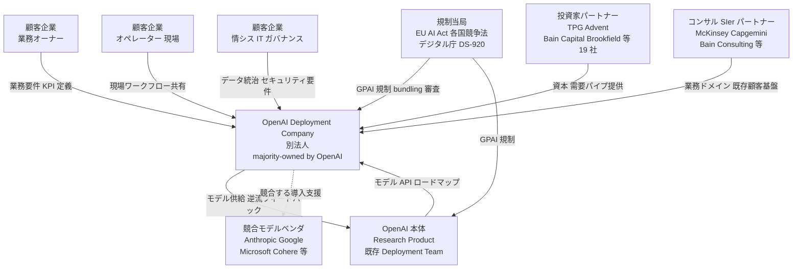
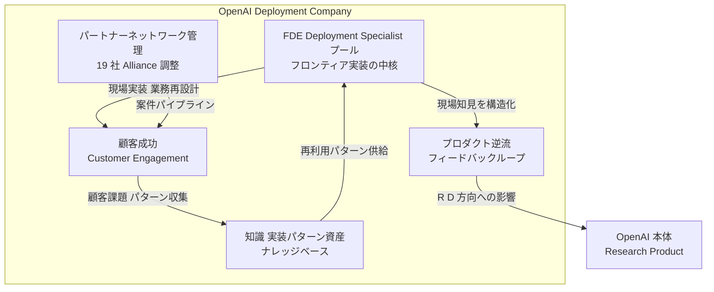
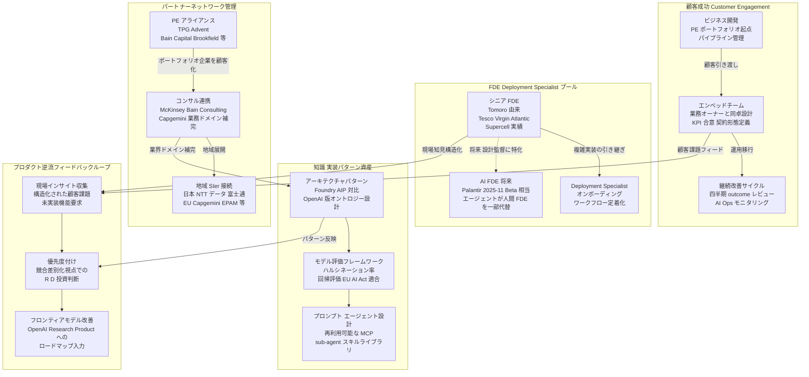
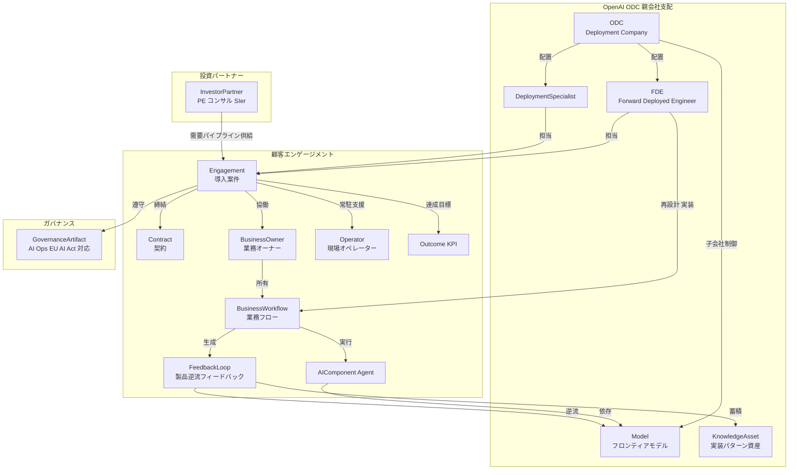
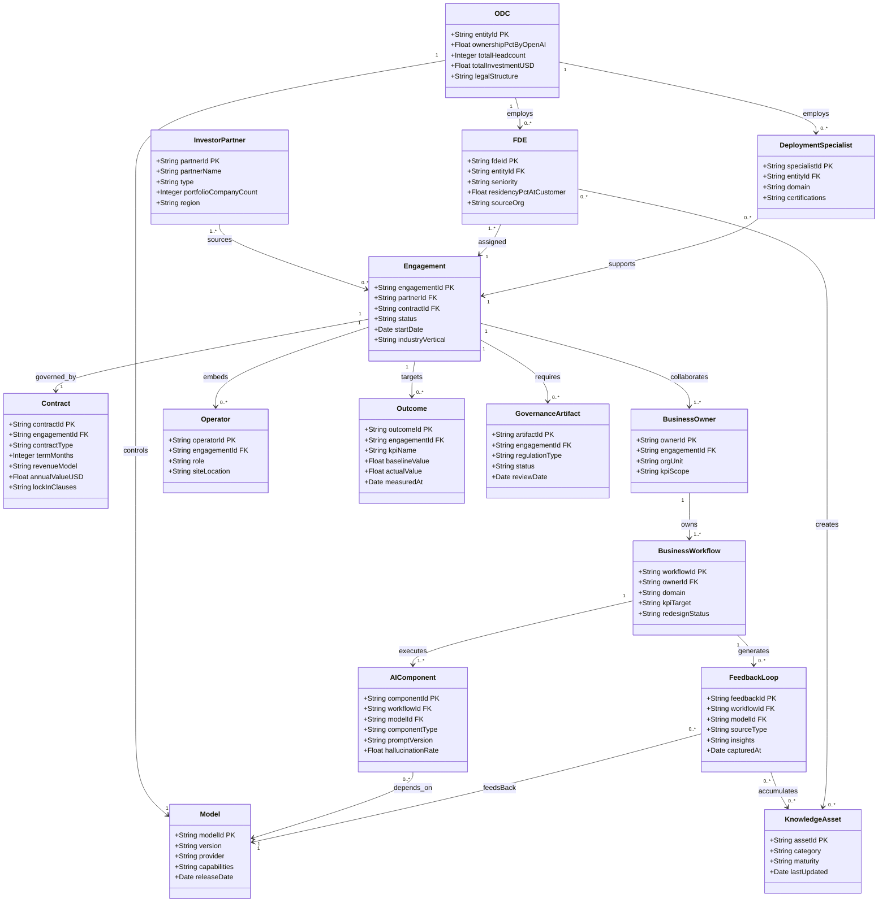

## 概要

OpenAI は 2026 年 5 月 11 日、Enterprise AI 導入を専業で担う別会社 **OpenAI Deployment Company (ODC)** を発表しました。TPG をリードとし、Advent / Bain Capital / Brookfield を共同創設パートナーとする計 19 の投資ファンド・コンサル・SIer との committed partnership として設立され、**初期投資 40 億ドル超、majority-owned and controlled by OpenAI** という構造をとります。同日、UK 拠点の applied AI コンサル **Tomoro** を買収 (クロージング条件充足後)、約 **150 名の Forward Deployed Engineer (FDE) / Deployment Specialist** が初日から合流します。

本質的意義は「Enterprise AI の購買単位の構造シフト」にあります。Palantir が 2000 年代に発明した FDE モデル (顧客現場常駐のエンジニアが業務再設計と AI 実装を一体で行い、知見をプロダクトコアへ逆流させるモデル) を、フロンティアモデルベンダー自身が制度化した点が新しい動きです。競合軸では、Anthropic Applied AI・Google Cloud FDE・Microsoft ISD がいずれもモデルベンダー系の本体内 FDE 組織であるのに対し、ODC のみが **PE 外部資本を受け入れた独立法人** として機能し、投資家ポートフォリオ企業群を初期需要パイプとして設計している点で差別化されます。Accenture (8 万名) / IBM Consulting (14 万名) のような大規模・モデル中立 SIer とは規模で大きく劣後しますが、「モデル直結 + 業務再設計」の上位レイヤーを担う構造であり、単純な競合ではなく補完と収奪の二面性を持ちます。

## 特徴

- **別法人化と外部資本の組み合わせ**: TPG (lead) / Advent / Bain Capital / Brookfield (co-lead) を含む計 19 社が committed partnership として参加します。Anthropic・Google・Microsoft の FDE 組織はすべて本体内組織ですが、ODC のみが外部資本を受け入れた独立法人として独自性を持ちます。
- **majority-owned and controlled by OpenAI**: 別法人でありながら OpenAI が過半数株式・議決権を保持し、研究・プロダクト・内部デプロイチームとの直結を制度的に保証します。
- **Tomoro 買収による即戦力確保**: Tomoro は 2023 年創設の UK applied AI コンサル (法人 TOMORO AI LTD、Companies House #15208678) で、Tesco / Virgin Atlantic / Supercell のミッションクリティカルワークフローで実績を持ちます。Day 1 から約 150 名の FDE / Deployment Specialist が合流します。買収額・クロージング正式日は未開示です。
- **FDE モデルの起源**: Shyam Sankar が 2006 年に最初の FDE となり、戦地で Palantir Gotham を現場最適化した職種です。通常 SWE が「一機能を多顧客に」提供するのに対し、FDE は「一顧客に多機能を」作り込みます (one customer, many capabilities)。2025 年には FDE 求人が前年比 +800% 超に急増したとされます (MindStudio / Florian Nègre 集計、二次情報)。
- **post-sale 配置による業務再設計と AI 実装の一体提供**: 契約後に顧客環境へ常駐し、データ統合・オントロジー設計・ワークフロー構築・本番運用までを担います。成果物は「レコメンド」や「設計書」ではなく「本番稼働」です。
- **プロダクトコアへの逆流**: 顧客現場で得た要求・知見がフロンティアモデルの R&D 投資方向に直接フィードバックされる設計です。a16z はこれを「データ流入経路を所有する moat への投資」と位置づけます。
- **PE ポートフォリオを需要パイプとして設計**: TPG / Advent / Bain Capital / Brookfield / Warburg Pincus 等の投資先企業群が、構造的に初期顧客として組み込まれます。
- **評価額 140 億ドル**: OpenAI 公式アナウンスには評価額の記載なし。Axios 報道 (2026-05-11) による二次情報です。Brookfield の単独コミットが 5 億ドルとの報道もあり、こちらも二次情報です。
- **モデルベンダー系 FDE で唯一の独立法人**: Anthropic Applied AI / Google Cloud FDE GenAI / Microsoft ISD はすべて本体内組織です。ODC の別法人化は制度設計上の先行事例であり、Anthropic も 2026-05-04 に PE 連携の対抗 services 企業 (15 億ドル) を発表するなど、ベンダー別 alliance の分裂シナリオが進行中です。
- **入口経路の差別化**: ODC / Anthropic / Google はモデル起点。McKinsey QuantumBlack / BCG X は経営層起点。Accenture / IBM / NTT データ等 SIer は既存業務システム起点。Palantir / Scale AI はデータ・運用起点です。ODC はトップダウンに業務オーナーと直接協働する「逆方向の参入ルート」を制度化しました。

## 構造

C4 model を「ODC + FDE モデルの論理構造」に読み替えています。

### システムコンテキスト図



| 要素 | 説明 |
|---|---|
| ODC | Enterprise AI 導入専業別法人。FDE 常駐でモデルと業務再設計を一体提供 |
| 顧客企業 業務オーナー | AI 投資の意思決定者。KPI と業務ゴールを定義 |
| 顧客企業 オペレーター 現場 | AI ワークフローを実際に使う現場担当 |
| 顧客企業 情シス | データ統治・セキュリティ・インフラを管掌 |
| OpenAI 本体 | Research / Product / 既存 Deployment Team。フロンティアモデル供給元 |
| 投資家パートナー 19 社 | TPG 主導。資本提供と PE ポートフォリオ需要パイプ |
| コンサル SIer パートナー | 業務ドメイン知識と既存顧客基盤を持ち込む水平展開レイヤー |
| 競合モデルベンダ | Anthropic Applied AI / Google FDE GenAI / MS ISD が同種サービスを競合展開 |
| 規制当局 | EU AI Act の GPAI provider と downstream deployer 兼任を bundling 規制で審査 |

### コンテナ図



| コンテナ | 説明 |
|---|---|
| FDE Deployment Specialist プール | Tomoro 由来 約 150 名。常駐 25-50% でデータ統合・ワークフロー構築・本番運用を担当 |
| 顧客成功 Customer Engagement | 業務オーナー・オペレーター・情シスとの接点管理。KPI 定義・契約管理・継続改善サイクル主幹 |
| 知識 実装パターン資産 | 再利用可能なアーキテクチャ・プロンプト・評価フレームを蓄積するナレッジベース |
| パートナーネットワーク管理 | 19 社 Alliance 調整。PE ポートフォリオ需要パイプの整流機能 |
| プロダクト逆流フィードバックループ | 現場知見を OpenAI Research / Product へ構造的に還流する内部回路 |

### コンポーネント図



| コンポーネント | 説明 |
|---|---|
| シニア FDE Tomoro 由来 | Tesco / Virgin Atlantic / Supercell の実績を持つ即戦力。Day 1 から参加 |
| Deployment Specialist | post-sale フェーズでオンボーディング・定着化を担うスケール役 |
| AI FDE 将来 | Palantir 2025-11 ベータ相当。エージェントが人間 FDE の繰り返し作業を代替 |
| ビジネス開発 | PE ポートフォリオ企業を初期顧客パイプとして整流 |
| エンベッドチーム | 業務オーナーと同卓で KPI・契約形態を合意 |
| 継続改善サイクル | 四半期 outcome レビューと AI Ops |
| アーキテクチャパターン | Foundry/AIP 対比の OpenAI 版データ統合テンプレート |
| モデル評価フレームワーク | ハルシネーション率・回帰評価・EU AI Act 適合チェックリスト |
| プロンプト エージェント設計 | 再利用可能な MCP / sub-agent スキルライブラリ |
| PE アライアンス | TPG (lead) / Advent / Bain Capital / Brookfield / Goldman Sachs / SoftBank 等 19 社 |
| コンサル連携 | McKinsey / Bain Consulting / Capgemini が業務ドメインを補完 |
| 地域 SIer 接続 | 日本 NTT データ・富士通 Kozuchi、EU Capgemini・EPAM |
| 現場インサイト収集 | FDE 常駐時の顧客課題・未実装機能要求を構造化 |
| 優先度付け | 競合差別化視点で R&D 投資判断に変換 |
| フロンティアモデル改善 | OpenAI Research / Product へのロードマップ入力 |

## データ

### 概念モデル



| エンティティ | 説明 |
|---|---|
| Model | フロンティアモデル。GPT-4o 系 |
| ODC | majority-owned by OpenAI、初期投資 40 億ドル超 |
| FDE | 25-50% 顧客常駐。Tomoro 由来 150 名 |
| DeploymentSpecialist | FDE の業務特化サポート役 |
| InvestorPartner | TPG / Bain / Brookfield 等 19 社の需要パイプライン |
| Engagement | 顧客ごとの導入プロジェクト単位 |
| Contract | サブスクとサービス抱き合わせ構造 |
| BusinessOwner | 業務 KPI 責任者 |
| Operator | 現場実行者で FDE 常駐先 |
| BusinessWorkflow | 業務再設計対象フロー |
| AIComponent | エージェント / RAG / 分類器等 |
| Outcome | 四半期レビュー指標 |
| FeedbackLoop | 現場知見をモデル R&D / 資産に還流 |
| KnowledgeAsset | 再利用可能実装パターン |
| GovernanceArtifact | EU AI Act / AI Ops / DS-920 対応 |

### 情報モデル



| エンティティ | 説明 |
|---|---|
| Model | フロンティアモデル本体。capabilities は推測属性 |
| ODC | ownershipPct は majority (数値未公開) |
| FDE | sourceOrg で Tomoro 由来を識別 |
| DeploymentSpecialist | certifications は推測 |
| InvestorPartner | 需要パイプライン構造の要 |
| Engagement | 案件ごとの中心エンティティ |
| Contract | lockInClauses は推測属性 |
| BusinessOwner | FDE との協働起点 |
| Operator | 現場常駐先担当者 |
| BusinessWorkflow | redesignStatus は推測属性 |
| AIComponent | hallucinationRate は AI Ops 観点 |
| Outcome | 四半期レビューサイクル想定 |
| FeedbackLoop | 現場知見からモデル R&D への逆流 |
| KnowledgeAsset | ODC の競争優位資産 |
| GovernanceArtifact | EU AI Act / AI Ops / DS-920 を統合管理 |

公開情報から導出できない属性は ODC/FDE モデルの運用実態から推論したものです。一次ソースによる確認が必要です。

## 構築方法

### 組織パターンの選択

| パターン | 特徴 | 適合企業 | リスク |
|---|---|---|---|
| A 自社 FDE 内製 | AI エンジニアと業務 SME を直接雇用し常駐型スクワッドを編成 | メルカリ / Money Forward 型の内製先行企業 | 採用コスト高、定着率リスク |
| B コンサル提携 | Accenture / NTT データ / BCG X を FDE ロールとして活用、業務設計は自社 | 中堅 SIer、PoC 段階の企業 | architectural authority を委譲すると 72% が service 化 |
| C ハイブリッド | 業務オーナーとデータは内製、ML とプラットフォームは外部調達 | 大手製造 / 金融 | 内外境界のガバナンス設計が鍵 |

Palantir は「FDE 称号を使う企業の 72% が architectural authority を与えていない」と指摘しています。パターン B を選ぶ場合は業務再設計の決定権を内部に残す契約条項が必須です。a16z "Services-Led Growth" は「サービスを原価で売り、データ流入経路を所有する moat への投資として設計する」と述べます。

```yaml
# 実装案として: 組織パターン選択チェックリスト
# 参考: a16z Services-Led Growth / Palantir FDE 定義
fde_pattern_selection:
  check_internal_capability:
    - 専任 ML エンジニアが 3 名以上いるか
    - 業務オーナーが AI Ops を理解しているか
    - データ基盤 Data Lakehouse 相当が稼働しているか
  decision:
    all_yes: pattern_A
    one_or_two_yes: pattern_C
    all_no: pattern_B
```

### 初期チーム編成

| ロール | 人数 | 責務 | 必須スキル |
|---|---|---|---|
| 業務オーナー BizOps | 1 | 業務 KPI 定義、現場調整 | 業務深耕と AI リテラシー |
| データエンジニア | 1-2 | データ統治、オントロジー設計、パイプライン | dbt / Spark / Great Expectations |
| ML AI エンジニア | 1-2 | モデル評価、プロンプト設計、エージェント実装 | LLM API / LangChain / 評価基盤 |
| プラットフォームエンジニア | 1 | AI Ops、デプロイ、モニタリング | Kubernetes / MLflow / ArgoCD |
| FDE リード ハブ | 1 | 顧客現場常駐、業務再設計、プロダクト逆流 | 全領域の橋渡し + コンサルスキル |

```markdown
# 実装案として: FDE スクワッドチャーター

## スクワッド名: [ユースケース名] Squad
## 期間: [開始日] - [初回レビュー日 4 週後]

### ミッション
[業務 KPI] を [X%] 改善するために [業務プロセス] に AI を組み込む

### メンバーとオーナーシップ
| 名前 | ロール | 意思決定権限 |
|------|------|------------|
| [氏名] | 業務オーナー | 業務 KPI / 現場優先度 |
| [氏名] | FDE リード | アーキテクチャ / 技術選定 |
| [氏名] | データ | データ品質基準 |
| [氏名] | ML | モデル選定 / 評価基準 |
| [氏名] | プラットフォーム | インフラ / セキュリティ |

### 成功指標 4 週後
- [ ] 業務 KPI ベースラインを測定完了
- [ ] MVP を本番環境 限定ユーザー にデプロイ
- [ ] ハルシネーション率 < [X]%
- [ ] ユーザー受容率 > [Y]%
```

### 契約形態の設計

| 形態 | 課金単位 | メリット | デメリット |
|---|---|---|---|
| 準委任 従来 | 人月 | リスクが発注者側 | AI 成果と人月が連動しない |
| Outcome-based | KPI 達成額 件数 | 成果連動でロック緩和 | KPI 定義の合意コスト高 |
| 継続改善型 | 四半期フィー + KPI ボーナス | 長期関係と改善の両立 | 初期 KPI 設計の精度が重要 |

DS-920 (デジタル庁 2025-05) のアジャイル調達ガイドが、継続改善型へ移行する法的根拠として使えます。推奨はハイブリッド契約 (3 ヶ月固定フィー → 四半期 outcome review → KPI 連動) です。

```text
# 実装案として: 継続改善型 AI 導入契約条項例
# 参考: DS-920 アジャイル調達ガイド / a16z Services-Led Growth

第X条 成果目標と評価
1. 本契約のアウトカム目標は以下の業務 KPI とする
   - [KPI 名]: ベースライン [X] → 目標 [Y] 四半期末時点
2. 四半期ごとに甲乙共同で KPI を計測し、達成率に応じて
   翌四半期フィーを以下の通り調整する
   - 達成率 120%以上: フィー +[Z]%
   - 達成率 80-120%: フィー 変更なし
   - 達成率 80%未満: 原因分析と改善計画を 2 週以内に提出

第Y条 データ所有権
1. 乙が本契約の履行で生成・取得したデータは甲に帰属する
2. 乙は契約終了後 [30] 日以内にデータを甲の指定形式
   CSV Parquet JSON で返却し、乙側コピーを削除する

第Z条 コードエスクロー
1. 乙が作成したシステムのソースコードは甲指定リポジトリに都度コミットする
2. 契約終了時、乙依存コンポーネントの代替手段を書面で提示する
```

### ガバナンスとロックイン対策

```
Layer 1: データ層 → data export rights 標準フォーマット オープン API
Layer 2: コード層 → code escrow OSS 優先 依存ライブラリ監査
Layer 3: モデル層 → multi-vendor 並走 OpenAI Anthropic OSS
Layer 4: 評価層 → ベンダ中立の評価基盤 社内保有
```

```python
# 実装案として: モデル中立化アダプター
# 参考: Palantir AIP の抽象化レイヤー設計思想

from abc import ABC, abstractmethod
from enum import Enum

class ModelProvider(Enum):
    OPENAI = "openai"
    ANTHROPIC = "anthropic"
    AZURE_OPENAI = "azure_openai"
    OSS_LLAMA = "oss_llama"

class LLMAdapter(ABC):
    @abstractmethod
    def complete(self, prompt: str, system: str = "") -> str:
        pass

    @abstractmethod
    def get_cost_per_1k_tokens(self) -> float:
        pass

class OpenAIAdapter(LLMAdapter):
    def complete(self, prompt: str, system: str = "") -> str:
        ...

class AnthropicAdapter(LLMAdapter):
    def complete(self, prompt: str, system: str = "") -> str:
        ...

class ModelRouter:
    def __init__(self, primary: LLMAdapter, fallback: LLMAdapter):
        self.primary = primary
        self.fallback = fallback

    def complete(self, prompt: str, system: str = "") -> str:
        try:
            return self.primary.complete(prompt, system)
        except Exception:
            return self.fallback.complete(prompt, system)
```

```yaml
# 実装案として: AI ガバナンス要件チェックリスト
# 参考: EU AI Act GPAI / デジタル庁 DS-920 / Palantir Foundry

governance_checklist:
  data_rights:
    - データ所有権が甲 自社 にある旨を契約明記
    - 標準フォーマット CSV Parquet JSON でのエクスポート権を保有
    - ログ 推論結果の自社保存が可能

  code_escrow:
    - ソースコードを自社 Git リポジトリに随時コミット
    - サードパーティライセンスの確認と OSS 比率 > 60%
    - 依存コンポーネントの代替品を四半期ごとに評価

  multi_vendor:
    - モデル API を抽象化レイヤー アダプターパターン で分離
    - 少なくとも 2 ベンダのモデルを並走評価
    - 単一ベンダ依存率 < 70% API コスト ベース

  eu_ai_act_compliance:
    - AI システムのリスク分類 Limited High Unacceptable を文書化
    - Human-in-the-loop 設計の明示 High Risk の場合
    - 透明性要件 エンドユーザーへの AI 使用開示 対応
```

### 技術スタックの選定

| レイヤー | OSS SaaS | 選定理由 |
|---|---|---|
| モデル API | OpenAI / Anthropic / Azure OAI 並走 | multi-vendor 対応 |
| オーケストレーション | LangGraph / Llama-Index | エージェント設計の柔軟性 |
| 評価基盤 | LangSmith / Weave / RAGAS | ハルシネーション率と品質追跡 |
| データ基盤 | dbt + Snowflake / BigQuery | モデル中立なデータ層 |
| AI Ops | MLflow / ArgoCD + Helm | モデル プロンプトのバージョン管理 |
| セキュリティ | HashiCorp Vault / AWS Secrets Manager | API キー管理 |
| コスト管理 | Helicone / LiteLLM | ベンダ横断コスト可視化 |

```yaml
# 実装案として: AI Ops CI/CD パイプライン
# 参考: Palantir AIP Architecture / Anthropic Applied AI

name: AI Model CI/CD Pipeline

stages:
  - name: prompt_lint
    trigger: PR to main
    actions:
      - run: python scripts/prompt_lint.py
      - run: python scripts/token_cost_estimate.py

  - name: model_eval
    trigger: prompt_lint 完了後
    actions:
      - run: python scripts/run_eval.py
        env:
          EVAL_DATASET: s3://company-ai-evals/golden_set_v2.jsonl
          HALLUCINATION_THRESHOLD: 0.05
          TASK_SUCCESS_THRESHOLD: 0.80
      - run: python scripts/regression_check.py

  - name: shadow_deploy
    trigger: eval 合格後
    actions:
      - run: kubectl apply -f k8s/shadow-deploy.yaml
      - run: python scripts/shadow_monitor.py --duration=24h

  - name: production_rollout
    trigger: shadow 24h 合格
    manual_approval: true
    actions:
      - run: kubectl rollout deployment/ai-service --image=:${VERSION}
```

## 利用方法

### Engagement のキックオフ

1. 業務 KPI の現状ベースラインを計測し、AI 導入前の定量データを合意します
2. AI が介入できる業務ステップを特定します。繰り返し作業、判断待ち、情報非対称が発生しているノードを探します
3. 成功・撤退条件を事前に書面で合意します。4 週後に何が達成されれば継続するか、何が未達なら撤退するかを明示します

```markdown
# 実装案として: FDE Engagement キックオフシート

## 1. 業務ユースケース
- 対象業務: [例 請求書照合 / 顧客問い合わせ一次回答]
- 現状フロー: [Mermaid / フローチャートで添付]

## 2. KPI ベースライン
| KPI | 現状値 | 目標値 4 週後 | 計測方法 |
|-----|-------|--------------|--------|
| 処理時間 分 件 | | | |
| エラー率 % | | | |
| コスト 円 件 | | | |

## 3. 成功条件 撤退条件
- 継続条件: KPI 目標値を 2 週連続で達成
- 撤退条件: 4 週後に KPI がベースライン比 -10% 未満
```

### 業務再設計サイクル

```
Week 1 Discovery
  - 現場ヒアリング 業務オーナー + 現場担当者 各 1h
  - データ棚卸し 品質 量 アクセス権
  - ユースケース候補を 3 つ選定して 1 つに絞る

Week 2 Build
  - MVP プロトタイプ 限定データ
  - ゴールデンセット 50 件手動作成
  - 社内ユーザー 3 名でウォークスルー

Week 3 Eval Harden
  - ゴールデンセット全件評価
  - セキュリティレビュー プロンプトインジェクション 個人情報漏洩テスト
  - 本番デプロイ準備

Week 4 Ship Measure
  - 限定本番公開 先行ユーザー 5-10 名
  - KPI 計測と業務オーナーへのレポート
  - 次スプリントのバックログ作成
```

### モデル評価とハルシネーション制御

| 指標 | 定義 | 目標値 参考 |
|---|---|---|
| タスク成功率 | ゴールデンセットで正解した割合 | > 80% |
| ハルシネーション率 | 事実と異なる出力の割合 | < 5% |
| 回帰率 | 旧バージョンより悪化した割合 | < 2% |
| レイテンシ P99 | 99 パーセンタイル応答時間 | < 5s |

```python
# 実装案として: ゴールデンセット評価スクリプト
# 参考: Anthropic Applied AI / RAGAS

import json
from pathlib import Path
from dataclasses import dataclass

@dataclass
class EvalResult:
    task_success_rate: float
    hallucination_rate: float
    regression_rate: float
    latency_p99_ms: float

def run_eval(golden_set_path: str, model_fn, prev_outputs_path: str | None = None) -> EvalResult:
    golden_set = json.loads(Path(golden_set_path).read_text())
    results = []
    for item in golden_set:
        output = model_fn(item["input"])
        results.append({
            "id": item["id"],
            "expected": item["expected_output"],
            "actual": output,
            "is_correct": evaluate_correctness(output, item["expected_output"]),
            "is_hallucination": detect_hallucination(output, item["source_docs"]),
        })
    task_success = sum(r["is_correct"] for r in results) / len(results)
    hallucination = sum(r["is_hallucination"] for r in results) / len(results)
    regression = 0.0
    if prev_outputs_path:
        prev = json.loads(Path(prev_outputs_path).read_text())
        prev_map = {p["id"]: p["is_correct"] for p in prev}
        regressions = [r for r in results if prev_map.get(r["id"]) and not r["is_correct"]]
        regression = len(regressions) / len(results)
    return EvalResult(task_success, hallucination, regression, 0.0)
```

### プロダクト逆流の運用

現場知見を組織知へ変える流れを以下に整理します。

```
現場フィードバック FDE が収集
        ↓
週次 KPT Keep Problem Try を FDE が記録
        ↓
月次 逆流レポート を作成
  - 繰り返し発生するエラーパターン
  - ユーザーが期待する機能 未実装
  - プロンプト改善のヒント
        ↓
社内プロダクトバックログに登録
        ↓
次スプリントで実装と再評価
```

```markdown
# 実装案として: 月次プロダクト逆流レポート

## 期間: [YYYY-MM]
## 担当 FDE: [氏名]
## 対象ユースケース: [名称]

## 1. ハルシネーション エラーパターン 上位 3 件
| # | エラー概要 | 発生頻度 | 暫定対策 | 根本対策候補 |
|---|----------|---------|--------|------------|

## 2. ユーザーリクエスト 未実装機能
| 優先度 | リクエスト内容 | 代替回避策 | 推定工数 |
|--------|-------------|----------|--------|

## 3. プロンプト改善ヒント
- 現象: [例 長文入力でコンテキスト切れが多発]
- 試行した改善: [例 chunk size を 512 → 256 に変更]
- 結果: [例 ハルシネーション率 8% → 4% に改善]
```

### ステークホルダー連携

情シス・法務・現場担当者との連携を以下に整理します。

```
情シス
  - セキュリティ要件 API キー管理 ログ保管期間 ネットワーク分離
  - 既存 ID 管理 SSO SAML 連携 への組み込み
  → FDE と月次で確認会 30 分

法務
  - AI 利用規約の確認 OpenAI ToS Anthropic ToS の禁止事項
  - 個人情報保護 APPI GDPR 対応
  - EU AI Act リスク分類の確認
  → Engagement 開始前と本番デプロイ前

現場担当者
  - AI 出力の最終確認責任者 HITL
  - フィードバックチャネル Slack 専用フォーム
  - AI リテラシー研修 2h
  → 週次スタンドアップ 15 分
```

```markdown
# 実装案として: FDE Engagement RACI マトリクス

| 決定事項 | FDE リード | 業務オーナー | 情シス | 法務 | 現場担当 |
|---------|----------|----------|------|------|--------|
| 技術スタック選定 | **R** | C | C | - | - |
| KPI 目標値設定 | C | **R** | - | - | C |
| セキュリティ要件 | C | I | **R** | C | - |
| データ利用承認 | I | A | C | **R** | - |
| 本番デプロイ承認 | C | **R** | A | C | C |
| AI 出力の最終判断 | - | A | - | - | **R** |

R: Responsible / A: Accountable / C: Consulted / I: Informed
```

## 運用

### 継続改善型契約のレビュー運用

```yaml
# quarterly_outcome_review.yaml
review_cycle: quarterly
checkpoints:
  - phase: Q1 Baseline
    deliverables:
      - 業務 KPI ベースライン測定
      - データ品質スコア初期評価
      - FDE 配置 スコープ合意
    gate: 業務オーナー承認

  - phase: Q2 Embed
    deliverables:
      - 本番 AI ワークフロー 1 件以上稼働
      - ハルシネーション率 回帰評価ベースライン
      - break clause 評価
    gate: outcome KPI 進捗率 30% 以上

  - phase: Q3 Scale
    deliverables:
      - 横展開計画レビュー
      - モデル切替 マルチベンダ評価
      - EU AI Act DS-920 コンプライアンス監査
    gate: outcome KPI 進捗率 60% 以上

  - phase: Q4 Renew Adjust
    deliverables:
      - 年間 ROI 確定
      - 次年度スコープ 料金再交渉
      - FDE 知識移管 内製チームへ
    gate: 業務オーナー + 情シス + 法務の三者承認

escalation:
  trigger: gate_missed OR scope_creep_detected
  action: steering_committee
```

Palantir NHS FDP は四半期レビューゲートを設けず 7 年契約を走らせた結果、break clause 検討段階に至りました。break clause は最低 2 年ごと、理想は 1 年ごとに設計します。

### AI Ops

```yaml
# ai_ops_lifecycle.yaml
model_lifecycle:
  monitoring:
    - metric: hallucination_rate
      threshold: ">5% アラート / >10% rollback"
    - metric: latency_p99
      threshold: ">3s model_version_review"
    - metric: regression_score
      threshold: "-10% incident"
  update_cadence:
    - trigger: major_model_version
      action: staging_eval → A/B test → gradual_rollout
    - trigger: prompt_drift
      action: prompt_audit → red_team → rewrite

prompt_lifecycle:
  versioning: git + semantic versioning
  review: プロンプト変更は code review と同等の peer review 必須
  rollback: 旧バージョンへの即時ロールバック手順を運用手順書に明記

agent_lifecycle:
  dependency_map: エージェントが依存する API ツール モデルの依存グラフを維持
  circuit_breaker: 外部 API 障害時のフォールバック 2025 年 6 月 OpenAI outage 前例
  multi_vendor_eval:
    cadence: 半年ごと
    vendors: [OpenAI, Anthropic, Google, OSS]
    criteria: [cost, latency, quality, data_residency, regulatory_compliance]
```

### ガバナンス

```yaml
# governance_checklist.yaml
eu_ai_act:
  classification:
    - Q: ODC が提供する AI は 高リスク AI システム Annex III に該当するか
      check: [採用 信用評価 インフラ制御 教育 医療 法執行 移民 司法]
    - Q: GPAI provider OpenAI と downstream deployer ODC 兼任による責任分界は文書化されているか
      required: conformity assessment + technical documentation
  annual_review: EU AI Act Annex 更新に合わせた再分類

ds_920:
  procurement:
    - 継続改善型サービス契約形態の選択 準委任 成果報酬
    - ベンダーロックイン防止条項の明記
    - データ主権 国内保存要件 の確認
  risk_management:
    - AI リスク評価シートの整備 デジタル庁テンプレート準拠
    - インシデント報告フロー

j_sox:
  it_general_controls:
    - AI が変更する業務プロセスの統制文書を変更管理の都度更新
    - プロンプト モデルバージョン変更を変更管理台帳に記録
    - human-in-the-loop を明示
  audit_trail:
    - 全 AI 推論ログを最低 5 年保存 改ざん不可ストレージ
    - 監査人向けの AI 意思決定説明書の雛形整備
```

### 利益相反・ロックインの監視

```yaml
# lock_in_monitor.yaml
conflict_of_interest:
  indicators:
    - FDE が代替ベンダー評価を 非推奨 リスク強調 で誘導している
    - 契約更新時に ODC 側からのみ価格情報が提示される
    - multi-vendor テストの実施を FDE が難色を示す
  mitigations:
    - 独立した技術諮問委員会 FDE 以外 による年次評価
    - adversarial review を契約に明記

pricing_watch:
  trigger: OpenAI API 価格改定 2025 年初に実質倍増の前例
  action:
    - usage-based コスト上限の契約設定 cap clause
    - 代替モデルへの移行コスト試算を半年ごとに実施

data_portability:
  required_clauses:
    - data export rights
    - code escrow
    - self-host clause
    - model-agnostic API 設計
```

## ベストプラクティス

### BP-1 「FDE 常駐すれば成功する」という誤解

**反証**: Palantir NHS FDP (3 億 3,000 万ポンド / 7 年契約) は FDE モデルで臨んだものの、13 core capability のうち 3-4 個しか提供できず、2027 年初頭の break clause を検討中です (The Register 2026-04-20 報道、二次情報)。稼働 NHS trust は予定の半数、ベネフィット実感は 1/4 のみで、NHS ユーザーは "convoluted", "awful to use" と評価しています。

**推奨**:

- FDE に architectural authority (プロダクトロードマップへの影響権) を与える。単なる実装担当に置くと 72% が service 化する罠に落ちる
- 業務オーナーを「発注者」ではなく「同卓設計者」として契約に明記し、週次同席を義務化する
- 成果を四半期ごとに break clause と紐づけ、現場が "awful to use" と言える環境を維持する

### BP-2 「モデルベンダー常駐は最適な導入形態」という誤解

**反証**: HN コメント sandworm101 は「OpenAI の社員が組織内部にいる状態で OpenAI 契約を解約・縮小できるか」と指摘します。Azure OpenAI が 2025 年初に実質倍増値上げした前例があり、2025 年 6 月 OpenAI service outage で単一プロバイダ依存企業が業務停止しました。40 億ドル / 150 名 = **約 2,670 万ドル / 人**の試算値 (調達総額を初期人員で除した参考指標であり、実コスト配分を示すものではありません) は、サブスク収益との抱き合わせを前提とした構造で、採算上、顧客の OpenAI 長期固定化を必要とします。

**推奨**:

- 契約に multi-vendor 並走条項を設ける (Anthropic / Gemini / OSS 代替評価を年 1 回以上実施)
- data export rights / code escrow / model-agnostic API 設計を契約必須化
- cap clause (API コスト上限) と price change notification (30 日前通知) を SLA に盛り込む

### BP-3 「FDE モデルを模倣すれば再現できる」という誤解

**反証**: FDE 称号を採用した企業の 72% が architectural authority を与えておらず、FDE が解消するはずだった service-heavy structure を逆に再生産しています (Palantir 商業部門ヘッド発言、Finexus News 経由の二次情報)。a16z 自身が "Trading Margin for Moat" として FDE の低粗利を認め、ソフトウェアバリュエーションで services 業務をやる構造リスクを指摘します。

**推奨**:

- FDE が備えるべき 3 要件 (product engineering capability / embedded execution / operational credibility) を採用・配置基準に明示する
- FDE のジョブデスクリプションに「プロダクトロードマップへの提案権」「コアプロダクトへのフィードバックループ責任」を明記する
- 自社がこの 3 要件を満たせない場合は FDE 称号を使わず、AI 実装コンサルタントと正直に定義する

### BP-4 「FDE は高スループット・スケーラブル」という誤解

**反証**: FDE は常駐時間の 40-60% を admin 作業に費やし、実質稼働率が低い構造です。ODC の 40 億ドル / 150 名 = 2,670 万ドル / 人の前払いコストは古典コンサルの senior partner 生涯売上規模です。HN senko は「100x revenue には 80x headcount が必要、OpenAI のバリュエーションは singularity 前提で矛盾している」と指摘します。

**推奨**:

- FDE 契約においてサブスク収益との抱き合わせ構造を透明化させる。人件費換算コストと API 消費コストを分離提示する
- FDE の時間配分を契約で合意する (例 顧客向け実装 60% 以上 / admin 40% 以下)
- AI Ops ツールによる自動化で admin コストを削減する仕組みを契約前に設計する

### BP-5 「日本市場でもそのまま導入できる」という誤解

**反証**: 日本のジェネレーティブ AI「アクティブ採用予定」は 15.7% (中国 71.2% / 米独 70%+) (Cognizant Japan GenAI Adoption 2024、二次情報)。DX 人材不足 85.1% (IPA「DX 動向 2025」)、DX 成果実感 38% (PwC「2025 年 DX 意識調査」)。多重請負・客先常駐・年度稟議・相見積もり文化は FDE 型の「業務オーナーと直接同卓設計」と根本的に非互換です。

**推奨**:

- 日本では橋渡しレイヤー (内製コア + 中立コンサル + SIer) の 3 層設計が現実解
- DS-920 / AI 推進法を契約様式変更の根拠として活用し、単発 SI から継続改善型準委任へ調達フォームを書き換える
- FDE に学ぶべきは「業務再設計に踏み込む姿勢」であり、「モデルベンダー常駐構造」そのものではない

### BP-6 「EU・規制対応は導入後に考える」という誤解

**反証**: ODC は EU AI Act において GPAI provider (OpenAI) と downstream deployer を同一企業内で兼任します (AI Act Article 25(1) 関連)。これは bundling / lock-in / self-preferencing の典型として欧州委員会が AI 競争課題に明示した構造と合致します。EU は 2025 年末に Big Tech 2 社の AI bundling で制裁手続きを開始済みです。

**推奨**:

- AI 導入の Day 1 から EU AI Act リスク分類を確認し、conformity assessment の要否を判定する
- ODC との契約において責任分界点 (deployer 責任) を明文化する
- AI 推論ログを不変ストレージに保存する設計を初期アーキテクチャに組み込む

## トラブルシューティング

### 業務オーナーが同卓してくれない

- **原因診断**: 業務オーナーの KPI に AI 導入成果が紐づいておらず、稟議・承認コストのみで評価されている
- **対策 1 契約ゲートへの紐づけ**: 四半期レビューの出席を業務オーナーの義務として契約に明記。欠席はゲート保留 (支払い停止権)
- **対策 2 経営層の介入**: steering committee に役員レベルを入れる
- **対策 3 小さな成功の可視化**: 最初の 4-6 週で業務オーナーの現場課題に直接刺さる Quick Win を出す
- **限界の認識**: 半年以上同卓しない場合、Palantir NHS 型の失敗に向かっている。break clause 発動を検討

### モデル切替時の依存爆発

- **予防設計**: model-agnostic な API 抽象レイヤー (LiteLLM / LangChain router) を初期アーキテクチャに組み込む。モデル固有機能は adapter パターンで隔離
- **依存マップの維持**: 全エージェント・プロンプト・RAG パイプラインが参照するモデルバージョンを依存グラフ管理
- **代替モデルの定期評価**: 半年ごとに Anthropic Claude / Gemini / Llama でゴールデンセット評価
- **code escrow の活用**: FDE が書いたコードを第三者保管し、撤退後でも自社で fork できる権利を確保
- **緊急時対応**: 切替決定から 72 時間以内に staging 環境で代替モデル評価を完了できる runbook を整備

### EU AI Act / DS-920 監査対応で破綻

- **責任分界の不明確化**: ODC と OpenAI の兼任構造で「誰が責任者か」が不明。導入前に legal review で deployer 責任者を一社に確定
- **ログ不足**: J-SOX / EU AI Act ともに AI 推論ログの保存を要求。初日から改ざん不可ストレージ (S3 Object Lock / Azure Immutable Blob) に保存
- **conformity assessment の後出し**: 高リスク AI 分類に該当するシステムを先行本番化すると遡及対応コスト膨大。本番デプロイ前に AI Act Annex III チェックを必須ゲート化
- **DS-920 対応の調達遡及**: 政府・公共系では契約前に DS-920 チェックリスト確認
- **修復ロードマップ**: 90 日修復計画のテンプレートを事前準備

### スコープが膨張して回収不能

- **スコープ蠕動の検出**: 週次で FDE の実際の作業ログと当初スコープを照合。新規追加チケットが月 20% 超でスコープ変更プロセス発動
- **変更管理ゲート**: スコープ追加は業務オーナー + IT リード + 契約管理者の三者承認。「口約束追加」を契約で明示禁止
- **ROI 追跡の継続**: 四半期ごとに当初試算と実績を比較し、回収見込みが当初比 50% 未満なら契約縮小・解約のトリガー
- **優先度の明示**: FDE リソースを「コア業務 KPI に直結するスコープ」に集中
- **break clause の活用**: 回収不能と判断した時点で発動

## まとめ

OpenAI Deployment Company は、フロンティアモデルベンダー自身が Palantir 起源の FDE モデルを別法人化して制度化し、Enterprise AI の購買単位を「モデル」から「業務オーナーシップ + モデル + 実装」へ統合する構造シフトです。一方で NHS FDP 失敗・FDE 模倣 72% の service 化・EU AI Act bundling リスク・$26.7M/人 のコスト構造といった反証が強く、SIer や PM が学ぶべきは「業務再設計に踏み込む姿勢」であり、モデルベンダ常駐構造をそのまま真似ることではありません。

この記事が少しでも参考になった、あるいは改善点などがあれば、ぜひリアクションやコメント、SNS でのシェアをいただけると励みになります。

## 参考リンク

- 公式ドキュメント
  - [OpenAI launches the OpenAI Deployment Company](https://openai.com/index/openai-launches-the-deployment-company/)
  - [Tomoro acquired by OpenAI Deployment Company](https://tomoro.ai/insights/tomoro-acquired-by-openai-deployment-company)
  - [Bain & Company invests in the OpenAI Deployment Company](https://www.prnewswire.com/news-releases/bain--company-invests-in-the-openai-deployment-company-a-new-venture-to-deploy-ai-at-enterprise-scale-302768468.html)
  - [Palantir Foundry Architecture Center](https://palantir.com/docs/foundry/architecture-center)
  - [Palantir AI FDE overview](https://palantir.com/docs/foundry/ai-fde/overview)
  - [a16z Services-Led Growth](https://a16z.com/services-led-growth/)
  - [Companies House TOMORO AI LTD #15208678](https://find-and-update.company-information.service.gov.uk/company/15208678)
  - [European Commission AI Regulatory Framework](https://digital-strategy.ec.europa.eu/en/policies/regulatory-framework-ai)
- GitHub
  - [LiteLLM](https://github.com/BerriAI/litellm)
  - [RAGAS](https://github.com/explodinggradients/ragas)
  - [Anthropic 求人 Forward Deployed Engineer Applied AI](https://job-boards.greenhouse.io/anthropic/jobs/4985877008)
  - [Google FDE GenAI 求人](https://www.google.com/about/careers/applications/jobs/results/86217901450633926-forward-deployed-engineer-iii/)
- 記事
  - [Axios OpenAI DeployCo $14B valuation](https://www.axios.com/2026/05/11/openai-deployco-private-equity)
  - [Constellation Research OpenAI Deployment Company](https://www.constellationr.com/insights/news/openai-launches-openai-deployment-company-acquires-tomoro)
  - [Bloomberg OpenAI to buy consulting firm](https://www.bloomberg.com/news/articles/2026-05-11/openai-to-buy-consulting-firm-for-private-equity-joint-venture)
  - [The Register Palantir NHS break clause](https://www.theregister.com/2026/04/20/palantir_nhs_break_clause/)
  - [TechRadar NHS users report awful to use](https://www.techradar.com/pro/security/nhs-users-report-that-it-is-awful-to-use-palantir-could-be-forced-to-exit-nhs-after-pushback)
  - [Hacker News thread #48094531](https://news.ycombinator.com/item?id=48094531)
  - [Everest Group Palantir FDE 分析](https://www.everestgrp.com/palantir-inside-the-category-of-one-forward-deployed-software-engineers-blog/)
  - [aiscale FDE scale limits](https://aiscale.substack.com/p/forward-deployed-engineers-are-the)
  - [Quinn Emanuel EU AI Act + 競争法](https://www.quinnemanuel.com/the-firm/publications/artificial-intelligence-eu-regulation-and-competition-law-enforcement)
  - [Cognizant Japan GenAI Adoption](https://www.cognizant.com/us/en/insights/insights-blog/japan-generative-ai-adoption)
  - [Helicone LLM cost visibility](https://www.helicone.ai/)
  - [MindStudio Palantir FDE Anthropic OpenAI](https://www.mindstudio.ai/blog/palantir-forward-deployed-engineer-model-anthropic-openai)
  - [CIO.com FDE as AI limiting factor](https://www.cio.com/article/4167981/anthropics-financial-agents-expose-forward-deployed-engineers-as-new-ai-limiting-factor.html)
  - [fde.academy How Palantir Invented the FDE Model](https://fde.academy/blog/how-palantir-invented-the-forward-deployed-engineer-model)
  - [NTT データ 2026-05-08 組織転換](https://www.nttdata.com/global/ja/news/release/2026/050807/)
  - [富士通 Kozuchi Enterprise AI Factory 2026-01](https://global.fujitsu/ja-jp/pr/news/2026/01/26-02)
