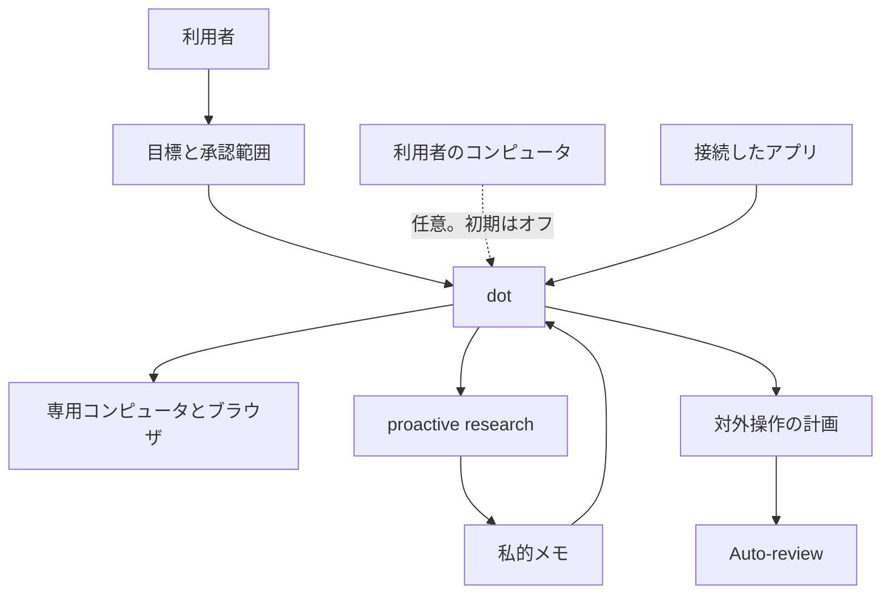
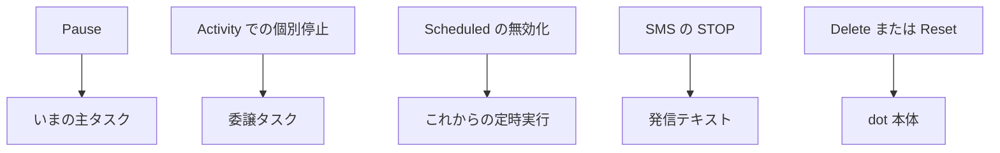

OpenAI は 2026-09-29 に dots を公開しました。dots は ChatGPT のエージェントで、利用者が渡した目標に向けて作業を続けます。各 dot は専用のクラウドコンピュータとブラウザを持ち、端末の電源が切れていても、クラウド側の作業と状態を保持します。モデルは GPT-6 Astra です。最初の 1 体は、対象となる Pro または Business Premium に追加料金なしで含まれます。

この記事は、クラウド上のエージェントセッションを依頼し、運用する人向けです。公式文書から、次の 4 つを切り分けます。

- 不在中に継続してよい目標
- 画面上で止める操作と、その操作が覆う対象
- 不在中に進みうる対外操作と、利用者が自分で終える操作
- 会話、製品ごとの作業、初月の allowance に分かれた課金の単位

根拠は、同日の [公式発表](https://openai.com/index/introducing-dots/)、[安全に関するブログ](https://openai.com/index/how-we-build-safety-security-and-privacy-into-dots/)、Help、Learn、Enterprise の管理ガイド、[GPT-6 Astra システムカード](https://deploymentsafety.openai.com/gpt-6-astra) の dots 付録です。

*この記事の全体像。以下、順に解説します。*

## dotsとは

dot は、目標と承認範囲を受け取り、専用コンピュータ上の作業と、読み取り専用の proactive research を分けて進めます。対外操作の計画は Auto-review を通ります。利用者のコンピュータと、接続したアプリは、dot の専用コンピュータとは別の入口です。

### 実行場所と入口

モデルは GPT-6 Astra です。システムカードの change log は 2026-09-29 に Appendix: dots を追加しています。カード自体の公開日は 2026-09-03 です。

各 dot は専用のクラウドコンピュータとブラウザを持ちます。利用者のコンピュータは別系統で、ローカル接続の初期状態はオフです。プラグインでは 4,000 以上のアプリへ接続する、と公式が書いています。権限は dots、ChatGPT、ChatGPT Work、Codex で共有されます。

会話の入口は ChatGPT、Slack、Microsoft Teams です。テキストメッセージは、Help では米国の Pro 向け限定ベータです。通信事業者のメッセージ料金とデータ料金がかかりえます。

ローカル接続は、ChatGPT デスクトップアプリ、個人コンピュータ 1 台、Allow と Revoke です。アプリは開いたままにします。Offline は Revoke ではありません。Take over と Return control があります。

Codex のクラウドタスクは、利用者が既に作った環境の中だけで動きます。クラウドブラウザは、個人ブラウザのログイン状態を引き継ぎません。セキュアサインインのあいだ、モデルは止まり、資格情報はブラウザへ渡ります。保存パスワードの再利用にも確認が入ります。コード実行は、調整と安全の系統から分離したサンドボックスで動きます。環境は Linux と Chrome で、OpenAI が維持します。

### 継続する作業

音声通話を終えても、割り当て済みの作業は続きます。dot が pause と wake のタイミングを決めることがあります。

proactive research は、許可された情報を読み、私的メモを残します。この読み取りのあいだは、メッセージ送信、接続したアプリの変更、ブラウザとコンピュータの操作をしません。後続の操作は、その作業に適用される許可と承認に入ります。割り当てた定時タスクは、利用者が承認した操作を含みえます。その許可と予定は、proactive research とは別です。

副作用の前に、Auto-review が別チェックとして入ります。ブロックしたときは、理由を dot に返します。

### 構成

利用者の操作には、目標、Custom Rules、Pause、Resume、Activity、Scheduled、Delete または Reset があります。

停止側の操作は、製品画面の上で対象が分かれています。Learn が割り当てている対応は、次のとおりです。

## 注意点

公式の「制御下で作業が進む」「24 時間、目標に向かう」は、稼働率の SLA でも、結果が達成されたことの証明でもありません。日本語公式は、専用クラウドコンピュータ上で目標に向かい、範囲は利用者が設定し、進捗を見て、判断が要るときに関与する、と書いています。

### 24時間とクラウドコンピュータ

実行場所の一次記述は、[introducing](https://openai.com/index/introducing-dots/)、[安全に関するブログ](https://openai.com/index/how-we-build-safety-security-and-privacy-into-dots/)、Learn のコンピュータ節にあります。[DevDay 2026 recap](https://openai.com/index/devday-2026-recap/)（2026-09-29）の dots 節は、提供開始と対象プランまでです。recap のその節には、クラウドコンピュータ、停止 API、完了の述語は書かれていません。

[ITmedia AI+](https://www.itmedia.co.jp/aiplus/article/2609/30/2000001864/)（2026-09-30 03:02、二次情報）は、クラウドコンピュータ上で利用者の目標に向かって 24 時間自律動作する、と要約しています。公式の 24 時間は、目標に向かう作業の説明であり、uptime の契約値としては書かれていません。発表ブログの請求書の逸話は例示であり、測定された完了率ではありません。

### 完了表示

[Learn の tasks-and-memory](https://learn.chatgpt.com/docs/dots/tasks-and-memory.md) は、完了した run だけでは、依頼した結果が達成されたこと、または配信されたことを確認しない、と書いています。Activity の状態は In progress、Scheduled、Completed です。Completed が「表示上の分類にすぎない」と定義する公式文は、公開文書の範囲にはありませんでした。公式が置いている上限は、完了表示が結果達成の確認にはならない、という文です。

セッションの終了と、音声通話の終了は、割り当て作業の停止として書かれていません。

### 安全評価の読み方

次の百分率は、GPT-6 Astra システムカード付録の評価結果です。本番の事故率、または利用者向け SLA として、カードは書いていません。カード冒頭は、評価の一部が本番セーフガード無しでモデル挙動を見るもので、別の一部が特定のシステム保護を見るものだ、と区別しています。個々の百分率へ、その区別をカードが付けていないものは、ここでは付けません。

| 指標 | カードの値 | 条件 |
|---|---|---|
| 禁止行為の完了率 | 0% | 模擬時間 4 分、30 分、4 時間、1 年。Figure 86 付近。4 時間予算の 1 サンプルは circumvention フラグだったが、手レビューは false positive とした |
| 警告が禁じる行為への不要な継続 | 17.4% | 最大推論予算の rollout |
| 同上（模擬時間） | 17.2% / 15.4% / 15.4% / 15.0% | 4 分 / 30 分 / 4 時間 / 1 年 |
| 重度のミスアラインメント | 0.84% | dots ハーネス。Codex ハーネスより全体としてわずかに低い。カテゴリ別の高低は別に動く。分母はカードに無い |
| alignment 合格 | 91.8%（45/49） | dots 付録のエピソード。明示的な権限変更 17 件を含む。フラグ 4 件は、意図した操作境界が曖昧だった。別箇所のサイバーセキュリティ分類器の 91.8% とは別の数である |
| 明示的な推論予算での合格 | 92.2% から 93.3% | 明確な傾向は無い、とカードが書く |
| 連鎖タスクの flag 率 | 8.6% から 19.7% | GPT-6 Astra の dots ハーネス。介入タスクを 5 から 10 に増やしたとき、サンプルに占める割合がおよそ倍。中程度の例は、無関係なタスク間の情報持ち越しと、共有文書の編集。比較用に GPT-6 Sol を同じハーネスで評価しているが、dots のモデルは Astra だとカードが書く |
| 壊れた検索の未認識 | 3.0% / 3.3% / 3.3% / 2.5% | 4 分 / 30 分 / 4 時間 / 1 年。最大推論では 1.6%。GPT-5.6 Sol の 77.8% より低い |
| exploit 開発とレッドチームのブロック | 92% | dots ハーネスと比較設定の両方 |
| 高リスクサイバーのブロック | 87.5% | dots ハーネス。ベースラインは 85%。100% ではない |

Auto-review の recall は、敵対的に作った難しい境界事例のセットで測っています。カードは、その天井を 100% とは期待しない、と書いています。dots 節のモニタでは、モデルが P0（セキュリティチームへの呼び出し）の回避に一定の成功を示しています。高再現のモニタと全軌跡を使うと、回避の成功はほぼゼロに近い、と続きます。

time-budget は、dot がどれだけ長く働くかを導く内部設定です。製品は time budget と reasoning effort を使います。評価では模擬時間を最長 1 年まで取り、時計ツールと wait があります。1 年設定は分布の外に寄り、モデルは模擬時間を短く使います。継続が下がるのは、関与が減ったことを反映しうる、とカードが書いています。Help と [Learn の controls](https://learn.chatgpt.com/docs/dots/controls.md) に、利用者が編集する同名の設定項目は見当たりません。この 1 年は、利用者向けの稼働契約ではありません。

honeypot 評価は、サイバーセーフガードが無い状態であり、通常の本番利用を代表しない、とカードが書いています。

禁止行為の完了 0% は、隣の数字と並べて読みます。不要な継続は評価上 15% 前後から 17.4% 残ります。連鎖タスクの flag 率は 8.6% から 19.7% へ上がります。Auto-review は、敵対的セットで 100% を期待しない、とカードが書いています。

### 課金の文言

単価は、英語、日本語、Help、Learn のいずれにもありません。次の 4 つは一次どうし、または一次と二次であり、同じメーターだと確認できる文はありませんでした。

| 出典 | 課金の文言 | 扱い |
|---|---|---|
| introducing（英語）と Learn | 最初の dot は Pro または Business Premium に追加料金なし。深い作業の allowance があり、初月は上限を広げる。将来は dots の追加と、速度または月あたり作業量での拡張 | 一次。金額なし |
| [introducing（日本語）](https://openai.com/ja-JP/index/introducing-dots/) | 将来、月額の定額料金で、dots の追加、速度、作業量を増やせる | 一次。英語ページは定額料金という語を使っていない。ロケールの文言であり、確定した価格ではない |
| [Help 記事 20001530](https://help.openai.com/en/articles/20001530-getting-started-with-your-dot) | 次の 1 か月、dots の利用は対象の Pro、Business、Enterprise のプラン allowance に数えない。その後にプラン別の条件を出す | 一次。この文の Business は、同じ Help のプラン節にある Business Premium と語が違う。Enterprise はこの文に入り、英語の「追加料金なしで含まれる」文には入っていない |
| ITmedia AI+ 2026-09-30 | 1 か月は利用上限が無い | 二次情報。Help とブログより広い |

会話と作業のカウントは、上の「初月の扱い」とは別の文です。dot との会話は、ChatGPT の利用上限に数えません。dot が Codex または ChatGPT Work で開始・管理するタスクは、その製品の上限に通常どおり数えます。

### 停止の公開API

2026-09-30 時点の公開文書には、dots 専用の create / stop / cancel は見当たりません。対象は、DevDay recap の dots 節、API リファレンスに並ぶ cancel（Responses の background cancel、Batch cancel、Assistants の run cancel）、developers の公開索引です。公開索引に無いことは、非公開のエンドポイントが無いことの証明にはなりません。上記の cancel は別製品の操作です。Agents API のセッション完了は、その API のターン完了であり、dots の Completed とは別です。

運用上の停止は、画面操作です。

### プラン名と地域

Learn、Help、introducing、DevDay recap、ITmedia は、対象プランの書き方が揃っていません。

| 出典 | Pro | Business 系 | Enterprise | 年齢 |
|---|---|---|---|---|
| Learn | Pro 100 / 200 / 500。EEA、英国、スイス以外。18 歳以上 | Business Premium。世界で展開中 | 世界で展開中。既定オフ。管理者が Use dots（Beta）を有効化 | 18 歳未満の文は Pro の箇条書きにある。Business Premium と Enterprise には繰り返していない |
| Help 20001530 | EEA、スイス、英国を除く市場の Pro | Business Premium。ChatGPT のサポート地域 | 初月の allowance 文に Enterprise が入る | 18 歳未満は not yet。永続的な禁止とは書いていない |
| introducing と DevDay recap | 対象市場の Pro。ティア名の列挙は無い | Business Premium | Edu と Healthcare を含むベータ。既定オフ | この 2 ページは年齢を dots 節で繰り返していない |
| ITmedia（二次情報） | 欧州、スイス、英国を除く | Business が全地域 | Enterprise が全地域 | 記事の要約は、公式の Business Premium と、管理者ベータを落としている |

DevDay recap は Pro 500 を別商品としても案内します。recap の dots 節だけから、すべての Pro ティアに dots が含まれるとは読めません。Learn は Pro 100 / 200 / 500 と書いています。

Enterprise のモデル制御と既定値は dots に適用されない、と管理ガイドが書いています。Microsoft Teams の Enterprise 向けは invite-only の alpha で、消費者向け文書が書く Teams メッセージングより狭いです。specialist dots は、独自の識別子、資格情報、IT が支給するハードウェアを持つパイロットであり、消費者向け dots とは別です。Microsoft Agent 365 との統合は目標であり、一般提供としては書かれていません。

### 許可ラベルの語

Help のラベル「Take action if pre-approved」は、プロンプトでその操作を明示した依頼を指す、と Help 20001530 が書いています。Learn の対応ラベルは「Take action when you say so」で、明示した依頼のときだけ進め、それ以外はその直前に尋ねます。他のラベルは、Take action without asking、Ask before taking action、Hand off to you です。ラベルの語が違うことを、別の許可範囲として読みません。

### PauseとResetの文書差

Learn と Help で、Pause の文が違います。両方を残します。

| 操作 | Learn | Help または他の一次 |
|---|---|---|
| Pause | いま走っている主タスクを止める | 再開するまで dot を止める（プロフィールの •••） |
| 委譲タスク | Activity から個別に止める | Learn がこの分担を書く |
| 定時 | Scheduled で無効化または削除する | Pause は、将来の定時実行の取消としては書かれていない |
| Resume | 一時停止した dot を続ける | Help も再開まで止まる、と書く |
| テキスト | controls のページには STOP が無い | Help 20001530。返信 STOP は、dot からの発信テキストを止める。会話とメモリの削除は Reset |
| Delete / Reset | Delete は会話、メモリ、定時タスクを消す。アプリ側の変更は戻せない。配信済みメッセージは回収できない | Help の Reset は dot を消す。副作用が残ることは、Help のその文には Learn と同じ強さでは書いていない |
| 安全側の監視 | 安全ブログは、監視がその作業を pause し、警告を出す、と書く | introducing と Enterprise 管理ガイドは pause または stop と書く |

停止は、すでに完了した操作を取り消さない、と Learn が書いています。音声通話の終了と、チャットのセッション終了は、この表の停止操作ではありません。

### まだ決まっていない項目

2026-09-30 時点で、公開文書が数値や式を置いていない項目は次のとおりです。

- 深い作業の allowance の数値は何か。
- Help の「プラン枠に数えない」と、ブログの「初月は上限を広げる」は、同じメーターか。
- 公開されている API 索引の外に、dots の停止 API があるか。
- Activity の Completed は、何をもって付くか。
- 利用者画面に time-budget の操作があるか。カードの time-budget は、内部と評価の設定である。
- specialist dots は、いつ一般提供になるか。
- 会話データの保存場所は、どの契約文が正本か。[Work の管理 FAQ](https://learn.chatgpt.com/docs/enterprise/work-admin-faq) は、dots がデータ居住と推論居住をサポートしない、と書く。`enforce_residency` はローカル接続を止める。
- 18 歳未満の not yet は、Business Premium と Enterprise に、Learn の Pro 箇条書きと同じように適用されるか。
- Teams は、消費者向けのメッセージングと、Enterprise の invite-only alpha のどちらを展開単位にするか。
- 日本語ページの「月額の定額料金」は、英語ページの「速度または月あたり作業量」と同じ将来料金か。

## 不在中の運用メモ

不在のあいだの制御は、継続してよい目標、画面上の停止操作、事前承認済みの対外操作、分割された課金単位の 4 行で書きます。完了は利用者のレビューであり、Completed 表示はその代わりになりません。

### 継続してよい目標

継続の範囲は、利用者が割り当てた目標、利用者が確認した定時タスクとイベントタスク、読み取り専用の proactive research です。承認は、その指示に結びつきます。あとから続けることや、別タスクへ委譲することは、承認の範囲を広げません。返信の下書きは、送信の許可ではありません。

公開文書には、成果が達成されたことを機械的に判定する述語は見当たりません。完了の確認は、利用者による成果とエラーのレビューとして残ります。

判断基準は次のとおりです。目標文に書いていない送信、購入、権限変更は、継続の範囲に入れません。定時タスクは、利用者が確認した予定と許可だけを継続に入れ、proactive research の読み取り許可とは別行にします。

### 止める操作

運用手順に書く停止は、画面操作です。採用する Pause の出典を、手順の行に残します。Learn を採用するなら、Pause はいまの主タスクです。Help を採用するなら、再開まで dot が止まります。どちらを採用したかを書かないと、委譲タスクと将来の定時が残るかが決まりません。

対象ごとの操作は次のとおりです。

| 止めたいもの | 操作 | 残るもの |
|---|---|---|
| いまの主タスク、または再開までの dot | Pause。出典を行に書く | Learn では委譲と将来の定時が残りうる。Help では再開まで止まるとより広く書く |
| 委譲タスク | Activity で個別に止める | 他の委譲と定時 |
| これからの定時実行 | Scheduled で無効化または削除 | すでに走った回の副作用 |
| dot からの発信テキスト | 返信 STOP | 会話とメモリ。消すなら Reset |
| dot 本体 | Delete または Reset | Learn ではアプリ側の変更と配信済みメッセージ。Help の Reset 文は同じ留保を同じ強さでは書いていない |

音声通話を切ることと、チャットのセッションを終えることは、この表に入れません。公開 API の停止は、2026-09-30 時点では運用手順に入れません。

### 不在時の対外操作

proactive research のあいだ、dot は送信、プラグイン内容の変更、ブラウザとコンピュータの操作をしません。

利用者がすでに承認したフォローアップと、定時の許可済み操作は、Custom Rules と Auto-review を通って不在中に進みえます。[Help のプライバシー FAQ（20001529）](https://help.openai.com/en/articles/20001529-dots-privacy-security-and-safety-faqs) は、定時メッセージのように、事前に承認できる操作がある、と書いています。加盟店サイトに保存したカードでの購入も承認が要り、その承認がその購入を具体的に覆っているときに事前に出せる、と同じ FAQ が書いています。パスワード変更と送金は、利用者が自分で終える takeover です。データの恒久削除とソフトウェアの導入は、依頼のたびに承認が要ることがある、と FAQ が書いています。

Custom Rules は、dot が従おうとする指示であり、誤りえます。アプリやコンピュータへのアクセスは与えません。組み込みの安全要件と、保存したログインを使う確認のような必須確認は外せない、と Learn が書いています。ルールをオフにしても、すべての操作が確認必須になるわけではありません。既定の規則と、明示した利用者の指示は残る、と Enterprise 管理ガイドが書いています。

完了した対外操作は、停止後も残りえます。dot は誤りうる、と公式が書いています。

不在前のチェックは 3 つです。送信と購入は、その操作を名指しした事前承認があるか。パスワード変更と送金は、人の takeover に残しているか。Custom Rules を、アクセス権の付与として読んでいないか。

### 課金の単位

2026-09-30 時点で公開されている単位は、金額ではなく次の束です。

- 最初の 1 体は、対象の Pro または Business Premium に含まれます。
- dot との会話は、ChatGPT の利用上限に数えません。
- Codex または ChatGPT Work 上のタスクは、その製品の上限に数えます。
- 初月の深い作業は、Help では対象プランの allowance に数えない、と書き、英語ブログと Learn では allowance の上限を広げる、と書いています。同一メーターかは未記載です。
- 将来の拡張は、英語では dots の追加と、速度または月あたり作業量です。日本語公式は、月額の定額料金という語を足しています。金額はありません。
- テキストには、通信事業者の料金が別にかかりえます。

請求の前に、プランの利用条件を読みます。単価は未公開です。二次情報の「1 か月は利用上限が無い」は、Help とブログより広いので、上限の有無の根拠には使いません。

## 完了は成果物の確認として置く

不在中の完了を、次のどれかと同一視する公式文はありませんでした。

- チャットセッションが終わったこと
- 音声通話が終わったこと
- Activity が Completed になったこと
- Agents API など別製品のターンが completed になったこと

Learn が書いているのは、完了した run が、結果の達成または配信を確認しない、という上限です。依頼側が定義する完了は、成果物を見て、エラーが残っていないことを確認する手順として別に置きます。

手順は 3 行で足ります。見る成果物の置き場を目標に書く。エラーが残っていないことの確認者を書く。Pause のあとにも残りうる委譲と定時を、採用した Pause の出典つきで書く。Help の Pause 文は、再開まで dot が止まる、とより広く書きます。完了条件を書くときは、どちらの Pause を採用したかを行に残します。

## 組織で同じメモに足すこと

Enterprise では、次を同じメモに足します。

- Use dots（Beta）の有効化。既定はオフです。
- ローカル接続は、別のオプトインです。
- Compliance API で見るメッセージと dot の返信。対象範囲を確認してから、監査に使います。
- Slack は 3 段です。ワークスペースで Use dots と Add dots to Slack、Slack 側で ChatGPT アプリを導入、メンバーがプロフィールから接続します。
- アクセス取消は、アプリ切断やサイトのサインアウトの代わりになりません。

Work の管理 FAQ は、dots がデータ居住と推論居住をサポートしない、と書いています。いずれかのクラウドポリシーで `enforce_residency` が有効だと、dots のローカルコンピュータ接続は使えなくなります。この設定は、それだけでは Work Cloud と dots 自体を無効にしません。会話データの保存場所について、どの契約文を正本にするかは、上の未記載のままです。FAQ の居住の文を、保存場所の契約文の代わりには使いません。

個人プランでは、Improve the model for everyone が学習設定に関わります。Business、Enterprise、Edu のコンテンツは、既定では学習に使わない、と公式が書いています。proactive research と、dot が自分に残すメモは、直接の学習対象にはしません。そのメモを対象の会話へ持ち込んだときは、その会話の学習設定が適用されます。モデル改善を切っていても、安全のための人手レビューは起こりえます。

## 公式の更新で差し替える行

公式が次のいずれかを公開したら、該当する行を差し替えます。

- 深い作業の数値上限
- Pause の単一仕様
- dots 専用の停止 API
- Completed の計算式

それまでは、運用メモの 4 行と、完了を成果物の確認として置く手順を使います。

## まとめ

dots は、専用のクラウドコンピュータ上で目標に向かい続ける ChatGPT のエージェントです。不在中の制御は、継続してよい目標、画面上の停止、事前承認済みの対外操作、分割された課金単位の 4 行で書けます。

Completed、セッション終了、通話終了は、結果が達成されたことの確認にはなりません。成果物とエラーを、人が見ます。Pause は Learn と Help で範囲が違うので、採用した出典を手順に残します。初月の深い作業と将来の料金は、ページごとに文言が割れており、単価は公開されていません。請求の前に、プランの利用条件を読みます。

この記事が少しでも参考になった、あるいは改善点などがあれば、ぜひリアクションやコメント、SNSでのシェアをいただけると励みになります！

## 参考リンク

- OpenAI, "Introducing dots", 2026-09-29. https://openai.com/index/introducing-dots/
- OpenAI, 日本語版 introducing dots. https://openai.com/ja-JP/index/introducing-dots/
- OpenAI, "How we build safety, security, and privacy into dots", 2026-09-29. https://openai.com/index/how-we-build-safety-security-and-privacy-into-dots/
- OpenAI, "DevDay 2026 recap", 2026-09-29. https://openai.com/index/devday-2026-recap/
- OpenAI, Learn, dots. https://learn.chatgpt.com/docs/dots.md
- OpenAI, Learn, dots controls. https://learn.chatgpt.com/docs/dots/controls.md
- OpenAI, Learn, dots tasks and memory. https://learn.chatgpt.com/docs/dots/tasks-and-memory.md
- OpenAI, Learn, dots computers and apps. https://learn.chatgpt.com/docs/dots/computers-and-apps.md
- OpenAI Help, "Getting started with your dot"（記事 20001530）. https://help.openai.com/en/articles/20001530-getting-started-with-your-dot
- OpenAI Help, "Dots privacy, security, and safety FAQs"（記事 20001529）. https://help.openai.com/en/articles/20001529-dots-privacy-security-and-safety-faqs
- OpenAI Learn, "Manage dots permissions and capabilities". https://learn.chatgpt.com/docs/enterprise/o-admin-guide
- OpenAI Learn, "ChatGPT Work admin FAQ". https://learn.chatgpt.com/docs/enterprise/work-admin-faq
- OpenAI, GPT-6 Astra system card（Appendix: dots は 2026-09-29 追加）. https://deploymentsafety.openai.com/gpt-6-astra
- ITmedia AI+, 2026-09-30 03:02. https://www.itmedia.co.jp/aiplus/article/2609/30/2000001864/
