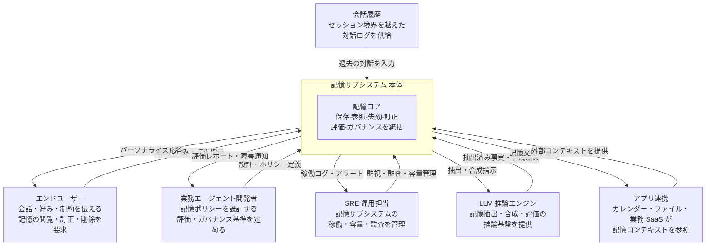
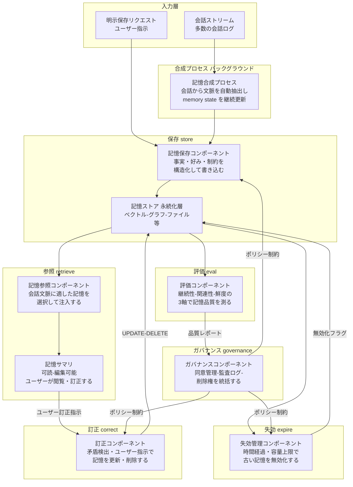
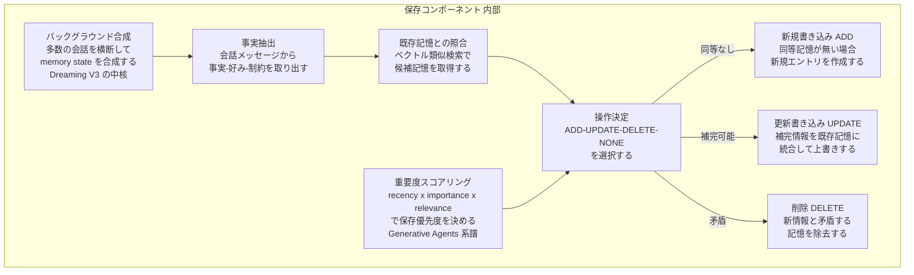
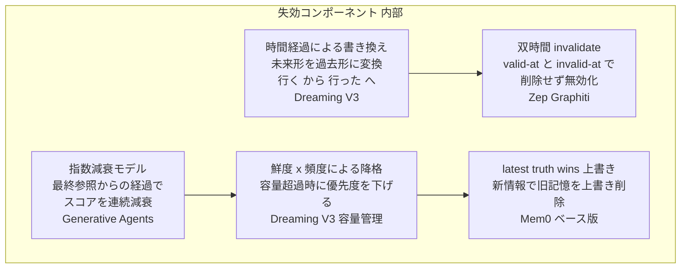
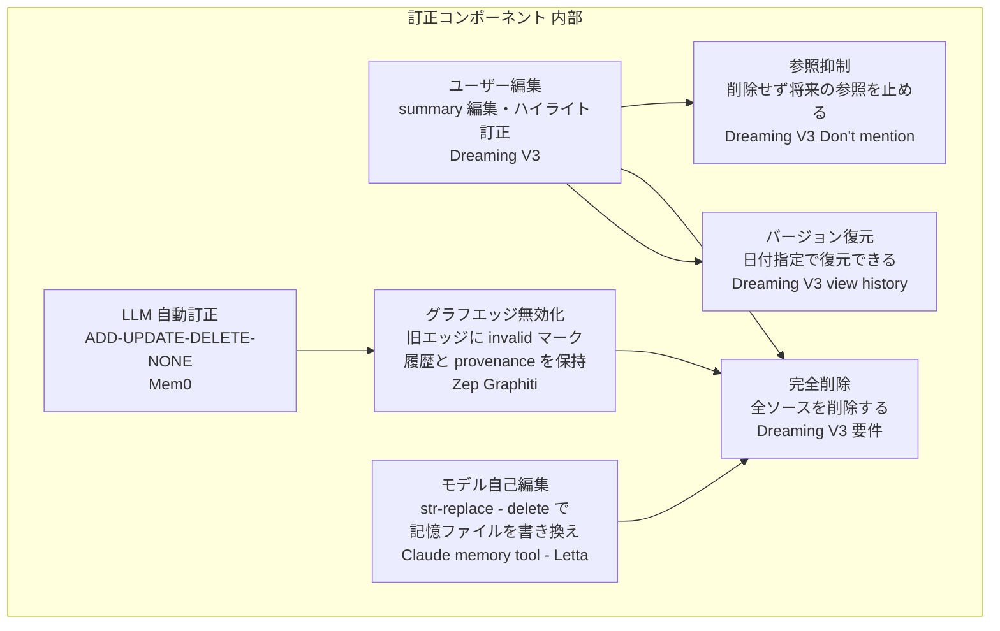
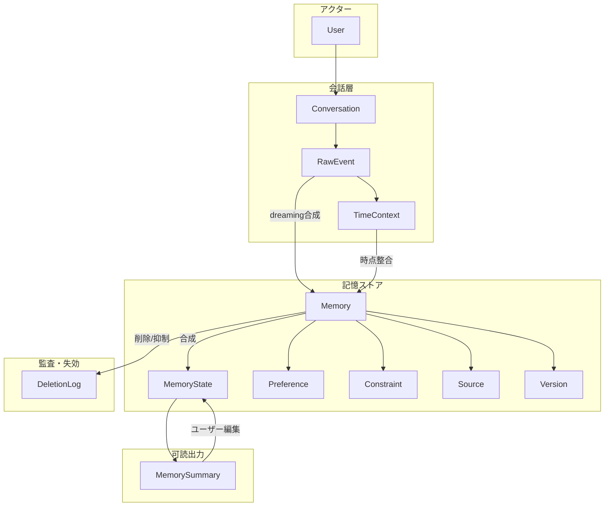
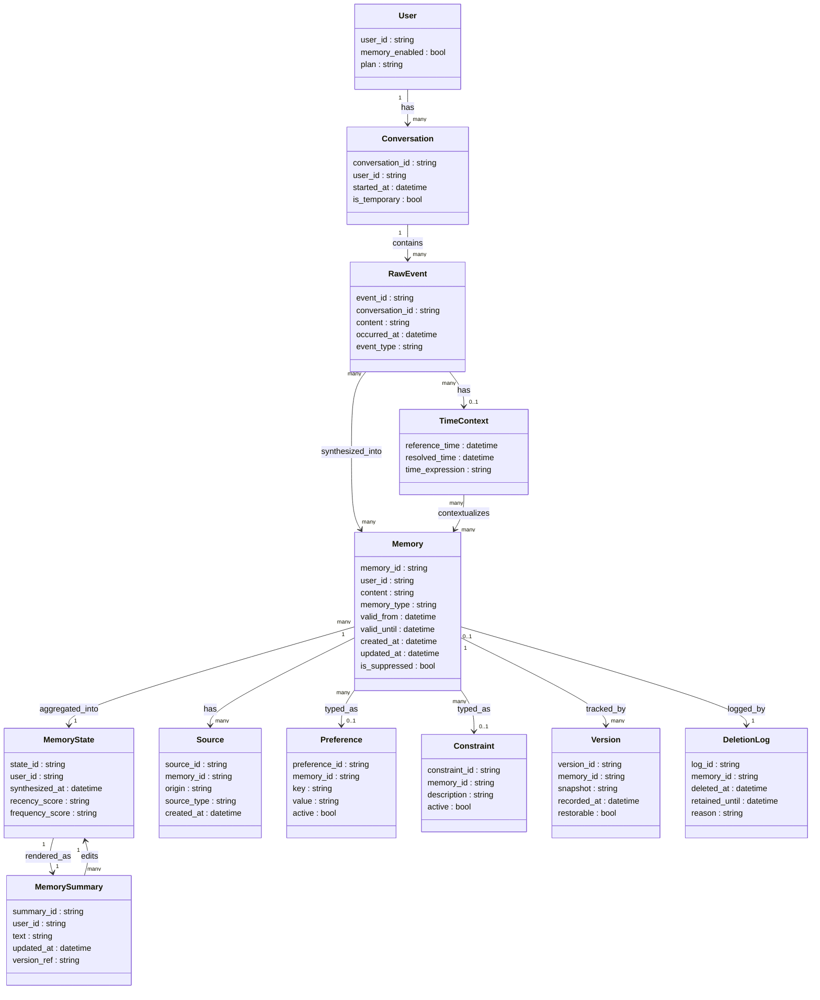

> 検証日: 2026-06-06 / 一次ソース: OpenAI 公式ブログ「Dreaming」(2026-06-04) + Memory FAQ。本記事は OpenAI の ChatGPT メモリ再設計「Dreaming」を 1 事例として、業務 AI エージェントの記憶設計を **保存・参照・失効・訂正・評価・ガバナンス** の 6 区分で整理し、Mem0 / Zep(Graphiti) / Letta(MemGPT) / Claude memory tool と対比します。数値は一次（OpenAI 公式ブログ・Memory FAQ）/ 二次 / 自己申告の区別を明示しています。

## ■概要

### Dreaming とは何か

2026-06-04、OpenAI は ChatGPT のメモリアーキテクチャを再設計した「**Dreaming（V3）**」のロールアウトを開始しました（一次: 公式ブログ冒頭 "June 4, 2026"）。公式ブログの冒頭リードは課題を次のように定義します（一次・原文引用）。

> Today we're beginning to roll out a more capable and scalable system for synthesizing memory, developed to tackle the **staleness, correctness, and scalability** challenges that we observe when memory is applied to the hundreds of millions of users and multi-year time horizons in ChatGPT.

- **Staleness（陳腐化）**: 記憶が時間の経過とともに古くなり、誤情報・無関係情報になります。
- **Correctness（正しさ）**: 複数の記憶が互いに矛盾しえます（例: "マラソン練習中" と "足首を捻挫した"、FAQ）。
- **Scalability（スケーラビリティ）**: 数億ユーザー・複数年スパンに対応できる設計が必要です。

この 3 課題に対処するために導入されたのが「**dreaming**」と呼ぶバックグラウンドプロセスです（一次）。

> In contrast to saved memories, **dreaming leverages a background process that allows ChatGPT to learn from many conversations and synthesize ChatGPT's memory state** in order to always provide the freshest, most relevant context to your conversations.

dreaming は明示的な「覚えて」コマンドに依存せず、会話に自然に現れた文脈を自動で取り込みます。更新された memory state は **memory summary** として可視化・編集でき、会話への注入文脈として常に最新状態を供給します（一次: FAQ "a continually updated synthesis of context from your past chats"）。

### saved memories からの進化（2024 → 2025 → 2026）

| 世代 | 時期（一次表記） | 仕組みの概要 |
|---|---|---|
| **Saved memories** | 2024年4月〜 | 明示的な強い手がかり（「7月にシンガポールに行くと覚えて」）があるときだけ書き込む。書かれなかった事実は失われ、時間が経つと陳腐化する |
| **Saved memories + Dreaming V0** | 2025年4月〜 | dreaming 初版が saved memories を **supplement（補完）** し "step-function improvement" を実現。saved memories の staleness を相殺。ただし dreaming 単体では不十分だった |
| **Dreaming V3** | 2026年6月〜 | dreaming の上に構築した「significantly more capable and compute-efficient」なアーキテクチャ。新システムが既定。ユーザーは旧 saved memories 方式へ revert 可能 |

（一次: 公式ブログ「How memory has evolved」「How we evaluate memory」各セクション）

### なぜ業務記憶設計の素材になるか

Dreaming は「保存と参照」だけだった旧来のメモリ設計に、**失効・訂正・時間対応** という軸を加えた点で業務 AI エージェント設計への示唆が大きいです。

1. **課題の普遍性**: staleness / correctness / scalability は、業務エージェントが長期ユーザーデータを扱う際にも共通して発生します。
2. **3 軸フレームの実用性**: freshness / continuity / relevance という整理は、自社メモリ設計の評価基準を構造化する出発点になります。
3. **限界の両面性**: Dreaming は課題を「解決済み」とは述べておらず、自己申告ベンチマークの透明性や削除の難しさといった限界も文書化されています。業務設計で「何を自前で埋めるか」の判断材料になります。

## ■特徴

### 1. 明示保存から自動合成へ

旧 saved memories の問題は、強い手がかりがないと書かれない点でした（一次: "relied on strong cues"）。Dreaming はこの制約を取り除き、会話の流れに自然に現れた情報を **バックグラウンドで自動合成** します。合成された記憶は **memory summary** として可読・編集可能なサマリに集約され、ユーザーはテキスト編集・ハイライト訂正・"Don't mention this again"（参照抑制、削除ではない）でコントロールできます（一次: FAQ）。

### 2. 3 軸による評価・最適化

公式ブログのサブタイトルは最適化の 3 軸を明示します（一次: "optimize for **freshness, continuity and relevance**"）。本文「How we evaluate memory」では 3 軸を評価目的として展開します。

| 軸 | 評価目的（一次）| 具体例 |
|---|---|---|
| **Continuity（継続性）** | Carry forward useful context | 一度話したことを次のチャットでも覚えている |
| **Relevance（関連性）** | Follow preferences and constraints | ベジタリアンと伝えたら以降の提案が一貫する |
| **Freshness（鮮度）** | Stay current over time | 「来週の誕生日会」がやがて「先週の誕生日会」になる |

時間対応の具体例（一次）: "You're going to Singapore in July" → やがて "You went to Singapore in July 2026" へと書き換わります。

> **数値について（重要）**: 各軸の改善を示すベンチマーク（Fact recall 82.8% / Preference 71.3% / Time-sensitive 75.1%、2024年比較値 41.5% / 31.4% / 52.2% 等）は、公式ブログのグラフ画像内に埋め込まれており本文テキストとして取得できませんでした。これらは **OpenAI 自己申告・図中値・独立検証なし** の値です（二次情報: allthings.how / techtimes、techtimes は "not independently verified" と明記）。

### 3. コンピュート効率と展開計画

- ロールアウト開始: **2026-06-04**、まず **US の Plus / Pro**。以降 coming weeks で **Free / Go** と追加国へ（一次）。
- **Free 向けの serving compute を約 5x（approximately 5x）削減** したことが Free 展開を可能にしました（一次・"approximately 5x" 明記）。
- Plus / Pro のメモリ容量も増加（"increase memory capacity" と一次に明記。具体倍率「2x」は二次: techtimes のみ）。
- US 以外の具体国名は一次・二次とも確認できず（"additional / more countries" 止まり）。

### 4. ユーザーコントロール（一次: Memory FAQ）

| 機能 | 内容 |
|---|---|
| **有効/無効** | Settings > Memory で on/off |
| **閲覧・編集** | memory summary でテキスト編集・ハイライト訂正 |
| **参照抑制** | "Don't mention this again" — 参照を抑制するが削除ではない |
| **完全削除** | 過去チャット・アーカイブ・ファイル・memory summary・連携アプリの全ソース削除が必要 |
| **出典表示** | 回答下の book アイコンで「なぜそのメモリが使われたか」を表示 |
| **バージョン復元** | view history で過去バージョンを確認・復元 |
| **削除ログ** | 削除されたメモリのログを安全・デバッグ目的で最大 30 日保持 |
| **Temporary Chat** | 既存メモリを使わず新規メモリも作らない |
| **容量管理** | Plus / Pro・Web のみ。優先度判定は **recency（直近性）× frequency（話題の頻度）** |

### 5. 他システムとの比較

業務 AI エージェントの記憶設計を検討する際に参照しやすいよう、Dreaming を代表的な OSS・商用メモリシステムと並べます。GitHub star 数は 2026-06-06 時点の概数です。

| システム | 保存方式 | 失効の持ち方 | 訂正 | OSS/商用 |
|---|---|---|---|---|
| **Dreaming（OpenAI）** | 会話から自動抽出・合成（明示保存も併存）。バックグラウンドプロセス | 時間経過で書き換え（"行く"→"行った"）。容量は recency×frequency で管理 | memory summary 編集・"Don't mention again"（抑制）。完全削除は全ソース削除 | 商用（ChatGPT） |
| **Mem0** | LLM が会話から事実を抽出して ADD。Mem0g は triplet グラフ | ベース版は上書き（latest truth wins）。Mem0g は矛盾関係を invalid マーク | ADD/UPDATE/DELETE/NONE で自動訂正。API で手動 CRUD 可 | OSS（Apache-2.0）約 57.8k★ |
| **Zep / Graphiti** | 会話→エンティティ/ファクトを双時間ナレッジグラフ化 | 双時間モデル（event time × ingestion time）。変化時は削除せず invalidate。任意時点クエリ可 | 矛盾検出で旧エッジを無効化し新エッジ追加。出典（Episode）保持 | OSS（Apache-2.0）Graphiti 約 27.1k★ / Zep 約 4.6k★ |
| **Letta / MemGPT** | エージェントが自己編集ツールでファイル/ブロックに書く。3 階層（core/recall/archival） | 構造的 TTL なし。溢れた事実を archival へ退避、変化は replace で上書き。実装者・モデルの運用に委ねる | memory_replace で上書き。開発者が API で直接操作 | OSS（Apache-2.0）約 23.2k★ |
| **Claude memory tool** | モデルが str_replace/delete 等で /memories 配下ファイルを自己編集 | 構造的 TTL なし。長期未アクセス memory の定期クリアを推奨するのみ。鮮度管理は実装者責務 | str_replace/delete でモデルが訂正。実装者がバックエンドで直接編集可 | 商用 API（ストレージは利用者実装） |

**横断インサイト**: 本稿で比較した範囲では、「失効を構造で持つ」のは Zep/Graphiti の双時間モデルだけです。Dreaming と Mem0 は「上書き・書き換え」で陳腐化に対処しますが、これは "latest truth wins" ゆえに **一度の誤書き込みがストアを汚す（one bad write pollutes the store）** リスクと表裏です。Claude memory tool / Letta / Dreaming（完全削除経路）は失効を実装者・モデルの運用に委ねるため、業務利用では運用方針の事前定義が必要です。

## ■構造

業務 AI エージェントの「記憶サブシステム」を論理構造として C4 model に読み替えて図解します（Pattern B）。

### ●システムコンテキスト図

主要アクターと記憶サブシステム、外部システムの関係を示します。具体的な製品名・実装名は含めません。



#### アクター

| 要素名 | 説明 |
|---|---|
| エンドユーザー | 会話を通じて好み・制約・個人情報を提供し、記憶の可視化・訂正・削除を求めるアクター |
| 業務エージェント開発者 | 記憶ポリシー（何を覚えるか・何を忘れるか）を設計し、評価基準とガバナンス方針を定めるアクター |
| SRE 運用担当 | 記憶サブシステムの稼働状態・容量・監査証跡を継続的に管理するアクター |

#### 外部システム

| 要素名 | 説明 |
|---|---|
| 会話履歴 | セッション境界を越えた対話ログを保持し、記憶コアへの入力ソースとなる外部ストレージ |
| LLM 推論エンジン | 記憶の抽出・合成・矛盾判定・評価スコアリングを担う外部推論基盤 |
| アプリ連携 | カレンダー・ファイル・業務 SaaS など、記憶文脈を参照または供給する外部アプリケーション群 |

### ●コンテナ図

記憶サブシステムの内部を「記憶設計 6 区分」で分解します。Dreaming のバックグラウンド合成プロセスも独立したコンテナとして配置します。



#### subgraph: 入力層・合成プロセス

| 要素名 | 説明 |
|---|---|
| 会話ストリーム | 多数の過去・現在の会話ログ。記憶合成プロセスの主要入力 |
| 明示保存リクエスト | ユーザーが「これを覚えて」と明示的に保存を指示するリクエスト |
| 記憶合成プロセス | 会話履歴から文脈を自動抽出し memory state を継続更新するバックグラウンドプロセス。Dreaming の中核に相当する |

#### subgraph: 保存 store・参照 retrieve

| 要素名 | 説明 |
|---|---|
| 記憶保存コンポーネント | 合成・抽出された事実・好み・制約を構造化して書き込む処理ロジック |
| 記憶ストア 永続化層 | ベクトル DB・グラフ DB・ファイルなど実装形式を問わず記憶を永続化する基盤層 |
| 記憶参照コンポーネント | 現在の会話文脈に最も適した記憶を選択し応答生成へ注入する処理ロジック |
| 記憶サマリ | ユーザーが記憶内容を閲覧・テキスト編集・ハイライト訂正できるインターフェース層 |

#### subgraph: 失効 expire・訂正 correct・評価 eval・ガバナンス governance

| 要素名 | 説明 |
|---|---|
| 失効管理コンポーネント | 時間経過・容量上限・ポリシーに基づいて古い記憶を無効化または優先度降格する処理ロジック |
| 訂正コンポーネント | 矛盾検出またはユーザー指示を受けて記憶を更新・削除する処理ロジック |
| 評価コンポーネント | 継続性・関連性・鮮度の 3 軸で記憶品質を定量評価する処理ロジック |
| ガバナンスコンポーネント | 同意管理・監査ログ・削除権・ポリシー制約を統括し、保存・失効・訂正に設計制約を与える |

### ●コンポーネント図

保存・失効・訂正の内部をドリルダウンし、各実装パターンがどの製品・研究に対応するかを示します。

#### 保存コンポーネント（store）の内部



| 要素名 | 説明 | 具体例 |
|---|---|---|
| 事実抽出 | 会話メッセージから事実・好み・制約を取り出す処理 | Mem0 の LLM 抽出パイプライン（arXiv:2504.19413） |
| 既存記憶との照合 | ベクトル類似検索で関連既存記憶を取得し矛盾候補を特定する | Mem0 の cosine 類似によるコンフリクト検出 |
| 操作決定 | ADD / UPDATE / DELETE / NONE の 4 操作から選択 | Mem0 の conflict resolution（"latest truth wins"） |
| バックグラウンド合成 | 多数の会話を横断して memory state を継続合成するプロセス | Dreaming V3（"background process that allows ChatGPT to learn from many conversations"） |
| 重要度スコアリング | recency × importance × relevance の合算で優先度を決定 | Generative Agents（arXiv:2304.03442、全等重み・指数減衰 0.995） |

#### 失効コンポーネント（expire）の内部



| 要素名 | 説明 | 具体例 |
|---|---|---|
| 時間経過による書き換え | 未来形の事実を過去形に変換するなど時間軸に沿った自動書き換え | Dreaming V3（"going to Singapore in July" → "went to Singapore in July 2026"） |
| 鮮度 x 頻度による降格 | recency × frequency を基準に容量超過時の優先度を降格 | Dreaming V3 容量管理（FAQ: "how recent a detail is and how often you talk about a topic"） |
| latest truth wins 上書き | 新情報で旧記憶を上書き削除する最もシンプルな手法。誤書き込みの汚染リスクあり | Mem0 ベース版 |
| 双時間 invalidate | valid_at/invalid_at（現実有効期間）と created_at/expired_at（記録時刻）の 2 軸で削除せず無効化 | Zep / Graphiti（arXiv:2501.13956） |
| 指数減衰モデル | 最終参照からの経過時間でスコアを連続減衰（削除せず参照確率を下げる） | Generative Agents（arXiv:2304.03442、減衰係数 0.995） |

#### 訂正コンポーネント（correct）の内部



| 要素名 | 説明 | 具体例 |
|---|---|---|
| ユーザー編集 | memory summary のテキスト入力またはハイライト選択で記憶を修正 | Dreaming V3（FAQ: "Type what you want changed" / "highlight any text ... to make a specific correction"） |
| 参照抑制 | データを削除せず将来の応答で参照しないよう抑制フラグを立てる | Dreaming V3 "Don't mention this again"（FAQ: "does not delete the information"） |
| 完全削除 | 過去チャット・アーカイブ・ファイル・サマリ・連携アプリの全ソース削除で初めて完了 | Dreaming V3（FAQ: "delete every source where it appears"）。GDPR 削除権との衝突リスク |
| LLM 自動訂正 | 矛盾検出ロジックが ADD/UPDATE/DELETE/NONE を自動判定 | Mem0（arXiv:2504.19413） |
| グラフエッジ無効化 | 旧エッジに invalid マークを付け新エッジを追加。履歴・出典を保持したまま訂正 | Zep / Graphiti（arXiv:2501.13956） |
| モデル自己編集 | モデルがツールコマンドを発行して記憶ファイルを書き換える。訂正保証はモデル判断に依存 | Claude memory tool / Letta（memory_replace） |
| バージョン復元 | 削除前の記憶を日付指定で復元できる履歴管理 | Dreaming V3（FAQ: "view and restore prior versions ... by date"）。※復元履歴と「削除ログ最大 30 日保持」は別概念 |

## ■データ

### ●概念モデル

記憶設計に登場するエンティティとその所有・利用関係を示します。所有関係は subgraph でグループ化し、利用関係は矢印で表現します。



| エンティティ | 説明 | 対応する一次記述 |
|---|---|---|
| User | 記憶の主体となる利用者 | FAQ「Memory controls are available in Settings > Memory」 |
| Conversation | 1 セッションの会話単位。dreaming の入力源 | ブログ「learn from many conversations」 |
| RawEvent | 会話中の発話・発生イベント | ブログ「context that occurs naturally in conversation」 |
| TimeContext | 発話・事実の時点文脈。鮮度管理の基準 | ブログ「Singapore in July」→「went to Singapore in July 2026」 |
| Memory | dreaming が合成した個々の記憶項目 | ブログ「memories synthesized by dreaming」 |
| MemoryState | 継続更新される合成済み記憶状態全体 | ブログ「synthesize ChatGPT's memory state」 |
| MemorySummary | ユーザーが閲覧・編集できる可読サマリ | FAQ「memory summary page」 |
| Source | 記憶の出所（会話・ファイル・連携アプリ等） | FAQ「book icon ... past chats, files, memories」 |
| Preference | 嗜好・好みの記憶（例: ベジタリアン） | ブログ「Follow preferences and constraints」 |
| Constraint | 制約・禁止事項の記憶 | ブログ「constraints」 |
| Version | 記憶の履歴版。復元可能 | FAQ「view and restore prior versions」 |
| DeletionLog | 削除済み記憶のログ。30 日間保持 | FAQ「retain a log of deleted Saved Memories for up to 30 days」 |

### ●情報モデル

概念モデルのエンティティと対応させた classDiagram です。属性は Dreaming/Zep の一次記述に整合する主要なものを記載し、一次記述に無い属性は「(推測/補完)」と注記します。



| エンティティ | 属性 | 根拠・注記 |
|---|---|---|
| Memory | valid_from / valid_until | Zep/Graphiti arXiv:2501.13956 の双時間モデル valid_at/invalid_at に対応。Dreaming の時間書き換えを表現 |
| Memory | is_suppressed | FAQ「Don't mention this again ... does not delete the information」を表現 |
| Memory | memory_type | Preference/Constraint を兼ねる型判別（推測/補完）。LangMem の semantic/episodic/procedural 分類を参考 |
| MemoryState | recency_score / frequency_score | FAQ「how recent a detail is and how often you talk about a topic」に対応 |
| MemorySummary | updated_at | FAQ「it will indicate when it was last updated such as '2 hours ago'」に対応 |
| Source | origin | FAQ「book icon ... past chats, files, memories, connected apps」の出所種別 |
| DeletionLog | retained_until | FAQ「retain a log of deleted Saved Memories for up to 30 days」。deleted_at + 30 日が基準値 |
| Conversation | is_temporary | FAQ「Temporary Chats do not use existing memories or create new memories」に対応 |

## ■構築方法

### ChatGPT 側で Dreaming を使う・制御する設定

Dreaming を有効化・調整する操作は ChatGPT の UI と FAQ が一次根拠です。

| 操作 | 場所 | 効果 |
|---|---|---|
| Dreaming をオフにする | Settings > Personalization > Memory | 自動合成を停止し、以降の会話でメモリを使わない |
| レガシー saved memories へ revert | Settings > Memory > Legacy saved memories | 旧来の明示保存型に戻す |
| memory summary を閲覧・編集 | Settings > Memory > Manage memories | 要点一覧の表示・テキスト編集・削除・ハイライト訂正 |
| 出典確認 | 回答下の book アイコン | 「なぜそのメモリが使われたか」を表示 |
| 過去バージョンに戻す | view history | 削除・上書きされた過去版を日付別に参照・復元（※「最大 30 日保持」は削除ログの保持期間であり、復元可能期間とは別） |
| 参照から除外 | "Don't mention this again" | 参照を抑制する（削除ではない） |
| Temporary Chat | 新規チャット > Temporary Chat | 既存メモリを読まず新規メモリも作らない |

**完全削除の手順（抑制と混同しないこと）**: "Don't mention this again" は参照抑制であり削除ではありません。GDPR「忘れられる権利」の行使や個人情報の完全除去には次の全ソース削除が必要です。

1. memory summary から個別メモリを削除する。
2. 過去チャット・アーカイブを削除する。
3. アップロード済みファイルを削除する。
4. 連携アプリを切断する。
5. 削除後も安全・デバッグ目的で最大 30 日ログが保持される点に注意する。

### 自前エージェントに記憶を組み込む際の前提

「メモリを入れる」と一括りにせず、**保存・参照・失効・訂正** を別々の設計判断として扱うことが前提です。ガバナンス要件はストア選定より **先に** 決定します。

| ストア | 特徴 | 向いているケース |
|---|---|---|
| **Mem0**（OSS, Apache-2.0） | LLM が ADD/UPDATE/DELETE/NONE を判定。ベクトル検索中心。Mem0g で時系列補完 | 事実抽出・矛盾解消を手軽に始めたい。ベクトル検索で十分なケース |
| **Zep / Graphiti**（OSS, Apache-2.0） | 双時間グラフ（valid_at/invalid_at）で削除せず invalidate。過去任意時点クエリ可 | 時系列整合が必須のケース |
| **Letta / MemGPT**（OSS, Apache-2.0） | 3 階層（core/recall/archival）をエージェント自身がツールで読み書き | エージェントが自律的に記憶を整理・退避・検索する設計 |
| **Claude memory tool**（API, 商用） | /memories ディレクトリへのファイル型読み書き。ベクトル非依存 | Anthropic エコシステムに揃えたい場合 |
| **自前実装** | Postgres + pgvector 等 | コスト・監査要件・既存インフラ統合が最優先の場合 |

選定前に固める確認事項:

- 何を覚えてはいけないか（PII/健康/信条/業務機密のカテゴリ定義）。
- 記憶の書き込み・参照を監査ログで追えるか。
- テナント分離（ユーザー間・組織間の記憶リーク防止）は必要か。
- GDPR 等の削除権に対応するため記憶を外部ストアに隔離できるか。

## ■利用方法

記憶設計 6 区分のうち **保存・参照・失効・訂正** の 4 区分を実装例で示します。コードはすべて **実装案/例** であり、実際の API キー・設定は公式ドキュメントで確認してください。

| 区分 | 核となるパラメータ/概念 | 代表ツール |
|---|---|---|
| 保存 (store) | messages, user_id, agent_id, infer | Mem0, LangMem, Letta |
| 参照 (retrieve) | query, limit, filters, 検索方式 | Mem0, Zep/Graphiti |
| 失効 (expire) | reference_time（add_episode の時刻引数）。valid_at / invalid_at / created_at / expired_at は内部で保持する双時間属性 | Zep/Graphiti |
| 訂正 (correct) | ADD/UPDATE/DELETE/NONE, memory_id, invalidate | Mem0, Zep/Graphiti |

### 保存 — Mem0 で会話から事実を抽出して add する

```python
# 実装案/例: Mem0 で会話から事実を自動抽出して保存する
# pip install mem0ai / 公式: https://docs.mem0.ai/core-concepts/memory-operations/add
from mem0 import Memory

config = {
    "vector_store": {
        "provider": "qdrant",
        "config": {"host": "localhost", "port": 6333},
    },
}
m = Memory.from_config(config)

messages = [
    {"role": "user", "content": "私はベジタリアンです。ランチにサンドイッチを食べました。"},
    {"role": "assistant", "content": "了解です。ベジタリアン向けのメニューをご提案しますね。"},
]

# user_id を必ず渡す。記憶はユーザー単位で分離される
result = m.add(messages=messages, user_id="user_alice")
print(result)
# 例: {'results': [{'id': '...', 'memory': 'アリスはベジタリアン', 'event': 'ADD'}]}
```

> `infer=False` にすると矛盾解消・重複防止がスキップされ生データが保存されます。誤書き込みがストアを汚染する（"one bad write pollutes the store"）リスクが上がるため、意図的な場合のみ使用してください。

保存前の PII フィルタリング（実装案/例）:

```python
# 実装案/例: 保存前に PII カテゴリを除外するフィルタ
import re

PII_PATTERNS = [
    r"\b\d{3}-\d{4}-\d{4}\b",         # 電話番号（日本形式）
    r"\b\d{4}-\d{4}-\d{4}-\d{4}\b",   # クレジットカード番号
]

def contains_pii(text: str) -> bool:
    return any(re.search(p, text) for p in PII_PATTERNS)

safe_messages = [msg for msg in messages if not contains_pii(msg["content"])]
```

### 参照 — ベクトル検索・グラフ検索・summary 注入の使い分け

| 方式 | 適するケース | 代表ツール |
|---|---|---|
| ベクトル検索（cosine/ANN） | 意味的な近さで記憶を引く。時間軸は弱め | Mem0, LangMem, Letta archival |
| グラフ走査 + ハイブリッド | エンティティ間の関係・時系列を辿る | Zep/Graphiti |
| summary 注入（in-context） | 常時関連情報を注入。高コストだが見落とし最小 | Letta core memory, Claude memory tool |

```python
# 実装案/例: Mem0 で直近の関連記憶をベクトル検索して取得する
# 公式: https://docs.mem0.ai/core-concepts/memory-operations/search
results = m.search(query="今日のランチで何がお勧めですか？", user_id="user_alice", limit=5)

memory_context = "\n".join(f"- {r['memory']}" for r in results["results"])
system_prompt = f"""あなたはユーザーをサポートするアシスタントです。
ユーザーについて知っていること:
{memory_context}
"""
```

```python
# 実装案/例: Graphiti で時系列グラフをハイブリッド検索する
# pip install graphiti-core / 公式: https://github.com/getzep/graphiti
from graphiti_core import Graphiti

client = Graphiti(neo4j_uri="bolt://localhost:7687", neo4j_user="neo4j", neo4j_password="***")
results = await client.search(query="アリスの食事制限", num_results=5)
for fact in results:
    print(f"事実: {fact.fact} / 有効期間: {fact.valid_at} 〜 {fact.invalid_at}")
```

> Zep/Graphiti はグラフ走査と BM25 を組み合わせて sub-second レイテンシを実現します（arXiv:2501.13956 の論文値。公式ドキュメント要確認）。

### 失効 — Zep の双時間モデルで「上書きせず invalidate」する

古い事実を削除するのではなく invalid_at をセットして無効化することで、「現在の真実」と「過去の任意時点での真実」の両方をクエリできます。

```python
# 実装案/例: Graphiti に新エピソードを追加すると矛盾する旧エッジが自動 invalidate される
# 公式: https://github.com/getzep/graphiti
from datetime import datetime
from graphiti_core import Graphiti
from graphiti_core.nodes import EpisodeType

async def update_memory_with_invalidation():
    client = Graphiti(neo4j_uri="bolt://localhost:7687", neo4j_user="neo4j", neo4j_password="***")
    # 旧事実: 7月にシンガポールへ行く予定
    await client.add_episode(
        name="trip_plan", episode_body="アリスは2026年7月にシンガポールへ行く予定です。",
        source=EpisodeType.text, reference_time=datetime(2026, 6, 1), source_description="会話ログ",
    )
    # 新事実: 旅行後の更新（Graphiti が自動で旧エッジを invalidate）
    await client.add_episode(
        name="trip_done", episode_body="アリスは2026年7月にシンガポールへ行きました。",
        source=EpisodeType.text, reference_time=datetime(2026, 8, 1), source_description="会話ログ",
    )
    # → 旧エッジは無効化され、内部的に invalid_at 相当（2026-08-01）が付与される想定
```

双時間モデルの時間軸（概念図）:

```
event time    |------[行く予定]----X  [行った]-------->
              valid_at=2026-06    invalid_at=2026-08  valid_at=2026-08
ingestion time  ↑書込              ↑失効記録          ↑新エッジ書込
                created_at=...     expired_at=...     created_at=...
```

削除せず invalidate することで「過去の任意時点で何が真だったか」を復元でき、監査要件のある業務環境で重要です。

### 訂正 — ユーザー編集・参照抑制・矛盾解消

```python
# 実装案/例: Mem0 の矛盾解消（latest truth wins）
m.add(messages=[{"role": "user", "content": "私は東京に住んでいます。"}], user_id="user_alice")
# → ADD: {'memory': 'アリスは東京に住んでいる', 'event': 'ADD'}
m.add(messages=[{"role": "user", "content": "先月、大阪に引っ越しました。"}], user_id="user_alice")
# → UPDATE: {'memory': 'アリスは大阪に住んでいる', 'event': 'UPDATE'}（旧記憶は残らない）

# 手動 CRUD（GDPR 削除権・退職者対応の実装例）
m.update(memory_id="memory-id-xxx", data="アリスは大阪（梅田）に住んでいる")
m.delete(memory_id="memory-id-yyy")
m.delete_all(user_id="user_alice")
```

> Mem0 の矛盾解消は latest truth wins で動き、旧記憶が残りません。「過去どこに住んでいたか」は別途 Recall ストアや Zep で管理します。

```python
# 実装案/例: Letta で参照抑制ルールを core memory ブロックに追記する（"Don't mention" 相当）
# 公式: https://docs.letta.com/guides/ade/core-memory/
client.agents.blocks.update(
    agent_id="my-agent-id", block_label="persona",
    value="あなたは親切なアシスタントです。ユーザーの食事制限については言及しないでください。",
)
```

> **重要**: 抑制は「参照しない」指示でありストアからの削除ではありません。完全削除は m.delete() / m.delete_all() を使い、UI・コードで「抑制」「論理削除」「物理削除」を明確に区別してください。

## ■運用

### 記憶の鮮度維持 — 時点書き換えと減衰の設計

Dreaming は「7月にシンガポールへ行く」→「2026年7月にシンガポールへ行った」と時間経過で自動書き換えします（一次）。便利な一方、書き換えのタイミングや根拠が不透明という運用リスクを持ちます。業務エージェントでは次の 3 点を明示的に持つことを推奨します。

- **time_point（時点メタデータ）**: 各記憶エントリに valid_from / valid_until を付与する。Zep/Graphiti の双時間モデル（arXiv:2501.13956）が代表例。
- **減衰スコア**: Generative Agents（arXiv:2304.03442）の指数減衰（係数 0.995）を参考に「最終参照からの経過 × 参照頻度」でスコアを下げる。ACT-R ベースのモデル（HAI 2025, ACM DOI 10.1145/3765766.3765803）は冪減衰で「頻繁に参照された記憶は減衰が遅い」を実現する。
- **鮮度トリガ条件の明示**: 「旅行終了後」「プロジェクト完了後」などの業務イベントをトリガとして明示定義する。自動推論に任せると誤タイミングで書き換えが起きる。

### 矛盾解消の運用

矛盾解消はベンチマークでも「最も未成熟な領域」とされます（arXiv:2603.07670・サーベイ・プレプリント、査読未確認）。

1. **書き込み前の矛盾チェック**: 新規エントリ追加前に既存ストアをセマンティック検索し矛盾を検出する。SSGM（arXiv:2603.11768・プレプリント、査読未確認）は consistency verification を統合前の必須ステップとする。
2. **無効化と削除を区別する**: 上書きでなく旧エントリを invalid_at でマークして残す。削除すると「なぜ変わったか」の監査証跡が失われる。
3. **人手レビューの挿入ポイントを決める**: 矛盾スコアが閾値超過時にフラグを立て、自動解消せずユーザー確認を挟む。完全自動の矛盾解消は semantic drift を静かに進行させる。

### 削除・忘却の扱い — 削除ログ 30 日・完全削除は全ソース

- **誤解**: 「削除ボタンを押せば記憶は消える」
- **反証**: FAQ（一次）で "Don't mention again" は参照抑制であり削除ではないと明記。完全削除は全ソース削除が必要で、削除ログは最大 30 日保持。学術調査（arXiv:2602.01450, ACM WWW'26）では ChatGPT の記憶の 96% がシステム側の一方的生成、ユーザー主導は 4% と報告（同論文の調査条件・サンプル・判定基準に依存する値）。
- **推奨**: 「抑制」と「完全削除」を UI とデータ層の両方で区別する。完全削除は全会話ログから当該エントリを削除するパイプラインを用意する。削除ログ保持期間を明示定義する（30 日は OpenAI の設計だが GDPR 消去義務と照らして要検討）。実際に削除される範囲をユーザーに明示する。

### 容量管理 — recency × frequency

OpenAI は容量管理の優先度判定に recency × frequency を用います（FAQ・一次）。これは Generative Agents の検索スコア（arXiv:2304.03442）と発想が近いものです。

- 容量上限を決め超過時の優先度ルールを明示する（何も決めないと古い重要な記憶が押し出される）。
- recency だけに頼らず importance（重要度タグ）を別途持つ。
- cold storage への退避ルールを定義する（一定期間未参照の記憶を削除でなく cold tier へ）。MemGPT の仮想コンテキスト管理（arXiv:2310.08560）が参照実装。

### 評価の回し方 — 自前ドメインで 3 軸を測る

- **誤解**: 「公表ベンチ（82.8% / 71.3% / 75.1%）が良ければ十分」
- **反証**: これらは OpenAI 内部評価で評価セット非公開・独立検証なし・他社比較なし（implicator.ai・techtimes〔二次〕）。さらに LoCoMo でほぼ満点のシステムが MemoryArena（arXiv:2602.16313・プレプリント）のエージェント環境では大きく低下すると報告され（具体値 40〜60% は二次情報、MemoryArena 本文で一次未確認）、「静的 recall ベンチ ≠ 実運用記憶性能」。
- **推奨**: LongMemEval（arXiv:2410.10813, ICLR 2025）と LoCoMo（arXiv:2402.17753）の課題設計を参考に、自前ドメインで以下を測定する。

| 評価観点 | 測定方法の例 |
|---|---|
| Carry forward（継続性） | セッション 1 で A を話し、セッション 3 で A が正しく参照されるか |
| Follow constraints（制約追従） | 禁止条件を設定後、5 セッションで違反率を計測 |
| Stay current（鮮度） | 「X 月に転職した」後に旧職場を提案されないか |

## ■ベストプラクティス

### 記憶設計を 6 区分に分けて個別に決める

「メモリを入れる」と一括りにせず **保存・参照・失効・訂正・評価・ガバナンス** を個別に設計します。この分解は arXiv:2603.07670（サーベイ・プレプリント、査読未確認）が write–manage–read として定式化しています。区分が混在すると、失効の設計不備を参照コストで補うなど非効率な補完が生じます。

### 失効を上書きだけに頼らない — 出所と時点を残す

- **誤解**: 「latest-truth-wins で上書きすれば古い記憶は無害化できる」
- **反証**: SSGM（arXiv:2603.11768・プレプリント、査読未確認）は write isolation を持たないアーキテクチャでは一度の誤書き込みが長期記憶を汚染する（"one bad write pollutes the store"）と指摘。Mem0（arXiv:2504.19413）も操作分離でこのリスクを緩和。
- **推奨**: 各エントリに source_conversation_id と written_at を必ず付与する。上書きでなく「旧エントリを invalid_at でマーク + 新エントリ追加」で記録する。Zep/Graphiti の双時間モデル（arXiv:2501.13956）が OSS 実装の参照。

### 訂正をユーザーが触れる形に保つ

Dreaming の memory summary（閲覧・編集・ハイライト訂正・出所表示）は良い設計の方向性を示します。ただし「Don't mention again = 削除」という誤解を UI で招いてはなりません（一次: FAQ）。

- 記憶エントリの一覧表示と個別編集の UI を用意する。
- 「抑制」「論理削除」「完全削除（全ソース）」を明確に区別しラベルで示す。
- 出所（どの会話のどの発言から書き込まれたか）を表示する。

### 評価を自前で持つ — 自己申告ベンチを鵜呑みにしない

ベンチマーク数値をそのまま意思決定の根拠にするのは危険です。自分のユースケース・ドメイン・言語・タスク依存性で評価を設計します（「運用」の評価の回し方を参照）。

### ガバナンスを保存設計より先に固める

- **誤解**: 「まず動くものを作ってからプライバシー対応は後で考える」
- **反証**: arXiv:2602.01450（ACM WWW'26）によれば記憶の 28% に GDPR 定義の個人データ、52% に心理的推察が含まれる。自動学習型の記憶は気づかぬうちに PII・心理プロファイルを蓄積し、parametric 化した記憶は machine unlearning が未成熟で消去困難。
- **推奨**:
  - **覚えてはいけない情報の定義**: 健康・信条・給与・顧客機密・当事者が拒否した情報を書き込み抑制カテゴリとする。
  - **監査ログの設計**: 「誰の発言から、いつ、何が書き込まれ、誰がいつ参照したか」を記録する。記憶を重みでなく外部ストアに置くと監査が容易。
  - **GDPR 訂正権・削除権の動線**: 訂正（Art.16）と削除（Art.17）それぞれに応答するパイプラインを事前設計する。
  - **退職者・テナント越境の対策**: 組織離脱イベントをトリガに記憶の削除フックを設定する。

## ■トラブルシューティング

| 症状 | 原因 | 対処 |
|---|---|---|
| 記憶ストアが汚染される（誤情報が以降の応答に影響し続ける） | write isolation の欠如。誤書き込みが削除されず残る（"one bad write pollutes the store"）。MemGPT/MemoryOS 型が特に脆弱（arXiv:2603.11768・プレプリント） | ①書き込み前に矛盾チェック ②staging 領域で保留し閾値超過で人手レビュー ③invalid_at で無効化し物理削除しない ④汚染エントリ特定後に影響セッションを再生成 |
| semantic drift（「辛いもの少し好き」が反復要約で「大好き」に変質） | 反復要約による選好の強化・歪曲。SSGM が指摘（arXiv:2603.11768・プレプリント）。自動統合は世代を経るほど劣化 | ①「具体的発話 episodic + 要約」をペア保持 ②要約更新時に元 episodic と照合 ③一定世代以上の要約チェーンを禁止し元発話に遡って再生成 |
| LoCoMo/LongMemEval で高スコアでも実運用で大きく低下（報告では 40〜60%、二次情報・一次未確認） | 静的 recall ベンチは 1 クエリ参照中心。実運用は相互依存するマルチセッション・マルチタスク（arXiv:2602.16313・プレプリント、独立検証なし） | ①評価セットを自前ドメインで再設計 ②interdependent multi-session agentic tasks を参考 ③contradiction rate・staleness・latency を多軸計測 |
| "Don't mention again" を押したのに記憶が残って応答に出る | 「Don't mention again」は参照抑制であり削除ではない（一次: FAQ）。データ層に残る | ①「抑制 ≠ 削除」を UI で明示 ②完全削除は全ソース削除フローへ案内 ③「抑制」「論理削除」「物理削除」を操作分離 |
| PII・機微情報が記憶ストアに蓄積している | 自動学習型は明示指示なしに個人情報・心理推察を抽出（arXiv:2602.01450 で 28% GDPR 個人データ・52% 心理推察） | ①書き込み前に PII 検出フィルタ ②既存ストアを棚卸し ③GDPR 削除権に応える完全削除パイプライン整備 |
| 退職者の個人情報・業務コンテキストが記憶に残存 | ユーザーライフサイクルと記憶ライフサイクルが非連動 | ①ユーザー無効化イベントで削除フックを自動実行 ②テナント単位で記憶分離しテナント削除時に一括削除 |
| ベンダーのベンチ数値を採用判断に使ったが実運用で性能が出ない | 公表値は自己申告・評価セット非公開・独立再現不能（implicator.ai・techtimes〔二次〕）。評価環境と実環境のタスク・言語・ドメインが異なる | ①「自己申告値・独立検証なし」と明記して社内資料に使う ②採用判断前に自前検証セットで再評価 ③競合の自己申告比較も利益相反として同様に検証 |

## ■まとめ

OpenAI の Dreaming は、ユーザーの明示保存に頼らずバックグラウンドで記憶を合成し、鮮度・継続性・関連性の 3 軸で最適化する記憶アーキテクチャです。一方で、自己申告ベンチ・削除の難しさ・記憶汚染という限界も残るため、業務エージェントに転用するなら **保存・参照・失効・訂正・評価・ガバナンス** の 6 区分に分け、失効や評価やガバナンスは自前で設計する姿勢が重要になります。

この記事が少しでも参考になった、あるいは改善点などがあれば、ぜひリアクションやコメント、SNSでのシェアをいただけると励みになります！

## ■参考リンク

- 一次ソース（公式）
  - [OpenAI - Dreaming: Better memory for a more helpful ChatGPT (2026-06-04)](https://openai.com/index/chatgpt-memory-dreaming/)
  - [OpenAI Help Center - Memory FAQ](https://help.openai.com/en/articles/8590148-memory-faq)
- 関連メモリシステム（公式ドキュメント・リポジトリ）
  - [Mem0 - Memory Operations docs](https://docs.mem0.ai/core-concepts/memory-operations/add)
  - [Mem0 - GitHub](https://github.com/mem0ai/mem0)
  - [Graphiti - GitHub](https://github.com/getzep/graphiti)
  - [Zep - GitHub](https://github.com/getzep/zep)
  - [Letta - Core Memory docs](https://docs.letta.com/guides/ade/core-memory/)
  - [Letta - GitHub](https://github.com/letta-ai/letta)
  - [Anthropic - Claude memory tool docs](https://platform.claude.com/docs/en/agents-and-tools/tool-use/memory-tool)
  - [LangMem - docs](https://langchain-ai.github.io/langmem/)
- 学術系譜（記憶設計の骨子）
  - [Generative Agents (arXiv:2304.03442)](https://arxiv.org/abs/2304.03442)
  - [MemGPT (arXiv:2310.08560)](https://arxiv.org/abs/2310.08560)
  - [Reflexion (arXiv:2303.11366)](https://arxiv.org/abs/2303.11366)
  - [Mem0 (arXiv:2504.19413)](https://arxiv.org/abs/2504.19413)
  - [Zep / Graphiti (arXiv:2501.13956)](https://arxiv.org/abs/2501.13956)
  - [Memory for Autonomous LLM Agents (arXiv:2603.07670, プレプリント)](https://arxiv.org/abs/2603.07670)
- 評価ベンチマーク
  - [LongMemEval (arXiv:2410.10813, ICLR 2025)](https://arxiv.org/abs/2410.10813)
  - [LoCoMo (arXiv:2402.17753)](https://arxiv.org/abs/2402.17753)
  - [MemBench (arXiv:2506.21605, ACL 2025 Findings)](https://arxiv.org/abs/2506.21605)
  - [TempReason (arXiv:2306.08952)](https://arxiv.org/abs/2306.08952)
  - [MemoryArena (arXiv:2602.16313, プレプリント)](https://arxiv.org/abs/2602.16313)
- 反証・限界
  - [The Algorithmic Self-Portrait (arXiv:2602.01450, ACM WWW'26)](https://arxiv.org/abs/2602.01450)
  - [SSGM (arXiv:2603.11768, プレプリント・査読未確認)](https://arxiv.org/abs/2603.11768)
  - [TiMem (arXiv:2601.02845)](https://arxiv.org/abs/2601.02845)
  - [Center for Democracy and Technology - Dark Patterns in AI Chatbots](https://cdt.org/insights/dark-patterns-in-ai-chatbots-a-taxonomy-to-inform-better-design/)
- 二次（数値・主張の出所、独立検証なし）
  - [implicator.ai - OpenAI will expand ChatGPT memory after 5x compute cut](https://www.implicator.ai/openai-will-expand-chatgpt-memory-to-free-users-after-5x-compute-cut/)
  - [mem0.ai - State of AI Agent Memory 2026 (競合ベンダー・利益相反あり)](https://mem0.ai/blog/state-of-ai-agent-memory-2026)
