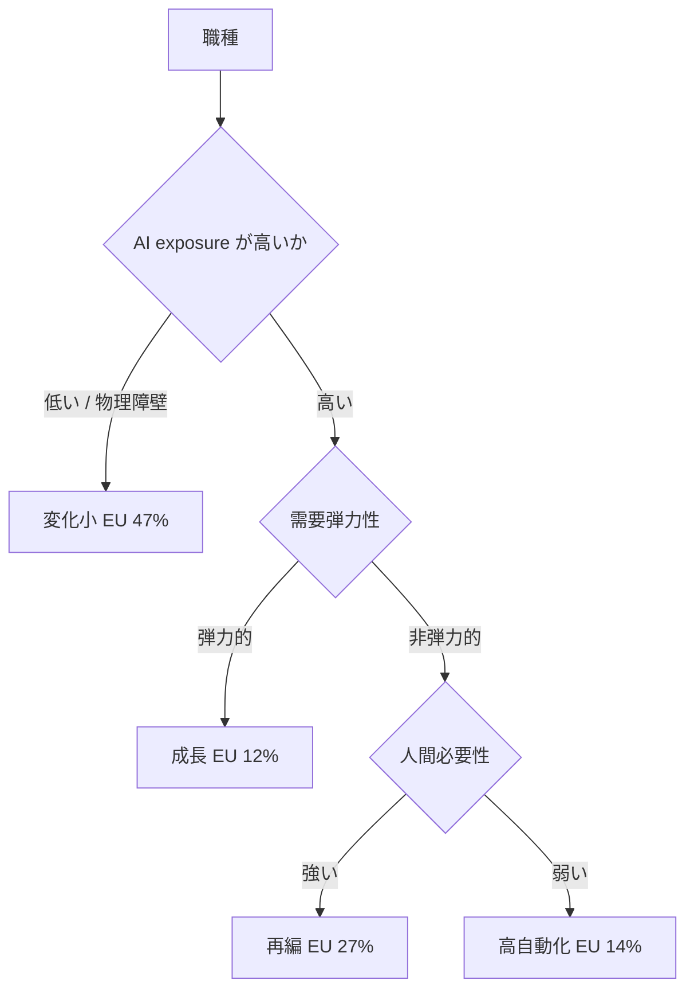

## 概要

OpenAI は 2026 年 6 月 29 日、EU 労働市場を対象にした「AI Jobs Transition Framework」を公表しました。これは 2026 年 4 月に米国向けに作ったフレームワークを、欧州標準の職業分類 ESCO と Eurostat の雇用データに載せ替えて EU に拡張したものです（出典: [openai.com](https://openai.com/index/mapping-ai-jobs-transition-eu/)）。

このフレームの肝は、AI の職種影響を「自動化されるか否か」の二分ではなく、4 つの類型に分けた点にあります。EU 雇用に占める割合は次のとおりです（記事本文の一次数値）。

| 類型 | 英語原語 | EU 雇用シェア |
|---|---|---|
| 成長 | occupations that may grow with AI | 12% |
| 高自動化 | higher near-term automation potential | 14% |
| 再編 | occupations likely to reorganize | 27% |
| 変化小 | occupations with less immediate change | 47% |

合計は 100% です。OpenAI 自身が「これは雇用予測ではなく、どこに調整圧力と機会が現れるかの準備の地図（planning map）だ」と明言している点が重要です。

:::message
一部の二次メディアは EU の数値を「自動化 18% / 再編 24% / 成長 12% / 変化小 46%」と報じています。これは米国版の数値を EU 記事に取り違えたものです。OpenAI の EU 記事本文は「EU は米国より automation 比率が小さい」と述べており、EU の自動化は 14%（米国 18% より低い）が正しい値です。本記事は EU=12/14/27/47 を主、米国=18/24/12/46 を比較として扱います。
:::

経営にとっての示唆は単純です。人数（headcount）の議論を始める前に、自社の職務がこの 4 類型のどこに割れるかを地図にする、ということです。削減対象を探すのではなく、「拡張する職務」「再編する職務」「変化しない職務」を切り分け、教育投資・権限移譲・評価制度の再設計の順序をその地図から逆算します。これが本フレームを意思決定に変換する筋道です。

## 特徴

### exposure が高い職種が自動化されるとは限らない

従来の AI 雇用影響研究は、職種を「AI にどれだけ晒されるか（exposure）」という 1 軸で並べ、その帰結を automation か augmentation かの二分で語ってきました。OpenAI の 4 類型は、exposure を出発点にしつつ、次の 3 軸の組み合わせで職種を振り分けます（米国版フレームワークの設計を EU 版が継承。米国版の定義詳細は二次情報）。

| 評価軸 | 内容 |
|---|---|
| technical capability（理論 exposure） | タスク時間のうち AI に晒される割合。Eloundou et al. 2023「GPTs are GPTs」のタスク採点を直接入力 |
| human necessity（人間必要性） | 規制・関係性・物理のいずれかで人間が役割に残る必要 |
| demand elasticity（需要弾力性） | AI がコストを下げたときの需要の弾力性 |
| realized exposure（観測 exposure） | ChatGPT 業務利用ログから見た実際の利用割合（米国版の軸） |

realized exposure について 1 点注意があります。米国版は匿名集計した ChatGPT の業務利用ログを職種タスクに紐付け、「理論上 exposed なタスクのうち実際に使われている割合」を見ています。ただし EU 版は ESCO と Eurostat をベースに human necessity と demand elasticity を欧州文脈に再推計したもので、EU 固有の realized-use データによる検証は行っていません。

この多軸化によって、同じ高 exposure の職でも結論が割れます。

| 組み合わせ | 帰結 |
|---|---|
| 高 exposure × 需要弾力的 | 成長。コスト低下が需要を拡大し雇用増もありうる |
| 高 exposure × 人間必要性強 × 需要が非弾力 | 再編。人は残るが人員需要は減りうる |
| 高 exposure × 人間必要性弱 | 高自動化リスク |
| 低 exposure / 物理障壁 | 変化小 |

つまり「exposure が高いこと」と「自動化されること」を切り離し、同時に「人間が必要なこと」と「雇用が安泰なこと」も切り離せます。これが二分法に対する最大の前進です。

### 最大の論点は「再編」の 27%

EU で最大の塊は変化小の 47% です。しかし経営の意思決定で効いてくるのは再編の 27% です。再編とは「AI でワークフローとスキル要件が変わるが、人は提供の中心に残り続ける」職種を指します。

| 性質 | 内容 |
|---|---|
| 削減対象ではない | 人は残るため |
| 現状維持でもない | 人員需要は減りうるため |
| 見えにくい | augmentation に混ぜると「人は残るが人数は減る」力学が隠れる |
| 設計コストが高い | 対応は役割再定義と reskilling と権限移譲の設計 |

最も手間がかかる類型が、ボリュームゾーンに位置しています。

### 予測ではなく準備の地図という姿勢

OpenAI は繰り返し「これは job-loss 予測ではなく transition risk のマップだ」と述べます。理由は本フレーム自身の限界にあります。理論 exposure と実際の採用には大きなギャップがあるためです。OpenAI 自身、自動化リスク職で観測 exposure 24.6% に対し理論 exposure 92.8% という「capability overhang」を報告しています。

だからこそ着地は監視と準備の提言になります。

| 提言 | 内容 |
|---|---|
| モニタリング強化 | 労働市場変化を集計統計に現れる前に追う能力 |
| national readiness plan | 各国別にテーラーメイドした準備計画 |

OpenAI の Chief Economist である Ronnie Chatterji は「EU 一律でなく加盟国ごとの個別プランが必要」と主張しています（二次情報: cryptobriefing）。

## 概念構造

### 4 類型が決まる仕組み

3 軸の合成で職種が 4 類型に振り分けられます。

| 要素名 | 説明 |
|---|---|
| AI exposure が高いか | 理論 exposure による最初の分岐 |
| 需要弾力性 | コスト低下で需要が増えるかの判定 |
| 人間必要性 | 規制・関係・物理で人間が残る必要の判定 |
| 変化小 EU 47% | exposure が低い、または物理障壁で守られる職種 |
| 成長 EU 12% | 高 exposure かつ需要弾力的な職種 |
| 再編 EU 27% | 高 exposure かつ人間必要性が強い職種 |
| 高自動化 EU 14% | 高 exposure かつ人間必要性が弱い職種 |

### 先行研究の系譜での位置づけ

OpenAI 4 類型は突然変異ではなく、exposure 研究の系譜の延長にあります。

| 研究 | 単位 | 主軸 | 代表数値 |
|---|---|---|---|
| AIOE（Felten et al. 2021） | 職種 | 単一 exposure 指標 | -2.67〜+1.58 の順位 |
| GPTs are GPTs（Eloundou 2023） | タスク | LLM exposure | 80% が 10% 以上のタスク影響、19% が 50% 以上 |
| OECD（2024） | 職種 | exposure と代替は別物 | 高自動化リスク 約 27%（二次） |
| ILO（2025） | タスク（ISCO-08） | augment が automation を上回る | exposure 約 25%、代替リスク 3.3% |
| Anthropic AEI（2025-02） | タスク（実ログ） | automation と augmentation の二分 | augmentation 57.4% / automation 42.6% |
| OpenAI 4 類型（EU 2026） | 職種（3 軸） | 成長 / 再編 / 自動化 / 変化小 | EU 12 / 27 / 14 / 47% |

これらの指標は単位（職種・タスク・労働者）も定義もバラバラで、横並び比較はできません。ILO 3.3% と OECD 27% が一桁違う点が好例です。OpenAI 4 類型の価値は、新しい数値を出したことではなく、先行指標を下位入力として包摂し、「成長」と「再編」を独立カテゴリに切り出したことにあります。

### 経営の意思決定への変換

4 類型の地図を、経営が握るべき意思決定の順序に落とすと次のようになります。

| 要素名 | 説明 |
|---|---|
| 職務マップ | 自社職務を 4 類型に分類 |
| タスク分解 | 職務をタスクに割り automate / augment / human に仕分け |
| 役割再定義 | 残ったタスクを束ね Builder / Orchestrator / Strategist へ再構成 |
| reskill と権限移譲 | 監督能力の獲得後に判断を AI へ委譲 |
| 評価制度 | KPI をアウトカム軸へ再設計 |
| headcount | 上記の結論として最後に決定 |

ポイントは headcount を順序の最後に置くことです。WEF Future of Jobs Report 2025（一次。ただし PDF が環境で timeout のため exact 数値はサブエージェント要約由来）は、労働力 100 人中 59 人が 2030 までに訓練を要し、その内訳を次のように示します。

| 区分 | 人数（100 人中） | 内容 |
|---|---|---|
| 現職 upskill | 29 人 | 現職のままスキル向上で対応可能 |
| redeploy | 19 人 | 別所へ再配置して活用 |
| 移行困難 | 11 人 | 必要な再教育を受けられず雇用リスク |

これはマクロ予測なので個社にそのまま写像はできません。それでもマクロでは「削減候補」に見える層にも相当の再配置余地があることが示唆されます。先に削ると、この再配置可能な人材を地図化する前に失います。

この順序が正しいことは実証でも裏付けられます。

| 観点 | 内容 |
|---|---|
| ワークフロー再設計 | AI を足すだけは生産性 +5%、human-AI 中心の再設計で +30%（欧州 telecom、二次） |
| 削減のリターン | 最も人員削減した企業のリターンは最も削減しなかった企業とほぼ同じ（Gartner、二次） |
| error-correction 層 | Ford はベテラン削減で品質補正層を失い、再雇用コストが削減額を上回った（二次） |

経営が決めるべきことを集約すると、次の 6 点になります。

1. 意思決定の順序を固定する。タスク分解 → 仕分け → 役割再定義 → reskill と権限 → 最後に headcount。
2. 分析単位を職種台帳でなくタスクとスキルにする。
3. HITL（人間を実行経路に残す）を保つ領域、すなわち権利・財務・健康・規制の影響を職務記述に固定し、それ以外で監督能力が育った領域を HOTL に移す。
4. 評価指標を「AI 導入数 / 自動化率」でなく「再設計したワークフローのアウトカム」にする。
5. 削減前に redeploy 可能性（スキル隣接性）を必ず評価し、error-correction を担う暗黙知保有者を保護する。
6. 「AI を口実にした削減（AI washing）」を禁止・監査するガバナンスを置く。

### 自社での始め方

いきなり全社の職務マップを作る必要はありません。次の順で小さく始めると、95% が ROI を出せていない大規模変革の轍を避けられます。

1. 主要職務を 4 類型に仮置きする。粒度はタスク単位とし、職種名で丸めない。
2. 「再編」に落ちた職務を最優先で精査する。ボリュームゾーンかつ最も設計が要るため。
3. 自社人員を WEF の 29 / 19 / 11（現職 upskill / redeploy / 移行困難）に対応づけ、削減判断の前に redeploy 経路を引く。
4. 1 職務群だけで「タスク分解 → 役割再定義 → 評価指標のアウトカム化」を回し、ROI を確認してからスケールする。
5. HITL を残す領域（権利・財務・健康・規制）を職務記述に固定する。

## 反証と限界

本フレームを意思決定の根拠にする前に、提言の根拠・前提・有効性をそれぞれ直撃する反証を直視します。

### 根拠を弱める発信源バイアス

OpenAI 自身が AI ベンダーであり、雇用影響分析には構造的な利益相反があります。退職した元社員が OpenAI の経済リサーチチームを内部で「アドボカシー部門（advocacy arm）」と評し、AI による雇用代替などネガティブな研究の公表が慎重になったと WIRED が報じています（二次情報: [Gizmodo/WIRED](https://gizmodo.com/openai-accused-of-self-censoring-research-that-paints-ai-in-a-bad-light-2000697413)）。「automation でなく再編」という framing は、AI 活用継続つまり製品販売の動機と矛盾しません。中立的な地図として鵜呑みにせず、第三者研究（OECD・ILO・学術）と突き合わせる必要があります。

### 前提を弱める exposure と実採用の乖離

4 類型は exposure ベースであり、理論値の地図です。NBER の研究（要再検証。一次 PDF が 403 で本文の数値・図表を独立再確認できず、サブエージェント要約由来）は、comparative advantage モデルが実際の AI 採用変動の約 60% を説明するのに対し、exposure-only モデルは 14% に留まり、約 30% の労働者で両者が乖離すると報告しています（[nber.org](https://www.nber.org/papers/w35271)）。マップ先行で制度を再設計しても、実態と 3 割ズレうる、ということです。

### 有効性を弱める AI 変革の低い成功率

MIT NANDA「The GenAI Divide」報告（報告書・ミラー。Fortune と整合）によれば、生成 AI を導入した組織の 95% で測定可能なリターンが出ていません（[fortune.com 経由](https://fortune.com/2025/08/18/mit-report-95-percent-generative-ai-pilots-at-companies-failing-cfo/)）。reskilling は upskilling より従業員満足度が低く（62% 対 73%、二次）、最も成果が出にくい領域です。「大規模な制度再設計を急げ」という提言は、95% が ROI を出せていない領域への賭けになりえます。これは「順序を間違えるな」という規範は支持しつつ、「小さく検証してからスケールせよ」という慎重さを併せ持つべき根拠になります。

### EU 固有の摩擦

職務再編を伴う workforce 最適化は、EU では AI Act（Annex III）と works council 法と解雇規制の積み重ねにより、経営の一存では進みません（二次: [aiactblog.nl](https://www.aiactblog.nl/en/posts/ai-workforce-planning-restructuring-eu-ai-act)）。順序設計そのものが組合協議の対象になりえます。

### 頑健な論点

一方で、反証探索でも崩れなかった論点もあります。「automation 二分法より粒度を上げる方向性そのもの」は、Frey & Osborne 2013 の「47% が自動化リスク」が OECD の task-based 分析（Arntz et al. 2016）で約 9%（21 OECD 国平均、米国も 9%）に縮小された経緯（一次）が、むしろ「粒度を上げるべき」方向を補強します。「拙速なレイオフを最優先にしない」という規範も、正面から否定する一次文献は見つかりませんでした。

## 未解決の問い

- 対象職種数は EU 報告書に 2,609 ESCO occupations と明記。総雇用者数の母数のみ未確認。
- EU 版の「成長」「再編」の具体的職種名は記事・二次とも逐語抽出できず未確認。職種例は米国版（法廷速記者は高 exposure、判事・弁護士・教師・看護師・配管工は human necessity で保護）で代替。
- ChatGPT 観測データの EU 版での適用粒度は未確認（米国版継承と推定）。

## まとめ

OpenAI の EU 職種 4 類型マップは、AI の影響を「自動化か否か」の二分から「成長・自動化・再編・変化小」へと粒度を上げ、人数削減より先に職務マップを作る発想を後押しします。一方で発信源バイアス・exposure と実採用の乖離・AI 変革の低い成功率という反証があり、提言は「順序を間違えず、小さく検証してからスケールする」姿勢で受け取るのが妥当です。

この記事が少しでも参考になった、あるいは改善点などがあれば、ぜひリアクションやコメント、SNSでのシェアをいただけると励みになります！

## 参考リンク

- 公式ドキュメント
  - [Mapping Europe's AI Workforce Opportunity (OpenAI EU)](https://openai.com/index/mapping-ai-jobs-transition-eu/)
  - [The AI Jobs Transition Framework for the EU (PDF)](https://cdn.openai.com/pdf/the-ai-jobs-transition-framework-for-the-eu.pdf)
  - [The Anthropic Economic Index](https://www.anthropic.com/news/the-anthropic-economic-index)
  - [WEF Future of Jobs Report 2025 (PDF)](https://reports.weforum.org/docs/WEF_Future_of_Jobs_Report_2025.pdf)
  - [ILO Generative AI and Jobs (WP140)](https://www.ilo.org/publications/generative-ai-and-jobs-refined-global-index-occupational-exposure)
  - [OECD The risk of automation for jobs (Arntz et al. 2016, PDF)](https://www.oecd.org/content/dam/oecd/en/publications/reports/2016/05/the-risk-of-automation-for-jobs-in-oecd-countries_g17a27d8/5jlz9h56dvq7-en.pdf)
- 論文
  - [GPTs are GPTs (Eloundou et al. 2023)](https://arxiv.org/abs/2303.10130)
  - [Beyond Exposure: comparative advantage (NBER w35271)](https://www.nber.org/papers/w35271)
  - [The Simple Macroeconomics of AI (Acemoglu, NBER w32487)](https://www.nber.org/system/files/working_papers/w32487/w32487.pdf)
  - [The GenAI Divide: State of AI in Business 2025 (MIT NANDA)](https://mlq.ai/media/quarterly_decks/v0.1_State_of_AI_in_Business_2025_Report.pdf)
- 記事
  - [Agents, robots, and us (McKinsey MGI)](https://www.mckinsey.com/mgi/our-research/agents-robots-and-us-skill-partnerships-in-the-age-of-ai)
  - [AI Transformation Is a Workforce Transformation (BCG)](https://www.bcg.com/publications/2026/ai-transformation-is-a-workforce-transformation)
  - [AI and the future of human decision-making (Deloitte)](https://www.deloitte.com/us/en/insights/topics/talent/human-capital-trends/2026/decision-making-with-ai.html)
  - [OpenAI accused of self-censoring research (Gizmodo/WIRED)](https://gizmodo.com/openai-accused-of-self-censoring-research-that-paints-ai-in-a-bad-light-2000697413)
  - [MIT report: 95% of generative AI pilots failing (Fortune)](https://fortune.com/2025/08/18/mit-report-95-percent-generative-ai-pilots-at-companies-failing-cfo/)
  - [AI workforce planning and the EU AI Act](https://www.aiactblog.nl/en/posts/ai-workforce-planning-restructuring-eu-ai-act)
