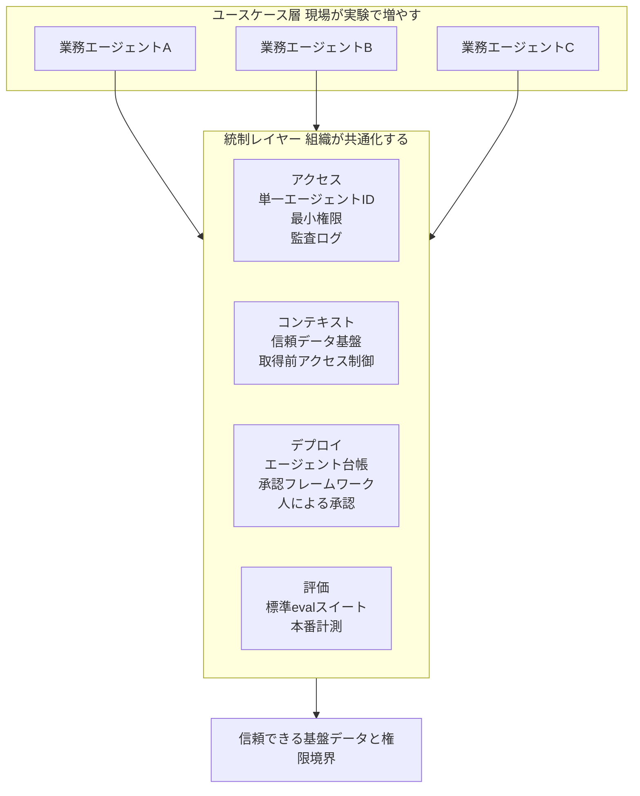

この記事は「OpenAI Frontier を運用基盤に据えた HP の事例」を起点に、個人差で進む AI 活用を組織標準へ引き上げるとき、何をどの順で共通化すべきかを発注側の判断材料として整理したものです。先に結論を述べると、論点は「統制を先に作るか、実験を先に回すか」の二択ではありません。

想定読者は、AI 導入を主導する経営層・PM・プラットフォームやガバナンスの設計者です。

## 概要

2026年6月28日、HP が OpenAI との戦略的パートナーシップ「OpenAI Frontier」の本格活用を発表しました [二次情報: cryptopolitan]。注目点は「AI で何ができたか」という成功事例の列挙ではありません。HP が Frontier を「pilot から portfolio of agents へ移行する際の運用モデル (operating model)」として位置付けたことです。

OpenAI Frontier 自体は2026年2月に発表された、エンタープライズ向けの AI エージェント運用プラットフォームです [二次情報: CNBC/TechCrunch]。公式は「企業が AI エージェントを build, deploy, manage するための新しいプラットフォーム」と定義し、単一の UI や API ではなく、エージェントを「AI coworker (AI 同僚)」として組織に組み込む土台と位置付けています [一次: openai.com]。

HP の公式ページは、この土台を一文で要約しています。

> "Frontier gives HP the operating model for that motion: connecting access, context, deployment, and evaluation as the work moves from pilots toward production." [一次: openai.com]

つまり「アクセス (権限)・コンテキスト (文脈)・デプロイ・評価」を束ねる横断的な統制レイヤーとして、AI 導入を捉え直しています。これは、個別ツールの寄せ集め (point solutions) から、組織横断の運用基盤 (control plane) へという、エンタープライズ AI の論点の移動を象徴する事例です。

ただし本記事は Frontier を「正解の実装」として礼賛しません。後半で示すとおり、大規模な実証データはむしろ、重い中央集権的な運用や内製偏重が、かえって成功率を下げうると示唆しています。発注側が読むべきは、製品の宣伝文句ではなく、その背後にある設計思想と、それが効く条件・効かない条件です。

## OpenAI Frontier が束ねる4つのコンポーネント

OpenAI Frontier は、人間の従業員が職場で成果を出すために必要なもの (共有された文脈・オンボーディング・フィードバックによる学習・明確な権限と境界) を、そのまま AI エージェントに与える設計思想を採ります [一次: openai.com]。具体的には4つのコアコンポーネントで構成されます。コンポーネント名は公式ページのラベルに基づきます。

| コンポーネント | 公式の説明 (要約) | 4語との対応 |
|---|---|---|
| Business Context | データウェアハウス・CRM・社内アプリを接続し、エージェントが人と同じ情報で働けるようにする永続的な組織記憶 | context (文脈) |
| Agent Execution | モデルの知能を実際の業務状況に適用し、複数エージェントが並列に協働して複雑なタスクを完遂する実行環境 | deployment (実行/展開) |
| Evaluation and Optimization | 何が機能していて何が機能していないかを示す組み込みの評価・最適化ループ | evaluation (評価) |
| Enterprise security and governance | 包括的な統制と監査、明示的な権限、監査可能なアクション | access (権限/統制) |

なお、HP ページが要約する4語 (access / context / deployment / evaluation) と、公式の4コンポーネント名は、厳密な1対1の対応ではありません。access は Enterprise security and governance のうち identity と権限の部分に対応します。

ガバナンス面では、従業員と AI coworker の双方に適用される IAM (Identity & Access Management)、エージェントごとの固有 identity による最小権限のスコープ付け、SOC 2 Type II・ISO/IEC 27001 / 27017 / 27018 / 27701・CSA STAR などの準拠、そして組み込みの監視と詳細ログによる traceability・accountability・control を掲げています [一次: openai.com]。

ただし、監査ログが各エントリで具体的にどのフィールドを捕捉するか (誰が・いつ・どのツール・入出力) のフィールドレベル仕様は、公式3ページに記載がなく未確認です。公式は「detailed logs / auditable actions」という抽象表現にとどまります。価格も非公開です [二次情報: CNBC]。

## HP は何を「型」にしたのか

HP は2026年2月に Frontier のテストを開始し、複数のパイロットを経て本格展開へ移行しました [一次: openai.com]。重点領域は、顧客・パートナー向け体験、顧客テレメトリ分析、従業員の生産性、ソフトウェア開発です。パートナーポータル (10万社以上が利用、ビジネスの80%以上がパートナー経由) のセルフサービス統合などが挙がっています。

HP がパイロットで示した数値は以下です。

| 領域 | 示された数値 | 留意点 |
|---|---|---|
| ソフトウェア開発 | エンジニア1人が数週間で 122 件の PR を 43 プロジェクトにわたって処理 | n=1、ベースライン提示なし |
| セキュリティ修正 | 1か月かかり得た作業を1日で複数のバグ修正 | 内部推定 |
| セキュリティ運用 | 週あたり約82時間の capacity を解放 | 公式本文が directional estimate と明記 |

役員の実名コメントは公式 HP ページにはなく、匿名エンジニアの感想のみである点に留意が必要です。これらは独立監査された ROI ではなく、発表時点 (数日前) のベンダー提供メトリクスです。詳細は後半の反証セクションで扱います。

早期採用企業として HP・Intuit・Oracle・State Farm・Thermo Fisher・Uber、パイロットに Cisco・BBVA・T-Mobile が挙がっています [公式発表・報道で確認: openai.com / cryptopolitan / CNBC]。

## なぜ「PoC 量産」が組織標準に届かないのか

Frontier が解こうとしている問題は HP 固有ではありません。エンタープライズ AI が PoC 段階で停滞する構造は、複数の調査が一貫して「モデル品質ではなく運用モデルの問題」と指摘しています。

| 調査 | 主要な指摘 | 出典 |
|---|---|---|
| Gartner | 生成 AI プロジェクトの少なくとも30%が、データ品質の低さ・不十分なリスク統制・コスト膨張・不明確なビジネス価値により、2025年末までに PoC 後に頓挫 | 一次: Gartner press 2024-07-29 |
| Gartner | agentic AI プロジェクトの40%超が2027年末までにキャンセル | 一次: Gartner press 2025-06-25 |
| MIT (The GenAI Divide, 2025) | 企業パイロットの約95%が測定可能な P&L インパクトを生んでいない。失敗は approach (やり方) で決まるとし、ワークフロー・組織・文化への統合不全 (learning gap) を主因とする | MIT NANDA 一次レポート、Fortune 2025-08-18 経由 |
| Microsoft Cloud Adoption Framework | すべてのエージェントが稼働前に満たすべき最低要件 (baseline) を中央で定義することを推奨。原文は "minimum requirements that every agent must meet before it is allowed to operate" | 一次: Microsoft Learn (更新 2026-06-26) |

Microsoft Cloud Adoption Framework は、統制レイヤー先行論の最も明確な一次記述です。コントロールプレーンと identity、データガバナンス、セキュリティ、開発標準の4領域を、組織横断で標準化するとしています。

日本のデータも同じ構造を示します。

- IPA「DX動向2025」(2025年7月公表): 生成 AI に前向きに取り組む企業は日本5割弱で、米国8割弱・ドイツ7割弱に届きません。「個人や部署での試験利用」は3か国とも高い一方、「部署の業務プロセスに組み込まれている」割合は日本が低く、個人利用止まりです。活用上の課題トップ層は3か国共通で「適切な利用を管理するためのルールや基準の作成が難しい」というガバナンス課題です [一次: IPA 本文 PDF]
- PwC「生成 AI 実態調査2025春」: 効果を出す企業は「経営トップ直轄・中核プロセスへの統合・強固なガバナンス整備」、効果が出ない企業は「断片的なツール導入」という対比です [二次情報: @IT / AIsmiley、原典 PDF は403で未取得]
- 事例 (先に共通化した日本企業): パナソニック コネクトは2023年2月に「ConnectAI」を国内全社員 (約1.24万人) へ一斉展開しました。目的の1つはシャドー AI (無秩序な外部 AI 利用) リスクの軽減で、安全な全社共通基盤を先に配って統制下に置きました。削減効果は初年度 (2023年6月から2024年5月) で約18.6万時間、2024年では約44.8万時間/年です [一次: Panasonic プレス 2024-06-25 / 2025-07-07]。富士通も2023年5月に全社セキュア環境と利用ガイドラインを先に整備しました [一次/二次: Fujitsu]
- 制度: 経済産業省・総務省「AI 事業者ガイドライン第1.2版」(2026-03-31) が公表され、アジャイル・ガバナンスを掲げて AI エージェントを含む新たな論点への対応を進めました [一次: METI]

## 統制レイヤーの4要素

「PoC 量産」から「組織標準」への移行は、個別ツール (point solutions) を増やすことではありません。全ユースケースで再利用できる横断的な統制レイヤーを整えることです。Frontier の4コンポーネントも、Microsoft CAF の4領域も、日本企業の「先に共通化したもの」も、おおむね次の4要素に収斂します。

| 要素 | 共通化する中身 |
|---|---|
| アクセス (権限) | エージェントごとの単一 identity、最小権限、ユーザー権限の継承、取得前のアクセス制御、監査ログ、緊急停止 |
| コンテキスト (文脈) | RAG の上流に置く信頼データ基盤、エージェント横断で再利用する標準コネクタ |
| デプロイ (展開) | 中央のエージェント台帳、承認済みフレームワークとプロトコル、監査優先の段階的ガードレール、人による展開承認 |
| 評価 | CI/CD のゲートとなる標準 eval とレッドチーム、本番での継続計測 |

コンテキストの統制では「ユーザーに見えてはいけない文書は retriever にも見えてはいけない」という原則が要点です [一次: Microsoft CAF]。評価では「Done」の定義を「デモが動く」から「標準 eval を通過し、人の承認を得て、本番で計測されている」へ拡張します。

## pilot から portfolio へ移ると管理単位が変わる

1つのパイロットは「アプリ」の管理です。エージェント群 (portfolio) は「統制された非人間アクターの集団」の管理になります。ここで効いてくるのが identity・インベントリ・観測性・コスト配賦・ポリシー適用です。

- Deloitte「State of AI in the Enterprise 2026」(24か国3,235名): agentic AI の成熟したガバナンスモデルを持つ組織は約21%にとどまります [一次: Deloitte、tech.co 二次経由]
- 非人間 identity (NHI) は人間を大きく上回り、NHI 対人間比は45対1 (Rubrik) から144対1 (Entro / DevOps) です。WEF 2025 では51%の組織が「AI identity の所有者が不明確」と回答しています [一次: 各 labs research、二次経由]

つまり「エージェントを増やす」前に、「動いているエージェントを把握し、誰の責任かを辿れる」基盤が必要だという主張です。

## 反証: 「統制を先に固める」は本当に正しいか

ここが本記事で最も重要な論点です。大規模な実証データは、むしろ重い中央集権的な運用や内製偏重が、かえって成功率を下げうると示唆しています。

1. 実験先行・脱中央集権が中央集権を約3倍上回りました。MIT の GenAI Divide は、ベンダーと組んだ脱中央集権的な導入が67%の成功率だった一方、典型的に中央集権的な内製はその約3分の1だったと報告します (約22%は67%の3分の1としての概算 [二次情報: Fortune])。MIT の明確な提言は「中央 AI チームではなくライン管理者が統合を主導すべき」であり、「統制レイヤーを先に」とは逆を向きます [MIT NANDA 2025、Fortune 2025-08-18 経由]
2. 実験として始めた企業が成功しています。Stanford の51導入事例 Playbook (2026) では、成功企業の73%が意図的にスモールスタートし、63%がパイロットを明示的に実験として位置付けました。先にプラットフォームを作って捨て、実験先行で作り直した事例もあります [Stanford Digital Economy Lab]
3. 過剰ガバナンスは停滞要因そのものです。agentic AI の40%超が2027年末までにキャンセルされる主因には、コスト膨張・価値不明確が含まれます。統制プロセスが遅すぎる、または過大という不満も報告されています [Gartner 2025-06-25。不満比率は二次情報]
4. Frontier 固有のロックインと未成熟リスクがあります。アナリスト (Futurum) は、価格非公開、セキュリティ製品一覧に Frontier が載っていない、Forward Deployed Engineer 依存の consultingware はスケールしない、モデルは可搬でもコントロールプレーン自体は proprietary、と指摘します。運用モデルそのものを、発表から約4か月の単一ベンダー基盤に賭けるリスクです [二次情報: Futurum]
5. HP の proof points はベンダー提供メトリクスです。「122 PR」はエンジニア1人 (n=1、ベースラインなし)、「週82時間」は本文が directional estimate と明記、発表は数日前です。portfolio スケールでの ROI 検証ではありません
6. 「何を標準化すべきか」は実験しないと分かりません。早すぎる標準化は誤った抽象を固定します (premature abstraction)。Frontier 自身の最難問とされる「CRM の粗利と ERP の粗利が同じだとエージェントに教える」セマンティクスの統一すら、ユースケースを走らせて初めて不一致が見えます [二次情報: Futurum]

## 反証を踏まえた統合: 二択を解体する

一方で、反証は次の点を覆しませんでした。これは thesis が生き残る部分です。

- 自律的に行動するエージェント (支払いを起こす・予約する) には、説明責任とリスク統制が必須です [Gartner]
- 統制ゼロも失敗します。シャドー AI の野放図な増殖は別の失敗モードであり、これはパナソニックが共通基盤を先に配った動機と一致します

したがって、正しい結論は「統制を先に」でも「統制ゼロ」でもなく、次の第三の枠組みです。

> 薄く効く統制 (最小権限・監査優先・eval ゲート) を組織で共通化しつつ、ユースケース自体は現場ライン主導の実験で増やす。統制と実験を同時に、軽量反復で回す (govern AND enable concurrently)。

Microsoft CAF が「いきなり制限せず、監査ベースで始めて段階的に統制を強める (phased / audit-first)」と推奨しているのは、まさにこの均衡点を狙ったものと読めます [一次: Microsoft CAF]。

## 発注側への推奨

1. 最初に共通化するのは「薄い4要素」に絞ります。全エージェントに固有 identity と最小権限・監査ログを必須化し (アクセス)、信頼データ基盤への取得前アクセス制御を敷き (コンテキスト)、エージェント台帳と人による展開承認を置き (デプロイ)、標準 eval をゲート化します (評価)。これ以上の重い標準化は後回しにします
2. ユースケースは中央でなくラインに増やさせます。何を作るかは現場の実験に委ね、中央は「何が動いているか把握できる」状態だけを保証します。MIT と Stanford が示すとおり、ここを中央集権にすると成功率が落ちます
3. 「Done」の定義を移します。「デモが動く」から「eval 通過・人の承認・本番計測」へ移します。効果測定の欠如が展開停止の隠れた主因です
4. 単一ベンダーの運用モデルに全賭けしません。Frontier のような統制プラットフォームは「型の一例」として評価し、コントロールプレーンのロックイン (モデル可搬性とは別問題) と価格不透明性を、契約段階で詰めます
5. シャドー AI を「禁止」でなく「吸収」します。安全な共通基盤を先に配り、個人利用を統制下に取り込みます (パナソニックの型)。禁止は利用を地下に潜らせるだけで、統制を弱めます

## 未解決の問い

- Frontier は発表から約4か月、HP の本格展開発表は数日前です。「統制レイヤー先行が portfolio スケールで効いた」かを示す独立監査データはまだ存在しません [要再検証: 今後数か月]。成功・失敗どちらの結論も、現時点では埋まっていません
- 監査ログのフィールドレベル仕様・価格は公式非公開です。本番採用前に、契約で開示を求めるべきです
- 「統制ありの企業は本番運用数が12倍」などの魅力的な数値は原典未確認です [要再検証]。本記事では採用していません

## まとめ

OpenAI Frontier と HP の事例は、AI 導入を「個別ツールの寄せ集め」から「アクセス・コンテキスト・デプロイ・評価を束ねる統制レイヤー」へ捉え直す象徴です。ただし大規模な実証データは中央集権の先行を支持せず、薄い統制を共通化しつつ実験は現場主導で回す均衡が、発注側の現実解になります。

この記事が少しでも参考になった、あるいは改善点などがあれば、ぜひリアクションやコメント、SNS でのシェアをいただけると励みになります！

## 参考リンク

- 公式ドキュメント
  - [OpenAI: HP Frontier partnership](https://openai.com/index/hp-frontier-partnership/)
  - [OpenAI: Introducing OpenAI Frontier](https://openai.com/index/introducing-openai-frontier/)
  - [OpenAI Frontier (business)](https://openai.com/business/frontier/)
  - [Gartner: 30% of GenAI projects abandoned after PoC by end 2025 (2024-07-29)](https://www.gartner.com/en/newsroom/press-releases/2024-07-29-gartner-predicts-30-percent-of-generative-ai-projects-will-be-abandoned-after-proof-of-concept-by-end-of-2025)
  - [Gartner: 40% of agentic AI projects canceled by 2027 (2025-06-25)](https://www.gartner.com/en/newsroom/press-releases/2025-06-25-gartner-predicts-over-40-percent-of-agentic-ai-projects-will-be-canceled-by-end-of-2027)
  - [Microsoft Cloud Adoption Framework: Govern and secure AI agents](https://learn.microsoft.com/en-us/azure/cloud-adoption-framework/ai-agents/governance-security-across-organization)
  - [Stanford Digital Economy Lab: The Enterprise AI Playbook](https://digitaleconomy.stanford.edu/publication/enterprise-ai-playbook/)
  - [IPA「DX動向2025」](https://www.ipa.go.jp/digital/chousa/dx-trend/dx-trend-2025.html)
  - [経産省・総務省「AI事業者ガイドライン第1.2版」(2026-03-31)](https://www.meti.go.jp/shingikai/mono_info_service/ai_shakai_jisso/20260331_report.html)
  - [パナソニック コネクト: ConnectAI 1年実績 (2024-06-25)](https://news.panasonic.com/jp/press/jn240625-1)
  - [富士通: 生成AI利活用ガイドライン公開 (2024-01-12)](https://global.fujitsu/ja-jp/technology/key-technologies/news/ta-generative-ai-utilizationguideline-20240112)
- 記事
  - [Fortune: MIT report — 95% of genAI pilots failing (2025-08-18)](https://fortune.com/2025/08/18/mit-report-95-percent-generative-ai-pilots-at-companies-failing-cfo/)
  - [Futurum: OpenAI Frontier — close the gap or widen it?](https://futurumgroup.com/insights/openai-frontier-close-the-enterprise-ai-opportunity-gap-or-widen-it/)
  - [@IT: PwC 生成AI実態調査2025春](https://atmarkit.itmedia.co.jp/ait/articles/2507/01/news027.html)
  - [InfoQ: OpenAI Frontier launch (2026-02)](https://www.infoq.com/news/2026/02/openai-frontier-agent-platform/)
  - [AI News: HP accelerates workflows with OpenAI Frontier (2026-06-29)](https://www.artificialintelligence-news.com/news/hp-accelerates-enterprise-workflows-openai-frontier/)
