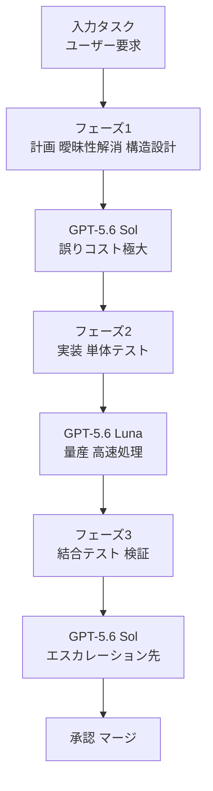

2026年7月30日、OpenAI が GPT-5.6 ファミリの価格改定を発表しました。軽量モデル「GPT-5.6 Luna」が 80% 値下げ、中位モデル「GPT-5.6 Terra」が 20% 値下げされています。

この記事は、値下げのファクトを整理したうえで「では自分たちのエージェント構成をどう組み替えるか」を判断するための材料を提供します。読み終えたときに、次の3つが手元に残ることを目指します。

- 改定後の単価表と、Codex / ChatGPT Work のクレジット消費への波及範囲
- モデル選定を単価ではなく「誤りコスト」で決めるための判断軸
- 工程別ルーティングを実装するときの設計ルールと、その適用限界

対象読者は、AI エージェントを業務プロセスに組み込む側の設計者と、その予算を承認する立場の方です。

## 何が改定されたのか

### 単価表

GPT-5.6 ファミリは、フラッグシップの Sol、汎用の Terra、軽量高速の Luna という3ティア構成です。改定後の単価は次のとおりです（2026年8月1日時点で確認した OpenAI 公式発表に基づく）。

| モデル | 想定用途 | 入力 (1M tok) | 出力 (1M tok) | 改定率 |
|---|---|---|---|---|
| GPT-5.6 Sol | 複雑な推論、アーキテクチャ設計、高度なコード構造化 | $5.00 | $30.00 | 据え置き（Fast mode 追加） |
| GPT-5.6 Terra | 汎用タスク、日常的な開発業務 | $2.00 | $12.00 | 20% 値下げ |
| GPT-5.6 Luna | 高頻度処理、ログ解析、テスト生成、単体コード実装 | $0.20 | $1.20 | 80% 値下げ |

注目すべきは Sol と Luna の比です。入力で 25 倍、出力で 25 倍の開きがあります。この開きが、後述する「工程ごとに割り当てを変える」という設計を成立させます。

### API 単価にとどまらない波及

改定は API 課金だけの話ではありません。Codex および ChatGPT Work において、Luna / Terra を使うタスクのクレジット消費係数も引き下げられています。定額枠でバックグラウンドエージェントを回している場合、同じ契約のまま実行回数と自動試行の枠が広がります。

つまり従量課金の利用者だけでなく、定額枠の利用者にも影響が及びます。「うちは API を直接叩いていないから関係ない」という判断は、この改定に関しては成立しません。

## なぜ単価比較で決めると判断を誤るのか

単価が 25 分の 1 になったからといって「安いモデルに寄せればコストが 25 分の 1 になる」わけではありません。実運用のコストは、次の3要素の合計で決まります。

1. トークン単価
2. 誤りコスト（Misrouting Loss）: 誤った出力を得たときの手戻り費用
3. レビュー負荷（Review Overhead）: 人間が確認・承認するために必要な時間

### 誤りコストが判断軸になる

モデル選定を実質的に決めるのは、単価ではなく「その工程で間違えたときに何が失われるか」です。

**誤りコストが極大の領域**（Sol を割り当てる）

- システムアーキテクチャの決定
- 安全性・セキュリティ仕様の設計
- 未定義要件の解釈

ここでの誤りは、後続工程すべてを無効化します。実装が 100 ファイル進んだあとで前提が崩れれば、失われるのは API 費用ではなく、その間に費やした時間とレビュー枠です。

**誤りコストが極小の領域**（Luna を割り当てる）

- 明確な入出力仕様に基づく純粋関数の実装
- 既存テストケースの展開
- フォーマット変換

これらは、テストが即座に失敗を検知します。失敗しても手戻り費用は API の再実行分だけで済みます。1M トークンあたり $0.20 の入力単価なら、数回のリトライは誤差の範囲です。

判断の分かれ目は「機械が誤りを検知できるか」であり、「タスクが簡単そうか」ではありません。この2つを混同すると、検知機構のない曖昧なタスクを安いモデルに流して手戻りを積み上げることになります。

### ボトルネックは計算資源から人間側へ移る

試行コストが下がると、バックグラウンドでの試行錯誤とエージェントのループ回数が増えます。生成量が跳ね上がる一方で、人間の確認・テスト・承認のスピードは変わりません。

結果として、レビュー帯域が新しいボトルネックになります。値下げによって浮いた金額よりも、レビューしきれない生成物が「未消化債務」として組織に積み上がるコストのほうが大きくなる構図があり得ます。これは価格低下が消費量を増やす構造であり、Jevons のパラドックスとして知られる現象と同じ形をしています。

## 工程別ルーティングの構造

以上を踏まえた工程配分は次のようになります。

ポイントは、フェーズ1の出力が「明確化されたサブタスクと仕様」であることです。ここが曖昧なままフェーズ2へ渡ると、Luna は仕様の隙間を推測で埋めます。安いモデルの精度が問題なのではなく、渡す仕様の解像度が問題になります。

### カスケード方式が実務では扱いやすい

ルーティングの実装方式は大きく2つあります。

| 方式 | 仕組み | 難所 |
|---|---|---|
| 動的分類器（Router） | タスクを事前に分類し、一発で割り当て先を決める | 分類器自体の精度と判定オーバーヘッド |
| カスケード（Cascade） | まず Luna で試し、テスト不合格や確信度不足で Sol へ昇格 | 昇格条件の設計 |

実用上は、カスケード方式のほうが扱いやすいという整理になります（調査元は RouteLLM 論文および業界検証結果を二次情報として挙げています。一次資料での確認は取れていません）。

理由は明快で、カスケードは失敗検知を Linter や単体テストといった既存の機械的判定に委ねられるからです。「このタスクは難しいか」をモデルに判定させる必要がなく、「テストが通ったか」という決定的な信号だけで昇格を決められます。判定ロジックが確率的でなくなる分、挙動が追跡しやすくなります。

一方で、昇格条件を設計しないと Luna が失敗し続けるループに入ります。同一タスクの試行回数に上限を置き、超過したら Sol へ渡すか人間に返す、という打ち切り条件は必須です。

## 実装するときの3つのルール

### ルール1: 全工程同一モデルをやめ、責務を分離する

エージェントのワークフローを、思考・計画の層と作業・展開の層にコード上で分けます。プロンプトの中で「必要に応じて手を抜いて」と指示するのではなく、呼び出し先のモデル ID を工程ごとに固定します。

具体例として、アプリケーション構築なら次の配分になります。

- 上位モデル: ディレクトリ設計、インターフェース定義、エラー設計
- Luna: 各ファイルのボイラープレート実装、テストケースの展開

分離をコード上の構造として持つことで、あとから配分を変えるときに「どの工程を動かしたか」が差分として残ります。プロンプト内の曖昧な指示に埋め込むと、この追跡ができません。

### ルール2: ループ上限と日次予算の上限を置く

単価が下がると、発注するトークン量は無意識に増えます。次の2つのガードレールを先に置きます。

- 1リクエストあたりの最大ループ数（Max Iterations）
- 日次の予算上限（Cost Guardrail）

さらに、人間がレビューしきれない量の生成は組織の債務になります。レビュー側の自動化（CI での自動テスト、E2E テスト）を先に整えないまま生成量だけを増やすと、承認待ちのプルリクエストが積み上がります。生成の帯域を上げる前に、検証の帯域を上げる順序が要点です。

### ルール3: 検証機構（Verifier）とセットでのみ委譲する

Luna にタスクを渡すときは、機械的に成否を判定できる環境を必ず伴わせます。

- 型チェック
- テストの自動実行
- 正規表現によるパターンマッチ

逆に言えば、自然言語での目視確認を前提としたタスクを Luna に委譲すると、手戻りコストが増えます。「安いから広く使う」ではなく「検証できる範囲でだけ使う」が判断基準です。

## 適用しにくい領域

このアーキテクチャには限界があります。以下は調査時点で未解決として整理された論点です。

**コンテキスト長と命令追従性**

Luna は高速かつ安価ですが、長大なコンテキストの処理と、複雑な否定条件（「〜をしてはならない」）の遵守において Sol に劣ります。長文ドキュメントの一括処理を Luna に任せると、要約漏れが発生し得ます。禁止事項が多いタスクほど、上位モデルに残す判断が妥当です。

**モデル切替に伴うコンテキスト再転送**

異なるモデル間で作業を引き継ぐには、会話履歴や要約を毎回プロンプトへ埋め込む必要があり、入力トークン数が膨らみます。Luna の入力単価が $0.20/1M であるため金額面の打撃は軽微ですが、プロンプト設計が複雑になるという運用オーバーヘッドは残ります。

工程を細かく分けるほど引き継ぎ回数が増えるため、分割の粒度は「引き継ぎコスト」と「単価差」の釣り合いで決めることになります。工程を無限に細分化すれば安くなるわけではありません。

## まとめ

- GPT-5.6 Luna が 80% 値下げ、Terra が 20% 値下げされ、Codex / ChatGPT Work のクレジット消費係数にも波及した
- モデル選定の判断軸は単価ではなく誤りコストであり、分かれ目は「機械が誤りを検知できるか」
- 実装方式はカスケード（Luna で試行し、テスト不合格で Sol へ昇格）が追跡しやすい
- 生成の帯域を上げる前に、レビューと検証の帯域を上げる順序を守る
- コンテキスト長と否定条件の遵守、モデル間の引き継ぎコストが適用の限界を決める

値下げが変えたのは請求額ではなく、工程設計の選択肢です。判断すべきは「安いモデルへ寄せるか」ではなく、「どの工程の誤りなら機械に検知させられるか」であり、そこを線引きしたあとで初めて配分が決まります。

この記事が少しでも参考になった、あるいは改善点などがあれば、ぜひリアクションやコメント、SNSでのシェアをいただけると励みになります！

## 参考リンク

- [Advancing the price-performance frontier with GPT-5.6 (OpenAI)](https://openai.com/index/advancing-the-price-performance-frontier-with-gpt-5-6/)
- LLM Routing Infrastructure Benchmarks (2026)（二次情報。URL 未確認）
- RouteLLM 論文（カスケード方式の優位性に関する二次情報。一次資料未確認）
