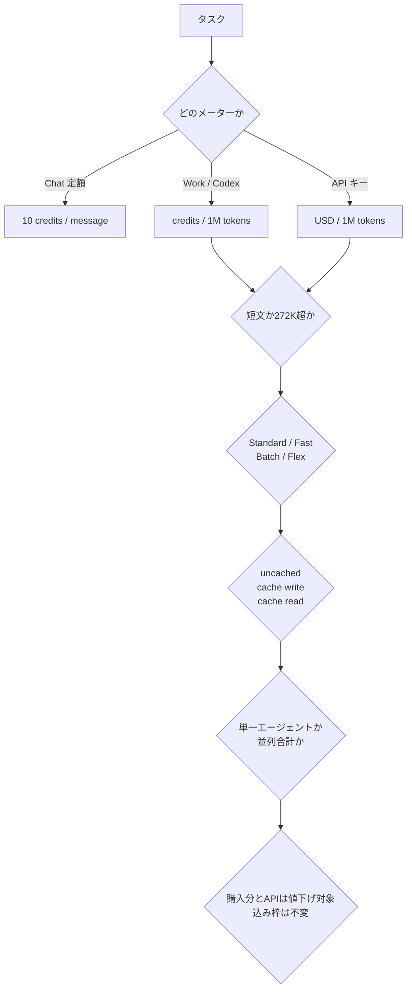

2026年8月21日、OpenAI が GPT-5.6 Sol の API 単価とクレジット単価の引き下げを発表しました。バナーの表現は「over 20%」、期間は「少なくとも 2026年11月21日まで」です。

この記事は、その値下げを自分たちのコスト計画へ落とすときに、どこを分けて考えるべきかを整理します。対象読者は、LLM を使うプロダクトやエージェント基盤の原価を見積もる立場の方です。読み終えると、次の3点を判断できます。

- 「20%引き」が自分のワークロードで実際に何%になるか
- 値下げが**適用されない**メーターはどれか
- 期限後に残る計画単価をいくらに置くべきか

結論を先に書きます。**期間限定の $4/$20 を通常の計画単価にしないでください。** 計画の上限はリスト価格の $5/$30 に置き、値下げ分は時限の差分として別行で持つのが安全です。

*この記事の全体像。以下、順に解説します。*

## 何が下がって、何が下がらないのか

まず、下がる対象と下がらない対象を分けます。同じ「GPT-5.6 Sol」でも、どのメーターで課金されているかによって、今回の値下げが効くかどうかが変わります。

| レイヤー | 中身 | 8月21日の値下げ |
|---|---|---|
| サブスクリプション席料 | Plus $20 / Pro $100〜 / Business $20–$25 per user | 対象外 |
| プラン込みの利用枠 | 5時間枠・週次枠 | 対象外 |
| 購入クレジット | ChatGPT Work / Codex のトークン表 | 対象（ロールアウト中） |
| API 従量課金 | USD / 1M トークン | 対象（即時） |
| Chat のメッセージ課金 | Sol は 1 メッセージ 10 credits | トークン値下げと非連動 |

つまり、**すでにプラン込みの枠だけで運用しているチームには、今回の値下げによる金銭的な変化はありません。** 効くのは、API を従量で叩いている場合と、クレジットを追加購入している場合です。

公式は「込み枠・5時間枠・週次枠・legacy クレジットは unchanged」と明記しています。ここは誤解しやすい箇所なので、社内の期待値調整が必要になります。

## 課金はモデル名ではなく「積」で決まる

単価表を1行だけ見て見積もると、ほぼ確実にずれます。実際の請求額は、次の分岐の積で決まります。

この図の要点は2つです。

1. Chat・Work/Codex・API キーは、それぞれ別の式で原価が決まる
2. Fast・272K 超・並列エージェントの倍率は、値下げの 20% より大きい

倍率の側が大きいので、単価だけを追いかけても意思決定を誤ります。

## 実際の割引率は 20% ではない

モデルページの表現は「入力 20% 減、出力 33% 減」です。バナーの「over 20%」は、この2つを平均に溶かした言い方になっています。**実効の削減率は、自分のワークロードの入出力比で変わります。**

2026年8月24日時点の API 短文 Standard 単価（1M トークンあたり）は次のとおりです。

| モデル | Input | Cached | Cache write | Output |
|---|---:|---:|---:|---:|
| gpt-5.6-sol（値下げ後） | $4.00 | $0.40 | $5.00 | $20.00 |
| gpt-5.6-sol（リスト） | $5.00 | $0.50 | $6.25 | $30.00 |
| gpt-5.6-terra | $2.00 | $0.20 | $2.50 | $12.00 |
| gpt-5.6-luna | $0.20 | $0.02 | $0.25 | $1.20 |

Terra と Luna の単価は、7月30日の改定によるものです。**こちらには販促のラベルが付いておらず、期限の記載もありません。** 期間限定なのは Sol の8月21日分だけ、という点は区別しておく価値があります。

### 短文タスクでの試算

入力合計が 272K トークン未満のケースを試算します。内訳は uncached 200K、cached 50K、出力 40K とします。

| 条件 | 計算 | 結果 | リスト比 |
|---|---|---:|---:|
| リスト $5/$30 | 0.2×5 + 0.05×0.50 + 0.04×30 | $2.225 | 基準 |
| 値下げ後 $4/$20 | 0.2×4 + 0.05×0.40 + 0.04×20 | $1.62 | −27% |
| API Fast（値下げ後の2倍） | 0.2×8 + 0.05×0.80 + 0.04×40 | $3.24 | **+46%** |
| 同じタスクを Luna で | 0.2×0.20 + 0.05×0.02 + 0.04×1.20 | $0.089 | −96% |

この I/O 比では、削減率は約27%になりました。入力しか使わないワークロードなら20%、出力が入力と同量に近づけば31%前後に寄ります。**「20%超」を一律で ROI 計算に掛けるのは避けて、実測の入出力比で掛け直してください。**

最後の行が示すとおり、モデルを Luna へ寄せる効果は、Sol の値下げ幅より1桁大きくなります。誤りのコストが小さい工程では、値下げを待つよりルーティングを見直すほうが効きます。

## Fast と 272K が値下げを打ち消す

上の表で目を引くのは、Fast を付けた行です。**値下げ期間中であっても、API Fast はリスト価格の Standard より高くなります。**

- API Fast は価格が Standard の2倍、速度は最大2.5倍
- Codex Fast はクレジット消費が2.5倍、速度は1.5倍

API と Codex で倍率が揃っていない点にも注意が必要です。同じ「Fast」という名前ですが、2.0倍と2.5倍で書き分ける必要があります。常時 Fast の運用は、値下げ分を丸ごと打ち消します。Fast を使ってよいのは、**遅延の短縮に 2.0倍（API）または 2.5倍（Codex クレジット）を超える金銭的価値があるとき**に限られます。

もうひとつの落とし穴が長文帯です。**入力トークンの合計が 272K を超えると、リクエスト全体が入力2倍・出力1.5倍の帯に移ります。** 超過分だけが高くなるのではありません。1トークンの超過で、そのリクエスト全体の単価が変わります。

入力 1.2M（uncached 1.0M + cached 0.2M）、出力 0.2M のケースで比べます。

| 条件 | 計算 | 結果 |
|---|---|---:|
| リスト相当の長文帯 $10/$45 | 1.0×10 + 0.2×1.00 + 0.2×45 | $20.20 |
| 値下げ後の長文帯 $8/$30 | 1.0×8 + 0.2×0.80 + 0.2×30 | $14.16 |
| API Fast の長文帯 $16/$60 | 1.0×16 + 0.2×1.60 + 0.2×60 | $28.32 |

1M 級の入力を投げる設計では、短文の $4/$20 は最初から使えません。長文コンテキストを前提にしたエージェントを組むなら、**プロンプトを 272K 以下に保つ設計そのものが、値下げより大きなコスト施策**になります。

キャッシュも見落としがちです。GPT-5.6 の cache write は API で1.25倍の課金が発生します（cache read は0.1倍）。cache write を放置したまま値下げを喜ぶと、20%の削減が相殺されかねません。ダッシュボードでは `cached_tokens` と `cache_write_tokens`、そして `service_tier` を見るようにしてください。

## Codex と ChatGPT Work は別の物差し

Codex と ChatGPT Work は、ドルではなくクレジットでトークン課金を共有します。1M トークンあたりの消費は次のとおりです。

| モデル | Input | Cached | Output |
|---|---:|---:|---:|
| GPT-5.6 Sol | 100 | 10 | 500 |
| GPT-5.6 Terra | 50 | 5 | 300 |
| GPT-5.6 Luna | 5 | 0.5 | 30 |
| GPT-5.5 | 125 | 12.50 | 750 |

先ほどの短文タスクをこの表に当てはめると 40.5 credits、Codex Fast なら 101.25 credits になります。

API 側の $4 と Sol の 100 credits は比率が一致しますが、**これは「1 credit = $0.04」と公式が宣言しているという意味ではありません。** あくまで API 表と対照するための換算です。社内の原価表にドル建てで固定すると、クレジットの購入条件が変わったときに追随できなくなります。

Codex 側の仕様差もあります。**Codex では cache write が非課金です。** API と同じキャッシュ設計を前提にすると、見積もりがずれます。

そして最も混ざりやすいのが Chat です。Chat の Sol は「1メッセージ = 10 credits」の定額制で、トークン表とは別制度です。**ここにトークン単価の値下げ率を掛けると、計算が成立しません。** Chat の予算と Work / Codex の予算は、別々に持ってください。

## 第三者経路の割引は「もっと安く、もっと短い」

ゲートウェイ経由の単価は、公式より安く出ていることがあります。ただし条件が異なります。

| 経路 | 掲載単価 | 注意点 |
|---|---|---|
| OpenRouter / Vercel | $2/$10 | 期限がおおむね2026年9月18日。BYOK は対象外 |
| Cloudflare AI Gateway | $2.50/$15 | changelog 上は $5/$30 を基準にした50%引き |
| Amazon Bedrock（Global CRIS） | $4/$20 | 公式の短文値下げに追随済み |
| Amazon Bedrock（In-Region / Geo CRIS） | $4.40/$22 | リージョン指定でプレミアムが乗る |

第三者経路の割引は、公式の販促より**安いかわりに期限が短い**傾向があります。これを恒久的な原価の前提にすると、9月中に見積もりが崩れます。実験枠やスパイク処理に限定して使い、計画単価は公式側に置くのが無難です。

なお、集約サイトの掲載単価とクラウド事業者の公式カードが一致しないケースも確認されています。金額を確定させる場面では、必ず利用する事業者の公式ページを一次情報として確認してください。

## 見積もりの立て方

ここまでを踏まえて、実務での運用手順に落とします。

**1. 原価の正本を3段構成にする**

| 段 | 内容 |
|---|---|
| (a) 基準 | リスト上限の Sol $5/$30 |
| (b) 時限項目 | 2026年11月までの値下げ差分 |
| (c) 加算行 | Fast / 長文帯 / cache write / 並列エージェント / 地域処理 +10% |

(b) を (a) に溶かし込まないことが重要です。溶かすと、期限が来たときにどの数字を戻せばよいか追えなくなります。

**2. ROI 計算に「20%超」を使わない**

入力20%・出力33%を、実測の入出力比で掛け直します。

**3. モデルルーティングを主レバーにする**

- 計画立案・曖昧性の高い判断・誤りコストが高い処理 → Sol
- 実装・分類・テストの横展開 → Luna
- 日常的な処理 → Terra

7月30日の Terra / Luna 改定は販促ではないため、こちらは期限を気にせず前提にできます。

**4. Fast と 272K に閾値を設ける**

Fast は遅延の金銭価値が倍率を超えるときだけ。プロンプトは 272K 以下に収める設計にします。

**5. 期限前に読み直す**

2026年11月21日より前に、API pricing ページと ChatGPT Rate Card を再確認し、(a) と (b) を更新します。

## 期限後に何が残るか

「at least through November 21, 2026」という表現は、終了日を固定していません。延長も終了もあり得ます。

判断材料として、次の点は押さえておく価値があります。

- 公式の価格表は現在 $4/$20 だけを表示し、リスト $5/$30 は7月9日の本文側に残っている状態です。履歴表は用意されていません。表だけを見ると、恒久価格と読める構造になっています。
- 7月30日の Terra / Luna 改定は、販促ラベルが付かないまま定着しました。Sol も同じ道をたどる可能性はあります。
- 一方で、Sol には明示的に promotional と期限が書かれています。この差は意図的と読むのが自然です。

計画単価を $5/$30 に置いておけば、どちらに転んでも予算が壊れません。恒久化が宣言された時点で (a) を下げればよく、その逆より安全です。

なお、8月13日にプレビューが公開された Ultrafast（最大14倍、最大約750 tok/s）には公開単価がまだありません。一般予算に組み込める段階ではないと考えてください。

## まとめ

- 8月21日の値下げは、**API 従量課金と購入クレジットにだけ効きます**。プラン込みの枠・席料・Chat のメッセージ課金は対象外です。
- 「over 20%」は入力20%・出力33%の平均表現です。**実効削減率は入出力比しだいで、出力が多いほど大きくなります**（試算では約27%）。
- Fast（API 2倍 / Codex 2.5倍）と 272K 超の長文帯（入力2倍・出力1.5倍）は、値下げ幅を簡単に打ち消します。**Fast を常用すると、値下げ後でもリスト価格の Standard より高くなります**。
- Codex / Work のクレジット表と Chat のメッセージ定額は別制度です。混ぜて計算しないでください。
- 第三者ゲートウェイの割引は公式より安いものの期限が短く、恒久的な原価の前提には向きません。
- **計画単価はリスト $5/$30 を上限に置き、値下げ分は2026年11月までの時限差分として別に持つ**のが、期限後も壊れない持ち方です。

この記事が少しでも参考になった、あるいは改善点などがあれば、ぜひリアクションやコメント、SNSでのシェアをいただけると励みになります！

## 参考リンク

- [GPT-5.6: Frontier intelligence（2026-07-09、8月21日更新バナーあり）](https://openai.com/index/gpt-5-6/)
- [Advancing the price-performance frontier with GPT-5.6（2026-07-30）](https://openai.com/index/advancing-the-price-performance-frontier-with-gpt-5-6/)
- [OpenAI API Pricing](https://developers.openai.com/api/docs/pricing)
- [GPT-5.6 Sol model](https://developers.openai.com/api/docs/models/gpt-5.6-sol)
- [Fast mode](https://developers.openai.com/api/docs/guides/fast-mode)
- [Prompt caching](https://developers.openai.com/api/docs/guides/prompt-caching)
- [ChatGPT Rate Card (Business / Enterprise / Edu)](https://help.openai.com/en/articles/11481834-chatgpt-rate-card-business-enterpriseedu)
- [Codex / ChatGPT Work pricing](https://learn.chatgpt.com/docs/pricing)
- [Codex Speed](https://learn.chatgpt.com/docs/agent-configuration/speed)
- [Previewing Ultrafast（2026-08-13）](https://openai.com/index/previewing-ultrafast/)
- [OpenAI 公式アナウンス（X、2026-08-21）](https://x.com/OpenAI/status/2090885188897460249)
- [Cloudflare AI Gateway changelog（2026-08-19）](https://developers.cloudflare.com/changelog/post/2026-08-19-gpt-5-6-sol-discount/)
- [Amazon Bedrock, reduced pricing for GPT-5.6 Sol（2026-08-21）](https://aws.amazon.com/about-aws/whats-new/2026/08/bedrock-openai-gpt-56-sol-reduced-pricing/)
- [Amazon Bedrock, GPT-5.6 Sol model card](https://docs.aws.amazon.com/bedrock/latest/userguide/model-card-openai-gpt-56-sol.html)
