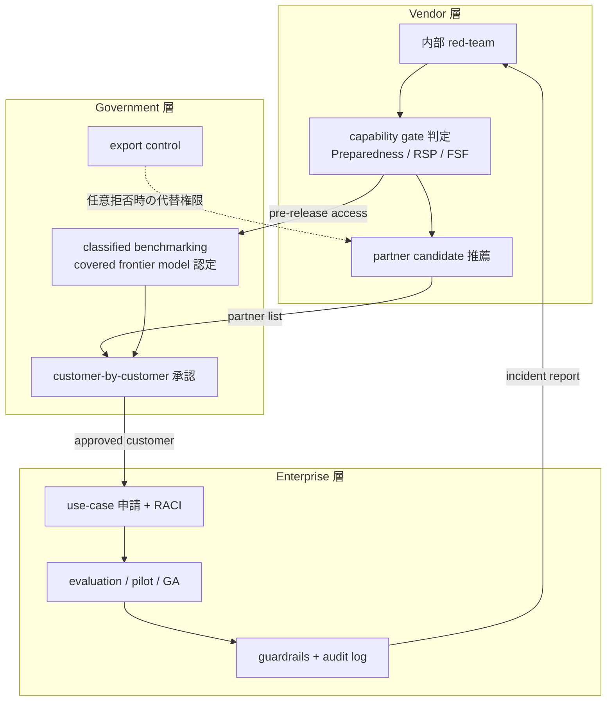
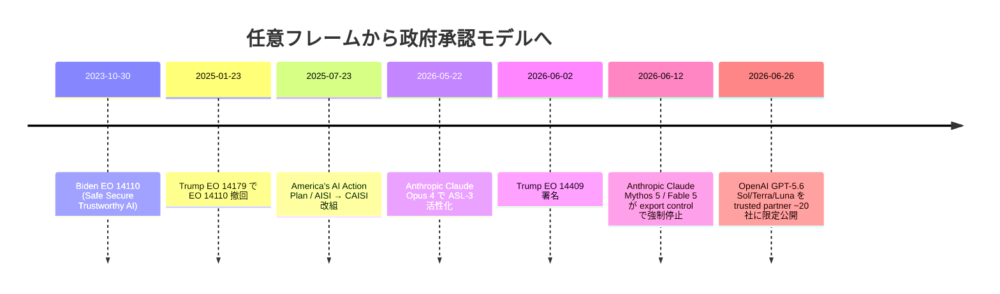

## 概要

2026年6月26日、OpenAI は GPT-5.6 のフラッグシップ Sol、バランス層 Terra、軽量層 Luna の三層モデル群を「~20 organizations の trusted partner にだけ限定公開する」 という形で発表しました。アナウンス文には「at their (= U.S. government's) request」「whose participation has been shared with the government」 と書かれており、配布の対象と順序が**米政府の事前調整**を経て決まっています。

直前の 2026年6月2日には、 Trump 大統領が Executive Order 14409「Promoting Advanced Artificial Intelligence Innovation and Security」 に署名し、frontier AI モデルに対して「公開予定日の最大 30 日前まで政府アクセスを提供する任意 (voluntary) フレームワーク」 を作っています。さらに 2026年6月12日には Anthropic Claude Mythos 5 / Fable 5 が export control 命令で世界停止されました。**任意の EO を carrot、export control を stick**とする政府介入の構造が、 2026年6月のたった 2 週間で同時に立ち上がった構図です。

この記事では、新モデル発表の中身そのものより、**「誰に・どの順番で・どの条件で配るか」 という配布統制が、 AI 運用設計の主戦場になった**事実を、 企業の運用設計の型としてどう落とすかを整理します。 OpenAI 自身が「We don't believe this kind of government access process should become the long-term default」 と blog で明言している点まで含めて、 制度が一時的なのか恒久的なのかを判断する材料を提示します。 想定読者は AI 導入を進める情シス・PdM・調達・法務・経営、 および配布の受け皿となる実装エンジニアです。

## 特徴

GPT-5.6 のリリース運用が、 AI 業界の従来の staged release と決定的に違う点を 5 つに分けて整理します。

### 特徴1: 政府が customer-by-customer に partner 選定へ直接関与

OpenAI のアナウンスは「a limited preview for a small group of trusted partners whose participation has been shared with the government」 と書きます。 報道は、 ONCD (National Cyber Director) と OSTP が OpenAI と直接調整し、「customer-by-customer」 承認を行っていると伝えます。 これは過去の Anthropic Project Glasswing (vendor 主導で約 50 → 150 organizations に絞った独自運用) や、 Google DeepMind Frontier Safety Framework (vendor 主導の capability-gated deployment) と本質的に違います。**partner 選定の権限が vendor から government に移った最初の運用ケース**です。

### 特徴2: EO 14409 が「義務化しない」 と明示しているのに実質的な参加圧が強い

EO 14409 は Sec. 3(c) で「Nothing in this section shall be construed to authorize the creation of a mandatory governmental licensing, preclearance, or permitting requirement」 と義務化を否定しています。 一方で同じ 2026年6月に Anthropic Mythos 5 / Fable 5 が export control で強制停止されました。**任意 EO を拒否したときに別の権限 (export control / 連邦調達制限) で代替手段がある**ことが市場参加者に伝わっており、 構造的には「ソフトな強制」 として機能します。

### 特徴3: 評価ベンチマークは機密で、 閾値も非公開

「covered frontier model」 の認定は、 NSA Director が NCD・APST・CISA Director・DoD 代表と協議のうえ判断します。 ベンチマーク内容は「advanced cyber capabilities」 を測る classified プロセスで、 Latham & Watkins は「precise capability threshold may never be publicly disclosed」 と整理しています。「合格・不合格の境界が分からないまま vendor が事前提出する」 設計のため、 企業側からも「どのモデルが将来 covered になるか」 を予測しづらい構造です。

### 特徴4: 価格帯別の三層モデル構成は配布統制を前提に設計

価格は 1M トークンあたりの概数で、 取得日 2026-06-27 時点の数値です。

| ティア | 用途 | Input | Output |
|---|---|---|---|
| Sol | フラッグシップ。 長期 horizon agent、 延長コーディング、 セキュリティ研究 | 約 $5 | 約 $30 |
| Terra | バランス層。 「GPT-5.5 と同等性能を半額」 を公式に標榜 | 約 $2.50 | 約 $15 |
| Luna | 軽量・コスト最適化層。 Claude Haiku 4.5 と同価格帯 | 約 $1 | 約 $6 |

Sol は GPT-5.5 と同価格を据え置きつつ Ultra モード (内部 subagent 並列実行) を追加しています。 Terra は GPT-5.5 とほぼ同等性能を半額で提供する位置付け、 Luna は Claude Haiku 4.5 ($1/$5) と並ぶ最廉価帯です。 limited preview の段階で「すべての partner が三層すべてにアクセスできるか」 は公式に明示されていませんが、 配布順序を「Sol だけ trusted partner → Terra/Luna は GA」 のように層別管理できる構造になっています。

### 特徴5: API/Codex を先に解放し、 ChatGPT は further down the line

公式は「API と Codex に trusted partners 経由でアクセス開始」「the coming weeks に generally available」 と書く一方で、 Android Authority は「More general availability, including in ChatGPT and Codex, is set to arrive further down the line」 と公式表現を引用しています。 開発者向け surface (API + Codex) を先に解放し、 エンドユーザー向け ChatGPT は後送りという展開順序自体が、 配布リスクを下流に押し出す**段階的解放フロー**になっています。

## 概念構造

trusted partner + 政府承認の運用設計は、 vendor / government / enterprise の三層関係として整理できます。 過去の vendor-only governance との違いは、 government 層がモデル選定と partner 選定の両方に介入する点にあります。

### 三層関係



各層の役割を要素単位で表に整理します。

| 要素 | 説明 |
|---|---|
| V1 内部 red-team | vendor 自社内での事前評価 |
| V2 capability gate 判定 | RSP / Preparedness / FSF などの枠組みに沿った能力判定 |
| V3 partner candidate 推薦 | vendor が政府に候補リストを共有 |
| G1 classified benchmarking | NSA 主導の機密プロセスで「covered frontier model」 を認定 |
| G2 customer-by-customer 承認 | ONCD / OSTP が partner を個別承認 |
| G3 export control | 任意 EO を拒否した場合に作動しうる別権限 |
| E1 use-case 申請 + RACI | 企業側の利用申請とロール定義 |
| E2 evaluation / pilot / GA | 自社内での評価 → パイロット → 一般展開 |
| E3 guardrails + audit log | Content Safety と監査ログでの統制 |

### 時系列で見る制度シフト



### 過去 staged release と GPT-5.6 の比較

| 事例 | 公開時期 | 限定対象 | gate の主体 | 結末 |
|---|---|---|---|---|
| GPT-4 | 2023-03 → 2023-07 GA | Khan Academy / Stripe / Duolingo / Be My Eyes / Iceland Government / Morgan Stanley 等 6 partner + API waitlist | vendor 主導 (Preparedness Framework v1 beta) | 一般 API 公開 (約 4 か月後) |
| o1-preview | 2024-09-12 | ChatGPT Plus / Team 同日、 API 高位 tier 限定 | vendor 主導 (Preparedness Medium CBRN) | API 段階的解放 |
| Claude Opus 4 + ASL-3 | 2025-05-22 | 一般公開、 ASL-3 (Constitutional Classifiers / bug bounty / 100+ security controls) | vendor 主導 (RSP v2.2) | ASL-3 標準で稼働 |
| Anthropic Project Glasswing | 2026-04-07 → 2026-06-12 | ~50 → ~150 organizations | vendor 主導 (selective access) | 政府 export control で強制停止 |
| GPT-5.6 (本件) | 2026-06-26 限定 → coming weeks GA | ~20 organizations (政府共有) | government 主導 (EO 14409 + customer-by-customer) | 未確定 (OpenAI 自身が「long-term default にしない」 と表明) |

### 企業が再現する mini staged release の RACI

ベンダー側の段階的解放フローを企業内で再現する場合、 AWS Bedrock / Azure OpenAI / NIST AI RMF / ISO/IEC 42001 を組み合わせて以下の RACI が組めます。 規格やドキュメントごとに役割を明示する形で、 「使う」 「作る」 「監査する」 を分離します。

| ステージ | アクター | 一次根拠 |
|---|---|---|
| Request | App owner / Product team | AWS Bedrock の Anthropic use case form |
| Evaluate | AI/ML Platform | Bedrock model evaluation / Azure AI Foundry evaluate |
| Review (Sec) | Information Security | Azure OpenAI Limited Access 登録 |
| Review (Legal) | Legal / Compliance | AWS Bedrock EULA review / MS Responsible AI Standard |
| Review (Risk) | Risk / Audit | ISO/IEC 42001 Annex A.5.2 Impact Assessment |
| Approve | Engineering Lead + Sec/Legal | Azure OpenAI RBAC `User`/`Contributor` 分離、 Bedrock SCP |

Approve ステージで「使う」 と「作る」 を分離する実装例として、 Azure では Entra ID のロール割当を次のように書きます。

```json
{
  "principalId": "<user-or-group-object-id>",
  "roleDefinitionId": "/subscriptions/<sub>/providers/Microsoft.Authorization/roleDefinitions/<role-id>",
  "scope": "/subscriptions/<sub>/resourceGroups/<rg>/providers/Microsoft.CognitiveServices/accounts/<openai-acct>"
}
```

「Cognitive Services OpenAI User」 ロール ID を割り当てれば inference API 呼び出しのみが許可され、 deployment 作成は拒否されます。 AWS Bedrock 側では、 同様の分離を SCP で表現します。

```json
{
  "Version": "2012-10-17",
  "Statement": [
    {
      "Sid": "DenyBedrockInvokeUnlessApproved",
      "Effect": "Deny",
      "Action": "bedrock:InvokeModel",
      "Resource": "arn:aws:bedrock:*:*:foundation-model/*",
      "Condition": {
        "StringNotEquals": {"aws:PrincipalTag/AiModelApproved": "true"}
      }
    }
  ]
}
```

事前に Engineering Lead と Sec/Legal が「ApprovedTag」 を付与しない限り、 任意のモデル呼び出しを deny する形にすることで、 staged release のゲートを IAM 層で物理的に再現できます。
| Pilot | App owner | Bedrock Guardrails / Azure AI Content Safety |
| Monitor | Platform + Sec | OpenAI Compliance Platform、 DLP、 SIEM 接続 |
| GA / Sunset | Governance committee | Azure AI Content Safety の 90 日 deprecation サイクル |

## 反証と未解決の問い

ここまで「trusted partner + 政府承認の運用設計を企業も型として参照する価値がある」 というスタンスで描いてきましたが、 これを弱める材料も多くあります。 反証専用の追加調査で集めた 16 件のうち、 判断に効く 5 点を残します。

- **EO 14409 は政権交代で 1 日で消える可能性が高い**: 前任 Biden EO 14110 は Trump 47 が就任日 (2025-01-20) に即時撤回しました。 2028 政権交代、 あるいは 2027 中間選挙後の policy shift で前提が崩れます。「EO 14409 が continued になる」 前提で社内プロセスを設計するのは耐久性に問題があります。
- **customer-by-customer 政府承認は scalability が原理的に欠落**: trusted partner 約 20 社の運用は成立しても、 Bedrock / Azure / Vertex の数千エンタープライズ規模では「政府の承認待ち」 がボトルネック化します。 企業ガバナンスの参考にするとしても、 そのまま倍率を上げてマップできるモデルではありません。
- **staged release は jailbreak でリリース直後に剥がされる**: Claude Opus 4.6 はリリース後 30 分で bypass された事例が報告されています。 ASL-3 を起動した Anthropic の staged release ですら、 配布直後に技術的に剥がされます。「合格 → 公開」 の安全境界は、 公開後の最新 jailbreak で陳腐化する構造リスクを抱えます。
- **cloud RBAC で再現可能というのは過信**: AWS Bedrock の SCP enforcement に明示的な bypass 脆弱性 (2025-12-04 〜 2026-01-26、 long-term API keys 経由) があり、 Bedrock Guardrails は AWS 自身が「non-deterministic」 と明示しています。 さらに OpenAI Compliance Platform の audit log retention は 30 日で、 SOC2 (1 年) / HIPAA (6 年) の要件を満たしません。 企業内で再現する staged release は、 これらの ceiling を理解したうえで層を補強する必要があります。
- **Project Glasswing は成功事例ではなく fail 事例として読める**: Anthropic は 50 → 150 partner と拡大した時点で staged release の境界がぼやけ、 最終的に政府の export control で強制終了されました。「trusted partner で安全に解放した」 という success story ではなく「半解放 → 政府停止」 のフェイル事例として読む方が学びが多いです。

一方で反証が**見つからなかった領域** (= 結論の頑健性が残る部分) は次のとおりです。

- 「staged release プロセスを**やめろ**」 と主張する声は反証側でも見つかりません。 批判は「現在の運用が脆弱・偏りを生む」 までで、 配布統制プロセス自体を不要と論じる議論は文献ベースで未発見です。
- 「企業内に evaluation → pilot → GA の段階を持つ」 アイデア自体は、 NIST AI RMF GOVERN や ISO/IEC 42001 Annex A.5 などの規格側でも肯定されており、 反証側で否定する根拠は弱いままです。
- 「価格帯別の三層構成」 は OpenAI 固有ではなく、 Claude Opus/Sonnet/Haiku、 Gemini Pro/Flash も同等の階層を持つため、 構造自体は業界横断で安定しています。

未解決の問いは以下のとおりです。

- EO 14409 の Federal Register での正式公示日と公示番号 (whitehouse.gov 一次は取得済、 Federal Register での照合は未実施)
- OpenAI 公式の「~20 organizations」 の verbatim 引用 (Cloudflare 403 で公式 HTML を取得できず、 報道経由のみ確認)
- 政府承認の opt-out 経路 / 申請主体 (API customer が直接申請するのか、 OpenAI が代理申請するのか不明)
- Microsoft Responsible AI Standard v2 PDF の verbatim wording (本セッションでは未取得)
- Anthropic 対 U.S. Department of War の amicus brief 提出 (ITI / TechNet / CCIA / SIIA) の判決見通し

## 企業の運用設計に落とすときの推奨

ここまでの整理を踏まえて、 自社の AI モデル切替手順を「性能比較だけ」 から「段階的解放フロー」 へ転換するときの推奨を 4 段で書きます。

1. **モデル切替の前に 4 つのレビュー gate を必ず通す**: Information Security / Legal / Risk (ISO 42001 A.5.2) / Engineering Lead の 4 者承認を「使う」 の前提に置きます。 Azure OpenAI RBAC の `User` / `Contributor` 分離、 AWS Bedrock の SCP / EULA review プロセスをそのまま社内に複製する形で実装できます。
2. **partner / pilot は 90 日サイクルで明示的に limited にする**: Azure AI Content Safety の preview / GA lifecycle が 90 日 deprecation サイクルで動いている点に合わせ、 社内の pilot user group も 90 日単位で明示的に rotation します。「いつまでに pilot を畳むか」 を初日に決めることで、 限定公開のまま放置する事故を防ぎます。
3. **政府介入を「制度ではなく risk」 として扱う**: EO 14409 が 2028 政権交代で消える可能性、 export control が事前予告なく発動する可能性を、 サプライチェーン risk register に明記します。 vendor lock-in 解消の準備として、 GPT-5.6 Sol → Claude Opus 4.8、 Terra → Sonnet 4.6、 Luna → Haiku 4.5 / Gemini 2.5 Flash の代替ティアマップを初日から保持します。 日本企業の場合は、 経済安全保障推進法の特定重要技術指定、 個人情報保護法の越境移転規律、 AI 事業者ガイドライン (経産省・総務省) の影響評価項目を、 同じ risk register に並べて管理すると、 米国 EO に偏らない多軸での判断ができます。
4. **audit log の retention を SOC2 / HIPAA に揃える**: OpenAI Compliance Platform の 30 日 retention を「足りる」 とせず、 自社 SIEM へ常時 export して 1 年以上保持します。 政府承認の配布フローでは「事後検証」 が制度の正当性を支えるため、 audit gap は staged release 全体の信頼性を毀損します。

## 次のアクション

読者が記事のあと自社で取れる小さな次の一歩を 3 つ提示します。

- 既存の「モデル切替手順書」 を取り出し、 性能ベンチマーク以外の項目 (security review / legal review / pilot user group / audit retention) が何項目並んでいるかを数えます。 4 項目未満なら、 上記推奨に沿って追補します。
- Azure OpenAI を使っているなら、 RBAC の `User` / `Contributor` 分離が誰に付与されているかを今日棚卸します。 全員が `Contributor` になっていれば staged release の前提が崩れています。
- 自社で使うモデルの代替ティアマップ (Sol → Opus、 Terra → Sonnet、 Luna → Haiku / Flash) を 1 枚作ります。 EO 撤回 / export control 発動 / vendor 凍結のいずれにも備える冗長性になります。

## まとめ

GPT-5.6 の trusted partner 限定公開と EO 14409 が組み合わさったことで、 AI モデルの配布は「性能比較で選ぶ」 段階から「誰に・どの順番で・どの条件で配るかを設計する」 段階に移っています。 制度自体は政権交代や jailbreak でいつでも崩れる前提を置きつつ、 4 つのレビュー gate と 90 日サイクルの pilot、 代替ティアマップ、 1 年以上の audit log を社内に積み上げることで、 ベンダーや政府の意思決定に左右されにくい運用設計に近づけます。

この記事が少しでも参考になった、 あるいは改善点などがあれば、 ぜひリアクションやコメント、 SNSでのシェアをいただけると励みになります!

## 参考リンク

- 公式ドキュメント
  - [Previewing GPT-5.6 Sol: a next-generation model | OpenAI](https://openai.com/index/previewing-gpt-5-6-sol/)
  - [A preview of GPT-5.6 Sol, Terra, and Luna | OpenAI Help Center](https://help.openai.com/en/articles/20001325-a-preview-of-gpt-56-sol-terra-and-luna)
  - [GPT-5.6 preview Deployment Safety Hub | OpenAI](https://deploymentsafety.openai.com/gpt-5-6-preview)
  - [METR pre-deployment evaluation of GPT-5.6 Sol](https://metr.org/blog/2026-06-26-gpt-5-6-sol/)
  - [Executive Order 14409: Promoting Advanced Artificial Intelligence Innovation and Security | White House](https://www.whitehouse.gov/presidential-actions/2026/06/promoting-advanced-artificial-intelligence-innovation-and-security/)
  - [Winning the Race: America's AI Action Plan | White House](https://www.whitehouse.gov/wp-content/uploads/2025/07/Americas-AI-Action-Plan.pdf)
  - [Responsible Scaling Policy updates | Anthropic](https://www.anthropic.com/rsp-updates)
  - [Activating ASL-3 protections | Anthropic](https://www.anthropic.com/news/activating-asl3-protections)
  - [Introducing the Frontier Safety Framework | Google DeepMind](https://deepmind.google/discover/blog/introducing-the-frontier-safety-framework/)
  - [Strengthening our Frontier Safety Framework | Google DeepMind](https://deepmind.google/blog/strengthening-our-frontier-safety-framework/)
  - [Gemini image generation got it wrong. We'll do better. | Google](https://blog.google/products-and-platforms/products/gemini/gemini-image-generation-issue/)
  - [Azure OpenAI Limited Access | Microsoft Learn](https://learn.microsoft.com/en-us/azure/ai-services/openai/concepts/limited-access)
  - [Role-based access control for Azure OpenAI | Microsoft Learn](https://learn.microsoft.com/en-us/azure/foundry-classic/openai/how-to/role-based-access-control)
  - [Pre-deployment evaluation in Azure AI Foundry | Microsoft Learn](https://learn.microsoft.com/en-us/azure/foundry/how-to/evaluate-generative-ai-app)
  - [Azure AI Content Safety overview | Microsoft Learn](https://learn.microsoft.com/en-us/azure/ai-services/content-safety/overview)
  - [Model access in Amazon Bedrock | AWS](https://docs.aws.amazon.com/bedrock/latest/userguide/model-access.html)
  - [Model evaluation in Amazon Bedrock | AWS](https://docs.aws.amazon.com/bedrock/latest/userguide/model-evaluation.html)
  - [Guardrails for Amazon Bedrock | AWS](https://docs.aws.amazon.com/bedrock/latest/userguide/guardrails.html)
  - [NIST AI Risk Management Framework Playbook GOVERN](https://airc.nist.gov/airmf-resources/playbook/govern/)
  - [The new Bing and Edge — Increasing Limits on Chat Sessions | Microsoft Bing Blog](https://blogs.bing.com/search/february-2023/The-new-Bing-and-Edge-Increasing-Limits-on-Chat-Sessions)
  - [Federal Government and Anthropic CRS IF13217 | Congress.gov](https://www.congress.gov/crs-product/IF13217)
- 記事
  - [New AI Executive Order Calls for Frontier Model Security | Skadden](https://www.skadden.com/insights/publications/2026/06/new-ai-executive-order)
  - [President Trump Signs Executive Order Establishing AI Cybersecurity and Frontier Model Framework | Latham & Watkins](https://www.lw.com/en/insights/president-trump-signs-executive-order-establishing-ai-cybersecurity-and-frontier-model-framework)
  - [New AI Executive Order Addresses Frontier Models and Cybersecurity Vulnerabilities | Wiley](https://www.wiley.law/alert-New-AI-Executive-Order-Addresses-Frontier-Models-and-Cybersecurity-Vulnerabilities)
  - [Assessing Trump's Executive Order on AI Oversight | Council on Foreign Relations](https://www.cfr.org/articles/assessing-trumps-executive-order-on-ai-oversight)
  - [OpenAI limits new AI models to 'trusted partners' at request of U.S. government | CNBC](https://www.cnbc.com/2026/06/26/openai-limits-new-ai-models-to-trusted-partners-request-us-government.html)
  - [OpenAI releases powerful new GPT-5.6 model under restrictions | Axios](https://www.axios.com/2026/06/26/openai-gpt-sol-terra-luna-trump)
  - [OpenAI unveils GPT-5.6 Sol, Terra and Luna models | VentureBeat](https://venturebeat.com/technology/openai-unveils-gpt-5-6-sol-terra-and-luna-models-but-only-accessible-to-limited-preview-partners-for-now-per-us-gov)
  - [OpenAI staggers GPT-5.6 release | The Hill](https://thehill.com/policy/technology/5942770-openai-staggers-gpt-56/)
  - [GPT-5.6 Rollout Delayed: US Government Reportedly Seeks to Approve Customers One by One | IBTimes UK](https://www.ibtimes.co.uk/openai-delays-gpt-5-6-release-us-government-concerns-1805271)
  - [OpenAI's GPT-5.6 rollout now requires US government approval on a customer by customer basis | The Decoder](https://the-decoder.com/openais-gpt-5-6-rollout-now-requires-us-government-approval-on-a-customer-by-customer-basis/)
  - [Anthropic's safety warnings may have just backfired | TechCrunch](https://techcrunch.com/2026/06/12/anthropics-safety-warnings-may-have-just-backfired-the-government-has-pulled-the-plug-on-its-most-powerful-ai/)
  - [A warning from Amazon led the White House to shut down Anthropic's Mythos model | Fortune](https://fortune.com/2026/06/14/how-a-warning-from-amazon-led-the-white-house-to-shut-down-anthropics-mythos-model/)
  - [Anthropic's Mythos Recall and the White House's Missing AI Safety Playbook | TechPolicy.Press](https://www.techpolicy.press/anthropics-mythos-recall-and-the-white-houses-missing-ai-safety-playbook/)
  - [OpenAI Launches GPT-5.6 Sol, Terra, and Luna in Limited Preview | MacRumors](https://www.macrumors.com/2026/06/26/openai-gpt-5-6-sol/)
  - [OpenAI upgrading ChatGPT and Codex with new GPT-5.6 models in limited release | 9to5Mac](https://9to5mac.com/2026/06/26/openai-upgrading-chatgpt-and-codex-with-new-gpt-5-6-models-in-limited-release/)
  - [OpenAI Previews GPT-5.6 With Sol, Terra, and Luna | MarkTechPost](https://www.marktechpost.com/2026/06/26/openai-previews-gpt-5-6-with-sol-terra-and-luna-tiered-models-new-reasoning-modes-limited-access/)
  - [ACLU Statement on President Trump's Unilateral Attack on State Regulation of Artificial Intelligence | ACLU](https://www.aclu.org/press-releases/aclu-statement-on-president-trumps-unilateral-attack-on-state-regulation-of-artificial-intelligence)
  - [Tech associations send White House letter on preserving US AI leadership | CCIA](https://ccianet.org/news/2026/03/tech-associations-ccia-send-white-house-letter-on-preserving-us-ai-leadership-in-response-to-anthropic-dispute/)
  - [Cracks in the Bedrock: Bypassing SCP Enforcement with Long-Lived API Keys | Sonrai Security](https://sonraisecurity.com/blog/cracks-in-the-bedrock/)
  - [Leading AI Model Claude Opus 4.6 Bypassed in 30 Minutes | National Law Review](https://natlawreview.com/press-releases/leading-ai-model-claude-opus-46-bypassed-30-minutes-exposing-critical)
