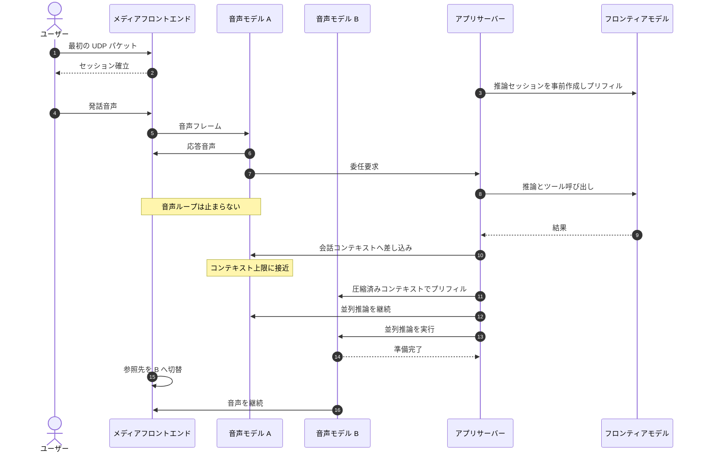
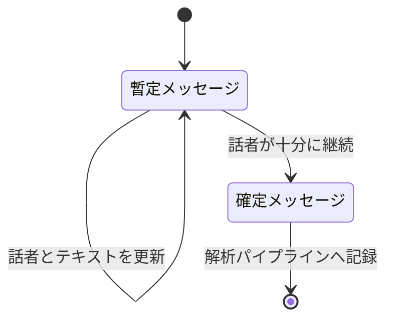

OpenAI が第 3 世代の音声システム GPT-Live の実装について、エンジニアリングブログ「How we built a realtime system for responsive voice AI in six months」を公開しました。要点は、音声の流れを止めないことを唯一の絶対条件に置き、それ以外のすべて（深い推論、ツール実行、会話の永続化、UI 用のターン分割）を非同期の別経路へ追い出した、という一点に集約されます。

この記事では、公開されたエンジニアリングブログを一次情報として、GPT-Live のリアルタイム基盤がどう分割されているかを整理します。あわせて、同じ設計原則を自分のリアルタイム AI システムへ落とすときの実装パターンと、公開情報からは確認できない範囲を明示します。

対象読者は、音声・映像を含むリアルタイム AI システムを設計する立場のエンジニアです。モデルの性能そのものではなく、モデルを常時稼働させ続けるためのシステム構造に焦点を当てます。


*この記事の全体像。以下、順に解説します。*

## ターン検出器という設計上のジレンマ

従来の音声 AI は、ターン検出器（turn detector）と呼ばれる小さなモデルに会話の切れ目を判断させていました。OpenAI はこの構造の問題を、次のジレンマとして説明しています。

- 早く判定しすぎると、ユーザーの発話を途中で遮る
- 遅く判定すると、応答が鈍重に感じられる
- そして、検出器が判定を下すまで、本体の大きな LLM は仕事を始められない

さらに、カスケード構成（音声認識 → LLM → 音声合成の直列実行）では、各段の遅延が積み上がるうえに、声のトーンやペースといった情報が文字起こしの段階で失われます。Speech-to-Speech モデルは音声を直接扱うことでこの情報損失を解消しましたが、推論の開始タイミングをターン検出器に委ねている限り、対話そのものはターンベースのままでした。

GPT-Live は、ターン検出器を音声経路から取り除きます。音声モデル自体がフルデュプレックス、つまり聞きながら同時に話せる構造になっており、話す・聞き続ける・止まる・割り込む・ツールを呼ぶ、といった判断を毎秒何度も自分で下します。

| 観点 | ターンベース構成 | GPT-Live |
| --- | --- | --- |
| 会話制御 | ターン検出器が切れ目を判定 | 音声モデル自身が連続的に判断 |
| 推論の起点 | 検出器の判定後にバッチ実行 | 音声フレームを常時ストリーミング |
| 深い推論 | 同じ経路上で同期実行 | 非同期 RPC 境界の向こう側へ委任 |
| 会話の永続化 | ターン単位で確定 | 投機的ビューと確定記録の 2 系統 |
| 遅延の露出 | ツール遅延がそのまま無音になる | 音声ループは止まらない |

## GPT-Live の設計原則

エンジニアリングブログ全体を貫く原則は「the voice must flow（音声は流れ続けなければならない）」の一文です。ここから、次の 3 つの分離が導かれます。

1. **メディア経路とアプリケーションロジックの分離**。音声はクライアントと音声モデルのあいだの専用 fast path を流れる。委任・ツール実行・その他のアプリ処理は非同期 RPC 境界の向こう側で動く。遅いツール呼び出しは自分の結果を遅らせるだけで、メディアの流れを止められない。
2. **推論インスタンスのライフサイクルと会話の分離**。長時間セッション中のインスタンス入れ替えやコンテキスト圧縮を、二重稼働と切替（managed transition）としてバックグラウンドで完了させる。
3. **連続音声と離散ターンの分離**。モデル内部は連続ストリームで動くが、UI・解析・安全性まわりのシステムはターンを必要とする。この変換をアプリケーションサーバーが受け持つ。

この分離は副次的な効果ももたらしています。アプリケーション側はツール・ポリシー・バックエンドの振る舞いを変更しても、音声を流し続けるメディアフロントエンドには影響しません。ChatGPT デスクトップアプリの PC 操作やエージェント調整といった新機能が、音声の応答性を損なわずに追加できているのはこの境界のおかげです。

## 構造: fast path と slow path

公開情報から再構成した全体構造です。OpenAI が内部のコンポーネント名を公開しているわけではないため、以下は「どの処理がどちら側にあるか」を示す概念図として読んでください。

```mermaid
graph TD
    Client["クライアント<br/>ChatGPT アプリ"]

    subgraph FastPath ["fast path : 止められない経路"]
        GW["メディアフロントエンド<br/>Go 実装"]
        Voice["フルデュプレックス<br/>音声モデル"]
    end

    subgraph SlowPath ["slow path : 非同期 RPC 境界の向こう"]
        App["アプリケーションサーバー"]
        Frontier["フロンティアモデル<br/>GPT-5.5 など"]
        Tools["ツール実行<br/>デスクトップ操作"]
    end

    Log["解析・安全性パイプライン"]

    Client <-->|"WebRTC メディア"| GW
    GW <-->|"音声ストリーム"| Voice
    Voice -->|"委任要求"| App
    App -->|"深い推論"| Frontier
    App -->|"呼び出し"| Tools
    Frontier -->|"結果"| App
    Tools -->|"結果"| App
    App -->|"会話コンテキストへ差し込み"| Voice
    GW -->|"部分文字起こしと<br/>タイミング信号"| App
    App -->|"投機的ビュー"| Client
    App -->|"確定記録"| Log
```



### メディアフロントエンドを Go で書き直した

公開情報のなかで、実装言語の選択が効いたことを示す唯一の定量的な記述がここです。

> We wrote the media frontend and inference logic in Go, replacing a previous Python `asyncio` implementation. This significantly improved the smoothness of frame delivery, with the new system's p95 matching the previous system's p50.

メディアフロントエンドと推論ロジックを、それまでの Python `asyncio` 実装から Go へ書き換えた結果、**新システムの p95 が旧システムの p50 に並んだ**という報告です。中央値ではなく裾野の分布が改善した、という形の表現になっている点が重要です。リアルタイム音声では、平均遅延が良くても稀にフレームが遅れれば、それは「音が途切れた」「ノイズが乗った」という体験としてそのまま露出します。評価すべきはテール遅延だ、という主張がこの数字に込められています。

なお、ここで示されているのは相対比較のみで、p95 や p50 の絶対値、および fast path の具体的な数値 SLO は公開されていません。

### トランスポートは WebRTC

トランスポート層の土台は WebRTC です。低遅延メディア向けに設計されており、パケットロス・クロックドリフト・クライアントの接続変更を跨いで動作を継続できます。パケットが遅れて届いた場合、WebRTC は音声をわずかに引き伸ばして無音を防ぎ、その後に再生を少し加速して実時間へ追いつく、という挙動を取ります。

この「引き伸ばして追いつく」機構があるからこそ、上位層はネットワークのゆらぎを毎回自前で吸収せずに済みます。リアルタイム音声を自作する場合、ここを独自プロトコルで再発明するのは割に合いません。

## 連続推論を止めないための状態管理

ステートフルな推論には、ステートフルであることに由来する運用上のトレードオフがあります。音声セッションは長時間アクティブであり続ける一方、コンテキストは増え続け、モデルインスタンスは需要に応じて起動・停止します。

GPT-Live はこれを、モデルインスタンス間のシームレスなハンドオフ機構で解いています。

1. 移行が必要になったら、既存インスタンスの横に置き換え用インスタンスを暖機する
2. 現在のセッションコンテキストをプリフィルする
3. 新旧の両方で並列に推論を走らせる
4. 新インスタンスが完全に準備できた時点で切り替える

そして同じ機構が、動的なコンテキスト圧縮（dynamic context compaction）にも使い回されています。会話が長引いて累積コンテキストがモデルの上限を超えそうになったとき、圧縮そのものには時間がかかります。さらに、過去のコンテキストを書き換える以上、アテンションの KV キャッシュが無効化され、再プリフィルによる追加遅延が発生します。

そこで、圧縮を「もう一つの managed transition」として扱います。元のインスタンスが会話を続けている裏で、システムはコンテキストを圧縮し、新しいコンテキストで置き換え用インスタンスを準備します。準備が終われば、メディアを中断せずに切り替えられます。重い処理は常に live path の外に置く、という原則の徹底です。



## 委任を「速く感じさせる」ための前倒し

委任を非同期にしただけでは足りません。音声モデルは「いま調べています」といった発話で少しのあいだ会話をつなげますが、任意に遅い応答を隠しきることはできません。そこで OpenAI は、ルーティング・プロンプト処理・推論・ツール呼び出しを含む**委任ループ全体を応答性の予算に含めて**扱っています。

具体的な最適化として挙げられているのが、委任が要求される前にフロンティアモデルと必要なツールをセットアップしておく、という前倒しです。

- 音声セッション開始時に、アプリケーションサーバーがフロンティアモデルの推論セッションを作成する
- 初期の会話コンテキストでプリフィルし、最初の委任要求が来る前にプロンプト処理を完了させておく
- その推論セッションを音声会話の継続中ずっと保持し、後続リクエストには安定したセッションアフィニティを使う
- プロンプトキャッシュと組み合わせることで、レイテンシを改善しつつワーカー障害からの復旧も容易に保つ

加えて、推論の effort、出力上限、ツールスキーマ、モデルとツールの往復回数といったレバーも「いつ会話に有用な結果が返るか」に影響するため、それぞれ調整対象になっています。

設計上の含意は明確です。**エージェント的な処理を音声に載せるなら、音声セッション開始と同時にバックエンド側の暖機を始め、最初の委任要求が届くまでにプロンプト処理を終わらせておく**。委任が発生してから接続確立・プロンプト処理を始めると、それは会話の間として露出します。

## 連続音声から離散ターンを取り出す

音声モデルは連続ストリームで動作しますが、ChatGPT の会話 UI、解析基盤、安全性インフラの一部は依然としてユーザー／アシスタントのターンを前提としています。この変換はアプリケーションサーバーが担当します。

処理の流れは次のとおりです。音声が到着すると、サーバーは部分文字起こしとタイミング信号から「いまどちらが発言権を持っているか」を推定し、メッセージのキューを構築します。最新のメッセージは暫定（provisional）扱いで、テキスト・タイミング・話者の割り当ては、後続の音声が届くにつれてすべて変わり得ます。話者が十分に長く発言権を保持し、帰属が信頼できると判断できた時点で、対応するメッセージを確定します。



難しいのは話者の重なりです。ユーザーが話している最中のアシスタントの短い相づち（"mm hmm" や "okay"）は、必ずしも独立したメッセージにすべきではありません。一方、実質的な内容を伴う割り込みは、多くの場合メッセージにすべきです。

どのセグメンテーション方針も、鮮度と確実性のトレードオフを抱えます。早く確定しすぎれば履歴が断片化して順序が不安定になり、待ちすぎれば文字起こしとそれに依存する機能が遅れます。そこで会話を 2 つのビューで保持します。

| ビュー | 用途 | 性質 |
| --- | --- | --- |
| 投機的ビュー | アプリの会話 UI | 更新される前提。話者・テキスト・境界が後から変わる |
| 確定記録 | 解析パイプラインへのロギング | 最終文字起こしのみ。安定した順序を保証 |

UI は更新を扱えるので投機的ビューを使い、解析パイプラインは最終文字起こしを要求するので確定記録を使う。この 2 系統分離により、ライブの音声経路にターンテイキングを押し付けずに、周辺システムへ安定した会話ビューを提供できています。

## 起動遅延を削る WARP と Instant Connect

応答性はユーザーがボタンを押した瞬間から始まります。GPT-Live では、会話が始まる前にメディア経路を確立し、音声をモデルへ流し込み始める必要があるため、起動シーケンスのすべてがクリティカルパスに乗ります。

WebRTC はリアルタイムの土台としては強力ですが、vanilla の WebRTC セッションを開始するには、驚くほど多くのプロトコルハンドシェイクとネットワーク往復が必要になります。WebRTC は QUIC のような「往復回数を最小化する」設計思想が主流になる前のプロトコルであり、構成要素を組み合わせて使うと作業が重複します。ブログが挙げている具体例は、WebRTC スタック全体の文脈では不要な場面でも、各プロトコルがそれぞれ独自の DoS 対策機構を持っている、という重複です。

これに対する OpenAI の答えが 2 つあります。

**WARP** は、WebRTC コミュニティの協力者とともに設計されたオープン仕様のセットです。IETF の TSVWG ワーキンググループを通じて提案が進められており、WARP のサポートは libwebrtc と Pion の両方にすでに追加され、他の WebRTC 実装でも作業が進行中とされています。

略称の展開と削減幅は、OpenAI のブログ側には書かれていません。根拠は IETF の Internet-Draft `draft-uberti-tsvwg-warp` にあり、WARP を WebRTC Abridged Roundtrip Protocol と展開したうえで、最適化を組み合わせて使った場合に**セットアップ遅延を 6 RTT から 2 RTT へ削減できる**と述べています。ただしこの文書は現時点で individual Internet-Draft、つまりワーキンググループに採択される前の個人提出段階です。数値を設計根拠に引くなら、この位置付けごと引用するのが安全です。

**Instant Connect** は、メディアハンドシェイクを最適化した後に残った最後の遅延、すなわち WebRTC が接続する前に SDP パラメータを共有するシグナリング交換を、クリティカルパスから外すための仕組みです。特徴は次の 3 点です。

- サーバーの容量を予約せずに、事前にパラメータをネゴシエートする
- 既存の WebRTC 実装への変更を必要としない
- 標準のシグナリングフローと並走する。事前ネゴシエート済みパラメータが有効ならサーバーは最初のメディアパケット到着時にセッションを実体化し、古い／無効なら通常のシグナリングがすでに進行中なので、追加のレイテンシなしでフォールバックできる

この 2 つを合わせた結果として、**クライアントは単一の UDP パケットでセッションを開始できる**ようになった、と述べられています。

なお、エンジニアリングブログ本体の説明は「a surprising number of round trips」を「collapsing the transport handshake」で削った、という定性的なものにとどまります。RTT 数を伴う記述を見かけたら、それは OpenAI のブログではなく IETF Draft 側の数字です。両者は測定範囲が異なる可能性があるため、混ぜて引用しないでください。

## 自分のシステムに落とすときの実装パターン

ここから先は OpenAI の実装ではなく、上記の設計原則を自作システムへ適用する場合のパターンです。GPT-Live API は「upcoming」と告知されている段階であり、本記事執筆時点（2026 年 8 月 4 日）で GPT-Live 向けの公開クライアント SDK は存在しません。以下のコードは動作するライブラリ呼び出しではなく、境界の引き方を示すスケッチとして読んでください。

### fast path はブロックしない

メディア経路の原則は「フレームを運ぶ側で一切ブロックしない」ことです。ロック取得、同期 I/O、GC を誘発する大きなアロケーションを避け、受け取ったフレームは即座に次段へ受け渡します。

ここで対象にするのは、**WebRTC を終端した後の復号済み音声フレーム**を推論側へ引き渡すループです。生の UDP ソケットには STUN・DTLS・RTP・RTCP が混在しており、その判別と終端は WebRTC 実装（Pion や libwebrtc）の仕事です。自分で書くべきなのは、その先の「音声フレームをモデルへ届ける」区間になります。

```go
// 復号済み音声フレームを推論側へ引き渡すループ。
// WebRTC の終端は Pion 等に任せ、ここでは音声フレームだけを扱う。
func (g *Gateway) PumpAudio(ctx context.Context, track *webrtc.TrackRemote) error {
	// track.Read はブロックするので、ctx のキャンセルは read deadline で解除する。
	stop := context.AfterFunc(ctx, func() {
		_ = track.SetReadDeadline(time.Now())
	})
	defer stop()

	for {
		// バッファは frame ごとに確保し、受信先をそのまま所有させる。
		// 使い回すと未処理フレームを次の受信で上書きしてしまう。
		frame := g.pool.Acquire() // frame.Buf は cap 1500 の []byte
		n, _, err := track.Read(frame.Buf)
		if err != nil {
			g.pool.Release(frame)
			if ctx.Err() != nil || errors.Is(err, io.EOF) {
				return ctx.Err() // 正常終了・トラック終了
			}
			return err // 恒久的な失敗で busy loop に陥らせない
		}
		frame.Payload = frame.Buf[:n]
		frame.Deadline = g.clock.Now().Add(g.playoutBudget) // 明示的な処理期限

		select {
		case g.inbound <- frame: // ノンブロッキング投入
		default:
			g.pool.Release(frame) // 期限内に捌けない分は落とす。詰まらせない
			g.metrics.DroppedFrames.Inc()
		}
	}
}
```

ポイントは 3 つです。第 1 に、バッファをループ外で使い回さず frame ごとに持たせること。共有バッファのスライスを非同期の consumer へ渡すと、次の受信で中身が書き換わります。第 2 に、`Read` はブロックするため `ctx.Done()` の確認だけでは終了できないこと。`context.AfterFunc` で read deadline を切って読み取りを解除します。第 3 に、破棄は「キューが満杯だから」ではなく**明示的な処理期限**に基づかせること。

3 点目は補足が要ります。遅れて届いたパケットが常に無価値なわけではありません。前述のとおり WebRTC 自体が、遅延したパケットを音声の伸縮で吸収する仕組みを持っています。破棄すべきなのは、ジッタバッファの吸収可能範囲を超え、再生期限を過ぎてしまったフレームです。この判定を「チャネルが埋まったかどうか」で代用すると、まだ間に合うフレームまで捨てることになります。

### slow path は結果を「差し込む」

委任側は、要求を受け取ったら即座に制御を返し、結果は後からアクティブなセッションのコンテキストへ差し込みます。呼び出し側が結果を待たないことが、非同期 RPC 境界の本質です。

```python
import asyncio
import logging
from typing import Any

logger = logging.getLogger(__name__)


class DelegationBridge:
    """音声ループをブロックせずに重い処理を実行するブリッジ。"""

    def __init__(self, voice_client, frontier_client):
        self._voice = voice_client
        self._frontier = frontier_client
        self._tasks: set[asyncio.Task] = set()

    async def prewarm(self, session_id: str, initial_context: list[dict]) -> None:
        """音声セッション開始時に推論セッションを作りプリフィルしておく。"""
        await self._frontier.create_session(session_id, prefill=initial_context)

    def delegate(self, session_id: str, request: dict[str, Any]) -> dict[str, str]:
        """要求を受け付けて即座に返す。結果は後から差し込む。"""
        task = asyncio.create_task(self._run(session_id, request))
        self._tasks.add(task)
        task.add_done_callback(self._tasks.discard)
        return {"status": "delegated"}

    async def _run(self, session_id: str, request: dict[str, Any]) -> None:
        try:
            result = await self._frontier.invoke(session_id, request)
            event_type = "delegation_result"
        except asyncio.CancelledError:
            raise
        except Exception:
            logger.exception("delegation failed: session=%s", session_id)
            result = {"error": "unavailable"}
            event_type = "delegation_error"
        await self._voice.inject_context_event(
            session_id=session_id,
            event_type=event_type,
            data=result,
        )
```

`asyncio.create_task` の戻り値を集合に保持しているのは、参照が残らないとタスクが途中でガベージコレクトされ得るためです。加えて、失敗時にも必ず何らかのイベントを差し込む点が重要になります。差し込まれなければ、音声モデルは「調べています」と言ったまま結果を待ち続けてしまいます。

### コンテキスト移行を「切替」として設計する

圧縮や再配置を、その場での破壊的な更新ではなく「新インスタンスを準備してから切り替える」操作として設計します。実装上のチェックポイントは 3 つです。

| 段階 | やること | 失敗時の扱い |
| --- | --- | --- |
| 暖機 | 置き換え先を起動し、圧縮済みコンテキストでプリフィル | 旧インスタンスを維持したまま再試行 |
| 並走 | 新旧で並列に推論し、準備完了を確認 | 切替を見送る |
| 切替 | メディアの参照先を差し替え、旧を破棄 | 旧へロールバックできる状態を保つ |

いずれの段階でも旧インスタンスを先に壊さないことが条件です。「先に壊してから作る」設計にした瞬間、KV キャッシュの再構築時間がそのまま無音として露出します。

## 本番シャドウテストと容量設計の転換

紙の上では速いシステムが、実際の音声トラフィックの下で止まることがあります。OpenAI は GPT-Live をユーザーへ出す前に、本番の ChatGPT Voice セッションのうち少量かつ段階的に増やした割合を、既存の Advanced Voice Mode と新システムの両方へルーティングするサイレントテストを実施しました。Advanced Voice Mode が通常どおりユーザーへ応答し続ける裏で、シャドウ経路は読み取り専用モードで推論を走らせます。ユーザーに聞こえる音を変えずに、実際のクライアント・ネットワーク・セッション長・地理分布へシステムを晒す構成です。

ここで得られた教訓が、いくつも具体的に書かれています。

**容量は GPU スループットに還元できない。** 音声セッションは開きっぱなしでフレームを送り続けるため、CPU 側のストリームハンドラー、キュー、ネットワーク経路が推論と並んでスケールしなければなりません。実負荷では、負荷テストの見積もりより早く周辺コンポーネントが飽和し、推論リクエストが滞留してレイテンシが増幅しました。そこで容量の問い自体を書き換えています。

> We changed the capacity question from "How many requests can a GPU handle?" to "How many concurrent sessions can the system sustain while keeping every frame on schedule?"

**地理が一次的な関心事になる。** 遠いキャパシティへセッションをルーティングすると、起動時とストリーミング時の複数箇所で遅延が加算されます。モデルのロールアウトを、リージョンごとの容量とトラフィックステアリング設定と一体で検証し、レイテンシを送信元の地理で分解する運用へ移行しています。

**現実的なセッションライフサイクルでしか出ない障害がある。** 長時間セッションはメモリと永続化の負荷を露出させ、再接続は圧縮と状態復元を、通常のクライアント切断はシャットダウンハンドシェイクの競合状態を露出させました。これらは時間・蓄積した状態・サービス境界をまたぐ振る舞いに依存するため、短時間の負荷テストではほぼ現れません。

**観測とロールアウト制御の不備も同時に見つかった。** 異なる遅延要因を混同していたメトリクス、集計値が個々の不健全なエンジンを隠していたダッシュボード、テスト環境と本番環境の設定ドリフト。これらへの対応として、より粒度の細かいテレメトリ、既知の正常設定に対する検証、段階的なランプ、個別経路を素早く隔離・無効化する機能が追加されました。サイレントテストは容量の検証だけでなく、「障害をどれだけ速く検知し、封じ込め、復旧できるか」のリハーサルになった、と総括されています。

## 公開情報で確認できないこと

周辺記事でよく見かける記述を一次情報と照合した結果を整理します。出典がどれかによって扱いが変わるものがあるため、設計根拠に引く場合は注意してください。

| よくある記述 | 照合結果 |
| --- | --- |
| WARP は WebRTC Abridged Roundtrip Protocol の略 | 正しい。ただし出典は IETF Draft。OpenAI ブログには展開なし |
| WARP はセットアップ遅延を 6 RTT から 2 RTT へ短縮 | IETF Draft に記載あり。未採択の individual Internet-Draft である点に注意。OpenAI ブログ側に RTT 数の記載はない |
| fast path の応答目標は 300〜500ms | 数値 SLO の記載なし。「sub-second」とのみ |
| Go 化により p95 が N ミリ秒へ改善 | 絶対値の記載なし。「新の p95 が旧の p50 に並ぶ」という相対比較のみ |
| 内部コンポーネントの正式名称 | ブログはコンポーネント名を公開していない。本記事の図解は再構成 |
| ハンドオフ時に新旧の出力を突き合わせて一致を判定する | 記載なし。公開されているのは「両方で並列推論し、準備完了で切替」まで |

また、GPT-Live API は「upcoming」として告知されている段階であり、本記事執筆時点で GPT-Live 向けの公開クライアント API は利用できません。現時点で外部から触れる OpenAI のリアルタイム音声インターフェースは Realtime API であり、GPT-Live のアーキテクチャがそのまま API として露出しているわけではない点に注意が必要です。

## まとめ

GPT-Live のリアルタイム基盤は、モデルを速くしたのではなく、**モデルを止めないためにシステムを分割した**事例として読めます。要点を整理します。

- ターン検出器を音声経路から取り除き、フルデュプレックスの音声モデル自身に会話制御を委ねた
- 音声の fast path と、委任・ツール実行・永続化の slow path を非同期 RPC 境界で分けた。遅いツールは自分の結果を遅らせるだけで、メディアを止められない
- インスタンス切替とコンテキスト圧縮を、破壊的更新ではなく「暖機・並走・切替」の managed transition として設計し、KV キャッシュ再構築を無音として露出させない
- 委任を速く感じさせるために、フロンティアモデルの推論セッションを音声セッション開始時に前倒しで作成・プリフィルし、セッションアフィニティとプロンプトキャッシュで維持する
- 連続音声を、更新される投機的ビューと安定した確定記録の 2 系統に分けて周辺システムへ渡す
- メディアフロントエンドと推論ロジックを Python `asyncio` から Go へ書き換え、フレーム配送の p95 が旧実装の p50 に並んだ
- 容量の問いを「GPU が何リクエスト捌けるか」から「全フレームを定時に届けながら何セッション同時に維持できるか」へ書き換えた

自分のリアルタイム AI システムに転用できる原則としては、最後の 2 つが最も汎用性が高いと考えています。テール遅延で評価すること、そして容量を同時セッション数で定義すること。この 2 つは音声に限らず、常時接続のストリーミング推論すべてに当てはまります。

この記事が少しでも参考になった、あるいは改善点などがあれば、ぜひリアクションやコメント、SNSでのシェアをいただけると励みになります！

## 参考リンク

- [How we built a realtime system for responsive voice AI in six months - OpenAI](https://openai.com/index/continuous-voice-interaction-with-gpt-live/)
- [Introducing GPT-Live - OpenAI](https://openai.com/index/introducing-gpt-live/)
- [How OpenAI delivers low-latency voice AI at scale - OpenAI](https://openai.com/index/delivering-low-latency-voice-ai-at-scale/)
- [draft-uberti-tsvwg-warp - WebRTC Abridged Roundtrip Protocol](https://datatracker.ietf.org/doc/draft-uberti-tsvwg-warp/)
- [IETF TSVWG - Transport and Services Working Group](https://datatracker.ietf.org/wg/tsvwg/about/)
- [Pion WebRTC - Go 実装](https://github.com/pion/webrtc)
- [libwebrtc - WebRTC Native Code Package](https://webrtc.googlesource.com/src/)
- [OpenAI Realtime API ドキュメント](https://platform.openai.com/docs/guides/realtime)
