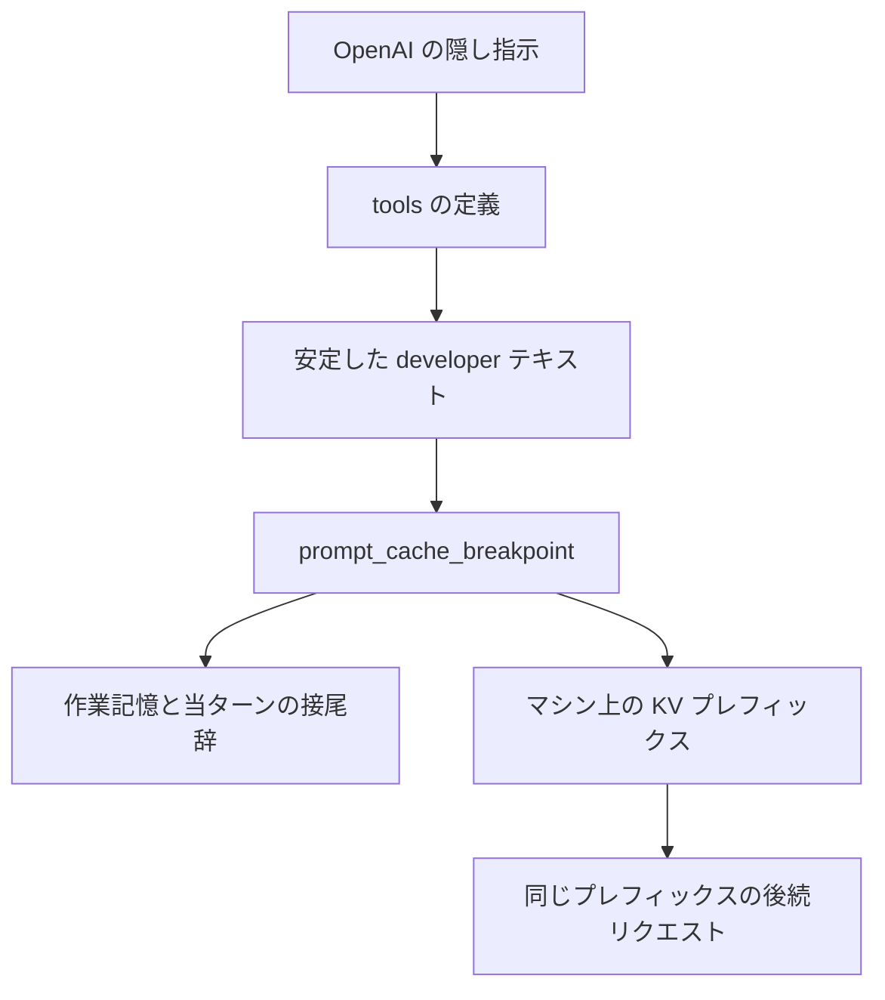
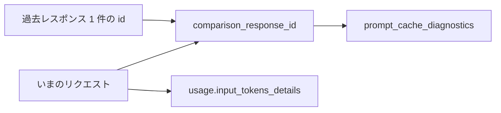

OpenAI は 2026-09-22 に、GPT-6 向けの prompt caching を公開しました。API は、プロンプト先頭の一致部分について、モデルが一度計算した中間状態を後続リクエストで再利用します。開発者は、その再利用単位の終わりを明示ブレークポイントで指定できます。診断は、いまのリクエストを過去のレスポンス 1 件と比べ、再利用できなかった理由を返します。

この記事では、システム指示・スキル本文・ツール定義を自分で持つ実装が、再利用単位の置き場所、mode の選び方、診断の読み方を決めるための材料をまとめます。単価は 2026-09-23 時点のモデルページ、操作の形は同日の [Prompt caching](https://developers.openai.com/api/docs/guides/prompt-caching) に合わせています。


*この記事の全体像。以下、順に解説します。*

## GPT-6 の prompt caching とは

prompt caching は、レンダリング後のプレフィックスが一致したとき、その範囲の key-value（KV）中間状態を再利用する仕組みです。一致の対象は、OpenAI 側の隠し指示、developer message、ツール定義、会話履歴、テキスト、画像、文書、対応する音声を含んだ、レンダリング後の先頭部分です。

再利用できるのは、どこかのブレークポイントで終わる一致プレフィックスです。ブレークポイントより後ろは、そのリクエストの新しい入力として処理されます。`explicit` の cache write は、最後に選んだブレークポイントまでです。

想定する読み手は、システム指示・スキル本文・ツール定義を自分で所有するエージェント実装です。ダッシュボードは、アプリケーション全体のヒット率を時間方向に示します。診断は、その集計とは別に、リクエスト 1 件の比較を返します。

### 制御の入口

制御の入口は `prompt_cache_options` です。`mode` は `implicit`（既定）または `explicit` です。`ttl` の対応値は `30m` のみです。Responses API では `prewarm` と `comparison_response_id` も取れます。

明示ブレークポイントは、content block の `prompt_cache_breakpoint: { "mode": "explicit" }` です。境界はトークンブロックへ丸めません。TTL はリクエストの `ttl` を継承します。1 リクエストが書ける write は最大 4 つです。`implicit` はその 1 枠を使い、明示は最新 3 つまで書きます。`explicit` は最新 4 つの明示だけを書きます。

最小キャッシュ長は、GPT-5.6 以降では可視入力 1,024 トークンです。隠しシステムトークンはこの数に入りません。

明示ブレークポイント、キャッシュ書き込み課金、最短 30 分の寿命、診断は、公式ガイド上は GPT-5.6 以降の仕組みです。GPT-6 固有としてガイドが分けているのは、リクエストレベルの `reasoning.effort` を変えずに effort を切り替える `configuration_update` です。

### 読み取りと書き込みの単価

読み取りは未キャッシュ入力の 0.1 倍です。書き込みは 1.25 倍で、そのトークンに適用する単価です。再利用は、追加の write 課金なしで寿命を更新します。

2026-09-23 のモデルページ（標準、入力 272K トークン以下、100 万トークンあたり）は次のとおりです。272K を超える入力は、リクエスト全体の input と cache が 2 倍、output が 1.5 倍になります。

| モデル | 入力 | キャッシュ読み | キャッシュ書き | 出力 |
|---|---:|---:|---:|---:|
| `gpt-6-astra` | $10 | $1 | $12.50 | $50 |
| `gpt-6-sol` | $2 | $0.20 | $2.50 | $10 |
| `gpt-6-luna` | $0.10 | $0.01 | $0.125 | $0.50 |

上の単価の出典は各モデルページです。

### 1 回のリクエストの並び

1 回のリクエストは、先頭から順にレンダリングされます。安定した developer テキストの終端にブレークポイントを置くと、その位置までの KV が後続リクエストの照合対象になります。



### 診断が比べるもの

診断は、キャッシュの動作を変えない比較です。比較対象はレスポンス ID 1 件です。課金上の再利用量は `usage.input_tokens_details` にあります。



診断の結果は、当レスポンスの `prompt_cache_diagnostics` に載ります。`type` は `cache_hit`、`cache_miss`、`comparison_response_not_found`、`unavailable` のいずれかです。`cache_miss` は `reason` と `cache_missed_tokens` を持ち、`comparison_reusable_tokens` を持つことがあります。

事前温めは `prompt_cache_options.prewarm: true` です。出力は生成せず、書いたトークンは cache-write 単価になります。reference では `prewarm: true` が `generate` を `false` に上書きします。

GPT-5.6 以降の `prompt_cache_key` は、顧客やユーザーごとのキャッシュ会計を分けるキーです。

### 既定で置かれる照合境界

`implicit` が自動で置く境界は、最新の対象メッセージの終端です。対象は、user message、連続する tool response 群の最後、先頭に連続する developer message 群の最後、です。

Chat Completions の reference は、content part に `prompt_cache_breakpoint` を持ち、`prompt_cache_options` の列挙は `{ mode, ttl }` です。`comparison_response_id` と `prewarm` は、Responses の `prompt_cache_options` に列挙されています。診断ガイドの対象文は Responses API です。

GPT-6 Astra の function calling は、reasoning ガイドが Chat Completions では非対応と書いています。`gpt-6-sol` と `gpt-6-luna` のモデルページは、Chat Completions エンドポイントを Supported とし、function calling は `reasoning_effort` が `none` のときだけと書いています。

Agents API のモデル呼び出しは、Responses と同じキャッシュ挙動です。

## 注意点

発表とガイドは、割引・ヒット率・顧客事例を並べます。信じてよい範囲は、それぞれの分母までです。プロンプトキャッシュの待ち時間やヒット率について、数値の SLA は caching ガイドにありません。

### 割引と事例の分母

| 主張 | 出典が実際に測っているもの | 読み方 |
|---|---|---|
| キャッシュ入力は最大 90% 割引 | 未キャッシュ入力単価に対する読み取り単価 0.1 倍 | リクエスト全体、出力、cache write の 90% 引きではない |
| 30 分窓 | `ttl=30m` は最短寿命。バックエンドはより長く残しうる。Your data は、暗号化 KV を 24 時間の満了後は保持しないと書く | 30 分で必ず消える、という意味ではない。長く残る範囲は、その 24 時間の記述までである |
| ダッシュボードと診断でヒット率が数ポイント上がり、コストが 20% 減った | ブログに載った Strawberry Browser の自己申告 | 監査資料は公開されていない |
| 約 85% から 90% 超 | Manus の自己申告。1 週間未満 | 同上 |
| 83% から 91%。cache write が約 3 分の 2 減。推論コスト 36% 減 | Wordsmith の evaluations 上の自己申告。1 週間未満 | 本番の全トラフィックとは書いていない |
| フレッシュ処理が必要なプロンプトトークンの割合を 50% 超削減 | GitHub Copilot の「過去数ヶ月」、数十億リクエスト、以前のベースライン比 | 2026-09-22 の明示ブレークポイントだけの効果とは書いていない |
| 単ターン判定でトークンキャッシュヒット率約 70%。マルチターンエージェントで 90% 超 | ガイドが「可能な結果の例」と書いた illustrative な数字 | 上限の保証ではない |

顧客引用の出典は [Better prompt caching for GPT-6](https://openai.com/index/better-prompt-caching-for-gpt-6) です。ガイド自身の費用式は、顧客引用より範囲が狭いです。write 1 回と全量 read 1 回で 1.35 倍です。未キャッシュで 2 回処理すると 2 倍です。10 リクエストなら、write 1 回と read 9 回で 2.15 倍です。未キャッシュなら 10 倍です。

### 公開資料のあいだで分かれる記述

同じ取得日の価格表では、`gpt-6-` に一致した標準行が `gpt-6-astra` のみで、次行は `gpt-5.6-sol` でした。`gpt-6-sol` と `gpt-6-luna` の単価は各モデルページに載っています。単価を引用するときはモデルページを優先します。

照合窓の本数は、ガイドと API reference で記載が分かれます。ガイドは「先頭 2 と最新 50 の明示」に加え、`implicit` では過去の対象メッセージ終端を最大 20 と書きます。Responses の create reference は「最新 80 ブレークポイント、content-block の lookback 制限は無い」と書きます。どちらが実行時の上限かは、公開資料だけでは確定していません。長い会話の途中境界を何本まで見るかは、依存する前に実行時のヒットで確認する必要があります。

deprecated の `prompt_cache_retention` は最長ポリシー、`ttl` は最短寿命で、reference は両者を独立と書きます。ガイドは GPT-5.6 以降で retention を `ttl` に置き換えると書きます。GPT-6 で両方を同時に送ったときの実挙動は、ガイドの手順例にはありません。

隣接する `configuration_update` の HTTP status と `error.code` は、reasoning ガイドにありません。

公開説明で確認できるダッシュボード（`platform.openai.com` の prompt-caching 区画）の項目は、ヒット率の時系列と、キャッシュ済みトークンと未キャッシュトークンの内訳です。原因コードが画面にあるかは未確認です。ログイン後の画面は操作していません。原因の切り分けに使うとガイドが書いているのは、リクエスト比較です。

GPT-6 の 272K 超に、別の RPM/TPM 表があるかは、取得した rate-limits ガイドとモデルページの本文では確認できませんでした。rate-limits ガイドが長コンテキスト別枠の例に出すのは GPT-5.5 です。

### 診断の見積と課金の差

診断はリクエスト単位です。セッション単位の診断オブジェクトは、diagnostics ガイドにはありません。Agents API でセッションを維持しても、ヒットそのものは別の条件です。同じ文字列でも、エントリが別マシンにあれば再利用されません。

返る `reason` は、最初に分類された 1 つです。best effort であり、すべてのミスを分類するわけではありません。`unavailable` はヒットでもミスでもなく、比較の準備ができていないときにも返ります。

診断用の記録は「短期間」で失効します。分数は非公開です。レスポンスオブジェクトが API から取れていても、`comparison_response_not_found` になりえます。

`comparison_reusable_tokens` と `cache_missed_tokens` は見積です。課金に使うのは `usage.input_tokens_details.cached_tokens` と `cache_write_tokens` です。両者は違いえます。

`cache_hit` は、比較に対するミスが無かったという意味です。新しい接尾辞は処理されます。ガイドの例では、2,500 入力トークンのうち 2,000 を再利用し、500 を新規処理しても `cache_hit` になりえます。

診断自体の追加料金は無く、診断枠のレート制限もありません。比較のために増やしたリクエストは、通常どおり課金され、通常の制限に入ります。

Zero Data Retention と両立します。保存するのは設定メタデータ、トークン数の見積、比較用ハッシュです。生プロンプトとモデル出力は、この機能のためには保存しません。比較 ID を渡しても、過去レスポンスの本文は返りません。

ストリーミングでは `response.completed` の `event.response` から読みます。

ヒット率の定義は、ガイドが「cached tokens の合計 / input tokens の合計」と書いている値です。集計単位の例は、ユーザー、ワークスペース、日です。この率は、モデルの正答率でも、エージェントの完了率でもありません。

## 安定プレフィックスの終端を 1 本固定する

システム指示、スキル本文、ツール定義を所有する実装は、その安定部分の終端を明示ブレークポイントで固定します。作業記憶は終端の後ろへ追記します。

ガイドは、共有プレフィックスがあっても、安定部分の終端にブレークポイントが無いと、動く接尾辞まで書いたエントリには短い共有部分が当たらない、と図解しています。`tools_changed` と `input_changed` は、ツール定義の変更と、過去入力の改変を、別々の reason として返します。

所有境界は 1 本に決めます。安定部分を先頭に置き、可視トークンが 1,024 以上であることを確認してから、その終端に明示ブレークポイントを置きます。トップレベルの `instructions` には明示ブレークポイントを置けません。残したい指示は、developer message の `input_text` に置きます。`additional_tools` の入力アイテムは、現状 `prompt_cache_breakpoint` を受けません。

次の形は、2026-09-23 の caching ガイドにある explicit の例です。ガイドの掲載モデル名は `gpt-5.6` 系です。フィールドは GPT-5.6 以降と同じなので、ここでは GPT-6 のモデル名に置き換えています。

```json
{
  "model": "gpt-6-sol",
  "reasoning": { "effort": "low", "context": "all_turns" },
  "text": { "verbosity": "medium" },
  "prompt_cache_options": { "mode": "explicit" },
  "input": [
    {
      "role": "developer",
      "content": [
        {
          "type": "input_text",
          "text": "Stable instructions and shared reference material...",
          "prompt_cache_breakpoint": { "mode": "explicit" }
        }
      ]
    },
    {
      "role": "developer",
      "content": "Dynamic developer instructions, such as user-specific content and timestamps..."
    },
    {
      "role": "user",
      "content": "The user's current question..."
    }
  ]
}
```

1,024 に届かないときは、安定した参照を足した場合と、キャッシュしない場合を、公開されている倍率で比べます。前提は、最小長 1,024、read 0.1、write 1.25、write 1 回のあとに read を N-1 回、です。短いプレフィックス L を 1,024 まで伸ばす損益分岐は `102.4 + 1177.6/N` トークンです。10 リクエストなら、元のプレフィックスが 221 トークン以上のとき、1,024 まで伸ばす方が安いです。102 トークン以下は、この仮定では伸ばしても安くなりません。

再利用が 1 回も無いプレフィックスは、未キャッシュより write の 1.25 倍だけ高くなります。`prewarm` も write 単価です。短い指示を水増しすると、損益分岐より短いときは費用が増えます。

キャッシュ済み入力も tokens-per-minute に入ります。割引は枠を増やしません。手動のキャッシュ削除は、現行では提供されません。

## 接尾辞を cache write するかを mode で選ぶ

接尾辞を再利用しない単発リクエストは `mode: "explicit"` にします。write を接尾辞にかけないためです。`explicit` でブレークポイントを 1 つも置かないリクエストは、prompt caching を使わず、cache write も作りません。HTTP エラーにはしません。

会話が伸び、後続ターンやフォークが同じ履歴を再利用するなら `implicit` を残し、ツール結果などフォーク地点に明示ブレークポイントを足します。`implicit` から `explicit` へ途中で切り替えるときは、残したい終端に明示ブレークポイントを重ねます。`explicit` に切り替えると、照合は自分の明示ブレークポイントだけを見ます。前ターンが `implicit` で書いた終端は、同じ位置に明示ブレークポイントが無いと当たりません。

作業記憶を後ろへ追記すること自体は、無効化条件ではありません。無効になるのは、すでにキャッシュした終端より前を書き換えることと、終端の位置を構造から消すことです。

- 同一の user message を `Content A` から `Content A + Content B` へ伸ばすと、古い終端はメッセージの内部になります。明示ブレークポイントが無いと、`implicit` 同士でもその終端は再利用されません。新しいメッセージを足します。
- 先頭の連続 developer message より後ろに足した developer message は、`implicit` の自動照合境界になりません。残したい終端には明示ブレークポイントを置きます。
- 過去メッセージは編集しません。compaction、要約、過去の切り捨ては、最初に変わったトークン以降の再利用を落とします。
- ツール定義の本文と順序は変えません。当ターンで呼ばせないツールは、定義を消さずに `allowed_tools` か `tool_choice: "none"` で止めます。
- `parallel_tool_calls` の変更は、複数ツール呼び出しに関する指示を変ええます。診断 reason の表には独立行がありません。設定表の方に載っています。

事前温めは、ユーザーが待つ前にプレフィックスが決まっているときに限って使います。write 単価を払います。30 分は最短の保証です。それを過ぎると再利用は保証されません。エントリが残っていればヒットしえます。残っていなければ、温めの write は回収できません。

ガイドの prewarm 例は次の形です。モデル名だけ `gpt-6-sol` に置き換えています。

```json
{
  "model": "gpt-6-sol",
  "input": [
    {
      "role": "developer",
      "content": "Your app's shared instructions and reference material..."
    }
  ],
  "prompt_cache_options": {
    "prewarm": true
  }
}
```

## ミスの理由を 1 件のレスポンスと比べる

手順は 3 つです。同じ組織の完了済みレスポンスを 1 件選びます。`prompt_cache_options.comparison_response_id` にその `id` を渡します。当レスポンスの `prompt_cache_diagnostics` を読みます。このフィールドは会話をロードせず、キャッシュの挙動も変えません。当リクエストは、比較対象以外のエントリにも当たりえます。

直したあとは、同じ基準レスポンスで再比較します。診断は追加料金なしで、最初の不一致理由を返します。原因調査を利用統計だけに依存しなくてよい、というのがこのフィールドの位置づけです。

再利用の条件は、一致するプレフィックスが、期限内のエントリとして、リクエストが届いたマシンにあることです。エントリは組織を越えず、regional processing の境界も越えません。15 リクエスト/分を超えるトラフィックは、別マシンへ溢れることがあります。溢れたリクエストは、別マシンに同じエントリが無いと再利用できません。

診断ガイドが分類する `reason` は次のとおりです。意図した変更なら、ヒット率を落としても残してよい、とガイドは書いています。

| reason | 何が変わったか | 再利用を残す公式の対処 |
|---|---|---|
| `tools_changed` | ツールの追加、削除、並べ替え、説明、スキーマ、設定 | 定義と順序を固定する。止めるなら `tool_choice: "none"`。絞るなら `allowed_tools` |
| `input_changed` | 指示内の時刻やリクエスト ID。過去メッセージの編集、並べ替え、削除 | 変わる文はブレークポイントの後ろへ置く。過去ターンは残し、新しいターンを追記する |
| `reasoning_effort_changed` | リクエストレベルの reasoning effort | GPT-6 では `configuration_update` を足し、リクエストレベルの値は固定する |
| `text_format_changed` | 出力形式やスキーマ | 構造が同じなら `text.format` を固定する |
| `verbosity_changed` | `text.verbosity` | 共有したいリクエスト間で固定する |
| `model_changed` | ルーティング、A/B、フォールバックを含むモデル差 | 共有したい列は同じモデルにする |
| `service_tier_changed` | 処理に使われた service tier。要求値と戻り値は違いうる | 戻り値の `service_tier` も含めて揃える |
| `prompt_cache_key_changed` | 供給したキーが変わった。物理ミスが無くても usage 上のミスになりうる | 会計分離が不要ならキーを付けない。付けるなら群の中で固定する |
| `context_compacted` | compaction が過去の会話を置き換えた | 安定指示は残す。トークン減とヒット率低下の両方を費用で比べる |

GPT-6 で effort を変えるときは、`configuration_update` を 1 つ足し、リクエストの `reasoning.effort` は元の値のままにします。ガイドの入力アイテムは次の形です。

```json
{
  "type": "configuration_update",
  "reasoning": { "effort": "high" }
}
```

`configuration_update` の範囲は、reasoning ガイドが GPT-6 ファミリー、standard、single-agent に限っています。変えるのは reasoning effort だけです。隣接する 2 つの update は API が拒否します。自動 compaction および自動 truncation とは併用しません。単体の `/responses/compact` は、update を含む履歴を拒否します。明示の `compaction_trigger` のあとには、次の user message の前へ新しい update を置きます。レスポンスが報告する `reasoning.effort` は、リクエストレベルの値のままです。

`prompt_cache_key` は、顧客ごとの会計分離か、顧客をまたぐキャッシュ当たりの探索を防ぎたいときにだけ分けます。同じ顧客の関連リクエストではキーを固定します。

## ヒット率をモデルの品質に使わない

計測は 2 層に分けます。日次やユーザー単位のヒット率は、`cached_tokens / input_tokens` とダッシュボードで持ちます。原因は `comparison_response_id` で 1 件ずつ見ます。`cache_hit` を全トークン再利用と読みません。ヒット率を、モデルの品質指標にしません。

write 1.25 倍と read 0.1 倍の式は、再利用回数が増えるほど書き込みを回収します。ガイドがその計算を示しています。ヒット率の改善は、所有した境界が実際に再利用されたかの診断です。

この層は、出力を短くする判断とは別です。ここで決めるのは、どのプレフィックスを再利用単位として所有するかです。

全面を常時 `explicit` にする、という結論にはなりません。安定プレフィックスの所有境界を 1 本固定し、接尾辞の write 要否で mode を選びます。

次のときは、境界の固定を見直します。

- 安定部分が損益分岐より短く、1,024 まで伸ばすと評価が崩れる。
- ツール定義を毎ターン組み立て直す設計を、定義の固定へ移せない。
- 同じプレフィックスの再来が 30 分の最短保証に収まらず、実測でも再利用されない。
- 流量がマシンを溢れさせ、文字列が同じでも別マシンへ散る。
- 照合窓の不一致が、依存している途中境界を実行時に落としている。

## まとめ

GPT-6 の prompt caching は、レンダリング後のプレフィックスをブレークポイント単位で再利用します。安定した指示・スキル・ツール定義の終端を 1 本固定し、作業記憶は後ろへ足します。単発で接尾辞を再利用しないなら `explicit`、会話やフォークで履歴を再利用するなら `implicit` に明示を重ねます。

費用は read 0.1 倍と write 1.25 倍で計算します。顧客事例の改善率は自己申告なので、採用判断の分母には使いません。ヒット率は運用の診断であり、モデル品質の代わりにはしません。effort を変えるときだけ、GPT-6 の `configuration_update` を使い、リクエストレベルの `reasoning.effort` は固定します。

この記事が少しでも参考になった、あるいは改善点などがあれば、ぜひリアクションやコメント、SNSでのシェアをいただけると励みになります！

## 参考リンク

- OpenAI. "Better prompt caching for GPT-6." 2026-09-22. [https://openai.com/index/better-prompt-caching-for-gpt-6](https://openai.com/index/better-prompt-caching-for-gpt-6)
- OpenAI. "Prompt caching." 取得 2026-09-23. [https://developers.openai.com/api/docs/guides/prompt-caching](https://developers.openai.com/api/docs/guides/prompt-caching)
- OpenAI. "Prompt cache diagnostics." 取得 2026-09-23. [https://developers.openai.com/api/docs/guides/prompt-caching/diagnostics](https://developers.openai.com/api/docs/guides/prompt-caching/diagnostics)
- OpenAI. "Reasoning models." 取得 2026-09-23. [https://developers.openai.com/api/docs/guides/reasoning](https://developers.openai.com/api/docs/guides/reasoning)
- OpenAI. "Create a model response." 取得 2026-09-23. [https://developers.openai.com/api/reference/resources/responses/methods/create](https://developers.openai.com/api/reference/resources/responses/methods/create)
- OpenAI. "Chat." 取得 2026-09-23. [https://developers.openai.com/api/reference/resources/chat](https://developers.openai.com/api/reference/resources/chat)
- OpenAI. "Create chat completion." 取得 2026-09-23. [https://developers.openai.com/api/reference/cli/resources/chat/subresources/completions/methods/create/](https://developers.openai.com/api/reference/cli/resources/chat/subresources/completions/methods/create/)
- OpenAI. "GPT-6 Astra." 取得 2026-09-23. [https://developers.openai.com/api/docs/models/gpt-6-astra](https://developers.openai.com/api/docs/models/gpt-6-astra)
- OpenAI. "GPT-6 Sol." 取得 2026-09-23. [https://developers.openai.com/api/docs/models/gpt-6-sol](https://developers.openai.com/api/docs/models/gpt-6-sol)
- OpenAI. "GPT-6 Luna." 取得 2026-09-23. [https://developers.openai.com/api/docs/models/gpt-6-luna](https://developers.openai.com/api/docs/models/gpt-6-luna)
- OpenAI. "Pricing." 取得 2026-09-23. [https://developers.openai.com/api/docs/pricing](https://developers.openai.com/api/docs/pricing)
- OpenAI. "Data controls in the OpenAI platform." 取得 2026-09-23. [https://developers.openai.com/api/docs/guides/your-data](https://developers.openai.com/api/docs/guides/your-data)
- OpenAI. "Rate limits." 取得 2026-09-23. [https://developers.openai.com/api/docs/guides/rate-limits](https://developers.openai.com/api/docs/guides/rate-limits)
