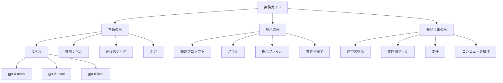

2026年10月2日、OpenAI は GPT-6 ファミリーのモデルガイドを公開しました。ページの H1 は "A model guide for the GPT-6 family" です。サブタイトルは、時間と費用を管理しながら結果を出すための実務上のヒント、です。同じ URL を指す関連カードの題は "A practical guide to building with GPT-6" です。

本文は3つの節です。本番での動かし方、プロンプトとスキル、長い仕事の進め方を、一つの記事に並べています。想定読者は、API でエージェントの仕事を組み立てる人です。モデル ID、単価、推論努力、ツールの同時使用条件の詳細は、記事がリンクする API ドキュメントと価格表にあります。

この記事は、その3つの束と、2026年10月3日に開いた開発者ドキュメントの掲載値を、同じ日付のスナップショットとして並べます。掲載値は取得後に変わりえます。

*この記事の全体像。以下、順に解説します。*

## GPT-6の実務ガイドとは

実務ガイドは、1件の仕事を3つの束に分けて書きます。本番の束は、モデル、推論レベル、速度、測定です。指示の束は、課題プロンプト、スキル、`AGENTS.md`、判断の境界と完了です。長い仕事の束は、途中指示、非同期ツール、委任、コンピュータ操作です。単価表は記事の外にあり、各モデルと各ティアのトークン単価を載せます。

| 図のラベル | ガイド上の中身 |
|---|---|
| 実務ガイド | 2026年10月2日のモデルガイド |
| 測定 | 成功、遅延、成功あたり費用 |
| 指示ファイル | `AGENTS.md` |
| 境界と完了 | 判断の境界と完了の定義 |
| gpt-6-astra | 最も要求の高い仕事向け |
| gpt-6.1-sol | Astra に近い能力を、より低い単価で使うモデル |
| gpt-6-luna | 量の多い仕事向け |

価格表は、この図の各箱に単価を付ける別紙です。実務ガイドの画像 alt は、Sol を Astra の5分の1の価格、と書きます。価格の正本は価格表です。

### 3つのモデル

ガイドが手順の中心に置くモデルは3つです。

| モデル ID | ガイド上の位置 | context window | 最大入力 | 最大出力 | 知識の cutoff |
|---|---|---:|---:|---:|---|
| `gpt-6-astra` | 最も要求の高い仕事 | 1,050,000 | 922,000 | 128,000 | Apr 30, 2026 |
| `gpt-6.1-sol` | それに近い能力を低い単価で使う | 1,050,000 | 922,000 | 128,000 | Apr 30, 2026 |
| `gpt-6-luna` | 量の多い仕事 | 1,050,000 | 922,000 | 128,000 | May 18, 2026 |

3モデルとも、入力は text と image、出力は text、とモデルページが書きます。

推論努力の値は、モデルごとに部分集合です。

| モデル | モデルページが挙げる effort | 省略時 |
|---|---|---|
| Astra | `low`、`medium`、`high`、`xhigh`、`max` | モデルページは値の集合を挙げる |
| GPT-6.1 Sol | Astra と同じ集合。`none` と `minimal` は非対応 | `medium` |
| Luna | `none` を含む | `medium` |

`reasoning.mode` は `standard` と `pro` です。effort とは独立です。pro の追加作業は、そのモデルの標準トークンレートで請求される、と reasoning ガイドが書きます。推論トークンは output として課金され、コンテキストを使います。実験時は少なくとも 25,000 トークンを空ける、という推奨があります。`max_output_tokens` に達すると `status: incomplete` になりうる、と同じガイドが書きます。

`text.verbosity` は、effort とも mode とも別のパラメータです。

### 速度のティア

API の `service_tier` には、Standard に加え、Fast、Ultrafast、Batch、Flex があります。Priority は 2026年7月30日に Fast へ改名された、と価格ページが書きます。

2026年10月3日の価格表では、トークン単価の倍率は次のとおりです。

| ティア | 単価の掲載 | 範囲のメモ |
|---|---|---|
| Fast | Standard の 2 倍 | Astra の短コンテキストでは input $20、output $100 |
| Ultrafast | Astra の短コンテキストは Standard の 6 倍 | 価格表に載る GPT-6 は `gpt-6-astra` のみ。`service_tier` は `ultrafast` |
| Batch と Flex | Standard の 50% | 処理の待ち方は Standard と異なる |

Ultrafast の短コンテキストは、input $60、cached input $6、cache write $75、output $300 です。長コンテキストは $120 / $12 / $150 / $450 です。提供範囲は US data residency と global です。EU と、その他の非 US regional は非対応、と Ultrafast ガイドが書きます。既定 TPM は、tier 1 から 3 が 500,000、tier 4 が 1,000,000、tier 5 が 5,000,000 です。

Fast は Standard のレート枠を共有する、と Fast ガイドが書きます。入力 TPM が 100万に達したあと、15 分で 50% を超えて増やすと、超過分が `service_tier: default` に落ち、Standard 料金になる、と同じガイドが書きます。

### 指示の束

プロンプトの節は、課題プロンプト、スキル、`AGENTS.md`、判断の境界、完了の定義を分けます。スキルは Markdown の手順です。名前と description がコンテキストに入る、とスキル記事が書きます。ユーザー指示がスキルより優先される、と Using GPT-6 が書きます。

完了の例として、スキル記事は、実装、実行、検査、失敗の修正を挙げます。

### 長い仕事の束

長い仕事の節は、途中の指示、非同期ツール、委任、コンピュータ操作を並べ、顧客事例を添えます。

非同期の `async: true` は、GPT-6 の function または custom tool 向けです。組み込みツールと programmatic tool call には効かない、と deployment checklist が書きます。

steering の更新はキューされます。実行中のツールを取り消しません。完了した操作を戻しません。と steering ガイドが書きます。

コンピュータ操作ガイドは、環境の実行は利用者側だと書きます。Astra には code execution を推奨し、`computer` ツールは代替として残します。サンプルの `computer` 呼び出しは、モデル `gpt-6.1-sol` を使います。操作の種類は、click、double_click、drag、move、scroll、keypress、type、wait、screenshot です。

### ツール

Responses API のツール列挙は、3モデルのページで同じです。`web_search`、`file_search`、`image_generation`、`code_interpreter`、`hosted_shell`、`apply_patch`、`skills`、`computer_use`、`mcp`、`tool_search` です。

2026年10月3日のツール表に行があったものは、次のとおりです。

| ツール | 掲載 |
|---|---|
| Web search | 1,000 呼び出しあたり $10。検索コンテンツのトークンはモデルレート |
| Hosted Shell と Code Interpreter | コンテナ。1 GB・20 分が $0.03 などの段階がある |
| File search | 保存は 1 GB あたり 1 日 $0.10（1 GB 無料）。呼び出しは 1,000 あたり $2.50（Responses） |

モデル選択ガイドは、同じ入力で比べ、品質を満たす最も軽い組を残す、と書きます。開始点は次の7つです。Luna と Low、Luna と Extra high、GPT-6.1 Sol と Medium、GPT-6.1 Sol と Extra high、Astra と Low、Astra と Medium、Astra と Extra high。

### Standard の掲載単価

時点は 2026年10月3日です。単位は 100万トークンあたりの掲載ドルです。掲載値のまま書きます。比の判定が $0.10 と $0.20 と $1 の差に依存するためです。短コンテキストの列です。

| モデル ID | input | cached input | cache write | output |
|---|---:|---:|---:|---:|
| `gpt-6-astra` | 10 | 1 | 12.50 | 50 |
| `gpt-6.1-sol` | 2 | 0.10 | 2.50 | 10 |
| `gpt-6-sol` | 2 | 0.20 | 2.50 | 10 |
| `gpt-6-luna` | 0.10 | 0.01 | 0.125 | 0.50 |

`gpt-6-sol` は `gpt-6.1-sol` とは別 ID です。短コンテキストの input $2 と output $10 は GPT-6.1 Sol と同じで、cached input は $0.20 です。Using GPT-6 は、すでに `gpt-6-sol` を使っている場合は 6.1 Sol へ移す前に移行案内を見よ、と書きます。

入力トークンが 272K を超えると、リクエスト全体の input と cache が 2 倍、output が 1.5 倍になる、と各モデルページが書きます。長コンテキストは、上の input と cache を 2 倍、output を 1.5 倍した列が価格表にあります。Astra は $20 / $2 / $25 / $75 です。Astra の長コンテキスト output $75 は、短コンテキスト output $50 の 1.5 倍です。

cache write は非キャッシュ input の 1.25 倍、と価格ページと caching ガイドが書きます。

レート制限は、モデルページの Standard 表（2026年10月3日）です。

| モデル | 掲載された枠 |
|---|---|
| Astra | tier 1 は 500 RPM / 500,000 TPM。tier 5 は 15,000 RPM / 40,000,000 TPM。Batch queue の列がある |
| GPT-6.1 Sol | tier 1 は 500 RPM / 500,000 TPM。tier 2 は 5,000 RPM / 1,000,000 TPM。tier 5 は 15,000 RPM / 40,000,000 TPM。取得した表に Batch queue 列は無かった |
| Luna | tier 5 は 30,000 RPM / 180,000,000 TPM |

2026年3月5日以降に出たモデルは、regional processing（data residency）に 10% 上乗せ、と価格ページが書きます。FedRAMP も 10% です。

プロンプトキャッシュの順序には、最小 1,024 visible input tokens があります。TTL は `prompt_cache_options.ttl=30m` のみ、と caching ガイドが書きます。

Codex のクレジット表は、API のトークン単価とは別紙です。2026年10月3日の Codex pricing では、included subscription の Fast が 2.5 倍、購入クレジットの Fast が 2 倍、GPT-6 Astra Ultrafast が included で 8 倍、購入クレジットで 6 倍です。

## 注意点

ここから先は、ガイドとリンク先の数を、どこまで手順の証拠にしてよいかです。定義、分母、計測条件がページにあるものだけを、その条件つきで読みます。

### キャッシュの95%と5分の1

prompt caching ガイドは "discounted up to 95%" と書きます。これは上限です。GPT-6.1 Sol の cache read は、非キャッシュ input の 5%（0.05 倍）と価格関係が一致します。Luna のモデルページは cache read を 10% と書きます。Astra のモデルページは倍率の文を置かず、価格は cached input $1、input $10 です。10% は価格の比であり、倍率を述べる文はモデルページにありません。

caching ガイドは、0.1 倍のモデルで1回書いて1回読むと、通常 input の 1.35 倍になる計算例を出します。短い仕事では、書き込みが読み出し割引を上回ることがあります。

「5分の1」が 2026年10月3日の Standard 短コンテキストで一致するのは、次の列です。

| 列 | gpt-6.1-sol | gpt-6-astra | 比 |
|---|---:|---:|---|
| input | $2 | $10 | 5分の1 |
| output | $10 | $50 | 5分の1 |
| cache write | $2.50 | $12.50 | 5分の1 |
| cached input | $0.10 | $1 | 10分の1 |

cached input は 5分の1ではありません。Sol の 95% を、家族全体のキャッシュ割引率として書くと、Luna の 10% と Astra の価格比から外れます。

### 速度の倍率

Fast のトークン単価が Standard の 2 倍であることは、価格表と一致します。速度の説明は文書で分かれます。

Fast mode ガイドのリードは "up to 2.5× faster" です。注は、その 2.5 倍を `gpt-5.6-sol` の Standard 比として書きます。Astra 発表記事は、Astra の Fast が Standard の最大 2 倍の速度を、Standard の 2 倍の価格で出す、と書きます。Fast FAQ は、GPT-6 Astra の Fast に latency SLA は無い、と書きます。速度倍率は保証の文ではありません。

Ultrafast は、Fast の 2 倍とは別の行です。API の Ultrafast 短コンテキスト $60 は Standard の 6 倍です。Codex の included 8 倍、購入クレジット 6 倍は、API のドル単価とは別紙です。API の $60 と Codex の 8 倍を、一つの倍率にまとめません。

### 顧客事例の3倍

[Invideo の事例](https://openai.com/index/invideo-builds-with-gpt-6-astra)（2026年9月23日）の結果カードは、"3x Increase in success rate for color-grading and correction" と "50 Custom effects created in one day" です。CEO Sanket Shah は、成功率が約3倍になった、と述べます。以前の失敗率が高かった、という同社の観察が同じ記事にあります。評価セット、以前の成功率、分母、OpenAI が測った旨は、記事にありません。

実務ガイドは "roughly three times" と "about 50 effects" と要約します。約50は、少数の編集者が1日で作った、という記述です。手順が正しいことの測定値としては使いません。Harvey、Cognition、Hex の引用に、OpenAI が測った成功倍率はありません。

### 発表記事のスコア

実務ガイドは、能力の参照として Astra 発表へリンクします。発表本文は FrontierMath Tier 4 を 98% と書きます。同じページの表は FrontierMath Tier 4 (v2) を 97.6% と書きます。98 と 97.6 が版の差か丸めの差かは、見た脚注だけでは一意に決まりません。ARC-AGI-3 の 99.9% には、Responses API のハーネスで設定を2つ変えた、という脚注があります。表の下は、スコアが最大努力のもので、OpenAI の研究または API 環境だと書きます。

この記事の主題は手順の単位です。発表記事のスコア表は、手順の証拠にしません。

Using GPT-6 は、トークン単価は高い一方で、タスクあたりの推定 API 費用は以前のモデルより低かった、と書き、発表記事へリンクします。その文に金額はありません。金額は置きません。

### 文書が食い違う併用

Fast と EU data residency は同時に使えない、と Fast FAQ が Astra、GPT-6.1 Sol、GPT-6 Sol、GPT-6 Luna について書きます。Using GPT-6 の Limitations は、この文に GPT-6.1 Sol を入れません。GPT-6.1 Sol のモデルページは "Fast mode is unavailable with EU data residency" と書きます。この1件の正本は、モデルページです。

ブログの多くの中身は、既存の API ガイドにあります。ガイドは、それらの目次でもあります。

### ページを開いても決まらない点

次は、2026年10月3日に開いた一次ページが、値または実行結果を確定していない項目です。

- Astra で effort を省略したときの値。medium を default と列挙する文が名指しするのは、GPT-5.6、GPT-6.1 Sol、GPT-6 Sol、GPT-6 Luna です。
- reasoning ガイドは、Astra に `reasoning.effort=none` を渡すと HTTP 400 になると書きます。そのリクエストの実行ログは、ガイドにありません。
- Responses の `multi_agent.enabled` を `gpt-6-astra` に付けた HTTP 結果。
- Agents API の Astra サンプルを実行した結果。サンプルの存在と、実行結果は別です。
- computer use の呼び出し単価。ツール表に行はありません。モデルページは、search や computer use のようなツール専用モデルには呼び出し料がありうる、と汎文で書きます。ゼロとは書きません。
- reasoning item を Astra、GPT-6.1 Sol、Luna のあいだで持ち越せるか。持ち越し不可の例として reasoning ガイドが挙げるのは、GPT-5.6 と GPT-5.5 です。
- Codex の UI が `configuration_update` を送るか。実務ガイドは、Codex ではそのモデルの default から始め、簡単な仕事は下げ、深い分析は上げよ、とだけ書きます。
- 公式 Colab、API 全体の SLA、非推奨日。fine-tuning は Sol ページが unsupported と書きます。スナップショット名は、各 alias 自身です。

## 改訂を5つの行に分ける

公式の3節は、仕事の束です。改訂のときは、その隣に5つの行を置きます。5行は、公式の見出しとは別の読みの枠です。公式側に名前があり、5行の名前には入らないレバーがあります。

| 改訂の行 | 公式の対象 | 2026年10月3日の中身 | その行だけを変えてよいか |
|---|---|---|---|
| モデル | `gpt-6-astra`、`gpt-6.1-sol`、`gpt-6-luna` | 能力、effort の集合、キャッシュ倍率、データ所在が分かれる。`gpt-6-sol` は 6.1 とは別 ID | モデルを変えるときは、スキルと完了条件の見直しが別指示になる |
| 推論努力 | `reasoning.effort` | 途中変更は `configuration_update`。`reasoning.mode` と `text.verbosity` は別パラメータ | 次節の条件を満たすとき、努力の値だけを足せる |
| スキル | スキル、`AGENTS.md`、課題プロンプト | ユーザー指示がスキルより優先、と Using GPT-6 が書く | 同一モデルで努力だけを動かすあいだは固定する |
| ツール | ツール定義に加え、steering、async、computer use、multi-agent | 定義の変更はキャッシュ prefix を変える。呼び出し可否は `allowed_tools` か `tool_choice` | 定義は固定する。使える API 面はモデルとガイドで一様ではない |
| 止める条件 | persistence、decision boundaries、assistant の `phase` | 完了は実装、実行、検査、失敗の修正、とスキル記事が例示する | モデルを Astra に変えるときは、早い停止と always-ask の見直しが別指示になる |

5行の外に残るレバーは、次です。

- 処理ティア。Standard、Fast、Ultrafast、Batch、Flex。
- `reasoning.mode` の standard と pro。
- `text.verbosity`。
- assistant の `phase`（commentary と final_answer）。deployment checklist が項目に含みます。
- プロンプトキャッシュの順序、最小 1,024 visible input tokens、TTL。
- データ所在と、それに伴う 10% 上乗せ、Fast や Ultrafast との併用条件。

使い方は2つです。同一モデルのまま品質だけを動かす改訂は、努力の行に寄せ、スキルとツール定義の行を変えません。モデル ID を変える改訂は、スキルと止める条件の行を同時に開きます。

## 推論努力だけを変える

caching ガイドと deployment checklist は、会話の途中で努力を変える手順を `configuration_update` として書きます。request の `reasoning.effort` は、元の値のままにします。input に update を足します。次の response から効きます。

この手順が書かれている範囲は、GPT-6 の standard、single-agent です。automatic compaction と truncation とは併用しません。`/responses/compact` は、update を含む履歴を拒否します。圧縮するなら、compaction のあとで新しい update を足す、と checklist が書きます。自動圧縮を同時に使う運用では、努力だけを変える一文を適用しません。

request 先頭の `reasoning.effort` を変えると、hidden instructions が変わり、prefix が再利用できない、と caching ガイドが書きます。ツールの名前、説明、schema、順序を変えても、prefix は変わります。呼び出しの絞り込みは定義を書き換えず、`allowed_tools` か `tool_choice` を使います。`tool_search` と `defer_loading` は、見つかったツールを後ろに足し、それより前の prefix を保つ、と同じガイドが書きます。

モデルを Astra に変えるときは、努力を固定してスキルを残す読みが、公式の別指示と逆になります。スキル記事（Eric Provencher、2026年9月11日）は、硬いレシピ、毎回全文書を読ませる `AGENTS.md`、常時の承認、最初の実装で止める完了条件が、Astra を止めるか過剰なテストをさせる、と書きます。Using GPT-6 は、スキルと `AGENTS.md` の監査を strongly recommend します。品質低下の大きさは、定量では示されていません。指針です。

Astra に上げる改訂では、スキル、`AGENTS.md`、完了の定義を同じ改訂で開きます。always-ask と、最初の実装で止まる完了条件を、その改訂の対象に含めます。

## 委任をAPI面で分ける

「Astra では multi-agent が使えない」と一括では書きません。2026年10月3日に開いた一次ページは、次の層に分かれます。実リクエストの HTTP 結果は、どの層のページにも載っていません。

| 層 | 文書が言うこと | URL |
|---|---|---|
| Responses API の専用ページ | beta。対象は GPT-6.1 Sol とすべての GPT-5.6。ヘッダ例は `OpenAI-Beta: responses_multi_agent=v1`。既定の `max_concurrent_subagents` は 3。有効化すると `/responses/compact` は非対応で、サーバ側 compaction が入る | [responses-multi-agent](https://developers.openai.com/api/docs/guides/responses-multi-agent) |
| 実務ガイド | GPT-6.1 Sol が multi-agent をサポートし、現在は beta、と書く | [実務ガイド](https://openai.com/index/practical-guide-building-gpt-6) |
| deployment checklist | "including GPT-6 models" と広く書き、リンク先は Responses の専用ページ | [deployment-checklist](https://developers.openai.com/api/docs/guides/deployment-checklist) |
| Using GPT-6 | GPT-6 は GPT-5.6 にある multi-agent orchestration を含む、と書く。Astra のプロンプト節は、利用者のハーネスに collaboration tools があるときの委任文を載せる | [latest-model](https://developers.openai.com/api/docs/guides/latest-model) |
| Agents API | `client.beta.agents.sessions.create` のサンプルが `model: "gpt-6-astra"` と `multi_agent.enabled: true` を置く。ヘッダ例は `OpenAI-Beta: agents=v1` | [agents-api/multi-agent](https://developers.openai.com/api/docs/guides/agents-api/multi-agent) |

どれか一つの文書で、家族全体の可否を代表させません。Responses API、Agents API、自前ハーネスは、別の行です。

## 同時に成立しない組み合わせ

文書上、同時に成立しないと書かれている組み合わせは次です。

| 組み合わせ | 文書 |
|---|---|
| `configuration_update` と automatic compaction または truncation | deployment checklist。compact エンドポイントは update を含む履歴を拒否する |
| Responses の multi-agent 有効化と `/responses/compact` | Responses multi-agent ページ |
| multi-agent での async と parallel tool calls | deployment checklist |
| Fast と EU data residency（Astra、GPT-6.1 Sol、GPT-6 Sol、Luna） | Fast FAQ と GPT-6.1 Sol モデルページ |
| Ultrafast と EU、または非 US の regional endpoint | Ultrafast ガイド |
| Astra または GPT-6.1 Sol の Chat Completions での function calling | reasoning ガイド。ツール呼び出しは Responses |
| Luna の Chat Completions function calling を、`reasoning_effort` が `none` 以外で使う | Luna のモデルページ |
| Astra に `reasoning.effort=none` | reasoning ガイドは HTTP 400 と書く。実行ログはガイドに無い |

## 測定は自分の評価セットで取る

deployment checklist が委譲する測定は、task success、latency、成功あたり費用です。代表タスクについて、自分の評価セットで取ります。顧客の3倍と、発表記事のスコアは、手順の正しさの証拠にしません。

単価を書くときは、`gpt-6.1-sol` と `gpt-6-sol` を分けます。cached input は、2026年10月3日の表で $0.10 と $0.20 です。速度を上げる単価は、Fast の 2 倍と Ultrafast の 6 倍を分けます。API のドルと Codex のクレジット倍率も分けます。

## まとめ

2026年10月2日の実務ガイドは、モデル、推論、指示、ツール、完了、測定を一つの公開手順にしました。単価表は別紙のままです。手順の単位の正本は、ブログが指す API ガイドと価格表です。

同一モデルの品質調整では、`configuration_update` の条件を満たす範囲で、努力の行だけを変えます。スキル本文とツール定義は変えません。モデルを Astra に上げる改訂では、スキル、`AGENTS.md`、完了の定義を同じ改訂で開きます。委任は、Responses API、Agents API、自前ハーネスを別の行にします。

この記事が少しでも参考になった、あるいは改善点などがあれば、ぜひリアクションやコメント、SNSでのシェアをいただけると励みになります！

## 参考リンク

- OpenAI, "A model guide for the GPT-6 family", 2026-10-02. [practical-guide-building-gpt-6](https://openai.com/index/practical-guide-building-gpt-6)
- OpenAI, "Introducing GPT-6 Astra". [gpt-6-astra](https://openai.com/index/gpt-6-astra/)
- OpenAI, "Invideo builds with GPT-6 Astra", 2026-09-23. [invideo-builds-with-gpt-6-astra](https://openai.com/index/invideo-builds-with-gpt-6-astra)
- Eric Provencher, "Rethinking skills and prompts for GPT-6 Astra", 2026-09-11. [rethinking-skills-and-prompts-for-gpt-6-astra](https://developers.openai.com/blog/rethinking-skills-and-prompts-for-gpt-6-astra)
- OpenAI, model pages (retrieved 2026-10-03). [gpt-6-astra](https://developers.openai.com/api/docs/models/gpt-6-astra) / [gpt-6.1-sol](https://developers.openai.com/api/docs/models/gpt-6.1-sol) / [gpt-6-luna](https://developers.openai.com/api/docs/models/gpt-6-luna)
- OpenAI, Pricing (retrieved 2026-10-03). [pricing](https://developers.openai.com/api/docs/pricing)
- OpenAI, Codex pricing (retrieved 2026-10-03). [codex/pricing](https://developers.openai.com/codex/pricing)
- OpenAI, Reasoning. [reasoning](https://developers.openai.com/api/docs/guides/reasoning)
- OpenAI, Prompt caching. [prompt-caching](https://developers.openai.com/api/docs/guides/prompt-caching)
- OpenAI, Deployment checklist. [deployment-checklist](https://developers.openai.com/api/docs/guides/deployment-checklist)
- OpenAI, Model selection. [model-selection](https://developers.openai.com/api/docs/guides/model-selection)
- OpenAI, Using GPT-6. [latest-model](https://developers.openai.com/api/docs/guides/latest-model)
- OpenAI, Multi-agent (Responses). [responses-multi-agent](https://developers.openai.com/api/docs/guides/responses-multi-agent)
- OpenAI, Multi-agent (Agents API). [agents-api/multi-agent](https://developers.openai.com/api/docs/guides/agents-api/multi-agent)
- OpenAI, Fast mode. [fast-mode](https://developers.openai.com/api/docs/guides/fast-mode)
- OpenAI, Ultrafast mode. [ultrafast-mode](https://developers.openai.com/api/docs/guides/ultrafast-mode)
- OpenAI, Computer use. [tools-computer-use](https://developers.openai.com/api/docs/guides/tools-computer-use)
