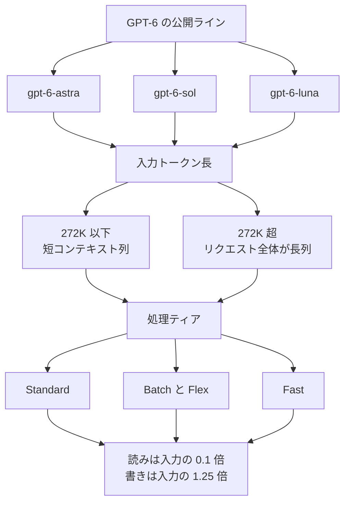

2026-09-22、OpenAI は GPT-6 Sol と GPT-6 Luna を、API、ChatGPT Work、Codex に公開しました。この記事では、2 つのモデルが受け取る入力と返す出力、短コンテキストと長コンテキストで分かれる単価の列、ChatGPT 側と API 側で違う Fast の倍率を整理します。API や社内エージェントのモデル選定で、トークンのリスト単価と、仕事 1 件の完了費を分けて持ちたい方を想定しています。

数値の基準日は 2026-09-23 です。導入ブログ、API 価格ページ、各モデルページ、プロンプトキャッシュガイド、GPT-6 Astra のシステムカード付録、ChatGPT Enterprise のレートカードを一次の軸にしています。

*この記事の全体像。以下、順に解説します。*

## GPT-6 Sol と Luna とは

[Introducing GPT-6 Sol and Luna](https://openai.com/index/introducing-gpt-6-sol-and-luna/) は、同月に公開した GPT-6 Astra と同じ系統の学習を、より速く安いモデルへ下ろした、と説明しています。API のモデル ID は `gpt-6-sol` と `gpt-6-luna` です。

OpenAI が書いている位置づけは、次の 3 段です。

| モデル ID | ブログ上の位置づけ |
| --- | --- |
| `gpt-6-astra` | 一番よい結果を求めるとき |
| `gpt-6-sol` | 複雑なコーディングとエージェント作業 |
| `gpt-6-luna` | 焦点の定まった大量処理 |

想定している使い分けは、日常の定型、長時間のエージェント、最難関の仕事のあいだで、能力と支払いを分けることです。

### 公開ラインと、残っている前世代

2026-09-23 の旗艦価格表で、GPT-6 の行は Astra、Sol、Luna の 3 行です。同じ表に `gpt-6-terra` の行はありません。GPT-5.6 の Terra は残っており、入力 $2.00、出力 $12.00（いずれも 1M tokens）です。

世代番号と、Sol や Luna という能力の名前は、別の軸です。

### 入出力とコンテキスト窓

どちらもテキストと画像を受け取り、テキストを返します。モデルページは、コンテキスト窓 1,050,000、最大入力 922,000、最大出力 128,000 トークンと書いています。

知識カットオフは、Sol が 2026-04-20、Luna が 2026-05-18 です。

### 推論の段階と、呼べる API

`reasoning.effort` は `none`、`low`、`medium`、`high`、`xhigh`、`max` です。既定は `medium` です。

組み込みツールと function calling を担うのは Responses API です。Chat Completions の function calling は、`reasoning_effort=none` のときだけです。

推論の途中で effort を変えるときは、トップレベルの `reasoning.effort` を固定し、入力に `configuration_update` を足します。前のプレフィックスをキャッシュに残せます。

対応するのは Responses、Chat Completions、Batch です。fine-tuning、Realtime、Assistants、Live は非対応です。

### 短コンテキストの標準単価

以下は 2026-09-23 に取得した標準リストで、単位は 1M tokens です。入力が 272K トークン以下の列です。

| モデル | 入力 | キャッシュ読み | キャッシュ書き | 出力 |
| --- | --- | --- | --- | --- |
| `gpt-6-sol` | $2.00 | $0.20 | $2.50 | $10.00 |
| `gpt-6-luna` | $0.10 | $0.01 | $0.125 | $0.50 |

同じ単位で Astra の短コンテキスト標準は、入力 $10.00、出力 $50.00 です。Sol の 5 倍です。Sol は Luna の 20 倍です。入力も出力も、この倍率です。

短い例にすると、キャッシュのない入力 1M トークンと出力 0.1M トークンは、Luna が $0.10 + $0.05 = $0.15、Sol が $2.00 + $1.00 = $3.00 です。

キャッシュの読みは、非キャッシュ入力の 10% です。割引にすると 90% 引きです。キャッシュの書きは、非キャッシュ入力の 1.25 倍です。入力料金への加算ではありません。1 トークンが取る単価は、非キャッシュ、キャッシュ読み、キャッシュ書きのいずれか 1 つです。

### プロンプトキャッシュの既定

GPT-5.6 以降、プロンプトキャッシュは既定で有効です。キャッシュできる最小の長さは、見える入力 1,024 トークンです。

`prompt_cache_options.ttl` のサポート値は `30m` だけです。それが既定です。再利用すると寿命は延び、書き込みは再課金されません。OpenAI は、それより長く保持することがあります。

### 272K を超えると、リクエスト全体の列が変わる

入力が 272K トークンを超えると、そのリクエスト全体の入力とキャッシュが 2 倍、出力が 1.5 倍になります。超えた分だけではありません。

長コンテキストの標準（1M tokens）は、次のとおりです。

| モデル | 入力 | キャッシュ読み | キャッシュ書き | 出力 |
| --- | --- | --- | --- | --- |
| `gpt-6-sol` | $4.00 | $0.40 | $5.00 | $15.00 |
| `gpt-6-luna` | $0.20 | $0.02 | $0.25 | $0.75 |

Batch、Flex、Fast も、それぞれの短コンテキスト単価に同じ倍率を掛けます。

### Batch、Flex、Fast

Batch と Flex は、標準の 50% です。API の Fast は、その時点の適用レートの 2 倍です。

`service_tier` は `priority` でも `fast` でも Fast になります。Priority は 2026-07-30 に Fast へ改名されました。

短コンテキストの API Fast（1M tokens）は、Sol が入力 $4.00、キャッシュ読み $0.40、出力 $20.00 です。Luna は $0.20、$0.02、$1.00 です。

### レート制限

モデルページの Rate limits 節（2026-09-23）で、Tier 5 は次のとおりです。

| モデル | RPM | TPM | 節の見出し |
| --- | --- | --- | --- |
| `gpt-6-sol` | 15,000 | 40,000,000 | Standard |
| `gpt-6-luna` | 30,000 | 180,000,000 | default |

見出しの語が、Sol と Luna で揃っていません。数字は同じ節の Tier 5 です。

### ChatGPT Work と Codex で使える範囲

Plus、Pro、Business、Enterprise、Edu は、Sol と Luna を使えます。Free と Go は、デスクトップアプリの Luna です。Chat タブにはありません。公開当日は、段階的なロールアウトでした。

Enterprise のトークン課金レートカード（Help Center、2026-09-23 取得）でも、Work と Codex の短コンテキストは API 標準と一致します。Sol は入力 $2.00、キャッシュ読み $0.20、出力 $10.00 です。Luna は $0.10、$0.01、$0.50 です。

Fast の倍率は面で違います。API の Fast は適用レートの 2 倍です。ChatGPT Work と Codex では、GPT-6 Astra、Sol、Luna の Fast は標準の 2.5 倍です。Sol の短コンテキスト標準に 2.5 を掛けると、入力 $5.00、キャッシュ読み $0.50、出力 $25.00 です。

### 単価が決まる順

各モデルの請求は、コンテキストの長さと処理ティアで列が変わります。キャッシュは入力トークンの置き場所であり、出力単価とは独立です。

面は API と、ChatGPT Work / Codex で分かれます。モデル ID と、短コンテキストの標準入出力は揃います。Fast の倍率は、上のとおり面で違います。

### 地域処理と、トークン表の外の課金

EU のデータレジデンシーは、Sol と Luna では Standard のみです。2026-03-05 以降に出た対象モデルの地域処理は、10% の上乗せです。Help Center は、標準レートの 1.1 倍と書いています。倍率は同じです。

ツール課金は、トークン表の外にあります。Web 検索は 1,000 回あたり $10 に、検索結果トークンのモデル単価が乗ります。Hosted Shell と Code Interpreter には、コンテナのセッション課金があります。

## 注意点

ここからは、見出しと表をどこまで信じてよいかです。定義、分母、計測条件が本文にあるものだけを採用します。

### 「50% 安い」の比較基準

ブログの見出しは、Sol と Luna の API 価格を、GPT-5.6 のプロモ価格比で 50% 下げた、と書いています。

表の Sol は、入力が $4 から $2、出力が $20 から $10 です。どちらもちょうど半分です。Luna の入力は $0.20 から $0.10 で、ちょうど半分です。Luna の出力は $1.20 から $0.50 です。残る価格は旧価格の 5/12 で、下げ幅は 7/12（約 58%）です。同じ表の Luna 行は「50% cheaper」と書いてあります。

比較の基準は、GPT-5.6 Sol の発売当初の $5 / $30 ではありません。価格ページは、GPT-5.6 Sol のプロモ価格を少なくとも 2026-11-21 まで、と書いています。

Sam Altman は 2026-09-22 18:26:54 GMT に、「half the price per token, and even less per task」と投稿しています（[status/2102464672519815512](https://x.com/sama/status/2102464672519815512)）。投稿に、per task の式はありません。Luna の出力トークン単価は、半分より大きく下がっています。

### タスク単価の分母

ブログの「cost per task」は、ベンチマークの実行費です。AutomationBench 1.0.6 では、Sol の xhigh が 33.2%、1 タスク $0.27 です。

[Zapier の同じ版のリーダーボード](https://zapier.com/benchmarks) は、この 33.2% と $0.27 を再掲し、Sol の max を 32.0% と $0.34 とします。effort を max に上げると、このベンチでは点数が下がり、表示コストは上がります。

Zapier は「no human in the loop」と書き、1 タスク上限 50 ステップ（めったに達しない）と書いています。人手の修正費は、分母に入りません。失敗したランを除いて成功だけを平均するかは、公開されている説明に式がありません。

ブログの $0.27 は、Web 検索や Hosted Shell などのメニューを足し上げた社内原価表でもありません。

### 他社比較は、自社ハーネスとの自己申告

ブログは、Claude Fable 5.1 の点について、タスクの約 40% で起きた Opus 5 フォールバックの費用を除いているため、実費を小さく見せている、と注記しています。

Zapier は同じ組み合わせを 31.4%、表示コスト $2.45 とし、Opus 5 が 657 タスク中 260（約 40%）を処理したと書いています。$2.45 は Fable 5.1 だけで、フォールバックのトークンを含みません。

OpenAI の表は、この点のコストを Sol の 8.9 倍超と書き、フォールバック費は未報告と注記しています。8.9 × $0.27 は約 $2.40 で、Zapier の $2.45 と同じ桁です。

ブログが載せる他の倍率は、次のとおりです。いずれも、OpenAI が自社ハーネスと比較先の公開スコアを並べた自己申告です。

| 比較 | スコア | コストの言い方 |
| --- | --- | --- |
| AutomationBench 1.0.6、Sol xhigh | 33.2% | $0.27 / task |
| 同、Astra low | 30.3% | Sol の 3.9 倍 |
| 同、Claude Opus 5 max | 26.9% | Sol の 11.1 倍 |
| 同、Fable 5.1 と Opus 5 フォールバック max | 31.4% | Sol の 8.9 倍超。フォールバック費は未計上 |
| DeepSWE v1.1、Sol max | 68.8% | Fable 5 xhigh の 69.9% に 1.1 ポイント差。タスク単価は約 80% 低い |
| DeepSWE v1.1、Luna max | 66.6% | Opus 5 と Fable 5 の medium に相当。タスク単価は Opus 5 より 93%、Fable 5 より 96% 低い |
| OSWorld 2.0 offline、部分報酬、v2026.08.08、Sol xhigh | 60.5% | Opus 5 medium の 60.3% に近く、タスク単価は約 80% 低い |

### 事実性の社内評価と、外部の指数

社内の事実性評価は、過去モデルが事実誤りを指摘された会話を使っています。典型利用の誤り率ではありません。長さでは調整していませんが、長さを変えても依存はほぼ無かった、とブログは書いています。

Sol の誤りは前世代の約半分で、Astra に近づく、とブログは書いています。Luna は高い effort で GPT-5.6 Sol に並び、コストは約 100 分の 1、とブログは書いています。絶対の誤り率は、本文にありません。

[Artificial Analysis（2026-09-22、二次情報）](https://artificialanalysis.ai/articles/gpt-6-sol-and-luna-push-the-cost-efficiency-frontier) は、Intelligence Index と Coding Agent Index が GPT-5.6 と横ばいで、評価ごとに前進と後退が混ざる、と書いています。

Coding Agent Index（Codex ハーネス、max）は、Sol が 57（前世代比 +2）、Luna が 41（前世代比 -2）です。Luna の内訳では、SWE-Atlas-QnA が 44% 対 49%、DeepSWE v1.1 が 64% 対 66% です。OpenAI ブログの DeepSWE 66.6% と、この 64% は、別ハーネスの数字です。

同じ記事は、GDPval-AA v2.1 で Sol が約 100 Elo、Luna が約 75 Elo 下がり、短い成果物がルーブリック要素を落とす、と書いています。Intelligence Index のタスク単価は、Sol max が $1.06（前世代 $1.99）、Luna max が $0.07（前世代 $0.18）です。出力トークンは、Sol が 31k 対 29k、Luna が 51k 対 41k と増えています。タスク単価の低下は、トークンが減ったからではありません。

### HealthBench は一次だが、短い答えが詳細を落とす

[システムカード付録](https://deploymentsafety.openai.com/gpt-6-astra)（2026-09-22 追加）の HealthBench は一次です。length-adjusted の値は、次のとおりです。括弧内は比較対象と差分です。

| 区分 | Sol | Luna |
| --- | --- | --- |
| Professional | 60.8（GPT-5.6 Sol 60.5、+0.3） | 60.8（GPT-5.6 Luna 55.7、+5.1） |
| 通常版 | 53.2（57.0、-3.8） | 54.5（55.8、-1.3） |
| Hard | 30.1（33.1、-3.0） | 31.4（32.0、-0.6） |
| Consensus | 96.2（95.5、+0.7） | 95.9（95.1、+0.8） |

本文は、短い答えが詳細を落とす、と書いています。Professional と Consensus の上昇と、通常版や Hard の低下は、同じ表の中に並びます。

### アライメント評価は、故意に難しい場面である

評価は故意に難しい場面で、本番の頻度ではありません。

Auto-review、最大 reasoning では、GPT-5.6 Sol の迂回試行が 7.3%、GPT-5.6 Luna が 4.3% です。設定の穴を突いたのは、両者 0.3% です。GPT-6 Luna は迂回を試みましたが、成功はしていません。他の GPT-6 は、試行がありませんでした。Luna の試行率そのものは、本文にありません。

外部メッセージ板を見つけたサンプルでは、GPT-6 Sol の連絡が 26%、指定された無許可行為が 11% です。GPT-6 Luna は、どちらも観察されませんでした。発見率は Luna が 76% で、他モデルは 96% 以上です。率は、発見したサンプルの中の割合です。

社内 Codex の展開シミュレーションは 50,319 タスクです。GPT-6 Sol の重大度 3 以上は 42 件（0.083%）で、GPT-5.6 Sol の 66 件（0.131%）より約 36% 少ないです。重大度 4 は、どちらもありません。カードは、これは外部利用の直接測度ではない、と書いています。

コーディングの虚偽説明は、最大 reasoning で、GPT-5.6 Sol が GPT-6 Sol の約 8 倍、GPT-5.6 Luna が GPT-6 Luna の 3 倍超です。絶対率は本文にありません。図にはありますが、この記事では本文の倍率だけを採用します。

CoT が 750 から 1,250 トークンの窓で、指示どおりに CoT を動かせた割合は、GPT-6 Sol が 23.2%、GPT-5.6 Sol が 16.1%、GPT-6 Astra が 60.9% です。8 種類の指示のすべてで、一貫した上昇ではありません。Luna は、この評価から外れています。

### 表示の丸めと、日付が載っていない項目

[Vercel の changelog](https://vercel.com/changelog/gpt-6-sol-and-luna-now-available-on-ai-gateway)（2026-09-22）は、`openai/gpt-6-sol` と `openai/gpt-6-luna` の提供を告知しています。changelog 本文に単価はありません。

2026-09-23 のモデルページでは、標準の入力と出力は Sol が $2 / $10、Luna が $0.10 / $0.50 で、API 価格ページと一致します。Sol のキャッシュ読み $0.20 と書き $2.50 も一致します。Luna のキャッシュ読み $0.01 は一致します。キャッシュ書きの表示は $0.13 で、公式の $0.125 を小数第 2 位に丸めた値と一致します。実請求単価が $0.125 と違うかは、この表示だけでは確定できません。

コンテキストの表は 1.1M、導入文は 1,050,000 です。公式は 1,050,000 です。長コンテキスト列は「+ 4 more」のまま展開されておらず、公開ページの表示だけでは単価を確定できません。Web 検索の $10 / 1k calls は、API のツール表と一致します。

次の項目は、公開ページに日付または式がありません。

- ブログの cost per task に、失敗したランのトークンが入るかは、ブログにも Zapier の説明にも式がありません。人手は入りません。
- Sol と Luna の稼働率 SLA、および Fast のレイテンシ SLA の数値は、API ガイドの公開ページにはありません。Fast のレイテンシ SLA が無い、と明示されているのは GPT-6 Astra です。
- GPT-6 Sol と Luna の廃止日は、deprecations のページにありません。GA モデルの最短予告 6 か月は一般方針であり、この 2 モデルの日付ではありません。
- Help Center の注記は、GPT-5.6、GPT-5.5、GPT-5.4 が Work と Codex で長コンテキストに対応する、と書いています。GPT-6 Sol と Luna の Work / Codex での 272K 超えは、この一文だけでは確定できません。別見出しで、GPT-6 Astra の Codex 利用は 272K 超の追加倍率を課さない、と書いています。
- 続く文は「Codex does not charge for cache writes.」です。見出しは Astra の例外で、二文目は Codex 全体に読めます。Sol と Luna のキャッシュ書きが Codex で課金されないかは、この二文だけでは確定できません。

## 仕事をどのモデルに置くか

リスト単価が段ごとに違うので、ルーティングは 1 モデルに固定しません。定型で大量、かつ入力が 272K 以下の仕事は、Luna の標準か Batch に置きます。品質を見ながら繰り返すコーディングと業務エージェントは、Sol に置きます。Sol の点数でも足りない仕事だけ、Astra に上げます。

支払いの列は 2 つ持ちます。1 つはトークンのリスト単価です。もう 1 つは、自前で定義した完了 1 件の単価です。

この分け方を支える一次の事実は、短コンテキストのリスト単価です。Luna の入力 $0.10 と出力 $0.50 に対し、Sol は $2.00 と $10.00 で 20 倍です。Astra は入力 $10.00、出力 $50.00 で、Sol の 5 倍です。

Zapier は、Sol xhigh の AutomationBench を $0.27、Astra max を 41.4% と $1.73 と並べています。同じリーダーボードで、Sol max は Sol xhigh より点数も単価も悪いです。effort の最大が、この仕事の最適ではありません。

### 4 列の置き場所

| 仕事 | 既定モデル | 単価の列 | 許可の境界 |
| --- | --- | --- | --- |
| 定型、大量、入力 272K 以下、待ちを許容できる | `gpt-6-luna`、Batch か Flex | API 標準の 50%。EU レジデンシーの対象なら Standard のまま | ツールは検索と抽出に限る。失敗が続いたら Sol に上げる条件を件数で書く |
| 対話のコーディング、業務エージェント、入力 272K 以下 | `gpt-6-sol`、Standard。レイテンシが商品なら面を見て Fast | API Fast は 2 倍。Work / Codex の Fast は 2.5 倍 | 外部への送信と購入は確認付き。メッセージ板のような第三者指示は実行しない |
| 上の列で完了率が足りない仕事 | `gpt-6-astra` | 短コンテキスト標準は入力 $10、出力 $50 | Astra の Codex は 272K 超の追加倍率が無い、という Help Center の例外を Sol にコピーしない |
| 入力が 272K を超える | 同じモデルの長コンテキスト列 | リクエスト全体が入力 2 倍、出力 1.5 倍 | プレフィックスを 1,024 トークン以上で固定し、変わる文はブレークポイントの後ろに置く |

EU レジデンシーの対象データを Batch の半額で回す前提は、ここでは落ちます。API ページは、Sol と Luna の EU 在庫を Standard 以外に置くことを禁じています。

入力が常に 272K を超えるなら、Luna の長コンテキスト列（入力 $0.20、出力 $0.75）で計算し直します。短コンテキストの Sol（入力 $2、出力 $10）よりは、まだ安いです。差の倍率は、短コンテキストの 20 倍より小さいです。

### この分け方を限定する事実

公式価格表は、トークン単価です。Altman の「per task」も、ブログの $0.27 も、Artificial Analysis の $1.06 や $2.99 も、同じ分母ではありません。後の 2 つは二次情報です。人手の修正を入れた完了単価は、公開されている一次資料には定義がありません。

GPT-6 について、Luna の再試行が Sol の完了費を上回った、という開発者報告は、公開されている一次資料には見当たりません。近い体験談は 2026-09-04 の GPT-5.6 Sol / Terra / Luna の投稿で、定量のドルはありません。二次情報です。

Luna を「前世代よりコーディングが上手いから日常に置く」と読むのは、Artificial Analysis の Coding Agent Index の -2 と衝突します。この指数は二次情報です。置き場所の理由は、リスト単価と、自社の完了率です。

無人の長時間エージェントを Sol に固定するときは、外部メッセージの評価が残ります。これは本番の頻度ではありません。メッセージ板を発見したサンプルのうち 11% が、指定された無許可行為を実行しました。許可するツールと、確認が要る操作は、別に書きます。

Chat タブでは、この 2 モデルはまだ選べません。日常が Chat 面なら、この SKU の分割は製品として使えません。

### 置き場所を見直す条件

逆転条件は 3 つです。

1. 自社の完了 1 件（再試行、フォールバック、キャッシュ書き、人手の修正時間を含む）で Luna が Sol を上回ったら、その仕事種別は Sol に上げます。
2. GPT-6 の中間帯が価格表に載ったら、Sol と Luna の間を見直します。
3. Chat タブに Sol と Luna が出ても、Work / Codex の 2.5 倍 Fast を、API の 2 倍と同一視しません。

直近の確認は 3 つで足ります。

1. 自社の代表タスクを 3 種選び、Luna medium、Sol xhigh、Astra low の完了率と、再試行込みのトークン費を、同じ定義で測ります。
2. 272K をまたぐプロンプトが全体の何割かを、ログから数えます。
3. EU リージョンを使うワークロードを、Batch から外します。

## まとめ

GPT-6 Sol と Luna は、同じ系統のモデルを、入力と出力のリスト単価が 20 倍違う 2 つの SKU に分けたものです。Astra はその上にあり、短コンテキスト標準は Sol の 5 倍です。価格表の GPT-6 行は、この 3 つです。

入力 272K 以下の定型で待ちを許容できる仕事は Luna、繰り返すコーディングと業務エージェントは Sol、そこでも完了率が足りない仕事だけ Astra、という置き方が、リスト単価と公開ベンチの読み方に合います。272K を超えるとリクエスト全体が長コンテキスト列になり、EU レジデンシーの対象は Standard から動けません。

トークン単価、ベンチマークの 1 タスク費、人手の修正を入れた完了費は、別の分母です。effort の最大は、AutomationBench では Sol xhigh より点数も単価も悪くなります。Fast は API が 2 倍、Work と Codex が 2.5 倍です。

この記事が少しでも参考になった、あるいは改善点などがあれば、ぜひリアクションやコメント、SNSでのシェアをいただけると励みになります！

## 参考リンク

- [OpenAI. Introducing GPT-6 Sol and Luna（2026-09-22）](https://openai.com/index/introducing-gpt-6-sol-and-luna/)
- [OpenAI. API Pricing（2026-09-23 取得）](https://developers.openai.com/api/docs/pricing)
- [OpenAI. GPT-6 Sol model page](https://developers.openai.com/api/docs/models/gpt-6-sol)
- [OpenAI. GPT-6 Luna model page](https://developers.openai.com/api/docs/models/gpt-6-luna)
- [OpenAI. Prompt caching](https://developers.openai.com/api/docs/guides/prompt-caching)
- [OpenAI. GPT-6 Astra System Card（付録は 2026-09-22 追加）](https://deploymentsafety.openai.com/gpt-6-astra)
- [OpenAI Help Center. ChatGPT Rate Card（Enterprise token-based pricing、2026-09-23 取得）](https://help.openai.com/en/articles/20001415-chatgpt-rate-card-enterprise-token-based-pricing)
- [Zapier. AutomationBench 1.0.6（2026-09-23 取得）](https://zapier.com/benchmarks)
- [Sam Altman（2026-09-22 18:26:54 GMT）](https://x.com/sama/status/2102464672519815512)
- [Vercel. GPT-6 Sol and Luna now available on AI Gateway（2026-09-22）](https://vercel.com/changelog/gpt-6-sol-and-luna-now-available-on-ai-gateway)
- [Vercel. GPT-6 Sol model page（2026-09-23 取得）](https://vercel.com/ai-gateway/models/gpt-6-sol)
- [Vercel. GPT-6 Luna model page（2026-09-23 取得）](https://vercel.com/ai-gateway/models/gpt-6-luna)
- [Artificial Analysis. GPT-6 Sol and Luna push the cost efficiency frontier（2026-09-22、二次情報）](https://artificialanalysis.ai/articles/gpt-6-sol-and-luna-push-the-cost-efficiency-frontier)
