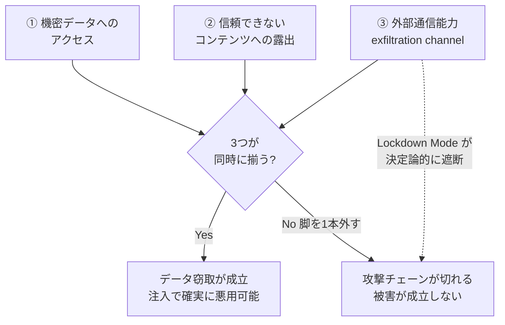
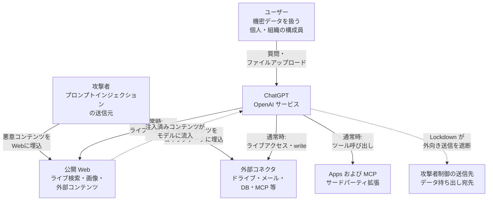
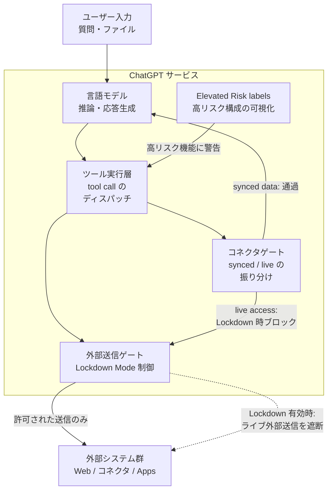
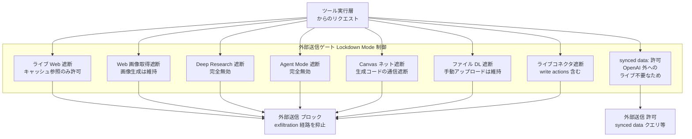
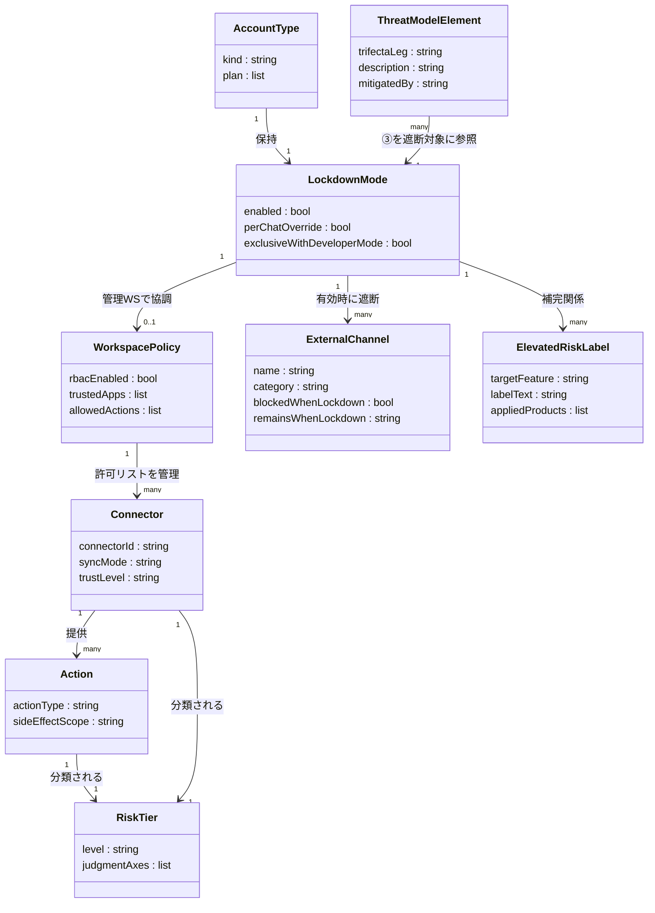

> 検証日: 2026-06-08 / 対象読者: 実装エンジニア・SRE・LLMOps・セキュリティ担当
> 中核一次ソースである OpenAI 公式 2 ページ（Help Center 記事 `20001061` と発表ブログ）は調査時点で WebFetch が HTTP 403 を返し逐語取得できませんでした。本稿は Simon Willison が当該ヘルプを引用した投稿（2026-06-05、準一次）と複数の二次メディアの三角測量で公式文言を確定し、逐語未確認の箇所は **[二次情報]** と明示します。Codex による別経路のファクトチェックで両ページが取得でき、本稿の主要クレーム（展開フェーズ・無効化リスト・限界の明言）と一致を確認済みです。MCP 仕様・NVD・OWASP・Meta・Anthropic は本文取得済みの一次です。

## 概要

**Lockdown Mode** は、ChatGPT がプロンプトインジェクション攻撃で機密データを外部へ持ち出される「最終段（data exfiltration）」を断つために、外部送信を伴う機能を**決定論的に無効化**するオプトインのセキュリティ設定です。

### 目的と位置づけ

OpenAI 公式の定義（スニペット経由）です。

> "Lockdown Mode is an optional, advanced security setting designed for a small set of highly security-conscious users—such as executives or security teams at prominent organizations—who require increased protection against advanced threats."

- **オプトインの高度なセキュリティ設定**です（デフォルト OFF）。
- 想定ユーザーは「著名組織の経営層・セキュリティチーム」など、**全員向けではありません**。
- ChatGPT が外部システムとやり取りする経路を**決定論的に（deterministically）制約**します [二次情報: Help Net Security 公式文言引用]。

### 展開フェーズ（二段階）

| フェーズ | 時期 | 対象 |
|---|---|---|
| 初出（Enterprise 系） | 2026-02-13 | ChatGPT Enterprise / Edu / Healthcare / for Teachers |
| 一般展開 | 2026-06-04 ロールアウト開始 | 個人（Free / Go / Plus / Pro）+ self-serve Business |

「2026-06 発表」と単純化すると誤りです。**初出は 2026-02 の Enterprise 系、一般展開が 2026-06** という二段階を押さえます。

### 脅威モデル上の役割

設計の核心は「モデルを賢くして注入を見抜かせる」ことではなく、「たとえ注入が成功しても**送る先を物理的に減らす**」ことにあります。

Simon Willison の **lethal trifecta** 理論によれば、以下の 3 要素が同時に揃ったとき、プロンプトインジェクションによるデータ窃取が成立します。



| 要素名 | 説明 |
|---|---|
| ① 機密データへのアクセス | inbox / DB / source code など公開すべきでない情報を読める状態 |
| ② 信頼できないコンテンツへの露出 | 攻撃者が制御するテキストや画像が LLM に届く状態 |
| ③ 外部通信能力 | データを外部に送り出せる状態（exfiltration channel） |
| データ窃取が成立 | 3 要素が揃うとプロンプトインジェクションで確実に悪用される |
| 攻撃チェーンが切れる | どれか 1 本の脚を外せば被害が成立しない |

① と ② はエージェントの価値そのもので外しにくく、製品設計上いちばん外しやすいのが ③ の exfiltration channel です。**Lockdown Mode はこの ③ を製品 UI の前面に出した実装**に相当します。OpenAI 自身も「注入がコンテキストに入ること自体は防がない。最終段の exfiltration の起きやすさを下げる」と限界を公式に明言しています。

### 位置づけの要約（条件付きで有効な緩和）

Lockdown Mode は **mitigation（緩和）であって fix（根本解決）ではありません**。次の条件を満たす高リスク層向けに「攻撃チェーンの最終段を決定論的に断つ」実装として機能します。

- 機密データを ChatGPT で扱う
- 標的型攻撃・高度な攻撃者を想定する
- 主力機能（Agent Mode / Deep Research / ライブ検索）の犠牲を受容できる

## 特徴

### 1. 外部送信経路の決定論的な無効化

Lockdown Mode 有効時に無効化される機能です（公式無効化リスト + 具体化は [二次情報: CyberSecurityNews / The Decoder / TechCrunch]）。

| 経路 / 機能 | 有効時 | 通常時 |
|---|---|---|
| Live web browsing | ライブ Web アクセス無効。**キャッシュ済みのみ**参照（古い / 取得不可あり） | リアルタイム閲覧・検索 |
| Web 画像の取得・表示 | 外部画像の取得・表示を無効化。**画像生成は維持** | 取得・表示可 |
| Deep Research（shopping research 含む） | **完全無効** | 利用可 |
| Agent Mode | **完全無効** | 利用可 |
| Canvas networking | 生成コードのネットワークアクセスを遮断 | 承認すれば可 |
| File downloads | 外部ファイルの自動取得を停止。**手動アップロードは維持** | 自動取得可 |
| Live connectors | ライブアクセス・write actions をブロック | 利用可 |

**影響を受けないもの**（独立設定）は、memory / 手動ファイルアップロード / 会話共有 / 学習設定です [二次情報: CyberSecurityNews]。

### 2. Connector / Apps / MCP の扱い（アカウント種別で分岐）

Lockdown Mode は「全外部経路を一律 OFF」ではなく、アカウント種別によって挙動が異なります。

**個人アカウント / self-serve Business**

- synced data を使うコネクタ → **許可**（データが既に OpenAI 側に同期済みで、OpenAI 外へライブリクエストを出さないため低リスク [二次情報: openai.com スニペット]）
- ライブコネクタアクセス → **ブロック**
- コネクタの write actions → **ブロック**
- Finances in ChatGPT・shopping-agent → **利用不可** [二次情報: help.openai.com スニペット]

**管理ワークスペース（Enterprise / Edu / Business 管理対象）**

- Apps / MCP / connectors は**ワークスペース設定 + RBAC** で制御される
- **Lockdown Mode は全 App を自動では無効化しない**
- 管理者が「Lockdown 利用メンバーに必要な、信頼できる App とアクションのみ」を許可する運用が前提 [二次情報: help.openai.com スニペット / CyberSecurityNews]

### 3. リスク 3 階層（副作用ベースの権限分類）

OpenAI はコネクタ / アクションを「接続先の信頼度 × アクション種別（read/write）× 副作用の可視範囲」の三軸で分類しています [二次情報: CyberSecurityNews / openai.com スニペット]。

| 階層 | 内容 |
|---|---|
| **High risk** | untrusted app の read/write、または trusted app でも「広い / 不確かな可視範囲」を持つ write（明示的に非推奨） |
| **Medium risk** | sync connector、trusted app の read（機微ソースデータを露出しうる） |
| **Lower risk** | trusted app の write で、**副作用が trusted parties にのみ可視と確認できた場合に限り**許容 |

> この 3 階層の粒度は [二次情報: CyberSecurityNews] の報告に基づきます。OpenAI 公式ヘルプ本文（403 で逐語未取得）では High risk と「use with caution」の 2 段構成として説明される可能性があり、ここでの "Lower risk" は「trusted write のうち可視範囲が限定されると確認できた狭い条件」を指します（write が一般に read より低リスクという意味ではありません）。

「**接続先ではなく副作用から線を引く**」点がこの分類の要点です。

### 4. Elevated Risk labels との補完関係

同時発表の姉妹機能 **Elevated Risk labels** と組み合わせて二層構造を形成します。

| レイヤ | 機能 | 適用範囲 |
|---|---|---|
| **Lockdown Mode**（遮断レイヤ） | 高リスク機能を決定論的に無効化 | ChatGPT（Settings > Security） |
| **Elevated Risk labels**（可視化レイヤ） | 高リスク機能に一貫した警告ラベルを表示 | ChatGPT / ChatGPT Atlas / Codex |

Elevated Risk labels は将来「セキュリティ上十分に緩和された」と判断された時点で label を除去する設計で、リスクの動的な評価と開示を担います [二次情報: Help Net Security 公式引用]。

### 5. 明言された限界

OpenAI は公式に完全防御を否定しています。

> "Lockdown Mode is designed to substantially reduce the risk of prompt injection-based data exfiltration ... but it does not guarantee data exfiltration cannot happen. Risk may remain through enabled Apps, unforeseen combinations of capabilities, or newly discovered techniques."

残存リスク経路は以下のとおりです。

- 有効化済みの Apps（特に管理ワークスペースで管理者が許可したもの）
- 能力の予期しない組み合わせ
- 新規発見手法
- キャッシュ済み Web コンテンツやアップロードファイル中の注入（挙動・正確性に影響しうる）

### 6. 他社の同等機能との比較

| 観点 | OpenAI ChatGPT（Lockdown Mode） | Anthropic Claude（connectors / MCP） | Google Gemini Enterprise | Microsoft Copilot（Studio + Purview） |
|---|---|---|---|---|
| **防御の力点** | 外部送信経路の決定論的遮断（③ を製品 UI で前面化） | モデル訓練による注入耐性強化を前面に、経路ガードを裏で併用 | エージェント Identity による IAM 直割当と境界制御 [二次情報] | リアルタイム DLP + データグループ別接続制御 |
| **外部送信制御** | live connector / file DL / web を一律遮断。synced data は低リスクとして許可 | プライベートネットワーク接続は Anthropic IP allowlist 要。tool ごと承認 | VPC Service Controls / data residency / CMEK [二次情報] | HTTP ブロック + endpoint filtering。異 data group 間共有を禁止 |
| **適用範囲** | ChatGPT 全プラン（2026-06 より個人含む）。アカウント全体に適用、チャット単位解除も可 | per-tool 承認 + delegated per-user OAuth | エージェント単位の SPIFFE Agent Identity [二次情報] | コネクタの data group（Business / Non-business / Blocked）単位 |
| **human-in-the-loop** | 機能を丸ごと無効化（粒度は粗い） | tool ごとに承認。Web Search は毎回必須。bypass mode で無効化可 | Agent Identity Auth Manager で user-delegated [二次情報] | Unified audit log への prompt / response + sensitivity label 記録 |

> 各社プラン差・更新で変わりえます。否定的断定は実装前に各社一次ドキュメントで再確認してください。

## 構造

> 注記: OpenAI は ChatGPT の内部アーキテクチャを公開していません。以下の C4 図は公開された機能仕様（無効化リスト・synced/live の区別・脅威モデル）から起こした**論理推論図**であり、実装上の実在ユニットを保証するものではありません。コンポーネント図の各遮断ポイントは「1 リクエストが全経路に同時に流れる」のではなく、ツール呼び出しごとに該当経路が選択される **OR 分岐**として読んでください。

### システムコンテキスト図

Lockdown Mode が外向き経路に介在する全体配置を示します。



| 要素名 | 説明 |
|---|---|
| ユーザー | 機密データを扱う個人・組織の構成員。ChatGPT に質問・ファイルを渡す |
| 攻撃者 | プロンプトインジェクションを Web やコネクタデータに埋め込む脅威主体 |
| ChatGPT | OpenAI のサービス本体。Lockdown Mode を内包するセキュリティ設定を持つ |
| 公開 Web | ライブ検索・画像取得・外部コンテンツの発信元。攻撃者の埋込経路にもなる |
| 外部コネクタ | ドライブ・メール・DB・MCP など外部データソース。live / synced の 2 種別が存在する |
| Apps および MCP | サードパーティが提供する拡張機能。ツール呼び出しで外部アクションを起こせる |
| 攻撃者制御の送信先 | 機密データが届くことで exfiltration が完成する攻撃者のサーバ |

### コンテナ図

ChatGPT 内部の構成要素と、Lockdown Mode が制御する位置を示します。



| 要素名 | 説明 |
|---|---|
| 言語モデル | 推論と応答生成を担う。確率的でありセキュリティ境界にはならない |
| ツール実行層 | モデルが要求する tool call を受け取り、各ゲートにディスパッチする |
| コネクタゲート | synced data（OpenAI 側に同期済み）と live access（リアルタイム外部通信）を振り分ける |
| 外部送信ゲート | Lockdown Mode が制御する外部送信の最終関門。ライブリクエストを決定論的にブロックする |
| Elevated Risk labels | 高リスク構成の機能に警告ラベルを付与する可視化レイヤ。遮断レイヤを補完する |

### コンポーネント図

外部送信ゲート内の各遮断ポイントと許可経路を示します。Lockdown Mode 有効時の挙動を表現します。



| 要素名 | 説明 |
|---|---|
| ライブ Web 遮断 | OpenAI ネットワーク外へのリアルタイム Web リクエストを止める。キャッシュ済みへの参照は残る |
| Web 画像取得遮断 | 外部 URL からの画像取得・表示を無効化する。モデルによる画像生成は維持される |
| Deep Research 遮断 | 複数ステップの Web 調査機能と shopping research を完全に無効化する |
| Agent Mode 遮断 | エージェントが自律的に外部アクションを連鎖実行する機能を完全に無効化する |
| Canvas ネット遮断 | Canvas 上で生成したコードのネットワークリクエスト送出をブロックする |
| ファイル DL 遮断 | 分析のための外部ファイル自動取得を止める。手動アップロードは維持される |
| ライブコネクタ遮断 | 外部サービスへのリアルタイム接続と、コネクタ経由の write actions をブロックする |
| synced data: 許可 | OpenAI 側に同期済みのデータへのクエリは通過させる。OpenAI 外へのライブリクエストを発生させないため低リスクと公式が判断している |

## データ

### 概念モデル

```mermaid
graph TD
    subgraph Account["アカウント"]
        PersonalAccount["個人アカウント"]
        ManagedWorkspace["管理ワークスペース"]
        ManagedWorkspace --> RBAC["RBAC"]
    end

    subgraph SecuritySetting["セキュリティ設定"]
        LockdownMode["Lockdown Mode"]
        DeveloperMode["Developer Mode"]
        ElevatedRiskLabel["Elevated Risk Label"]
        LockdownMode -.->|"排他"| DeveloperMode
        LockdownMode --> ElevatedRiskLabel
    end

    PersonalAccount --> LockdownMode
    ManagedWorkspace --> LockdownMode
    RBAC --> LockdownMode

    subgraph Channel["外部送信経路"]
        LiveWeb["Live Web"]
        ImageFetch["Web 画像取得"]
        DeepResearch["Deep Research"]
        AgentMode["Agent Mode"]
        CanvasNetworking["Canvas Networking"]
        FileDownload["File Download"]
        LiveConnector["Live Connector"]
        ConnectorWriteAction["Connector Write Action"]
    end

    LockdownMode -->|"有効時に遮断"| LiveWeb
    LockdownMode -->|"有効時に遮断"| ImageFetch
    LockdownMode -->|"有効時に遮断"| DeepResearch
    LockdownMode -->|"有効時に遮断"| AgentMode
    LockdownMode -->|"有効時に遮断"| CanvasNetworking
    LockdownMode -->|"有効時に遮断"| FileDownload
    LockdownMode -->|"有効時に遮断"| LiveConnector
    LockdownMode -->|"有効時に遮断"| ConnectorWriteAction

    subgraph ConnArea["コネクタ / App / MCP"]
        SyncConnector["Sync Connector"]
        AppMCP["App / MCP"]
        AppMCP --> ReadAction["Read Action"]
        AppMCP --> WriteAction["Write Action"]
        AppMCP --> TrustLevel["信頼度<br/>trusted / untrusted"]
        WriteAction --> SideEffectScope["副作用の可視範囲"]
    end

    LockdownMode -->|"synced data のみ許可"| SyncConnector

    subgraph Risk["リスク階層"]
        HighRisk["High Risk"]
        MediumRisk["Medium Risk"]
        LowerRisk["Lower Risk"]
    end

    TrustLevel --> HighRisk
    SideEffectScope --> HighRisk
    SideEffectScope --> LowerRisk
    ReadAction --> MediumRisk
    WriteAction --> HighRisk
    WriteAction --> LowerRisk
    SyncConnector --> MediumRisk

    subgraph Threat["脅威モデル要素 lethal trifecta"]
        TriA["① 機密データへのアクセス"]
        TriB["② 信頼できない<br/>コンテンツへの露出"]
        TriC["③ 外部通信能力"]
    end

    AgentMode --> TriA
    LiveWeb --> TriB
    LiveConnector --> TriC
    FileDownload --> TriC
    LockdownMode -->|"③ を決定論的に遮断"| TriC
```



| 要素名 | 説明 |
|---|---|
| 個人アカウント / 管理ワークスペース | Lockdown Mode を保持するアカウント種別。後者は RBAC で App を制御する |
| Lockdown Mode / Developer Mode | セキュリティ設定。両者は相互排他 |
| Elevated Risk Label | 高リスク機能の可視化ラベル。Lockdown Mode を補完する |
| 外部送信経路 | Lockdown 有効時に遮断される 8 種の経路・機能 |
| Sync Connector / App / MCP | コネクタと拡張。read/write アクションと信頼度・副作用可視範囲を持つ |
| リスク階層 | 信頼度・アクション種別・副作用可視範囲から決まる High / Medium / Lower |
| 脅威モデル要素 | lethal trifecta の 3 要素。Lockdown は ③ を遮断対象とする |

### 情報モデル



| エンティティ | 説明 |
|---|---|
| LockdownMode | 有効状態・チャット単位上書き・Developer Mode との排他を持つ本体 |
| AccountType | 種別とプラン |
| WorkspacePolicy | 管理ワークスペースの RBAC・信頼 App・許可アクション |
| ExternalChannel | 外部送信経路。Lockdown 有効時の遮断可否と残存挙動を持つ |
| Connector | コネクタ。同期方式と信頼度を持つ |
| Action | read/write の種別と副作用の可視範囲 |
| RiskTier | 階層と判定軸 |
| ElevatedRiskLabel | 対象機能・ラベル文言・適用プロダクト |
| ThreatModelElement | lethal trifecta の脚と緩和手段 |

## 構築方法

### 前提プランと対象クライアント

対応プラン（2026-06 ロールアウト時点）は以下のとおりです。

- **個人**: Free / Go / Plus / Pro
- **法人 self-serve**: ChatGPT Business
- **企業・教育**: ChatGPT Enterprise / Edu / Healthcare / for Teachers（2026-02 初出）

対象クライアントは以下のとおりです。

- ChatGPT Web / デスクトップ / モバイルアプリ（Settings UI とチャット単位トグルが存在）
- ChatGPT Atlas・Codex には **Elevated Risk labels** が横断適用される（Lockdown Mode 本体の Codex ネットワークへの影響は二次情報で「対象外」と報告）
- API（OpenAI Platform）への適用は確認できていない（否定断定は保留）

> 出典: openai.com 公式ブログスニペット、help.openai.com スニペット、Help Net Security (2026-02-16)

### Settings での有効化手順

#### 個人アカウント・ChatGPT Business

1. `Settings → Security` を開く
2. アカウントで利用可能になっている場合、Lockdown Mode のトグルが表示される
3. トグルをオンにして有効化する

詳細な UI 階層として `Settings → Security → Advanced Security → Lockdown Mode` の表記が二次ソースにあります（階層細部は二次情報。一次ヘルプ本文は 403 で直読未確認）。

#### Enterprise / 管理ワークスペース（RBAC 設定前提）

管理ワークスペースでは、Lockdown Mode はワークスペース設定と RBAC を前提に動作します。

- Apps / MCP / connectors はワークスペース設定 + RBAC で制御される
- **Lockdown Mode は管理ワークスペース内の全 App を自動無効化しない**
- 管理者が「Lockdown Mode 利用メンバーに必要な、信頼できる App とアクションのみ」を個別に許可する運用が前提

> "For managed workspaces, apps, MCPs, and connectors are controlled by workspace settings and role-based access controls. Workspace admins should enable only the trusted apps and actions that members using Lockdown Mode need." [二次情報: help.openai.com スニペット]

### チャット単位の一時無効化

Lockdown Mode を有効化した状態でも、特定チャットだけ一時的に解除できます。

- ステータスメッセージ内の **Manage** → **Turn off for this chat** を選択
- または会話オプション（`···`）→ **Lockdown** → **Disabled** を選択
- 再有効化は **Lockdown → Enabled** を選択

### Developer Mode との排他

Lockdown Mode と Developer Mode は**共存できません**（mutually exclusive）。開発用途では Developer Mode を使い、Lockdown Mode は無効になります [二次情報: CyberSecurityNews]。

## 利用方法

以下は OpenAI Lockdown Mode の設計思想（「副作用からの棚卸し」「最小権限」「egress 制御」「human-in-the-loop」）を、自社エージェントシステムで再現する実装パターンです。コード・設定例はいずれも**実装案 / 例**として提示します。

### 「副作用からの棚卸し」手順

#### Step 1: write / 外部送信アクションの列挙

「エージェントが何を接続先にするか」ではなく「何が外部に出るか」を起点に全アクションを列挙します。

- 外部 API への POST / PUT / DELETE（メール送信、Slack 投稿、DB 更新 等）
- ファイルダウンロード（外部 URL からのファイル取得）
- 外部 URL へのデータ送信（webhook、analytics 等）
- コード実行環境のネットワークアクセス

#### Step 2: 三軸による risk tier 付け

| 軸 | 内容 |
|---|---|
| **可視範囲** | 副作用の宛先が trusted parties のみか / 広範・不明か |
| **取り消し可能性** | 送信後に撤回・ロールバックできるか |
| **データ機微度** | 個人情報・機密情報を含むか |

| Tier | 条件 | 対応方針 |
|---|---|---|
| **High** | untrusted app の read / write、または trusted app でも可視範囲が広い write | 原則禁止、または毎回 human-in-the-loop |
| **Medium** | synced connector または trusted app の read（機微ソースデータを露出しうる） | read 監査ログ必須 |
| **Lower** | trusted app の write で、副作用が trusted parties にのみ可視と確認済み | 管理者レビュー / ポリシー承認後に許可。機密 write は HITL も検討（ログは継続） |

#### Step 3: tier に応じた制御レイヤの実装

制御はエージェント（LLM）の外部に置きます。OWASP LLM Top 10 の原則「システムプロンプトはセキュリティ境界にならない（制御は決定論的・監査可能な層で強制せよ）」と、MCP 仕様が tool annotations を信頼済みサーバ由来でない限り untrusted 扱いと定めることから、allowlist・egress proxy・OAuth audience 検証は決定論的なミドルウェアとして実装します。

### token audience 検証（実装案 / 例）

MCP サーバは受け取ったトークンが「自サーバ宛」に発行されたものであることを検証します（MUST）。以下は JWT アクセストークン（`aud` クレームを持つ）前提の例です。opaque token の場合は認可サーバの introspection エンドポイントで audience を確認します（補完元: MCP 仕様 2025-06-18 Authorization 章、RFC 8707 Resource Indicators 準拠）。

```python
# 実装案 / 例 — JWT audience 検証（FastAPI + python-jose）
from jose import jwt, JWTError
from fastapi import HTTPException

MCP_SERVER_RESOURCE_URI = "https://mcp.example.internal/"

def verify_token_audience(token: str) -> dict:
    """MCP 仕様 2025-06-18: サーバは audience が自分宛であることを検証 MUST"""
    try:
        payload = jwt.decode(
            token,
            key=PUBLIC_KEY,
            algorithms=["RS256"],
            audience=MCP_SERVER_RESOURCE_URI,  # RFC 8707 audience 検証
        )
        return payload
    except JWTError as e:
        raise HTTPException(status_code=401, detail=f"Token audience mismatch: {e}")
```

### scope minimization と WWW-Authenticate challenge（実装案 / 例）

最小初期 scope から始め、特権操作が初めて試みられたときに `WWW-Authenticate` で scope 昇格を要求します（補完元: MCP 仕様 2025-06-18 Security Best Practices — Scope Minimization 章）。

```python
# 実装案 / 例 — FastAPI による漸進的 scope 昇格
from fastapi import HTTPException

INITIAL_SCOPE = "mcp:tools-basic"  # 低リスク discovery/read のみ

def require_scope(required_scope: str, current_scopes: list) -> None:
    if required_scope not in current_scopes:
        # MCP 仕様準拠: WWW-Authenticate challenge で漸進的昇格
        # 認証済みだが権限不足は 403 (RFC 6750 / OAuth 2.1: insufficient_scope は 403)
        raise HTTPException(
            status_code=403,
            headers={
                "WWW-Authenticate": (
                    f'Bearer realm="mcp-server",'
                    f' scope="{required_scope}",'
                    f' error="insufficient_scope"'
                )
            },
            detail=f"Scope '{required_scope}' required",
        )

# scope 昇格イベントを correlation ID 付きでログ記録
def log_scope_elevation(user_id, requested, granted, correlation_id):
    logger.info({
        "event": "scope_elevation",
        "user_id": user_id,
        "requested": requested,
        "granted": granted,
        "correlation_id": correlation_id,
    })
```

### egress allowlist / SSRF 対策（実装案 / 例）

MCP 仕様の SSRF 節は「悪意ある MCP サーバが OAuth 関連 URL に内部アドレス（`169.254.169.254` 等）を埋め込み、MCP クライアントに内部リソースをフェッチさせる」クライアント側の脅威を主対象とします。以下は同じ脅威モデルをサーバ側の egress 制御として実装する例です。外部 URL へリクエストを出す前に、プライベート IP レンジとクラウドメタデータ endpoint をブロックします（補完元: MCP 仕様 2025-06-18 Security Best Practices — SSRF 章）。

```python
# 実装案 / 例 — egress 検証（ipaddress 標準ライブラリ使用）
import ipaddress
import socket
from urllib.parse import urlparse
import httpx

EGRESS_ALLOWLIST = ["api.example.com", "webhook.trusted-partner.com"]

def _is_blocked(ip_obj) -> bool:
    """IPv4/IPv6 双方の内部・ループバック・リンクローカル・予約・メタデータを弾く。
    自前のレンジ列挙より ipaddress のプロパティ判定が安全（::1 や IPv4-mapped IPv6 を取りこぼさない）。"""
    if getattr(ip_obj, "ipv4_mapped", None):   # IPv4-mapped IPv6 を展開して再判定
        ip_obj = ip_obj.ipv4_mapped
    return (
        ip_obj.is_private or ip_obj.is_loopback or ip_obj.is_link_local
        or ip_obj.is_reserved or ip_obj.is_multicast
        or ip_obj in ipaddress.ip_network("169.254.0.0/16")  # クラウドメタデータ endpoint
    )

def check_egress_allowed(url: str) -> None:
    """MCP 仕様: IP 検証は自作せず ipaddress のプロパティで判定する"""
    hostname = urlparse(url).hostname
    if hostname not in EGRESS_ALLOWLIST:
        raise ValueError(f"Egress blocked: {hostname} is not in allowlist")
    # DNS 解決後に IP レンジ検証。getaddrinfo で IPv4/IPv6 双方を解決し、全解決アドレスを検証する
    # （gethostbyname は IPv6 を返さず ::1 等の IPv6 ブロックを取りこぼす）。
    for family, _, _, _, sockaddr in socket.getaddrinfo(hostname, None):
        ip_obj = ipaddress.ip_address(sockaddr[0])
        if _is_blocked(ip_obj):
            raise ValueError(f"Egress blocked: {ip_obj} is internal/loopback")

async def safe_external_request(url: str, payload: dict) -> dict:
    check_egress_allowed(url)
    async with httpx.AsyncClient() as client:
        response = await client.post(url, json=payload, timeout=10)
        response.raise_for_status()
        return response.json()
```

> この例は部分的です。`httpx` が接続時に再度 DNS 解決するため、検証と接続の間に DNS rebinding（TOCTOU）の隙が残ります。本番では (1) HTTPS 強制、(2) リダイレクトの検証または無効化、(3) 解決済み IP への直接接続または egress proxy 経由、を併用してください。

### tool 入力の human-in-the-loop 確認（実装案 / 例）

Medium / High risk の tool 呼び出し前に、ユーザー確認を挿入します（補完元: MCP 仕様 2025-06-18 Tools — Security Considerations 章）。

```python
# 実装案 / 例 — risk tier に応じた確認フロー
from enum import Enum

class RiskTier(Enum):
    HIGH = "high"
    MEDIUM = "medium"
    LOWER = "lower"

TOOL_RISK_MAP = {
    "send_email": RiskTier.HIGH,           # 外部送信 + 広い可視範囲
    "post_slack_message": RiskTier.MEDIUM, # trusted app の write（限定範囲）
    "read_database": RiskTier.MEDIUM,      # read（機微ソースデータ露出リスク）
    "list_files": RiskTier.LOWER,          # read-only、副作用なし
}

async def invoke_tool_with_hitl(tool_name, tool_input, approval_callback, audit_logger):
    """MCP 仕様: 機微操作前にユーザーに tool 入力を見せる SHOULD"""
    tier = TOOL_RISK_MAP.get(tool_name, RiskTier.HIGH)
    audit_logger.log_tool_call(tool_name, tool_input)  # 呼び出し前ログ
    if tier == RiskTier.HIGH:
        approved = await approval_callback(
            message=f"[High Risk] ツール '{tool_name}' の実行を承認しますか？",
            input_preview=tool_input,
        )
        if not approved:
            raise PermissionError(f"User denied tool invocation: {tool_name}")
    elif tier == RiskTier.MEDIUM:
        await approval_callback(
            message=f"[Medium Risk] ツール '{tool_name}' を実行します（確認のみ）",
            input_preview=tool_input,
            require_approval=False,
        )
    return await execute_tool(tool_name, tool_input)  # Lower は自動実行
```

### token passthrough の禁止（実装案 / 例）

自分宛に発行されていないトークンを downstream API にそのまま流すことを禁止します（MUST NOT）。これを破ると downstream のログで実際の転送元が別 ID に見え、監査証跡が破壊されます（補完元: MCP 仕様 2025-06-18 Security Best Practices — Token Passthrough 章）。

```python
# 実装案 / 例 — token passthrough を禁止する downstream 呼び出し
import httpx

DOWNSTREAM_API_URL = "https://internal-api.example.com"

async def call_downstream_api(endpoint: str, data: dict, mcp_server_token: str) -> dict:
    """downstream には MCP サーバ自身が取得したトークンを使う。
    クライアントから受け取ったトークンをそのまま転送してはならない。
    MCP 仕様 Authorization: "The MCP server MUST NOT pass through the token it
    received from the MCP client."（受理側の "MUST NOT accept ... other tokens" と対）"""
    async with httpx.AsyncClient() as client:
        resp = await client.post(
            f"{DOWNSTREAM_API_URL}{endpoint}",
            json=data,
            headers={"Authorization": f"Bearer {mcp_server_token}"},
        )
        resp.raise_for_status()
        return resp.json()
```

### ローカル MCP サーバのサンドボックス実行（実装案 / 例）

ローカル実行の MCP サーバはユーザーシステムに直接アクセスできるため、コンテナ等で最小権限実行します（補完元: MCP 仕様 2025-06-18 Security Best Practices — Local MCP Server Compromise 章）。

```yaml
# 実装案 / 例 — Docker による MCP サーバのサンドボックス化（docker-compose.yml 抜粋）
services:
  mcp-server:
    image: my-mcp-server:latest
    networks:
      - mcp-egress          # ネットワーク分離（egress 制限はプロキシ等が別途必要）
    read_only: true         # コンテナの root ファイルシステムを read-only 化
    cap_drop:
      - ALL                 # ケーパビリティを最小化
    security_opt:
      - no-new-privileges:true
    ports:
      - "127.0.0.1:8080:8080"   # MCP クライアントのみ接続可（localhost バインド）
    environment:
      - MCP_EGRESS_ALLOWLIST=api.example.com,webhook.trusted-partner.com
networks:
  mcp-egress:
    driver: bridge
```

> 注意: bridge ネットワーク単体は egress allowlist を強制しません。外部送信を絞るには egress proxy コンテナ（Squid / Smokescreen 等）を経由させる、`internal: true` で外部到達を断つ、または OS / ネットワーク層のポリシーを併用してください。`read_only: true` はコンテナの root fs を保護するもので、アプリが `/tmp` 等へ書く場合は `tmpfs` マウントが必要です。

> 設計原則（OWASP LLM Top 10 2025 / MCP 仕様共通）: システムプロンプトはセキュリティ境界になりません。制御は LLM の外側に置き、決定論的・監査可能なミドルウェアとして実装します。

## 運用

### 監査ログ・可観測性

Lockdown Mode は外部送信経路を決定論的に遮断しますが、「何が起きたか」を後から追跡できる監査基盤を LLM の外側に設けることが OWASP の原則に沿います。

記録すべき項目は以下のとおりです。

- **tool 呼び出し**: どのツール／コネクタを、どの入力で、いつ呼んだか（MCP 仕様 Clients SHOULD: "Log tool usage for audit purposes"）
- **scope 昇格イベント**: 要求 scope、付与された subset、**correlation ID** を紐づける
- **固有 identity への紐付け**: token passthrough を行うと downstream ログで主体が別 ID に化け監査証跡が壊れる（MCP MUST NOT）。Gemini の SPIFFE Agent Identity や `<user_id>:<session_id>` バインドが実例
- **外部送信先と内容**: どの endpoint へ何を送ったか（Lockdown 中もキャッシュ済みコンテンツの参照は残りうるが、ライブの外部 Web リクエストは制限される）
- **prompt / response 本体**: Microsoft Purview は unified audit log に prompt/response とアクセスしたファイル参照・sensitivity label まで記録（一次: learn.microsoft.com）。ChatGPT Enterprise で同等記録が可能かは OpenAI 一次本文未取得のため要確認
- **injection シグナル**: キャッシュ済み Web・アップロードファイル内の疑わしいパターンを検知し、侵入自体を可観測にする

```json
// 監査ログ項目の例（JSON Lines 形式）
{"ts":"2026-06-08T09:36:20Z","correlation_id":"c-8a2f","user_id":"u-4b1e","session_id":"u-4b1e:s-9c3d","actor":"chatgpt-agent","event":"tool_call","tool":"connector.gmail.read","input_hash":"sha256:a3c9","scope_requested":"mail:read","scope_granted":"mail:read","external_endpoint":null,"lockdown_active":true,"outcome":"allowed"}
{"ts":"2026-06-08T09:37:05Z","correlation_id":"c-8a2f","event":"scope_elevation","scope_requested":"mail:write","scope_granted":null,"challenge_method":"WWW-Authenticate","outcome":"denied"}
{"ts":"2026-06-08T09:38:12Z","correlation_id":"c-8a2f","event":"injection_signal","source":"cached_web_content","trigger":"external_url_pattern_detected","content_hash":"sha256:b7f1","lockdown_active":true,"outcome":"blocked_by_lockdown"}
```

**強制レイヤは LLM の外に置く**のが要点です。監査・ガードレール・egress proxy・OAuth audience 検証・DLP はエージェント本体（モデル）の外で決定論的に実行します。プロンプト・ツールアノテーションの自己申告（「read-only です」等）は信頼できるサーバ由来でない限り untrusted 扱いにします（一次: MCP spec MUST）。

### 管理ワークスペースでの継続的な見直し

Lockdown Mode は管理ワークスペースで有効化しても App/MCP/connector を自動で全無効にしません。管理者が「Lockdown 利用メンバーに必要な、信頼できる App とアクションのみ」を許可リストに残す運用が前提です。

1. **棚卸しの起点を「副作用」に置く**: 「このコネクタが外部に何を書き出せるか / 何を読み出して LLM に渡せるか」を列挙する
2. **リスク階層で分類する**: High は原則禁止、Medium は監査ログ必須、Lower は承認済みポリシー下で許可
3. **見直しの頻度**: Elevated Risk labels 付きコネクタ・App を週次でレビューし、新規追加のたびに棚卸し手順を実施する
4. **connector read は Medium risk と認識する**: synced data コネクタは Lockdown 有効でも許可されるが、OpenAI 自身が「機微ソースデータを露出しうる」と記載。機密データを sync source に含めない設計が基本

## ベストプラクティス

### lethal trifecta の脚を断つ設計

理論上、3 本の脚（① 機密データ ② 信頼できないコンテンツ ③ 外部通信）のどれか 1 本を断てば攻撃チェーンが切れます（一次: simonwillison.net 2025-06-16）。ただし Lockdown Mode は ③ を完全消去するものではなく（有効化 App・未知の組み合わせ・キャッシュ経由が残る）、残存経路を前提に多層防御を組みます。

- **Lockdown Mode は ③ を断つ実装**です。製品 UI から最も外しやすい脚を選んでいる点で設計方向は妥当です（Willison も肯定評価）
- **① を断つ設計**（機密データを AI に入れない）が依然として最も確実です
- **Meta Agents Rule of Two**（3 つのうち 2 つまで、3 つ揃えるなら human-in-the-loop を要求）も同じ構図です（一次: ai.meta.com 2025-10-31）

### 機密データを AI に入れない原則

- Lockdown Mode を有効化しても、機密データを ChatGPT に投入する設計は trifecta の ① を外せていない
- 機密文書・個人情報・秘密鍵・認証トークンをプロンプト・ファイルアップロード・sync connector の source に含めない
- 「AI が外に出さなければよい」ではなく「そもそも AI のコンテキストに入れない」が防御の最上流

### Lockdown Mode を ON にしただけで安全と扱わない

- OpenAI 自身が「does not guarantee complete protection」「注入のコンテキスト侵入は防がない」と明言
- 文字単位 exfil（A–Z/0–9 各 1 文字に対応した事前インデックス済み URL 36 本でマッピング送信）は、許可ドメインへの接続が 1 本でも残れば原理的に成立しうる（一次: Embrace The Red）
- 監査・定期レビュー・egress proxy との組み合わせが必要

### 高リスク層への適用を優先する

- Lockdown Mode はデフォルト無効の opt-in 設定
- 優先適用対象: 経営幹部・財務・法務・M&A 担当・標的型攻撃リスクのある職種
- 機能犠牲（Agent Mode・Deep Research・ライブ検索の無効化）を組織として受け入れられるかを先に合意する

### 副作用ベースの権限設計

1. エージェントが起こしうる write / 外部送信アクションを列挙する
2. 各副作用を「可視範囲 × 取り消し可能性 × データ機微度」で risk tier に分類する
3. High は原則禁止または毎回 human-in-the-loop、Medium は read 監査、Lower は承認済みポリシー下で許可
4. すべての write / 送信を固有 identity に紐づけてログする（token passthrough 禁止、MCP MUST NOT）
5. 強制レイヤを LLM の外（egress proxy / OAuth audience 検証 / DLP / 監査ログ）に置く

## トラブルシューティング

| 症状 | 原因 | 対処 |
|---|---|---|
| Deep Research が使えない | 仕様どおり。Lockdown 有効時に完全無効化される | チャット単位の一時無効化で該当チャットのみ Lockdown を外す。または Deep Research 不要のフローに切り替える |
| Agent Mode が実行できない | 同上。完全無効化される | Agent Mode が必要な業務は Lockdown を外し、外部送信を egress proxy + allowlist で別途制御する。高リスク業務には human-in-the-loop を手動で挟む |
| キャッシュ済み Web の結果が古い / 取得不可 | ライブ Web アクセスを遮断し、キャッシュのみ参照するため | タイムクリティカルな情報収集は Lockdown を外すか、手動コピーしてアップロードする |
| Developer Mode と同時に有効化できない | Lockdown Mode と Developer Mode は相互排他 [二次情報: CyberSecurityNews] | 目的に応じてどちらか一方を選択する。セキュリティ優先なら Lockdown を選ぶ |
| 文字単位 exfil の回避経路が残る | 許可ドメインへの接続が 1 本でも残れば低帯域 exfil チャネルが原理的に成立しうる（一次: Embrace The Red）。2026-06-08 時点で Lockdown 有効時の公開 PoC は本調査では未発見だが、ZombieAgent が通常モードで実証した手法と同じ発想 | 許可ドメインリストを最小化する。egress proxy で許可ドメインへの接続も監視・記録する。機密データを AI に渡さない設計（trifecta ① を外す）を組み合わせる |
| connector read 経由で機密データが応答に出る | Lockdown 有効でも synced data コネクタは許可される。OpenAI は Medium risk として「機微ソースデータを露出しうる」と明記 | sync source から機密データを除外する。sync connector のデータ機微度を事前審査し Medium risk 相当に限定する |
| メモリ永続化による継続的 exfil（ZombieAgent 型） | ZombieAgent はメモリを悪用し感染後の対話ごとにサイレント exfil を継続。Lockdown は memory 設定に直接影響しない | Settings でメモリを無効化するか定期的にレビュー・削除する。memory に機密情報が無いか監査する |
| 注入指示がモデル挙動に影響する | 仕様どおりの限界。Lockdown は外部送信を絞るが、キャッシュ Web・アップロードファイルへの注入がコンテキストに入るのは防がない | ファイルアップロード・キャッシュ Web 参照の用途を最小化する。injection シグナルを監査し、応答の異常（unexpected tool call / 外部 URL 参照指示）を検知する |

### 過去の対策回避史からの教訓

OpenAI の exfil 対策は 2023〜2026 にかけて繰り返し研究者に迂回されてきました（The Register は "déjà vu" と評しました）。

- `url_safe`（2023-12 導入。機構名は Rehberger / Embrace The Red の記述に基づく）→ "imperfect fix"、iOS は当時「100% 未緩和」（一次: BleepingComputer）
- BlackHat Europe 2024: Rehberger が初期保護のバイパスを実演（一次: Embrace The Red）
- ShadowLeak（Radware 開示 2025-09-18 / OpenAI fix 2025-09-03）→ 後続 flaw 群が 2025-12-16 に修正
- ZombieAgent（2026-01-08）: 「文字単位の pre-constructed URL」で既存ガードレールを迂回しうることを実証、メモリ永続化で継続 exfil。Radware は「agentic AI プラットフォームの構造的欠陥」と評した（一次: The Register）

教訓は以下のとおりです。

- **allow-list / 接続制限は常に文字単位 exfil の迂回リスクを持つ**。Lockdown も同じ設計思想であり免疫があるとは扱わない
- 「今は公開 PoC がない」はローンチ直後の一時的状態にすぎない
- 「機能で塞ぎきれない」（OpenAI 2025-12: "prompt injection may never be fully solved"）を前提に、「Lockdown が突破されても被害を局所化できる多層防御を持つ」に設計目標を置く

## まとめ

OpenAI Lockdown Mode は、プロンプトインジェクションの最終段である外部送信（exfiltration）を決定論的に絞ることで、lethal trifecta の「③ 外部通信」の脚を製品レベルで断つ緩和策です。完全防御ではなくデフォルト無効の opt-in であるため、高リスク層への適用・機密データを AI に入れない設計・副作用ベースの権限管理・LLM の外側での監査と egress 制御を組み合わせる多層防御が前提になります。

この記事が少しでも参考になった、あるいは改善点などがあれば、ぜひリアクションやコメント、SNS でのシェアをいただけると励みになります！

## 参考リンク

- 一次（本文取得済み）
  - [Simon Willison, The lethal trifecta for AI agents (2025-06-16)](https://simonwillison.net/2025/Jun/16/the-lethal-trifecta/)
  - [Simon Willison, OpenAI Help: Lockdown Mode (2026-06-05)](https://simonwillison.net/2026/Jun/5/openai-help-lockdown-mode/)
  - [Meta AI, Agents Rule of Two / Practical AI Agent Security (2025-10-31)](https://ai.meta.com/blog/practical-ai-agent-security/)
  - [NVD CVE-2025-32711 (EchoLeak, Microsoft 365 Copilot)](https://nvd.nist.gov/vuln/detail/CVE-2025-32711)
  - [OWASP LLM01:2025 Prompt Injection](https://genai.owasp.org/llmrisk/llm01-prompt-injection/)
  - [Anthropic, Mitigating the risk of prompt injections in browser use](https://www.anthropic.com/research/prompt-injection-defenses)
  - [MCP Security Best Practices (2025-06-18)](https://modelcontextprotocol.io/specification/2025-06-18/basic/security_best_practices)
  - [MCP Tools (human-in-the-loop / 監査ログ要件)](https://modelcontextprotocol.io/specification/2025-06-18/server/tools)
  - [MCP Authorization (OAuth 2.1 / Resource Indicators)](https://modelcontextprotocol.io/specification/2025-06-18/basic/authorization)
  - [Embrace The Red, ChatGPT exfiltration mitigations](https://embracethered.com/blog/posts/2026/data-exfiltration-mitigation-paper-by-openai/)
  - [BleepingComputer, OpenAI rolls out imperfect fix for ChatGPT data leak flaw](https://www.bleepingcomputer.com/news/security/openai-rolls-out-imperfect-fix-for-chatgpt-data-leak-flaw/)
  - [The Register (2026-01-08), ZombieAgent](https://www.theregister.com/2026/01/08/openai_chatgpt_prompt_injection)
  - [Microsoft Purview for AI (2026-05-27)](https://learn.microsoft.com/en-us/purview/ai-microsoft-purview)
- 一次（403 で逐語未取得・準一次/二次で代替）
  - [OpenAI, Introducing Lockdown Mode and Elevated Risk labels in ChatGPT](https://openai.com/index/introducing-lockdown-mode-and-elevated-risk-labels-in-chatgpt/)
  - [OpenAI Help Center, Lockdown Mode](https://help.openai.com/en/articles/20001061)
  - [OpenAI Help Center, Elevated Risk labels](https://help.openai.com/en/articles/20001062)
- 二次（公式文言の引用・補完）
  - [TechCrunch (2026-06-06)](https://techcrunch.com/2026/06/06/openai-unveils-lockdown-mode-to-protect-sensitive-data-from-prompt-injection-attacks/)
  - [Help Net Security (2026-02-16)](https://www.helpnetsecurity.com/2026/02/16/chatgpt-lockdown-mode-elevated-risk/)
  - [CyberSecurityNews, ChatGPT Lockdown Mode](https://cybersecuritynews.com/chatgpt-lockdown-mode/)
  - [The Decoder, ChatGPT's new Lockdown Mode](https://the-decoder.com/chatgpts-new-lockdown-mode-lets-you-disable-web-access-and-more-to-protect-sensitive-data-from-prompt-injection/)
  - [Aviatrix / Radware ZombieAgent](https://aviatrix.ai/threat-research-center/chatgpt-2026-zombieagent-memory-prompt-injection/)
