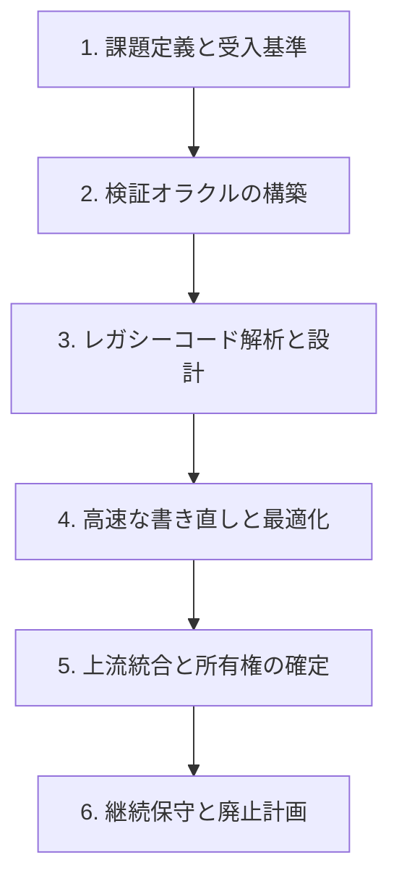

OpenAI が 2026-07-28 に公開したフィールドレポート *"Scientific computing in the age of agentic AI"* は、科学計算分野の 8 つのソフトウェア刷新事例をまとめたものです。読みどころは高速化の数字ではなく、**「エージェントが書けるようになった後に、何が人間側へ残るのか」** を実例で言語化している点にあります。

この記事では、レポートが示した事例を「レガシー刷新プロジェクトの完了条件をどう定義し直すか」という観点で再構成します。想定読者は、モダナイゼーションを発注する側・承認する側の方です。読み終えたときに、次の 2 つが手元に残ることを目指します。

- コード変換が終わっても完了と呼べない理由を、失敗パターンとして説明できる
- 自分のプロジェクトの受入基準に「検証オラクル」と「所有権」を差し込める

## 何が変わったのか: 書く仕事から、正しさを証明する仕事へ

レポートが扱う 8 事例に共通するのは、**書き直しそのものが安くなった**という前提です。C 拡張に依存した Python パッケージのビルド刷新、R パッケージの Rust 移植、GPU ネイティブへの再実装、機械学習ライブラリの JAX 移行といった、従来なら数か月単位の投資判断が必要だった作業が、エージェントとの協働で現実的な工数に収まっています。

| 事例 | 領域 | 刷新の性質 |
|---|---|---|
| cyvcf2 | ゲノム解析 Python ライブラリ | C 拡張依存を含むビルド・パッケージング構成の刷新 |
| HelixForge (BAMSurgeon 系) | 変異シミュレーション | GPU ネイティブ再構築と精度改善 |
| MHCflurry | 免疫情報学の予測モデル | JAX への移行による GPU 加速 |
| hifiasm | ロングリードアセンブラ (C/C++) | ボトルネック最適化と自動検証パイプライン導入 |
| HI.SIM / bayesm-rs / Rustar-aligner / RustQC 群 | R パッケージ・アライナ・QC | Rust 移植、並列化、コミュニティ管理モデルの検証 |

高速化幅として二次報道で 60 倍前後という数字が挙げられていますが、これは事例固有の条件下の値です。自分の案件の期待値として持ち込むと判断を誤ります。ここで再利用できるのは倍率ではなく、**ボトルネックの移動**という構造の方です。

コード生成のコストが下がると、プロジェクトの制約条件は次のように移ります。

- 以前: 書ける人がいない、書く時間がない
- 以後: 書けたものが正しいと誰も証明できない、書けたものを誰も持ち続けない

レポートが人間の役割を「実装者」から「オーケストレーター兼検証者」と言い換えているのは、この移動を指しています。目的の設定、受入基準の定義、最終的な妥当性判断が人間側に残り、解析・変換・最適化がエージェント側へ寄る、という分担です。



図の 3 と 4 がエージェントの実行領域、それ以外が人間の責任領域です。**エージェントに渡せる範囲は、事前に 2 を用意できた分だけ広がります。**

## 受入基準の実体: 検証オラクルの 3 つの型

「検証オラクル」とは、生成されたコードが正しいかどうかを人手の目視ではなく機械的に判定する評価系のことです。レポートの事例では、対象の性質に応じて次の 3 型が使い分けられています。

| 型 | 適する対象 | 合格の判定方法 |
|---|---|---|
| 完全一致テスト | 決定論的アルゴリズム、ファイルフォーマット変換 | 旧実装の出力とビット単位・構造単位で一致するか |
| 統計的同等性検証 | MCMC、確率的シミュレーション、機械学習モデル | 乱数シードや演算順序の差を許容したうえで、平均・分散・分布形状が同等か |
| 合成データによる正解照合 | 物理シミュレーション、複雑な推論パイプライン | 真値が既知の合成データを入力し、理論解を導けるか |

選び方の判断基準はシンプルです。

1. 同じ入力で必ず同じ出力になるなら、完全一致テストを第一候補にする
2. 乱数や並列実行順序で出力が揺れるなら、完全一致は使えないので統計的同等性へ落とす
3. 旧実装の出力自体を正解と見なせない (旧実装にも既知のバグや近似がある) なら、合成データで真値を作る

3 番目は見落とされやすい点です。旧実装との一致だけを基準にすると、**旧実装のバグごと忠実に移植される**ことになります。刷新の目的が精度改善を含む場合は、合成データ側の正解を用意しないと目的を測れません。

業務システムに読み替えるなら、次のような対応になります。

- 帳票・バッチの出力ファイル → 完全一致テスト
- 需要予測・スコアリング・推薦 → 統計的同等性検証
- シミュレーション、料金計算の複合ロジック → 合成データによる正解照合

いずれの型でも、**エージェントに書かせる前に評価系を固定する**順序が重要です。書かせた後に評価系を作ると、生成されたコードの挙動に合わせて基準が緩む方向へ引っ張られます。

## 起きる失敗: 3 つのアンチパターン

レポートは成功事例だけでなく、無批判に導入した場合のリスクも整理しています。ここが発注側にとって最も実務的な部分です。

### 1. 動くが微妙に間違っている (サイレントな結果破損)

検証オラクルが不十分なままリライトさせると、ビルドは通り、テストらしきものも通り、基本動作も正常に見えるのに、浮動小数点演算の精度やアルゴリズムの細部が変質しているという状態が起こります。エラーとして表面化しないため、下流の分析や意思決定へそのまま流れます。

発注側から見た危険性は、**この状態が検収を通過してしまう**ことにあります。「画面が動く」「サンプルデータで一致する」を完了条件に置いていると、検出できません。

### 2. コードの孤児化

エージェントを使えば、誰でも既存ツールの高速版フォークを単独で作れます。結果として、似た再実装がコミュニティや社内に乱立します。問題は作った直後ではなく、半年後に起こります。作った本人にドメイン知識と保守能力がなければ、不具合が出たときに誰も直せません。

外注でモダナイゼーションを実施する場合、この構造がそのまま当てはまります。納品時点では動いていても、**保守できる人間が発注側にも受注側にも残らない**なら、それは資産ではなく負債です。

### 3. 上流コミュニティへのレビュー負荷 (AI PR の洪水)

OSS を対象にする場合、事前交渉なしに大量の最適化 PR を送りつけると、レビュー資源を圧迫してコミュニティの拒絶反応を招きます。差分が巨大で、かつドメイン上の文脈説明を欠いた PR は、メンテナーから見ると検証コストだけが押し付けられた状態になります。

上流に取り込まれなければ、自分たちのフォークを永久に持ち続けることになります。つまりこれは礼儀の問題ではなく、**保守コストの帰属先を決める交渉**です。

## モダナイゼーション完了の 4 条件

以上を踏まえると、レガシー刷新プロジェクトの完了条件は次のように定義し直せます。コード変換の成立は 4 条件のうちの 1 つでしかありません。

```text
[1] コード変換の成立
    新環境 (Rust / GPU / クラウド等) でコードが動作すること

[2] 検証オラクルの合格
    完全一致・統計的同等性・合成データ照合のいずれかをクリアすること

[3] 所有権の確立
    開発終了後の継続保守責任者が指名されていること

[4] 上流統合または廃止計画の策定
    原本リポジトリへのマージ、もしくは旧システムの廃止時期が合意されていること
```

この 4 条件は、契約や検収基準へそのまま差し込める粒度で書いてあります。運用上のポイントは 2 つです。

- **[2] は着手前に定義する。** 完了判定の直前に作ると、生成物に合わせた基準になります
- **[3] と [4] は個人名と日付で書く。** 「保守体制を整備する」という表現は、条件を満たしていないことと同義です

### 明日からの 3 アクション

1. **既存コードのオラクル化を先に済ませる。** エージェントに書かせる前に、現行システムの入出力ペアとテストケースを自動評価パイプラインとして固定します。ここが用意できない領域は、そもそも刷新を任せる準備ができていない領域です
2. **上流・開発元と早期に協議する。** 別実装へ着手する前に、原本の所有者へ「どういう形なら貢献を受け入れられるか」を確認します。受け入れ形式が決まると、差分の切り方と PR の粒度も決まります
3. **別実装を持つなら、所有者と廃止条件を同時に決める。** 上流統合が不可能な場合は、新実装の保守者を割り当て、旧実装をいつ廃止するかを文書化します

## まとめ

- エージェントによってコードの書き直しは安くなったが、**正しさの証明と保守責任は人間側に残った**
- 受入基準の実体は検証オラクルであり、完全一致・統計的同等性・合成データ照合の 3 型を対象の性質で使い分ける
- 検証オラクル不在の刷新は、動いているように見えて結果が壊れる状態を検収通過させる
- 完了条件は「コードが変換されたか」ではなく、変換・検証・所有権・上流統合/廃止計画の 4 条件で判定する
- 所有権と廃止計画は、個人名と日付まで落として初めて条件を満たす

この記事が少しでも参考になった、あるいは改善点などがあれば、ぜひリアクションやコメント、SNSでのシェアをいただけると励みになります！

## 参考リンク

- [OpenAI: Scientific computing in the age of agentic AI](https://openai.com/index/scientific-computing-agentic-ai) (2026-07-28 公開のフィールドレポート。8 事例の一次情報)
- 事例として言及されている対象: cyvcf2、HelixForge (BAMSurgeon の GPU 再実装)、MHCflurry (JAX 移行)、hifiasm、HI.SIM、bayesm-rs、Rustar-aligner、RustQC 群
- 高速化幅などの数値は二次報道 (artificialintelligence-news、daily.dev) 経由の情報を含むため、条件付きで参照する
