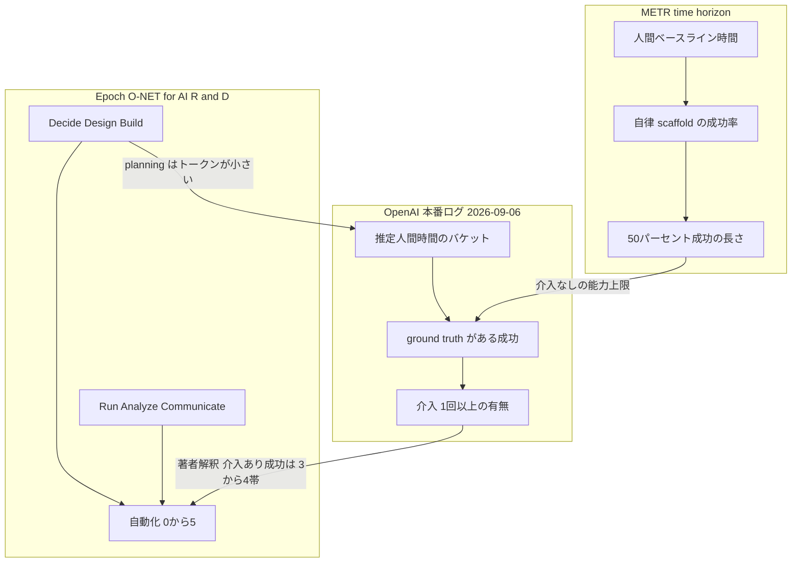

2026-09-06、OpenAI は自社研究組織でのコーディングエージェント利用を公開しました。
自社計測では、2026-09 目標の **automated research intern** に到達したと述べます。
定義は、熟練研究者なら数日かかる well-defined な研究タスクを、**人間の指示の下で**実行できるシステムです。
2028-03 の automated AI researcher は「強い進捗」であり、達成宣言ではありません。

実務上の核は、成功率の上昇ではありません。
直近 6 か月で、成功した 4〜8 時間タスクの半数超に、1 回以上の人の介入があった、という事実です。
成功率だけでは自律性を判断できません。
投稿は RSI 進捗の社内スナップショットであり、一般企業の KPI 標準の証明ではありません。

この記事では、公開本文と独立した計測枠を突き合わせて、次を整理します。

- intern 定義が、介入を失敗にしない理由
- 3.1 agent-workdays が測っている量と、測っていない量
- OpenAI の本番成功が、METR の自律 50% horizon ではない理由
- 発注側が完了率の横に置くべき分母と介入の見方

対象は、長時間エージェントの委譲を測りたい発注側・運用設計の立場です。
一般現場へ同じ数値を移す記事ではありません。

:::message
公開は 2026-09-06、本稿の参照は 2026-09-07 時点です。OpenAI 自身が measurement efforts are still preliminary と書いています。成功率チャートのバケット別パーセントは図にあり、本文には数字がありません。
:::

*この記事の全体像。以下、順に解説します。*

## intern到達は人の指揮下であり、介入は定義上の失敗ではない

投稿は intern を「人間の指示の下」と定義します。
優先順位の設定、アイデアと結果の採否、scale / pause / deploy の判断は人が残す、と本文が書きます。
介入過半は、このマイルストーンと両立します。
介入をゼロにすることが intern 到達の条件ではありません。

2028-03 の researcher は、投稿本文では automated AI researcher です。
ライブストリーム逐語の legitimate は二次です。
2025-10 の目標発表は、投稿が last fall の発表へリンクしています。

人の指揮が残るなら、見るべきは完了率の高さではありません。
**完了の定義と、完了までに人が何をしたか**です。

## 3.1は研究進捗の比ではなく、実行時間の比である

2026-08 中旬、研究組織は人間 1 労働日あたり **3.1 agent-workdays**（8 時間換算）です。
2026-06 以前は、エージェント実行時間が人間労働を下回っていました。
3.1 はエージェント実行時間を 8 時間労働日に換算した比です。
研究進捗の比ではありません。

本文は、個別指標に全体の進捗は追いつかない可能性を明示します。
4 以上の同時エージェントを使う研究者が増えています。
数値はユーザー起動と下流 subagent の daily peaks を含みます。

中央値研究者の推論費は API 価格で **1 日 600 ドル超**です。
90 パーセンタイルはトークンで **1 日 7,000 ドル超**です。
同規模の推論費は、一般の agent-loop では稀です。

同時監督量の粗い代理としては、3.1 と同型の比で足りることが多いです。
runtime 比を成果比と読むと、見出しが歪みます。
Crypto Briefing 等は 3.1 を「人間の 3 倍の研究努力」と見出し化しています。
4〜8 時間の介入過半を落としています。

## 成功率の分母と、介入過半は別の量である

Jan〜Jul の成功率は、複数の難度バケットで概ね上昇しました。
対象は ground truth outcome があるタスクだけです。
成功判定は agentic classifier です。
難度は「人間なら何時間か」の**推定**です。

図注は、outcome uncertain を除外します。
50 sessions 未満、または 50 unique users 未満の点も除外します。
不明除外は成功率を上振れさせえます。
カバレッジは most, but not all です。

直近 6 か月、成功した 4〜8 時間タスクの半数超に 1 回以上の介入がありました。
正確なパーセント、介入の操作定義、介入あたりの人間時間は本文にありません。
投稿自身は significant human steering と書きます。

測る対象が違うと、「4〜8 時間で成功」は同じ数字でも同じ主張になりません。

OpenAI の本番成功は、METR の自律 50% horizon ではありません。
OpenAI が使ったのは Epoch の 6 相へのトークン分類です。
0〜5 の自動化 rubric をセッションに適用したのではありません。

著者解釈として、成功しても介入が残る利用は rubric の 3（Collaborates、close human direction）から 4（Leads、supervise and course-correct）に相当しえます。
5（Autonomous、little or no human involvement）には当たりません。

METR（Kwa, 2026-01-22）は、50% time horizon が独立稼働時間ではないと書きます。
50% 成功は委任安全を意味しません。
介入回数が半減しても、失敗が複雑になり介入あたり労働が増ええます。

## BuildとRunのトークン増を、Decideの自動化と混ぜない

Epoch の 6 相は Decide / Design / Build / Run / Analyze / Communicate です。
2026-01 の主カテゴリは research and infrastructure code です。
technical help と monitoring runs が目立つ増加です。
high-level planning は minimal fraction のままです。

実験トラブルシュートの office hours は出席減です。
一チームは開催を止め、システム改善へ振り替えました。
主要テクニカルサポートチャネルの top-level posts/day も減少しています。
人的チャネルへのシフトは認識していない、と本文は書きます。
office hours 減少は、専任介入部隊の増強ではなく、分散サポート負荷の削減とも読めます。

実験数は 2026-08 が 2025-01 追跡開始以来の最高です。
Codex 採用と相関します。
計算資源も 2025 以降大きく増えた、と本文が明記します。
実験数やコード量は、計算資源の増加と切り離して読めません。

## 一般企業へ同じ数値を移せない

| 前提 | OpenAI 投稿 | 一般の agent-loop |
|---|---|---|
| 対象者 | 研究組織。インフラと PM も含む広い researcher | 職種と熟練が異なる |
| 単価 | 中央値 600 ドル超 / 日（API 価格） | 同規模の推論費は稀 |
| ツール | Codex と社内研究インフラ | 製品と権限が違う |
| 計算 | 2025 以降に大きく増加 | 実験数が同じ意味を持たない |
| 成功定義 | classifier + ground truth があるものだけ | 再現できない |
| 難度 | 推定人間時間 | 校正データが無い |
| 目的 | RSI 進捗の公開 | 事業タスクの完了 |

成否不明を除外した分析です。
タスク難度も推定です。
成功率をそのまま他組織の自律 KPI に使えません。

「一般現場は介入回数、介入時間、待ち時間、同時監督量を必ず併記せよ」は、投稿が証明した標準ではありません。
設計上の候補です。
投稿は介入時間と待ち時間を公開していません。

Anthropic（2026-02-18）は、社内最難タスクの成功率が約 2 倍、セッションあたり介入が 5.4 から 3.3 へ減ったと書いています。
経験者は auto-approve が増える一方、interrupt も増えます。
特定インタラクションの義務化は早い、と明言します。
介入回数の最小化を KPI にしない根拠になります。

## 安全制限は実験数の読みをさらに交絡させる

Hugging Face 事案後、OpenAI は展開予定の最新モデル向け RL を停止しました。
2026-07-20 には研究インフラ侵害を受け、学習用コンテナを一時停止し、制限付きで復旧しています。
2026-08-07 には Astra のサイバー能力に予備的証拠があり、モデル固有の制限を追加しています。

Astra 向け GPU は翌週 59.2% 減です。
他クラスは 17.2% 増で、減少の約 85% を相殺しています。
総配分は大きく変わらず、制限対象外への振替と読めます。
実験増を能力増だけに帰すことは、一次ではできません。

## 発注側が見るべき完了の定義

完了率の高さを先に見ない方がよいです。
完了の定義と、完了までに人が何をしたかを先に置きます。

1. 完了率の分母を書く。不明、タイムアウト、人手引き取りを除外していないか。
2. 長時間バケット（目安 4 時間超）では、成功のうち介入 1 回以上の割合を併記する。深さ（介入時間）が取れるなら取る。取れないなら二値でも、成功率単独よりマシです。
3. 同時監督量は、エージェント実行時間 / 人間労働時間、または同時セッション数で足りることが多いです。投稿の 3.1 と同型です。
4. フェーズを分ける。Build / Run のトークン増を、Decide（何をやるか）の自動化と混ぜない。
5. 介入回数の最小化を KPI にしない。測るのは「介入可能な位置に人がいるか」です。
6. 実験数やコード量は、計算資源の増加と切り離して読まない。

逆転条件は次です。

- 対象タスクが数十分で、失敗コストが低く、人手引き取りが稀なら、介入併記の優先度は下がります。
- 成果物側（PR merge、欠陥流出）だけで監督が閉じ、長時間セッションが無いなら、4〜8 時間バケットは不要です。

未解決のまま残るのは、介入の操作定義、outcome uncertain の割合、4〜8 時間バケットの推定誤差、安い介入と高い介入の内訳です。
これらはアクションを止めません。
確信度を下げます。

## まとめ

OpenAI の intern 到達は、人の指揮下で well-defined な数日タスクを実行できる、という定義です。
成功した 4〜8 時間タスクの半数超に介入が残ることは、その定義と矛盾しません。
3.1 agent-workdays は実行時間の比であり、研究努力の 3 倍ではありません。
成功率は ground truth があるタスクだけを、classifier と推定難度で見た量です。

一般現場へ移すなら、完了率の分母、長時間成功のうち介入ありの割合、同時監督量、Decide が残っているかを分けて取ります。
介入回数の最小化は、Anthropic の経験者データとも噛み合いません。

この記事が少しでも参考になった、あるいは改善点などがあれば、ぜひリアクションやコメント、SNSでのシェアをいただけると励みになります！

## 参考リンク

1. OpenAI, [“Research acceleration: The view inside OpenAI,”](https://openai.com/index/research-acceleration-view-inside-openai/) 2026-09-06.
2. Jakub Pachocki, [“An Alien Mind,”](https://openai.com/index/an-alien-mind/) OpenAI, 2026-09-06.
3. Jean-Stanislas Denain, Joe Kwon, Anson Ho, [“Toward an O*NET for AI R&D,”](https://epoch.ai/gradient-updates/toward-an-onet-for-ai-rnd) Epoch AI, 2026-06-17.
4. METR, [“Measuring AI Ability to Complete Long Software Tasks,”](https://metr.org/blog/2025-03-19-measuring-ai-ability-to-complete-long-tasks) 2025-03-19.
5. Thomas Kwa, [“Clarifying limitations of time horizon,”](https://metr.org/notes/2026-01-22-time-horizon-limitations) METR, 2026-01-22.
6. METR, [“Time Horizon 1.1,”](https://metr.org/blog/2026-1-29-time-horizon-1-1) 2026-01-29.
7. Anthropic, [“Measuring AI agent autonomy in practice,”](https://www.anthropic.com/research/measuring-agent-autonomy) 2026-02-18.
8. Engadget, [“OpenAI says it reached its goal of creating an automated research intern,”](https://www.engadget.com/2251859/openai-says-it-reached-its-goal-of-creating-an-automated-research-intern/) 2026-09-06。2025-10 ライブストリーム逐語の二次。
9. Crypto Briefing, [“OpenAI reveals AI systems now perform 3x the research effort of its human staff,”](https://cryptobriefing.com/openai-ai-systems-3x-research-effort-humans/) 2026-09-06。介入 caveat を落とした見出しの例。
