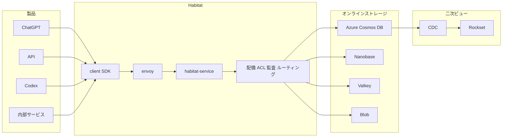

Habitat は OpenAI のオンラインストレージ基盤です。
ログイン、Codex の設定、ChatGPT の新規会話など、製品が応答する前のデータ参照を、スキーマ解決、ルーティング、認可、暗号化、シリアライズ、接続プールとして引き受けます。
この記事では、Habitat が何をするか、共有ライブラリからサービスへ切り出した経緯、自組織で同じ判断をするときに見る順番を整理します。

:::message
一次資料は 2026-09-11 公開の OpenAI Engineering 記事です。規模と効率の数値は OpenAI の自己申告であり、独立測定は確認していません。二部作の Part 2 は、本稿執筆時点（2026-09-12）で公開を確認できていません。
:::

*この記事の全体像。以下、順に解説します。*

## Habitatとは

2024年半ば、Habitat は ChatGPT 本体へ接続する小さな Python ライブラリとして始まりました。
Azure Cosmos DB への操作を、製品エンジニアから隠すことが目的でした。
2025年半ばにスタンドアロンの Python サービスへ切り出し、2026年 Q2 に Rust へ書き換えました。

製品エンジニアは、次を意識しません。

- スキーマ解決
- ルーティング
- 認可
- 暗号化
- リクエスト整形
- 接続プール
- データの所在（Cosmos、キャッシュ、その他）

経路は、クライアント SDK、Envoy、複数の habitat-service プロセス、habitat-envoy、リージョン別 Cosmos アカウントです。
キャッシュ、ACL、配置とデータレジデンシー、暗号化、マルチテナント隔離、レート制限、ルーティングは、プラットフォーム側に集約します。
バックエンドとして、Azure Cosmos DB、Nanobase、Valkey、Blob、CDC、Databricks、Rockset、Kafka を列挙しています。

API は、クライアント定義の object と edge に基づく NoSQL です。
任意 SQL、大きなスキャン、多表 JOIN は出しません。
複雑クエリは CDC でオンライン経路から切り離し、チームごとの Rockset インスタンスへ逃します。
観測対象には、CPU、メモリ、ネットワーク、ディスクに加え、asyncio イベントループのスケジュール遅延を含みます。
接続の fan-in、HTTP/2 多重化、レート制限、サーキットブレーカは Envoy に寄せます。

Habitat は、クライアントとストレージのあいだに、配備、観測、認可、監査の単一制御点を置きます。

時間軸は次のとおりです。年は記事の記述をそのまま使います。

| 時期 | 形態 | 記事が述べる動機 |
|---|---|---|
| 2024年半ば | Python クライアントライブラリ | 製品が DB 管理を考えなくてよい |
| 2025年半ば | Python サービス | 数十サービスへのライブラリ更新が日単位。ロールバックで古いクライアントが戻る |
| 2026年 Q2 | Rust サービス | Python はコア数で社内 2 位。100x では許容できない |

## 注意点

規模と効率の数値は OpenAI の自己申告です。
独立測定は確認していません。
タイトルの「1 billion ChatGPT users」と、本文の「products used by over 1 billion people each week」は、定義が一致しません。

| 数値（記事 2026-09-11 時点） | 記事の言い方 | 扱い |
|---|---|---|
| 70M+ | 毎秒リクエスト | 自己申告。キャッシュ込みか Cosmos 到達かは未記載 |
| 1B+ | タイトルは ChatGPT users。本文は weekly の products | 定義がタイトルと本文で一致しない |
| 500 PB+ | データ量 | 自己申告。内訳未記載 |
| 約 40 | 地理リージョン | 自己申告。Cosmos 公式の固定値ではない |
| 10x | 過去 3 年の年次成長 | 自己申告 |
| 20M+ | Python 期のピーク rps | 自己申告 |
| 95% | Rust が処理する本番リクエスト | 自己申告。Python 廃止は記事時点で coming weeks |
| 6x / 15x | Rust の CPU / メモリ効率 | 測定条件未記載 |

1B の隣接一次は次です。

- 2026-02-27 の OpenAI 資金調達記事は ChatGPT を **900M+ weekly active users** と書く（[Scaling AI for everyone](https://openai.com/index/scaling-ai-for-everyone/)）
- 2026-07-31 の Sarah Friar 記事は **models now reach more than one billion active users** と書く。weekly も ChatGPT 限定も書いていない（[Building abundant intelligence](https://openai.com/index/building-abundant-intelligence/)）
- The Verge 見出しは weekly を足している二次情報です（[The Verge, 2026-07-31](https://www.theverge.com/ai-artificial-intelligence/973791/openai-says-its-models-now-reach-more-than-1-billion-users)）

Rust の 6x / 15x は、Python 期に同じ仕事へ CPU とメモリを大きく使っていた、という読みもできます。
「戦略的な技術的負債」は、事後の正当化になり得ます。

Cosmos の 99.999% 可用性は構成依存です。
Microsoft Learn の構成別 SLA 表（[High Availability in Azure Cosmos DB for NoSQL](https://learn.microsoft.com/en-us/azure/cosmos-db/high-availability)）では、次のとおりです。

- 単一リージョン、AZ なし: 読み書きとも 99.99%
- 単一リージョン、AZ あり: 99.995%
- 複数リージョン、単一書き込み: 読み取り 99.999%、書き込みは AZ なし 99.99% / AZ あり 99.995%
- 複数リージョン書き込み: 読み書きとも 99.999%

「複数リージョンなら読み書きとも 99.999%」ではありません。
Cosmos Python SDK ブログの「Sub-10ms」「99.999%」はベンダーの宣伝文です（[Azure Cosmos DB Blog, 2025-10-20](https://devblogs.microsoft.com/cosmosdb/announcing-latest-azure-cosmos-db-python-sdk-powering-the-future-of-ai-with-openai/)）。

Part 2 は multi-tenancy、読み取り最適化、Cosmos 連携を扱う予定です。
ストレージ本丸の一般化は、Part 2 公開後に更新する必要があります。

## ライブラリ配布で何が起きたか

記事が挙げる直接の失敗は次です。

1. 重要データセットをリージョン分散した Cosmos アカウントへ移すため、クライアントへ routing を追加した
2. feature flag で無効化した状態で全クライアントへ配り、shadowing と bugfix を重ねた
3. 展開は数十サービスにまたがり、各段が日単位だった
4. flag を有効にする直前に、無関係な理由で 1 チームがサービスをロールバックし、古い buggy client が戻った
5. 避けようとしていた障害が起きた

サービス化のあと、配備、観測、プラットフォーム改善は単一点になります。
認可、監査ログ、Cosmos など基盤への直接アクセス制限も、同じサービスに置きます。
記事は、外部、内部、エージェントからの不正アクセス防止を、この chokepoint の役割として書きます。
一方で、単一 chokepoint は「requests fail → product stops」と記事が書く blast radius でもあります。

この失敗は「ライブラリ配布の必然」だけではありません。
最小バージョン強制、サーバ側 routing、設定フラグのみの移行でも説明できます。
Meta は 2026-09-03 に ZippyDB 前面の ZGateway を公開し、移行を percentage knob、region filter、global kill switch の **クライアントコード変更なし** と書きました（[ZGateway](https://engineering.fb.com/2026/09/03/core-infra/zgateway-proxy-zippydb-meta/)）。
ZippyDB クライアントは 100 万ホスト超、数百チームです。
Habitat の対象は dozens of services です。
ライブラリ対サービスの二項対立より、クラスタ変更ロジックをバイナリに焼かない、という切り分けの方が先です。

## なぜPythonのまま切ったか

記事は、Python サービスを性能最適ではないと認めます。
ネットワーク遅延が増え、CPU とメモリのスケールコストが増えます。
100x では書き換えがほぼ確実、と書きます。
当時の目的はコスト最適化ではなく、製品開発の閉塞を解き、プラットフォームを安定させることでした。
コア API とインフラを先に作り、言語は後回しにします。
Codex と GPT が将来の言語移行を後押しする、という賭けも置きました。
記事は Q2 2026 にその賭けが当たったと書きます。
2 人、Codex、GPT-5.5 でサービス全体を Rust 化した、と述べます。

これは OpenAI 固有の条件に依存します。
記事自身が、制約付き NoSQL API のおかげで Python をここまで伸ばせた、と書きます。
任意 SQL を許す共通基盤や、自社コーディングモデルが無い組織へ、同じ順序を一般化しません。

## asyncio遅延と接続プールが示した観測点

GIL のもとで asyncio は I/O の同時実行であり、CPU 並列ではありません。
Habitat はルーティング、圧縮、暗号化、チェックサム、下流ヘルスチェック、shadowing、hedging など CPU 寄りの仕事を持ちます。
下流 Cosmos が速く返しても、応答をパースするコルーチンが再スケジュールされず、p99 が伸びました。
対策は、期待時刻と実際の実行時刻の差でイベントループ遅延を測り、プロセスあたりの同時リクエストを小さくし、ワーカープロセス数を増やすことでした。
Python 公式も、CPU バウンドなコルーチンがループを止める、と述べます（[asyncio 開発](https://docs.python.org/3/library/asyncio-dev.html)）。

初期ローンチでは、Statsig の巨大 JSON を、ジッタなし毎分、全本番ルール込みで、pod あたり最大 8 プロセスが同時パースしました。
公式 Statsig server SDK の rulesets 既定は多くの言語で 10 秒前後であり、記事の 1 分は Habitat 設定です。
修正は、対象を絞った設定、更新間隔の延長、バックグラウンドタスクへのジッタでした。

接続プールでは、過負荷プロセスがバースト後も劣化し続けました。
aiohttp の TCPConnector は（当時）LIFO 再利用が既定で、遅いサーバが返した接続が次に選ばれやすい状態でした。
max reuse duration の上限と FIFO 化でフィードバックを切りました。
Facebook は 2014 年に、TAO の MySQL 接続プールが MRU だったためにリンク不均衡が metastable になった事例を書いており、修正は LRU でした（[Link Imbalance](https://engineering.fb.com/2014/11/14/production-engineering/solving-the-mystery-of-link-imbalance-a-metastable-failure-state-at-scale/)）。
aiohttp 上流は 2024-11-05 に PR [#9672](https://github.com/aio-libs/aiohttp/pull/9672)（merged）で FIFO へ変え、[v3.11.0](https://github.com/aio-libs/aiohttp/releases/tag/v3.11.0)（2024-11-13）に入っています。
Habitat のサービス化は 2025年半ばです。
記事の「defaults to LIFO」は 3.11 未満では正しく、現行の aiohttp 既定としては正しくありません。

プロセス数を増やす副作用は、下流への接続爆発です。
日次デプロイの接続循環、NAT 飽和が起きやすくなります。
Envoy で HTTP/1 を HTTP/2 に上げ、多重化と接続寿命を延ばし、レート制限とサーキットブレーカを集中します。
Envoy のサーキットブレーカ既定は max_connections / max_pending_requests / max_requests = 1024、max_retries = 3 です（[circuit_breaker.proto](https://www.envoyproxy.io/docs/envoy/latest/api-v3/config/cluster/v3/circuit_breaker.proto)）。
max_retries は並列リトライの上限であり、1 リクエストの再試行回数ではありません。
Habitat の実閾値は非公開です。

## なぜHabitatはAPIを少なくするか

Postgres 期は、インデックス付きのよく振る舞うクエリをレビューできました。
チームが増えると、ホットパスの高コストクエリが DB を落とす障害が頻発しました。
2026-01-22 の先行記事は、単一 primary の Azure PostgreSQL と約 50 の read replica で 800M ユーザー、millions of QPS を支え、新規テーブルは sharded 系（Cosmos 等）へ送ると書きます（[Scaling PostgreSQL](https://openai.com/index/scaling-postgresql/)）。
Habitat はその延長で、予測可能な定数仕事のリクエストだけをオンライン経路に残します。

データモデルは Facebook TAO（USENIX ATC '13）に着想した object と edge です。
TAO 論文は「complete set of graph queries」を目標にせず、起点オブジェクトと association type からクエリします（[PDF](https://www.usenix.org/system/files/conference/atc13/atc13-bronson.pdf)）。
Habitat は object とその edge を同一パーティションへ置き、edge の先の object は意図的にコロケートしません。
グラフ走査はリージョンをまたぐ Cosmos アカウントへ飛び得ます。
複雑クエリは CDC → Rockset の二次ビューへ逃します。
Rockset 社は 2024-06-21 に OpenAI が買収しました（[OpenAI acquires Rockset](https://openai.com/index/openai-acquires-rockset/)）。
2026-09 記事の Rockset は社内二次インデックス名です。
公開 SaaS の後継製品名は公式に確認できていません。

Cosmos 本体は SQL-like クエリと JOIN を持ちます。
Habitat が任意 SQL を出さないのは、Cosmos が SQL を持てないからではありません。
クライアントへ露出さない設計です。

## ライブラリ、サービス、設定フラグのどれを選ぶか

共通基盤を多数サービスへ配るとき、処理性能だけでなく、更新の足並み、ロールバック時の互換、認可と監査の置き場を分離判断に含めます。
言語書き換えより先に、責任境界と定数仕事の API を固める、という順序は、Habitat の事例としては一貫しています。
ただし急成長ストレージ一般への処方箋としては、自己申告、Part 2 未公開、代替手段の未試行で確信度は下がります。

| 基準 | 厚いクライアントライブラリ | サーバ / プロキシサービス | 薄い SDK + 制御面（xDS、flag、min-version） |
|---|---|---|---|
| 更新の足並み | 全バイナリの展開が必要。ロールバックで旧版が戻る | 中央配備 | バイナリを変えずに挙動を変えられる |
| 認可と監査 | 各クライアントに散る | 単一点。停止時は全製品が止まる | プロキシまたはサーバで集中しつつ、リージョン分割が可能 |
| 性能 | プロセス内。ホップが少ない | ホップとシリアライズが増える | プロキシはホップ代。ZGateway は約 6% と自己申告 |
| 適用が向きやすい条件 | 呼び出し元が少なく、変更が稀 | 呼び出し元が多く、クラスタ変更が頻繁 | 呼び出し元が多く、クライアントをすぐ変えられない |
| Habitat の位置 | 2024年半ば〜2025年半ば | 2025年半ば以降 | 記事は Istio/Envoy へ接続プールを移したと書く。min-version の成否は未記載 |

支持する一次は次です。

- ロールバックで古いクライアントが戻った障害は、記事の一次記述である
- サービス化後に配備と観測と ACL を単一点にした、という動機は、同じ記事で一貫する
- Postgres 高コストクエリが障害源だった、という先行公式記事と、Habitat の制約付き API は同じ問題意識である
- asyncio 遅延の監視は、Python 公式のイベントループ制約と整合する
- LIFO 接続再利用が遅いサーバへ仕事を寄せる、という機構は、aiohttp 旧既定と Facebook 2014 の MRU 事例と整合する

反証も残ります。

- AWS SDK は 2026 年もクライアントライブラリのままである。retry 既定の変更は 2026-05 に opt-in、2026-11 に default へ段階展開する（[AWS Developer Tools Blog](https://aws.amazon.com/blogs/developer/announcing-updated-retry-behavior-for-aws-sdks-and-tools/)）。公開 SDK の政策変更であり、社内クラスタの sharding ロジック配布と同型ではない
- ZippyDB は厚いクライアントのまま数十億 ops/s 級まで行き、プロキシ追加は接続メッシュとバッチのためである。移行は設定フラグである
- Habitat 自身が、Python サービスは library より遅い、コア数 2 位まで膨らんだ、と書く
- 1B の定義がタイトル、本文、Friar 記事で一致しない
- 単一 chokepoint は blast radius である
- ストレージ本丸は Cosmos 連携と multi-tenancy であり、Part 2 は未公開である
- aiohttp LIFO は 2024-11 に上流修正済みである

未解決の問いは次です。

- Part 2 の中身。70M rps と 500 PB の内訳
- Nanobase の役割。Cosmos からの移行なのか併設なのか
- Habitat が Cosmos キーをどう隠しているか（キー、Entra、ワークロード ID）
- min-version やサーバ側 routing を試したかどうか
- Python 期のコア時間コストと、早く Rust を始めた場合の機会費用
- Rockset 内部フォークの実体
- 95% 移行後の Python 廃止が記事どおり数週間で終わるか

自組織の「ライブラリをサービスにするか」は、これだけでブロックしません。
確信度を下げる材料です。
エッジケース（呼び出し元が数十で、クラスタロジックをクライアントに焼いている）にだけ強く効きます。

## 自組織で見る順番

共通基盤の分離を決めるときは、次をこの順で見ます。

1. クラスタ変更ロジック（sharding、リージョン、プロトコル）をクライアントバイナリに焼いていないか
2. 古いクライアントの接続を拒否できるか。ロールバックが旧プロトコルを復活させないか
3. 認可と監査を、停止時の blast radius とセットで置く場所を決める。単一点にするならテナント隔離とキルスイッチを同時に設計する
4. オンライン経路の API を定数仕事に閉じ、分析クエリを二次経路へ逃がす
5. 言語と性能は、API と配備面が安定してからでよい。ただし Python サービス化のコアコスト上限を先に決める
6. 依存の応答時間だけでなく、自プロセスのスケジューラ待ち（asyncio delay など）を測る

逆転条件は次です。

- 呼び出し元が少なく、原子デプロイできる
- 変更が設定フラグと min-version だけで足りる
- ホップ増加が SLO を割る（超低遅延のプロセス内キャッシュなど）

直近の次のアクションは次です。

1. 自組織の共有ライブラリで、プロトコル変更が全バイナリ展開を要する箇所を列挙する
2. ロールバックで旧クライアントが戻ったときの互換テストを、分離判断の入口条件にする
3. Habitat Part 2 の公開を待ち、Cosmos と multi-tenancy を読んでから「ストレージ基盤」としての一般化を更新する

## まとめ

Habitat は、製品と Cosmos 等のあいだに、配備、観測、認可、監査の単一制御点を置くオンラインストレージ基盤です。
共有ライブラリでは、数十サービスへの更新が日単位になり、ロールバックで古いクライアントが戻って障害が起きました。
サービス化のあと、クラスタ変更と ACL は中央に集まります。
一方で単一点は blast radius でもあり、設定フラグと min-version でも説明できる失敗です。
言語書き換えより先に、責任境界と定数仕事の API を固める順序は、Habitat の事例としては一貫します。
急成長ストレージ一般への処方箋としては、自己申告と Part 2 未公開で確信度を下げて読んでください。

この記事が少しでも参考になった、あるいは改善点などがあれば、ぜひリアクションやコメント、SNSでのシェアをいただけると励みになります！

## 参考リンク

1. Jon Lee, Chaomin Yu, Ben Ries, “Rapidly scaling online storage to serve over 1 billion ChatGPT users,” OpenAI, 2026-09-11. https://openai.com/index/scaling-storage-one-billion-users-part-one/
2. Bohan Zhang, “Scaling PostgreSQL to power 800 million ChatGPT users,” OpenAI, 2026-01-22. https://openai.com/index/scaling-postgresql/
3. OpenAI, “Scaling AI for everyone,” 2026-02-27. https://openai.com/index/scaling-ai-for-everyone/
4. Sarah Friar, “Building abundant intelligence,” OpenAI, 2026-07-31. https://openai.com/index/building-abundant-intelligence/
5. OpenAI, “OpenAI acquires Rockset,” 2024-06-21. https://openai.com/index/openai-acquires-rockset/
6. Nathan Bronson et al., “TAO: Facebook’s Distributed Data Store for the Social Graph,” USENIX ATC ’13. https://www.usenix.org/system/files/conference/atc13/atc13-bronson.pdf
7. Nathan Bronson, “Solving the Mystery of Link Imbalance: A Metastable Failure State at Scale,” Engineering at Meta, 2014-11-14. https://engineering.fb.com/2014/11/14/production-engineering/solving-the-mystery-of-link-imbalance-a-metastable-failure-state-at-scale/
8. Rittik Banik, Yunhao Cao, “ZGateway: Learnings from Putting a Proxy in Front of ZippyDB,” Engineering at Meta, 2026-09-03. https://engineering.fb.com/2026/09/03/core-infra/zgateway-proxy-zippydb-meta/
9. Microsoft Learn, “High Availability (Reliability) in Azure Cosmos DB for NoSQL.” https://learn.microsoft.com/en-us/azure/cosmos-db/high-availability
10. aio-libs/aiohttp#9672, “Reuse the oldest keep-alive connection first,” merged 2024-11-05. https://github.com/aio-libs/aiohttp/pull/9672
11. aiohttp v3.11.0 release notes, 2024-11-13. https://github.com/aio-libs/aiohttp/releases/tag/v3.11.0
12. Envoy, Circuit breakers proto. https://www.envoyproxy.io/docs/envoy/latest/api-v3/config/cluster/v3/circuit_breaker.proto
13. AWS, “Announcing updated retry behavior for AWS SDKs and Tools,” 2026-05-20. https://aws.amazon.com/blogs/developer/announcing-updated-retry-behavior-for-aws-sdks-and-tools/
14. Python docs, “Develop with asyncio.” https://docs.python.org/3/library/asyncio-dev.html
