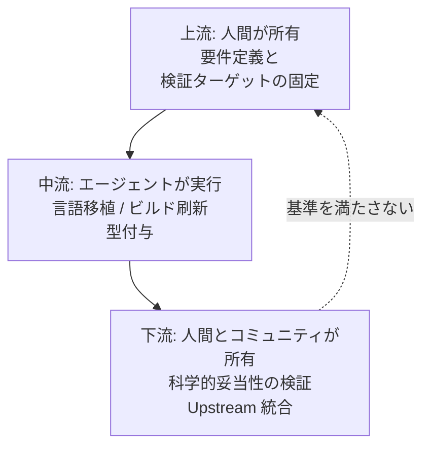

OpenAI が 2026 年 7 月 28 日に公表したフィールドレポート *"Scientific computing in the age of agentic AI"* は、8 件の科学計算プロジェクトに AI コーディングエージェントを適用した実践記録です。

この記事では、そのレポートから「AI にコードを書かせる組織が、何を手放してよくて、何を手放してはいけないか」を整理します。対象読者は、AI 駆動開発の導入可否や評価軸を決める立場の方です。読み終えると、次の 2 つを自分のプロジェクトへ持ち帰れます。

- エージェントに実装を任せる**前**に固めるべき受け入れ基準の作り方
- 生成物を「独立フォーク」にするか「Upstream 統合」にするかの判断軸

## レポートの核心: 速くなったのは中流だけ

レポートが繰り返し述べているのは、AI エージェントが加速するのは開発工程の**中流**だけだという点です。上流(要件と検証基準の定義)と下流(科学的妥当性の確認と長期保守)は、依然として人間が所有します。



上流の出力は「プロンプト」ではなく「制約条件」です。下流の出力は「マージされたコード」ではなく「誰が今後 CI と依存更新を見るかの合意」です。この 2 つが空白のまま中流だけを速くすると、レビューできない生成物が積み上がります。

## なぜ科学ソフトウェアが題材になるのか

科学ソフトウェアの多くは、論文を書くための最小限のコード(レポートの言う "Paper-Adjacent Code")として生まれます。結果として次の状態になりやすいと指摘されています。

- 老朽化した C/C++ バインディングと切れた依存関係
- テストが存在しないスクリプト群
- 論文が採択された時点でメンテナが離脱する

つまり "over-engineered" ではなく **"under-engineered"** な技術的負債です。仕様書がなく、正解を知っているのは既存コードの出力だけ、という状況が典型になります。

この構図は科学分野に固有ではありません。社内の集計バッチ、退職者が書いた変換スクリプト、ドキュメントのない基幹連携ジョブは同じ性質を持ちます。だからこのレポートは、科学計算に関わっていない読者にも読み替えが効きます。

## 実装前に固める「モデル外部の受け入れ基準」

レポートが成功条件として挙げるのが、Validation Target(受け入れ基準)を**モデルの外側**に置くことです。ポイントは 2 つあります。

1. 基準を**実装より先に**テストコードとして固定する
2. 基準の判定を AI ではなく、決定的に実行できる仕組みに任せる

具体的な 3 つの型が示されています。

### 1. 参照実装との出力完全一致

既存コード(遅いが検証済み)の入出力対に対して、ビットレベルまたは指定精度内での一致を確認する回帰テストを作ります。仕様書がない移植では、これが唯一の実質的な仕様になります。

```python
import numpy as np
import pytest

CASES = load_recorded_io_pairs("fixtures/legacy_io.jsonl")  # 旧実装で採取済み

@pytest.mark.parametrize("case", CASES, ids=lambda c: c["id"])
def test_matches_legacy_output(case):
    actual = new_impl.run(**case["input"])
    np.testing.assert_allclose(actual, case["expected"], rtol=1e-12, atol=0.0)
```

許容誤差(`rtol` / `atol`)を先に決めておくのが要点です。ここを後から緩めると、基準がモデルの出力に合わせて動いてしまい、検証として機能しなくなります。

### 2. 統計的不変量の検証

乱数を使うシミュレーションや確率的アルゴリズムでは、出力の完全一致を要求できません。代わりに、平均・分散・分布形状といった**不変量**をアサーションにします。

```python
def test_sampler_invariants():
    samples = new_impl.sample(n=200_000, seed=42)
    assert abs(samples.mean() - 0.0) < 0.01
    assert abs(samples.std() - 1.0) < 0.01
```

シードを固定しても実装が変われば値は一致しません。「何が変わってよくて、何が変わってはいけないか」を先に言語化する作業が、そのまま仕様の再発見になります。

### 3. 既知解とエッジケースの登録

過去に発生したバグ、境界値、論文に記載された実験データを、固定のテストケースとして登録します。これは AI 特有の対策ではありませんが、エージェントが大胆にリファクタリングする前提では効果が大きくなります。

### 基準が曖昧なときに起きること

レポートが警告するのは、受け入れ基準が曖昧な場合に AI が「一見動くが、致命的なサイレントエラーを含むコード」を大量に生成することです。ここが従来の外注や新人教育と決定的に違う点です。人間の書き手は、自信がなければ質問するか手を止めます。エージェントは止まりません。生成量が多いほど、レビューだけで品質を担保する運用は破綻します。

## 独立フォークか、Upstream 統合か

再実装のコストが下がると、既存プロジェクトへ働きかけるより自分でフォークする方が速く見えます。レポートはこれを「安価な再実装(Cheap Rewrites)」による分断リスクとして警戒し、Upstream 統合を原則としています。放置されたフォークは "tomorrow's abandoned code" になるためです。

判断軸は次のとおりです。

| 評価軸 | Upstream 統合(原則) | 独立フォーク / 新リポジトリ(例外) |
|---|---|---|
| Upstream メンテナ | アクティブに存在しコミュニティがある | 完全離脱・応答なし(Abandoned) |
| 変更の範囲 | ビルド刷新・性能改善・リファクタリング | アーキテクチャの根本変更・互換性の破壊 |
| 長期保守の所有者 | 既存コミュニティが継続 | 新しい開発者が Steward を宣言 |
| エコシステムへの影響 | 利用者と依存関係が集約される | パッケージが分断し依存が混乱する |

重要なのは、フォークを選ぶ条件が「技術的にその方が良いから」ではなく、**「長期保守の所有者を宣言できるから」**になっている点です。宣言できないなら、フォークではなく Upstream への PR を選びます。

### 8 事例のうち代表的な 3 件

レポートで扱われた 8 プロジェクトから、この判断軸が現れている 3 件を挙げます。

| プロジェクト | 課題 | エージェントの適用 | 帰結 |
|---|---|---|---|
| `cyvcf2`(ゲノム変異データ処理) | 老朽化した C 拡張のビルド・パッケージング | `pyproject.toml` と `cibuildwheel` による現代的パッケージングへ移行 | 既存メンテナと協働し Upstream へ統合 |
| `MHCflurry`(ペプチド-MHC 結合予測) | 古い依存関係と型情報の欠如 | 大規模な型注釈追加と依存の最新化 | オリジナルメンテナのレビューを経て Upstream へ統合 |
| `rustar-aligner`(RNA-seq アライナー) | 元の STAR aligner がメンテナ離脱状態 | アルゴリズム全体の Rust 移植と性能最適化 | マージ先がないため、コミュニティ管理の新リポジトリとして独立運営 |

前 2 件は「メンテナがいる」から Upstream 統合、3 件目は「いない」から独立運営です。技術的な難易度ではなく、保守の受け皿の有無で分岐しています。

## ボトルネックはどこへ移動するか

以上を踏まえると、AI 駆動開発の導入によってボトルネックは次のように移動します。


1. **実装の律速は解消される** — コード記述時間は大きく縮む
2. **上流の重要度が上がる** — 受け入れ基準が曖昧だと、サイレントエラーを含む生成物が増える
3. **下流の帰属が生死を分ける** — CI・依存更新・セキュリティパッチを誰が所有するかが、プロジェクトの存続を決める

したがって、AI 導入の評価軸を「コード生成スピード」に置くのは筋が悪くなります。見るべきは次の 2 つです。

- **モデル外部での自動検証系の整備率** — 受け入れ基準がテストとして固定されている領域の割合
- **長期保守責任の設計** — 生成物ごとに Steward が宣言されているか

前者が低いまま生成量だけ増やすと、レビュー待ち行列が伸びます。後者が空白のまま増やすと、動いているが誰も直せない資産が積み上がります。

## 自分のプロジェクトへの読み替え

レポートは科学計算が題材ですが、次の 3 点はそのまま一般のソフトウェア開発に適用できます。

1. **仕様書がないコードの移植では、旧実装の入出力が仕様** — 移植の着手より先に、入出力対の採取と回帰テスト化を済ませる
2. **許容誤差と不変量を先に決める** — 後から基準を緩める運用は、検証ではなく追認になる
3. **保守の受け皿がないならフォークしない** — 「誰が Steward か」を答えられないリポジトリは増やさない

なお、レポートは特定の指標(例: 加速倍率)を組織横断で保証するものではなく、8 件の事例からの観察です。数値そのものより、上流と下流が人間に残るという構造の方が転用価値があります。

## まとめ

- AI エージェントが加速するのは**中流**(移植・リファクタリング・ビルド刷新)であり、上流と下流は人間に残る
- 実装前に**モデル外部の受け入れ基準**を固定する。型は「出力完全一致」「統計的不変量」「既知解・エッジケース」の 3 つ
- 基準が曖昧だと、一見動くがサイレントエラーを含むコードが大量に生成される
- 生成が安価になるほどフォークの誘惑が増すが、判断軸は技術ではなく**長期保守の所有者を宣言できるか**
- AI 導入の評価軸は生成スピードではなく、**自動検証系の整備率**と**保守責任の設計**に置く

この記事が少しでも参考になった、あるいは改善点などがあれば、ぜひリアクションやコメント、SNSでのシェアをいただけると励みになります！

## 参考リンク

- OpenAI Field Report: *"Scientific computing in the age of agentic AI"*(2026-07-28) — https://openai.com/index/scientific-computing-agentic-ai/
- 事例リポジトリ: `cyvcf2` / `MHCflurry` / `rustar-aligner`
