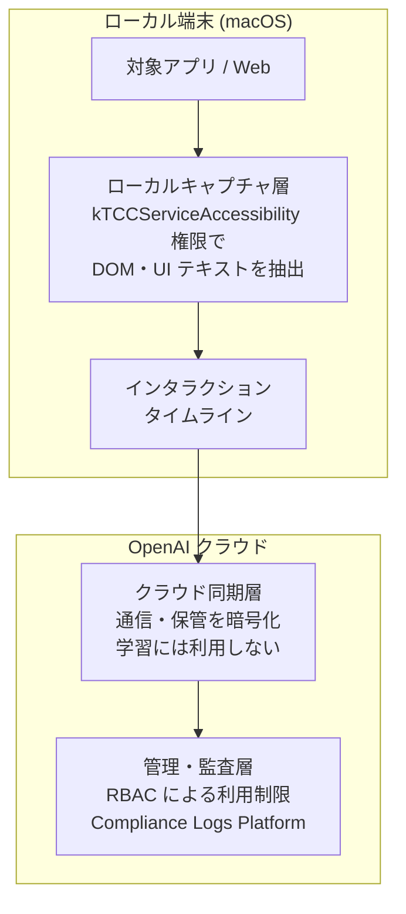

AI に仕事を頼むとき、私たちは「今どういう状況か」を毎回説明してきました。プロンプトに背景を書き、ファイルを添付し、スクリーンショットを貼る。文脈を**渡す**作業です。

2026 年 8 月 13 日に OpenAI が macOS 版 ChatGPT アプリへ導入した **Computer History** は、この前提をひっくり返します。アプリや Web の操作イベントをアプリ側が記録し、AI が直近の行動履歴を自動的に参照する。文脈は渡すものではなく、**すでにそこにあるもの**になります。

便利さの方向は分かりやすい一方で、企業で有効化する側にとっては論点が一気に増えます。この記事では、機能の中身、構成要素の責任分担、指摘されている懸念、そして導入判断で何を決める必要があるかを整理します。

*この記事の全体像。以下、順に解説します。*

## Computer History は何を記録するのか

まず押さえるべきは、記録されるのが**画面そのものではない**という点です。

| 記録するもの | 記録しないもの |
|---|---|
| クリック、タイピング、アプリ切り替えなどの UI インタラクションイベント | 画面のスクリーンショット |
| アクセシビリティ API 経由で取得した DOM 構造・UI テキスト | マイク音声 |

macOS のアクセシビリティ API を通じて操作イベントをテキストのログとして抽出し、タイムラインとして保持します。「AI が画面を見ている」のではなく「AI が操作の記録を読んでいる」構造です。

制御面は、有効化のハードルを高く取る設計になっています。

- **デフォルトは無効**。ユーザーが明示的に有効化しない限り動きません。
- **ChatGPT Business / Enterprise では管理者のオプトインが前提**。ワークスペース管理者が Global Admin Console で許可しない限り、メンバー側で利用できません。
- **記録対象は選択式**。対象アプリや Web サイトを任意に指定でき、一時停止と履歴の個別削除が用意されています。プライベートブラウジング等の特定セッションは自動的に除外されます。

つまり「全部を黙って撮る」機能ではなく、**どこを記録対象にするかをユーザーと管理者が決める**機能です。この「決める」部分が、後述するとおり導入設計の本体になります。

## 責任はローカルとクラウドで分かれている

この機能は、クライアントとクラウドの責任共有モデルの上に成り立っています。構成要素は 3 つです。

| 層 | 役割 | 主な制御点 |
|---|---|---|
| ローカルキャプチャ層 | 対象アプリの DOM 構造・UI テキストをリアルタイム抽出し、ローカルのメモリファイルとして保持 | アクセシビリティ権限、記録対象アプリの選択 |
| クラウド同期層 | 整理済みタイムラインを OpenAI クラウドへ送信。SOC 2 準拠で暗号化され、学習利用はされない | 管理者オプトイン |
| 管理・監査層 | Enterprise 管理者が RBAC で利用を制限。クラウド側の操作履歴を JSONL でエクスポート | Compliance Logs Platform |

ここで注目したいのは、**監査でカバーされる範囲がクラウド側に寄っている**ことです。ローカルで何が読み取られたかと、クラウドに何が届いたかは、同じ粒度で見えるわけではありません。

## 「画像を保存しない」でも残る 4 つの懸念

スクリーンショットを保存しない設計はプライバシー上の前進です。それでもセキュリティ専門家や企業の IT 管理者からは、次の懸念が提起されています。

### 1. テキストだからこそ危ない「フレンドリー・キーロガー」

アクセシビリティツリーから抽出されるテキストには、画面に表示された値がそのまま含まれ得ます。

- パスワードマネージャーの入力値
- ターミナルに表示された環境変数（`.env` の中身など）
- チャットツールの機密メッセージ

これがローカルディスク上に平文で一時保存されるなら、情報窃取型マルウェア（Infostealer）にとっては**一箇所を取れば全部取れる**格好の標的になります。画像がないことは、機密性の観点ではむしろ扱いやすさを意味します。

### 2. 間接的プロンプトインジェクション

Web サイトや外部アプリの UI に仕込まれた悪意あるテキストが、操作イベントとして AI のメモリに取り込まれる経路が生まれます。取り込まれた指示は、後続のコード生成やファイル操作のタイミングで発火し、意図しないデータ送信につながる可能性があります。

ユーザーが「読ませたつもりのない画面」が入力になる、という点が従来のプロンプトインジェクションとの違いです。

### 3. 監査の死角 — SIEM と eDiscovery

Compliance Logs Platform がエクスポートするのは、クラウド側のメタデータや会話ログに限られます。「端末側で具体的にどのローカルファイルや UI 要素が読み取られたか」の生イベントログは、中央 SIEM から追跡できません。

さらに、ユーザーがローカルで履歴を自由に削除できる仕様は、訴訟時の法的ホールド（Legal Hold）と噛み合いません。証拠保全要件を満たせない可能性があります。**利便性のための削除機能が、コンプライアンス上は欠損として効く**構図です。

### 4. MDM 運用との衝突

企業の macOS 運用では、未承認アプリのアクセシビリティ権限を MDM の PPPC（Privacy Preferences Policy Control）プロファイルで明示的に拒否しているケースが多くあります。

本機能は強力なアクセシビリティ権限を必須とするため、ゼロトラストや最小権限の原則と正面から衝突します。しかも「このアプリだけ監視を許す」というアプリ単位の細粒度なホワイトリスト制御は、現在の MDM 仕様では困難です。**許可か拒否かの二択に近い**のが現状です。

## コンテキストエンジニアリングは「限定する設計」になる

ここまでの整理を踏まえると、AI 導入企業が持つべき設計の重心が変わります。

これまでのコンテキストエンジニアリングは、**いかに多くの背景情報を AI に渡すか**の設計でした。プロンプトテンプレート、RAG、ファイル添付。すべて「増やす」方向の工夫です。

Computer History 型の機能が前提になると、主眼は**データフローの限定**へ移ります。渡す情報を増やす工夫ではなく、**どのアプリでの操作を記録対象として許容し、どこを遮断するか**を決める設計です。

具体的には、次のような線引きになります。

| 記録対象にする候補 | 除外を検討する候補 |
|---|---|
| 社内専用 IDE | ターミナル（環境変数・認証情報が露出しやすい） |
| 特定の業務ドキュメントツール | ブラウザ全般（外部由来テキストの混入経路） |
| 対象業務に閉じた社内 Web アプリ | Slack 等のチャットツール（他者の機密が混ざる） |

判断軸は「便利かどうか」ではなく、**そこに他人の機密や外部由来のテキストが混ざるか**です。

### 有効化の前に決めておくこと

機能を有効化する前に、次のデータライフサイクル基準を定義し、MDM や ChatGPT Enterprise の設定で技術的に強制することが前提になります。

1. **対象アプリのホワイトリスト化** — 許可リスト方式にする。デフォルト許可にしない。
2. **一時ファイルの保持期間と自動消去** — 48 時間などの上限を決め、運用に落とす。
3. **法的ホールド要件とのすり合わせ** — コンプライアンス部門と、削除可能性が問題になる範囲を先に合意する。

### ローカル端末の保護は自社の責任

クラウド側で保管時暗号化と学習利用の拒否が担保されていても、**ローカル端末上の平文ログの流出は企業側の責任**です。責任共有モデルである以上、境界のこちら側は自分で守る必要があります。

本機能を有効化する端末には、Infostealer 対策を含む EDR（Endpoint Detection and Response）の導入が実質的な前提条件になります。

## まだ答えの出ていない論点

導入判断を保留する材料としても、次の 3 点は押さえておく価値があります。

- **ローカルファイルの保護メカニズム** — ローカルに保存されるタイムラインやメモリファイルについて、OS レベルの暗号化（FileVault）以外にプロセス間隔離や難読化がどこまで実装されているかは明確ではありません。今後の検証待ちです。
- **GDPR 適合性** — 本機能は欧州経済領域（EEA）、英国、スイスでは提供対象外です。包括的な常時記録がデータ最小化原則にどこまで適合するかについて、法的見解は確定していません。
- **MDM 側の細粒度制御** — アプリ単位でアクセシビリティ監視を制御できる拡張プロファイルが OpenAI または Apple から提供されるかは不透明です。ここが動くと、企業導入の可否判断は変わります。

## まとめ

- Computer History は、スクリーンショットや音声ではなく、macOS のアクセシビリティ API 経由の**操作イベントをテキストで記録**する機能です。デフォルト無効で、Business / Enterprise では管理者のオプトインが前提です。
- 構成はローカルキャプチャ層・クラウド同期層・管理監査層の 3 層で、**監査の網はクラウド側に寄っています**。端末側で何が読まれたかは中央 SIEM から追えません。
- 画像を保存しなくても、平文テキストの集中・間接的プロンプトインジェクション・eDiscovery の死角・MDM との衝突という 4 つの懸念が残ります。
- コンテキストエンジニアリングの主眼は「増やす設計」から**「限定する設計」**へ移ります。ホワイトリスト、保持期間、法的ホールドの 3 点を有効化前に決めることが前提です。
- クラウド側の担保があっても、ローカル端末の平文ログ流出は自社責任です。EDR は前提条件として扱うのが妥当です。

この記事が少しでも参考になった、あるいは改善点などがあれば、ぜひリアクションやコメント、SNSでのシェアをいただけると励みになります！

## 参考リンク

- [ChatGPT Release Notes（OpenAI Help Center）](https://help.openai.com/en/articles/6825453-chatgpt-release-notes)
