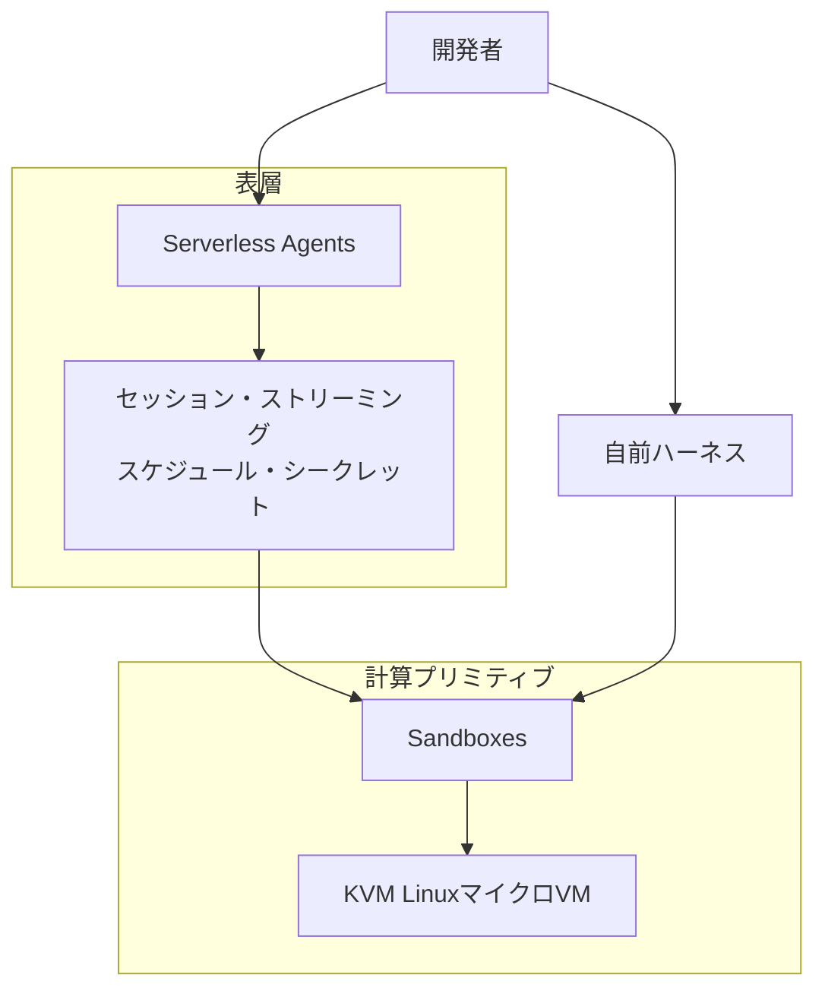
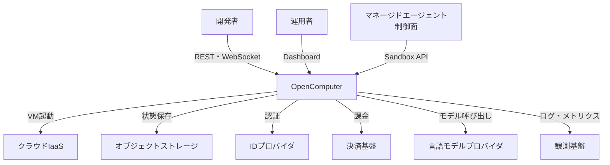
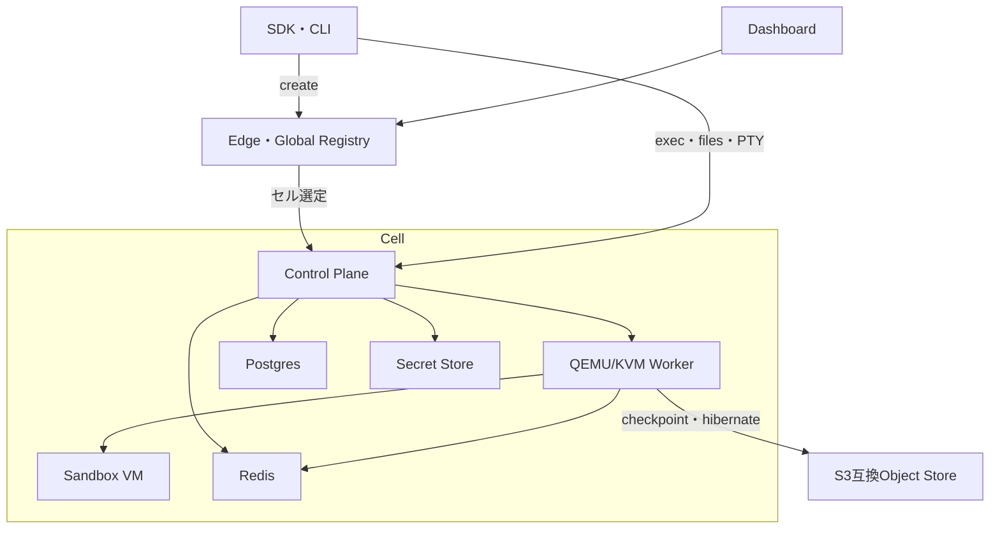
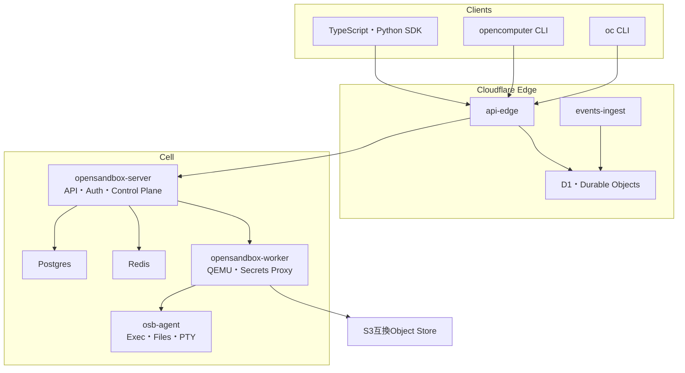
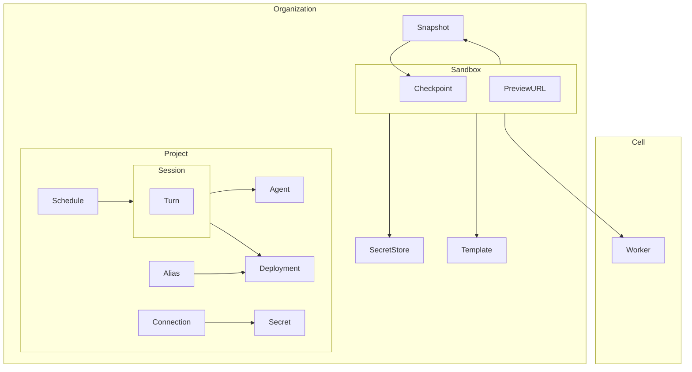
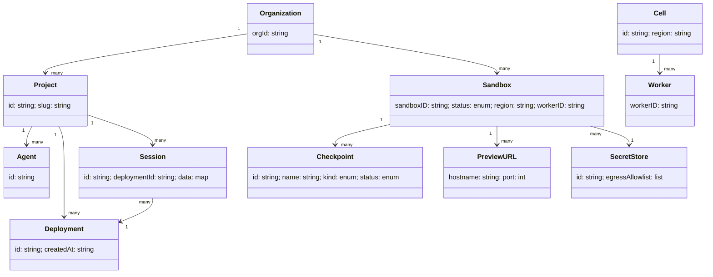

OpenComputerは、AIエージェントをTypeScriptの関数として定義し、クラウド上のLinuxマイクロVMで動かすプラットフォームです。公式サイトはこれを「Firebase for agents.」と表現しています。

一見するとエージェント向けPaaSですが、内部にはKVM、QEMU、セル単位のコントロールプレーン、チェックポイント、ハイバネーション、実行中のメモリ変更まで含むサンドボックス基盤があります。本記事では、OpenComputerの公開ドキュメントとOSS実装をもとに、次の点を実装・運用目線で整理します。

- Serverless AgentsとSandboxesの関係
- HTTP、WebSocket、gRPCをまたぐ実行経路
- Project、Session、Sandbox、Checkpointのデータモデル
- SDK、CLI、HTTP APIの使い分け
- timeout、シークレット、スケール、課金で迷いやすい点
- 2026年8月26日時点で確認できる既知の問題

なお、同名の論文「OpenComputer: Verifiable Software Worlds for Computer-Use Agents」や、別作者のPyPIパッケージ`opencomputer`とは異なる製品です。本記事で扱うPython SDKの配布名は`opencomputer-sdk`、import名は`opencomputer`です。


*この記事の全体像。以下、順に解説します。*

## 概要

OpenComputerには、大きく分けて2つの利用面があります。

1. **Serverless Agents**: `@opencomputer/agent`でエージェントを関数として定義し、CLIでデプロイする面
2. **Sandboxes**: 自前のエージェントハーネスからLinuxマイクロVMを直接操作する面

両者は競合する機能ではありません。Serverless Agentsの実行基盤としてSandboxesが使われ、自前ハーネスも同じ計算プリミティブを利用できます。

### 製品の二層



Serverless Agentsでは、会話の再開、ストリーミング、途中操作、cron、シークレット注入などをプラットフォームが管理します。Sandboxesでは、ファイルシステム、ネットワーク、プロセス空間を持つ独立カーネルのLinux VMをSDKやHTTP APIから操作します。

Durable Agent Sessionsは、ClaudeやCodexのようなランタイム向けに、永続イベントログを持つbrainと、使い捨て可能なsandboxのhandsを分ける別の利用面です。`@opencomputer/agent`によるServerless Agentsとは区別して理解する必要があります。


OpenComputerのOSSリポジトリはApache License 2.0です。Sandbox APIの既定エンドポイントは`https://app.opencomputer.dev`です。Durable Agent Sessions SDKは別の`https://api.opencomputer.dev/v3`を既定base URLとして使います。2026年8月26日時点で、リポジトリの`VERSION`は`0.6.0`でした。

### QEMUとKVMの役割

OpenComputerはQEMUとKVMを組み合わせています。両者は代替関係ではありません。

- QEMU: ユーザー空間でVMのデバイス、I/O、ライフサイクルを管理するVMM
- KVM: Linuxカーネル内でCPU仮想化とメモリ分離を担う機構


エージェント向けサンドボックスの比較では、「KVMを使うか」だけでなく、その上のVMMがQEMU、Firecracker、Cloud Hypervisorのどれか、あるいはgVisorやコンテナ系かを見ると差を捉えやすくなります。


OpenComputerがQEMU on KVMを選ぶ理由として、公式ガイドは長さが読めないセッションへの適応を挙げています。virtio-memによる実行中のメモリ増減、hibernate / wake、長時間セッションでのRAM回収を同じ基盤で扱えるためです。

## 特徴

OpenComputerの特徴を、開発者から見える機能と基盤側の機能に分けると次のようになります。

| 領域 | 主な特徴 |
|---|---|
| エージェント定義 | TypeScript関数、Tools、MCP、Skills、Subagents、cron |
| セッション | ストリーミング、再開、途中操作、Deployment固定 |
| シークレット | HTTPS originに束縛した注入、Sandbox SecretStore |
| 実行環境 | KVMによる独立カーネル、Ubuntu 22.04ベースの既定環境 |
| 状態保存 | Full / Disk-only Checkpoint、fork、hibernate / wake |
| リソース | 1 / 4 / 8 / 16GBティアのlive resizeとautoscale |
| ネットワーク | TAP + NATのoutbound、reverse proxyのPreview URL |
| クライアント | TypeScript SDK、Python SDK、HTTP API、2系統のCLI |

特に重要なのは、CheckpointとHibernationの役割が違う点です。

| | Checkpoint | Hibernation |
|---|---|---|
| 目的 | 保存状態から別Sandboxをfork | 同じSandboxを休止・再開 |
| 元のSandbox | 動き続ける | 停止する |
| fork | 可能 | 不可 |
| 保存数 | Full 10、Disk-only 100 | 1つの休止状態 |
| 主用途 | 並列実験、分岐 | idle時のコスト削減 |

Full Checkpointはディスク、メモリ、CPU状態を保存します。Disk-onlyはroot filesystemとworkspaceを保存します。一方、Checkpointからのforkで引き継ぐのはファイルシステムと導入済みパッケージであり、実行中プロセスは新しいVMにそのまま移りません。

## 構造

OpenComputerは、クライアント、コントロールプレーン、データプレーンの3層で捉えると理解しやすい構造です。

- クライアント → コントロールプレーン: HTTP RESTとWebSocket
- コントロールプレーン → ワーカー: gRPC
- ワーカー → VM内`osb-agent`: gRPC over virtio-serial

配備と障害隔離の単位は**セル**です。セルIDは`{cloud}-{region}-{slot}`形式で、たとえば`azure-us-east-2-a`になります。

### システムコンテキスト図



この境界で重要なのは、マネージドエージェントの制御面と、公開リポジトリのサンドボックス基盤が別系統であることです。前者は後者のSandbox APIを消費します。WorkOS、決済、LLM、観測などの外部サービスは、OpenComputer本体の外側にあります。

### コンテナ図



createはエッジを経由し、グローバルレジストリがセルを選びます。その後のexec、ファイルI/O、PTY、destroyは、署名付きJWTを使ってセルのコントロールプレーンへ直通します。

セルのコントロールプレーンには4つの中心責務があります。

1. Sandboxを特定ワーカーへスケジュールする
2. 各VMの所在と状態を追跡する
3. idle VMをオブジェクトストアへhibernateし、要求時にwakeする
4. リバランス時にVMをワーカー間で移行する


### コンポーネント図



OSS実装では、製品名がOpenComputerでも、バイナリや環境変数に歴史的な`opensandbox`名が残っています。

| コンポーネント | 役割 |
|---|---|
| `opensandbox-server` | HTTP API、認証、配置、課金フック、ワーカー調整 |
| `opensandbox-worker` | QEMU/KVMホスト、VM起動、hibernate、wake、exec、ファイル操作 |
| `osb-agent` | VM内gRPCサーバ、Exec、Files、PTY、Stats、resource limits |
| `api-edge` | create時の認証、クレジット確認、セル選定、Preview URL解決 |
| `events-ingest` | HMAC付きイベントをD1とクレジット会計へ反映 |

コントロールプレーンとワーカー間の契約は`proto/worker`、ワーカーとVM内エージェント間の契約は`proto/agent`にあります。VMのNICはTAPで、outboundはiptablesのMASQUERADEです。Sandbox SecretStoreの置換プロキシは`169.254.169.253:3128`で動きます。

ExecのWebSocketは、先頭1バイトでストリーム種別を表します。

| Byte | 方向 | 意味 |
|---|---|---|
| `0x00` | Client → Server | stdin |
| `0x01` | Server → Client | stdout |
| `0x02` | Server → Client | stderr |
| `0x03` | Server → Client | 4-byte big-endianのexit code |
| `0x04` | Server → Client | scrollback終了 |

接続時はscrollbackが再生され、`0x04`の後にライブ出力が流れます。PTYは同じバイナリフレームを使いますが、ストリームプレフィックスなしの生端末データです。

## データ

永続エンティティは、Serverless Agents側とSandboxes側の2群に分かれます。

- Serverless Agents: Projectを境界にAgent、Deployment、Alias、Sessionを保持
- Sandboxes: Organizationを境界にSandbox、Checkpoint、Snapshot、SecretStoreを保持

### 概念モデル



ProjectはServerless Agentsのクラウド境界です。Deploymentは1つのAgentの不変ビルドで、`development`や`production`のAliasが参照します。Sessionは開始時のDeploymentに固定されるため、production Aliasを更新しても既存Sessionは古いDeploymentのままです。

Sandboxはハードウェア隔離されたLinuxマイクロVMです。Checkpointは同じSandbox内で名前が一意で、PreviewURLはVM内ポートへの公開HTTPS入口です。SecretStoreはSandbox向けの暗号化シークレット集合で、egress allowlistを持ちます。

### 情報モデル



HTTP JSONとSDKでは、方向とキー名の両方が異なります。Createのリクエスト項目を、そのままCreateレスポンスの属性として扱わないようにします。

| 概念 | Create request body | Create 201 response | TypeScript SDK | Python SDK |
|---|---|---|---|---|
| Sandbox ID | なし | `sandboxID` | プロパティ`Sandbox.sandboxId` | プロパティ`Sandbox.sandbox_id` |
| Template | `templateID` | なし | 作成option`template` | 作成引数`template` |
| Disk | `diskMB` | なし | 作成option`diskMB` | 作成引数`disk_mb` |
| Memory | `memoryMB` | なし | 作成option`memoryMB` | 作成引数`memory_mb` |
| 配置情報 | なし | `region`、`workerID` | レスポンスから構築 | レスポンスから構築 |

Createの201レスポンスには、`sandboxID`、`status`、`region`、`workerID`が含まれ、指定時には`previewAuthToken`や`webhooks`も加わります。`templateID`、`diskMB`、`memoryMB`は作成リクエストのキーです。

Sandboxの顧客向け状態は`running`、`hibernated`、`stopped`、`error`です。実装内部には`paused`や`pooled`もありますが、制御面は`paused`を`hibernated`として投影します。

Checkpointの`kind`は`full`または`disk_only`、`status`は`processing`、`ready`、`failed`です。保持ポリシーで古いCheckpointを削除できますが、公開中、patch付き、fork参照中のものは削除対象外です。

## 構築方法

### 前提条件とバージョン

ホステッド版を使う場合はOpenComputerアカウントとAPIキーが必要です。実行環境の要件はクライアントによって異なります。

| 対象 | 要件・確認バージョン（2026-08-26） |
|---|---|
| Serverless Agents CLI | Node.js 22以上、`@opencomputer/cli` 0.6.3 |
| TypeScript SDK | Node.js 18以上、`@opencomputer/sdk` 0.15.6 |
| Agent SDK | `@opencomputer/agent` 0.5.2 |
| Python SDK | Python 3.10以上、`opencomputer-sdk` 0.6.9 |
| Sandbox向けGo CLI | `oc` v0.6.0.43 |

公式サイトは`npm create @opencomputer/start@latest`を案内しています。npmのinitializer規則により、実際には`@opencomputer/create-start`が実行されます。直接初期化する場合は`npx @opencomputer/cli init`も使えます。

```bash
npm install @opencomputer/sdk
npm install @opencomputer/agent
pip install opencomputer-sdk
```

### CLIは2系統ある

コマンド名を混ぜないことが大切です。

| CLI | 用途 |
|---|---|
| `opencomputer` | managed agentsのinit、login、deploy、session、logs、secrets |
| `oc` | Sandbox、exec、checkpoint、preview、hibernate |

```bash
npx @opencomputer/cli init my-agent
cd my-agent
npm install
npx --package @opencomputer/cli opencomputer login
```

Sandbox向けGo CLIは次のスクリプトで`~/.local/bin`へ導入できます。

```bash
curl -fsSL https://raw.githubusercontent.com/diggerhq/opencomputer/main/scripts/install.sh | bash
```

APIキーは環境変数から渡せます。HTTP APIでは`X-API-Key`ヘッダです。

```bash
export OPENCOMPUTER_API_KEY=your-api-key
npx --package @opencomputer/cli opencomputer whoami
oc config show
```

`OPENCOMPUTER_API_KEY`が設定済みの状態で`opencomputer login`を使う場合は、環境変数を外すか`--force`が必要です。`oc`の設定はフラグ、環境変数、`~/.oc/config.json`、既定値の順に解決します。APIキーには既定値がなく、既定値があるのはAPI URLです。

### セルフホストの構成

セルフホストには、KVMを利用できるworker、PostgreSQL、Redis、S3互換オブジェクトストレージが必要です。workerイメージにはQEMU、`opensandbox-worker`、`osb-agent`、kernel、rootfsを含めます。

最短の確認は、serverのhealth、Sandbox作成、VM内execの順です。

```bash
curl -sf "$OPENCOMPUTER_URL/health"

SBX=$(curl -s -X POST "$OPENCOMPUTER_URL/api/sandboxes" \
  -H "Content-Type: application/json" \
  -H "X-API-Key: $OPENCOMPUTER_API_KEY" \
  -d '{"templateID":"default"}' | jq -r .sandboxID)

curl -s -X POST "$OPENCOMPUTER_URL/api/sandboxes/$SBX/exec" \
  -H "Content-Type: application/json" \
  -H "X-API-Key: $OPENCOMPUTER_API_KEY" \
  -d '{"cmd":"uname -a && pwd && date"}'
```

ここには命名上の差があります。SandboxドキュメントとSDKの既定templateは`"base"`ですが、`SELFHOSTING.md`のsmoke testは`"default"`を送ります。セルフホスト時は、自分の環境に登録されたtemplate名を確認してください。

本番では、HTTPS終端、複数のcontrol-plane replica、failure domainを分けたworker、managed Postgres / Redis、オブジェクトストレージを用意します。単一ホスト構成は開発確認向けです。

## 利用方法

### Serverless Agentsをデプロイする

エージェントは`opencomputer/agents/<agent-id>/agent.ts`に定義します。ローカルのagent serverを常駐させるのではなく、managed development cloudへデプロイします。

```tsx
import { useInput, useModel } from "@opencomputer/agent";

export default function Agent() {
  const input = useInput();
  useModel("anthropic/claude-sonnet-4.6");

  return input.text
    ? `Help the user with this request: ${input.text}`
    : "You are a helpful assistant.";
}
```

```bash
npm run deploy -- --watch
npm run deploy -- --alias production
npm run session -- --agent hello-world "Say hello"
npx --package @opencomputer/cli opencomputer logs --follow
```

クライアントからは`agent-id@alias`で指定します。`hello-world@development`のような形です。production Aliasを切り替えても、既存Sessionは開始時のDeploymentを使い続けます。

Toolは`agents/<agent>/tools/*.ts`へ置きます。`agent.ts`内に直接書いた`defineTool`がデプロイ成果物から落ちる既知の問題があるためです。

```tsx
// opencomputer/agents/support/tools/lookup-order.ts
import { defineTool } from "@opencomputer/agent";

export const lookupOrder = defineTool({
  name: "lookup_order",
  description: "Look up an order by ID",
  input: {
    type: "object",
    properties: { orderId: { type: "string" } },
    required: ["orderId"],
    additionalProperties: false,
  },
  async run({ input }) {
    return { orderId: String(input.orderId), status: "processing" };
  },
});
```

MCP serverは`defineMcpServer`、同じProject内の別Agentは`useSubagent(agentId)`で接続できます。Skillは`opencomputer/agents/<agent-id>/skills/<skill>/SKILL.md`へ置きます。

### Sandboxを作成してコマンドを実行する

現行APIは`sandbox.exec.run()`です。一部の古いIntroductionには`commands.run`が残っていますが、新しいコードでは`exec`を使います。

```typescript
import { Sandbox } from "@opencomputer/sdk";

const sandbox = await Sandbox.create({
  template: "base",
  timeout: 600,
  cpuCount: 1,
  memoryMB: 4096,
  diskMB: 20480,
  envs: { NODE_ENV: "production" },
});

const result = await sandbox.exec.run("echo Hello from $(uname -a)");
console.log(result.stdout);
await sandbox.kill();
```

```python
from opencomputer import Sandbox

async with await Sandbox.create(timeout=600) as sandbox:
    result = await sandbox.exec.run("echo Hello from $(uname -a)")
    print(result.stdout)
```

Pythonには注意が必要です。PyPI 0.6.9と公式Python SDKリファレンス、GitHub `main`の実装には差があります。ホステッド版でコピー可能な例はPyPI版に合わせ、`hibernate()`や`wake()`などGitHub `main`の先行実装を使う場合はコミットSHAを固定するのが安全です。

### Checkpointから環境を分岐する

```typescript
const sandbox = await Sandbox.create();
await sandbox.exec.run("npm install && npm run build", { cwd: "/app" });

const checkpoint = await sandbox.createCheckpoint("after-build");
const experimentA = await Sandbox.createFromCheckpoint(checkpoint.id);
const experimentB = await Sandbox.createFromCheckpoint(checkpoint.id);

await sandbox.restoreCheckpoint(checkpoint.id);
```

Checkpoint名はSandbox内で一意です。重複はHTTP 409になります。分岐後のVMはディスク状態から新しくbootするため、元VMの実行中プロセスを前提にしないでください。

### HibernateとWakeを使う

```typescript
await sandbox.hibernate();
await sandbox.wake({ timeout: 600 });
```

```bash
curl -X POST "https://app.opencomputer.dev/api/sandboxes/$SBX/hibernate" \
  -H "X-API-Key: $OPENCOMPUTER_API_KEY"

curl -X POST "https://app.opencomputer.dev/api/sandboxes/$SBX/wake" \
  -H "X-API-Key: $OPENCOMPUTER_API_KEY" \
  -H "Content-Type: application/json" \
  -d '{"timeout":600}'
```

`wake()`はまずsnapshot resumeを試し、失敗時は保存ディスクからのcold bootへフォールバックします。Sandbox IDとPreview URLは変わりません。

### Preview URLを保護する

Preview URLは既定では公開です。外部公開するサービスでは、Sandbox作成時にbearer認証を明示します。

```typescript
const sandbox = await Sandbox.create({
  previewAuth: { scheme: "bearer", token: "auto" },
});

console.log(sandbox.previewAuthToken);
```

```bash
curl -H "Authorization: Bearer $TOKEN" \
  https://sb-abc123-p3000.workers.opencomputer.dev/
```

平文トークンはcreateまたはrotateの応答で一度だけ返り、サーバ側にはSHA-256ハッシュが保存されます。安全な場所へ直ちに保存してください。

### シークレットを実行環境から分離する

Serverless Agentsのmanaged secretは、`defineConnection`で定義したHTTPS originへの送信時にだけ注入されます。ランタイム環境変数、プロンプト、ログから秘密を切り離せます。

```tsx
import { bearer, defineConnection, useSecret } from "@opencomputer/agent";

const github = defineConnection({
  id: "github-api",
  origin: "https://api.github.com",
  methods: ["GET"],
  pathPrefix: "/repos/",
  headers: {
    Authorization: bearer(useSecret("GITHUB_TOKEN")),
    "User-Agent": "my-opencomputer-agent",
  },
});
```

Sandbox SecretStoreでは、VM内には`osb_sealed_*`形式の封印トークンだけが入ります。許可されたHTTPS hostへの送信時に、worker上のプロキシが実値へ置換します。

```typescript
import { Sandbox, SecretStore } from "@opencomputer/sdk";

const store = await SecretStore.create({
  name: "my-agent-secrets",
  egressAllowlist: ["api.anthropic.com"],
});

await SecretStore.setSecret(store.id, "ANTHROPIC_API_KEY", "sk-ant-...", {
  allowedHosts: ["api.anthropic.com"],
});

const sandbox = await Sandbox.create({
  secretStore: "my-agent-secrets",
  timeout: 600,
});
```

## 運用

### timeoutは必ず明示する

公式資料にはidle timeoutの既定値が2通りあります。

| 出典 | 既定値 |
|---|---|
| Sandboxes Overview、Troubleshooting | 300秒、期限切れでauto-hibernate |
| Timeoutページ、SDK実装、Issue #325 | 0、persistent |

ドキュメント差に依存しないよう、作成時または実行後に用途別の値を明示します。

```typescript
const sandbox = await Sandbox.create({ timeout: 600 });
await sandbox.setTimeout(3600);
await sandbox.setTimeout(0); // persistent
```

always-on以外で`0`を使うと、不要なmachine timeを消費しやすくなります。対話開発なら600〜3600秒、短命なバッチやテストなら60〜300秒を起点に調整します。

### 状態と実エラーを確認する

```bash
oc ls
oc sandbox get sb-abc123
oc exec sb-abc123 --wait -- journalctl --no-pager -n 50
npx --package @opencomputer/cli opencomputer logs --follow
```

失敗ターンの詳細がCLIのlogsに出ず、managed sessionのevents APIにだけ出る既知の問題があります。表面的なメッセージしか見えない場合は、次のAPIを確認します。

```http
GET /api/managed-agents/sessions/{id}/events?after=0
```

セルフホストではserverとworkerの両方を確認します。

```bash
sudo journalctl -u opensandbox-server -n 100 --no-pager
sudo journalctl -u opensandbox-worker -f
```

### live resizeとautoscale

autoscaleはSandbox単位のopt-inです。CPUはメモリに比例し、公開されている主なティアは次の通りです。

| Memory | vCPU |
|---|---|
| 1GB | 1（best-effort） |
| 4GB | 1 |
| 8GB | 2 |
| 16GB | 4 |

```typescript
await sandbox.setAutoscale({
  enabled: true,
  minMemoryMB: 1024,
  maxMemoryMB: 16384,
});

await sandbox.scale({ memoryMB: 4096 });
```

scale upは1分平均のメモリ使用率が75%を超えると次ティアへ進み、cooldownは60秒です。scale downは1分、5分、15分平均がすべて25%未満で1ティア下がり、cooldownは5分です。明示的な`scale`はautoscaleを無効化します。

縮小先がworking setを下回るとHTTP 409 `oom_floor`、lock中は403 `scaling_locked`、プラン上限超過は402になります。

### 課金を見積もる

2026年8月26日時点の公式サイトでは、モデル料金のパススルーとmachine timeが別メーターです。BYOモデルキーではtoken meterが0になり、bare Sandboxではmachine timeだけが対象です。

Agentの既定マシンは2GB / 1 vCPUで、$0.00315/分です。hibernate中はcompute課金が止まります。課金粒度は10秒ハートビートを秒単位へ集約します。

| Plan | 価格と特徴 |
|---|---|
| PAYG | $10 free credit、使用量課金 |
| Pro | $20/月、10倍相当のprepaid credit |
| Max | $200/月、より多い常時稼働向け |
| Enterprise | 自前cloud / VPC、SSO、audit log |

価格、プラン、制限は変わりやすいため、本番導入時は[公式Pricing](https://opencomputer.dev/)を再確認してください。

### Burst Sandboxesを再実行可能にする

alphaのBurst Sandboxesは`burst: true`で作成します。ディスクはインフラ再起動をまたいで残りますが、プロセス、メモリ、端末、接続は再起動する可能性があります。再起動通知がある場合、ゲストには最大25秒のflush時間があります。

環境変数`OPENSANDBOX_RESUMABLE=true`と`OPENSANDBOX_RESUME_NOTICE_SECONDS=25`を確認し、`/home/sandbox/.opencomputer/on-restart-notice`へflush hookを置きます。CI、バッチ、探索処理のように再実行可能なワークロード向けです。

## ベストプラクティス

### CI/CD

- developmentの`--watch`とproduction Aliasを分離する
- productionは`deploy --alias production`で不変Deploymentを切り替える
- 切り替え後の確認は新規Sessionで行う
- CIのsecret値はコマンド引数ではなく標準入力から渡す
- Toolは`agents/<agent>/tools/*.ts`へ置く
- Reserved Capacityの書き込みには決定的な`Idempotency-Key`を付ける

### マルチ環境

Agentの環境は`development`と`production`を基本にし、secretsとruntime variablesを分けます。クライアントは`agent-id@alias`で環境を固定します。

基盤側はセルID`{cloud}-{region}-{slot}`でfailure domainを表します。開発セルは単一ホストでも構築できますが、本番ではcontrol plane、worker、Postgres、Redis、Object Storeの障害境界を分けます。

### リソース制限

- idle timeoutを必ず用途別に明示する
- autoscaleのmin/maxは公開ティアから選ぶ
- ベンチマーク中や固定課金が必要な場合だけscaling lockを使う
- 重いビルド前にVM内metadata APIでscale upし、終了後に下げる
- Burstには再実行可能な処理だけを載せる
- 20GBを超えるdiskが必要なら超過課金とclosed beta条件を確認する

### セキュリティ

- managed secretをHTTPS originとmethod、path prefixに束縛する
- runtime variableとmanaged secretを用途で分ける
- Preview URLにはbearer認証を明示する
- create / rotateで一度だけ返るトークンをdurable storeへ保存する
- worker RPC、Postgres、Redisをprivate networkへ閉じる
- セルフホストの秘密はKey VaultやSecrets Managerから供給する
- GitHub API向けConnectionには`User-Agent`を明示する

### 設定管理

主な環境変数には`OPENSANDBOX_*`プレフィックスが付きます。

| 変数 | 役割 |
|---|---|
| `OPENSANDBOX_MODE` | `server`または`worker` |
| `OPENSANDBOX_COMPUTE_PROVIDER` | `azure`または`aws` |
| `OPENSANDBOX_CELL_ID` | `{cloud}-{region}-{slot}` |
| `OPENSANDBOX_S3_*` | Checkpoint、Hibernation、Templateの保存先 |
| `OPENSANDBOX_MIN_WORKERS` / `MAX_WORKERS` | worker台数の範囲 |
| `OPENSANDBOX_SENTRY_DSN` | 観測、未設定なら無効 |

秘密値と非秘密値を分け、server用とworker用の設定ファイルも分離します。Postgresを直接変更する運用は避け、公開APIとCLIを正とします。

## トラブルシューティング

問題が起きたら、認証、Sandbox状態、worker登録、VM内プロセスの順に切り分けます。

```bash
oc config show
oc sandbox get sb-abc123
oc exec sb-abc123 --wait -- ps aux
oc exec sb-abc123 --wait -- journalctl --no-pager -n 50
```

### 頻出エラー

| 症状 | 主な原因 | 対処 |
|---|---|---|
| `401 Unauthorized` | APIキー欠落・不一致 | 環境変数とdashboardのキーを照合 |
| `Sandbox not found` | kill済み、timeout後の休止 | 一覧と状態を確認し、必要ならwake |
| `Connection refused` | bootまたはwake中 | 状態確認後、起動完了を待つ |
| Command timeout | `exec.run`の既定60秒 | 呼び出しのtimeoutを明示 |
| `503 no workers available` | worker未登録 | server logでworker登録を待つ |
| `403 scaling_locked` | scaling lock中 | unlock後、autoscaleも再設定 |
| `409 oom_floor` | 縮小先がworking set未満 | VM内でメモリを解放して再試行 |
| Preview `401` | bearer不一致 | Token再確認、紛失時はrotate |
| GitHub Connection `403` | `User-Agent`欠落 | Connectionヘッダへ追加 |
| egress `407` | proxy session未成立 | 別Sandboxで再試行しissueを追跡 |
| Agentの詳細エラーが見えない | CLI logsの既知問題 | managed session events APIを確認 |

### 2026年8月26日時点の既知の問題

運用に影響しやすいopen issueは次の通りです。状態は変わるため、導入時に各issueを再確認してください。

| Issue | 内容 |
|---|---|
| [#637](https://github.com/diggerhq/opencomputer/issues/637) | `session create --local`がlocal service起動でtimeout |
| [#636](https://github.com/diggerhq/opencomputer/issues/636) | managed egressの`User-Agent`欠落でGitHubが403 |
| [#633](https://github.com/diggerhq/opencomputer/issues/633) | 失敗ターンの実エラーがCLI logsに出ない |
| [#632](https://github.com/diggerhq/opencomputer/issues/632) | `agent.ts`内のToolがDeploymentから落ちる |
| [#610](https://github.com/diggerhq/opencomputer/issues/610) | 新規Sandboxのegress proxyが間欠的に407 |
| [#609](https://github.com/diggerhq/opencomputer/issues/609) | exec可能でもCheckpoint作成がorg不一致になる |
| [#325](https://github.com/diggerhq/opencomputer/issues/325) | persistent timeout `0`の意味が不明確 |

セルフホストで`/dev/kvm`が無い場合は、ホストとクラウドインスタンスのnested virtualizationを確認します。Local SSD上のSandbox diskはインスタンス停止や置換で消えるため、CheckpointやHibernationを検証する前にObject Storeを設定してください。

## まとめ

OpenComputerは、TypeScriptで定義するServerless Agentsと、QEMU on KVMで動くLinux Sandboxesを重ねたプラットフォームです。エージェントAPIだけを見るよりも、セル、コントロールプレーン、worker、VM内`osb-agent`、Object Storeまでを一続きの構造として捉えると、Checkpoint、Hibernation、live resize、secret injectionの設計意図が見えます。

実装時には、`opencomputer`と`oc`の2系統のCLI、HTTP JSONとSDKのキー差、PyPI版とGitHub `main`のPython SDK差に注意が必要です。運用時にはtimeoutを明示し、Preview URLを保護し、autoscaleとlockの相互作用を監視してください。特に公式資料間で既定値が揺れている項目は、コード側で値を固定するのが安全です。

この記事が少しでも参考になった、あるいは改善点などがあれば、ぜひリアクションやコメント、SNSでのシェアをいただけると励みになります！

## 参考リンク

- [OpenComputer公式サイト](https://opencomputer.dev/)
- [OpenComputer Introduction](https://docs.opencomputer.dev/introduction)
- [How it works](https://docs.opencomputer.dev/how-it-works)
- [Serverless Agents Overview](https://docs.opencomputer.dev/agents/overview)
- [Sandboxes Overview](https://docs.opencomputer.dev/sandboxes/overview)
- [GitHub diggerhq/opencomputer](https://github.com/diggerhq/opencomputer)
- [SELFHOSTING.md](https://raw.githubusercontent.com/diggerhq/opencomputer/main/SELFHOSTING.md)
- [Checkpoints](https://docs.opencomputer.dev/sandboxes/checkpoints)
- [Elasticity](https://docs.opencomputer.dev/sandboxes/elasticity)
- [Timeout](https://docs.opencomputer.dev/sandboxes/timeout)
- [Preview URLs](https://docs.opencomputer.dev/sandboxes/preview-urls)
- [TypeScript SDK](https://docs.opencomputer.dev/reference/typescript-sdk)
- [Python SDK](https://docs.opencomputer.dev/reference/python-sdk)
- [HTTP API](https://docs.opencomputer.dev/reference/api)
- [Troubleshooting](https://docs.opencomputer.dev/troubleshooting)
- [QEMU vs KVM](https://opencomputer.dev/guides/qemu-vs-kvm)
