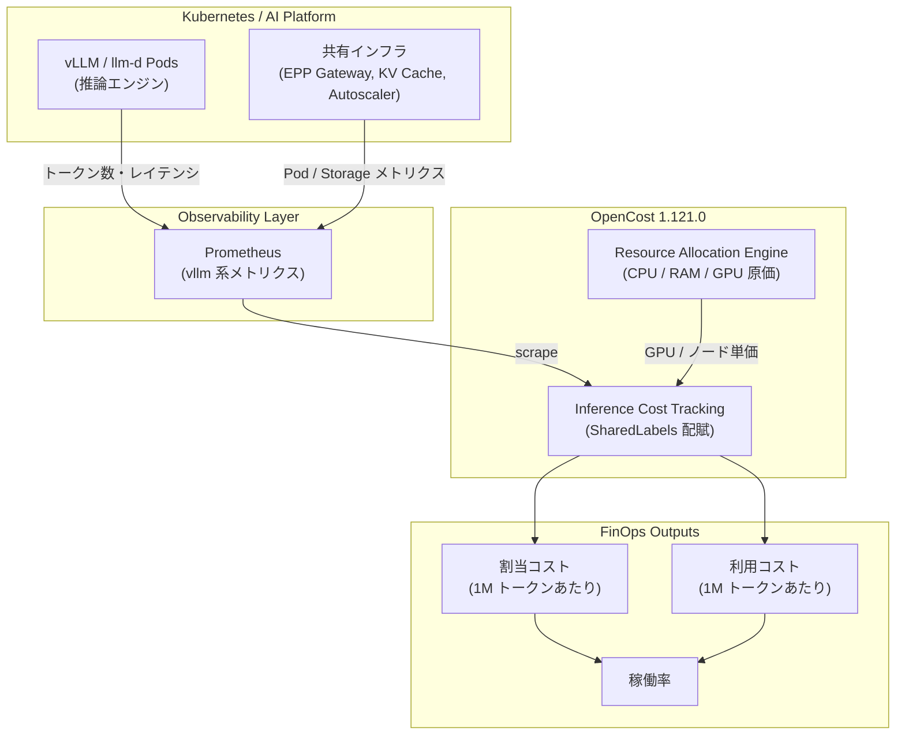

*この記事の全体像。以下、順に解説します。*

## この記事の対象と得られるもの

Kubernetes 上で LLM を自前ホスティングしていると、GPU ノードの請求額は見えても「どのモデルが、どのチームの、どのリクエストで、いくら使ったか」は見えません。結果として、コスト会話は「GPU 予算枠を超えたかどうか」で止まります。

CNCF インキュベーティングプロジェクトの **OpenCost** は 2026 年 8 月 5 日にリリースした 1.121.0 で、この空白を埋める推論コスト追跡機能を追加しました。モデル単位・100 万トークンあたり単位原価でコストを配賦するオープンソース実装としては初とされています。

この記事で扱うのは次の 3 点です。

- 推論コストを「割当」と「利用」の 2 軸で分けて見る考え方
- その 2 軸から Build-vs-Buy(自前ホスティング vs SaaS API)をどう判断するか
- OpenCost 1.121.0 で何が計測でき、何は計測できないか

対象読者は、Kubernetes 上で推論基盤を運用している、あるいはこれから自前ホスティングの是非を判断する立場の方です。

## なぜ GPU 請求額だけでは判断できないのか

GPU ノードの費用は、実際に推論している時間だけ発生するわけではありません。

- モデルウェイトを VRAM に載せている間、GPU は占有され続ける
- ロード時間・ウォームアップ時間も課金対象
- トラフィックがない時間帯もノードは起動している

つまり **「支払っている量」と「使っている量」がずれる**。このずれを無視して「アクティブ推論時の計算コスト」だけを SaaS API の従量単価と比べると、自前ホスティングが常に安く見えます。実際の請求書は割当ベースで届くので、判断が逆になる。これが Build-vs-Buy の罠です。

OpenCost 1.121.0 は、このずれを 2 つの指標に分離して可視化します。

| 指標 | 何を含むか | 何の判断に使うか |
|---|---|---|
| 割当コスト (Allocation-based) | VRAM 予約・モデル読込・アイドル時間を含む総保有コスト | 実請求に近い。SaaS API 単価との比較 |
| 利用コスト (Usage-based) | アクティブ推論中の計算コストのみ | 推論処理そのものの効率 |
| 稼働率 (Utilization) | 利用 ÷ 割当 | 集約・スケジューリング改善の余地 |

稼働率が低いほど、割当コストと利用コストの差が開きます。この差が、そのまま「無駄に支払っている額」です。

## 全体の構造

計測から配賦までの流れは次のようになります。



ポイントは、OpenCost が新たに計測器を挿すのではなく、**すでに vLLM / llm-d が Prometheus に出しているメトリクスと、既存のノード原価計算を突き合わせる**構造になっていることです。推論エンジン側に手を入れる必要がない代わりに、Prometheus が取れていないものは配賦できません。

## 3 つの計測上の工夫

### 1. 共有インフラの自動配賦(SharedLabels)

推論の費用は GPU だけではありません。Inference Scheduler(EPP)、Gateway Proxy、階層型 KV キャッシュのストレージ、Autoscaler といった周辺コンポーネントも動き続けています。これらは特定のモデルに紐づかないため、素朴に集計すると「どこにも属さない共通費」として落ちます。

OpenCost 1.121.0 は `SharedLabels` の仕組みで、ラベル付けした共有コンポーネントのコストをモデル側へ按分します。KV キャッシュ層は構成によっては十数 TB 規模になり得るため、ここを含めるかどうかで単位原価は変わります。

### 2. Prefill と Decode の区別

LLM 推論は、入力を処理する Prefill と、トークンを 1 つずつ生成する Decode で計算特性が異なります。Prefill は並列度が高く、Decode はメモリ帯域律速になりやすい。同じ 1 トークンでも原価が違うため、両者を分けて計算します。

加えて KV キャッシュがヒットした場合は Prefill の計算が省かれるので、その削減効果も単価に反映されます。「プロンプトの前半を共通化するとコストが下がる」という設計判断を、感覚ではなく数字で確認できるようになります。

### 3. Prometheus / REST API での標準露出

算出結果は `/metrics` と OpenCost の REST API から取得できます。`llm_total_hourly_cost` や `llm_cost_per_million_tokens` といったメトリクスが露出するため、既存の Grafana ダッシュボードや FinOps レポートにそのまま組み込めます。専用 UI を前提としない点は、運用に載せるうえで扱いやすい設計です。

## 2 軸をどう読むか(診断マトリクス)

割当コストと利用コストの高低で、取るべきアクションが変わります。

| 割当コスト | 利用コスト | 状態 | 打ち手 |
|---|---|---|---|
| 高 | 低 | 維持が高く、推論自体は効率的 | 稼働率が低い。モデル共有・マルチテナント集約・ルーティング最適化 |
| 高 | 高 | 維持も実行も高額 | モデルが過大かハードウェア不適合。量子化・小型モデルへの置換 |
| 低 | 低 | 最適 | トラフィックとインフラ規模が合致している |
| 低 | 高 | 維持は安いが推論が高コスト | 生成長が長いかデコード効率が悪い。バッチサイズ・GPU 世代の見直し |

実務で最も多いのは左上(高・低)です。「推論エンジンのチューニングは済んでいるのに費用が下がらない」ケースは、たいてい配置とスケジューリングの問題であって、モデルの問題ではありません。この切り分けが自動でつく点が、この機能の実用上の価値です。

## Build-vs-Buy をどの数字で比べるか

判断の際に押さえるべきは 1 点だけです。

> **SaaS API の従量単価と比べるのは、利用コストではなく割当コストである。**

SaaS API では、使っていない時間に課金されません。自前ホスティングでは課金されます。したがって比較の土俵を揃えるには、アイドルを含んだ割当ベースの 1M トークン原価を使う必要があります。

稼働率が上がるほど割当コストと利用コストの差は縮まり、どこかで SaaS API 単価を下回ります。その分岐点は GPU 価格・モデルサイズ・SaaS 側の単価に依存するため、一般解はありません。**自分のクラスタで実測した稼働率と割当ベース原価を、使っている SaaS API の単価表と突き合わせる**のが唯一の正しい手順です。OpenCost 1.121.0 は、その左辺を出すための道具だと捉えるのが正確です。

## 有効化の設定

Helm values で推論コスト追跡を有効化し、モデルを識別するラベルと共有インフラのラベル値を指定します。

```yaml
opencost:
  exporter:
    inferenceCostTracking:
      enabled: true
      modelLabel: "llm-d.ai/model"
      sharedInfraLabelValue: "true"
```

`modelLabel` には、推論 Pod にモデル名が入っているラベルキーを指定します。llm-d 以外の構成では、自分の Deployment が付けているラベルに合わせて変更が必要です。

:::message
設定キー名やデフォルト値はリリースごとに変わり得ます。導入前に、使用するチャートバージョンの `values.yaml` と公式ドキュメントで実際のキーを確認してください。本記事の記載は 2026 年 8 月時点のリリース情報に基づくものです。
:::

## 制約と注意点

導入前に把握しておくべき限界が 3 つあります。

**1. 実請求額とは一致しない**

OpenCost はクラウド事業者のリスト単価を基準に計算します。Reserved Instances、Savings Plans、企業別割引、Spot 割引はそのままでは反映されません。これらを織り込むには価格補正の設定が要ります。したがって出てくる数字は「相対比較・配賦のための原価」であって、請求書の再現ではありません。

**2. Prometheus のカーディナリティ**

トークン単位・リクエスト単位のメトリクスをラベルで細かく分けすぎると、時系列数が急増します。高トラフィック環境では、モデル単位・チーム単位など配賦に必要な粒度に絞る設計が前提になります。「取れるだけ取る」は事故のもとです。

**3. バージョンを上げてから使う**

1.121.0 より前のバージョンについて、Helm 値の露出に関する脆弱性報告があるとされています。本記事執筆時点で参照できたのは二次情報のため、導入時は OpenCost の公式セキュリティアドバイザリで該当有無とバージョン範囲を直接確認してください。いずれにせよ、この機能を使うなら 1.121.0 以降が必要です。

## 今後の論点

- **ディスアグリゲーティド・サービング**: Prefill 専用ノードと Decode 専用ノードを分離した構成では、ノード間の転送コストをどちらに配賦するかが未整理です。
- **推論エンジンの多様性**: 現状の統合先は vLLM / llm-d 中心です。SGLang、TensorRT-LLM、TGI などのメトリクス名をどう標準的にマッピングするかは今後の課題です。

どちらも「配賦のルールを誰が決めるか」という FinOps 側の設計問題に帰着します。ツールが揃っても、按分ルールの合意は組織側の仕事として残ります。

## まとめ

- OpenCost 1.121.0 は、Kubernetes 上の LLM 推論コストをモデル単位・100 万トークン単位で配賦する機能を追加した。
- 鍵は **割当コストと利用コストの分離**。両者の差が、稼働率の低さによる無駄をそのまま表す。
- Build-vs-Buy の比較で SaaS API 単価と並べるべきは、アイドルを含む **割当ベースの単位原価**である。
- 出力される数字はリスト単価ベースであり、請求書の再現ではない。相対比較と配賦の道具として使う。
- 配賦ルール(共有インフラの按分、Prefill/Decode の扱い)の合意は、ツール導入後も組織側に残る。

AI コスト管理の議論を「月額の GPU 予算枠を超えたか」から「機能ごと・チームごとの単位原価はいくらか」へ移せるかどうか。この機能の価値は、計測精度そのものより、その会話の土台を作れる点にあります。

この記事が少しでも参考になった、あるいは改善点などがあれば、ぜひリアクションやコメント、SNSでのシェアをいただけると励みになります！

## 参考リンク

- [OpenCost 1.121.0: First-of-a-kind Kubernetes inference cost tracking](https://www.cncf.io/blog/2026/08/05/opencost-1-121-0-first-of-a-kind-kubernetes-inference-cost-tracking/) — CNCF Blog (2026-08-05)
- [OpenCost 公式サイト / ドキュメント](https://opencost.io)
- [llm-d — Distributed LLM Inference on Kubernetes (CNCF Sandbox)](https://github.com/llm-d)
