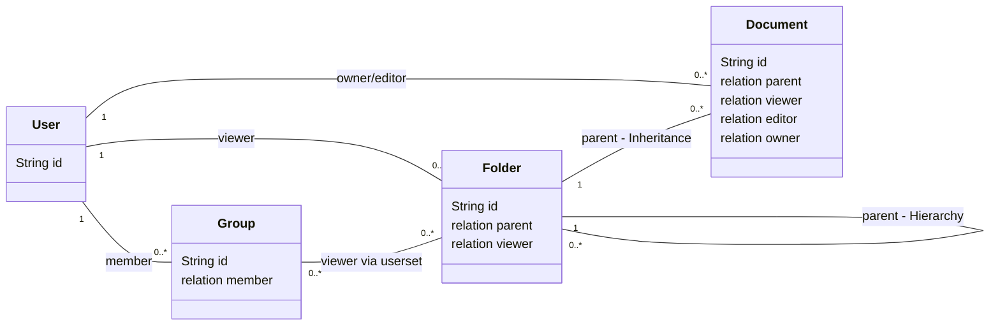
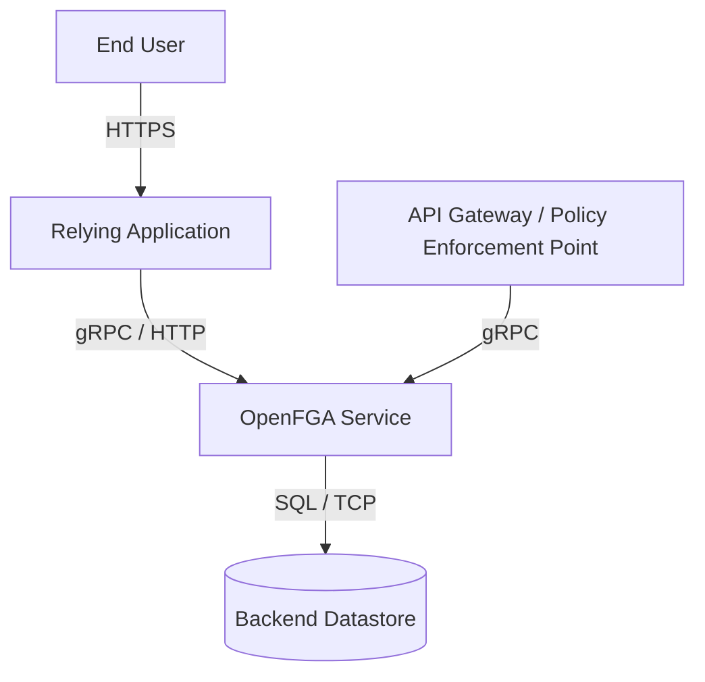
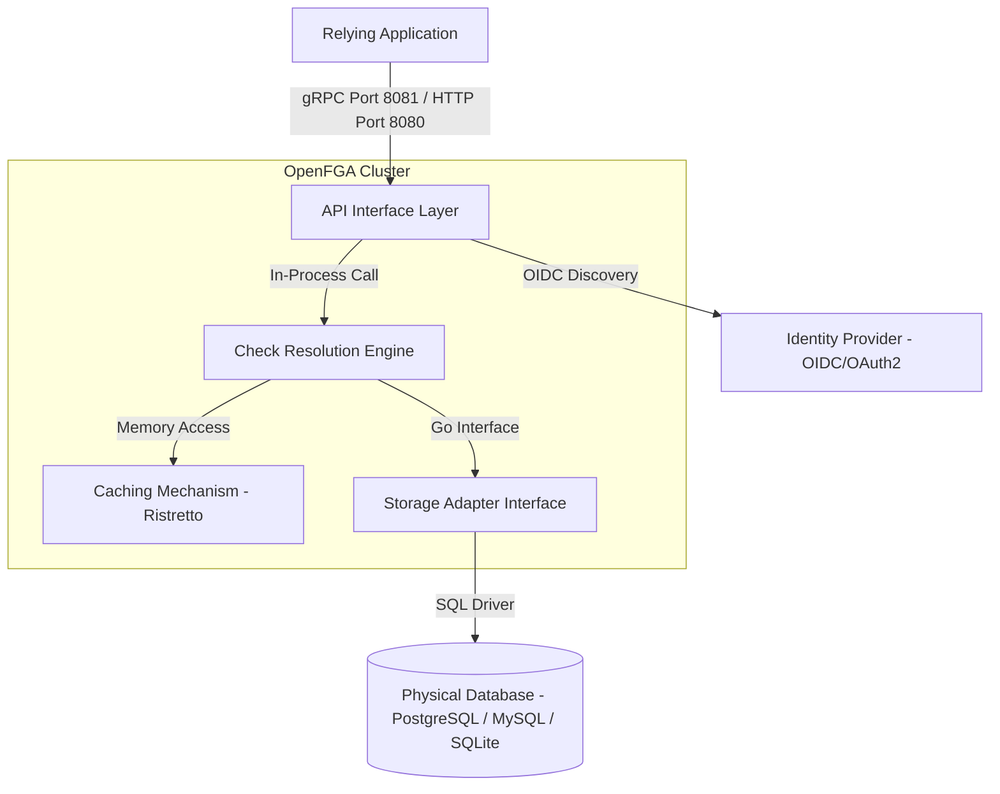
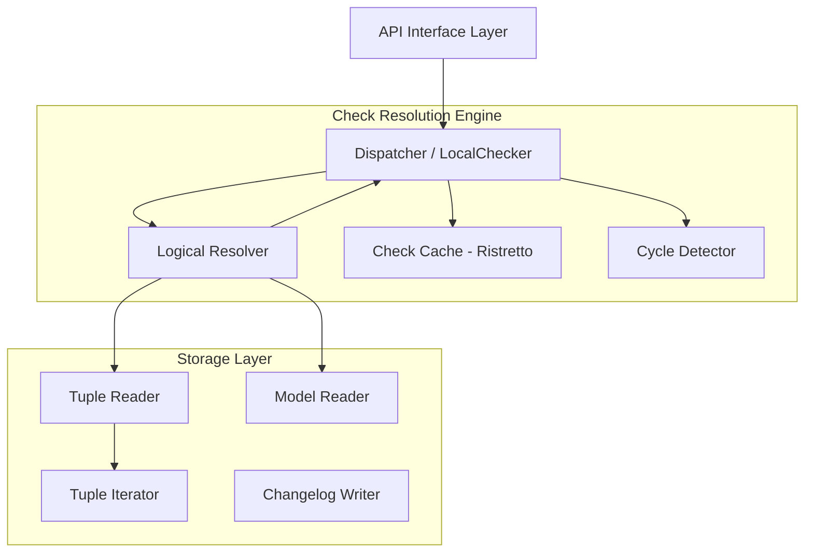
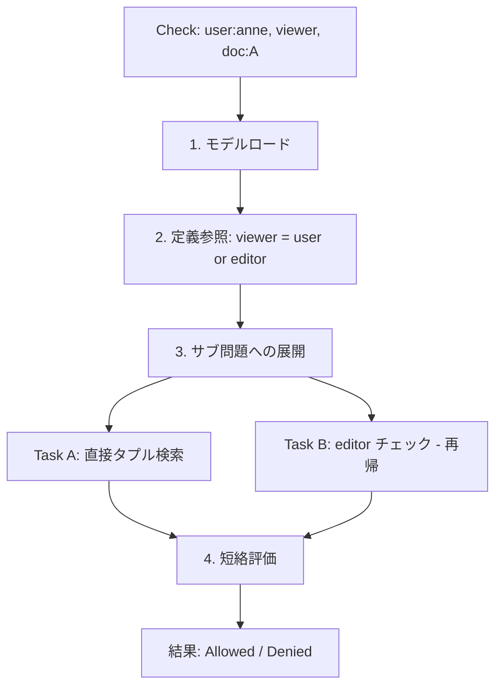

## 1. 認可システムのパラダイムシフト

現代の分散システムにおいて、セキュリティの要である「認可（Authorization）」は、かつてない複雑さに直面しています。
認証（Authentication）は「あなたが誰であるか」を特定するプロセスです。OpenID Connect 等の標準化によって成熟しました。
一方、認可は「あなたが何をできるか」を決定するプロセスです。アプリケーション固有のロジックとしてコードベースの深部に埋め込まれ、サイロ化し続けてきました。

OpenFGA（Open Fine-Grained Authorization）は、この課題に対する解として登場した CNCF（Cloud Native Computing Foundation）のサンドボックスプロジェクトです。
その起源は、Google が社内の数十億ユーザー規模のサービス（YouTube, Google Drive, Calendar, Maps 等）の認可を一元管理するために開発したシステム「Zanzibar」にあります。
OpenFGA は Zanzibar の論文に基づいたオープンソース実装です。従来のロールベースアクセス制御（RBAC）の限界を超え、リレーションシップベースアクセス制御（ReBAC）を標準化することを目指しています。

本記事では、OpenFGA の「構造（Architecture）」と「内部で扱うデータ（Internal Data）」を徹底的に解剖します。
C4 モデルを用いた階層的なアーキテクチャ分析、物理的および論理的なデータモデルの詳解、そしてそれらがどのように相互作用してミリ秒単位の認可決定を実現しているかについて、技術的な深掘りを行います。


## 2. 認可モデルの進化と ReBAC

OpenFGA の構造を理解するには、「なぜ従来の RBAC/ABAC では不十分で、ReBAC が必要なのか」という理論的背景の理解が必要です。

### 2.1 従来の認可モデルの限界

長年、認可のデファクトスタンダードは RBAC（Role-Based Access Control）でした。
RBAC は「ユーザー」に「ロール（役割）」を割り当て、「ロール」に「権限（パーミッション）」を紐付けるモデルです。
組織構造が静的で、リソースの階層が浅いエンタープライズアプリケーションには適していました。

しかし、現代のコラボレーションツールやソーシャルプラットフォーム、マイクロサービスアーキテクチャにおいては、以下の限界が露呈します。

| 特性                 | RBAC の限界                                                              | ABAC の課題                                                  | ReBAC - OpenFGA のアプローチ                                                           |
| :------------------- | :----------------------------------------------------------------------- | :----------------------------------------------------------- | :------------------------------------------------------------------------------------- |
| **粒度**             | 粗い。「管理者」か「一般」かの区分になりがちで、リソース単位の制御が困難 | 細かい制御が可能だが、ポリシーが複雑化しやすい               | リソース単位の細かい制御を、グラフ上の関係性として自然に表現                           |
| **スケーラビリティ** | ロール数増加による「ロール爆発」の発生                                   | ルール評価の計算コストが高く、大規模データセットの検索が困難 | グラフ探索により「誰がアクセスできるか」と「何にアクセスできるか」の双方を高速に解決   |
| **関係性の表現**     | 「所有権」「親子関係」「共有」といった動的な関係の表現が困難             | 属性として表現可能だが、関係の連鎖を扱うのが困難             | グラフ理論に基づき、ノード間のエッジとして定義。推移的な権限継承をネイティブにサポート |

### 2.2 Zanzibar モデルと ReBAC の核心

OpenFGA が採用する ReBAC は、アクセス制御を「主語（Subject）、述語（Relation）、目的語（Object）」の三組（タプル）で表現される有向グラフとしてモデル化します。

Google の Zanzibar 論文が提唱し、OpenFGA が実装している核心的なアイディアは、認可チェックを**有向グラフにおける到達可能性問題（Reachability Problem）**に帰着させることです。
「ユーザーU はオブジェクトO に対して関係R を持っているか？」という問いは、「グラフ上で U から O へ、R というラベルの付いたパスが存在するか？」という探索問題として処理されます。

これにより、認可ロジックはアプリケーションコードから完全に分離されます。
統一されたデータストア上のデータ（タプル）と、それを解釈するモデル（スキーマ）として独立して管理されます。
これが OpenFGA のアーキテクチャ設計の根幹です。


## 3. 内部で扱うデータ

前章で述べた ReBAC の理論を、OpenFGA は「タプル」と「認可モデル」という 2 つのデータ構造で実現しています。
ここでは、グラフを構成するこれらの要素を微細な粒度で分析します。

### 3.1 コア・プリミティブ：リレーションシップ・タプル

OpenFGA におけるデータの最小単位であり、システム内の「事実（Fact）」を構成するのがリレーションシップ・タプルです。
リレーショナルデータベースの行（Row）に相当しますが、意味論的にはグラフのエッジ（辺）です。

#### 3.1.1 タプルの構造

論理的なタプルは以下の 4 つの要素で構成されます。

```json
{
  "user": "string",
  "relation": "string",
  "object": "string",
  "condition": "object (optional)"
}
```

各フィールドには、OpenFGA 固有の厳密な制約と拡張機能があります。

| フィールド           | データ型       | 説明                                      |
| :------------------- | :------------- | :---------------------------------------- |
| **User - 主体**      | `type:id`      | アクセスの主体を表現                      |
| **Relation - 関係**  | string         | 認可モデルで事前定義された関係名          |
| **Object - 対象**    | `type:id`      | アクセス制御の対象リソース                |
| **Condition - 条件** | Name + Context | ABAC 要素を取り込む拡張フィールド（任意） |

各フィールドの詳細を以下に示します。

**User（主体）** は最も柔軟性が高いフィールドです。以下の 3 種類の値を格納できます。

| 指定方式                 | 例                 | 説明                                 |
| :----------------------- | :----------------- | :----------------------------------- |
| 単一ユーザー             | `user:anne`        | 特定のユーザーを直接指定             |
| ユーザーセット           | `group:eng#member` | グループのメンバー全員を間接的に指定 |
| パブリックワイルドカード | `user:*`           | 全ユーザーを指定                     |

ユーザーセットを user 側に配置可能にすることで、ネストされたグループや間接的な権限付与を「再帰的なポインタ」としてデータ化しています。
グループメンバーシップの展開は、書き込み時ではなく読み取り時（Check 時）に行う遅延評価モデルです。

**Relation（関係）** は単なるラベルではなく、グラフ探索の「ルール」へのポインタとして機能します。
あるリレーション（例: `viewer`）が他のリレーション（例: `editor`）を包含するように定義できます。
データ上は `editor` だけが存在しても、論理的には `viewer` も存在します。

**Object（対象）** は `document:roadmap` のように型と ID のペアで表現します。
ID は文字列として扱われますが、特殊文字の扱いや最大長（MySQL バックエンドでは特に制約あり）に注意が必要です。

**Condition（条件）** は Google CEL（Common Expression Language）で記述されたロジックへの参照です。
条件付きタプルにより、「IP アドレスが範囲内」「現在時刻が勤務時間内」といった環境コンテキストを評価時に注入できます。

### 3.2 認可モデル

タプルが「データ」であるなら、認可モデルはそれを解釈するための「スキーマ」または「型定義」です。
OpenFGA では、これを DSL（Domain Specific Language）または JSON 形式で定義し、バージョン管理します。

以下は、ドキュメント管理システムの認可モデルを OpenFGA DSL で記述した例です。

```
model
  schema 1.1

type user

type group
  relations
    define member: [user]

type folder
  relations
    define parent: [folder]
    define viewer: [user, group#member] or parent.viewer

type document
  relations
    define parent: [folder]
    define owner: [user]
    define editor: [user, group#member]
    define viewer: [user, group#member] or editor or owner or parent.viewer
```

この DSL では、`document` の `viewer` リレーションが 4 つのソースから解決されることを宣言しています。直接指定されたユーザー、`editor`、`owner`、および親フォルダの `viewer`（TTU）です。

#### 3.2.1 型システムと集合演算

認可モデルの強力さは、リレーション定義における**集合演算（Set Operations）**にあります。
各リレーションは、どのユーザーがその関係を持つかを定義する「集合」として扱われます。

| 演算                                 | 定義例                         | 説明                                                                                                                                   |
| :----------------------------------- | :----------------------------- | :------------------------------------------------------------------------------------------------------------------------------------- |
| **This - Direct**                    | `[user]`                       | 直接タプルとして保存されたユーザー                                                                                                     |
| **Computed Usersets - Union / OR**   | `[user] or editor`             | 他のリレーションを持つユーザーを包含。権限の階層構造（編集者は閲覧者でもある）を表現                                                   |
| **Intersection - AND**               | `[user] and allowed_viewers`   | 複数の条件を同時に満たす必要がある場合に使用                                                                                           |
| **Difference - Exclusion / BUT NOT** | `[user] but not blocked_users` | 特定のセットを除外。ブロックリストの実装に必須                                                                                         |
| **Tuple-to-Userset - TTU**           | `parent.viewer`                | オブジェクト間の関係（parent）を辿り、リンク先オブジェクトのユーザーセット（viewer）を動的に取り込む。グラフの「動的なエッジ生成」機能 |

TTU は OpenFGA の最も高度な機能の一つです。
ドキュメント自体には viewer タプルが一つもなくても、親フォルダに viewer がいれば、TTU によって論理的なエッジが生成され、アクセスが可能になります。
フォルダ階層のような再帰的な構造を、データの複製なしに実現できます。

#### 3.2.2 例: ドキュメント管理システム

典型的なドキュメント管理システムにおける概念モデルを図示します。



| 要素名   | 説明                                                                                                                       |
| :------- | :------------------------------------------------------------------------------------------------------------------------- |
| User     | アクセスの主体。ユーザー ID で識別                                                                                         |
| Group    | ユーザーの集合。member リレーションでユーザーを含む                                                                        |
| Folder   | リソースの階層構造。parent リレーションで親子関係を表現                                                                    |
| Document | アクセス制御の対象。viewer は直接指定、editor 経由、parent フォルダの viewer 経由（TTU）で解決される複雑な合成リレーション |


## 4. 構造

OpenFGA のシステム構造を、C4 Model（Context, Container, Component）の 3 階層で分析します。

### 4.1 Level 1: System Context Diagram

最上位の視点において、OpenFGA は外部システム（Relying Party）に対して「認可の決定」という専門機能を提供するサービスとして位置づけられます。



| 要素名              | 説明                                                                                |
| :------------------ | :---------------------------------------------------------------------------------- |
| End User            | 外部ソフトウェアシステムの利用者                                                    |
| Relying Application | 対象アプリケーション（例: CMS, SaaS）。OpenFGA の判定に基づき権限を強制             |
| API Gateway         | リクエストをインターセプトし、バックエンドサービスへの転送前に OpenFGA へ問い合わせ |
| OpenFGA Service     | 細粒度認可エンジン。リレーションシップタプル、モデルを保存し、アクセス判定を実行    |
| Backend Datastore   | 永続ストレージ（PostgreSQL, MySQL, SQLite）。タプルとチェンジログを保存             |

**構造のポイント:**

- **責務の分離**: アプリケーションはビジネスロジックとリソースの状態管理に集中し、認可の複雑さを OpenFGA にオフロードします
- **書き込みと読み取りの二重性**: アプリケーションは、リソースの作成・変更タイミングで「タプルの書き込み」を行い、ユーザーのアクセスタイミングで「権限チェック」を行います。この同期のラグが整合性モデルの課題となります（後述）

### 4.2 Level 2: Container Diagram

OpenFGA サーバー内部の論理的なコンテナ構成と、外部インターフェースの境界を詳細化します。
OpenFGA は単一のバイナリとして配布されますが、内部的には明確に分離されたレイヤーを持ちます。



| 要素名                    | 説明                                                                                                                     |
| :------------------------ | :----------------------------------------------------------------------------------------------------------------------- |
| API Interface Layer       | Go 実装。gRPC/HTTP Mux で認証、リクエスト検証、プロトコル変換を担当                                                      |
| Check Resolution Engine   | Go 実装の並行リゾルバ。グラフ探索のオーケストレーション、DSL ロジックの評価、再帰管理を担当                              |
| Caching Mechanism         | Ristretto ライブラリによるインメモリキャッシュ。チェック結果と DB イテレータオブジェクトをキャッシュし、レイテンシを削減 |
| Storage Adapter Interface | Go Interface による抽象化。SQL 方言の差異を吸収し、コネクションプールを管理                                              |

**詳細:**

- **API Interface Layer**: HTTP（Port 8080）と gRPC（Port 8081）の両方を公開します。gRPC はマイクロサービス間通信で低遅延・高スループットを実現するために推奨されます。認証ミドルウェアもここで動作し、Preshared Key または OIDC トークンを検証します
- **Storage Adapter Abstraction**: OpenFGA の設計上の強みは、ストレージ層の抽象化にあります。コアロジックは特定の SQL 方言を知らず、共通のインターフェースを通じてデータを操作します。将来的な新しいバックエンド（例: CockroachDB, TiDB 等の NewSQL）への対応が容易です

### 4.3 Level 3: Component Diagram

OpenFGA の心臓部である「Query Engine（Resolver）」と「Storage Layer」の内部コンポーネント構造を展開します。



| 要素名                    | 説明                                                                                                                                                            |
| :------------------------ | :-------------------------------------------------------------------------------------------------------------------------------------------------------------- |
| Dispatcher / LocalChecker | Check リクエストをサブ問題に分割するオーケストレーター。resolve-node-limit（深さ制限）や resolve-node-breadth-limit（並列数制限）に基づき、Goroutine で並列解決 |
| Logical Resolver          | モデルロジック（Union, Intersection, TTU）を評価し、true/false を判定                                                                                           |
| Check Cache               | User, Relation, Object の三つ組の結果をキャッシュし、再計算を防止                                                                                               |
| Cycle Detector            | グラフ探索における循環参照（無限ループ）を検知。訪問済みパスを追跡し、循環を検出すると即座にエラーまたは False を返却                                           |
| Tuple Reader              | リレーションシップタプルの読み取りとフィルタリングロジックを実装する DAO                                                                                        |
| Model Reader              | イミュータブルな認可モデルを ID で取得する DAO                                                                                                                  |
| Tuple Iterator            | カーソルベースのページネーションで大量の結果セットを DB からメモリにストリーミングし、OOM を防止                                                                |
| Changelog Writer          | タプル変更を記録し、監査と一貫性トークン生成に使用する DAO                                                                                                      |


## 5. データストレージと解像アルゴリズム

### 5.1 データベース・スキーマ設計

OpenFGA はリレーショナルデータベースを使用しますが、グラフのエッジストアとして最適化されています。

#### 5.1.1 relation_tuples テーブル

システムの主要なデータストアです。

| カラム名          | データ型    | 説明                                                                     |
| :---------------- | :---------- | :----------------------------------------------------------------------- |
| store_id          | string/UUID | マルチテナンシーのパーティションキー。全クエリがこの ID でフィルタリング |
| object_type       | string      | オブジェクトの型（例: document）                                         |
| object_id         | string      | オブジェクトの識別子                                                     |
| relation          | string      | 関係の名前（例: viewer）                                                 |
| user              | string      | ユーザー識別子。ユーザーセットやワイルドカードも文字列として格納         |
| ulid              | string      | ソート可能な一意の ID。書き込み順序の保証やページネーションに使用        |
| condition_name    | string      | Nullable。条件付きタプルの条件名                                         |
| condition_context | json/blob   | Nullable。条件評価時に渡される静的引数                                   |

**インデックス戦略:** OpenFGA のパフォーマンスは適切なインデックスに依存しています。以下の 2 種類のクエリパターンに対応する複合インデックスが必須です。

| クエリパターン                                  | インデックス構成                                 |
| :---------------------------------------------- | :----------------------------------------------- |
| **Check Query** - "can user U access object O?" | store_id, object_type, object_id, relation, user |
| **List Query** - "what can user U access?"      | store_id, user, relation, object_type            |

#### 5.1.2 authorization_models テーブル

認可モデルは **イミュータブル（不変）** として保存されます。

| カラム名            | 説明                                                                                                                     |
| :------------------ | :----------------------------------------------------------------------------------------------------------------------- |
| id                  | モデルの一意な ID                                                                                                        |
| schema_version      | DSL のバージョン                                                                                                         |
| serialized_protobuf | 型定義の本体。Protobuf 形式でシリアライズされ、BLOB として保存。アプリケーション側でのデシリアライズと高速なロードを実現 |

### 5.2 チェック解像アルゴリズム

OpenFGA のコアである Check API が呼び出された際、内部で実行されるアルゴリズムは、静的なグラフ探索と動的な論理評価のハイブリッドです。

**シナリオ:** `Check(user:anne, relation:viewer, object:doc:A)`



| 要素名           | 説明                                                                                                             |
| :--------------- | :--------------------------------------------------------------------------------------------------------------- |
| モデルロード     | メモリ上のキャッシュから store_id に対応する認可モデルを取得                                                     |
| 定義参照         | doc:A の型定義内の viewer リレーション定義を参照。例: `define viewer: [user] or editor`                          |
| サブ問題への展開 | 論理和（or）の場合、Resolver が 2 つの並列タスク（Goroutine）を起動                                              |
| Task A           | DB に `user:anne, viewer, doc:A` という直接タプルが存在するか確認                                                |
| Task B           | `user:anne` は `doc:A` の editor であるか再帰的にチェック                                                        |
| 短絡評価         | Task A がタプルを発見した場合、即座に Allowed: true を返し、実行中の Task B をキャンセル（Context Cancellation） |

**TTU の場合の動作:**

定義が `define viewer: parent.viewer`（TTU）の場合、アルゴリズムはまず `doc:A` の parent 関係にあるオブジェクト（例: `folder:B`）を DB から全件取得（Iterator）します。
その後、各親オブジェクトに対して `Check(user:anne, viewer, folder:B)` を再帰的に発行します。

このアルゴリズムは、設定された resolve-node-limit（深さ）に達するとエラーとなり、無限ループや過度なリソース消費を防ぐ安全装置が組み込まれています。

### 5.3 主要 API

OpenFGA は Check 以外にも、認可グラフを活用する複数の API を提供しています。

| API             | 用途                                                    | 内部動作                                                                               |
| :-------------- | :------------------------------------------------------ | :------------------------------------------------------------------------------------- |
| **Check**       | 「user U は object O に relation R を持つか？」を判定   | 前述のグラフ探索アルゴリズムで到達可能性を評価                                         |
| **ListObjects** | 「user U が relation R を持つ全 object を列挙」         | 逆引きインデックスを使用し、該当するオブジェクトを全件探索。Check の逆方向クエリに相当 |
| **ListUsers**   | 「object O に relation R を持つ全 user を列挙」         | グラフを逆方向にたどり、到達可能な全ユーザーを収集                                     |
| **Expand**      | 「object O の relation R のユーザーセットツリーを展開」 | グラフ探索の中間結果をツリー構造で返却。デバッグや権限の可視化に活用                   |

ListObjects は、UI 上で「このユーザーがアクセスできるリソース一覧」を表示する際に必須の API です。
内部的には Check とは異なるインデックスパスを使用するため、本番環境では List 用の逆引きインデックスの最適化が重要になります。


## 6. 運用

### 6.1 Zanzibar Consistency と OpenFGA のアプローチ

Google Zanzibar の最大の特徴は「Z-Cookie」による強力な一貫性保証（New Enemy Problem の解決）です。
OpenFGA においても、分散システムにおけるデータ整合性は重要なテーマです。

| 設定                  | 説明                                                                                                           |
| :-------------------- | :------------------------------------------------------------------------------------------------------------- |
| **デフォルト**        | 結果整合性（Eventual Consistency）で動作。キャッシュが有効な場合、直前の書き込みが即座に反映されない可能性あり |
| **HigherConsistency** | Check API の consistency パラメータで設定。キャッシュをバイパスし、データベースの最新状態を参照                |
| **Changelog**         | changelog テーブルで変更履歴を追跡。特定時点でのクエリやキャッシュの無効化ロジックに利用                       |

### 6.2 キャッシング戦略とパフォーマンス

OpenFGA のパフォーマンス（低レイテンシ）は、強力なキャッシュ機構が支えています。

| キャッシュ層       | 技術                    | 役割                                                                                                                                                                                      |
| :----------------- | :---------------------- | :---------------------------------------------------------------------------------------------------------------------------------------------------------------------------------------- |
| **Check Cache**    | Ristretto（Go library） | Check リクエストの結果（Allow/Deny）をキャッシュ。キーは model_id, user, relation, object。TTL 設定可能。頻繁にアクセスされるリソースの判定を高速化するが、Staleness とのトレードオフあり |
| **Iterator Cache** | In-Memory               | DB クエリの結果セット（イテレータ）をキャッシュ。TTU のような展開コストが高いリレーションに対して効果を発揮                                                                               |

運用上の推奨事項として、Check Cache を有効にしつつ、整合性が重要な操作には consistency フラグを使用するハイブリッドアプローチが推奨されます。

### 6.3 テレメトリーと可観測性

本番環境での運用において、OpenFGA は Prometheus 形式のメトリクスと OpenTelemetry トレーシングをネイティブサポートしています。

| 可観測性    | 主なデータ                                                                                                                                                             |
| :---------- | :--------------------------------------------------------------------------------------------------------------------------------------------------------------------- |
| **Metrics** | fga-client.request.duration（リクエスト所要時間）、fga-client.query.duration（内部処理時間）、go_goroutines（並列数）。ボトルネックの特定（DB 待ちか計算待ちか）に活用 |
| **Tracing** | Check リクエストのサブ問題分割と評価パスを可視化。複雑な認可モデルのデバッグに必須                                                                                     |

## 7. まとめ

OpenFGA は、マイクロサービス時代の認可基盤として、以下の方向へ進化しつつあります。

- **エコシステムの拡大**: Kubernetes, API Gateway（Kong, Envoy）, Service Mesh（Istio）との統合が進み、インフラ層での認可強制が容易に
- **モデルの表現力向上**: ABAC 機能（Conditions）の拡充により、より複雑なビジネスルール（時間、場所、クオータ）に対応
- **ストレージの進化**: 現在の SQL バックエンドに加え、ネイティブなグラフデータベースや分散 KVS への対応を期待

### 他の認可ツールとの比較

| 観点             | OpenFGA                                                         | OPA / Rego                                 | Casbin                       |
| :--------------- | :-------------------------------------------------------------- | :----------------------------------------- | :--------------------------- |
| **モデル**       | ReBAC（グラフベース）                                           | ABAC / ポリシーベース                      | RBAC / ABAC / RESTful        |
| **データストア** | 内蔵（PostgreSQL, MySQL 等）                                    | 外部データソースからプル                   | アダプタ経由で各種 DB        |
| **得意領域**     | リソース間の関係性が複雑なドメイン（Google Drive 型の権限継承） | API ポリシー、Kubernetes Admission Control | 単一アプリ内のシンプルな認可 |
| **スケール**     | 数十億タプル規模を想定した設計                                  | ポリシー評価のインメモリ処理               | アプリケーション組み込み型   |
| **起源**         | Google Zanzibar                                                 | CNCF Graduated                             | 学術研究ベース               |

OpenFGA の差別化要因は、「リレーションシップデータを専用ストアで管理し、グラフ探索で認可判定を行う」というアーキテクチャです。
OPA がポリシーの評価エンジンであるのに対し、OpenFGA はデータ（関係性）の管理と探索に特化しています。

結論として、OpenFGA は「認可データのための専門的なグラフ探索エンジン」です。
その内部構造は、計算（Resolver）と記憶（Storage）を分離し、高度に並列化されたアルゴリズムによって、大規模かつ複雑な権限モデルを実用的な速度で解決します。


## 参考リンク

- 公式ドキュメント
  - [OpenFGA: Fine-Grained Authorization](https://openfga.dev/)
  - [Introduction to FGA](https://openfga.dev/docs/fga)
  - [Concepts](https://openfga.dev/docs/concepts)
  - [Get Started with Modeling](https://openfga.dev/docs/modeling/getting-started)
  - [Conditions](https://openfga.dev/docs/modeling/conditions)
  - [Authorization Through Organization Context](https://openfga.dev/docs/modeling/organization-context-authorization)
  - [Model Migrations](https://openfga.dev/docs/modeling/migrating/migrating-models)
  - [Configuring OpenFGA](https://openfga.dev/docs/getting-started/setup-openfga/configure-openfga)
  - [Docker Setup Guide](https://openfga.dev/docs/getting-started/setup-openfga/docker)
  - [OpenFGA Configuration Options](https://openfga.dev/docs/getting-started/setup-openfga/configuration)
  - [Running OpenFGA in Production](https://openfga.dev/docs/best-practices/running-in-production)
  - [Query Consistency Modes](https://openfga.dev/docs/interacting/consistency)
  - [Configure SDK Client Telemetry](https://openfga.dev/docs/getting-started/configure-telemetry)
- GitHub
  - [openfga/openfga](https://github.com/openfga/openfga)
  - [openfga/internal/graph/check.go](https://github.com/openfga/openfga/blob/main/internal/graph/check.go)
- 記事
  - [Announcing OpenFGA - Auth0's Open Source Fine Grained Authorization System](https://auth0.com/blog/auth0s-openfga-open-source-fine-grained-authorization-system/)
  - [OpenFGA: Fine-Grained Authorization - Medium](https://medium.com/@demonhost1/openfga-fine-grained-authorization-27dc8d1eed84)
  - [Query Consistency Options in OpenFGA](https://openfga.dev/blog/query-consistency-options-announcement)
