`oblien/openship` は、Git リポジトリを指定するだけでビルド・SSL・ドメイン設定・監視までを自動化する、セルフホスト型のデプロイメントプラットフォームです。セルフホストと SaaS (Openship Cloud) を同一コードベースで動かし、デスクトップアプリ・Web ダッシュボード・CLI の 3 つのインターフェースを持ちます。本記事は、リポジトリのソースコード・DB マイグレーション・CI 定義・GitHub Issues を一次情報として、構造・データ・構築・利用・運用を整理します。

> **同名の別プロダクトに注意**: 本記事の対象は **[oblien/openship](https://github.com/oblien/openship)**(セルフホスト型デプロイ基盤)です。同名の [junaid33/openship](https://github.com/junaid33/openship)(EC の注文ルーティング/ドロップシッピング基盤)とは**まったく別のプロダクト**です。検索すると両者が混ざるため、区別してください。

> **調査時点と対象コミット**: 2026-07-19 に調査しました。対象は `v0.1.11`(2026-07-18 リリース、tag SHA `97d917c`)で、ソースの引用は調査時点の `main`(`0d80383`)を参照しています。本文中のファイル数・テーブル数・CLI フラグ・Issue 状態はこの時点の値です。
>
> 本文の参考リンクは可読性のため `main` を指しています。**数値を厳密に再現するときは `main` を `0d80383` に読み替えてください。** 活発に開発されているため、`main` の内容は随時変わります。

README の機能表は「CI/CD・CDN・メールサーバ・自動スケール」と広い面を主張します。実際にソースツリーを読んで裏を取ったところ、**主張と実装が一致しない箇所が複数ありました**。本文の該当箇所で詳述しますが、採用判断に直結するものを先に挙げます。

- **メールサーバ機能は「未統合」**。`apps/email/ARCHITECTURE.md` の冒頭が `Status: target state, not current` と明記しており、iRedMail エンジンと Zero Webmail が並存するだけの段階です。
- **Cloud では `vercel.json` 由来のルーティングが適用されない**。同梱の要件書が「cloud には OpenResty が無いため、設定は永続化されるが適用されない」と自認しています。
- **CDN・自動スケール・マルチノードは実装が見つからない**。README 自身も Status 節で「multi-node clusters は Coming next」と書いており、Features 表と矛盾します。
- **CI がテストスイートを実行していない**。`.test.ts` は 40 ファイル存在しますが、`ci.yml` は typecheck のみ、`release.yml` はビルドのみです。
- **Apache-2.0 の本体に GPL v3 の同梱物がある**。`apps/email/engine/` は iRedMail 1.8.1 のベンダリングです。
- **単一コンテナのデプロイにネットワーク分離が無い**。相互不信のマルチテナント用途には向きません。

一方で、コア機能 (CI/CD・ドメイン/SSL・バックアップ・権限モデル) は実装の裏付けが取れており、設計も丁寧です。**PoC・検証用途なら十分に候補**ですが、**本番採用は対象環境での事前検証が前提**になります。


## 概要

公式サイトのキャッチコピーは "Deploy anything. Own everything." です。コードを push するだけでデプロイが完結し、そのインフラの所有権は利用者側に残る、という位置づけを掲げています。Vercel や Heroku のような体験を、自分が管理するサーバー上で再現することを狙ったプロダクトです。

### 位置づけ

- ライセンスは Apache-2.0 です。ソースコードは公開されています。
- セルフホスト用サーバーと Openship Cloud (SaaS) は同一コードベースです。環境変数 `OPENSHIP_TARGET` で役割が切り替わります。
- デプロイ先はプロジェクト単位で local (自ホストマシン) / server (SSH 接続先) / cloud (Openship Cloud) の 3 種類から選べます。1 プロジェクトはこのいずれか 1 つに固定されます。
- Vercel / Railway のような SaaS 専業 PaaS と異なり、自社サーバーへの完全なセルフホストを主軸に据えています。

### 類似ツールとの比較

セルフホスト型 PaaS 領域の主要プロダクトと比較しました。

| プロダクト | デプロイ方式 | セルフホスト可否 | 対応スタック | 付属機能 (DB / メール / CDN) | 成熟度 | ライセンス |
|---|---|---|---|---|---|---|
| **openship** | Git push / CLI / Docker Compose | 可 (Cloud も選択可、同一コードベース) | Node / Python / Go / Rust / PHP / Ruby / Java / .NET / Docker (静的検出) | DB: ○ (イメージカタログ) / メール: △ 未統合 (iRedMail エンジンと Zero Webmail が並存するのみ) / CDN: ソース上の裏付け未確認 | v0.1.11、初回リリース 2026-06-20、star 約 2,000、実質単独開発 | Apache-2.0 (同梱の `apps/email/engine` は GPL v3) |
| Vercel | Git push / CLI | 不可 (SaaS 専業) | フロントエンド系フレームワーク中心 (Next.js 等) + サーバーレス | DB: 外部連携のみ / メール: なし / CDN: ○ (自社エッジ網) | 2015 年〜。上場企業運営で業界標準級の実績 | プロプライエタリ |
| Coolify | Git push / Webhook / CLI | 可 | 汎用 (コンテナ化できるもの全般)、280+ のワンクリックサービス | DB: ○ (ワンクリック導入 + 自動バックアップ) / メール: なし / CDN: なし | 2021 年〜。star 約 5.9 万。コミュニティが活発 | Apache-2.0 |
| Dokploy | Git push / Docker Compose / CLI | 可 | Nixpacks / Buildpacks / Dockerfile / Compose | DB: ○ (MySQL・Postgres・MongoDB・MariaDB・Redis) / メール: なし / CDN: なし | 2024 年〜。star 約 3.6 万。運営法人あり。2026 年にライセンスを整理 | Apache-2.0 (将来の有償機能は Source Available ライセンス) |
| CapRover | Git push / CLI / Webhook | 可 | Node / Python / PHP / Java / Ruby / .NET / コンテナ全般 | DB: ○ (ワンクリックアプリ) / メール: なし / CDN: なし | 2017 年〜。star 約 1.5 万。枯れた実績 | Apache-2.0 |
| Heroku | `git push heroku main` | 不可 (SaaS 専業) | Buildpacks による多言語対応 | DB: ○ (アドオン課金) / メール: アドオン課金 / CDN: アドオン課金 | 2007 年〜。Salesforce 傘下。PaaS の原型的存在 | プロプライエタリ |
| Railway | Git push / CLI (Nixpacks 自動検出) | 不可 (SaaS 専業) | Nixpacks 自動検出 + Dockerfile | DB: ○ (マネージドテンプレート) / メール: なし / CDN: 明記なし | 2020 年〜。月間 1,000 万超のデプロイを処理する規模に成長 | プロプライエタリ |

### ユースケース別の推奨

| ユースケース | 推奨 | 理由 |
|---|---|---|
| インフラ運用なしで最速公開したい | Vercel / Railway | セルフホスト不要で実績のある SaaS |
| 自社 VPS で枯れたツールを使いたい | Coolify / CapRover | 運用実績が長く、コミュニティ規模も大きい |
| 既存の Docker Compose 構成をそのまま自己ホストしたい | Coolify / Dokploy | Compose ネイティブ対応が明確 |
| セルフホストとクラウドを同一運用で行き来したい | openship | local / server / cloud を同一ダッシュボードで扱える設計。ただし公開 1 か月弱のツールである点は要考慮 |
| ミッションクリティカルな本番基盤 | Coolify / CapRover / Heroku | 実績・star 数・コントリビュータ層の厚さで優位 |

## 特徴

### 実装をソースで確認できた機能

- Git push によるデプロイと CLI (`openship deploy`) からのデプロイ
- プレビュー環境のデプロイ (`--env preview`)
- Docker Compose 構成のそのままデプロイ (`deployments/compose/` 配下にビルド・デプロイ・ルーティングの実装あり)
- ロールバック (`deployments/rollback/` モジュール)
- カスタムドメインと Let's Encrypt による自動 SSL (`domains/`, `ssl.service.ts`)
- データベース等のイメージカタログからの一発デプロイ (`images.service.ts`。Openship Cloud 側のカタログをプロキシする設計)
- バックアップとリストア (cron / 手動 / デプロイ前 / Webhook の 4 種のトリガー、保持期間のプルーニングまで実装)
- ビルドログのリアルタイムストリーミング (SSE ベースの `terminal-logs.ts` 等)
- 一時公開用トンネリング (Cloudflare / ngrok / Oblien 提供トンネルに対応)
- デスクトップアプリ・Web ダッシュボード・CLI・REST API・MCP という複数インターフェース
- セルフホストとクラウド間のインスタンス移行機能 (`migrate-instance` / `migrate-to-cloud` / `migrate-to-tunnel`)
- 幅広い言語・フレームワークの静的検出 (`stack-detector.ts`。Next.js / Nuxt / SvelteKit / Django / Rails / Spring Boot 等、多数のフレームワークをルールベースで検出)

### README の主張のみで、ソース上の裏付けが未確認な機能

- **CDN (エッジキャッシュ、HTTP/3、Brotli 圧縮)**: ソースツリー全体を検索しましたが、該当する実装ファイルは見つかりませんでした。
- **自動スケーリングとマルチノード対応**: ソースツリー全体に scale / replica / cluster に相当する実装が見つかりませんでした。README 自身も「Coming next (今後追加予定)」の項目としてマルチノードクラスタを挙げています。

### メールサーバ機能は部品が並存する段階 (未統合)

README は "Built-in SMTP with DKIM/SPF/DMARC" を機能として謳っていますが、`apps/email/ARCHITECTURE.md` 自身が冒頭で次のように明記しています。

> Status: target state, not current. Today only the engine (iRedMail) and Zero (server + client) exist side-by-side. This document is the blueprint we're moving toward.

つまり現状は次の 3 つの部品が並存しているだけで、openship の機能としての統合は完了していません。

| パス | 正体 |
|---|---|
| `apps/email/engine/` | iRedMail 1.8.1 インストーラのベンダリング (GPL v3、Postfix / Dovecot / Amavisd / ClamAV / SpamAssassin / iRedAPD / Fail2ban) |
| `apps/email/server/` | パッケージ名 `@zero/server` (v0.2.0)。Webmail バックエンド |
| `apps/email/client/` | パッケージ名 `@zero/mail` (v0.1.0)。React Router 製 Webmail UI |

`mail/admin/domain-dns.service.ts` に DKIM/SPF/DMARC レコードを組み立てるコード自体は存在しますが、上記の統合状況を踏まえると「メールサーバー機能が完成している」とは言えません。openship 本体は Apache-2.0 ですが、同梱の iRedMail エンジンは GPL v3 で提供されており、利用形態によってはライセンス面の確認が必要です。

### 「AI-assisted」の実体

公式ドキュメントは "Intelligent build detection, config generation, and diagnostics" を謳っていますが、実装 (`stack-detector.ts` 等) は STACKS レジストリに基づく静的なルールベース検出でした。生成 AI・LLM を呼び出す実装は確認できませんでした。

### 成熟度の正直な提示

採用判断のために、以下の事実を踏まえてください。

| 項目 | 値 |
|---|---|
| 最新リリース | v0.1.11 (2026-07-18) |
| 初回リリース | v0.1.0-rc.1 (2026-06-20)。公開から約 1 か月 |
| 主要コントリビュータ | Hydralerne 氏がほぼ単独 (104 コミット)。ほか shiv19 氏 (1 コミット) |
| star 数 | 約 2,000 (2026-07-19 時点、増加中)。比較対象 (Coolify 約 5.9 万 / Dokploy 約 3.6 万 / CapRover 約 1.5 万) と比べて若い |
| README 上のステータス表記 | "Production-ready core, actively developed" |
| README が今後の追加予定として明記する機能 | マルチノードクラスタ、ロードバランシング UI、プライベートネットワーキング、高度な監視、ビジュアル CI/CD パイプライン |

CI/CD・ドメイン/SSL・バックアップといったコア機能は、ソースツリー上の実装で裏付けが取れています。一方で、公開から約 1 か月・実質単独開発という体制は、長期の保守継続性やセキュリティ対応の速度という観点でリスク要因になります。CDN や自動スケーリングのようにソース上の裏付けが取れない主張、メールサーバーのように部品は存在しても統合が未完了の機能もあるため、本番のミッションクリティカルな用途で採用する場合は、実際の環境での動作検証を挟むことを推奨します。個人開発の検証・PoC 用途であれば、この若さは大きな障害にはなりません。

## 構造

openship は単一のモノレポで、セルフホスト運用と Openship Cloud (SaaS) を同一コードベースで動かします。本章では、C4 model の 3 段階でこの内部アーキテクチャを図解します。

### 環境変数によるロール切替

ソースコード上、インスタンスの役割を決める環境変数は 2 系統あります。ブリーフの要約 (`OPENSHIP_TARGET` のみで自己ホスト/Cloud が切り替わる) は簡略化されており、実際は直交する 2 軸です。

| 軸 | 環境変数 | 役割 | 実装確認箇所 |
|---|---|---|---|
| インスタンスの身元 | `OPENSHIP_TARGET` | `local` / `cloud-saas` / `local-saas` のうちどの行を使うか。ダッシュボード・API の URL とポート、self-hosted かどうかを決める | `packages/core/src/runtime-config.ts` |
| デプロイ実行モード | `DEPLOY_MODE` (+ `CLOUD_MODE`) | `docker` / `bare` / `cloud` / `desktop`。Runtime・Routing・SSL・Systemのどの実装 (アダプタ) を使うかを決める | `apps/api/src/config/env.ts`, `apps/api/src/lib/controller-helpers.ts` の `resolvePlatformConfig()` |

`resolvePlatformConfig()` の優先順位は次のとおりです。

1. `CLOUD_MODE=true` または `DEPLOY_MODE=cloud` → `target: "cloud"`
2. `DEPLOY_MODE=desktop` → `target: "desktop"`
3. それ以外 → `target: "selfhosted"`、`runtime` は `DEPLOY_MODE` が `bare` なら `bare`、それ以外は `docker`

実装を確認: `packages/adapters/src/platform.ts` の `createPlatform()` がこの `target` を受けて Runtime / Routing / SSL / System の実装を組み立てます。

### システムコンテキスト図

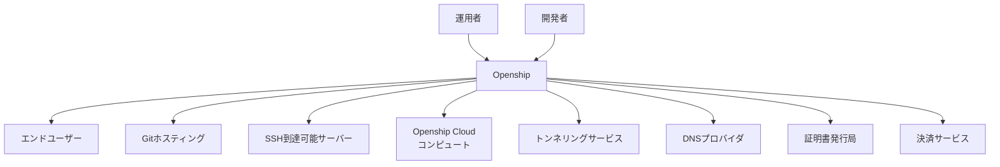

| 要素名 | 説明 |
|---|---|
| 運用者 | セルフホストインスタンスを構築・運用する担当者 |
| 開発者 | プロジェクトを登録しデプロイを行う利用者 |
| エンドユーザー | デプロイ済みアプリケーションへアクセスする訪問者 |
| Openship | 本調査対象のセルフホスト型デプロイメントプラットフォーム |
| Gitホスティング | リポジトリ連携・OAuth/App認証・Webhook配信元 |
| SSH到達可能サーバー | セルフホストのデプロイ先サーバー (server ターゲット) |
| Openship Cloudコンピュート | クラウドターゲットのデプロイ先SaaS |
| トンネリングサービス | 公開IPを持たないインスタンスを外部公開する中継 |
| DNSプロバイダ | ドメイン検証・デプロイ前チェックの照会先 |
| 証明書発行局 | TLS証明書発行を行うACME局 |
| 決済サービス | サブスクリプション課金の処理先 |

### コンテナ図

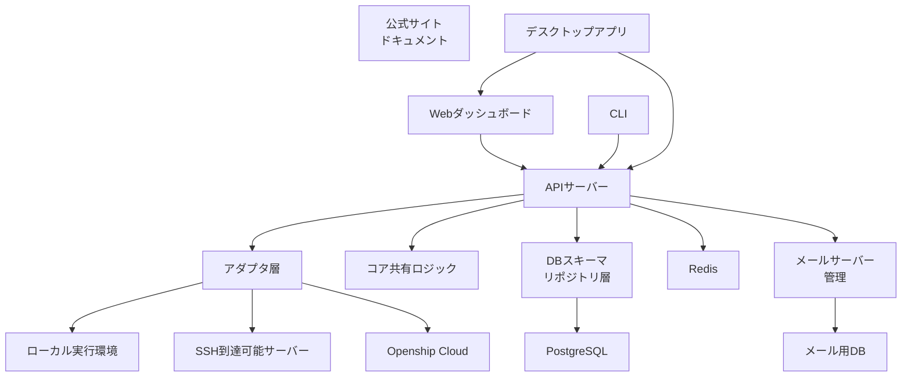

| 要素名 | 説明 |
|---|---|
| Webダッシュボード | プロジェクト管理・デプロイ操作のUI (Next.js、`apps/dashboard`) |
| 公式サイト ドキュメント | 製品サイトと利用ドキュメント (Next.js、`apps/web`) |
| CLI | ターミナルからのデプロイ・運用操作 (npm `openship`、`apps/cli`) |
| デスクトップアプリ | APIサーバーとダッシュボードを内部にバンドルするElectronアプリ。組み込みDB (PGlite) とインプロセスジョブランナーを使い、PostgreSQL/Redisに依存しない (`apps/desktop/src/main/services.ts`) |
| APIサーバー | プロジェクト・デプロイ・ドメイン・権限を管理する制御プレーン本体 (Hono、`apps/api`) |
| アダプタ層 | 実行環境・ルーティング・システム管理を抽象化する層 (`packages/adapters`) |
| コア共有ロジック | 言語検出・ワークスペース解析などのフレームワーク非依存ロジック (`packages/core`) |
| DBスキーマ リポジトリ層 | Drizzleによるスキーマ定義とリポジトリ実装 (`packages/db`) |
| PostgreSQL | プロジェクト・デプロイ等の永続化先 |
| Redis | ジョブキュー・キャッシュ・レート制限の共有状態。単体自己ホストでは未設定時にインメモリへ自動フォールバックするが、`CLOUD_MODE`では必須 |
| メールサーバー管理 | セルフホストメール機能の管理UI/エンジン連携 (`apps/email`) |
| メール用DB | メールボックス等のスキーマ (`packages/db-email`) |
| ローカル実行環境 | インスタンス自身のマシン上で動くDocker/Bareプロセス (deploy target = local) |
| SSH到達可能サーバー | SSH接続で管理するリモートのデプロイ先 (deploy target = server) |
| Openship Cloud | クラウドターゲットのデプロイ先SaaS (deploy target = cloud) |

### コンポーネント図

`apps/api/src/modules/` 配下の26モジュールをドリルダウンします。

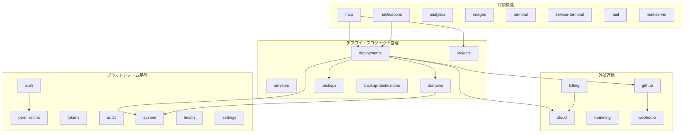

#### デプロイ・プロジェクト管理

| 要素名 | 説明 |
|---|---|
| deployments | ビルド・デプロイパイプライン、ロールバック、プリフライト、定期再同期を統括 |
| projects | プロジェクトのCRUD・環境変数・リソース設定・フォルダインポート |
| services | プロジェクト内マルチサービス (compose) のコンテナ管理 |
| domains | カスタムドメインの検証とルーティング適用 |
| backups | バックアップの実行・復元オーケストレーション (cron・手動・Webhook・デプロイ前トリガー) |
| backup-destinations | バックアップ保存先 (ローカル・S3・SFTP) の管理 |

#### 外部連携

| 要素名 | 説明 |
|---|---|
| github | リポジトリ連携、OAuth/GitHub App認証、Webhook受信、クローン認証 |
| cloud | Openship Cloudとのトークン発行・セッション管理・エッジプロキシ |
| tunneling | Cloudflare/ngrok/Oblienトンネルエージェントの接続維持 |
| webhooks | 汎用Webhook配信の管理 |
| billing | サブスクリプション課金、Stripe/Oblien連携、利用上限制御 |

#### プラットフォーム基盤

| 要素名 | 説明 |
|---|---|
| auth | 認証ルーティング (Better Auth) |
| permissions | 権限・招待の管理 |
| tokens | Personal Access Tokenの発行 |
| audit | 監査ログの記録・保持 |
| system | サーバーセットアップ、マイグレーション、サーバー疎通確認、ファイルシステム操作 |
| health | ヘルスチェックエンドポイント |
| settings | インスタンス設定の管理 |

#### 付加機能

| 要素名 | 説明 |
|---|---|
| mcp | Model Context Protocolサーバーとしての操作公開 |
| notifications | 通知の配信 |
| analytics | プロジェクトのトラフィック解析集計 |
| images | 画像のアップロード・配信 |
| terminal | サーバー向けインタラクティブターミナル |
| service-terminal | サービスコンテナ向けターミナル |
| mail | セルフホストメールサーバーの管理機能 |
| mail-server | メールルーティングの登録 |

### ネットワーク構成図

制御プレーンと3つのデプロイ先 (local / server / cloud) の関係、SSH接続、トンネリング、ドメイン・SSL経路を図解します。

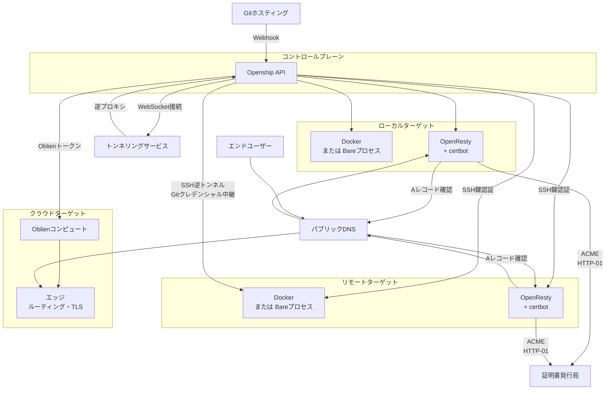

#### コントロールプレーン

| 要素名 | 説明 |
|---|---|
| Openship API | プロジェクト・デプロイ・ドメインを一元管理し、3つのデプロイ先を統括するAPIサーバー |

#### ローカルターゲット

| 要素名 | 説明 |
|---|---|
| Docker または Bareプロセス | インスタンス自身のマシン上で動くコンテナまたは直接プロセス |
| OpenResty + certbot | ローカルホスト上のリバースプロキシとTLS証明書管理 |

#### リモートターゲット

| 要素名 | 説明 |
|---|---|
| Docker または Bareプロセス | SSH接続先サーバー上で動くコンテナまたは直接プロセス |
| OpenResty + certbot | リモートサーバー上のリバースプロキシとTLS証明書管理 |

#### クラウドターゲット

| 要素名 | 説明 |
|---|---|
| Oblienコンピュート | Openship Cloud側のビルド・実行基盤 |
| エッジ ルーティング・TLS | Openship Cloudのルーティング・TLS終端・静的ホスティング |

#### 外部要素

| 要素名 | 説明 |
|---|---|
| パブリックDNS | ドメイン検証・プリフライトのAレコード照会先 |
| 証明書発行局 | certbotが要求するACME HTTP-01チャレンジの発行局 |
| トンネリングサービス | 公開IPを持たないコントロールプレーンを外部公開する中継 (Cloudflare / ngrok / Oblien) |
| Gitホスティング | Webhook配信元・クローン元 |
| エンドユーザー | デプロイ済みアプリケーションへのアクセス元 |

補足事項:

- SSH接続は2系統あります。`DockerRuntime` は dockerode 経由でDockerデーモンに直接接続 (ソケット・SSHトンネル・TLS) し、それ以外 (Bareプロセス操作・OpenResty設定書き込み・システムチェック) は共有の `CommandExecutor` (`LocalExecutor`/`SshExecutor`) が担います。両者は別経路です (`packages/adapters/docs/EXECUTOR.md`)。SSH 認証は**秘密鍵・パスワード・SSH agent の 3 方式に対応**します (CLI の `--auth-method` / `--password`、`ssh-client.ts` が `password` / `privateKey` / `agent` を ssh2 へ委譲)。
- `SSH逆トンネル Gitクレデンシャル中継` はデスクトップアプリ限定の機能です。デプロイ時に「Forward my git credentials」を選んだ場合のみ、ビルド期間中だけ開くリレーで、リモートサーバー上のgitクローンにローカルの`gh`トークンを中継します。トークン自体はリモートのディスクや環境変数には残りません (`apps/api/src/lib/git-forwarding/README.md`)。
- クラウドターゲットのプロジェクトは、自己ホストインスタンスに実体を持ちません。ダッシュボードは常に自インスタンスのAPIと通信し、クラウドプロジェクト向けの操作だけがOpenship Cloudへプロキシされます (`apps/web/content/docs/architecture/cloud-as-source.mdx`)。
- `エッジ ルーティング・TLS` (CloudEdge) はTLS終端・静的ホスティングを担いますが、`vercel.json`由来のルーティング設定 (静的アセット/APIプロキシの振り分け) はセルフホストの`LocalProxy`/`RemoteProxy` (OpenResty) でのみ適用され、Cloud側では未適用です。詳細は次節「セルフホストとCloudのルーティング機能パリティのギャップ」を参照 (`docs/oblien-edge-routing-requirements.md`)。

### 重要な食い違い: ドキュメントとソースの不一致 (Traefik → OpenResty)

`packages/adapters/docs/ARCHITECTURE.md` は Routing/SSL 層を `TraefikProvider` (Traefikへ YAML を書き込む) と記載していますが、これは古い記述です。

- ソースツリー全 2,182 blob(`git/trees/main?recursive=1` の `type=="blob"` 件数)中、`traefik` を含むファイル名は0件 (`packages/adapters/src/infra/` には `nginx.ts` / `openresty-lua.ts` のみ存在)
- `packages/adapters/src/infra/index.ts` のバレルエクスポートは `NginxProvider` / `CloudInfraProvider` / `NoopInfraProvider` のみで、`TraefikProvider` は存在しない
- `packages/adapters/src/index.ts` 冒頭のアーキテクチャコメントも `2. Infra → routing (OpenResty) + SSL (certbot/ACME) - separate from runtime` と明記
- `packages/adapters/src/platform.ts` のコメント表・実装は `Nginx` (OpenResty) + `certbot` と明記
- 公式ドキュメント `apps/web/content/docs/architecture/runtime-model.mdx` も「セルフホストはOpenResty (nginx) でルーティング、certbotでLet's Encrypt証明書」と記載
- `apps/api/src/lib/domain-ssl.ts` のコメントも certbot 前提の設計

したがって、本レポートの構造図は実装を確認した `OpenResty + certbot` を採用し、`packages/adapters/docs/ARCHITECTURE.md` のTraefik記述は追随していません。同ドキュメントは開発初期の設計から更新されていない可能性があります。

### 重要な実装事実: セルフホストとCloudのルーティング機能パリティのギャップ

Infra層には `vercel-routing.ts` があり、openship は各プロジェクトの `vercel.json` ルーティング設定 (静的アセットを`/`に、バックエンドを`/api/*`にリバースプロキシ、リダイレクト・ヘッダー等) をパースします。

- **セルフホスト**: パース結果を **OpenResty設定にコンパイル**して適用します。
- **Cloud (Oblien)**: OpenRestyが存在しないため、同じ設定は**永続化されるが適用されません**。

根拠は `docs/oblien-edge-routing-requirements.md` の原文です。

> openship parses each repo's `vercel.json` routing config and, on **self-hosted**, compiles it to OpenResty so a deployment behaves like Vercel — one domain serving static assets at `/` and reverse-proxying a backend at `/api/*`, plus redirects/headers. On **cloud (Oblien)** there is no OpenResty, so this config is currently **persisted but not applied**.

同ドキュメントは、openship側は既にパーサー・永続化された設定・コンパイラ抽象化を持っており、不足しているのは **Cloud向けのemitterのみ**と述べています。つまり、セルフホストとCloudのInfra経路 (`NginxProvider` vs `CloudInfraProvider`) は実装成熟度に差があり、`vercel.json`ルーティングはセルフホスト限定の機能です。ネットワーク構成図の「クラウドターゲット」経路にはこの制約が伴います。

### 重要な食い違い: メールサーバーは目標アーキテクチャ

`apps/email/ARCHITECTURE.md` は冒頭で明記しています。

`apps/email/ARCHITECTURE.md` が `Status: target state, not current` と明記しているとおり、統合は未完了です(原文は「特徴」節を参照)。

コンテナ図・コンポーネント図に記載した `mail` / `mail-server` モジュールおよび `apps/email` は、このドキュメントが描く目標構成 (openship API が `packages/db-email` 経由でメールVPSのPostgresへ直接書き込み、公開の管理APIを持たない設計) を反映していますが、**現時点ではエンジン (iRedMail) と Zero が個別に存在する段階で、エンドツーエンドの統合は未完成**です (`mail` / `mail-server` モジュールや DNS レコード生成コード自体は存在します)。README記載のDKIM/SPF/DMARC等のメール機能は、この目標アーキテクチャに基づく主張であり、ソース上の完全な裏付けは未確認です。

## データ

openship の DB スキーマ (`packages/db/drizzle/0000_init.sql` 〜 `0034_nervous_surge.sql`、Drizzle ORM / PostgreSQL) を根拠に、概念モデルと情報モデルを示します。

対象は `oblien/openship`(セルフホスト型デプロイメントプラットフォーム)です。`packages/db/src/repos/*.ts` のリポジトリ一覧と突き合わせ、認証基盤・Webhook 冪等性・GC キューなどの補助テーブルを除いたドメイン概念 26 種類を対象としています。除外したテーブルは本章の末尾に一覧します。

### 概念モデル

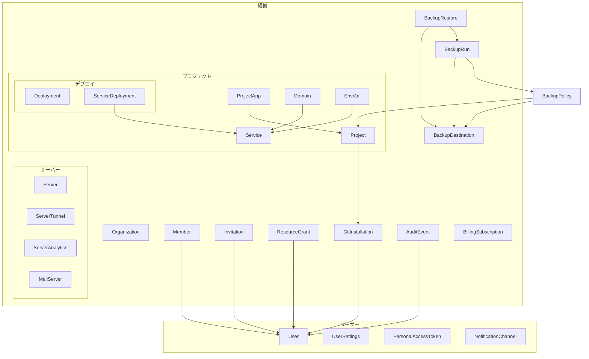

BackupPolicy はバックアップ対象 (Project / Service / MailServer のいずれか 1 つ) と BackupDestination を紐づける設定です。対象が 3 種類のいずれかになるため、特定の subgraph には固定所属させていません。

#### 組織

| 要素名 | 説明 |
|---|---|
| Organization | テナントの単位。課金プラン・サブスクリプション状態を保持します |
| Member | 組織に所属する User とそのロールです |
| Invitation | 組織への招待です |
| ResourceGrant | User に対する個別リソースへの権限付与です |
| GitInstallation | GitHub App のインストール単位です |
| BackupDestination | バックアップの保存先です (S3 互換 / SFTP 等) |
| BackupRun | バックアップ実行の記録です |
| BackupRestore | バックアップからの復元実行の記録です |
| AuditEvent | 監査ログです |
| BillingSubscription | Stripe と同期する課金サブスクリプションの状態です |

#### プロジェクト

| 要素名 | 説明 |
|---|---|
| ProjectApp | Git リポジトリに対応するアプリの単位です。複数の Project (環境) を束ねます |
| Project | 1 つのデプロイ環境です (production / preview 等) |
| Domain | Project または Service に紐づくホスト名と SSL 状態です |
| EnvVar | Project または Service スコープの環境変数です |
| Service | compose 定義、またはモノレポ sub-app 1 つ分のデプロイ単位です |

#### デプロイ

| 要素名 | 説明 |
|---|---|
| Deployment | 1 回のデプロイ実行の記録です |
| ServiceDeployment | Deployment 内の Service 1 つ分の実行結果です |

#### サーバー

| 要素名 | 説明 |
|---|---|
| Server | SSH 接続対象のセルフホストサーバーです |
| ServerTunnel | Server 上のポートを外部公開するトンネル設定です |
| ServerAnalytics | Server 上のドメイン別アクセス集計です (分単位、地域別日次集計を含みます) |
| MailServer | Server 上に構築されたメールサーバーです |

#### ユーザー

| 要素名 | 説明 |
|---|---|
| User | アカウント本体です |
| UserSettings | User 単位のビルド・デプロイ既定値設定です |
| PersonalAccessToken | User が発行する API アクセストークンです |
| NotificationChannel | User の通知送信先です (メール等) |

### 情報モデル

> **型表記について**: 下図の型は**論理型**です。物理的な PostgreSQL 型とは次のように対応します。`map` / `list` は実体が `jsonb`(一部 `text`。例: `ResourceGrant.permissions_json` は `text`)、バイト数を表す `integer` は `bigint`、`ServerAnalytics.response_time` の `decimal` は `real` です。カラム名はすべて実スキーマ(`packages/db/drizzle/meta/0034_snapshot.json`)に実在するものだけを記載しています。

26 エンティティを 1 枚に描くと読めないため、**組織・ユーザー・権限 / プロジェクトとデプロイ / バックアップ / サーバーとメールサーバー**の 4 つに分けて示します。図をまたぐ関連は最後に表でまとめます。

#### 組織・ユーザー・権限

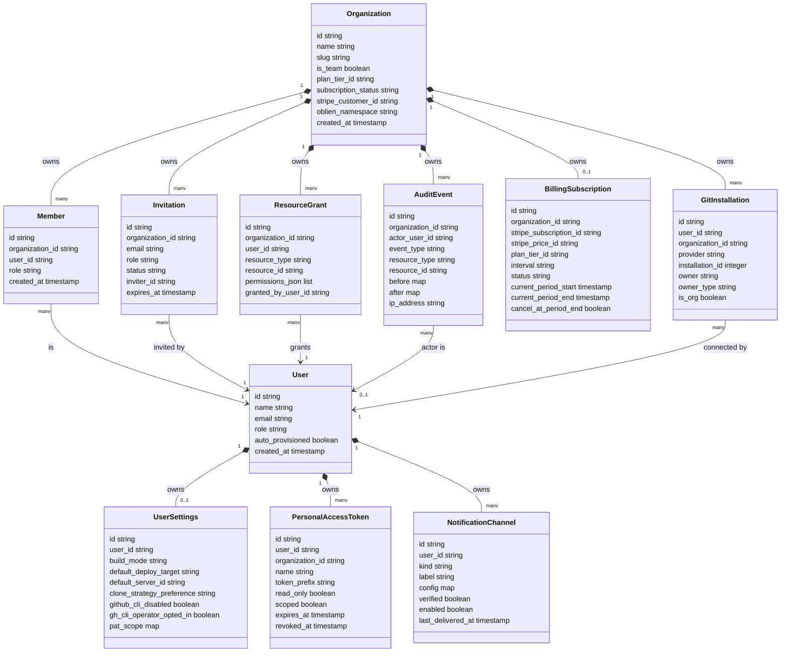

#### プロジェクトとデプロイ

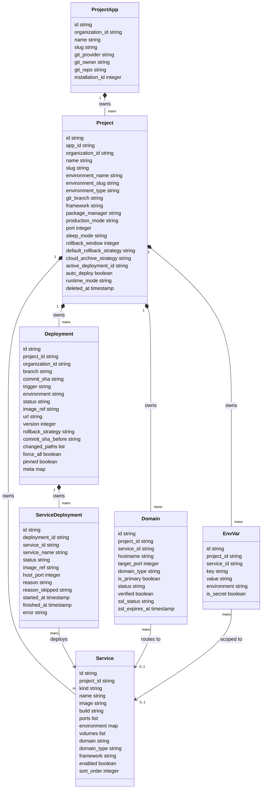

#### バックアップ

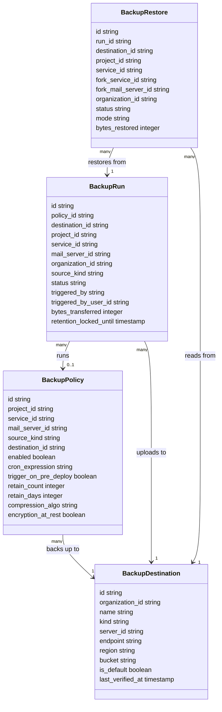

#### サーバーとメールサーバー

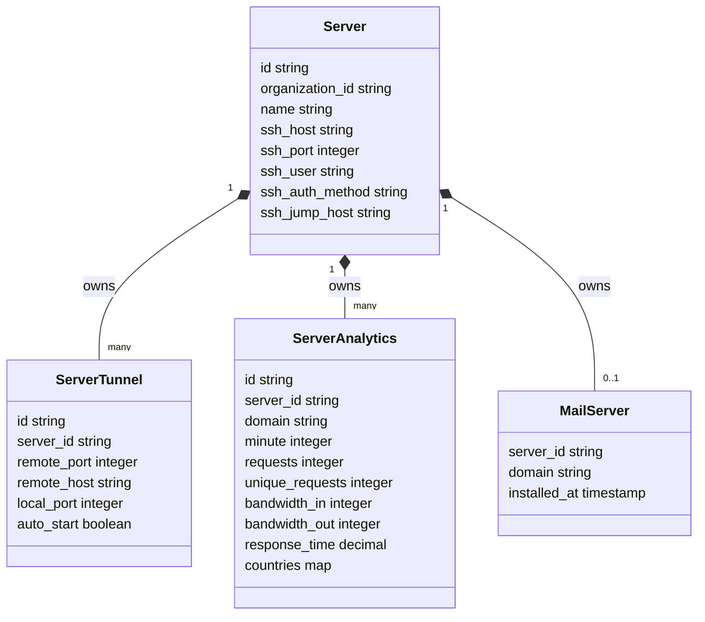

#### グループをまたぐ関連

上の 4 図に収まらない、グループ間の関連です。

| 参照元 | 参照先 | 多重度 | 関連 |
|---|---|---|---|
| Organization | Server | 1 対 many | owns |
| Organization | BackupDestination | 1 対 many | owns |
| Organization | BackupRun | 1 対 many | owns |
| Organization | BackupRestore | 1 対 many | owns |
| Organization | ProjectApp | 1 対 many | owns |
| Project | GitInstallation | many 対 0..1 | uses |

### 除外した補助テーブル

スキーマ上は存在しますが、概念モデル・情報モデルには含めていないテーブルです。

| テーブル名 | 除外理由 |
|---|---|
| Session / Account / Verification | better-auth ライブラリ由来の認証基盤テーブルで、openship 固有のドメイン概念ではありません |
| GithubInstallState / CloudHandoffCode | 短命なワンタイムトークンによる認可ブリッジです |
| StripeWebhookEvent / OblienWebhookEvent / GithubWebhookEvent | Webhook の二重処理を防ぐための受信済み ID 台帳です |
| StripeTopupGrant / BillingAnniversaryGrant | 課金処理の冪等性を保証する実行済みフラグです |
| CreditPack / BillingCustomer | BillingSubscription を補助するデータです。旧 credit_balance / credit_grant / credit_consumption / oblien_usage_cursor はマイグレーション `0011_remove_credit_ledger` で削除済みです |
| InvitationPendingGrant / PersonalAccessTokenGrant | Invitation / PersonalAccessToken に付随する権限の内訳行です |
| OAuthApplication / OAuthAccessToken / OAuthConsent | MCP クライアント向け OAuth 認可の内部状態です |
| CloudWebhookBinding | Cloud プロジェクト向け GitHub Webhook のルーティング設定です |
| OrphanedResource | インフラ資源の後始末 (ガベージコレクション) 用の再試行キューです |
| DeploymentCheckRun / BuildSession | Deployment / ServiceDeployment のステータスを補足する GitHub Checks 連携・ビルドログです |
| TerminalSession / ServiceTerminalSession | Server / Service への対話的ターミナル接続ログです |
| InstanceSettings | セルフホストインスタンス単体のグローバル設定です (シングルトン行) |
| ServerAnalyticsGeo | `server_analytics_geo`。ServerAnalytics とは**別テーブル**で、地域別の日次集計を保持します |
| NotificationDefault / NotificationSubscription / NotificationDelivery | NotificationChannel とは別の 3 テーブルで、通知カテゴリの既定値・購読設定・配信履歴を保持します |

上記を含め、最終スキーマの全 54 テーブルのうち、概念モデル・情報モデルに採用したのが 26 種、本表で除外理由を示したのが 28 種です。

### 補足: データ所有権

`apps/web/content/docs/architecture/data-ownership.mdx` によれば、Project は local / server / cloud のいずれか 1 種類に完全に属し、分割されません。local / server の Project とその Deployment / Domain / EnvVar / ログは、インスタンス自身の DB のみに存在します。cloud の Project は Openship Cloud 側が正本で、インスタンスの DB にシャドウコピーは持ちません。

## 構築方法

本章は openship の CLI ソース (`apps/cli/src/`) と公式ドキュメント (`apps/web/content/docs/*.mdx`)、インストールスクリプト (`scripts/install.sh`)、`docker-compose.yml`、`.env.example` を一次情報として、インストール・初期セットアップ・基本操作をまとめます。

> **注記 — 公式 API ドキュメントは Cloud のサーフェスを説明しています**: `apps/web/content/docs/api.mdx` は `Bearer os_key_...` で `https://api.openship.io/v1/projects` を叩く例を掲載しています。ホスト名が示すとおり、これは **Openship Cloud (SaaS) の REST サーフェス**であり、そのバックエンドは本リポジトリに含まれません (`os_key_` の出現はリポジトリ全体で当該ドキュメント 1 箇所のみ)。
>
> 一方、**セルフホストのインスタンスが実装しているのは `/api/...` 配下のパスと `opsh_pat_...` プレフィックスの Bearer トークン**です (`apps/api/src/app.ts` / `apps/api/src/lib/pat.ts` / CLI の `lib/api-client.ts` で確認)。
>
> 問題は「ドキュメントが古い」ことではなく、**同ドキュメントが Cloud 向けである旨を明示していない**ことです。セルフホスト利用者がこの例をそのまま試すと失敗します。本記事はセルフホストを主対象とするため、以降は実装側のパス・トークン形式を正として記述します。

### 前提条件

- **対応 OS**: Linux 全般 (公式ドキュメントの推奨は Ubuntu 22.04 以上、Ubuntu 24.04 推奨)。macOS / Windows はデスクトップアプリまたは CLI (Windows は WSL 推奨) で利用します。
- **リソース目安** (installation.mdx 記載の自己ホスト向け):

| コンポーネント | 最小 | 推奨 |
|---|---|---|
| CPU | 2 コア | 4 コア以上 |
| RAM | 2 GB | 4 GB 以上 |
| ディスク | 20 GB | 50 GB 以上 (SSD) |

- **ランタイム**: CLI・API とも [Bun](https://bun.sh) 前提です。リポジトリの `.bun-version` は `1.3.10`、`package.json` の `packageManager` も `bun@1.3.10` を指定しています。
- **Node.js**: `.nvmrc` は `22`、ルート `package.json` の `engines.node` は `>=22.0.0` です。CLI の配布物 (`dist/index.js`) は Node シェバン (`#!/usr/bin/env node`) 付きですが、Node が無い環境では Bun 単体でも実行できます (後述のインストーラ参照)。
- **Docker Compose で構築する場合**: Docker / Docker Compose v2 (`docker compose` サブコマンド) が必要です。`openship service sync` も内部で `docker compose config` を呼び出すため同様です。

### インストール方法 (複数手段)

`apps/cli/src/index.ts` に定義された `up` / `stop` / `install` / `update` コマンド、および `scripts/install.sh` を根拠に、次の 4 通りの導入経路があります。

#### 1. ワンライナー (`get.openship.io`)

`scripts/install.sh` の実装:

- Bun 未導入なら `curl -fsSL https://bun.sh/install | bash` で `~/.bun` に導入
- `bun add -g openship` で CLI をグローバルインストール (npm レジストリからパッケージ取得、npm コマンド自体は使わない)
- Node.js が見つからない環境では、`openship` コマンドを Bun 経由で起動するラッパースクリプトに差し替える

```bash
curl -fsSL https://get.openship.io | sh
```

環境変数 `OPENSHIP_VERSION` でバージョン固定も可能です。

```bash
OPENSHIP_VERSION=0.1.9 sh -c "$(curl -fsSL https://get.openship.io)"
```

#### 2. 任意のパッケージマネージャ

```bash
npm i -g openship
# または
pnpm add -g openship
yarn global add openship
bun add -g openship
```

#### 3. Docker Compose (ソースクローン)

`docker-compose.yml` は postgres / redis / api / dashboard / web の 5 サービス構成です。

```bash
git clone https://github.com/oblien/openship.git
cd openship
cp .env.example .env      # BETTER_AUTH_SECRET・INTERNAL_TOKEN など編集必須
docker compose up -d --build
```

| サービス | 公開ポート | 役割 |
|---|---|---|
| postgres | 非公開 (`expose: 5432`) | データストア |
| redis | 非公開 (`expose: 6379`) | キュー・キャッシュ・レート制限 |
| api | `4000` | 制御プレーン (API) |
| dashboard | `3001` | Web ダッシュボード |
| web | `3000` | マーケティング / ドキュメントサイト |

`api` サービスの `DATABASE_URL` / `REDIS_URL` は compose の `environment:` でコンテナ間 DNS (`postgres:5432` / `redis:6379`) に上書きされます (`.env` の値より優先)。API 起動時に Postgres への自動マイグレーションが走ります。

#### 4. デスクトップアプリ

API・ダッシュボード・DB を 1 バイナリに同梱した GUI アプリです。

```bash
# CLI 経由 (GitHub Releases から自 OS/arch を判定し取得・SHA-256 検証・起動まで自動)
openship install
openship install --version v0.1.9 --no-launch
```

Linux は AppImage を直接ダウンロードすることもできます。

```bash
curl -fsSL -o Openship.AppImage \
  https://github.com/oblien/openship/releases/latest/download/Openship.AppImage
chmod +x Openship.AppImage
./Openship.AppImage
```

FUSE が無い環境では `./Openship.AppImage --appimage-extract-and-run` を使います。macOS (Apple Silicon / Intel 別 .dmg) と Windows (.zip) は GitHub Releases の直リンクから取得します。

### バージョン確認

```bash
openship --version
```

`apps/cli/src/index.ts` はビルド時 (`tsup` の `define`) に埋め込まれた `__CLI_VERSION__` を使って `Command.version()` に渡しています。

インストール後の疎通確認には次の 2 コマンドが使えます。

```bash
openship doctor
```

`doctor.ts` の実装は、設定ファイル (`~/.openship/config.json`) の有無、アクティブ context のトークン有無、API 疎通 (`GET /api/health`)、Node / Bun のランタイムバージョンを順に検査し、いずれかが失敗すると exit code 1 を返します (CI のゲートに使えます)。

```bash
openship status
```

`status.ts` の実装は `GET /api/health` と `GET /api/health/env` を叩き、`selfHosted` / `deployMode` / `authMode` / `teamMode` などインスタンスの実行モードを表示します。

## 利用方法

### CLI 必須パラメータ / グローバルオプション / 認証方式

`apps/cli/src/lib/config.ts`・`api-client.ts`・`output.ts` を根拠にまとめます。

| 項目 | 内容 |
|---|---|
| グローバルオプション | `--json`: 機械可読な JSON 出力に切り替え。JSON モードでは stdout はデータ専用になり、成功/情報メッセージ (`ok()` / `info()`) は抑制され stderr に回ります。エラー (`err()`) は常に stderr に出力 |
| 環境変数での JSON モード | `OPENSHIP_JSON=1` または `OPENSHIP_JSON=true`(`--json` と等価) |
| 認証方式 | Personal Access Token (PAT)。トークン文字列は `opsh_pat_` プレフィックス必須。リクエストは `Authorization: Bearer <token>` ヘッダーで送信 |
| ローカル実行時の認証 | `openship up` (foreground) はループバック (`127.0.0.1`) を zero-auth (`OPENSHIP_ALLOW_ZERO_AUTH=true`) で起動するため、ローカルの `openship` コマンドはトークン不要 |
| 設定ファイル | `~/.openship/config.json` (パーミッション `0600`)。`contexts` (名前付きの API URL・Dashboard URL・トークンの組) と、選択中を示す `current` を保持 |
| プロジェクト紐付けファイル | `.openship/project.json` (`openship init` が生成)。`projectId` / `name` / `slug` / `context` / `defaults.environment` を保持し、以後 `--project` を省略できる |
| API ベース URL | アクティブ context の `apiUrl` + `/api` (`getApiUrl()` = `${getConfiguredApiUrl()}/api`)。未設定時は `LOCAL_API_URL` (ローカルの既定 API URL) にフォールバック |

### コマンド全体像

`apps/cli/src/index.ts` は全コマンドを次のグループでまとめています (Program 名は `openship`)。

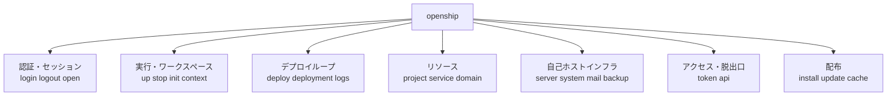

`cache` サブコマンドは独立コマンドではなく `installCommand.addCommand(cacheCommand)` により `openship install cache <path|list|verify|clean>` としてネストされています。

### コンテキスト管理・認証

複数の接続先 (ローカル / リモートサーバ / Openship Cloud) を切り替える仕組みです。

```bash
# ローカル起動 (loopback は無認証)
openship up

# リモート/クラウドインスタンスへ PAT でログイン
openship login --api-url https://your-server --token opsh_pat_xxxxx
# トークン省略時はダッシュボードの Settings を開いて対話的に貼り付け
# --api-url を省略するとローカル既定 (http://localhost:4000) に向くため、リモートでは必ず指定する
openship login --context prod --api-url https://your-server

openship logout --context prod

# コンテキストの一覧・切り替え・追加・削除
openship context list          # alias: ctx
openship context use prod
openship context add staging --api-url https://staging.example.com --token opsh_pat_xxx --use
openship context rm staging
```

`login` はトークンをそのまま保存する前に `GET /api/tokens` を叩いて有効性を検証し (200 で有効、403 は `settings:read` スコープ欠如の有効トークン)、無効なら保存しません。

### プロジェクトの CRUD 操作

`project.ts` は `apps/api/src/modules/projects/project.routes.ts` の各エンドポイントに 1:1 で対応しています。

```bash
# 一覧・詳細
openship project list                          # alias: projects
openship project get proj_xxxxx

# 作成
openship project create --name my-app \
  --git-owner you --git-repo my-app --git-branch main \
  --type app

# 削除 (確認プロンプトあり。-y でスキップ)
openship project delete proj_xxxxx --force --wipe-volumes -y

# 環境変数の読み書き (set は upsert/delete のマージ、フルリプレースではない)
openship project env get proj_xxxxx --environment production
openship project env set proj_xxxxx \
  --set DATABASE_URL="postgres://..." --set REDIS_URL="redis://..." \
  --unset OLD_KEY --secret

# Git 連携・自動デプロイ
openship project git link proj_xxxxx --owner you --repo my-app --branch main
openship project git auto-deploy proj_xxxxx --enable
openship project git branch proj_xxxxx main

# カスタムドメイン接続
openship project connect proj_xxxxx yourapp.com --include-www

# 有効化・無効化・スリープモード
openship project enable proj_xxxxx
openship project disable proj_xxxxx
openship project sleep-mode proj_xxxxx auto_sleep   # auto_sleep | always_on

# ランタイムログ
openship project logs proj_xxxxx --tail 200 --follow
openship project server-logs proj_xxxxx --domain yourapp.com --follow
```

`project create` の `--type` は `app | docker | services | monorepo` のいずれかです。

### サービス (compose スタック) の CRUD 操作

`service.ts` は複数サービス構成のプロジェクト (compose スタック) 内のサービスを操作します。すべてのサブコマンドで `-p/--project <id|slug|name>` が必須です。

```bash
openship service list -p my-stack
openship service get web -p my-stack

# 作成
openship service create db -p my-stack \
  --image postgres:16 --port 5432:5432 --env POSTGRES_PASSWORD=secret

# docker-compose.yml から一括同期 (ファイルにないサービスは削除される)
openship service sync ./docker-compose.yml -p my-stack -y

# コンテナ操作
openship service start web -p my-stack
openship service stop web -p my-stack
openship service restart web -p my-stack
openship service containers -p my-stack

# ドリフト解消 (ダッシュボード編集とリポジトリ変更が衝突した場合)
openship service drift accept web -p my-stack
openship service drift keep web -p my-stack

# サービス単位の環境変数
openship service env get web -p my-stack --env production
openship service env set web -p my-stack --env production DATABASE_URL=postgres://...

# ログ
openship service logs web -p my-stack --tail 200 --follow

# 削除
openship service delete web -p my-stack -y
```

`openship service exec` (コンテナ内シェル) はソース上 “not available yet” として明示的にエラーを返すスタブです。実装未完了のため利用できません。

### ドメイン・SSL の CRUD 操作

`domain.ts` は `apps/api/src/modules/domains/domain.routes.ts` に対応します。

```bash
openship domain list -p proj_xxxxx
openship domain add app.example.com -p proj_xxxxx --primary
openship domain preview app.example.com          # 保存せず必要な DNS レコードのみ確認
openship domain verify dom_xxxxx                  # DNS 検証 (未反映なら exit 1)
openship domain records dom_xxxxx
openship domain primary dom_xxxxx
openship domain renew dom_xxxxx                   # SSL 証明書を再発行
openship domain verify-ssl dom_xxxxx              # 再発行はせず有効性のみ再チェック
openship domain renew-all                          # 期限間近の証明書を一括更新
```

### デプロイの実行と管理

```bash
# デプロイ (git リポジトリ内なら git 経由、そうでなければフォルダアップロード)
openship deploy
openship deploy --env preview
openship deploy --branch main --commit <sha>
openship deploy --smart-route      # 直前のアクティブデプロイから変更されたサービスのみ再ビルド
openship deploy --watch            # ログを完了までストリーム表示

# 既存デプロイメントの管理
openship deployment list --project proj_xxxxx --env production
openship deployment get <deploymentId>
openship deployment redeploy <deploymentId> --use-existing-commit
openship deployment rollback <deploymentId>
openship deployment pin <deploymentId>
openship deployment cancel <deploymentId>
openship deployment restart <deploymentId>
openship deployment rm <deploymentId> -y

# ログ参照
openship logs <deploymentId> --follow
openship logs <deploymentId> --tail 100
```

`deploy` は `--env` に `production` か `preview` 以外を渡すとエラーで終了します。git リポジトリ外で `--commit` / `--service-ids` / `--smart-route` / `--refresh` のいずれかを指定すると、フォルダアップロードではなく git パスが強制されます。

### 設定ファイルの書き方

#### `~/.openship/config.json` (CLI 設定・認証情報)

`openship login` / `openship context add` が自動生成します。手で直接編集することも可能です。

```json
{
  "contexts": {
    "default": {
      "apiUrl": "http://localhost:4000",
      "dashboardUrl": "http://localhost:3001"
    },
    "prod": {
      "apiUrl": "https://api.example.com",
      "dashboardUrl": "https://app.example.com",
      "token": "opsh_pat_xxxxxxxxxxxx"
    }
  },
  "current": "prod"
}
```

旧バージョンのフラットな設定 (`{ token, apiUrl, dashboardUrl }`) は読み込み時に自動的に `default` context へ移行されます。

#### `.openship/project.json` (プロジェクト紐付け)

> `name` / `slug` は対話的に選択したときに保存される**任意項目**です。`openship init --project <id>` で ID を直接指定した場合はプロジェクト情報を再取得しないため、保存されないことがあります。

`openship init` がカレントディレクトリに作成します。

```bash
cd your-project
openship init                                   # 対話的にプロジェクトを選択
openship init --project proj_xxxxx --environment production
openship init --force                            # 既存リンクを上書き
```

```json
{
  "projectId": "proj_xxxxx",
  "name": "my-app",
  "slug": "my-app",
  "context": "prod",
  "defaults": { "environment": "production" }
}
```

#### `.env` (Docker Compose 用インスタンス設定)

ルート `.env.example` が Docker Compose・自己ホスト双方の設定リファレンスです。主な変数を抜粋します。

| 変数 | 用途 | 備考 |
|---|---|---|
| `CLOUD_MODE` | `false`=自己ホスト(既定) / `true`=SaaS | 課金・マルチテナントの唯一の切替スイッチ |
| `DEPLOY_MODE` | `docker`(既定) \| `bare` \| `cloud` \| `desktop` | ランタイム+インフラの組み合わせを決定 (`apps/api/src/config/env.ts` の enum で確認) |
| `DATABASE_URL` | Postgres 接続文字列 | 空なら PGlite 組み込み DB (開発用途、マルチテナント非対応と明記) |
| `REDIS_URL` | Redis 接続文字列 | ジョブキュー・キャッシュ・レート制限に使用 |
| `BETTER_AUTH_SECRET` | Better Auth の署名鍵 | 既定値のまま非デスクトップ環境で起動すると `env.ts` が起動時エラーを投げる |
| `INTERNAL_TOKEN` | Electron↔API 間などの内部トークン | デスクトップモード以外では未設定だと起動時エラー (`env.ts` で確認) |
| `HOST_DOMAIN` | 自己ホストの基底ドメイン | 無料サブドメイン `slug.HOST_DOMAIN` の払い出しに使用 |
| `GITHUB_APP_ID` 等 | GitHub App 連携 (CLOUD_MODE専用) | 自己ホストでは無視され、設定していると起動時に警告ログが出る (`env.ts` で確認) |

`apps/api/.env.example` は Docker を使わず API を単体起動する開発用の別ファイルで、`DATABASE_URL=file:./dev.db` (SQLite) や `DEPLOY_MODE=desktop` が既定になっている点がルートの `.env.example` と異なります。

### よく使うオプション

| オプション | 対応コマンド例 | 用途 |
|---|---|---|
| `--json` | 全コマンド共通 (グローバル) | 出力を機械可読 JSON に切り替え |
| `-y, --yes` | `project delete` / `service delete` / `service sync` / `deployment rm` / `system data-transfer import` / `system migration switch-back` | 破壊的操作の確認プロンプトをスキップ |
| `-f, --follow` | `logs` / `project logs` / `service logs` | SSE でログをストリーム表示 |
| `--follow` (短縮形なし) | `server install` / `backup policy run` / `backup run restore` | SSE で進捗をストリーム表示。**これらに `-f` は登録されていません** |
| `--tail <n>` | `logs` / `project logs` / `service logs` | 末尾 N 行のみ取得 (スナップショットモード) |
| `--watch` | `deploy` | デプロイ完了までログを追従表示 |
| `--force` | `project delete` / `install` (再ダウンロード) | 既存状態を無視して強制実行。**`up` に `--force` はありません** |
| `--context <name>` | `login` / `logout` / `open` | 対象コンテキストを明示指定 |
| `--dry-run` | `up` | サービス定義 (launchd/systemd/Scheduled Task) を出力するだけで実際にはインストールしない |

## 運用

> 本章は v0.1.11 時点の実装 (`apps/api/src/modules/`、`packages/adapters/`、`packages/db/`)、公式ドキュメント (`apps/web/content/docs/security/*.mdx`)、CI 定義、および GitHub Issues 全 14 件 (PR を除く) の実データを根拠にしています。README や同梱ドキュメントの主張は、ソース上の裏付けが取れたものだけ「実装を確認」と書き、取れないものは明示しています。

### 起動・停止

`openship up` は OS のサービス機構(Linux は systemd、macOS は launchd、Windows はタスクスケジューラ)にインストールし、OS 起動時に自動起動・障害時は自動再起動します。`openship stop` で自動再起動ごと停止します。

```bash
openship up                 # インストール + 常駐起動 (API :4000, dashboard :3001)
openship up --foreground    # フォアグラウンドで一時実行
openship up --no-ui         # API のみ (ダッシュボード無し)
openship stop               # 停止 (自動再起動も解除)
openship open                # ダッシュボードをブラウザで開く
```

セルフホストには実行モードが2つあります。どちらも同じコードベースですが DB バックエンドが異なります(それぞれ実装を確認)。

| モード | 起動方法 | DB |
|---|---|---|
| CLI / デスクトップアプリ | `openship up` / `openship install` | 組み込み PGlite (WASM Postgres、単一データディレクトリ) |
| Docker Compose | `docker compose up -d --build` | 独立コンテナの PostgreSQL 16 + Redis 7 |

### 状態確認

```bash
openship status   # アクティブ context の API ヘルス + デプロイモードを表示
openship doctor    # 設定・トークン・API 疎通・ランタイムを検査
```

- `status` は `GET /api/health` と `GET /api/health/env` を叩き、`selfHosted` / `deployMode` / `authMode` / `teamMode` / `machineName` / `hostDomain` などを表示します。`cloudAuthUrl` / `cloudApiUrl` は取得はしますが人間向け表示には出ず、`--json` 出力の `env` にのみ含まれます (`status.ts` の `HealthEnv` で確認)。
- `doctor` はいずれかの検査に失敗すると **exit code 1** を返すため、CI のデプロイ前ゲートに使えます(`apps/cli/src/commands/doctor.ts` で実装を確認)。
- `/api/health` は `{ status: "ok", timestamp: <ISO8601> }` を返すのみで、DB や Docker デーモンへの疎通確認は行いません。ロードバランサ/Docker のヘルスチェック向けの浅いチェックであり、依存先の死活監視までは兼ねません(`health.routes.ts` のコメントで実装を確認)。Docker Compose の `api` サービスはこの `/api/health` をヘルスチェックに使っています(`docker-compose.yml`)。

### ログ確認

```bash
openship logs <deploymentId>            # 特定デプロイのログをスナップショット表示
openship logs <deploymentId> --follow   # SSE でデプロイ完了までストリーム追尾
openship logs <deploymentId> --tail 200 # 直近 N 行のみ
openship project logs <projectId>       # プロジェクトのランタイム(コンテナ)ログ
```

`<deploymentId>` は必須引数です。実体は `GET /api/deployments/:id/logs`(スナップショット)と `GET /api/deployments/:id/stream`(SSE)です(`apps/cli/src/commands/logs.ts` で実装を確認)。

### 更新 (バージョンアップ)

```bash
openship update --check      # 更新の有無だけ確認
openship update               # 更新を実行 (bun があれば bun、無ければ npm で再インストール)
openship update --via npm     # パッケージマネージャを明示
openship up                   # 更新後にサービスを再起動して反映
```

- `openship update` は GitHub の最新リリースタグと現在バージョンを比較し、グローバルパッケージを入れ替える専用コマンドです(`apps/cli/src/commands/update.ts` で実装を確認)。DB マイグレーションは含まれません。
- 再起動時(`openship up` / API プロセスの boot)に Drizzle の `migrate()` が自動実行され、スキーマが最新化されます。手動でマイグレーションコマンドを叩く必要はありません(`packages/db/src/client.ts` で実装を確認)。
- デスクトップアプリ/ダッシュボードには、バージョン別アドバイザリ通知の仕組みがあります。クライアントは `release-advisories.json` を**最新リリースタグに固定して**取得するため、main へのコミットはバージョンが出るまで見えません。severity は `critical` / `recommended` / `info` の3段階で、`critical` は通知をミュートしていても必ず一度は表示されます。2026-07-19 時点で `advisories` 配列は空です。

### バックアップとリストア

`apps/api/src/modules/backups/` と `backup-destinations/` に実装があります。2系統のバックアップ機能があります。

**1. プロジェクト/サービス単位(ポリシー駆動)**

トリガーは4種類です。

| トリガー | 実装ファイル | 用途 |
|---|---|---|
| cron | `triggers/cron.ts` | スケジュール実行 |
| manual | `triggers/manual.ts` | 手動実行 |
| pre_deploy | `triggers/pre-deploy.ts` | デプロイ直前の自動取得 |
| webhook | `triggers/webhook.ts` | 外部からの起動 |

取得対象(ペイロード種別)は `packages/adapters/src/backup/` でアダプタ化されています。`payloadKind: auto` を指定するとサービスイメージから自動判定し、明示指定も可能です。

- `pg_dump` / `mysql_dump` / `redis_rdb` / `mongo_dump` / `custom_command` / `volume`(汎用フォールバック、ボリュームの tar 化)

保存先(destination)は型定義上 5 種類ありますが、アダプタ実装ファイルが確認できたのは `local.ts` / `s3.ts` / `sftp.ts` の 3 つです(`packages/adapters/src/backup/registry.ts` で実装を確認)。

| kind | 実装 | 備考 |
|---|---|---|
| `local` | あり | ローカルディスクパス |
| `s3_compatible` | あり | S3 互換オブジェクトストレージ |
| `sftp` | あり | SFTP サーバ |
| `openship_server` | SFTP アダプタへブリッジ | 自分が登録済みの別サーバへ SSH 転送(`hydrate-server.ts`) |
| `http_upload` | 実装ファイル未発見 | 型定義のみ存在。実体は未確認 |

```bash
# 保存先を作成 (S3 互換の例)
openship backup destination create --name prod-s3 --kind s3_compatible \
  --endpoint https://s3.example.com --bucket openship-backups \
  --access-key-id <id> --secret-access-key <secret>

# 疎通確認 (write + read + delete のプローブ)
openship backup destination preflight <destinationId>

# 毎日 3 時 + デプロイ直前 + 直近 14 件保持のポリシー
openship backup policy create --project <projectId> --destination <destinationId> \
  --cron "0 3 * * *" --pre-deploy --retain-count 14

# 手動実行 (完了まで追従)
openship backup policy run <policyId> --follow

# 復元は「準備 (prepare)」→「適用 (apply)」の2段階。適用は破壊的
openship backup run restore <runId>
openship backup restore apply <restoreId> --token <confirmationToken>   # --token は必須 (prepare が発行)
```

- 実行の状態遷移は `queued → preparing → snapshotting → uploading → verifying → succeeded`(失敗時は `failed` / `server_error`)です。`preHook` の失敗は実行全体を中止し、`postHook` の失敗は警告のみで成功扱いになります(`backup.orchestrator.ts` で実装を確認)。
- 復元は「準備(ダウンロード+sha256検証、対象サービス無停止)」→「適用(サービス停止→ボリューム入替→再起動、破壊的・確認トークン必須)」の2段階です(`restore.orchestrator.ts`)。
- 保持ポリシー(`retainCount` / `retainDays`)は毎日 **03:17 UTC** に自動実行されるジョブが処理します。**メールサーバ紐付けのポリシーは現状この自動プルーニングの対象外**です(`retention-prune.ts` のコメントで明記、実装を確認)。

**2. インスタンス全体のエクスポート/インポート(`system data-transfer`)**

プロジェクト単位のバックアップとは別に、DB 全体を JSON でまるごと書き出す機能があります(`apps/cli/src/commands/system.ts` で実装を確認)。

```bash
openship system data-transfer export --passphrase <pw> --out instance.json
openship system data-transfer import --file instance.json --passphrase <pw> --mode merge
```

`--mode` は `wipe`(既定、対象インスタンスを全消去して差し替え)と `merge` から選べます。`wipe` は確認プロンプトが入ります(`-y` でスキップ可)。

### 障害復旧(組み込みDB: PGlite)

`openship up` / デスクトップアプリで使う組み込み DB(PGlite)には専用の復旧スクリプトがあります(`packages/db/scripts/heal-pglite*.ts` で実装を確認)。詳細は後述のトラブルシューティング表を参照してください。

### スケール操作

実装が確認できたのはデプロイ単位の最適化のみです。

- `openship deploy --smart-route` — compose マルチサービスプロジェクトで、前回デプロイから変更のあったサービスだけを再ビルドします(`cli.mdx`)。

**自動スケール・マルチノード分散・水平スケールは README の主張です。ソースツリー上に対応する実装は見つかりませんでした。** 非実装の根拠は、ソースツリーに該当実装が存在しないことと、README の Status が「Coming next: multi-node clusters」と明記していることです。関連する拡張要求として Issue #13(デプロイヤーとコントロールプレーンの分離)と #12(セルフホストのカスタムドメインでの外部 ingress)が現在オープンですが、これら自体はマルチノード非対応を直接証明するものではありません。

### 監視 / 通知

- リクエスト/トラフィック解析は OpenResty(Nginx + Lua)の shared dict にリアルタイム集計され、5分ごとにスクレイパーが `POST /analytics/flush` で DB へ書き出します。セルフホストでは「DB の確定分」+「OpenResty 側の直近未フラッシュ分」を結合して読みます(`apps/api/src/modules/analytics/analytics.service.ts` の実装コメントで確認)。
- デプロイ統計(成功/失敗件数、平均ビルド時間、直近30日の日次件数)とコンテナのリソース使用状況スナップショットも同モジュールで取得できます。
- 通知はカテゴリ単位で購読管理します。カテゴリは `apps/api/src/lib/notification-categories.ts` に定義されており、下表は**代表例の抜粋**です(billing・quota・member・invitation・ssl 系など、ここに挙げていないカテゴリもあります)。

| カテゴリ | 内容 | 既定 |
|---|---|---|
| `deploy.failed` | ビルド/デプロイのエラー(ログ抜粋つき) | 有効 |
| `backup.failed` | バックアップ実行の失敗 | 有効 |
| `backup.restore_completed` | 復元の完了(成否問わず) | 有効 |
| `domain.expiring` | SSL 証明書の残り 7 日未満(certbot 更新失敗時) | 有効 |
| `domain.verification_failed` | ドメインの DNS 検証失敗 | 有効 |
| `deploy.succeeded` / `backup.succeeded` | 成功の都度通知(高頻度) | 無効 |

- 通知チャネルは `email` / `webhook` / `in_app` / `slack` の4種類です。Webhook URL 等の設定は暗号化して保存されます。
- 監査ログ(`audit_event`)は既定 **90日**で自動プルーニングされます。組織の `metadata.auditRetentionDays` で上限5年まで延長できます(`audit-prune.ts` で実装を確認)。

### 権限モデルの運用

公式ドキュメント `security/permissions.mdx` に基づきます。

- ロールは組織単位で4種類です。**owner**(課金含む全権)/ **admin**(課金以外すべて)/ **member**(組織リソースの読み書き。課金と監査は不可)/ **restricted**(既定でアクセス無し。個別付与のみ)。
- `restricted` メンバーには、プロジェクト単位で read / write / admin の grant を付与します。grant はリソースツリーを継承し、プロジェクトへの付与はそのデプロイ・ドメイン・環境変数に及びます。
- 全 API ルートが単一の permission plane を通ります。ルートは permission タグを宣言する必要があり、**タグの無いルートがあると起動時のスキャナが起動を拒否**します。
- 権限の無いリソースへのアクセスは **403 ではなく404** を返します。リソースの存在自体を秘匿する IDOR 対策です。

組織分離は `security/isolation.mdx` に記載があります。クライアントが送った組織 ID は、呼び出し元が実際にそのメンバーである場合にのみ受理され、メンバーシップはリクエストごとにリソース自身の組織に対して再検査されます。個人ワークスペースとチーム組織は互いに独立しています。

### コンテナレベルの分離は「単一テナント前提」である

公式ドキュメントの `security/isolation.mdx` が扱うのは**組織 (API アクセス制御) の分離**であり、**デプロイされたコンテナ同士の分離ではありません**。後者は `packages/adapters/src/runtime/docker.ts` の実装で確認しました。

**適用されている制限**

| 項目 | 実装 | 性質 |
|---|---|---|
| メモリ上限 | `HostConfig.Memory = memoryMb * 1024 * 1024` | **ハードリミット** |
| CPU | `HostConfig.CpuShares = cpuCores * 1024` | **相対的な重み付け**であり上限ではありません。ホストが空いていれば 1 コア指定でもそれ以上使えます |

既定値は本番ランタイムが 1 コア / 512 MB / 5 GB、ビルド時が 4 コア / 8 GB / 10 GB です (`DEFAULT_RESOURCE_CONFIG` / `DEFAULT_BUILD_RESOURCE_CONFIG`)。

**適用されていない制限 (いずれも実装を検索して 0 件)**

| 項目 | 状況 |
|---|---|
| ネットワーク分離 | **単一コンテナのデプロイでは `NetworkMode` を指定していません**。Docker の既定 bridge に載るため、**同一ホスト上の別プロジェクトのコンテナと相互に到達可能**です。compose のマルチサービスデプロイのみ `NetworkMode: <group.id>` でグループ単位のネットワークに隔離されます |
| ディスク容量制限 | `ResourceConfig.diskMb` は定義されていますが、`HostConfig` に `StorageOpt` として渡されていません |
| プロセス数制限 | `PidsLimit` の指定なし (fork bomb を抑止しません) |
| ルートFS 読み取り専用 | `ReadonlyRootfs` の指定なし |
| Linux capability の削減 | `CapDrop` の指定なし |
| seccomp / AppArmor の強化 | `SecurityOpt` の指定なし |

**実務上の意味**: openship のセルフホストは、**互いに信頼できる相手のワークロードを同居させる前提**の設計です。組織機能で API アクセスは分離できますが、**コンテナランタイム層では相互不信のマルチテナントを支える分離が実装されていません**。信頼できない第三者のコードを同一ホストで動かす用途 (顧客ごとのサンドボックス提供など) には、現状そのままでは適しません。その場合はホスト自体をテナントごとに分ける運用を検討してください。

### 認証とクラウド境界

- **認証**(`security/auth.mdx`): ブラウザは httpOnly セッション Cookie、プログラム経由は Bearer トークン(PAT)。PAT の実体は `opsh_pat_<43文字base64url>` 形式で、SHA-256 ハッシュのみを DB に保存します(`apps/api/src/lib/pat.ts` で実装を確認)。Openship Cloud 連携は PKCE ハンドシェイクで得た「クラウドセッション」をサーバ側のみで暗号化保持し、ブラウザには渡しません。GitHub App のプライベートキーは Openship Cloud 側にのみ存在し、セルフホストはクラウド経由で App トークンを都度発行してもらいます。メンバー削除は次回チェックでセッションを無効化し、インスタンス切断はクラウドリンクを失効させます。
- **クラウド境界**(`security/cloud-boundary.mdx`): クラウド連携時もセルフホストが唯一の control/permission plane であり、クラウドはクラウド専有プロジェクトの upstream authority です。クラウドプロジェクト向けの通信はすべて1つのゲートウェイモジュールを通り、組織オーナーのクラウドセッションとして流れます。ローカルの permission plane を通過したリクエストだけがクラウドに届きます。プロキシされるリクエストはメソッド・パス・ボディのみを転送し、**ローカルのセッション Cookie や組織 ID は転送されません**。クラウドプロジェクトはローカル DB に行を持たず、ローカルプロジェクトはクラウド計算資源で動かないため、片方のバグがもう片方のデータへ波及しない設計です。

## ベストプラクティス

### 導入前に自分の環境で検証する

GitHub Issues の実データ上、**セルフホスト導入の主要経路に未解決の不具合があります**(詳細はトラブルシューティング節)。特に SSH デプロイ(#10)は README のクイックスタートが前提にする経路です。本番採用の前に、実際の対象環境で一連のデプロイを通す検証を挟んでください。

### ドキュメントは「読む対象」ごとに信頼度が違う点を把握する

openship のドキュメントは一律に不正確なわけではありません。**ユーザー向け公式ドキュメントは概ね正確**です。注意が必要なのは次の 3 種類で、性質がそれぞれ異なります。

| 対象 | 実態 | 注意の内容 |
|---|---|---|
| ユーザー向け公式 docs (`apps/web/content/docs/architecture/*`) | **今回照合した範囲では実装と整合**。`runtime-model.mdx` は「セルフホストは OpenResty (nginx) + certbot」と実装どおりに記述 | architecture 配下は信頼できる。ただし全 docs の保証ではない (下記 2 種および Issue #19 のリンク切れあり) |
| 開発者向け内部メモ (`packages/adapters/docs/ARCHITECTURE.md`) | Infra 層を **Traefik** と記載するが、実装は `NginxProvider` (OpenResty = Nginx + Lua) + certbot/ACME。ツリー全体に Traefik 関連ファイルは 0 件 (`packages/adapters/src/infra/index.ts` で確認) | **内部メモがコードに追随していない**。設計意図の参考程度に読む |
| API リファレンス (`apps/web/content/docs/api.mdx`) | `https://api.openship.io/v1/...` + `os_key_...` は **Cloud (SaaS) のサーフェス**。セルフホストは `/api/...` + `opsh_pat_...` (`apps/api/src/app.ts` / `apps/api/src/lib/pat.ts` で確認) | **陳腐化ではなく、Cloud 向けである旨が明示されていない**。セルフホストで試すと失敗する |

加えて、ユーザーからも「セットアップ手順が壊れたドキュメントにリンクしている」(Issue #19、`https://docs.openship.io/self-hosting` が無効) が報告されています。README 自身も "The docs are still a work in progress" と認めています。

実務上の指針は次のとおりです。**API パス・トークン形式・スケーリング関連の記述は、ドキュメントではなくソースで確認してください。** アーキテクチャの理解にはユーザー向け docs を使って問題ありません。

### Cloud を選ぶ場合はルーティング設定の非適用に注意する

リポジトリ同梱の `docs/oblien-edge-routing-requirements.md` に、openship 自身が認めるギャップが明記されています。

`vercel.json` 由来のルーティングは、セルフホストでは OpenResty にコンパイルされて適用されますが、**Cloud では保存されるだけで適用されません**(原文は「構造」節の該当項を参照)。

`vercel.json` 由来のリダイレクト・ヘッダ・パスルーティングは、セルフホストでは OpenResty にコンパイルされて適用されますが、**cloud では保存されるだけで適用されません**。ルーティング制御が必須な構成では、この差を事前に確認してください。

### CDN の主張について(README の主張・裏付けは未確認)

README は「CDN — Edge caching, HTTP/3, Brotli compression, instant purge」を謳いますが、ソース上の裏付けは取れませんでした(詳細は「特徴」節を参照)。要点は次のとおりです。

- ソースツリー全体を検索しても `cdn` / `brotli` / `http3` / `quic` に該当する実装ファイルは見つかりません。
- ルーティング実体である `packages/adapters/src/infra/nginx.ts` にも該当ディレクティブはありません。
- `apps/api/src/lib/cache-store/`(memory/redis)と `apps/cli/src/commands/cache.ts` は存在しますが、これはアプリケーションレベルのキャッシュであり、エッジキャッシュ/CDN とは別物と考えられます。

CDN 機能を前提にした運用手順は、現時点のソースからは組み立てられません。

### メールサーバは「統合が未完了」である点を前提にする

**最優先の注意点として、メール機能は openship の機能として組み上がっていません。** `apps/email/ARCHITECTURE.md` の冒頭が `Status: target state, not current` と明記しています(原文は「特徴」節に引用)。現状は 3 つの部品が**並存しているだけ**です。

| パス | 正体 |
|---|---|
| `apps/email/engine/` | iRedMail 1.8.1 のインストーラスタック |
| `apps/email/server/` | パッケージ名 `@zero/server` (v0.2.0)。Webmail バックエンド |
| `apps/email/client/` | パッケージ名 `@zero/mail` (v0.1.0)。Webmail UI |

README の「Built-in SMTP with DKIM/SPF/DMARC — no Mailgun or SES needed」は、この**目標アーキテクチャに基づく主張**です。メール機能を要件に含めて openship を採用する判断は、現時点では推奨できません。

### メールサーバのライセンスと対応OSを確認する

`apps/email/engine/` の実体は **iRedMail 1.8.1 の同梱**です(Postfix / Dovecot / Amavisd / ClamAV / SpamAssassin / iRedAPD / Fail2ban / Roundcube 構成)。CLI の公式説明も「`openship mail` — self-hosted mail server (iRedMail) setup and admin」と明記しており、DKIM/SPF/DMARC は openship の自前実装ではなく iRedMail スタックの同梱によって実現されています(`cli.mdx` / `apps/email/engine/README.md` で実装を確認)。

- **ライセンス混在**: openship 本体は **Apache-2.0** ですが、`apps/email/engine/LICENSE` は **GNU GPL v3 の全文**です。README は openship 本体について「commercial and closed-source products でも利用可」と記載していますが、これは同梱の iRedMail スタックには当てはまりません。自社製品への組み込みや再配布を伴う利用形態では確認が必要です。
- **対応OS**: iRedMail 側の制約を継承します。RHEL 系9/10、Debian 12/13、Ubuntu 22.04/24.04/26.04(推奨)、FreeBSD 14.x、OpenBSD 7.8。メール機能を使う場合はこの OS 制約が実質的な要件になります。

### CI/CD 連携

**openship 自身の CI** はテストスイートを実行していません。ワークフローは 2 つあり、どちらも実行しません。

| ワークフロー | ジョブ内容 |
|---|---|
| `.github/workflows/ci.yml` | **型チェックのみ** (`apps/api` の lint、`apps/dashboard` の `tsc --noEmit`)。ジョブは `typecheck` 1 つだけ |
| `.github/workflows/release.yml` | ビルド・パッケージ・アップロードのみ。`bun test` / `vitest` / `jest` の出現は **0 件** |

リポジトリには `.test.ts` が 40 ファイル存在しますが、**どちらのワークフローからも起動されません**(テストが存在しないわけではなく、CI が回していない状態です)。デプロイ基盤という性質を考えると、アップグレード時のリグレッションは利用者側で確認する前提を置いてください。

**ユーザーが openship を CI/CD から使う場合**は CLI のトークン認証を使います。`openship doctor` は失敗時に exit code 1 を返すため、デプロイ前のヘルスチェックとしてゲートに使えます。

```yaml
# 例: GitHub Actions
# doctor は「アクティブ context にトークンがあるか」を検査するため、必ず login の後に置く
# (未ログインの CI ランナーで先に doctor を実行すると exit 1 で落ちる)
- name: Login
  run: openship login --api-url https://your-server --token "${{ secrets.OPENSHIP_PAT }}"
- name: Verify openship connectivity
  run: openship doctor
- name: Deploy
  run: openship deploy --branch "$GITHUB_REF_NAME" --commit "$GITHUB_SHA"
```

**リリース成果物**(`.github/workflows/release.yml`)は複数プラットフォーム向けに公開されます。v0.1.11 では API 上のアップロード済みアセットが 14 個あり(GitHub のリリース画面は自動生成の source zip / tar.gz を加えて「Assets 16」と表示します)、control plane の tar.gz(Linux amd64)に加えて、デスクトップアプリ(macOS arm64/x64 の .dmg、Windows x64 の .zip、Linux の AppImage)、ダッシュボード bundle、メール bundle、および各 .sha256 が含まれます。**一方で Docker イメージのビルド/公開ジョブはありません。**同梱の `docker-compose.yml` は**プリビルドイメージではなくソースから `build:` する構成**(`docker compose up -d --build`)なので、Compose を使う分には動作します。一方、公式サイトのドキュメントが参照するプリビルド Docker イメージは実在せず、Issue #11「Missing built docker image」として報告済みです。

### マルチ環境管理

- `openship deploy --env preview|production` で環境を切り替えます(既定 `production`)。
- 複数インスタンス(ローカル/リモート/クラウド)は `openship context`(`ctx`)で接続先を切り替えて管理します。

### シークレット管理

- Git トークンや環境変数値、バックアップ先の認証情報などは暗号化して DB に保存されます。
- **マイグレーション(移行)時、暗号化列は移行先へコピーされません。** `stripEncrypted: true` で明示的に null 化される設計です。対象は `cloud_session_token` / `clone_token_encrypted` / `env_var.value` / `backup_destination.*Enc` / `deployment.env_vars` / `notification_channel.config` など(`migrate-to-cloud.service.ts` / `db-migrate-remote.service.ts` で実装を確認)。移行後は各連携(クラウドアカウント、Git 連携トークン、環境変数、バックアップ先認証情報、通知チャネル)を**手動で再設定する前提**です。

### 権限は restricted + grant で最小化する

外部協力者や CI 用アカウントには `member` ではなく `restricted` を割り当て、必要なプロジェクトにだけ grant を付与してください。grant はリソースツリーを継承するため、プロジェクト単位の付与で足ります。

### セルフホスト ↔ Cloud の移行と切り戻し

移行経路は3つあり、いずれも `apps/api/src/modules/system/migration/` に実装があります。切り戻し(`switch-back`)が実装されている点は、ベンダーロックインを避ける観点で評価できます。

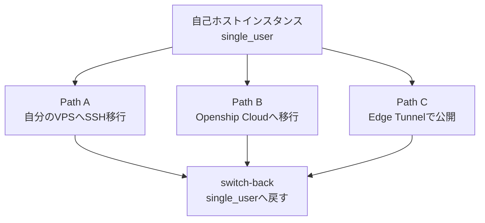

```bash
openship system migration preflight --server-id <id> --hostname example.com     # Path A の事前検査 (読み取り専用)
openship system migration start --server-id <id> --slug myapp                    # Path A: 自分のサーバへ
openship system migration start-cloud                                            # Path B: Openship Cloud へ
openship system migration start-tunnel --slug <slug>                             # Path C: Edge Tunnel で公開 (--slug は必須)
openship system migration switch-back  # 逆移行: single_user へ戻す
```

- **Path A(自分のサーバへ)**: `preflight` で SSH 到達性・リリース成果物の有無・ドメイン準備状況(カスタムドメインは DNS の A レコード、無料サブドメインは `<slug>.opsh.io` の空き)を並列チェックします。DB は「ローカルでダンプ → SCP 転送 → リモートで復元」という非対称な手順です(`preflight.service.ts` / `db-migrate-remote.service.ts` で実装を確認)。
- **Path B(Openship Cloudへ)**: ローカル DB を組織スコープでダンプし、SaaS の `ingest-subgraph` API へ送信します。移行先組織に既存プロジェクトがある場合は `--allow-non-empty-target` を明示しないと失敗します(データは消さず衝突は先方が解決)(`migrate-to-cloud.service.ts` / `apps/cli/src/commands/system.ts`)。
- **Path C(Edge Tunnel公開)**: データ移動もSSHも発生せず、Oblien のトンネルでこのインスタンスを公開するだけです(`migrate-to-tunnel.service.ts`)。
- **切り戻し(switch-back)**: Path A/B はリモート側のデータを取り込み直します。`--abandon-remote` を指定すると (API ボディ上のフィールド名は `abandonRemote`)同期をスキップし、ローカルの現状のまま `single_user` へ戻せます。リモート側のデータは自動削除されず、**30日間の猶予期間を経て purge される**設計です(`switch-back.service.ts`)。
- 移行処理中は `instance_settings.migration_in_progress` による排他ロックが掛かり、書き込みとバックグラウンドワーカーが一時停止します。ロック取得から**10分**経過すると次の試行がロックを奪取できます(クラッシュしたプロセスからの復旧用)。同時に2人が移行を開始した場合、片方は 409(`MIGRATION_IN_PROGRESS`)になります(`migration-lock.ts` で実装を確認)。

## トラブルシューティング

GitHub Issues 全14件 (PR を除く。2026-07-19時点、全件が2026-07-17以降の3日間に集中)、および内部の障害復旧スクリプトの実データに基づきます。

| 症状 | 原因 | 対処 |
|---|---|---|
| 組み込みDB(PGlite)起動時に `DrizzleQueryError: Failed query: CREATE SCHEMA IF NOT EXISTS "drizzle"` / `RuntimeError: Aborted()` | PGlite のデータディレクトリが破損。プロセスが書き込み中に kill され WAL の末尾が壊れているケースが典型 | `bun --cwd packages/db db:heal-pglite` を実行(自動バックアップ後、WAL 末尾のみ切り詰め)。直らない場合は `db:heal-pglite-resetwal`(copy-verify-swap 方式で `pg_resetwal` を安全に適用)。いずれもコミット済みデータは保持する設計(`packages/db/scripts/heal-pglite*.ts` で実装を確認) |
| デスクトップアプリから SSH 先サーバへのデプロイが、Docker ビルド成功直後に `Docker build finished but the image ... was not created` で失敗する | デスクトップアプリの Bun ランタイムが、SSH トンネル経由の dockerode 呼び出し(カスタム `http.Agent` の `createConnection`)を尊重しない既知の Bun 制約。実際はイメージ生成に成功しているが検証ステップだけが失敗する | Issue #10 で報告・メンテナ対応中(2026-07-18)。回避策: Node ホストの control plane(`openship up`)経由でデプロイする。デスクトップアプリ単体での SSH デプロイは現状不安定 |
| 公式サイトの手順に沿って Docker で運用しようとしたら、参照されているプリビルドイメージが存在しない | `release.yml` に Docker イメージのビルド/公開ジョブが無い(デスクトップアプリや tar.gz は公開されるが、コンテナイメージは対象外) | Issue #11 で報告済み。同梱の `docker-compose.yml` は `build:` 指定でソースからビルドする構成なので、`docker compose up -d --build` を使う |
| Openship Cloud 上のプロジェクトで、リポジトリの `vercel.json` のリダイレクト/ヘッダ/パスルーティングが効かない | セルフホストは `vercel.json` を OpenResty 設定へコンパイルして適用するが、cloud には OpenResty が無く「永続化はされるが適用されない」仕様(`docs/oblien-edge-routing-requirements.md` で確認) | cloud 上では `vercel.json` 由来のルーティングに依存しない。ルーティング制御が必須ならセルフホスト(OpenResty)側で運用する |
| 移行ウィザードで `Another migration is already in flight`(409) | 別オペレータが同時に移行を開始した、または直前の移行プロセスがクラッシュしてロックが残っている | 他の移行の完了を待つ。10分以上ロックが残っている場合は再試行すると自動的に奪取される(`migration-lock.ts`) |
| メールサーバに紐付けたバックアップポリシーの古い実行が消えず溜まり続ける | `retainCount` / `retainDays` の自動プルーニングは現状プロジェクト紐付けのポリシーのみ対応。メールサーバ紐付けポリシーは明示的にスキップされる | 現時点では手動で不要な実行を削除する。保持ポリシーが必須なら、フォローアップ実装を待つ(`retention-prune.ts` のコメントで既知の制限と明記) |
| macOS(Apple Silicon)でデスクトップアプリが「壊れているため開けません」と表示される | v0.1.8 の arm64 ビルドでコード署名の検証に失敗(`code has no resources but signature indicates they must be present`) | Issue #3。メンテナが Apple 署名の問題と特定し、**v0.1.9 で修正済み**。最新版へ更新する |
| SSH Key 認証で「Browse」を押してもファイルピッカーが開かない | デスクトップアプリの既知の未検証パス(メンテナ自身がパスワード/エージェント認証を主に使っており SSH 鍵はあまりテストされていないと回答) | OS がすでに対象サーバへ認証済みなら **agent 認証**を選ぶことで回避できる(Issue #3 コメント) |
| セルフホストのカスタムドメインで外部 ingress(Cloudflare Tunnel 等、SSH と公開トラフィックの経路が異なる構成)が使えない | 現状ドメインは SSH 到達先サーバに DNS が直接向く前提。外部管理の ingress/TLS には未対応 | Issue #12。メンテナが **v0.1.12 で対応予定**と回答済み(2026-07-19時点で未リリース) |
| セットアップ手順のリンク先が404になる(例: `https://docs.openship.io/self-hosting`) | ドキュメント整備が実装/実サイト構成に追いついていない | Issue #19(未解決)。API パス・トークン形式など含め、ドキュメントよりソースコードを優先する |
| 脆弱性を報告したい | 以前は `SECURITY.md` が未整備だった (Issue #14) | **2026-07-19 に解決済み**。リポジトリルートに `SECURITY.md` が追加され、報告手順とスコープが定義されました。まずこれを参照する |

### メンテナンス体制の実情

- Issue は全件が2026-07-17以降の3日間に集中しています。実質的な公開・注目は直近です。
- **メンテナ(Hydralerne氏)の応答は速く**、多くの Issue に数時間以内で反応し、修正バージョンを明示しています(実例: #3 は「0.1.9で修正した」、#12 は「0.1.12で直す」)。
- 実質的に単独開発ですが、放置されている状態ではありません。単独開発というリスクと、応答の速さという利点の両方を踏まえて採用判断してください。

## まとめ

openship は、セルフホストと SaaS を同一コードベースで動かし、デプロイ先を local / server / cloud から選べるデプロイ基盤です。control plane と deploy target の境界設計、権限モデル、バックアップの 2 段階リストアなど、コア機能はソース上の実装で裏付けが取れており、v0.1.11 という若さの割に設計は丁寧でした。

一方で README の機能表には、実装が追いついていない項目が複数あります。メールサーバは部品が並存するだけの未統合状態、CDN と自動スケールは実装が見つからず、Cloud では `vercel.json` ルーティングが適用されません。コンテナ間のネットワーク分離も単一コンテナのデプロイでは効きません。**採用を検討するなら、README ではなくソースツリーと本記事の検証結果を基準に、対象環境で一度デプロイを通してから判断することをおすすめします。**

この記事が少しでも参考になった、あるいは改善点などがあれば、ぜひリアクションやコメント、SNSでのシェアをいただけると励みになります！

## 参考リンク

- openship 公式ドキュメント
  - [openship.io](https://openship.io)
  - [API Reference (docs, 実装との差異あり)](https://raw.githubusercontent.com/oblien/openship/main/apps/web/content/docs/api.mdx)
  - [oblien/openship - apps/web/content/docs/architecture/cloud-as-source.mdx](https://raw.githubusercontent.com/oblien/openship/main/apps/web/content/docs/architecture/cloud-as-source.mdx)
  - [architecture/data-ownership.mdx](https://raw.githubusercontent.com/oblien/openship/main/apps/web/content/docs/architecture/data-ownership.mdx)
  - [oblien/openship - apps/web/content/docs/architecture/overview.mdx](https://raw.githubusercontent.com/oblien/openship/main/apps/web/content/docs/architecture/overview.mdx)
  - [oblien/openship - apps/web/content/docs/architecture/runtime-model.mdx](https://raw.githubusercontent.com/oblien/openship/main/apps/web/content/docs/architecture/runtime-model.mdx)
  - [CLI Reference](https://raw.githubusercontent.com/oblien/openship/main/apps/web/content/docs/cli.mdx)
  - [Compose Services](https://raw.githubusercontent.com/oblien/openship/main/apps/web/content/docs/compose-services.mdx)
  - [First Deployment](https://raw.githubusercontent.com/oblien/openship/main/apps/web/content/docs/first-deployment.mdx)
  - [Introduction - Openship Docs](https://raw.githubusercontent.com/oblien/openship/main/apps/web/content/docs/index.mdx)
  - [Installation](https://raw.githubusercontent.com/oblien/openship/main/apps/web/content/docs/installation.mdx)
  - [MCP](https://raw.githubusercontent.com/oblien/openship/main/apps/web/content/docs/mcp.mdx)
  - [Quickstart - Openship Docs](https://raw.githubusercontent.com/oblien/openship/main/apps/web/content/docs/quickstart.mdx)
  - [Security: Authentication](https://raw.githubusercontent.com/oblien/openship/main/apps/web/content/docs/security/auth.mdx)
  - [Security: The local ↔ cloud boundary](https://raw.githubusercontent.com/oblien/openship/main/apps/web/content/docs/security/cloud-boundary.mdx)
  - [Security: Organization isolation](https://raw.githubusercontent.com/oblien/openship/main/apps/web/content/docs/security/isolation.mdx)
  - [Security: Permission model](https://raw.githubusercontent.com/oblien/openship/main/apps/web/content/docs/security/permissions.mdx)

- openship リポジトリ (ソースコード・同梱ドキュメント)
  - [oblien/openship リポジトリツリー](https://github.com/oblien/openship)
  - [oblien/openship — README](https://github.com/oblien/openship/blob/main/README.md)
  - [Issue #10: Self-hosted SSH deploys fail at image verification](https://github.com/oblien/openship/issues/10)
  - [Issue #11: Missing built docker image](https://github.com/oblien/openship/issues/11)
  - [Issue #12: Feature request: Support external ingress for self-hosted custom domains](https://github.com/oblien/openship/issues/12)
  - [Issue #13: Feature request: Allow the deployer to run separately from the control plane](https://github.com/oblien/openship/issues/13)
  - [Issue #14: Add a SECURITY.md with vulnerability reporting and scope guidance](https://github.com/oblien/openship/issues/14)
  - [Issue #19: Self-hosted setup tutorial links to broken documentation](https://github.com/oblien/openship/issues/19)
  - [Issue #3: macOS v0.1.8 arm64 app is rejected as damaged](https://github.com/oblien/openship/issues/3)
  - [backup-destinations module(source)](https://github.com/oblien/openship/tree/main/apps/api/src/modules/backup-destinations)
  - [backups module(source)](https://github.com/oblien/openship/tree/main/apps/api/src/modules/backups)
  - [system/migration module(source)](https://github.com/oblien/openship/tree/main/apps/api/src/modules/system/migration)
  - [apps/cli/src/commands/](https://github.com/oblien/openship/tree/main/apps/cli/src/commands)
  - [packages/adapters/src/backup(source)](https://github.com/oblien/openship/tree/main/packages/adapters/src/backup)
  - [packages/adapters/src/infra(source)](https://github.com/oblien/openship/tree/main/packages/adapters/src/infra)
  - [packages/db/scripts(heal スクリプト、source)](https://github.com/oblien/openship/tree/main/packages/db/scripts)
  - [packages/db/src/repos (ファイル一覧)](https://github.com/oblien/openship/tree/main/packages/db/src/repos)
  - [.env.example](https://raw.githubusercontent.com/oblien/openship/main/.env.example)
  - [.github/workflows/ci.yml](https://raw.githubusercontent.com/oblien/openship/main/.github/workflows/ci.yml)
  - [.github/workflows/release.yml](https://raw.githubusercontent.com/oblien/openship/main/.github/workflows/release.yml)
  - [oblien/openship README](https://raw.githubusercontent.com/oblien/openship/main/README.md)
  - [oblien/openship - apps/api/src/app.ts](https://raw.githubusercontent.com/oblien/openship/main/apps/api/src/app.ts)
  - [oblien/openship - apps/api/src/config/env.ts](https://raw.githubusercontent.com/oblien/openship/main/apps/api/src/config/env.ts)
  - [oblien/openship - apps/api/src/lib/compose-parser.ts](https://raw.githubusercontent.com/oblien/openship/main/apps/api/src/lib/compose-parser.ts)
  - [oblien/openship - apps/api/src/lib/controller-helpers.ts](https://raw.githubusercontent.com/oblien/openship/main/apps/api/src/lib/controller-helpers.ts)
  - [oblien/openship - apps/api/src/lib/deployment-runtime.ts](https://raw.githubusercontent.com/oblien/openship/main/apps/api/src/lib/deployment-runtime.ts)
  - [oblien/openship - apps/api/src/lib/dns-resolver.ts](https://raw.githubusercontent.com/oblien/openship/main/apps/api/src/lib/dns-resolver.ts)
  - [oblien/openship - apps/api/src/lib/domain-ssl.ts](https://raw.githubusercontent.com/oblien/openship/main/apps/api/src/lib/domain-ssl.ts)
  - [oblien/openship - apps/api/src/lib/git-forwarding/README.md](https://raw.githubusercontent.com/oblien/openship/main/apps/api/src/lib/git-forwarding/README.md)
  - [oblien/openship - apps/api/src/lib/platform-mode.ts](https://raw.githubusercontent.com/oblien/openship/main/apps/api/src/lib/platform-mode.ts)
  - [oblien/openship - apps/api/src/lib/server-target.ts](https://raw.githubusercontent.com/oblien/openship/main/apps/api/src/lib/server-target.ts)
  - [oblien/openship - apps/api/src/lib/ssh-tunnel-manager.ts](https://raw.githubusercontent.com/oblien/openship/main/apps/api/src/lib/ssh-tunnel-manager.ts)
  - [apps/api/src/modules/deployments/deployment.schema.ts](https://raw.githubusercontent.com/oblien/openship/main/apps/api/src/modules/deployments/deployment.schema.ts)
  - [apps/api/src/modules/projects/project.schema.ts](https://raw.githubusercontent.com/oblien/openship/main/apps/api/src/modules/projects/project.schema.ts)
  - [oblien/openship - apps/api/src/modules/tunneling/manager.ts](https://raw.githubusercontent.com/oblien/openship/main/apps/api/src/modules/tunneling/manager.ts)
  - [apps/cli/src/index.ts](https://raw.githubusercontent.com/oblien/openship/main/apps/cli/src/index.ts)
  - [apps/cli/src/lib/api-client.ts](https://raw.githubusercontent.com/oblien/openship/main/apps/cli/src/lib/api-client.ts)
  - [apps/cli/src/lib/config.ts](https://raw.githubusercontent.com/oblien/openship/main/apps/cli/src/lib/config.ts)
  - [oblien/openship - apps/desktop/src/main/services.ts](https://raw.githubusercontent.com/oblien/openship/main/apps/desktop/src/main/services.ts)
  - [apps/email/ARCHITECTURE.md (target state, not current の明記) - oblien/openship](https://raw.githubusercontent.com/oblien/openship/main/apps/email/ARCHITECTURE.md)
  - [apps/email/client/package.json (@zero/mail) - oblien/openship](https://raw.githubusercontent.com/oblien/openship/main/apps/email/client/package.json)
  - [apps/email/engine LICENSE (GPL v3) - oblien/openship](https://raw.githubusercontent.com/oblien/openship/main/apps/email/engine/LICENSE)
  - [apps/email/engine README (iRedMail 由来の明記) - oblien/openship](https://raw.githubusercontent.com/oblien/openship/main/apps/email/engine/README.md)
  - [apps/email/server/package.json (@zero/server) - oblien/openship](https://raw.githubusercontent.com/oblien/openship/main/apps/email/server/package.json)
  - [oblien/openship - docker-compose.yml](https://raw.githubusercontent.com/oblien/openship/main/docker-compose.yml)
  - [oblien/openship - docs/oblien-edge-routing-requirements.md](https://raw.githubusercontent.com/oblien/openship/main/docs/oblien-edge-routing-requirements.md)
  - [package.json](https://raw.githubusercontent.com/oblien/openship/main/package.json)
  - [oblien/openship - packages/adapters/docs/ARCHITECTURE.md](https://raw.githubusercontent.com/oblien/openship/main/packages/adapters/docs/ARCHITECTURE.md)
  - [oblien/openship - packages/adapters/docs/BUILD-PIPELINE.md](https://raw.githubusercontent.com/oblien/openship/main/packages/adapters/docs/BUILD-PIPELINE.md)
  - [oblien/openship - packages/adapters/docs/CLOUD.md](https://raw.githubusercontent.com/oblien/openship/main/packages/adapters/docs/CLOUD.md)
  - [oblien/openship - packages/adapters/docs/EXECUTOR.md](https://raw.githubusercontent.com/oblien/openship/main/packages/adapters/docs/EXECUTOR.md)
  - [oblien/openship - packages/adapters/src/index.ts](https://raw.githubusercontent.com/oblien/openship/main/packages/adapters/src/index.ts)
  - [oblien/openship - packages/adapters/src/infra/index.ts](https://raw.githubusercontent.com/oblien/openship/main/packages/adapters/src/infra/index.ts)
  - [oblien/openship - packages/adapters/src/infra/vercel-routing.ts](https://raw.githubusercontent.com/oblien/openship/main/packages/adapters/src/infra/vercel-routing.ts)
  - [oblien/openship - packages/adapters/src/platform.ts](https://raw.githubusercontent.com/oblien/openship/main/packages/adapters/src/platform.ts)
  - [oblien/openship - packages/core/src/runtime-config.ts](https://raw.githubusercontent.com/oblien/openship/main/packages/core/src/runtime-config.ts)
  - [0000_init.sql](https://raw.githubusercontent.com/oblien/openship/main/packages/db/drizzle/0000_init.sql)
  - [0009_credits_billing.sql](https://raw.githubusercontent.com/oblien/openship/main/packages/db/drizzle/0009_credits_billing.sql)
  - [0011_remove_credit_ledger.sql](https://raw.githubusercontent.com/oblien/openship/main/packages/db/drizzle/0011_remove_credit_ledger.sql)
  - [0012_smart_deploys_and_git_rollback.sql](https://raw.githubusercontent.com/oblien/openship/main/packages/db/drizzle/0012_smart_deploys_and_git_rollback.sql)
  - [0026_mail_backup_source.sql](https://raw.githubusercontent.com/oblien/openship/main/packages/db/drizzle/0026_mail_backup_source.sql)
  - [release-advisories.json](https://raw.githubusercontent.com/oblien/openship/main/release-advisories.json)
  - [scripts/install.sh](https://raw.githubusercontent.com/oblien/openship/main/scripts/install.sh)

- 比較対象プロダクト・外部リソース
  - [CapRover](https://caprover.com)
  - [Coolify](https://coolify.io)
  - [Dokploy](https://dokploy.com)
  - [We are updating Dokploy's Open Source license (Dokploy 公式ブログ)](https://dokploy.com/blog/we-are-updating-dokploys-open-source-license)
  - [Dokploy/dokploy (GitHub)](https://github.com/Dokploy/dokploy)
  - [caprover/caprover (GitHub)](https://github.com/caprover/caprover)
  - [coollabsio/coolify (GitHub)](https://github.com/coollabsio/coolify)
  - [Railway](https://railway.com)
  - [Vercel](https://vercel.com)
