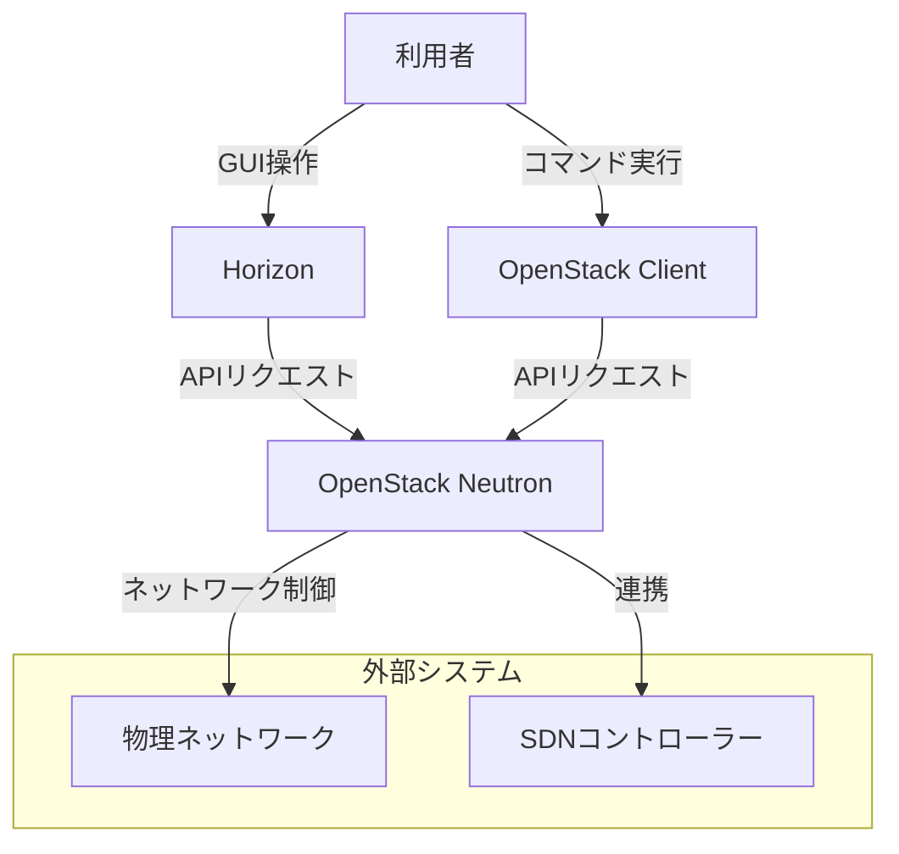
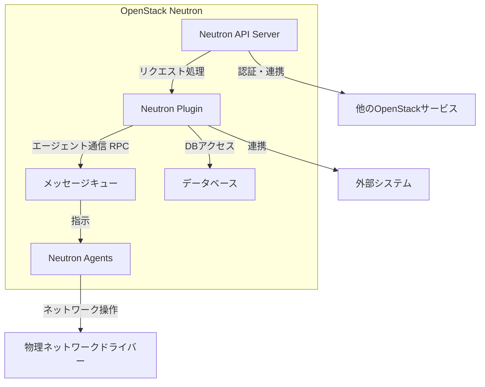
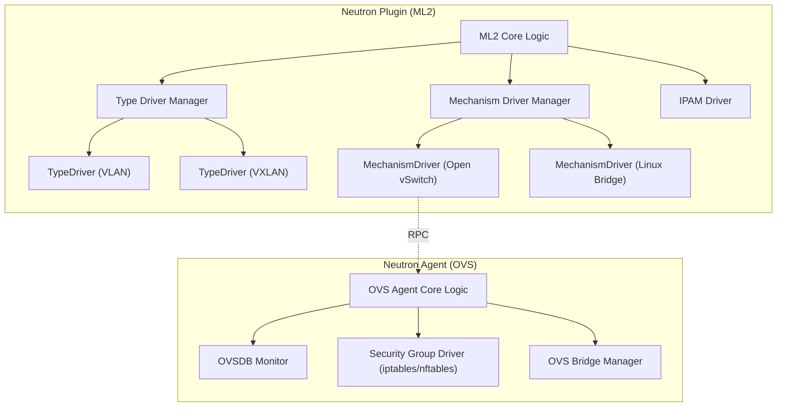
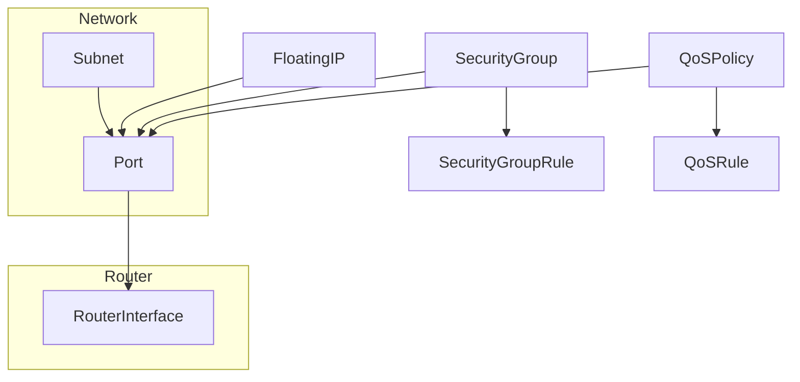

OpenStack Neutronは、OpenStack内で「Network as a Service (NaaS)」を提供するプロジェクトです。仮想マシンなどのインターフェースデバイス間のネットワーク接続を管理します。

## ■概要

OpenStack Neutronは、ユーザーが仮想ネットワーク、サブネット、ルーターなどのネットワークリソースをAPI経由で定義・管理できるようにするコンポーネントです。プラグイン方式のアーキテクチャを採用しており、様々なネットワーク技術やベンダー製品をサポートすることで、柔軟なネットワーク構成を実現します。

## ■特徴

  - **APIによるネットワーク管理**: ネットワーク、サブネット、ポート、ルーターなどのネットワークリソースをRESTful APIを通じてプログラム的に操作できます。
  - **プラグインアーキテクチャ**: ML2 (Modular Layer 2) プラグインを中心としたモジュール構造により、Open vSwitch、Linux Bridge、OVN (Open Virtual Network) や、さまざまなベンダー製のSDNコントローラーやネットワーク機器をサポートします。
  - **L2/L3ネットワークサービス**: VLAN、VXLANなどのL2ネットワークや、仮想ルーターによるL3ルーティング機能を提供します。
  - **DHCPサービス**: 仮想ネットワーク内のインスタンスに対して、DHCPエージェントとdnsmasqを利用してIPアドレスの自動割り当てやネットワーク設定情報を提供します。
  - **セキュリティグループ**: 仮想マシンポートレベルでのトラフィックフィルタリング機能を提供し、仮想ファイアウォールとして機能します。
  - **QoS (Quality of Service)**: ネットワーク帯域制限などのQoSポリシーを定義し、ネットワークパフォーマンスを制御できます。
  - **DVR (Distributed Virtual Router)**: L3ルーティング機能をコンピュートノードに分散配置することで、ネットワークのボトルネックを解消し、可用性を向上させます。

## ■構造

### ●システムコンテキスト図

| 要素名                  | 説明                                                                 |
| ----------------------- | -------------------------------------------------------------------- |
| 利用者                  | OpenStackのネットワーク機能を利用するユーザーまたは管理者です。        |
| OpenStack Dashboard (Horizon) | OpenStackのWebベースのUIで、Neutronの機能も操作できます。             |
| OpenStack CLI           | OpenStackを操作するためのコマンドラインインターフェースです。                  |
| OpenStack Neutron       | OpenStackのネットワークサービスを提供する中心コンポーネントです。          |
| 物理ネットワーク          | 仮想ネットワークが実際に構築される物理的なネットワークインフラです。       |
| SDNコントローラー (オプション) | Neutronと連携して高度なネットワーク制御を行うための外部システムです。 |

-----

### ●コンテナ図

| 要素名                                  | 説明                                                                                                |
| --------------------------------------- | --------------------------------------------------------------------------------------------------- |
| Neutron API Server                      | ユーザーや他のOpenStackサービスからのAPIリクエストを受け付け、処理をNeutron Pluginに委譲します。             |
| Neutron Plugin (例: ML2)                | ネットワーク、サブネット、ポートなどのコアリソース管理や、L3、DHCPなどの拡張サービス機能を提供するプラグインです。 |
| メッセージキュー (例: RabbitMQ)             | Neutron API ServerとNeutron Agents間の非同期通信（RPC）を実現するための中間コンポーネントです。         |
| データベース (例: MySQL, PostgreSQL)        | Neutronが管理するネットワークリソースの状態や設定情報を永続的に保存します。                               |
| Neutron Agents (L2, L3, DHCPなど)     | 各ノード（コンピュートノード、ネットワークノード）上で動作し、実際のネットワーク設定や制御を行います。          |
| 他のOpenStackサービス (Nova, Keystoneなど) | Neutronと連携する他のOpenStackコンポーネントです。Novaは仮想マシンの管理、Keystoneは認証を担当します。    |
| 物理ネットワークドライバー                    | Neutron Agentsが物理ネットワーク機器やハイパーバイザーの仮想スイッチを操作するためのインターフェースです。  |
| 外部システム (SDNコントローラーなど)        | Neutron Pluginが連携する外部のSDNコントローラーなどです。                                                |

### ●コンポーネント図

ここでは、代表的なML2プラグインとOpen vSwitch Agentの連携を例に示します。

| 要素名                                    | 説明                                                                                                         |
| ----------------------------------------- | ------------------------------------------------------------------------------------------------------------ |
| ML2 Core Logic                            | ML2プラグインの中核ロジック。Type DriverとMechanism Driverを協調させます。                                        |
| Type Driver Manager                       | VLAN、VXLANなどのL2ネットワーク種別を管理するType Driverをロードし、管理します。                                       |
| Mechanism Driver Manager                  | Open vSwitch、Linux Bridgeなどの具体的なL2ネットワーク実現メカニズムを管理するMechanism Driverをロードし、管理します。 |
| TypeDriver (VLAN)                         | VLANベースのL2ネットワークを実現します。                                                                          |
| TypeDriver (VXLAN)                        | VXLANベースのL2オーバーレイネットワークを実現します。                                                               |
| MechanismDriver (Open vSwitch)            | Open vSwitchを利用してL2ネットワークを実現します。OVS Agentと連携します。                                          |
| MechanismDriver (Linux Bridge)            | Linux Bridgeを利用してL2ネットワークを実現します。Linux Bridge Agentと連携します。                                 |
| IPAM Driver                               | IPアドレスの割り当てと管理（IPAM）を担当します。                                                                    |
| OVS Agent Core Logic                      | Open vSwitch Agentの中核ロジック。Neutron Serverからの指示に基づきOVSを操作します。                               |
| OVSDB Monitor                             | Open vSwitchデータベース (OVSDB) の変更を監視し、必要に応じてAgentに通知します。                                    |
| Security Group Driver (iptables/nftables) | iptablesやnftablesを利用してセキュリティグループのルールを適用します。                                               |
| OVS Bridge Manager                        | Open vSwitchのブリッジ（br-int, br-tunなど）の作成やポート接続などを管理します。                                   |

## ■情報

### ●概念モデル

| 要素名              | 説明                                                                 |
| ------------------- | -------------------------------------------------------------------- |
| Network             | L2セグメントを表す論理的なエンティティです。                             |
| Subnet              | 特定のIPアドレス範囲と関連する設定（ゲートウェイ、DNSなど）を定義します。 |
| Port                | 仮想マシンやルーターなどのデバイスをネットワークに接続するための口です。     |
| Router              | 異なるサブネット間のL3ルーティング機能を提供します。                       |
| RouterInterface     | ルーターとサブネットを接続するインターフェースです。                       |
| FloatingIP          | 外部ネットワークからアクセス可能なグローバルIPアドレスです。                 |
| SecurityGroup       | ポートに適用されるファイアウォールルールの集合です。                       |
| SecurityGroupRule   | SecurityGroup内の具体的なトラフィック制御ルールです。                   |
| QoSPolicy           | ポートに適用されるQoSポリシーの集合です。                                |
| QoSRule             | QoSPolicy内の具体的なQoSルール（帯域制限など）です。                      |

## ■構築方法

OpenStack Neutronの構築は、通常、OpenStack全体のデプロイメントプロセスの一部として行われます。具体的な手順はディストリビューションやデプロイツール（例: Kolla Ansible, OpenStack-Ansible, Packstackなど）によって異なりますが、一般的なステップは以下の通りです。

### ●前提条件の準備

  - **コントローラーノード、コンピュートノード、ネットワークノードの準備**: ハードウェア要件を満たし、OSがインストールされていることを確認します。
  - **NTPの設定**: 全ノードで時刻同期が正しく行われていることを確認します。
  - **パッケージリポジトリの設定**: OpenStackのパッケージを取得するためのリポジトリを設定します。
  - **データベースサーバーの準備**: Neutronのデータを格納するためのデータベースサーバー（例: MariaDB）を準備します。
  - **メッセージキューサーバーの準備**: Neutronコンポーネント間の通信に使用するメッセージキューサーバー（例: RabbitMQ）を準備します。
  - **Keystoneの準備**: OpenStackの認証サービスであるKeystoneがセットアップされ、Neutron用のサービスやエンドポイントが登録されている必要があります。

### ●Neutronコンポーネントのインストールと設定

  - **Neutron Serverのインストール**: コントローラーノードにNeutron APIサーバーと選択したプラグイン（通常はML2）をインストールします。
      - `neutron.conf`ファイルでデータベース接続情報、メッセージキュー接続情報、Keystone認証情報、使用するコアプラグイン (ML2など)、サービスプラグインを設定します。
      - ML2プラグインを使用する場合、`ml2_conf.ini`ファイルでType Driver (vlan, vxlanなど) とMechanism Driver (openvswitch, linuxbridgeなど) を設定します。
  - **Neutron Agentsのインストール**:
      - **L2 Agent (Open vSwitch Agent / Linux Bridge Agent)**: 各コンピュートノードとネットワークノードにインストールします。
          - `openvswitch_agent.ini` または `linuxbridge_agent.ini` で、物理インターフェースマッピング、トンネリング設定（VXLANの場合など）を行います。
      - **L3 Agent**: ネットワークノード（またはDVRの場合はコンピュートノードにも）にインストールします。
          - `l3_agent.ini` で、外部ネットワークブリッジ、ルーティングドライバーなどを設定します。
      - **DHCP Agent**: ネットワークノードにインストールします。
          - `dhcp_agent.ini` で、DHCPドライバー（通常はdnsmasq）、インターフェースドライバーなどを設定します。
      - **Metadata Agent**: ネットワークノード（またはコンピュートノードにも）にインストールします。インスタンスがメタデータサービスにアクセスできるようにします。
  - **データベーススキーマの作成**: Neutronデータベースに初期スキーマを作成します (`neutron-db-manage upgrade head`)。

### ●ネットワークの初期設定

  - **外部ネットワークの作成**: OpenStackインスタンスが外部と通信するための外部ネットワークを作成します。これは物理ネットワークに接続されたVLANやフラットネットワークに対応します。
  - **内部ネットワーク、サブネット、ルーターの作成**: テナントが利用するプライベートネットワーク、サブネット、およびそれらを外部ネットワークに接続するためのルーターを作成します（これは運用開始後のユーザー操作でも可能です）。

### ●サービスの起動と確認

  - 各ノードでNeutron関連のサービス（neutron-server, neutron-openvswitch-agent, neutron-l3-agent, neutron-dhcp-agent, neutron-metadata-agentなど）を起動し、有効化します。
  - OpenStack CLIやHorizonダッシュボードからネットワークリスト、エージェントリストなどを確認し、正常に動作していることを確認します。

## ■利用方法

OpenStack Neutronは、主に以下の方法で利用されます。

### ●OpenStack Dashboard (Horizon)を利用する

  - Webブラウザを通じてGUIで直感的にネットワークリソースを操作できます。
  - **ネットワークの作成**: プロジェクトごとに独立したL2ネットワークを作成します。
  - **サブネットの作成**: ネットワーク内にIPアドレス範囲、ゲートウェイ、DNSサーバーなどを定義します。
  - **ルーターの作成と設定**: サブネット間や内部ネットワークと外部ネットワーク間のルーティングを設定します。
  - **ポートの管理**: 仮想マシンインターフェースやルーターインターフェースなどのポート情報を確認します。
  - **Floating IPの割り当て**: 仮想マシンに外部からアクセス可能なIPアドレスを割り当てます。
  - **セキュリティグループの作成と適用**: ファイアウォールルールを作成し、仮想マシンに適用します。

### ●OpenStack CLI (Command Line Interface)を利用する

  - `openstack` コマンドを使用して、スクリプトや自動化処理の中でネットワークリソースを操作します。
      - `openstack network create <network_name>`
      - `openstack subnet create --network <network_name> --subnet-range <cidr> <subnet_name>`
      - `openstack router create <router_name>`
      - `openstack router add subnet <router_name> <subnet_name>`
      - `openstack port list`
      - `openstack floating ip create <external_network_name>`
      - `openstack server add floating ip <server_name_or_id> <floating_ip_address>`
      - `openstack security group create <group_name>`
      - `openstack security group rule create --protocol tcp --dst-port 22 <group_name>`

### ●OpenStack APIを直接利用する

  - プログラムから直接Neutron API（RESTful API）を呼び出し、より高度な制御や連携を行います。
  - 各種プログラミング言語用のSDK（例: python-neutronclient）を利用できます。

## ■運用

OpenStack Neutronの運用には、監視、トラブルシューティング、メンテナンス、パフォーマンス最適化などが含まれます。

### ●監視

  - **APIエンドポイントの監視**: Neutron APIサーバーが正常に応答しているか監視します。
  - **エージェントの状態監視**: 各ノードで動作するNeutronエージェント（L2, L3, DHCPなど）の死活監視を行います (`openstack network agent list`)。
  - **メッセージキューの監視**: RabbitMQなどのメッセージキューのキュー長やエラーレートを監視し、通信のボトルネックや問題を検知します。
  - **データベースの監視**: Neutronデータベースのパフォーマンス、ディスク容量、レプリケーション状態などを監視します。
  - **リソース使用状況の監視**: IPアドレスプール、Floating IP、各種クォータの使用状況を監視します。
  - **ログの収集と分析**: Neutron Serverおよび各Agentのログを収集し、エラーや警告を定期的に確認します。ELKスタックなどのログ管理システムを利用すると効率的です。

### ●トラブルシューティング

  - **ネットワーク接続性の確認**: `ping`, `traceroute`, `ip a`, `ovs-vsctl show`, `brctl show` などの基本的なLinuxコマンドや、Neutron固有のコマンド (`ip netns exec <namespace_id> ...`) を使用して、問題の切り分けを行います。
  - **ログの確認**: Neutron Server、各Agent、メッセージキュー、データベースのログを確認し、エラーメッセージや関連情報を調査します。
  - **フローの確認**: Open vSwitchを利用している場合、`ovs-ofctl dump-flows <bridge>` などでOpenFlowルールを確認し、パケットが期待通りに転送されているか調査します。
  - **リソース状態の確認**: OpenStack CLIやAPIを使用して、ネットワーク、サブネット、ポート、ルーターなどのリソースの状態や設定が正しいか確認します。

### ●メンテナンス

  - **データベースのバックアップとリストア**: 定期的にNeutronデータベースのバックアップを取得し、リストア手順を確認しておきます。
  - **パッチ適用とアップグレード**: セキュリティパッチの適用や、OpenStackのバージョンアップグレードを計画的に実施します。アップグレード時は、Neutronのデータベーススキーママイグレーションも伴います。
  - **不要リソースのクリーンアップ**: 定期的に使用されていないFloating IP、ネットワーク、ルーターなどをクリーンアップします。

### ●パフォーマンス最適化

  - **DVR (Distributed Virtual Router) の利用**: East-Westトラフィックの効率化と、L3 Agentの単一障害点回避のためにDVRの導入を検討します。
  - **ハードウェアオフロード**: 対応しているNICやスイッチを利用して、VXLANなどのオーバーレイネットワーク処理をオフロードすることでパフォーマンスを向上させます。
  - **チューニング**: Neutron Serverのワーカー数、データベース接続プールサイズ、OVSのフロー数など、関連コンポーネントのパラメータを環境に合わせてチューニングします。
  - **ネットワークトポロジーの最適化**: アプリケーションの要件に合わせて、ネットワークトポロジー（フラット、VLAN、VXLANなど）を選択・最適化します。

## ■参考リンク

### 概要

  - [Openstack Neutron Overview - Networkers Online](https://networkers-online.com/p/whatis-openstack-neutron)
  - [Welcome to Neutron's documentation\! - OpenStack Docs](https://docs.openstack.org/neutron/latest/)
  - [Neutron - OpenStack Wiki](https://wiki.openstack.org/wiki/Neutron)
  - [What is OpenStack Neutron? - Open Metal](https://openmetal.io/docs/glossary/what-is-openstack-neutron/)
  - [Neutron Overview | openstack/neutron | DeepWiki](https://deepwiki.com/openstack/neutron/1-neutron-overview)

### 構造

  - [OpenStack Neutron – architecture and overview - LeftAsExercise](https://leftasexercise.com/2020/02/21/openstack-neutron-architecture-and-overview/)
  - [Networking architecture — Security Guide documentation - OpenStack Docs](https://docs.openstack.org/security-guide/networking/architecture.html)
  - [第7回 Neutron | 京セラみらいエンビジョン](https://www.kcme.jp/column/openstack-vol0007.html)
  - [OpenStack Neutronが作るNWの実体を追ってみよう - NTTテクノクロス](https://www.ntt-tx.co.jp/column/tec/180702/)
  - [OpenStack Networking の仕組み - GREE Engineering](https://labs.gree.jp/blog/2015/02/13598/)
  - [Core Architecture | openstack/neutron | DeepWiki](https://deepwiki.com/openstack/neutron/2-core-architecture)
  - [ML2 Plugin Architecture | openstack/neutron | DeepWiki](https://deepwiki.com/openstack/neutron/2.1-ml2-plugin-architecture)
  - [L3 Routing and DVR | openstack/neutron | DeepWiki](https://deepwiki.com/openstack/neutron/2.3-l3-routing-and-dvr)
  - [DHCP Management | openstack/neutron | DeepWiki](https://deepwiki.com/openstack/neutron/2.4-dhcp-management)
  - [Agents and Drivers | openstack/neutron | DeepWiki](https://deepwiki.com/openstack/neutron/3-agents-and-drivers)
  - [Open vSwitch Integration | openstack/neutron | DeepWiki](https://deepwiki.com/openstack/neutron/3.1-open-vswitch-integration)
  - [OVN Integration | openstack/neutron | DeepWiki](https://deepwiki.com/openstack/neutron/3.2-ovn-integration)
  - [Linux Networking Infrastructure | openstack/neutron | DeepWiki](https://deepwiki.com/openstack/neutron/3.3-linux-networking-infrastructure)
  - [Security and QoS | openstack/neutron | DeepWiki](https://deepwiki.com/openstack/neutron/4-security-and-qos)
  - [Security Groups | openstack/neutron | DeepWiki](https://deepwiki.com/openstack/neutron/4.1-security-groups)
  - [Quality of Service | openstack/neutron | DeepWiki](https://deepwiki.com/openstack/neutron/4.2-quality-of-service)

### 情報

  - [Data Model - OpenStack Docs](https://docs.openstack.org/shade/latest/user/model.html)
  - [Mapping between Neutron and OVN data models — networking-ovn 2.0.0 documentation](https://docs.openstack.org/networking-ovn/2.0.0/design/data_model.html)
  - [Database Abstraction and Object Model | openstack/neutron | DeepWiki](https://deepwiki.com/openstack/neutron/2.2-database-abstraction-and-object-model)

### 構築方法

  - [Installation Guide - OpenStack Docs (Neutron)](https://docs.openstack.org/neutron/latest/install/index.html)

### 利用方法

  - [OpenStack Networking Guide - OpenStack Docs](https://docs.openstack.org/networking-guide/)

### 運用

  - [OpenStack Operations Guide - Networking](https://www.google.com/search?q=https://docs.openstack.org/ops-guide/ops-networking.html)
  - [Development and Testing | openstack/neutron | DeepWiki](https://deepwiki.com/openstack/neutron/5-development-and-testing)
  - [Database Migrations | openstack/neutron | DeepWiki](https://deepwiki.com/openstack/neutron/5.1-database-migrations)
  - [Testing Framework | openstack/neutron | DeepWiki](https://deepwiki.com/openstack/neutron/5.2-testing-framework)

この記事が少しでも参考になった、あるいは改善点などがあれば、ぜひリアクションやコメント、SNSでのシェアをいただけると励みになります！
