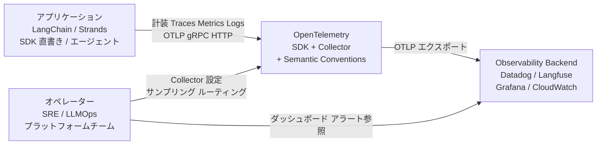
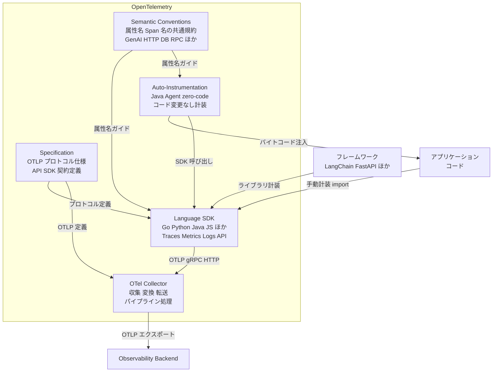
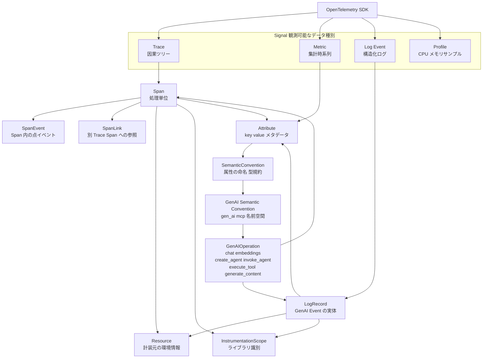
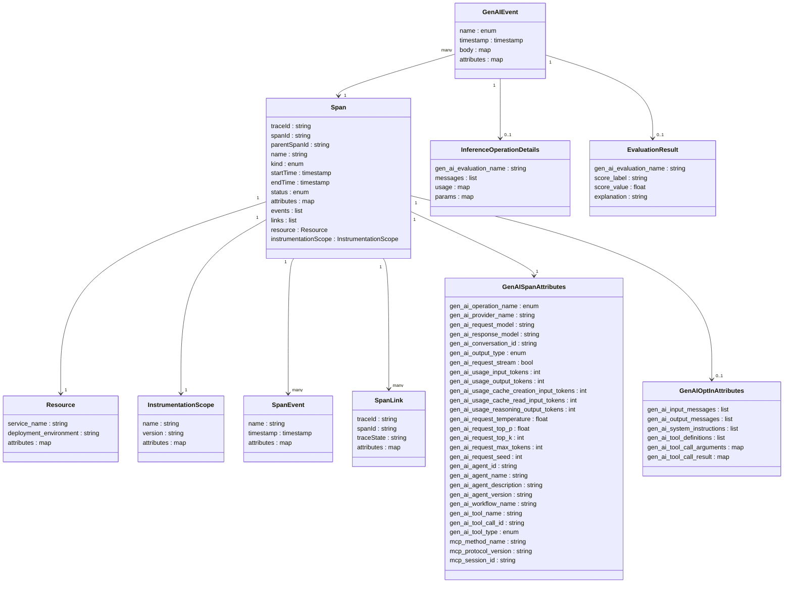

> 検証日: 2026-05-22
> 対象: OpenTelemetry (2026-05-11 CNCF Graduated 決定 / 2026-05-21 公式発表)
> 文脈: AI ワークロード観測の標準基盤としての位置づけ

## 概要

OpenTelemetry (OTel) は、分散システムのテレメトリ (Traces / Metrics / Logs / Profiles) を収集・転送するための仕様 + SDK + Collector の統合セットです。Cloud Native Computing Foundation (CNCF) が管理するオープンスタンダードで、特定ベンダーに依存しない計装層として設計されています。

2019 年に OpenTracing と OpenCensus が統合される形で発足し、2026 年 5 月 21 日に CNCF の Observability Summit (Minneapolis) で Graduated プロジェクトへの昇格が公式発表されました。

```text
2019-05-07  OpenTracing + OpenCensus 統合 → Sandbox 入り
2021-08-26  Incubating 昇格
2026-05-11  Graduated 決定
2026-05-21  Observability Summit で公式発表
```

### CNCF Graduated の意味

| 評価観点 | OTel の実績 |
| --- | --- |
| ガバナンス成熟 | Governance Committee 9 名、Technical Committee 最小 4 名 |
| コミュニティ規模 | 12,000+ contributors / 2,800+ 企業 |
| 採用実績 | Alibaba / Anthropic / Bloomberg / Capital One / eBay 等が採用社として明記 |
| 第三者セキュリティ監査 | Collector を含む中核コンポーネントで監査完了 |
| ベロシティ | CNCF 240+ プロジェクト中 2 位 (1 位は Kubernetes) |
| パッケージ DL 数 | JS API 月 13.6 億 DL / Python API 月 13 億 DL (2026/04) |

Graduated 昇格は、エンタープライズ調達の承認基準として強い後押しになります。CNCF が商標を保有するため、ベンダーロックインリスクも低い水準にとどまります。

### Graduated が保証すること・しないこと

Graduation が直接保証するのは Traces / Metrics の signals が本番採用に耐える成熟度です。GenAI Semantic Conventions は 2026-05 時点で全ページ Development ステータスにとどまり、Graduation は AI 観測規約の品質保証を意味しません。この成熟度のまだら模様は、採用設計に大きく影響します。

## 特徴

- ベンダー中立の計装層。特定 APM ベンダーや LLM プロバイダに依存しない仕様
- OTLP が事実上の共通プロトコル。Datadog / New Relic / Grafana / Honeycomb / Dynatrace / CloudWatch / Cloud Trace / Azure Monitor がすべて OTLP を一次入力として受領
- Graduated 昇格でアプリコードの長期安定を担保。SDK の auto-instrumentation がユーザーコードに import される性質上、属性名・仕様の長期メンテが効く
- GenAI semconv で AI 観測を標準化。`gen_ai.request.model` / `gen_ai.usage.input_tokens` / `gen_ai.usage.cache_read.input_tokens` / `gen_ai.usage.reasoning.output_tokens` で prompt caching・extended thinking のコスト分析が可能
- Agent の多階層を span kind で表現。`invoke_workflow` (INTERNAL) → `invoke_agent` (CLIENT / INTERNAL) → `execute_tool` (INTERNAL) の入れ子で multi-agent trace を標準表現
- MCP が一級市民。Model Context Protocol の観測規約が GenAI semconv に組み込み済みで `mcp.method.name` + `gen_ai.tool.name` の二重取得が可能
- PII Opt-In 設計。`gen_ai.input.messages` / `gen_ai.output.messages` はデフォルトで span attribute に乗らず、GDPR / HIPAA 配慮を仕様に内包
- 成熟度のまだら模様。Traces / Metrics は Stable、Logs は言語依存、GenAI semconv は Development
- コミュニティ規模が大きい。CNCF velocity 2 位、月間 DL は JS / Python それぞれ 13 億超

### 関連技術との位置づけ

| プロジェクト | 役割 | OTel との関係 |
| --- | --- | --- |
| Prometheus | メトリクス収集の de-facto | Collector に Prometheus receiver / remote write exporter を備え、相互運用前提 |
| Jaeger | 分散トレース可視化 | 内部実装を OTel SDK / Collector 準拠に移行中 |
| Fluentd | ログ収集 | OTel Logs と機能領域が重複しつつ、Collector で fluentforward receiver により相互接続 |
| OpenTracing / OpenCensus | 前身プロジェクト | OTel に統合済み |

### AI 観測規約の比較

| 観点 | OTel GenAI semconv | OpenInference (Arize) | OpenLLMetry (Traceloop) |
| --- | --- | --- | --- |
| 主導組織 | CNCF / OTel コミュニティ | Arize AI + コミュニティ | Traceloop + コミュニティ |
| 策定開始 | 2024 年頃 | 2023 年 | 2023 年頃 |
| ステータス | Development (2026-05) | 独立仕様 (安定) | 独立仕様 (安定) |
| span kind 数 | 6 種 (主要) | 10 種 | OTel GenAI 寄り |
| フレームワーク網羅性 | 新世代中心 | LangChain / LlamaIndex / DSPy / Haystack | OpenAI / Anthropic / LangChain / MCP ほか |
| プロトコル | OTLP | OTLP (OTel 互換) | OTLP |
| バックエンド受領状況 | Datadog が v1.37+ ネイティブ宣言 | Arize Phoenix がリファレンス | Datadog / New Relic / Grafana ほか公式 export ガイド |
| 採用推奨 | 新規プロジェクト・新世代フレームワーク | LangChain 系利用時 | バックエンド未確定・portability 優先時 |

## 構造

### システムコンテキスト図



| 要素名 | 説明 |
| --- | --- |
| アプリケーション | テレメトリを生成する主体。LangChain / Strands / 各 LLM SDK や手書きコードを含む |
| オペレーター | SRE / LLMOps / プラットフォームチームなど、Collector 設定・サンプリング戦略・ダッシュボードを管理する役割 |
| OpenTelemetry | SDK + Collector + Semantic Conventions の統合観測基盤 |
| Observability Backend | テレメトリを受け取り可視化・アラートを提供する系。汎用 SaaS / LLM 特化 SaaS / クラウドネイティブ観測サービスに分類 |

### コンテナ図



| 要素名 | 説明 |
| --- | --- |
| Specification | OTLP プロトコル・API/SDK インターフェース・データモデルを言語中立で定義する仕様文書群 |
| Semantic Conventions | Span 名・Metric 名・Attribute 名の共通命名規約。GenAI カテゴリは Development ステータス |
| Language SDK | 各言語の計装 API と実装ライブラリ。Traces/Metrics は Stable、Logs は Java/.NET/PHP が Stable・Go が Beta・Python/JS が Development |
| Auto-Instrumentation | Java Agent やゼロコード計装。アプリコードを変更せずバイトコード注入やモンキーパッチで SDK を起動時に差し込む |
| OTel Collector | Receiver でテレメトリを受け取り、Processor で変換・フィルタし、Exporter でバックエンドに転送する独立プロセス |

### コンポーネント図

```mermaid
graph LR
    subgraph Sources["テレメトリ送信元"]
        AppSDK["アプリ SDK<br/>OTLP"]
        LegacyAgent["旧来エージェント<br/>Jaeger Prometheus"]
        LogFile["ログファイル<br/>filelog"]
    end

    subgraph Collector["OTel Collector"]
        subgraph Receivers["Receiver 層"]
            RcvOTLP["otlp receiver<br/>gRPC 4317<br/>HTTP 4318"]
            RcvJaeger["jaeger receiver<br/>旧 Jaeger 互換"]
            RcvProm["prometheus receiver<br/>スクレイプ互換"]
            RcvFile["filelog receiver<br/>ファイルテール"]
        end

        subgraph Processors["Processor 層"]
            ProcMem["memory_limiter<br/>メモリ上限制御<br/>pipeline 先頭推奨"]
            ProcBatch["batch processor<br/>バッチ圧縮送信<br/>スループット向上"]
            ProcAttr["attributes processor<br/>属性追加 変換<br/>PII 削除"]
            ProcTail["tail_sampling processor<br/>trace 完了後サンプリング<br/>LLM コスト trace 保持"]
        end

        subgraph Connectors["Connector 層"]
            ConnSpanMetrics["spanmetrics connector<br/>trace から metric 変換<br/>トークン使用量派生"]
            ConnRouting["routing connector<br/>パイプライン間ルーティング"]
        end

        subgraph Exporters["Exporter 層"]
            ExpOTLP["otlp exporter<br/>OTLP gRPC HTTP<br/>各 SaaS 送信"]
            ExpProm["prometheusremotewrite<br/>Prometheus 互換送出"]
            ExpDatadog["datadog exporter<br/>Datadog API 送信"]
            ExpLoki["loki exporter<br/>Grafana Loki 送信"]
        end

        subgraph Extensions["Extension 層"]
            ExtHealth["health_check<br/>ヘルスエンドポイント"]
            ExtPProf["pprof extension<br/>Go pprof エンドポイント"]
            ExtZPages["zpages extension<br/>デバッグ用 UI"]
            ExtFileStorage["file_storage extension<br/>永続化 queue 補助"]
            ExtAuth["auth extension<br/>Bearer OAuth 付与"]
        end
    end

    subgraph Backends["Observability Backend"]
        BkDatadog["Datadog"]
        BkGrafana["Grafana Loki"]
        BkLangfuse["Langfuse Phoenix"]
        BkCloud["CloudWatch Cloud Trace"]
    end

    AppSDK --> RcvOTLP
    LegacyAgent --> RcvJaeger
    LegacyAgent --> RcvProm
    LogFile --> RcvFile

    RcvOTLP --> ProcMem
    RcvJaeger --> ProcMem
    RcvProm --> ProcMem
    RcvFile --> ProcMem

    ProcMem --> ProcBatch
    ProcBatch --> ProcAttr
    ProcAttr --> ProcTail

    ProcTail --> ConnSpanMetrics
    ProcTail --> ConnRouting
    ProcTail --> ExpOTLP
    ConnSpanMetrics --> ExpProm
    ConnRouting --> ExpDatadog

    ExpOTLP --> BkLangfuse
    ExpOTLP --> BkCloud
    ExpOTLP --> BkDatadog
    ExpProm --> BkGrafana
    ExpDatadog --> BkDatadog
    ExpLoki --> BkGrafana
```



#### Receiver / Processor / Connector

| 要素名 | 説明 |
| --- | --- |
| otlp receiver | OTLP gRPC (4317) / HTTP (4318) でテレメトリを受け取る標準 Receiver |
| jaeger receiver | Jaeger ネイティブ形式を受け取る互換 Receiver。旧来エージェントからの移行に使う |
| prometheus receiver | Prometheus スクレイプ形式でメトリクスを取得する Receiver |
| filelog receiver | ログファイルをテールしてログレコードに変換する Receiver |
| memory_limiter | メモリ使用量の上限を監視し超過時にデータを拒否してプロセスを保護する Processor。pipeline 先頭に配置 |
| batch processor | データをバッチにまとめて送信効率を高める Processor |
| attributes processor | Span / Metric の属性を追加・変更・削除する Processor。PII 削除や環境タグ付与に使う |
| tail_sampling processor | trace 完了後にポリシーで保持/破棄を判定する Processor。`decision_wait` と `num_traces` の同時チューニングが重要 |
| spanmetrics connector | trace データから RED メトリクスやカスタムメトリクスを派生する Connector。LLM トークン使用量メトリクス生成に応用可 |
| routing connector | 属性値に基づいてテレメトリを複数の下流パイプラインに振り分ける Connector |

#### Exporter / Extension

| 要素名 | 説明 |
| --- | --- |
| otlp exporter | OTLP gRPC/HTTP で下流に転送する標準 Exporter |
| prometheusremotewrite | Prometheus Remote Write プロトコルでメトリクスを送出する Exporter |
| datadog exporter | Datadog Agent API 形式で Datadog に送信する Exporter |
| loki exporter | Grafana Loki にログを送信する Exporter |
| health_check | HTTP エンドポイントでコレクタの健全性を公開する Extension。Kubernetes liveness probe に使う |
| pprof extension | Go の pprof エンドポイントを公開する Extension |
| zpages extension | 内部 trace / RPC 統計を Web UI で確認できる Extension |
| file_storage extension | Exporter の送信 queue をディスクに永続化する Extension。auth context を失う点に注意 |
| auth extension | Bearer トークンや OAuth 資格情報を Exporter のリクエストに付与する Extension |

## データ

### 概念モデル



| 要素 | 役割 |
| --- | --- |
| Signal | Trace / Metric / Log / Profile の 4 種。GenAI ではすべて使うが Log の SDK Stability は言語依存 |
| Span | Trace の構成単位。GenAI 操作は 1 回の LLM 呼び出し / エージェント実行 / ツール実行が 1 Span に対応 |
| SpanEvent | Span に付随する時刻付き点イベント。旧仕様で `gen_ai.user.message` 等に使われたが廃止済み |
| SpanLink | 非同期・バッチ処理など、親子以外の Trace 間依存を表す |
| LogRecord | GenAI Event の実体。Span と trace_id/span_id で紐付く |
| Resource | `service.name` / `deployment.environment` 等の不変的な計装元情報 |
| InstrumentationScope | ライブラリ名 + バージョン。`opentelemetry-instrumentation-openai` ほか |
| SemanticConvention | 属性キー・型・必須度の規約セット |
| GenAIOperation | `gen_ai.operation.name` の値。Span 命名・階層設計の起点 |

### 情報モデル



#### GenAI Span 操作種別と Span Kind

| gen_ai.operation.name | Span 名パターン | Kind | 用途 |
| --- | --- | --- | --- |
| `chat` / `text_completion` / `embeddings` | `{operation} {gen_ai.request.model}` | CLIENT | LLM 推論呼び出し |
| `generate_content` | `generate_content {model}` | CLIENT | マルチモーダル生成 |
| `create_agent` | `create_agent {gen_ai.agent.name}` | CLIENT | リモート Agent 作成 |
| `invoke_agent` | `invoke_agent {gen_ai.agent.name}` | CLIENT / INTERNAL | Agent 実行 |
| `invoke_workflow` | `invoke_workflow {workflow.name}` | INTERNAL | 複数 Agent 協調 |
| `execute_tool` | `execute_tool {gen_ai.tool.name}` | INTERNAL | Tool / Function Call |

CLIENT はリモート呼び出し、INTERNAL はプロセス内処理を表します。

#### GenAI Token Usage 属性

| 属性 | 対応プロバイダ | 意味 |
| --- | --- | --- |
| `gen_ai.usage.input_tokens` | 全プロバイダ | 入力トークン総数 |
| `gen_ai.usage.output_tokens` | 全プロバイダ | 出力トークン総数 |
| `gen_ai.usage.cache_creation.input_tokens` | Anthropic / OpenAI | キャッシュ書き込み時の入力トークン |
| `gen_ai.usage.cache_read.input_tokens` | Anthropic / OpenAI | キャッシュ読み出しでカバーされたトークン |
| `gen_ai.usage.reasoning.output_tokens` | OpenAI o1 / Claude extended thinking | 思考チェーンに消費されたトークン |

#### GenAI Event 一覧

| Event name | 格納先 Signal | 主要 body フィールド |
| --- | --- | --- |
| `gen_ai.client.inference.operation.details` | LogRecord | messages, usage, params |
| `gen_ai.evaluation.result` | LogRecord | gen_ai.evaluation.name, score.label, score.value, explanation |

旧仕様の `gen_ai.user.message` / `gen_ai.assistant.message` / `gen_ai.system.message` / `gen_ai.choice` は廃止済みです。

#### MCP 観測規約の属性

| 属性 | 必須度 | 意味 |
| --- | --- | --- |
| `mcp.method.name` | Required | `tools/call` / `prompts/get` 等の JSON-RPC メソッド |
| `mcp.protocol.version` | Recommended | MCP プロトコルバージョン |
| `mcp.session.id` | Recommended | セッション識別子 |
| `network.transport` | Recommended | `pipe` (stdio) / `tcp` (HTTP) |
| `jsonrpc.request.id` | Recommended | JSON-RPC リクエスト ID |
| `gen_ai.tool.name` | Conditionally Required | 呼び出した Tool 名 (execute_tool と共用) |
| `gen_ai.prompt.name` | Opt-In | 呼び出した Prompt 名 |

Trace context は JSON-RPC `params._meta` に W3C `traceparent` / `tracestate` を注入して伝播します。

## 構築方法

### 前提条件

| 対象 | 最低バージョン | 備考 |
| --- | --- | --- |
| Python SDK | Python 3.8+ | pip 21+ を推奨 |
| Node.js SDK | Node.js 18+ / npm 9+ | ESM (`.mjs`) と CJS どちらも対応 |
| Go SDK | Go 1.23+ | `go env GOPATH` を PATH に含めること |
| Java SDK | Java 8+ (Spring Boot 3 利用時は JDK 17+) | javaagent は JVM フラグで注入 |
| OTel Collector | Docker Engine 20+ / k8s 1.24+ / Linux・macOS・Windows バイナリ | Go 1.21+ (ソースビルド時) |

```bash
python --version
node --version
go version
java -version
docker --version
kubectl version --client
```

### OTel SDK のインストール

#### Python

```bash
pip install opentelemetry-api \
            opentelemetry-sdk \
            opentelemetry-exporter-otlp-proto-grpc \
            opentelemetry-exporter-otlp-proto-http

# zero-code instrumentation
pip install opentelemetry-distro
opentelemetry-bootstrap -a install
```

#### Node.js

```bash
npm install @opentelemetry/api \
            @opentelemetry/sdk-node \
            @opentelemetry/sdk-trace-node \
            @opentelemetry/sdk-metrics \
            @opentelemetry/auto-instrumentations-node \
            @opentelemetry/exporter-trace-otlp-grpc \
            @opentelemetry/exporter-metrics-otlp-grpc
```

#### Go

```bash
go get go.opentelemetry.io/otel \
       go.opentelemetry.io/otel/sdk \
       go.opentelemetry.io/otel/exporters/otlp/otlptrace/otlptracegrpc \
       go.opentelemetry.io/otel/exporters/otlp/otlpmetric/otlpmetricgrpc
go mod tidy
```

#### Java (javaagent 方式)

```bash
curl -L -O https://github.com/open-telemetry/opentelemetry-java-instrumentation/releases/latest/download/opentelemetry-javaagent.jar

export JAVA_TOOL_OPTIONS="-javaagent:./opentelemetry-javaagent.jar"
export OTEL_TRACES_EXPORTER=otlp
export OTEL_METRICS_EXPORTER=otlp
export OTEL_LOGS_EXPORTER=otlp
export OTEL_EXPORTER_OTLP_ENDPOINT=http://localhost:4317
java -jar myapp.jar
```

### OTel Collector のインストール

#### Docker

```bash
docker pull otel/opentelemetry-collector-contrib:0.152.0

docker run -d \
  -v $(pwd)/otel-collector-config.yaml:/etc/otelcol-contrib/config.yaml \
  -p 4317:4317 \
  -p 4318:4318 \
  -p 8888:8888 \
  -p 55679:55679 \
  otel/opentelemetry-collector-contrib:0.152.0
```

#### Kubernetes (Helm)

```bash
helm repo add open-telemetry https://open-telemetry.github.io/opentelemetry-helm-charts
helm repo update

helm install otel-collector open-telemetry/opentelemetry-collector \
  --namespace observability \
  --create-namespace \
  --set mode=daemonset \
  --values otel-collector-values.yaml
```

#### バイナリ

```bash
OTEL_VERSION=0.152.0
OS=linux
ARCH=amd64

curl -L -o otelcol-contrib.tar.gz \
  "https://github.com/open-telemetry/opentelemetry-collector-releases/releases/download/v${OTEL_VERSION}/otelcol-contrib_${OTEL_VERSION}_${OS}_${ARCH}.tar.gz"

tar -xzf otelcol-contrib.tar.gz
./otelcol-contrib --config otel-collector-config.yaml
```

## 利用方法

### Python SDK の最小コード例

```python
from opentelemetry import trace, metrics
from opentelemetry.sdk.trace import TracerProvider
from opentelemetry.sdk.trace.export import BatchSpanProcessor
from opentelemetry.sdk.metrics import MeterProvider
from opentelemetry.sdk.metrics.export import PeriodicExportingMetricReader
from opentelemetry.sdk.resources import Resource
from opentelemetry.exporter.otlp.proto.grpc.trace_exporter import OTLPSpanExporter
from opentelemetry.exporter.otlp.proto.grpc.metric_exporter import OTLPMetricExporter

resource = Resource.create({"service.name": "my-llm-service", "service.version": "1.0.0"})

trace_exporter = OTLPSpanExporter(endpoint="http://localhost:4317")
tracer_provider = TracerProvider(resource=resource)
tracer_provider.add_span_processor(BatchSpanProcessor(trace_exporter))
trace.set_tracer_provider(tracer_provider)
tracer = trace.get_tracer("my-llm-service")

metric_exporter = OTLPMetricExporter(endpoint="localhost:4317")
metric_reader = PeriodicExportingMetricReader(metric_exporter, export_interval_millis=10_000)
meter_provider = MeterProvider(resource=resource, metric_readers=[metric_reader])
metrics.set_meter_provider(meter_provider)
meter = metrics.get_meter("my-llm-service")

llm_call_counter = meter.create_counter(
    "gen_ai.calls",
    description="Number of LLM API calls",
)
```

### LLM 呼び出しの計装 (OpenLLMetry 経由)

```bash
pip install traceloop-sdk openai
```

```python
import os
from traceloop.sdk import Traceloop
from openai import OpenAI

os.environ["TRACELOOP_BASE_URL"] = "http://localhost:4318"

Traceloop.init(app_name="my-llm-app", disable_batch=False)

client = OpenAI()

response = client.chat.completions.create(
    model="gpt-4o",
    messages=[{"role": "user", "content": "OpenTelemetry とは何ですか？"}],
)
print(response.choices[0].message.content)
```

### LLM 呼び出しの計装 (OTel ネイティブ手動計装)

```python
# export OTEL_SEMCONV_STABILITY_OPT_IN=gen_ai_latest_experimental
import openai
from opentelemetry import trace

tracer = trace.get_tracer("llm-instrumentation")

def call_llm(prompt: str) -> str:
    client = openai.OpenAI()

    with tracer.start_as_current_span("openai.chat") as span:
        span.set_attribute("gen_ai.provider.name", "openai")
        span.set_attribute("gen_ai.operation.name", "chat")
        span.set_attribute("gen_ai.request.model", "gpt-4o")

        response = client.chat.completions.create(
            model="gpt-4o",
            messages=[{"role": "user", "content": prompt}],
        )

        usage = response.usage
        span.set_attribute("gen_ai.usage.input_tokens", usage.prompt_tokens)
        span.set_attribute("gen_ai.usage.output_tokens", usage.completion_tokens)
        span.set_attribute("gen_ai.response.finish_reason", response.choices[0].finish_reason)

        return response.choices[0].message.content
```

### OTLP Exporter 設定

```bash
# gRPC (4317) — デフォルト
export OTEL_EXPORTER_OTLP_ENDPOINT=http://localhost:4317
export OTEL_EXPORTER_OTLP_PROTOCOL=grpc

# HTTP/Protobuf (4318)
export OTEL_EXPORTER_OTLP_ENDPOINT=http://localhost:4318
export OTEL_EXPORTER_OTLP_PROTOCOL=http/protobuf

export OTEL_EXPORTER_OTLP_COMPRESSION=gzip
export OTEL_SERVICE_NAME=my-llm-service
```

### GenAI semconv の opt-in

```bash
export OTEL_SEMCONV_STABILITY_OPT_IN=gen_ai_latest_experimental
```

旧 v1.36.0 形式の emit は停止し、新版のみが送信されます。HTTP semconv の `http/dup` のような二重 emit は発生しません。

| 属性名 | 必須度 | 例 |
| --- | --- | --- |
| `gen_ai.provider.name` | Required | `openai`, `anthropic`, `aws.bedrock`, `gcp.vertex_ai` |
| `gen_ai.operation.name` | Required | `chat`, `embeddings`, `text_completion` |
| `gen_ai.request.model` | Conditionally Required | `gpt-4o`, `claude-3-5-sonnet` |
| `gen_ai.usage.input_tokens` | Recommended | `512` |
| `gen_ai.usage.output_tokens` | Recommended | `128` |
| `gen_ai.response.finish_reason` | Recommended | `stop`, `content_filter` |

旧 `gen_ai.system` 属性は `gen_ai.provider.name` に統合済みです。新規計装は `gen_ai.provider.name` を使います。

### Collector config

```yaml
receivers:
  otlp:
    protocols:
      grpc:
        endpoint: 0.0.0.0:4317
      http:
        endpoint: 0.0.0.0:4318

processors:
  memory_limiter:
    check_interval: 5s
    limit_mib: 4000
    spike_limit_mib: 500

  batch:
    send_batch_size: 1024
    timeout: 10s
    send_batch_max_size: 2048

exporters:
  otlp/backend:
    endpoint: https://your-backend:4317
    compression: gzip
    retry_on_failure:
      enabled: true
      initial_interval: 5s
      max_interval: 30s
      max_elapsed_time: 300s
    sending_queue:
      enabled: true
      num_consumers: 10
      queue_size: 1000

  debug:
    verbosity: detailed

service:
  pipelines:
    traces:
      receivers: [otlp]
      processors: [memory_limiter, batch]
      exporters: [otlp/backend]
    metrics:
      receivers: [otlp]
      processors: [memory_limiter, batch]
      exporters: [otlp/backend]
    logs:
      receivers: [otlp]
      processors: [memory_limiter, batch]
      exporters: [otlp/backend]
```

### LangChain / LangGraph での auto-instrument

#### OpenLLMetry 経由

```bash
pip install traceloop-sdk opentelemetry-instrumentation-langchain langchain langchain-openai
```

```python
import os
from traceloop.sdk import Traceloop
from traceloop.sdk.decorators import workflow
from langchain_openai import ChatOpenAI
from langchain_core.prompts import ChatPromptTemplate

os.environ["TRACELOOP_BASE_URL"] = "http://localhost:4318"
Traceloop.init(app_name="langchain-app")

llm = ChatOpenAI(model="gpt-4o")
prompt = ChatPromptTemplate.from_messages([
    ("system", "You are a helpful assistant."),
    ("human", "{input}"),
])
chain = prompt | llm

@workflow(name="qa-workflow")
def run_qa(question: str) -> str:
    result = chain.invoke({"input": question})
    return result.content
```

#### LangSmith SDK (OTel ネイティブ出力)

```bash
export LANGSMITH_TRACING=true
export LANGSMITH_ENDPOINT=https://api.smith.langchain.com
export LANGSMITH_API_KEY=<your-key>
export OTEL_EXPORTER_OTLP_ENDPOINT=http://localhost:4318
```

```python
from langsmith import traceable
from langchain_openai import ChatOpenAI

llm = ChatOpenAI(model="gpt-4o")

@traceable
def answer_question(question: str) -> str:
    return llm.invoke(question).content
```

## 運用

### Collector 起動・停止・ヘルスチェック

```yaml
services:
  otel-collector:
    image: otel/opentelemetry-collector-contrib:latest
    command: ["--config=/etc/otel/config.yaml"]
    volumes:
      - ./otel-config.yaml:/etc/otel/config.yaml
    ports:
      - "4317:4317"
      - "4318:4318"
      - "8888:8888"
      - "13133:13133"
    restart: unless-stopped
```

```yaml
extensions:
  health_check:
    endpoint: "0.0.0.0:13133"
  pprof:
    endpoint: "0.0.0.0:1777"
  zpages:
    endpoint: "0.0.0.0:55679"

service:
  extensions: [health_check, pprof, zpages]
```

- ヘルスチェック: `curl http://localhost:13133/`
- zpages: `http://localhost:55679/debug/tracez`
- Collector メトリクス: `http://localhost:8888/metrics`
- 停止: `docker compose stop otel-collector` で SIGTERM による graceful shutdown

### ログ確認・メトリクス確認

```bash
docker logs -f otel-collector

curl -s http://localhost:8888/metrics | grep otelcol_receiver_accepted_spans
curl -s http://localhost:8888/metrics | grep otelcol_exporter_sent_spans
curl -s http://localhost:8888/metrics | grep otelcol_exporter_send_failed_spans
curl -s http://localhost:8888/metrics | grep otelcol_processor_tail_sampling
```

### tail_sampling 設定

`decision_wait` を延ばすと判定精度は上がりますが、`num_traces` (default 50,000) を同時に増やさないとメモリ上限到達で古いトレースが逆に欠落します。

```yaml
processors:
  tail_sampling:
    decision_wait: 120s
    num_traces: 200000
    expected_new_traces_per_sec: 100

    policies:
      - name: high_token_usage
        type: numeric_attribute
        numeric_attribute:
          key: gen_ai.usage.input_tokens
          min_value: 8000

      - name: content_filter
        type: string_attribute
        string_attribute:
          key: gen_ai.response.finish_reason
          values: ["content_filter", "error"]

      - name: error_status
        type: status_code
        status_code:
          status_codes: ["ERROR"]

      - name: probabilistic_fallback
        type: probabilistic
        probabilistic:
          sampling_percentage: 5
```

### Agent + Gateway スケールパターン

```text
各ポッド / ノード (Agent モード)
  otel-collector-agent (DaemonSet)
    receivers: [otlp]
    processors: [memory_limiter, batch]
    exporters: [otlp → Gateway]
                ↓ OTLP gRPC
Gateway モード (Deployment + HPA)
  otel-collector-gateway
    receivers: [otlp]
    processors: [memory_limiter, tail_sampling, batch]
    exporters: [datadog, langfuse, prometheus_remote]
```

Agent は軽量に保ち、tail_sampling は Gateway に集約します。Gateway は HPA でスケールアウトしますが、`tail_sampling` は stateful なため、Load Balancing Exporter を Agent に置いて trace を sticky にルーティングします。

```yaml
exporters:
  loadbalancing:
    protocol:
      otlp:
        tls:
          insecure: true
    resolver:
      dns:
        hostname: otel-collector-gateway-headless
        port: 4317
```

## ベストプラクティス

### PII 取り扱い (Opt-In 隔離 + redaction)

GenAI semconv は `gen_ai.input.messages` / `gen_ai.output.messages` をデフォルトで span attribute に乗せない設計です。OpenLLMetry などの旧来規約はデフォルトで prompt payload を span attribute に保存するため、明示的な無効化とレダクション層を必要とします。

```yaml
processors:
  redaction:
    allow_all_keys: false
    allowed_keys:
      - gen_ai.operation.name
      - gen_ai.provider.name
      - gen_ai.request.model
      - gen_ai.usage.input_tokens
      - gen_ai.usage.output_tokens
      - gen_ai.usage.cache_read.input_tokens
      - gen_ai.usage.reasoning.output_tokens
      - gen_ai.response.finish_reason
      - http.status_code
      - error.type
    blocked_values:
      - "\\b[A-Za-z0-9._%+-]+@[A-Za-z0-9.-]+\\.[A-Z|a-z]{2,}\\b"
      - "\\b\\d{4}[- ]?\\d{4}[- ]?\\d{4}[- ]?\\d{4}\\b"
    summary: "redacted"
```

```python
from opentelemetry.instrumentation.openai import OpenAIInstrumentor

OpenAIInstrumentor().instrument(
    capture_message_content=False,
)
```

- PII を含む content は span attribute ではなく OTel Event / Log に切り出し、別テナント・別ストレージで保管します
- GDPR 対応として、content ストレージはリージョン指定・保持期間制限を設定します
- LiteLLM 推奨パターンは raw prompt/completion を乗せず `length` と `hash` (SHA-256) のみを記録します

### コスト最適化

LLM trace は 1 span に数千〜数万トークン分のテキストを持つ可能性があり、観測 SaaS の ingest byte 課金で従来 RPC trace の 10〜100 倍のコストになり得ます。

- tail_sampling で 90%+ ドロップを前提に設計します
- content は event/log として別シグナルに切り出し、span には token 数等のメタのみを保存します
- キャッシュヒット trace (`gen_ai.usage.cache_read.input_tokens > 0`) はコストが 0 に近いため積極的にドロップします

### ダッシュボードを semconv version で変数化

GenAI semconv は Development ステータスで breaking changes が頻発します (v1.37/1.38 で `gen_ai.prompt` / `gen_ai.completion` が削除)。ダッシュボードのクエリをハードコードすると全面書き換えになります。

```python
resource = Resource({"semconv.version": "1.38.0", "service.name": "my-llm-app"})
```

- semconv バージョンを Resource attribute に追加して追跡します
- ダッシュボードは semconv バージョンごとにテンプレート分離しておき、切り替え時にテンプレート自体を切り替える運用にします

### マルチ環境管理

```python
resource = Resource({
    "service.name": "llm-api",
    "service.version": "2.1.0",
    "deployment.environment": "production",
    "ai.framework": "strands",
    "semconv.version": "1.38.0",
    "team": "platform-ai",
})
```

```yaml
processors:
  filter/prod_only:
    spans:
      include:
        match_type: strict
        attributes:
          - key: deployment.environment
            value: production

exporters:
  datadog/prod:
    api:
      key: ${DD_API_KEY_PROD}
  datadog/dev:
    api:
      key: ${DD_API_KEY_DEV}

service:
  pipelines:
    traces/prod:
      processors: [memory_limiter, filter/prod_only, tail_sampling, batch]
      exporters: [datadog/prod]
    traces/dev:
      processors: [memory_limiter, batch]
      exporters: [datadog/dev]
```

### セキュリティ (OAuth bearer + persistent queue の落とし穴)

Collector の OTLP exporter で永続化 queue (`file_storage`) を有効にすると、auth extension の context が disk に乗らないため、再起動を跨ぐと OAuth bearer 系で 401 を返します。

- 永続化 queue を使う場合はトークンを queue と別管理し、Collector 起動時に再取得する仕組みを設けます
- 永続化 queue + OAuth の組み合わせを避け、可用性とセキュリティのトレードオフを明確化します
- short-lived token (15 分未満) は `file_storage` 使用を禁止し、メモリ queue のみを使います

### フレームワーク選定 (新世代 vs 旧世代)

| フレームワーク世代 | 代表例 | 観測経路 | 備考 |
| --- | --- | --- | --- |
| 新世代 (OTel ネイティブ) | Strands / Mastra / Microsoft Agent Framework / Google ADK | OTel GenAI semconv → OTLP | auto-instrumentation 不要 |
| 旧世代 | LangChain / LlamaIndex / CrewAI / Haystack | OpenLLMetry / OpenInference → OTLP | 手動計装または追加ライブラリ必須 |
| SDK 直書き | Anthropic SDK / OpenAI SDK | OTel GenAI semconv または OpenLLMetry | 計装は手動 |

新規プロジェクトで OTel ネイティブを優先するなら Strands / Mastra を検討します。旧世代を使う場合は OpenLLMetry を挟んで OTLP に変換します。OpenInference (Arize) は span kind を 10 種定義し、OTel GenAI semconv より表現力が広い点に注意します。

## トラブルシューティング

| # | 症状 | 原因 | 対処 |
| --- | --- | --- | --- |
| 1 | OTLP レスポンスが HTTP 200 なのに span が欠落・重複し、トラフィックが指数関数的に増加 | `partial_success` レスポンス (HTTP 200, `rejected_spans > 0`) を retry。OTLP spec は MUST NOT retry partial_success と規定 | retry ロジックを確認し、`rejected_spans` フィールドを読み取って retry を抑止。代わりにログ警告を出して件数を監視 |
| 2 | `decision_wait` を 120s に延ばしたが trace が欠落 | `num_traces` (default 50,000) が不足し、ウィンドウ内に新しい trace が入りきらず古いものが早期 eviction | `num_traces` を `expected_new_traces_per_sec × decision_wait × 安全係数` で算定 (例: 100 TPS × 120s × 2 = 24,000 → 50,000 以上) |
| 3 | 再起動後に観測 SaaS への送信が 401 | 永続化 queue に disk 退避されたペイロードに OAuth bearer の auth context が含まれない | 永続化 queue と OAuth auth の同時使用を回避。または Collector 起動スクリプトにトークン再取得処理を追加し、起動時に auth を refresh |
| 4 | GenAI semconv の属性名を変えていないのにダッシュボードのクエリが空 | v1.37/v1.38 で `gen_ai.prompt` / `gen_ai.completion` が削除され、`gen_ai.input.messages` / `gen_ai.output.messages` (event) に変更 | ダッシュボードのクエリを新属性名に一斉切り替え。semconv バージョンを Resource attribute に記録し、ダッシュボードを変数化 |
| 5 | Human-in-the-loop の承認待ちで Collector のメモリが増加し続け、最終的に trace がロスト | OTel span データモデルは「開始と終了が揃って成立」する設計。root span が完結しないと tail_sampling の判定が行えず Collector がバッファし続ける | root span を「ワークフロー開始」と「ワークフロー完了」の 2 スパンに分割。`session.id` を Resource attribute として付与し、span links で関連付け |
| 6 | Python / JavaScript で Logs SDK を使って prompt をキャプチャしたが動作が不安定 | Python / JS の Logs SDK は 2026-05 時点で Development。Go は Beta、Java / .NET / PHP は Stable | Logs によるキャプチャを Java / .NET / PHP 環境に限定するか、native logger (Python の `logging` 等) 経由で OTel Log Appender を使用 |

### OTLP partial_success の扱い

```python
# 誤った実装例 (retry してしまう)
response = requests.post(url, data=payload)
if response.status_code == 200:
    body = response.json()
    if body.get("partialSuccess", {}).get("rejectedSpans", 0) > 0:
        retry_export(payload)  # NG

# 正しい実装例
response = requests.post(url, data=payload)
if response.status_code == 200:
    body = response.json()
    rejected = body.get("partialSuccess", {}).get("rejectedSpans", 0)
    if rejected > 0:
        logger.warning(f"OTLP partial_success: {rejected} spans rejected. Do NOT retry.")
        metrics.increment("otlp.partial_success.rejected_spans", rejected)
```

### tail_sampling num_traces のチューニング

```text
num_traces の目安:
  = expected_new_traces_per_sec × decision_wait_seconds × safety_factor

例:
  TPS = 200 trace/s
  decision_wait = 120s
  safety_factor = 2.0
  num_traces = 200 × 120 × 2.0 = 48,000 → 60,000 に設定

メモリ消費の目安:
  1 trace ≒ 平均 span 数 × 平均 span size
  LLM trace: 5〜20 spans × 10KB (content なし) = 50〜200KB
  60,000 traces × 100KB = 6GB → limit_mib も連動して増やす
```

### 長時間 agent trace のワークアラウンド

```python
from opentelemetry import trace
from opentelemetry.trace import Link, SpanKind

tracer = trace.get_tracer("my-agent")

with tracer.start_as_current_span(
    "invoke_workflow start",
    kind=SpanKind.INTERNAL,
    attributes={
        "session.id": session_id,
        "gen_ai.operation.name": "invoke_workflow",
    }
) as start_span:
    start_ctx = start_span.get_span_context()

# 数時間後

with tracer.start_as_current_span(
    "invoke_workflow complete",
    kind=SpanKind.INTERNAL,
    links=[Link(start_ctx)],
    attributes={
        "session.id": session_id,
        "gen_ai.operation.name": "invoke_workflow",
        "workflow.status": "completed",
    }
) as complete_span:
    pass
```

## まとめ

OpenTelemetry の CNCF Graduated 昇格は、Traces / Metrics の成熟と OTLP プロトコルの de facto 化を制度的に確定させる節目です。一方で GenAI semconv は Development ステータスにとどまり、PII 設計・breaking changes・長時間 agent trace といった現場の落とし穴が残るため、採用判断は「Graduated = AI 観測まで安心」と単純化せずに、シグナルごとの成熟度とエコシステムの規約並存を踏まえて行うとよいです。

この記事が少しでも参考になった、あるいは改善点などがあれば、ぜひリアクションやコメント、SNS でのシェアをいただけると励みになります！

## 参考リンク

- 一次仕様・公式ドキュメント
  - [CNCF 公式発表 (2026-05-21)](https://www.cncf.io/announcements/2026/05/21/cloud-native-computing-foundation-announces-opentelemetrys-graduation-solidifying-status-as-the-de-facto-observability-standard/)
  - [OpenTelemetry 公式サイト](https://opentelemetry.io)
  - [OTel シグナル別ステータス](https://opentelemetry.io/status/)
  - [OTel Specification (OTLP / Collector / Logs Bridge API)](https://opentelemetry.io/docs/specs/)
  - [OTLP Protocol Specification](https://opentelemetry.io/docs/specs/otlp/)
  - [GenAI Semantic Conventions](https://opentelemetry.io/docs/specs/semconv/gen-ai/)
  - [GenAI Span Attributes](https://opentelemetry.io/docs/specs/semconv/gen-ai/gen-ai-spans/)
  - [GenAI Agent Spans](https://opentelemetry.io/docs/specs/semconv/gen-ai/gen-ai-agent-spans/)
  - [GenAI Metrics](https://opentelemetry.io/docs/specs/semconv/gen-ai/gen-ai-metrics/)
  - [GenAI Events](https://opentelemetry.io/docs/specs/semconv/gen-ai/gen-ai-events/)
  - [MCP Semantic Conventions](https://opentelemetry.io/docs/specs/semconv/gen-ai/mcp/)
  - [Logs Bridge API](https://opentelemetry.io/docs/specs/otel/logs/api/)
- SDK / 言語別 Getting Started
  - [Python Getting Started](https://opentelemetry.io/docs/languages/python/getting-started/)
  - [Python Instrumentation](https://opentelemetry.io/docs/languages/python/instrumentation/)
  - [Node.js Getting Started](https://opentelemetry.io/docs/languages/js/getting-started/nodejs/)
  - [Go Getting Started](https://opentelemetry.io/docs/languages/go/getting-started/)
  - [Java Getting Started](https://opentelemetry.io/docs/languages/java/getting-started/)
- Collector
  - [Collector Quick Start](https://opentelemetry.io/docs/collector/quick-start/)
  - [Collector Configuration](https://opentelemetry.io/docs/collector/configuration/)
  - [Collector Install — Docker](https://opentelemetry.io/docs/collector/install/docker/)
  - [Collector Install — Kubernetes](https://opentelemetry.io/docs/collector/install/kubernetes/)
  - [Collector Install — Binary](https://opentelemetry.io/docs/collector/install/binary/)
  - [Collector コンポーネント Registry](https://opentelemetry.io/ecosystem/registry/?language=collector)
- GitHub
  - [opentelemetry-java-instrumentation](https://github.com/open-telemetry/opentelemetry-java-instrumentation)
  - [tail_sampling processor README](https://github.com/open-telemetry/opentelemetry-collector-contrib/blob/main/processor/tailsamplingprocessor/README.md)
  - [exporter helper (retry/queue)](https://github.com/open-telemetry/opentelemetry-collector/blob/main/exporter/exporterhelper/README.md)
  - [OpenTelemetry Governance Charter](https://github.com/open-telemetry/community/blob/main/governance-charter.md)
  - [OpenLLMetry (Traceloop)](https://github.com/traceloop/openllmetry)
  - [opentelemetry-specification #3732: Long-running spans](https://github.com/open-telemetry/opentelemetry-specification/discussions/3732)
  - [opentelemetry-specification #4646: Long-Running Processes visibility challenge](https://github.com/open-telemetry/opentelemetry-specification/discussions/4646)
  - [collector-contrib #46642: Large span count traces](https://github.com/open-telemetry/opentelemetry-collector-contrib/issues/46642)
  - [traceloop/openllmetry #3515: gen_ai.prompt deprecated](https://github.com/traceloop/openllmetry/issues/3515)
  - [opentelemetry-go #4886: semconv import statement churn](https://github.com/open-telemetry/opentelemetry-go/issues/4886)
- 記事・ベンダー解説
  - [OpenInference 仕様 (Arize)](https://arize-ai.github.io/openinference/spec/)
  - [OpenLLMetry ドキュメント](https://www.traceloop.com/docs/openllmetry)
  - [Datadog: LLM Obs × OTel GenAI semconv](https://www.datadoghq.com/blog/llm-otel-semantic-convention/)
  - [Langfuse OTel Integration](https://langfuse.com/integrations/native/opentelemetry)
  - [LangSmith OTel サポート](https://blog.langchain.com/opentelemetry-langsmith/)
  - [Grafana Cloud LLM 観測ガイド](https://grafana.com/blog/a-complete-guide-to-llm-observability-with-opentelemetry-and-grafana-cloud/)
  - [Dynatrace AI Observability with OpenLLMetry](https://docs.dynatrace.com/docs/observe/dynatrace-for-ai-observability/get-started/openllmetry)
  - [AWS CloudWatch GenAI Observability (Preview)](https://aws.amazon.com/blogs/mt/launching-amazon-cloudwatch-generative-ai-observability-preview/)
  - [Strands Agents Telemetry](https://strandsagents.com/latest/documentation/docs/api-reference/telemetry/)
  - [Elastic AI Observability + OTel (2026)](https://www.elastic.co/blog/2026-observability-trends-generative-ai-opentelemetry)
  - [LiteLLM OTel Integration](https://docs.litellm.ai/docs/observability/opentelemetry_integration)
- 国内事例
  - [Sansan Tech Blog: Kotlin × OpenTelemetry で実現する LLM observability (2025-12-18)](https://buildersbox.corp-sansan.com/entry/2025/12/18/120000)
  - [kotaro7750: Datadog LLM Observability が OpenTelemetry をサポートしたので試してみる (2025-12-15)](https://gehirn.kotaro7750.net/posts/20251215-datadog-llmo11y-opentelemetry/)
  - [Mackerel: OpenTelemetry 対応のメトリックを正式リリース (2024-11-01)](https://mackerel.io/ja/blog/entry/announcement/20241101)
  - [arthur1: OTEPs で知る OpenTelemetry の未来 (Observability Conference Tokyo 2025)](https://speakerdeck.com/arthur1/observability-conference-tokyo-2025)
  - [shukawam: LLM オブザーバビリティにおけるトレースの拡張 (Observability Conference Tokyo 2025)](https://www.docswell.com/s/shukawam/K74MX6-observability-conference-tokyo-2025)
  - [Zenn / NTT DATA Tech: Datadog LLM Observability が OTel に対応](https://zenn.dev/nttdata_tech/articles/996a3403312ad0)
